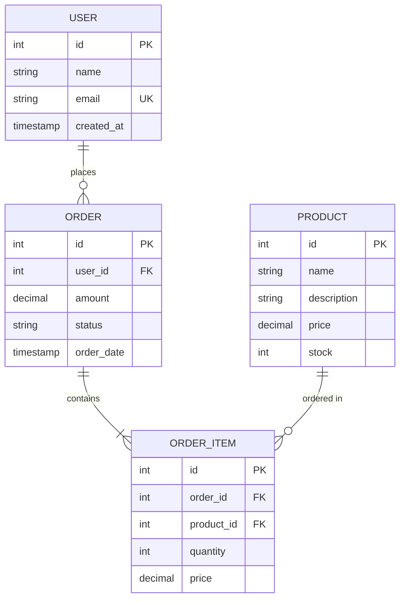
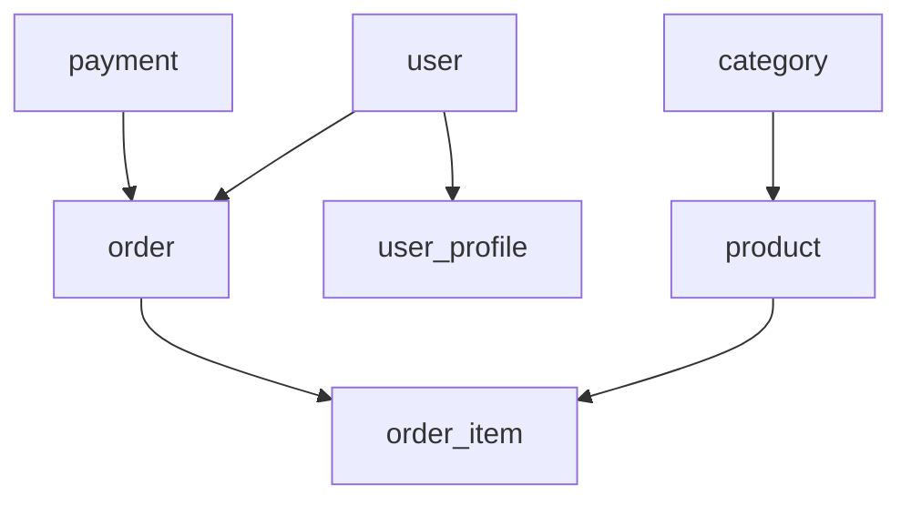

# DB詳細設計ガイドライン

## 1. はじめに

### 1.1 本ガイドラインの目的

本ガイドラインは、SES管理システムにおけるデータベース詳細設計の標準的な方針と手順を示すものである。開発チーム全体で一貫した高品質なデータベース設計を実現し、保守性・拡張性・性能に優れたシステムを構築することを目的とする。

### 1.2 適用範囲

本ガイドラインは、SES管理システムにおける以下の設計活動に適用される。

- データベース物理設計
- スキーマ設計
- テーブル・カラム設計
- 制約設計
- インデックス設計
- パーティション設計
- パフォーマンス最適化
- バックアップ・リカバリ設計
- 監視設計

### 1.3 前提条件

- PostgreSQL 17を採用
- マルチテナント方式ではなく、スキーマ分割によるモジュール分離を実施
- AWS RDSを本番環境として想定
- 「軽量モジュール詳細設計ドキュメント分割方針」に準拠した文書化を行う

### 1.4 関連ガイドライン

- [モジュール設計方針](/docs/00_ガイドライン/詳細設計/モジュール設計方針.md)
- [モジュールテンプレート](/docs/00_ガイドライン/詳細設計/module_template.md)
- [ADRテンプレート](/docs/00_ガイドライン/詳細設計/adr_template.md)

## 2. 基本方針

### 2.1 設計の基本原則

1. **業務要件の明確化**
   - 業務フローとデータ要件を明確に理解し設計に反映
   - ユースケースと要求クエリパターンを考慮

2. **保守性の確保**
   - 命名規則の統一
   - 適切なコメント・ドキュメント作成
   - 論理的な構造化と適切な正規化

3. **拡張性への配慮**
   - 将来の機能拡張を考慮した設計
   - データ量の増加に対応可能な構造
   - スキーマ変更の容易性

4. **性能の最適化**
   - 適切なインデックス設計
   - クエリ実行パターンを考慮したテーブル構造
   - 大量データ処理を考慮したパーティショニング

5. **セキュリティ確保**
   - データ保護機能の組み込み
   - アクセス制御の適切な設計
   - 監査証跡の確保

### 2.2 DB設計のアプローチ

1. **トップダウンアプローチとボトムアップアプローチの併用**
   - 要件定義・基本設計からの論理設計（トップダウン）
   - 実装・運用を考慮した物理設計の調整（ボトムアップ）

2. **反復的な設計プロセス**
   - 初期設計から継続的な改善
   - レビューと評価の繰り返し

3. **標準化とパターン化**
   - 設計パターンの活用
   - 共通機能の再利用

### 2.3 既存設計方針との整合性

本ガイドラインは、「軽量モジュール詳細設計ドキュメント分割方針」に定められた以下の原則と整合するように設計されている：

- 文書の肥大化防止
- メンテナンス性の向上
- 並行作業の効率化
- 変更影響範囲の最小化
- インターフェース定義による結合整合性の確保

## 3. DB詳細設計ドキュメント構成

DB詳細設計ドキュメントは以下の構成で作成する。「モジュール設計方針」に準拠し、管理しやすい粒度で分割する。

### 3.1 ドキュメント体系

- **DB詳細設計 基本ドキュメント**
  1. 概要
  2. 物理設計
  3. スキーマ設計
  4. データ型と制約
  5. インデックス設計
  6. パーティション設計
  7. PostgreSQL拡張機能
  8. パフォーマンス最適化
  9. バックアップリカバリ
  10. モニタリング設計

- **モジュール別テーブル定義補足**
  - 各業務モジュールごとの詳細なテーブル設計情報
  - サブフォルダ構造で整理し、テーブルグループごとにさらに分割

### 3.2 各ドキュメントの記載内容

#### 3.2.1 概要

- DB設計の基本方針
- システム概要とデータベース構成
- 環境構成（開発/テスト/本番）
- 全体アーキテクチャにおけるDBの位置づけ

#### 3.2.2 物理設計

- ハードウェア要件
- ストレージ構成
- メモリ設定
- プロセス設定
- 接続設定

#### 3.2.3 スキーマ設計

- スキーマ分割の考え方
- 各スキーマの責務と範囲
- スキーマ間連携方針
- 命名規則（スキーマ/テーブル/カラム/制約/インデックス）

#### 3.2.4 データ型と制約

- データ型選定基準
- 主要データ型の使用方針
- 標準的な制約設定
- ドメイン型/列挙型の活用方針

#### 3.2.5 インデックス設計

- インデックス種類と選定基準
- インデックス設計パターン
- モジュール別インデックス戦略
- インデックスメンテナンス方針

#### 3.2.6 パーティション設計

- パーティション対象テーブル選定基準
- パーティション方式の選定
- パーティション管理方針
- パーティション自動化戦略

#### 3.2.7 PostgreSQL拡張機能

- 利用する拡張機能一覧
- 拡張機能の選定理由と活用方法
- JSONB型の活用方針
- マテリアライズドビューの活用方針

#### 3.2.8 パフォーマンス最適化

- クエリパフォーマンス最適化方針
- テーブル設計時の最適化考慮点
- インデックス最適化戦略
- パラメータチューニング方針

#### 3.2.9 バックアップリカバリ

- バックアップ方式と頻度
- バックアップ保持期間
- リカバリ手順と目標復旧時間
- 障害時対応フロー

#### 3.2.10 モニタリング設計

- 監視項目と閾値
- アラート設定
- ログ管理方針
- パフォーマンス分析方法

### 3.3 モジュール別テーブル定義補足の構成

モジュール別テーブル定義補足は、「モジュール設計方針」に準拠し、以下の構成で作成する：

- **README.md**: 当該モジュールのテーブル設計概要と索引
- **01_概要.md**: テーブル構成の概要、テーブル関連図、主要テーブルの説明
- **02〜0N_{テーブルグループ名}.md**: 機能的に関連するテーブルグループごとに詳細を記述

各ファイルは500行程度を目安に分割し、相互参照リンクでナビゲーションを確保する。

### 3.3.1 テーブル定義補足のフォルダ構成

テーブル定義補足のファイル構成は以下のとおりです。各業務モジュール別に関連テーブルをグループ化して管理します。

#### 1. 共通モジュール `/docs/03_詳細設計/03_DB/テーブル定義補足/01_共通/`

- `01_認証認可.md` - 認証・認可関連テーブル
- `02_ユーザー管理.md` - ユーザー・権限管理テーブル
- `03_コード値.md` - コード値管理テーブル
- `04_ファイル管理.md` - ファイルストレージ関連テーブル
- `05_ロギング.md` - 各種ログ関連テーブル
- `06_通知.md` - 通知機能関連テーブル

#### 2. 技術者管理モジュール `/docs/03_詳細設計/03_DB/テーブル定義補足/02_技術者管理/`

- `01_基本情報.md` - 技術者基本情報テーブル
- `02_スキル.md` - スキル管理関連テーブル
- `03_稼働状況.md` - 稼働状況管理テーブル
- `04_スキルシート.md` - スキルシート管理テーブル

#### 3. 案件管理モジュール `/docs/03_詳細設計/03_DB/テーブル定義補足/03_案件管理/`

- `01_基本情報.md` - 案件基本情報テーブル
- `02_ステータス管理.md` - 案件ステータス管理テーブル
- `03_関連情報.md` - 案件関連情報テーブル

#### 4. マッチングモジュール `/docs/03_詳細設計/03_DB/テーブル定義補足/04_マッチング/`

- `01_マッチング検索.md` - マッチング検索関連テーブル
- `02_マッチング結果.md` - マッチング結果管理テーブル
- `03_提案管理.md` - 提案管理関連テーブル
- `04_提案書管理.md` - 提案書管理テーブル

#### 5. 契約管理モジュール `/docs/03_詳細設計/03_DB/テーブル定義補足/05_契約管理/`

- `01_契約基本.md` - 契約基本情報テーブル
- `02_契約書ドキュメント.md` - 契約書ドキュメント管理テーブル
- `03_電子署名.md` - 電子署名関連テーブル
- `04_契約テンプレート.md` - 契約テンプレート管理テーブル

#### 6. 勤怠工数管理モジュール `/docs/03_詳細設計/03_DB/テーブル定義補足/06_勤怠工数管理/`

- `01_勤怠管理.md` - 勤怠管理関連テーブル
- `02_工数管理.md` - 工数管理関連テーブル
- `03_承認管理.md` - 承認フロー関連テーブル
- `04_集計レポート.md` - 集計レポート関連テーブル

#### 7. 請求支払管理モジュール `/docs/03_詳細設計/03_DB/テーブル定義補足/07_請求支払管理/`

- `01_請求管理.md` - 請求管理関連テーブル
- `02_請求書管理.md` - 請求書ドキュメント管理テーブル
- `03_入金管理.md` - 入金管理関連テーブル
- `04_支払管理.md` - 支払管理関連テーブル
- `05_請求支払レポート.md` - 請求支払レポート関連テーブル

#### 8. レポーティングモジュール `/docs/03_詳細設計/03_DB/テーブル定義補足/08_レポーティング/`

- `01_KPIダッシュボード.md` - KPIダッシュボード関連テーブル
- `02_レポート管理.md` - レポート管理関連テーブル
- `03_データ収集.md` - データ収集関連テーブル
- `04_予測分析.md` - 予測分析関連テーブル
- `05_カスタムレポート.md` - カスタムレポート関連テーブル

## 4. DB詳細設計の作成手順

### 4.1 事前準備

1. 要件定義書と基本設計書の精査
2. 業務フローの理解と主要データフローの把握
3. データモデル概念設計の確認
4. 想定データ量と処理量の整理
5. 非機能要件（性能、可用性、保守性）の確認

### 4.2 設計手順

1. **スキーマ構成の設計**
   - 業務モジュールに応じたスキーマ分割
   - スキーマ間連携ルールの定義

2. **テーブル設計**
   - 主要エンティティの特定とテーブル定義
   - 正規化レベルの決定
   - テーブル構造の詳細化

3. **カラム設計**
   - 適切なデータ型の選定
   - カラム制約の定義
   - デフォルト値の検討

4. **制約設計**
   - 主キー/外部キー/一意制約の定義
   - チェック制約の実装
   - 参照整合性の確保

5. **インデックス設計**
   - 検索パターンの分析
   - 適切なインデックスタイプの選定
   - 複合インデックスの検討

6. **パーティション検討**
   - 大規模テーブルの特定
   - パーティション方式の選定
   - パーティション管理方法の定義

7. **パフォーマンス最適化**
   - 想定クエリのパフォーマンス評価
   - テーブル構造の最適化
   - インデックス戦略の調整

8. **バックアップリカバリ設計**
   - バックアップ方式と頻度の決定
   - リカバリ手順の定義
   - 障害時の対応フロー設計

9. **運用監視設計**
   - 監視項目と閾値の設定
   - アラート条件の定義
   - メンテナンス方法の策定

### 4.3 レビューと評価

1. **設計レビュー**
   - 業務要件との整合性確認
   - 設計原則との適合性評価
   - パフォーマンス要件の充足度確認

2. **プロトタイピングと評価**
   - 主要テーブルの作成とデータロード
   - 典型的なクエリパターンでのパフォーマンス測定
   - 結果に基づく設計の調整

3. **ドキュメント品質確認**
   - 記述の完全性と正確性
   - 分かりやすさと一貫性
   - 将来の保守を考慮した十分な情報

## 5. テーブル定義補足の作成ガイドライン

### 5.1 基本構成

モジュール別のテーブル定義補足は、各業務モジュールの特性を踏まえた詳細な設計情報を記載する。「モジュール設計方針」に準拠し、基本構成は以下の通りとする。

1. **テーブル概要**
   - モジュールの役割と機能概要
   - テーブル一覧と関連図
   - 主要テーブルの説明

2. **主要テーブル詳細**
   - テーブル定義（DDL）
   - カラム詳細説明
   - 制約とその意図
   - インデックスとその目的

3. **クエリパターンと最適化**
   - 代表的なクエリパターン
   - パフォーマンス最適化の工夫
   - 頻出結合パターン

4. **データメンテナンス**
   - 定期的なメンテナンス処理
   - 不整合データの検出と修正
   - アーカイブと削除ポリシー

5. **パフォーマンス最適化**
   - 特殊なインデックス戦略
   - パーティション設計（該当する場合）
   - データキャッシュ最適化

6. **セキュリティ考慮事項**
   - 機密データの保護
   - アクセス制御
   - 監査ログ

7. **運用時の注意点**
   - 特別な考慮が必要な操作
   - データ整合性維持のポイント
   - スケーリング時の注意点

### 5.2 記述のポイント

「モジュール設計方針」に準拠し、以下のポイントに留意して記述する：

- **簡潔性**: 冗長な説明を避け、必要な情報のみを記載する
- **明確さ**: 曖昧な表現を避け、具体的な記述を心がける
- **整合性**: 用語の統一と命名規則の一貫性を確保する
- **実装コードの扱い**: 詳細設計には実装コードを記載せず、擬似コードまたは説明文で表現する
- **図表の簡略化**: 複雑な図表を避け、テキストベースの表現を優先する

### 5.3 モジュール固有の考慮点

各業務モジュールで特に注意すべき点について補足する。

#### 共通モジュール

- ユーザー認証・認可の安全性確保
- マスターデータの整合性と参照効率
- 監査ログのパフォーマンスと保持期間
- 共通コンポーネントとしての再利用性

#### 技術者管理モジュール

- スキルデータの効率的な検索
- 稼働状況の時系列管理
- プロフィールデータのプライバシー保護
- 検索条件の多様性への対応

#### 案件管理モジュール

- 案件ライフサイクル管理の整合性
- 複雑な検索条件への対応
- 関連ドキュメントの効率的な管理
- 履歴データの適切な保持

#### マッチングモジュール

- 高速なマッチング検索の実現
- 複合条件によるスコアリング
- 提案管理の状態遷移追跡
- レコメンデーションデータの管理

#### 契約管理モジュール

- 契約データの整合性と監査証跡
- ドキュメントバージョン管理
- 電子署名データのセキュリティ
- 契約テンプレートの効率的な管理

#### 勤怠工数管理モジュール

- 日次・月次データの効率的な集計
- 承認フローの状態管理
- 履歴データのパーティショニング
- レポートデータ生成の最適化

#### 請求支払管理モジュール

- 金額データの整合性と精度確保
- 請求サイクル管理のデータ構造
- 会計データとの連携
- 履歴と監査証跡の維持

#### レポーティングモジュール

- 集計テーブルの設計と更新戦略
- 多次元分析のデータ構造
- マテリアライズドビューの活用
- 大量データ分析のパフォーマンス確保

### 5.4 テーブル定義補足のREADMEテンプレート

各モジュールのテーブル定義補足には、以下の構成のREADME.mdを配置する：

```markdown
# [モジュール名] テーブル定義補足

## 概要
[モジュールのテーブル設計の概要を3-5行で説明]

## テーブル構成

| テーブル名 | 説明 | 主要列 |
|----------|------|-------|
| テーブル1 | 説明文 | id, name, ... |
| テーブル2 | 説明文 | id, code, ... |
| ... | ... | ... |

## ドキュメント構成

| ドキュメント | 内容 | 最終更新日 |
|------------|------|----------|
| [01_概要](./01_概要.md) | テーブル構成の概要、関連図 | YYYY-MM-DD |
| [02_テーブルグループ1](./02_テーブルグループ1.md) | グループ1のテーブル詳細 | YYYY-MM-DD |
| ... | ... | ... |

## インターフェーステーブル

| テーブル名 | 連携モジュール | 概要 |
|----------|--------------|------|
| テーブル1 | モジュールA | 連携内容の説明 |
| テーブル2 | モジュールB | 連携内容の説明 |

## データ量見積もり

| テーブル名 | 想定レコード数 | 増加率 | 備考 |
|----------|--------------|-------|------|
| テーブル1 | 100,000 | 月5,000件 | ... |
| テーブル2 | 500,000 | 月20,000件 | ... |
```

## 6. 命名規則

### 6.1 基本ルール

- 全て小文字を使用（PostgreSQLの推奨）
- 単語区切りはアンダースコア（スネークケース）
- 略語は最小限とし、わかりやすい命名を優先
- 長すぎる名前は避ける（特にインデックス名）
- 英語の用語を使用（日本語ローマ字は避ける）

### 6.2 スキーマ命名

- 業務モジュールを表す簡潔な名前
- 例: `common`, `engineer`, `project`, `contract`

### 6.3 テーブル命名

- 単数形を基本とする
- 内容を適切に表す名詞または名詞句
- スキーマ名で修飾しない（重複しない）
- 例: `user`, `department`, `project_request`

### 6.4 特殊テーブル命名

- 関連テーブル: `テーブル1_テーブル2_rel`
- 履歴テーブル: `テーブル名_history`
- ログテーブル: `テーブル名_log`
- 一時テーブル: `tmp_目的`
- ビュー: `vw_目的`
- マテリアライズドビュー: `mvw_目的`

### 6.5 カラム命名

- 主キー: `id`
- 外部キー: `テーブル名_id`
- 日時型: `イベント_date`, `イベント_datetime`
- フラグ型: `is_状態`, `has_属性`
- カウント型: `項目_count`
- コード型: `項目_code`
- 名称型: `項目_name`
- JSON型: `項目_json`

### 6.6 制約命名

- 主キー制約: `pk_テーブル名`
- 外部キー制約: `fk_テーブル名_参照テーブル名`
- 一意制約: `uq_テーブル名_カラム名`
- チェック制約: `ck_テーブル名_チェック内容`

### 6.7 インデックス命名

- 主キーインデックス: `pk_テーブル名`（自動生成）
- 一意インデックス: `uix_テーブル名_カラム名`
- 非一意インデックス: `ix_テーブル名_カラム名`
- 複合インデックス: `ix_テーブル名_カラム1_カラム2`
- GINインデックス: `gin_テーブル名_カラム名`
- GiSTインデックス: `gist_テーブル名_カラム名`

## 7. ドキュメント作成の注意点

### 7.1 全般的な留意事項

「モジュール設計方針」に準拠し、以下の点に留意する：

- 設計の意図と背景を明確に記述
- 設計判断の理由を説明（特に標準から逸脱する場合）
- 将来の保守担当者を意識したわかりやすい説明
- 具体的なSQL例を含めて理解を促進
- 図表は最小限に抑え、テキストベースの表現を優先

### 7.2 記述の粒度

- 詳細すぎず、抽象的すぎない適切な粒度を維持
- 一般的な部分は簡潔に、特殊な部分は詳細に
- 他のドキュメントとの重複を最小化
- 参照すべき関連ドキュメントへのリンクを提供

### 7.3 更新管理

- 変更履歴を明確に記録
- 設計変更の理由と影響範囲を記述
- レビュー記録を残し、フィードバックの反映を確認
- 最新版の管理と過去版の保存を徹底

### 7.4 効率的な記述のための注意事項

「モジュール設計方針」に記載された以下の点に留意する：

- **実装コードの排除**: 詳細設計ドキュメントには実際の実装コードを記載しない
- **SQL実装コードの禁止**: DDL/DMLなどの具体的なSQL実装コードはドキュメントに記載せず、テーブル構造や制約、インデックスなどは表形式または擬似的な記法で表現する。例えば、以下のようにテーブル構造を表形式で記述する：

  | カラム名 | データ型 | NULL | デフォルト | 説明 |
  |---------|---------|------|-----------|------|
  | id | serial | NOT NULL | | 主キー |
  | name | varchar(100) | NOT NULL | | ユーザー名 |
  | email | varchar(255) | NOT NULL | | メールアドレス |
  | created_at | timestamp | NOT NULL | CURRENT_TIMESTAMP | 作成日時 |

  **制約**:
  - PRIMARY KEY (id)
  - UNIQUE (email)
  - CHECK (length(name) > 0)

  **インデックス**:
  - ix_user_name (name)
  - ix_user_email (email)
- **擬似コード**: 必要な場合は擬似コードで表現し、実装言語の具体的な構文は避ける
- **フローチャート**: 複雑なロジックは簡略化されたフローチャートまたは文章で表現
- **インターフェース記述のみ**: 実装詳細ではなく、インターフェース仕様、メソッドシグネチャ、データモデルの構造に焦点を当てる
- **アルゴリズム説明**: コードではなく、処理フローや条件分岐を文章で説明する

### 7.5 Mermaid記法による図表表現

テーブル関連図やER図の表現には、Mermaid記法を使用することを推奨します。Mermaid記法はテキストベースでバージョン管理がしやすく、GitHubやMarkdownエディタで直接表示できる利点があります。

#### 7.5.1 Mermaid記法によるER図の例

```


#### 7.5.2 Mermaid記法によるテーブル関連図の例

```


このように、テキストベースの図表表現を使用することで、バージョン管理システムでの差分確認が容易になり、ドキュメントの保守性が向上します。

## 8. よくある設計課題と対応

### 8.1 柔軟性と性能のバランス

- **課題**: 将来の変更に対応する柔軟性と現在の性能要求のバランス
- **対応**: 
  - 変更頻度に応じた正規化レベルの調整
  - 拡張性を考慮したカラム設定（例：JSON型の活用）
  - パフォーマンスクリティカルな部分の特定と最適化

### 8.2 データ量増加への対応

- **課題**: データ量増加に伴うパフォーマンス低下
- **対応**:
  - 初期段階からのパーティショニング設計
  - 効率的なインデックス戦略の策定
  - アーカイブポリシーの明確化
  - 集計テーブルやマテリアライズドビューの活用

### 8.3 複雑な検索要件への対応

- **課題**: 多様な検索条件と高速レスポンスの両立
- **対応**:
  - 検索パターンの詳細分析と優先順位付け
  - 複合インデックスと部分インデックスの適切な設計
  - 全文検索機能の効果的な活用
  - 検索専用のデータ構造の検討

### 8.4 マスターデータ管理

- **課題**: コード値や設定値の一貫性維持と効率的な参照
- **対応**:
  - 集中管理された共通マスターテーブル設計
  - バージョン管理と有効期間の適切な設計
  - キャッシュ戦略の実装
  - 参照整合性の確保と柔軟性のバランス

### 8.5 履歴データの管理

- **課題**: 履歴データの肥大化と検索効率の両立
- **対応**:
  - 時間軸パーティショニングの採用
  - 適切な保持期間とアーカイブポリシーの設定
  - 履歴クエリの最適化パターンの確立
  - 集約履歴の検討（詳細履歴と要約履歴の分離）

## 9. ストアドプロシージャの設計

### 9.1 ストアドプロシージャの基本方針

PostgreSQLのストアドプロシージャ（関数）を利用する場合、以下の基本方針に従って設計・ドキュメント化します：

1. **使用条件**: 以下の場合にのみストアドプロシージャを使用
   - 複雑なトランザクション処理
   - パフォーマンスクリティカルな集計処理
   - バッチ処理のパフォーマンス最適化
   - テーブル間の整合性確保が必要な処理

2. **使用制限**: 以下の場合はストアドプロシージャの使用を避ける
   - 単純なCRUD操作
   - アプリケーションロジックの実装
   - 頻繁に変更が発生する業務ロジック

3. **言語選択**:
   - 基本的にはPL/pgSQLを使用
   - 高度な計算処理が必要な場合はPL/Pythonを検討
   - SQL言語のみのSQLファンクションを優先的に検討

### 9.2 ストアドプロシージャのインターフェース定義

ストアドプロシージャのインターフェースは以下の形式で記述します：

```
【ストアドプロシージャ名】 calculate_monthly_statistics

【目的】
月次の統計データを集計し、サマリーテーブルに格納する

【入力パラメータ】
- p_year INTEGER: 対象年（必須）
- p_month INTEGER: 対象月（必須）
- p_department_id INTEGER: 部門ID（任意、NULLの場合は全部門）

【出力パラメータ】
- 戻り値: INTEGER（処理した件数）

【処理概要】
1. 対象年月の部門別稼働データを集計
2. 部門ごとの合計、平均、最大、最小値を算出
3. statistics_monthlyテーブルに結果を格納
4. 既存データが存在する場合は更新、存在しない場合は挿入

【呼び出し元】
- 月次バッチ処理（batch_manager.monthly_statistics_job）

【非機能要件】
- 実行時間目標: 5分以内（10万レコード処理時）
- トランザクション: 必須
- 並行実行: 同一年月に対する並行実行は排他制御が必要

【エラーハンドリング】
- パラメータ不正: エラーコード-1を返却
- データ不整合: エラーコード-2を返却
- ロック競合: エラーコード-3を返却
```

各ストアドプロシージャはこのインターフェース定義に従って設計し、ドキュメント化します。実際のSQL実装コードは記載せず、処理内容は擬似的なフローで記述します。

### 9.3 ストアドプロシージャのドキュメント管理

ストアドプロシージャのドキュメントは、以下の方針で管理します：

1. **格納場所**:
   - 機能モジュールに関連するストアドプロシージャは、該当モジュールのテーブル定義補足ドキュメント内に記載
   - 複数モジュールにまたがるストアドプロシージャは `/docs/03_詳細設計/03_DB/ストアドプロシージャ.md` に記載

2. **命名規則**:
   - スネークケースを使用（例: `calculate_monthly_statistics`）
   - 処理内容を表す動詞で開始（例: `calculate_`, `update_`, `validate_`）
   - スキーマ名で修飾しない
   - 複数のバージョンが存在する場合は接尾辞でバージョン番号を付加（例: `calculate_statistics_v2`）

3. **ストアドプロシージャ一覧表**:
   各モジュールには以下のようなストアドプロシージャ一覧表を含めます：

   | 名前 | 目的 | 入力パラメータ | 出力 | 呼び出し元 | 重要度 |
   |-----|------|--------------|------|----------|--------|
   | calculate_monthly_statistics | 月次統計計算 | 年、月、部門ID | 処理件数 | 月次バッチ | 高 |
   | update_employee_status | 従業員状態更新 | 従業員ID、状態コード | 成功/失敗 | 従業員管理画面 | 中 |
   | validate_contract_data | 契約データ検証 | 契約ID | 検証結果配列 | 契約登録処理 | 高 |

4. **バージョン管理**:
   - ストアドプロシージャの変更履歴を記録
   - 互換性に影響する変更は新バージョンとして作成
   - 非推奨（Deprecated）の関数は明示的に記録

## 10. 品質確認チェックリスト

DB詳細設計のレビュー時に以下のチェックリストを活用し、品質を確保する。

### 10.1 基本設計との整合性

- [ ] 概念データモデルと物理モデルの対応が明確か
- [ ] 業務要件が適切にテーブル構造に反映されているか
- [ ] 必要なデータ項目が漏れなく定義されているか
- [ ] データフローに沿ったテーブル間の関連が適切か

### 9.2 命名規則の遵守

- [ ] スキーマ、テーブル、カラム名が命名規則に準拠しているか
- [ ] 制約、インデックス名が命名規則に準拠しているか
- [ ] 略語や専門用語が一貫して使用されているか
- [ ] 名前から内容が適切に推測できるか

### 9.3 データ型の適切性

- [ ] 各カラムに適切なデータ型が選択されているか
- [ ] 数値精度が業務要件を満たしているか
- [ ] 日付/時刻型の選択が適切か
- [ ] 文字列長が適切に設定されているか

### 9.4 制約の妥当性

- [ ] 必要な主キー制約が定義されているか
- [ ] 外部キー制約による参照整合性が確保されているか
- [ ] 業務ルールを反映したCHECK制約が定義されているか
- [ ] 一意性制約が適切に設定されているか

### 9.5 インデックス設計

- [ ] 主要な検索条件に対応するインデックスが設計されているか
- [ ] 結合条件に対するインデックスが考慮されているか
- [ ] インデックスの過剰設定を避けているか
- [ ] 複合インデックスの列順序が最適化されているか

### 9.6 パフォーマンス考慮

- [ ] 大量データテーブルのパーティション戦略が検討されているか
- [ ] 頻出クエリのパフォーマンスが考慮されているか
- [ ] 非正規化や集計テーブルの必要性が検討されているか
- [ ] トランザクション量を考慮した設計になっているか

### 9.7 セキュリティ考慮

- [ ] 機密データの保護対策が考慮されているか
- [ ] アクセス制御の仕組みが設計されているか
- [ ] 監査証跡の記録方法が定義されているか
- [ ] セキュリティリスクへの対応策が検討されているか

### 9.8 運用性

- [ ] バックアップ/リカバリの方法が明確か
- [ ] 監視項目と閾値が適切に設定されているか
- [ ] メンテナンス手順が定義されているか
- [ ] 障害時の対応フローが明確か

### 9.9 ドキュメント品質

- [ ] 「モジュール設計方針」に準拠した分割と構成になっているか
- [ ] ファイルサイズが適切に管理されているか（500行程度を目安）
- [ ] 相互参照が適切に設定されているか
- [ ] 表現が簡潔かつ明確か
- [ ] SQL実装コードが記載されておらず、テーブル定義などは表形式で表現されているか

## 10. 参考情報

### 10.1 推奨参考文献

- "PostgreSQL: 高性能/高可用性ガイド"
- "実践的データベース設計"
- "SQLアンチパターン"
- "PostgreSQL 14アドミニストレーションクックブック"

### 10.2 関連ガイドライン

- アプリケーション開発ガイドライン
- 非機能要件定義ガイドライン
- コーディング規約
- テスト計画ガイドライン

### 10.3 サポートリソース

- PostgreSQL公式ドキュメント: https://www.postgresql.org/docs/
- AWS RDSガイド: https://docs.aws.amazon.com/rds/
- プロジェクト内のDB専門チームへの問い合わせ