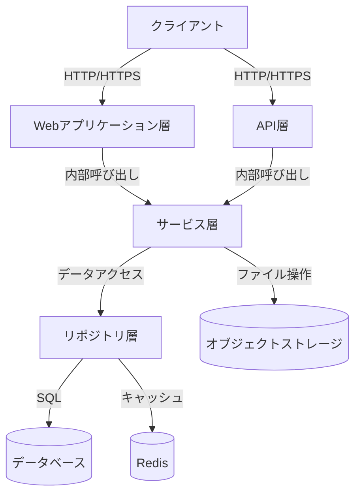
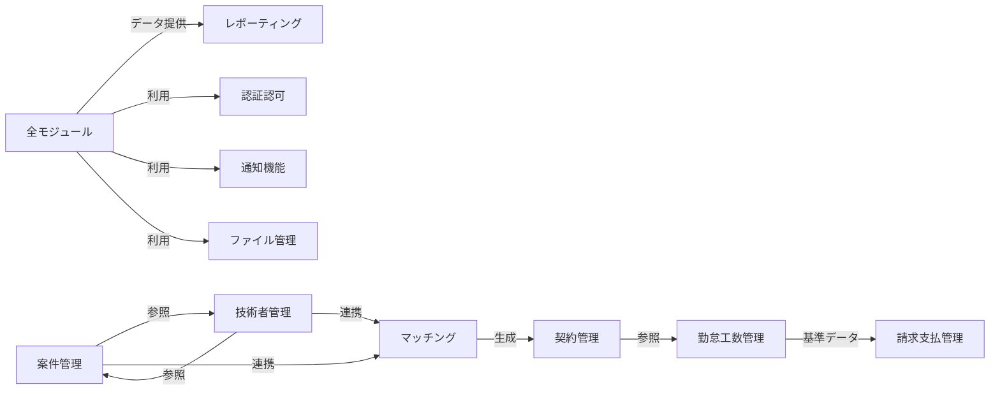
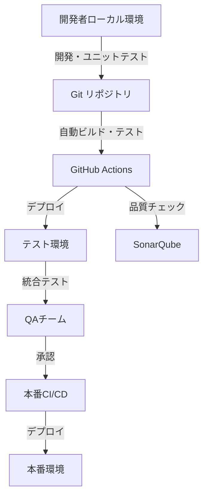

# SES業務システム アーキテクチャ設計書

## 1. 全体アーキテクチャ

### 1.1 アーキテクチャ概要

SES業務システムは、モノリシックアーキテクチャを採用し、論理的に分離された機能モジュールを備えた多層構造で構成されます。この設計により、開発効率、保守性、および将来的な拡張性のバランスを取りつつ、ビジネス要件を効率的に実現します。



### 1.2 レイヤー構成

- **プレゼンテーション層**
  - Web UI（Thymeleaf, Bootstrap）
  - RESTful API（Spring MVC）
  - レスポンシブデザイン対応

- **アプリケーション層**
  - コントローラー（Spring MVC）
  - サービス（Spring Service）
  - DTOとバリデーション

- **ドメイン層**
  - ドメインモデル
  - ドメインサービス
  - ビジネスロジック

- **データアクセス層**
  - リポジトリ（Spring Data JDBC）
  - クエリサービス
  - トランザクション管理

- **共通基盤層**
  - 認証・認可（Spring Security）
  - 例外処理
  - ロギング
  - キャッシュ管理
  - ファイル管理

### 1.3 モジュール構成

SES業務システムは以下の主要モジュールから構成されます。

#### 1.3.1 業務モジュール

| モジュール名 | 説明 | 主要機能 |
|------------|------|---------|
| 案件管理 | クライアントからの案件情報を管理 | 案件登録、案件検索、進捗管理、案件分析 |
| 技術者管理 | 自社エンジニアの情報を管理 | 技術者登録、スキル管理、稼働状況管理、キャリア管理 |
| マッチング | 案件と技術者のマッチングを支援 | マッチング検索、提案管理、AI推薦、適合度分析 |
| 契約管理 | 契約に関する情報を管理 | 契約作成、電子署名連携、契約更新管理、契約書管理 |
| 勤怠・工数管理 | 技術者の勤怠と工数を管理 | 勤怠入力、工数入力、承認フロー、実績集計 |
| 請求・支払管理 | 請求書発行と支払処理を管理 | 請求書発行、入金管理、支払処理、税務管理 |
| レポーティング | 経営分析とレポート生成 | ダッシュボード、KPI分析、予測分析、レポート出力 |

#### 1.3.2 共通基盤モジュール

| モジュール名 | 説明 | 主要コンポーネント |
|------------|------|-----------------|
| 認証・認可 | ユーザー認証と権限管理 | AuthController, SecurityConfig, UserDetailsService |
| 通知機能 | システム内外の通知機能 | NotificationController, EmailService, NotificationService |
| ファイル管理 | ドキュメント管理 | FileController, StorageService, FileRepository |
| コード値管理 | コード値の一元管理 | CodeController, CodeService, CodeRepository |
| エラー処理 | 統一的なエラー処理 | GlobalExceptionHandler, ErrorResponseBuilder |

#### 1.3.3 モジュール間の連携

モノリシックアーキテクチャ内の各モジュール間の連携は以下の方法で実現します：

- **直接メソッド呼び出し**: Spring DIを用いたコンポーネント間の直接呼び出し
- **内部イベント通知**: Spring ApplicationEventを使用したイベント駆動連携
- **共有データモデル**: 適切に設計されたデータモデルによる情報共有



## 2. 技術スタックと標準パターン

### 2.1 採用技術スタック

| レイヤー | 採用技術 | 選定理由 |
|---------|---------|---------|
| フロントエンド | Thymeleaf, Bootstrap, jQuery | サーバーサイドレンダリングの実績、開発効率 |
| バックエンド | Spring Boot 3.2.x, Java 21 | 安定性、エコシステムの充実、最新機能の活用 |
| データアクセス | Spring Data JDBC | 軽量性、単純明快なデータアクセス、パフォーマンス |
| データベース | PostgreSQL 17 | 高信頼性、拡張性、オープンソース |
| キャッシュ | Redis | 高速性、多様なデータ構造、運用実績 |
| ストレージ | MinIO (S3互換) | オブジェクトストレージとしての柔軟性、拡張性 |
| 認証基盤 | Spring Security, JWT | セキュリティの堅牢性、拡張性、標準対応 |
| テスト | JUnit 5, Mockito, TestContainers | 包括的なテスト環境、CI/CD連携の容易さ |
| 開発環境 | Docker, GitHub Actions | 環境の一貫性、自動化による品質担保 |
| 監視・ログ | Prometheus, Grafana, ELK Stack | 可視性確保、運用安定性 |

### 2.2 標準実装パターン

#### 2.2.1 レイヤードアーキテクチャの実装

```
Controller -> Service -> Repository -> DataSource
```

- **Controller**: HTTPリクエストを受け付け、入力検証、レスポンス形成を担当
- **Service**: ビジネスロジックを実装、トランザクション境界を定義
- **Repository**: データアクセスの抽象化、データ永続化を担当
- **エンティティ/ドメインモデル**: データとビジネスルールをカプセル化

#### 2.2.2 RESTful APIの設計原則

- リソース指向のURI設計（例: `/api/v1/engineers/{id}`）
- HTTPメソッドの適切な使用（GET, POST, PUT, DELETE）
- 標準的なステータスコードの使用（200, 201, 400, 404, 500など）
- 一貫したレスポンス形式（成功、エラー時の統一フォーマット）
- ページネーション、フィルタリング、ソートの標準化
- バージョニング戦略（URLパスベース）

#### 2.2.3 データアクセスパターン

- リポジトリパターンによるデータアクセス層の抽象化
- Spring Data JDBCを活用した簡素なデータアクセス
- クエリメソッド命名規則の統一
- 必要に応じたカスタムクエリの実装（@Query）
- 楽観的ロック（@Version）による同時更新制御
- 監査情報の自動管理（@CreatedDate, @LastModifiedDate）

#### 2.2.4 例外処理パターン

- グローバル例外ハンドラー（@ControllerAdvice）による一貫した例外処理
- 業務例外と技術例外の分離
- 階層化された例外クラス設計
- エラーコードと多言語メッセージの連携

### 2.3 命名規則

- **パッケージ名**: `jp.co.example.sesapp.[モジュール名].[レイヤー名]`
  - 例: `jp.co.example.sesapp.engineer.controller`

- **クラス名**:
  - コントローラー: `[機能名]Controller`（例: `EngineerController`）
  - サービス: `[機能名]Service`（例: `EngineerService`）
  - リポジトリ: `[機能名]Repository`（例: `EngineerRepository`）
  - エンティティ: 単数形の名詞（例: `Engineer`）
  - DTO: 用途に応じた命名（例: `EngineerResponse`, `CreateEngineerRequest`）

- **メソッド名**:
  - 取得系: `findBy[条件]`, `getBy[条件]`
  - 作成系: `create[エンティティ]`, `register[エンティティ]`
  - 更新系: `update[エンティティ]`
  - 削除系: `delete[エンティティ]`, `remove[エンティティ]`
  
- **変数名**: キャメルケース（例: `engineerId`, `userProfile`）
- **定数名**: 大文字スネークケース（例: `MAX_RETRY_COUNT`, `DEFAULT_PAGE_SIZE`）
- **データベース**: スネークケース
  - テーブル名: 複数形または `t_[エンティティ名]`（例: `engineers`, `t_engineer`）
  - カラム名: スネークケース（例: `first_name`, `created_at`）

## 3. 共通機能

### 3.1 認証・認可

Spring Securityを核とした認証・認可機能を実装します。

- **認証方式**: JWTトークンベースの認証
- **認可方式**: ロールベースアクセス制御（RBAC）
- **主要コンポーネント**:
  - `SecurityConfig`: セキュリティ設定
  - `JwtAuthenticationFilter`: JWT認証フィルター
  - `JwtTokenProvider`: トークン生成・検証
  - `UserDetailsServiceImpl`: ユーザー情報取得
  - `AuthenticationController`: 認証API

```java
@Configuration
@EnableWebSecurity
public class SecurityConfig {
    @Autowired
    private JwtTokenProvider jwtTokenProvider;
    
    @Bean
    public SecurityFilterChain filterChain(HttpSecurity http) throws Exception {
        http
            .csrf().disable()
            .sessionManagement().sessionCreationPolicy(SessionCreationPolicy.STATELESS)
            .and()
            .authorizeHttpRequests(authorize -> authorize
                .requestMatchers("/api/v1/auth/**").permitAll()
                .requestMatchers("/api/v1/public/**").permitAll()
                .requestMatchers("/api/v1/admin/**").hasRole("ADMIN")
                .anyRequest().authenticated()
            )
            .addFilterBefore(new JwtAuthenticationFilter(jwtTokenProvider), 
                UsernamePasswordAuthenticationFilter.class);
        
        return http.build();
    }
}
```

### 3.2 トランザクション管理

- **トランザクション境界**: Serviceレイヤーのメソッドレベルでトランザクション境界を設定
- **トランザクション管理戦略**:
  - 読み取り専用操作: `@Transactional(readOnly = true)`
  - 書き込み操作: `@Transactional`
  - 伝搬設定: デフォルトでは `REQUIRED`
  - タイムアウト設定: 長時間トランザクションには適切なタイムアウト

```java
@Service
public class EngineerService {
    @Transactional(readOnly = true)
    public EngineerDto findById(Long id) {
        // 読み取り専用操作
    }
    
    @Transactional
    public EngineerDto create(EngineerCreateDto dto) {
        // トランザクション内での書き込み操作
    }
    
    @Transactional(timeout = 30)
    public void bulkUpdate(List<EngineerUpdateDto> dtos) {
        // 大量データ処理（タイムアウト30秒）
    }
}
```

### 3.3 例外処理

構造化された例外階層と一貫した例外ハンドリングメカニズムを実装します。

- **例外クラス階層**:
  - `BaseException`: すべての例外の基底クラス
  - `BusinessException`: ビジネスルール違反など業務例外
  - `SystemException`: システム内部エラーなど技術例外
  - 具体的な例外: `ResourceNotFoundException`, `ValidationException` など

- **グローバル例外ハンドラー**:
  ```java
  @ControllerAdvice
  public class GlobalExceptionHandler {
      @ExceptionHandler(ResourceNotFoundException.class)
      public ResponseEntity<ErrorResponse> handleResourceNotFound(ResourceNotFoundException ex) {
          ErrorResponse error = new ErrorResponse(
              "RESOURCE_NOT_FOUND", 
              ex.getMessage(),
              HttpStatus.NOT_FOUND.value()
          );
          return new ResponseEntity<>(error, HttpStatus.NOT_FOUND);
      }
      
      // 他の例外ハンドラーメソッド
  }
  ```

- **エラーコード体系**:
  - `VALIDATION_ERROR`: バリデーションエラー
  - `RESOURCE_NOT_FOUND`: リソースが見つからない
  - `BUSINESS_RULE_VIOLATION`: ビジネスルール違反
  - `AUTHENTICATION_ERROR`: 認証エラー
  - `AUTHORIZATION_ERROR`: 認可エラー
  - `SYSTEM_ERROR`: システムエラー

### 3.4 ロギング

構造化ログを実装し、トレーサビリティと運用監視を強化します。

- **ログレベル**:
  - ERROR: 復旧に運用介入が必要なエラー
  - WARN: 注意が必要な状況
  - INFO: 主要な操作（リクエスト／レスポンス、処理開始・終了など）
  - DEBUG: 詳細なデバッグ情報（開発環境のみ）
  - TRACE: 最も詳細な情報（必要時のみ）

- **構造化ロギング**:
  ```java
  @Slf4j
  @RestController
  @RequestMapping("/api/v1/engineers")
  public class EngineerController {
      @GetMapping("/{id}")
      public ResponseEntity<EngineerDto> getById(@PathVariable Long id) {
          MDC.put("engineerId", id.toString());
          MDC.put("operation", "ENGINEER_GET");
          
          log.info("Engineer detail request received for ID: {}", id);
          
          try {
              EngineerDto engineer = engineerService.findById(id);
              log.info("Engineer detail retrieved successfully");
              return ResponseEntity.ok(engineer);
          } catch (Exception e) {
              log.error("Failed to retrieve engineer: {}", e.getMessage(), e);
              throw e;
          } finally {
              MDC.clear();
          }
      }
  }
  ```

- **監査ログ**:
  - 重要な操作（認証、データ作成・更新・削除）
  - 操作者、操作日時、操作内容、IPアドレスなどを記録
  - 専用のAOP（Aspect Oriented Programming）による自動監査ログ記録

## 4. 非機能要件への対応

### 4.1 セキュリティ対策

- **認証認可**: Spring Security + JWTによる堅牢な認証基盤
- **CSRF対策**: APIではトークンベース認証を使用し、必要に応じてCSRF保護
- **XSS対策**: 
  - 入力値の適切なエスケープ処理
  - Content-Security-Policy (CSP) ヘッダーの設定
  - HTTPOnly フラグ付きCookieの使用
- **SQLインジェクション対策**:
  - PreparedStatementの使用
  - Spring Data JDBCによるパラメータ化
  - バリデーションによる入力値検証
- **機密情報保護**:
  - 個人情報の暗号化保存
  - パスワードのハッシュ化（BCrypt）
  - 機密データのマスキング（ログ表示時など）

### 4.2 パフォーマンス対策

- **キャッシュ戦略**:
  - 参照頻度の高いデータをRedisでキャッシュ
  - Spring Cache抽象化による透過的なキャッシュ
  - キャッシュの適切な無効化戦略

- **N+1問題の解決**:
  - 適切なプリフェッチクエリの使用
  - Spring Data JDBCでの結合クエリ最適化
  - 必要に応じたバッチローディング

- **大量データ処理**:
  - ページネーション処理の徹底
  - バッチ処理による効率化
  - 非同期処理による応答性確保

### 4.3 可用性確保

- **障害検知**:
  - Prometheusによるメトリクス監視
  - ヘルスチェックエンドポイント提供
  - 異常検知による早期警告

- **自動復旧**:
  - サーバー障害時の自動再起動
  - 冗長構成による可用性確保
  - グレースフルシャットダウン

- **運用継続性**:
  - バックアップと復旧プラン
  - フェイルオーバー仕組み
  - 保守・運用マニュアル整備

## 5. 開発・テスト方針

### 5.1 開発環境構成



- **ローカル開発環境**:
  - Docker Composeによる依存サービス実行
  - Spring Boot DevTools活用
  - 統合開発環境（IntelliJ IDEA推奨）

### 5.2 テスト戦略

| テスト種別 | フレームワーク | 範囲 | 自動化 |
|----------|---------------|------|-------|
| 単体テスト | JUnit 5, Mockito | メソッド/クラスレベル | CI/CD & 開発者実行 |
| 統合テスト | Spring Boot Test, TestContainers | コンポーネント間連携 | CI/CD |
| API テスト | RestAssured | REST API エンドポイント | CI/CD |
| E2E テスト | Playwright | ユーザーワークフロー | 定期実行 |

- **品質目標**:
  - コードカバレッジ: 80%以上
  - 技術的負債: 5%未満
  - バグ検出率: 重大度「高」以上のバグは0件

### 5.3 CI/CD

- **ビルドパイプライン**:
  1. ソースコードチェックアウト
  2. 依存関係解決
  3. ビルド
  4. 単体テスト実行
  5. 統合テスト実行
  6. 静的コード解析
  7. 品質ゲートチェック
  8. アーティファクト生成
  9. テスト環境デプロイ

- **品質ゲート**:
  - テスト成功率: 100%
  - コードカバレッジ閾値: 80%
  - 重大度「高」以上の問題: 0件
  - コードスメル: 標準に基づく閾値

- **デプロイ戦略**:
  - ステージングでの検証後、手動承認による本番デプロイ
  - Blue/Greenデプロイメントによる無停止アップデート
  - ロールバック計画の整備

## 6. 参照情報

- [基本設計書：システムアーキテクチャ](/docs/02_基本設計/システム設計/03_システムアーキテクチャ.html)
- [ADR-001: レイヤードアーキテクチャ採用](/docs/02_詳細設計/08_ADR/adr-001-レイヤードアーキテクチャ採用.md)
- [ADR-002: Spring Data JDBC採用](/docs/02_詳細設計/08_ADR/adr-002-Spring-Data-JDBC採用.md)
- [ADR-003: JWT認証採用](/docs/02_詳細設計/08_ADR/adr-003-JWT認証採用.md)
- [Spring Framework Documentation](https://docs.spring.io/spring-framework/docs/current/reference/html/)
- [Spring Boot Documentation](https://docs.spring.io/spring-boot/docs/current/reference/htmlsingle/)
- [Spring Security Documentation](https://docs.spring.io/spring-security/reference/index.html)
- [Spring Data JDBC Documentation](https://docs.spring.io/spring-data/jdbc/docs/current/reference/html/)