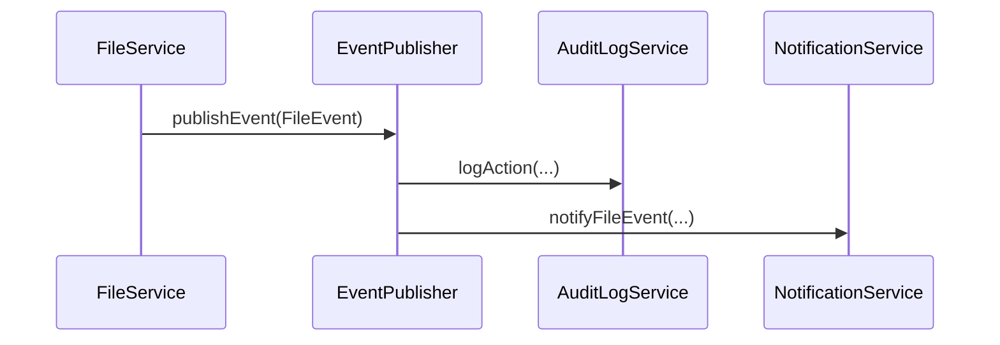
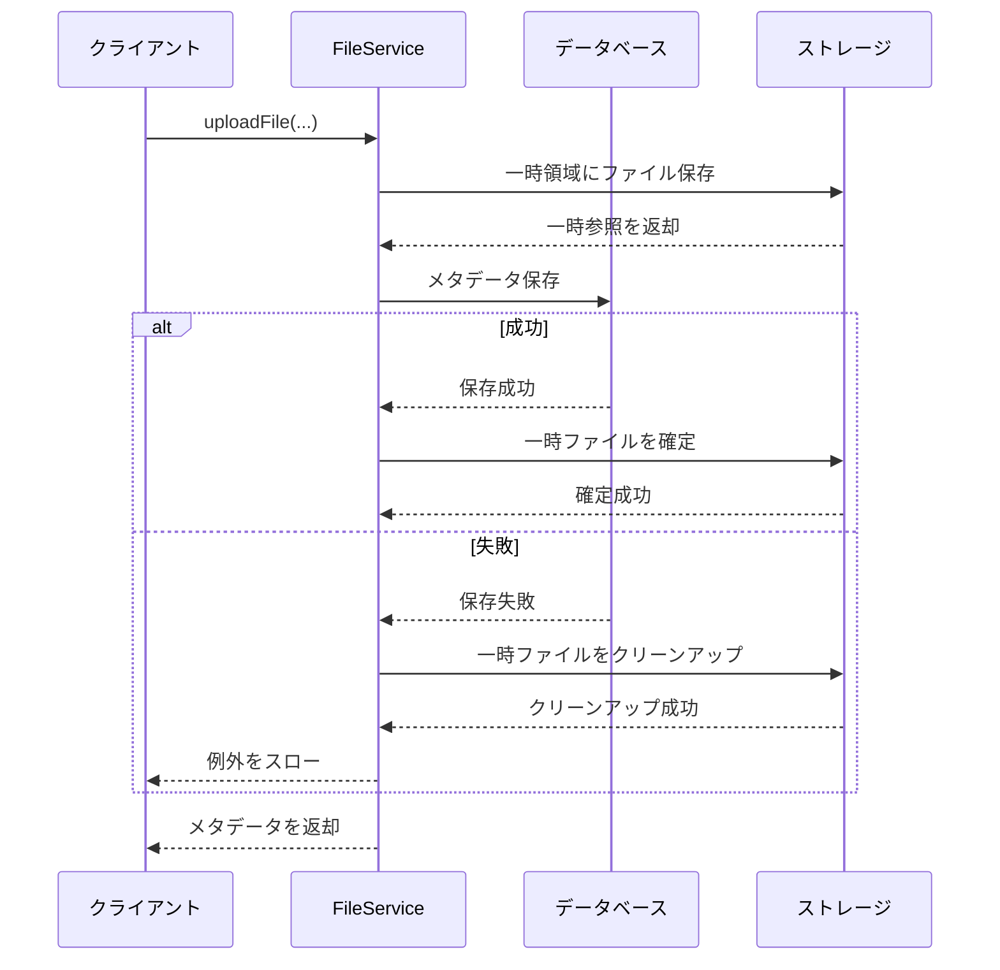

# ファイル管理機能 インターフェース定義

## 1. 概要

本ドキュメントでは、ファイル管理機能が提供するインターフェースと、外部システムからの依存インターフェースを定義します。これらのインターフェースは、ファイル管理機能を他のモジュールと統合するための主要な契約となります。

## 2. 提供インターフェース

### 2.1 FileService

ファイル管理機能の主要なエントリポイントとなるサービスインターフェースです。他のモジュールはこのインターフェースを通じてファイル管理機能を利用します。

**FileService インターフェース**

FileServiceは、ファイル管理機能の主要なエントリポイントとなるサービスインターフェースです。

**主要メソッド**

- **uploadFile**: ファイルをアップロードし、メタデータを返却
  - 引数: ファイル内容、ファイル名、コンテンツタイプ、モジュールコード、エンティティID、属性
  - 戻り値: アップロードされたファイルのメタデータ
  - 例外: 処理エラー時、権限不足時

- **downloadFile**: ファイルをダウンロード
  - 引数: ファイルID
  - 戻り値: ファイルコンテンツ（見つからない場合はEmpty）
  - 例外: 処理エラー時、権限不足時

- **getFileMetadata**: ファイルのメタデータを取得
  - 引数: ファイルID
  - 戻り値: ファイルメタデータ（見つからない場合はEmpty）
  - 例外: 権限不足時

- **findFilesByEntityReference**: エンティティに関連付けられたファイルを検索
  - 引数: モジュールコード、エンティティID
  - 戻り値: 関連ファイルのメタデータリスト
  - 例外: 権限不足時

- **searchFiles**: 検索条件に基づいてファイルを検索
  - 引数: 検索条件、ページネーション情報
  - 戻り値: 検索結果（ページング）
  - 例外: 権限不足時

- **deleteFile**: ファイルを論理削除
  - 引数: ファイルID
  - 例外: ファイル未検出時、権限不足時

- **updateFileAttributes**: ファイルのカスタム属性を更新
  - 引数: ファイルID、更新する属性マップ
  - 戻り値: 更新されたファイルメタデータ
  - 例外: ファイル未検出時、権限不足時

- **grantPermission**: ファイルへのアクセス権限を付与
  - 引数: ファイルID、権限主体タイプ、権限主体ID、権限種別、有効期限
  - 戻り値: 付与された権限情報
  - 例外: ファイル未検出時、権限不足時

- **revokePermission**: ファイルアクセス権限を削除
  - 引数: 権限ID
  - 例外: 権限未検出時、権限不足時
```

### 2.2 FileVersionService

ファイルのバージョン管理に関するサービスインターフェースです。

**FileVersionService インターフェース**

FileVersionServiceは、ファイルのバージョン管理に関するサービスインターフェースです。

**主要メソッド**

- **createNewVersion**: 新しいファイルバージョンを作成
  - 引数: ファイルID、新しいファイル内容、バージョンコメント
  - 戻り値: 作成された新バージョンの情報
  - 例外: ファイル未検出時、権限不足時

- **getVersion**: ファイルの特定バージョンを取得
  - 引数: ファイルID、バージョン番号
  - 戻り値: 特定バージョンのファイル内容（見つからない場合はEmpty）
  - 例外: 権限不足時

- **getVersionHistory**: ファイルの全バージョン履歴を取得
  - 引数: ファイルID
  - 戻り値: バージョン履歴のリスト
  - 例外: ファイル未検出時、権限不足時

- **revertToVersion**: 指定されたバージョンにファイルを戻す
  - 引数: ファイルID、バージョン番号
  - 戻り値: 更新されたファイルメタデータ
  - 例外: ファイル未検出時、バージョン未検出時、権限不足時
```

### 2.3 REST API エンドポイント

ファイル管理機能は以下のREST APIエンドポイントを提供します。

#### 2.3.1 ファイル基本操作API

| メソッド | パス | 説明 | リクエスト | レスポンス | ステータスコード |
|--------|-----|------|-----------|-----------|--------------|
| POST | /api/files | ファイルアップロード | multipart/form-data | FileMetadataDTO | 201 Created |
| GET | /api/files/{id} | ファイルダウンロード | - | ファイルストリーム | 200 OK, 404 Not Found |
| GET | /api/files/{id}/metadata | ファイルメタデータ取得 | - | FileMetadataDTO | 200 OK, 404 Not Found |
| PUT | /api/files/{id}/attributes | ファイル属性更新 | Map<String, String> | FileMetadataDTO | 200 OK, 404 Not Found |
| DELETE | /api/files/{id} | ファイル削除 | - | - | 204 No Content, 404 Not Found |
| GET | /api/files/search | ファイル検索 | FileSearchCriteriaDTO, Pageable | Page<FileMetadataDTO> | 200 OK |

#### 2.3.2 ファイルバージョン管理API

| メソッド | パス | 説明 | リクエスト | レスポンス | ステータスコード |
|--------|-----|------|-----------|-----------|--------------|
| POST | /api/files/{id}/versions | 新バージョン作成 | multipart/form-data | FileVersionDTO | 201 Created, 404 Not Found |
| GET | /api/files/{id}/versions | バージョン履歴取得 | - | List<FileVersionDTO> | 200 OK, 404 Not Found |
| GET | /api/files/{id}/versions/{versionNumber} | 特定バージョン取得 | - | ファイルストリーム | 200 OK, 404 Not Found |
| POST | /api/files/{id}/versions/{versionNumber}/revert | バージョン復元 | - | FileMetadataDTO | 200 OK, 404 Not Found |

#### 2.3.3 ファイル権限管理API

| メソッド | パス | 説明 | リクエスト | レスポンス | ステータスコード |
|--------|-----|------|-----------|-----------|--------------|
| POST | /api/files/{id}/permissions | 権限付与 | FilePermissionRequestDTO | FilePermissionDTO | 201 Created, 404 Not Found |
| GET | /api/files/{id}/permissions | 権限一覧取得 | - | List<FilePermissionDTO> | 200 OK, 404 Not Found |
| DELETE | /api/files/permissions/{permissionId} | 権限削除 | - | - | 204 No Content, 404 Not Found |

## 3. DTOオブジェクト定義

### 3.1 FileMetadataDTO

**FileMetadataDTO**

ファイルのメタデータを表すDTOクラスです。

**主要属性**
- **id**: ファイルの一意識別子
- **fileName**: 元のファイル名
- **contentType**: MIMEタイプ
- **fileSize**: ファイルサイズ（バイト）
- **moduleCode**: 関連業務モジュールコード
- **entityId**: 関連エンティティID
- **createdBy**: 作成者ID
- **createdAt**: 作成日時
- **lastModifiedBy**: 最終更新者ID
- **lastModifiedAt**: 最終更新日時
- **attributes**: カスタム属性
- **version**: バージョン番号
- **expiresAt**: 有効期限
```

### 3.2 FileDownloadDTO

**FileDownloadDTO**

ダウンロードされるファイルのデータを表すDTOクラスです。

**主要属性**
- **id**: ファイルの一意識別子
- **fileName**: 元のファイル名
- **contentType**: MIMEタイプ
- **fileSize**: ファイルサイズ（バイト）
- **content**: ファイル内容のストリーム
```

### 3.3 FileSearchCriteriaDTO

**FileSearchCriteriaDTO**

ファイル検索条件を表すDTOクラスです。

**主要属性**
- **moduleCode**: モジュールコードによるフィルタ
- **entityId**: エンティティIDによるフィルタ
- **fileNamePattern**: ファイル名パターンによるフィルタ
- **contentTypes**: コンテンツタイプによるフィルタ
- **minSize**: 最小サイズによるフィルタ
- **maxSize**: 最大サイズによるフィルタ
- **createdAfter**: 作成日時（開始）によるフィルタ
- **createdBefore**: 作成日時（終了）によるフィルタ
- **attributes**: カスタム属性によるフィルタ
```

### 3.4 FileVersionDTO

**FileVersionDTO**

ファイルのバージョン情報を表すDTOクラスです。

**主要属性**
- **id**: バージョンの一意識別子
- **fileId**: 関連ファイルID
- **versionNumber**: バージョン番号
- **fileSize**: このバージョンのサイズ
- **createdBy**: 作成者ID
- **createdAt**: 作成日時
- **comment**: バージョンコメント
```

### 3.5 FilePermissionDTO

**FilePermissionDTO**

ファイルのアクセス権限情報を表すDTOクラスです。

**主要属性**
- **id**: パーミッションの一意識別子
- **fileId**: 関連ファイルID
- **principalType**: 権限主体タイプ（USER/ROLE/GROUP）
- **principalId**: 権限主体ID
- **permission**: 権限種別（READ/WRITE/DELETE）
- **grantedBy**: 権限付与者ID
- **grantedAt**: 権限付与日時
- **expiresAt**: 権限有効期限
```

### 3.6 FilePermissionRequestDTO

**FilePermissionRequestDTO**

ファイルアクセス権限付与リクエストを表すDTOクラスです。

**主要属性**
- **principalType**: 権限主体タイプ
- **principalId**: 権限主体ID
- **permission**: 権限種別
- **expiresAt**: 権限有効期限（オプション）
```

## 4. 依存インターフェース

ファイル管理機能が依存する外部システムインターフェースを定義します。

### 4.1 AuthorizationService

ユーザー認証と権限確認を行うための認証・認可サービスインターフェースです。

**AuthorizationService インターフェース**

ユーザー認証と権限確認を行うための認証・認可サービスインターフェースです。

**主要メソッド**

- **hasPermission**: ユーザーが特定のリソースに対して指定された権限を持っているか確認
  - 引数: ユーザーID、リソースタイプ、リソースID、確認する権限
  - 戻り値: 権限がある場合はtrue、ない場合はfalse

- **getCurrentUserId**: 現在認証されているユーザーのIDを取得
  - 戻り値: 認証ユーザーID
  - 例外: 認証されていない場合

- **hasRole**: 現在認証されているユーザーが指定されたロールを持っているか確認
  - 引数: 確認するロール
  - 戻り値: ロールを持っている場合はtrue、持っていない場合はfalse
```

### 4.2 AuditLogService

システム操作の監査ログを記録するための監査ログサービスインターフェースです。

**AuditLogService インターフェース**

システム操作の監査ログを記録するための監査ログサービスインターフェースです。

**主要メソッド**

- **logAction**: ユーザーのアクション（操作）を監査ログとして記録
  - 引数: ユーザーID、実行されたアクション、操作対象のリソースタイプ、操作対象のリソースID、アクションの詳細情報
```

### 4.3 StorageProvider

物理的なファイルストレージを抽象化するためのインターフェースです。具体的な実装は異なるストレージ技術（ローカルファイルシステム、クラウドストレージなど）で提供されます。

**StorageProvider インターフェース**

物理的なファイルストレージを抽象化するためのインターフェースです。具体的な実装は異なるストレージ技術（ローカルファイルシステム、クラウドストレージなど）で提供されます。

**主要メソッド**

- **saveFile**: ファイルを保存
  - 引数: ファイルの内容、保存するファイルのメタデータ
  - 戻り値: ストレージ内のファイル参照情報
  - 例外: ストレージ操作中にエラーが発生した場合

- **getFile**: ファイルを取得
  - 引数: ストレージ内のファイル参照情報
  - 戻り値: ファイルの内容
  - 例外: ストレージ操作中にエラー、ファイルが見つからない場合

- **deleteFile**: ファイルを削除
  - 引数: ストレージ内のファイル参照情報
  - 戻り値: 削除に成功した場合はtrue、それ以外はfalse
  - 例外: ストレージ操作中にエラーが発生した場合

- **getMetadata**: ファイルのメタデータを取得
  - 引数: ストレージ内のファイル参照情報
  - 戻り値: ファイルのメタデータ
  - 例外: ストレージ操作中にエラー、ファイルが見つからない場合

- **copyFile**: ファイルをコピー
  - 引数: 元のファイル参照情報、コピー先のメタデータ
  - 戻り値: コピー先のファイル参照情報
  - 例外: ストレージ操作中にエラーが発生した場合
```

### 4.4 NotificationService

ファイル関連のイベントを他のシステムコンポーネントに通知するためのサービスインターフェースです。

**NotificationService インターフェース**

ファイル関連のイベントを他のシステムコンポーネントに通知するためのサービスインターフェースです。

**主要メソッド**

- **notifyFileEvent**: ファイル関連イベントを通知
  - 引数: イベント種別、関連ファイルID、付加データ
```

## 5. 例外定義

ファイル管理機能が発生させる主な例外クラスを定義します。

### 5.1 FileServiceException

ファイル管理サービスの基本例外クラスです。

**FileServiceException**

ファイル管理サービスの基本例外クラスです。

- 基本のRuntimeExceptionを継承
- メッセージとオプションの原因例外を受け取るコンストラクタを提供

### 5.2 FileNotFoundException

指定されたファイルが見つからない場合に発生する例外です。

**FileNotFoundException**

指定されたファイルが見つからない場合に発生する例外です。

- FileServiceExceptionを継承
- ファイルIDを保持
- ファイルIDを取得するアクセサメソッドを提供
```

### 5.3 StorageException

ストレージ操作中にエラーが発生した場合に発生する例外です。

**StorageException**

ストレージ操作中にエラーが発生した場合に発生する例外です。

- FileServiceExceptionを継承
- ストレージ参照情報を保持
- メッセージ、ストレージ参照情報と原因例外を受け取るコンストラクタを提供
- ストレージ参照情報を取得するアクセサメソッドを提供
```

### 5.4 FileValidationException

ファイルのバリデーションに失敗した場合に発生する例外です。

**FileValidationException**

ファイルのバリデーションに失敗した場合に発生する例外です。

- FileServiceExceptionを継承
- バリデーションエラーのマップを保持
- メッセージとバリデーションエラーマップを受け取るコンストラクタを提供
- バリデーションエラーを取得するアクセサメソッドを提供
```

### 5.5 VersionNotFoundException

指定されたファイルバージョンが見つからない場合に発生する例外です。

**VersionNotFoundException**

指定されたファイルバージョンが見つからない場合に発生する例外です。

- FileServiceExceptionを継承
- ファイルIDとバージョン番号を保持
- ファイルIDとバージョン番号を受け取るコンストラクタを提供
- ファイルIDとバージョン番号を取得するアクセサメソッドを提供
```

## 6. イベント定義

ファイル管理機能が発行する主なイベントを定義します。

### 6.1 イベント一覧

| イベント名 | 説明 | 主要属性 |
|----------|------|---------|
| file.created | ファイルが新規作成された | fileId, fileName, moduleCode, entityId, userId |
| file.accessed | ファイルがアクセスされた | fileId, accessType, userId |
| file.updated | ファイルが更新された | fileId, userId |
| file.deleted | ファイルが削除された | fileId, userId |
| file.version.created | 新しいバージョンが作成された | fileId, versionNumber, userId |
| file.permission.granted | ファイルに権限が付与された | fileId, permissionId, principalId, permission |
| file.permission.revoked | ファイルの権限が削除された | fileId, permissionId |

### 6.2 イベント処理

ファイル管理機能内のイベントは、以下の処理フローに従って処理されます：

1. イベント発生（サービスメソッド内）
2. イベントオブジェクト作成
3. イベントの内部処理（監査ログ記録など）
4. 外部通知サービスへのイベント送信



## 7. トランザクション定義

ファイル管理機能におけるトランザクション境界を定義します。

### 7.1 トランザクション要件

| 操作 | トランザクション要件 | ロールバック条件 |
|-----|-------------------|---------------|
| ファイルアップロード | メタデータの保存とストレージ操作を一貫して処理 | メタデータ保存またはストレージ操作のいずれかが失敗した場合 |
| ファイル削除 | メタデータの論理削除と関連エンティティの更新を一貫して処理 | メタデータまたは関連エンティティの更新が失敗した場合 |
| 新バージョン作成 | バージョンメタデータとストレージ操作を一貫して処理 | メタデータまたはストレージ操作が失敗した場合 |
| 権限管理 | 権限エンティティの作成/削除を一貫して処理 | データベース操作が失敗した場合 |

### 7.2 分散トランザクション

ファイル管理機能は複数のリソース（データベースとストレージ）に対する操作を含むため、完全な分散トランザクションの代わりに「Try-Confirm/Cancel(TCC)」パターンに基づく補償トランザクションを実装します。

#### 7.2.1 アップロードフロー



## 8. 非機能要件

### 8.1 性能要件

| 操作 | 性能要件 | 最適化戦略 |
|-----|---------|-----------|
| ファイルアップロード | 50MB未満のファイルを5秒以内に処理 | チャンク処理、非同期アップロード、進行状況表示 |
| ファイルダウンロード | 50MB未満のファイルを3秒以内に開始 | ストリーミング、バイトレンジ対応、キャッシング |
| メタデータ検索 | 95%のクエリを500ms以内に応答 | インデックス最適化、結果キャッシング |
| 同時アクセス | 100並列アクセスをサポート | コネクションプール最適化、スロットリング |

### 8.2 セキュリティ要件

| 要件 | 実装方法 |
|-----|---------|
| アクセス制御 | ファイル単位のACL、ロールベースアクセス制御との統合 |
| データ保護 | AES-256暗号化（機密ファイル）、TLS 1.3（転送時） |
| 監査 | すべてのファイル操作の詳細ログ記録 |
| 入力検証 | ファイル名、MIMEタイプ、サイズの厳格な検証 |
| マルウェア対策 | アップロード前のウイルススキャン統合（オプション） |

### 8.3 可用性要件

| 要件 | 実装方法 |
|-----|---------|
| 可用性 | 99.9%以上の稼働率 |
| 障害復旧 | ストレージ障害時の自動フェイルオーバー |
| データ冗長性 | メタデータの定期バックアップ、ストレージレプリケーション |
| サーキットブレーカー | 依存サービス障害時の分離と縮退運転 |

## 9. API利用例

### 9.1 ファイルアップロード

**リクエスト:**

```
POST /api/files
Content-Type: multipart/form-data; boundary=----WebKitFormBoundary7MA4YWxkTrZu0gW

------WebKitFormBoundary7MA4YWxkTrZu0gW
Content-Disposition: form-data; name="file"; filename="engineer_resume.pdf"
Content-Type: application/pdf

(バイナリデータ)
------WebKitFormBoundary7MA4YWxkTrZu0gW
Content-Disposition: form-data; name="moduleCode"

ENGINEER_MANAGEMENT
------WebKitFormBoundary7MA4YWxkTrZu0gW
Content-Disposition: form-data; name="entityId"

ENG-001
------WebKitFormBoundary7MA4YWxkTrZu0gW
Content-Disposition: form-data; name="attributes"
Content-Type: application/json

{
  "documentType": "resume",
  "language": "ja",
  "confidential": "true"
}
------WebKitFormBoundary7MA4YWxkTrZu0gW--
```

**レスポンス:**

```json
{
  "id": "f47ac10b-58cc-4372-a567-0e02b2c3d479",
  "fileName": "engineer_resume.pdf",
  "contentType": "application/pdf",
  "fileSize": 2048576,
  "moduleCode": "ENGINEER_MANAGEMENT",
  "entityId": "ENG-001",
  "createdBy": "user-001",
  "createdAt": "2024-05-10T10:30:15.123Z",
  "lastModifiedBy": "user-001",
  "lastModifiedAt": "2024-05-10T10:30:15.123Z",
  "attributes": {
    "documentType": "resume",
    "language": "ja",
    "confidential": "true"
  },
  "version": 1,
  "expiresAt": null
}
```

### 9.2 ファイル検索

**リクエスト:**

```
GET /api/files/search?moduleCode=ENGINEER_MANAGEMENT&fileNamePattern=*resume*&page=0&size=10
```

**レスポンス:**

```json
{
  "content": [
    {
      "id": "f47ac10b-58cc-4372-a567-0e02b2c3d479",
      "fileName": "engineer_resume.pdf",
      "contentType": "application/pdf",
      "fileSize": 2048576,
      "moduleCode": "ENGINEER_MANAGEMENT",
      "entityId": "ENG-001",
      "createdBy": "user-001",
      "createdAt": "2024-05-10T10:30:15.123Z",
      "attributes": {
        "documentType": "resume",
        "language": "ja"
      },
      "version": 1
    },
    {
      "id": "a6b75d8c-312f-4a9b-9495-8e03b8d9d3b5",
      "fileName": "developer_resume_2024.pdf",
      "contentType": "application/pdf",
      "fileSize": 1548576,
      "moduleCode": "ENGINEER_MANAGEMENT",
      "entityId": "ENG-002",
      "createdBy": "user-002",
      "createdAt": "2024-05-09T15:22:43.456Z",
      "attributes": {
        "documentType": "resume",
        "language": "en"
      },
      "version": 2
    }
  ],
  "pageable": {
    "pageNumber": 0,
    "pageSize": 10,
    "sort": {
      "sorted": true,
      "unsorted": false,
      "empty": false
    },
    "offset": 0,
    "paged": true,
    "unpaged": false
  },
  "totalElements": 2,
  "totalPages": 1,
  "last": true,
  "first": true,
  "size": 10,
  "number": 0,
  "sort": {
    "sorted": true,
    "unsorted": false,
    "empty": false
  },
  "numberOfElements": 2,
  "empty": false
}
```

## 10. クライアント統合ガイド

### 10.1 依存関係

Maven:

```xml
<dependency>
    <groupId>com.example.sesmgr</groupId>
    <artifactId>file-management-client</artifactId>
    <version>1.0.0</version>
</dependency>
```

Gradle:

```groovy
implementation 'com.example.sesmgr:file-management-client:1.0.0'
```

### 10.2 設定

Spring Boot アプリケーションの場合:

```yaml
sesmgr:
  file-management:
    base-url: http://localhost:8080/api
    connect-timeout: 5000
    read-timeout: 30000
    max-connections: 20
```

### 10.3 JavaクライアントAPI

SpringのRestTemplateを使用した統合例:

**EngineerDocumentService クラスの例**

以下は、FileServiceClientを使用した統合例です。

**主要メソッド**

- **uploadResumeFile**: 技術者のレジュメファイルをアップロード
  - 引数: 技術者ID、レジュメファイル、言語
  - 処理: ファイルアップロード、メタデータ管理
  - 戻り値: アップロードされたファイルID
  - 例外処理: ファイル読み取りエラー、アップロードエラー

- **getEngineerDocuments**: 技術者関連のドキュメント一覧を取得
  - 引数: 技術者ID
  - 処理: エンティティ参照によるファイル検索
  - 戻り値: 技術者関連ファイルのメタデータリスト
  - 例外処理: ファイル検索エラー
```

## 11. 変更履歴

| バージョン | 日付 | 変更者 | 変更内容 |
|----------|------|--------|---------|
| 0.1 | 2023-08-10 | 開発チーム | 初版作成 |
| 0.2 | 2023-09-15 | 開発チーム | インターフェース定義の詳細化 |
| 0.3 | 2023-11-20 | 開発チーム | クライアント統合ガイド追加 |
| 0.4 | 2025-05-10 | Claude | 実装コードを削除し、設計情報のみに修正 |