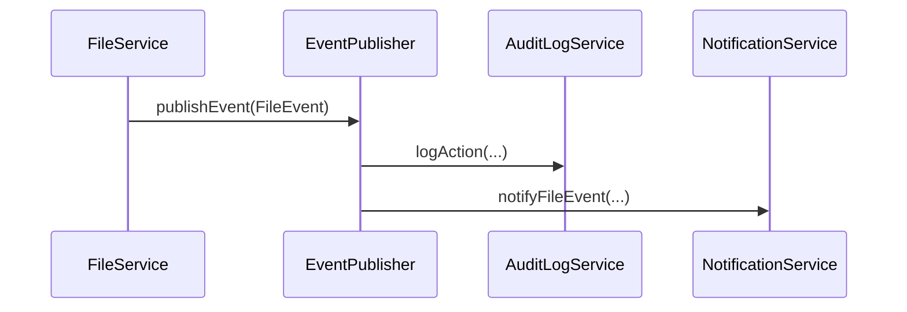
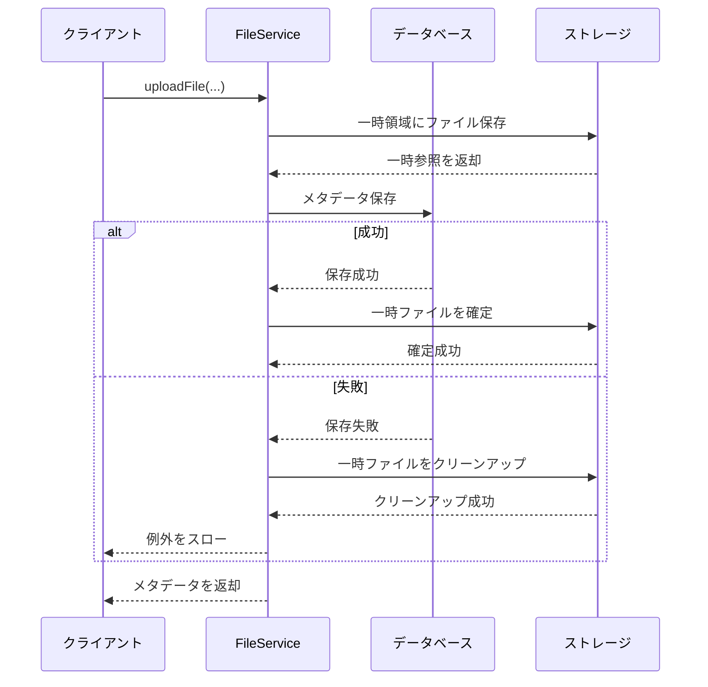

# ファイル管理機能 インターフェース定義

## 1. 概要

本ドキュメントでは、ファイル管理機能が提供するインターフェースと、外部システムからの依存インターフェースを定義します。これらのインターフェースは、ファイル管理機能を他のモジュールと統合するための主要な契約となります。

## 2. 提供インターフェース

### 2.1 FileService

ファイル管理機能の主要なエントリポイントとなるサービスインターフェースです。他のモジュールはこのインターフェースを通じてファイル管理機能を利用します。

```java
public interface FileService {
    /**
     * ファイルをアップロードする
     * @param content ファイルの内容
     * @param fileName 元のファイル名
     * @param contentType コンテンツタイプ
     * @param moduleCode 業務モジュールコード
     * @param entityId 関連エンティティID（オプション）
     * @param attributes カスタム属性（オプション）
     * @return アップロードされたファイルのメタデータ
     * @throws FileServiceException ファイル処理中にエラーが発生した場合
     * @throws SecurityException 呼び出し元に十分な権限がない場合
     */
    FileMetadataDTO uploadFile(
        InputStream content, 
        String fileName, 
        String contentType, 
        String moduleCode, 
        String entityId, 
        Map<String, String> attributes
    );
    
    /**
     * ファイルをダウンロードする
     * @param fileId ファイルID
     * @return ファイルコンテンツ（見つからない場合はEmpty）
     * @throws FileServiceException ファイル処理中にエラーが発生した場合
     * @throws SecurityException 呼び出し元に十分な権限がない場合
     */
    Optional<FileDownloadDTO> downloadFile(String fileId);
    
    /**
     * ファイルのメタデータを取得する
     * @param fileId ファイルID
     * @return ファイルメタデータ（見つからない場合はEmpty）
     * @throws SecurityException 呼び出し元に十分な権限がない場合
     */
    Optional<FileMetadataDTO> getFileMetadata(String fileId);
    
    /**
     * 指定されたエンティティに関連するファイル一覧を取得する
     * @param moduleCode 業務モジュールコード
     * @param entityId 関連エンティティID
     * @return 関連ファイルのメタデータリスト
     * @throws SecurityException 呼び出し元に十分な権限がない場合
     */
    List<FileMetadataDTO> findFilesByEntityReference(String moduleCode, String entityId);
    
    /**
     * 検索条件に基づいてファイルを検索する
     * @param criteria 検索条件
     * @param pageable ページネーション情報
     * @return 検索結果（ページング）
     * @throws SecurityException 呼び出し元に十分な権限がない場合
     */
    Page<FileMetadataDTO> searchFiles(FileSearchCriteriaDTO criteria, Pageable pageable);
    
    /**
     * ファイルを論理削除する
     * @param fileId ファイルID
     * @throws FileNotFoundException ファイルが見つからない場合
     * @throws SecurityException 呼び出し元に十分な権限がない場合
     */
    void deleteFile(String fileId);
    
    /**
     * ファイルのカスタム属性を更新する
     * @param fileId ファイルID
     * @param attributes 更新する属性マップ
     * @return 更新されたファイルメタデータ
     * @throws FileNotFoundException ファイルが見つからない場合
     * @throws SecurityException 呼び出し元に十分な権限がない場合
     */
    FileMetadataDTO updateFileAttributes(String fileId, Map<String, String> attributes);
    
    /**
     * ファイルへのアクセス権限を付与する
     * @param fileId ファイルID
     * @param principalType 権限主体タイプ
     * @param principalId 権限主体ID
     * @param permission 権限種別
     * @param expiresAt 有効期限（オプション）
     * @return 付与された権限情報
     * @throws FileNotFoundException ファイルが見つからない場合
     * @throws SecurityException 呼び出し元に十分な権限がない場合
     */
    FilePermissionDTO grantPermission(
        String fileId, 
        String principalType, 
        String principalId, 
        String permission, 
        LocalDateTime expiresAt
    );
    
    /**
     * ファイルアクセス権限を削除する
     * @param permissionId 権限ID
     * @throws PermissionNotFoundException 権限が見つからない場合
     * @throws SecurityException 呼び出し元に十分な権限がない場合
     */
    void revokePermission(String permissionId);
}
```

### 2.2 FileVersionService

ファイルのバージョン管理に関するサービスインターフェースです。

```java
public interface FileVersionService {
    /**
     * 新しいファイルバージョンを作成する
     * @param fileId ファイルID
     * @param content 新しいファイル内容
     * @param comment バージョンコメント（オプション）
     * @return 作成された新バージョンの情報
     * @throws FileNotFoundException ファイルが見つからない場合
     * @throws SecurityException 呼び出し元に十分な権限がない場合
     */
    FileVersionDTO createNewVersion(String fileId, InputStream content, String comment);
    
    /**
     * ファイルの特定バージョンを取得する
     * @param fileId ファイルID
     * @param versionNumber バージョン番号
     * @return 特定バージョンのファイル内容（見つからない場合はEmpty）
     * @throws SecurityException 呼び出し元に十分な権限がない場合
     */
    Optional<FileDownloadDTO> getVersion(String fileId, Integer versionNumber);
    
    /**
     * ファイルの全バージョン履歴を取得する
     * @param fileId ファイルID
     * @return バージョン履歴のリスト
     * @throws FileNotFoundException ファイルが見つからない場合
     * @throws SecurityException 呼び出し元に十分な権限がない場合
     */
    List<FileVersionDTO> getVersionHistory(String fileId);
    
    /**
     * 指定されたバージョンにファイルを戻す
     * @param fileId ファイルID
     * @param versionNumber バージョン番号
     * @return 更新されたファイルメタデータ
     * @throws FileNotFoundException ファイルが見つからない場合
     * @throws VersionNotFoundException 指定されたバージョンが見つからない場合
     * @throws SecurityException 呼び出し元に十分な権限がない場合
     */
    FileMetadataDTO revertToVersion(String fileId, Integer versionNumber);
}
```

### 2.3 REST API エンドポイント

ファイル管理機能は以下のREST APIエンドポイントを提供します。

#### 2.3.1 ファイル基本操作API

| メソッド | パス | 説明 | リクエスト | レスポンス | ステータスコード |
|--------|-----|------|-----------|-----------|--------------|
| POST | /api/files | ファイルアップロード | multipart/form-data | FileMetadataDTO | 201 Created |
| GET | /api/files/{id} | ファイルダウンロード | - | ファイルストリーム | 200 OK, 404 Not Found |
| GET | /api/files/{id}/metadata | ファイルメタデータ取得 | - | FileMetadataDTO | 200 OK, 404 Not Found |
| PUT | /api/files/{id}/attributes | ファイル属性更新 | Map<String, String> | FileMetadataDTO | 200 OK, 404 Not Found |
| DELETE | /api/files/{id} | ファイル削除 | - | - | 204 No Content, 404 Not Found |
| GET | /api/files/search | ファイル検索 | FileSearchCriteriaDTO, Pageable | Page<FileMetadataDTO> | 200 OK |

#### 2.3.2 ファイルバージョン管理API

| メソッド | パス | 説明 | リクエスト | レスポンス | ステータスコード |
|--------|-----|------|-----------|-----------|--------------|
| POST | /api/files/{id}/versions | 新バージョン作成 | multipart/form-data | FileVersionDTO | 201 Created, 404 Not Found |
| GET | /api/files/{id}/versions | バージョン履歴取得 | - | List<FileVersionDTO> | 200 OK, 404 Not Found |
| GET | /api/files/{id}/versions/{versionNumber} | 特定バージョン取得 | - | ファイルストリーム | 200 OK, 404 Not Found |
| POST | /api/files/{id}/versions/{versionNumber}/revert | バージョン復元 | - | FileMetadataDTO | 200 OK, 404 Not Found |

#### 2.3.3 ファイル権限管理API

| メソッド | パス | 説明 | リクエスト | レスポンス | ステータスコード |
|--------|-----|------|-----------|-----------|--------------|
| POST | /api/files/{id}/permissions | 権限付与 | FilePermissionRequestDTO | FilePermissionDTO | 201 Created, 404 Not Found |
| GET | /api/files/{id}/permissions | 権限一覧取得 | - | List<FilePermissionDTO> | 200 OK, 404 Not Found |
| DELETE | /api/files/permissions/{permissionId} | 権限削除 | - | - | 204 No Content, 404 Not Found |

## 3. DTOオブジェクト定義

### 3.1 FileMetadataDTO

```java
public class FileMetadataDTO {
    private String id;               // ファイルの一意識別子
    private String fileName;         // 元のファイル名
    private String contentType;      // MIMEタイプ
    private long fileSize;           // ファイルサイズ（バイト）
    private String moduleCode;       // 関連業務モジュールコード
    private String entityId;         // 関連エンティティID
    private String createdBy;        // 作成者ID
    private LocalDateTime createdAt; // 作成日時
    private String lastModifiedBy;   // 最終更新者ID
    private LocalDateTime lastModifiedAt; // 最終更新日時
    private Map<String, String> attributes; // カスタム属性
    private int version;            // バージョン番号
    private LocalDateTime expiresAt; // 有効期限
    
    // getters and setters
}
```

### 3.2 FileDownloadDTO

```java
public class FileDownloadDTO {
    private String id;               // ファイルの一意識別子
    private String fileName;         // 元のファイル名
    private String contentType;      // MIMEタイプ
    private long fileSize;           // ファイルサイズ（バイト）
    private InputStream content;     // ファイル内容のストリーム
    
    // getters and setters
}
```

### 3.3 FileSearchCriteriaDTO

```java
public class FileSearchCriteriaDTO {
    private String moduleCode;            // モジュールコードによるフィルタ
    private String entityId;              // エンティティIDによるフィルタ
    private String fileNamePattern;       // ファイル名パターンによるフィルタ
    private List<String> contentTypes;    // コンテンツタイプによるフィルタ
    private Long minSize;                 // 最小サイズによるフィルタ
    private Long maxSize;                 // 最大サイズによるフィルタ
    private LocalDateTime createdAfter;   // 作成日時（開始）によるフィルタ
    private LocalDateTime createdBefore;  // 作成日時（終了）によるフィルタ
    private Map<String, String> attributes; // カスタム属性によるフィルタ
    
    // getters and setters
}
```

### 3.4 FileVersionDTO

```java
public class FileVersionDTO {
    private String id;                 // バージョンの一意識別子
    private String fileId;             // 関連ファイルID
    private int versionNumber;         // バージョン番号
    private long fileSize;             // このバージョンのサイズ
    private String createdBy;          // 作成者ID
    private LocalDateTime createdAt;   // 作成日時
    private String comment;            // バージョンコメント
    
    // getters and setters
}
```

### 3.5 FilePermissionDTO

```java
public class FilePermissionDTO {
    private String id;                 // パーミッションの一意識別子
    private String fileId;             // 関連ファイルID
    private String principalType;      // 権限主体タイプ（USER/ROLE/GROUP）
    private String principalId;        // 権限主体ID
    private String permission;         // 権限種別（READ/WRITE/DELETE）
    private String grantedBy;          // 権限付与者ID
    private LocalDateTime grantedAt;   // 権限付与日時
    private LocalDateTime expiresAt;   // 権限有効期限
    
    // getters and setters
}
```

### 3.6 FilePermissionRequestDTO

```java
public class FilePermissionRequestDTO {
    private String principalType;      // 権限主体タイプ
    private String principalId;        // 権限主体ID
    private String permission;         // 権限種別
    private LocalDateTime expiresAt;   // 権限有効期限（オプション）
    
    // getters and setters
}
```

## 4. 依存インターフェース

ファイル管理機能が依存する外部システムインターフェースを定義します。

### 4.1 AuthorizationService

ユーザー認証と権限確認を行うための認証・認可サービスインターフェースです。

```java
public interface AuthorizationService {
    /**
     * ユーザーが特定のリソースに対して指定された権限を持っているか確認する
     * @param userId ユーザーID
     * @param resourceType リソースタイプ
     * @param resourceId リソースID
     * @param permission 確認する権限
     * @return 権限がある場合はtrue、ない場合はfalse
     */
    boolean hasPermission(String userId, String resourceType, String resourceId, String permission);
    
    /**
     * 現在認証されているユーザーのIDを取得する
     * @return 認証ユーザーID
     * @throws AuthenticationException 認証されていない場合
     */
    String getCurrentUserId();
    
    /**
     * 現在認証されているユーザーが指定されたロールを持っているか確認する
     * @param role 確認するロール
     * @return ロールを持っている場合はtrue、持っていない場合はfalse
     */
    boolean hasRole(String role);
}
```

### 4.2 AuditLogService

システム操作の監査ログを記録するための監査ログサービスインターフェースです。

```java
public interface AuditLogService {
    /**
     * ユーザーのアクション（操作）を監査ログとして記録する
     * @param userId 操作したユーザーID
     * @param action 実行されたアクション
     * @param resourceType 操作対象のリソースタイプ
     * @param resourceId 操作対象のリソースID
     * @param details アクションの詳細情報
     */
    void logAction(
        String userId, 
        String action, 
        String resourceType, 
        String resourceId, 
        Map<String, Object> details
    );
}
```

### 4.3 StorageProvider

物理的なファイルストレージを抽象化するためのインターフェースです。具体的な実装は異なるストレージ技術（ローカルファイルシステム、クラウドストレージなど）で提供されます。

```java
public interface StorageProvider {
    /**
     * ファイルを保存する
     * @param content ファイルの内容
     * @param metadata 保存するファイルのメタデータ
     * @return ストレージ内のファイル参照情報
     * @throws StorageException ストレージ操作中にエラーが発生した場合
     */
    StorageReference saveFile(InputStream content, StorageMetadata metadata);
    
    /**
     * ファイルを取得する
     * @param reference ストレージ内のファイル参照情報
     * @return ファイルの内容
     * @throws StorageException ストレージ操作中にエラーが発生した場合
     * @throws FileNotFoundException ファイルが見つからない場合
     */
    InputStream getFile(StorageReference reference);
    
    /**
     * ファイルを削除する
     * @param reference ストレージ内のファイル参照情報
     * @return 削除に成功した場合はtrue、それ以外はfalse
     * @throws StorageException ストレージ操作中にエラーが発生した場合
     */
    boolean deleteFile(StorageReference reference);
    
    /**
     * ファイルのメタデータを取得する
     * @param reference ストレージ内のファイル参照情報
     * @return ファイルのメタデータ
     * @throws StorageException ストレージ操作中にエラーが発生した場合
     * @throws FileNotFoundException ファイルが見つからない場合
     */
    StorageMetadata getMetadata(StorageReference reference);
    
    /**
     * ファイルをコピーする
     * @param sourceReference 元のファイル参照情報
     * @param targetMetadata コピー先のメタデータ
     * @return コピー先のファイル参照情報
     * @throws StorageException ストレージ操作中にエラーが発生した場合
     */
    StorageReference copyFile(StorageReference sourceReference, StorageMetadata targetMetadata);
}
```

### 4.4 NotificationService

ファイル関連のイベントを他のシステムコンポーネントに通知するためのサービスインターフェースです。

```java
public interface NotificationService {
    /**
     * ファイル関連イベントを通知する
     * @param eventType イベント種別
     * @param fileId 関連ファイルID
     * @param data 付加データ
     */
    void notifyFileEvent(String eventType, String fileId, Map<String, Object> data);
}
```

## 5. 例外定義

ファイル管理機能が発生させる主な例外クラスを定義します。

### 5.1 FileServiceException

ファイル管理サービスの基本例外クラスです。

```java
public class FileServiceException extends RuntimeException {
    public FileServiceException(String message) {
        super(message);
    }
    
    public FileServiceException(String message, Throwable cause) {
        super(message, cause);
    }
}
```

### 5.2 FileNotFoundException

指定されたファイルが見つからない場合に発生する例外です。

```java
public class FileNotFoundException extends FileServiceException {
    private final String fileId;
    
    public FileNotFoundException(String fileId) {
        super("File not found: " + fileId);
        this.fileId = fileId;
    }
    
    public String getFileId() {
        return fileId;
    }
}
```

### 5.3 StorageException

ストレージ操作中にエラーが発生した場合に発生する例外です。

```java
public class StorageException extends FileServiceException {
    private final String storageReference;
    
    public StorageException(String message, String storageReference) {
        super(message);
        this.storageReference = storageReference;
    }
    
    public StorageException(String message, String storageReference, Throwable cause) {
        super(message, cause);
        this.storageReference = storageReference;
    }
    
    public String getStorageReference() {
        return storageReference;
    }
}
```

### 5.4 FileValidationException

ファイルのバリデーションに失敗した場合に発生する例外です。

```java
public class FileValidationException extends FileServiceException {
    private final Map<String, String> validationErrors;
    
    public FileValidationException(String message, Map<String, String> validationErrors) {
        super(message);
        this.validationErrors = validationErrors;
    }
    
    public Map<String, String> getValidationErrors() {
        return validationErrors;
    }
}
```

### 5.5 VersionNotFoundException

指定されたファイルバージョンが見つからない場合に発生する例外です。

```java
public class VersionNotFoundException extends FileServiceException {
    private final String fileId;
    private final int versionNumber;
    
    public VersionNotFoundException(String fileId, int versionNumber) {
        super("Version " + versionNumber + " not found for file: " + fileId);
        this.fileId = fileId;
        this.versionNumber = versionNumber;
    }
    
    public String getFileId() {
        return fileId;
    }
    
    public int getVersionNumber() {
        return versionNumber;
    }
}
```

## 6. イベント定義

ファイル管理機能が発行する主なイベントを定義します。

### 6.1 イベント一覧

| イベント名 | 説明 | 主要属性 |
|----------|------|---------|
| file.created | ファイルが新規作成された | fileId, fileName, moduleCode, entityId, userId |
| file.accessed | ファイルがアクセスされた | fileId, accessType, userId |
| file.updated | ファイルが更新された | fileId, userId |
| file.deleted | ファイルが削除された | fileId, userId |
| file.version.created | 新しいバージョンが作成された | fileId, versionNumber, userId |
| file.permission.granted | ファイルに権限が付与された | fileId, permissionId, principalId, permission |
| file.permission.revoked | ファイルの権限が削除された | fileId, permissionId |

### 6.2 イベント処理

ファイル管理機能内のイベントは、以下の処理フローに従って処理されます：

1. イベント発生（サービスメソッド内）
2. イベントオブジェクト作成
3. イベントの内部処理（監査ログ記録など）
4. 外部通知サービスへのイベント送信



## 7. トランザクション定義

ファイル管理機能におけるトランザクション境界を定義します。

### 7.1 トランザクション要件

| 操作 | トランザクション要件 | ロールバック条件 |
|-----|-------------------|---------------|
| ファイルアップロード | メタデータの保存とストレージ操作を一貫して処理 | メタデータ保存またはストレージ操作のいずれかが失敗した場合 |
| ファイル削除 | メタデータの論理削除と関連エンティティの更新を一貫して処理 | メタデータまたは関連エンティティの更新が失敗した場合 |
| 新バージョン作成 | バージョンメタデータとストレージ操作を一貫して処理 | メタデータまたはストレージ操作が失敗した場合 |
| 権限管理 | 権限エンティティの作成/削除を一貫して処理 | データベース操作が失敗した場合 |

### 7.2 分散トランザクション

ファイル管理機能は複数のリソース（データベースとストレージ）に対する操作を含むため、完全な分散トランザクションの代わりに「Try-Confirm/Cancel(TCC)」パターンに基づく補償トランザクションを実装します。

#### 7.2.1 アップロードフロー



## 8. 非機能要件

### 8.1 性能要件

| 操作 | 性能要件 | 最適化戦略 |
|-----|---------|-----------|
| ファイルアップロード | 50MB未満のファイルを5秒以内に処理 | チャンク処理、非同期アップロード、進行状況表示 |
| ファイルダウンロード | 50MB未満のファイルを3秒以内に開始 | ストリーミング、バイトレンジ対応、キャッシング |
| メタデータ検索 | 95%のクエリを500ms以内に応答 | インデックス最適化、結果キャッシング |
| 同時アクセス | 100並列アクセスをサポート | コネクションプール最適化、スロットリング |

### 8.2 セキュリティ要件

| 要件 | 実装方法 |
|-----|---------|
| アクセス制御 | ファイル単位のACL、ロールベースアクセス制御との統合 |
| データ保護 | AES-256暗号化（機密ファイル）、TLS 1.3（転送時） |
| 監査 | すべてのファイル操作の詳細ログ記録 |
| 入力検証 | ファイル名、MIMEタイプ、サイズの厳格な検証 |
| マルウェア対策 | アップロード前のウイルススキャン統合（オプション） |

### 8.3 可用性要件

| 要件 | 実装方法 |
|-----|---------|
| 可用性 | 99.9%以上の稼働率 |
| 障害復旧 | ストレージ障害時の自動フェイルオーバー |
| データ冗長性 | メタデータの定期バックアップ、ストレージレプリケーション |
| サーキットブレーカー | 依存サービス障害時の分離と縮退運転 |

## 9. API利用例

### 9.1 ファイルアップロード

**リクエスト:**

```
POST /api/files
Content-Type: multipart/form-data; boundary=----WebKitFormBoundary7MA4YWxkTrZu0gW

------WebKitFormBoundary7MA4YWxkTrZu0gW
Content-Disposition: form-data; name="file"; filename="engineer_resume.pdf"
Content-Type: application/pdf

(バイナリデータ)
------WebKitFormBoundary7MA4YWxkTrZu0gW
Content-Disposition: form-data; name="moduleCode"

ENGINEER_MANAGEMENT
------WebKitFormBoundary7MA4YWxkTrZu0gW
Content-Disposition: form-data; name="entityId"

ENG-001
------WebKitFormBoundary7MA4YWxkTrZu0gW
Content-Disposition: form-data; name="attributes"
Content-Type: application/json

{
  "documentType": "resume",
  "language": "ja",
  "confidential": "true"
}
------WebKitFormBoundary7MA4YWxkTrZu0gW--
```

**レスポンス:**

```json
{
  "id": "f47ac10b-58cc-4372-a567-0e02b2c3d479",
  "fileName": "engineer_resume.pdf",
  "contentType": "application/pdf",
  "fileSize": 2048576,
  "moduleCode": "ENGINEER_MANAGEMENT",
  "entityId": "ENG-001",
  "createdBy": "user-001",
  "createdAt": "2024-05-10T10:30:15.123Z",
  "lastModifiedBy": "user-001",
  "lastModifiedAt": "2024-05-10T10:30:15.123Z",
  "attributes": {
    "documentType": "resume",
    "language": "ja",
    "confidential": "true"
  },
  "version": 1,
  "expiresAt": null
}
```

### 9.2 ファイル検索

**リクエスト:**

```
GET /api/files/search?moduleCode=ENGINEER_MANAGEMENT&fileNamePattern=*resume*&page=0&size=10
```

**レスポンス:**

```json
{
  "content": [
    {
      "id": "f47ac10b-58cc-4372-a567-0e02b2c3d479",
      "fileName": "engineer_resume.pdf",
      "contentType": "application/pdf",
      "fileSize": 2048576,
      "moduleCode": "ENGINEER_MANAGEMENT",
      "entityId": "ENG-001",
      "createdBy": "user-001",
      "createdAt": "2024-05-10T10:30:15.123Z",
      "attributes": {
        "documentType": "resume",
        "language": "ja"
      },
      "version": 1
    },
    {
      "id": "a6b75d8c-312f-4a9b-9495-8e03b8d9d3b5",
      "fileName": "developer_resume_2024.pdf",
      "contentType": "application/pdf",
      "fileSize": 1548576,
      "moduleCode": "ENGINEER_MANAGEMENT",
      "entityId": "ENG-002",
      "createdBy": "user-002",
      "createdAt": "2024-05-09T15:22:43.456Z",
      "attributes": {
        "documentType": "resume",
        "language": "en"
      },
      "version": 2
    }
  ],
  "pageable": {
    "pageNumber": 0,
    "pageSize": 10,
    "sort": {
      "sorted": true,
      "unsorted": false,
      "empty": false
    },
    "offset": 0,
    "paged": true,
    "unpaged": false
  },
  "totalElements": 2,
  "totalPages": 1,
  "last": true,
  "first": true,
  "size": 10,
  "number": 0,
  "sort": {
    "sorted": true,
    "unsorted": false,
    "empty": false
  },
  "numberOfElements": 2,
  "empty": false
}
```

## 10. クライアント統合ガイド

### 10.1 依存関係

Maven:

```xml
<dependency>
    <groupId>com.example.sesmgr</groupId>
    <artifactId>file-management-client</artifactId>
    <version>1.0.0</version>
</dependency>
```

Gradle:

```groovy
implementation 'com.example.sesmgr:file-management-client:1.0.0'
```

### 10.2 設定

Spring Boot アプリケーションの場合:

```yaml
sesmgr:
  file-management:
    base-url: http://localhost:8080/api
    connect-timeout: 5000
    read-timeout: 30000
    max-connections: 20
```

### 10.3 JavaクライアントAPI

SpringのRestTemplateを使用した統合例:

```java
@Service
public class EngineerDocumentService {
    
    private final FileServiceClient fileServiceClient;
    
    @Autowired
    public EngineerDocumentService(FileServiceClient fileServiceClient) {
        this.fileServiceClient = fileServiceClient;
    }
    
    public String uploadResumeFile(String engineerId, File resumeFile, String language) {
        Map<String, String> attributes = new HashMap<>();
        attributes.put("documentType", "resume");
        attributes.put("language", language);
        
        try (InputStream fileStream = new FileInputStream(resumeFile)) {
            FileMetadataDTO metadata = fileServiceClient.uploadFile(
                fileStream,
                resumeFile.getName(),
                "application/pdf",
                "ENGINEER_MANAGEMENT",
                engineerId,
                attributes
            );
            return metadata.getId();
        } catch (IOException e) {
            throw new ServiceException("Failed to read resume file", e);
        } catch (FileServiceException e) {
            throw new ServiceException("Failed to upload resume file", e);
        }
    }
    
    public List<FileMetadataDTO> getEngineerDocuments(String engineerId) {
        try {
            return fileServiceClient.findFilesByEntityReference(
                "ENGINEER_MANAGEMENT",
                engineerId
            );
        } catch (FileServiceException e) {
            throw new ServiceException("Failed to retrieve engineer documents", e);
        }
    }
}
```