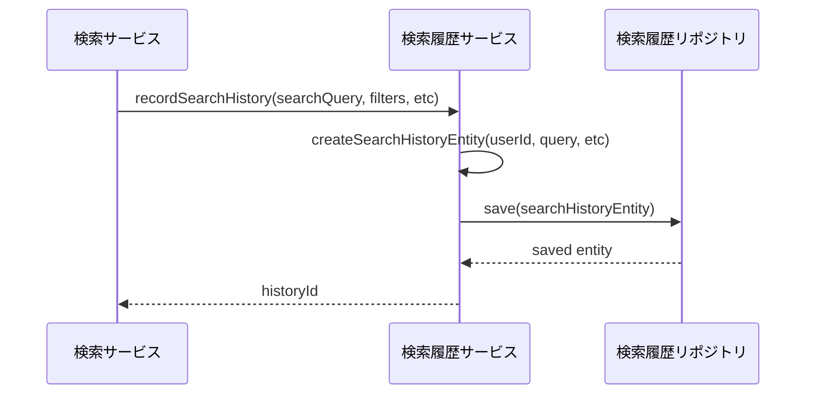
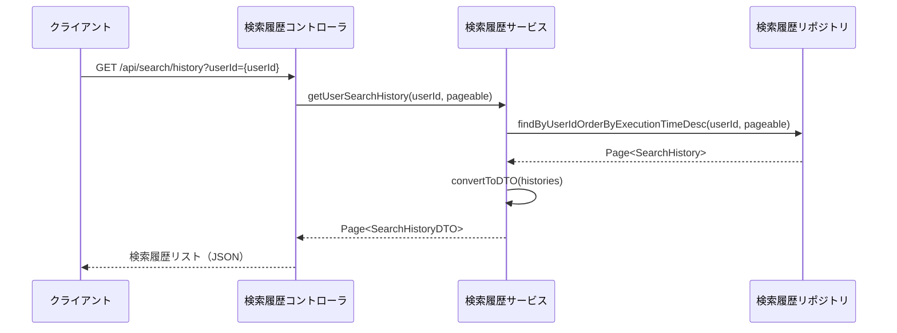
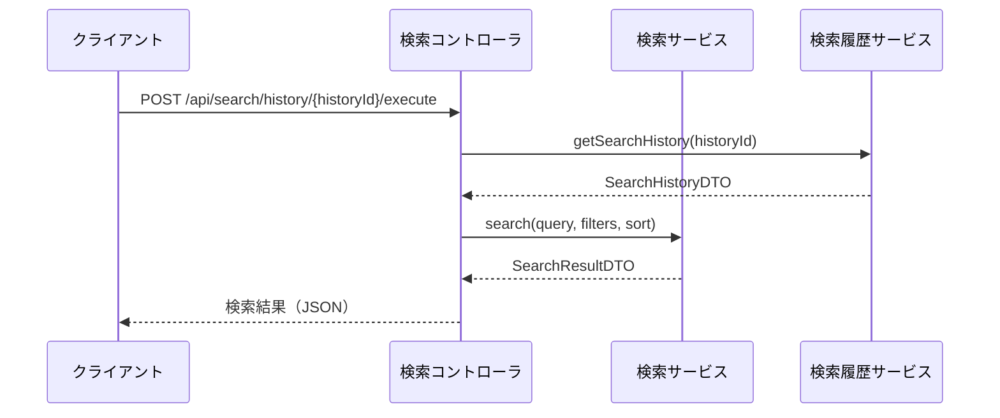
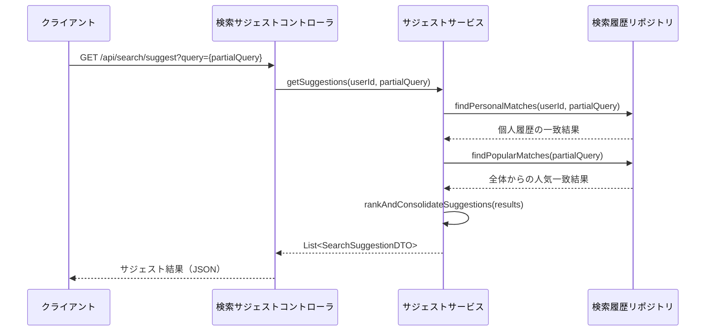

# 検索履歴管理機能

## 1. 概要

検索履歴管理機能は、ユーザーが実行した検索クエリを記録し、後で再利用できるようにするための機能です。この機能により、ユーザーは過去に行った検索を簡単に追跡し、繰り返し実行することができます。また、システム全体の検索パターンを分析するためのデータも提供します。

### 1.1 主な機能

- ユーザー別検索履歴の記録
- 検索履歴の一覧表示
- 検索履歴からの検索再実行
- 検索履歴の削除（単一または全件）
- 検索頻度の高いクエリの分析
- 検索履歴に基づく検索サジェスト機能

## 2. コンポーネント構成

検索履歴管理機能は以下のコンポーネントで構成されます：

```
SearchHistoryManager
├── SearchHistoryService（検索履歴サービスインターフェース）
├── SearchHistoryServiceImpl（検索履歴サービス実装）
├── SearchHistoryRepository（検索履歴リポジトリ）
├── SearchHistoryController（REST API コントローラ）
└── SearchHistoryAnalyzer（検索履歴分析コンポーネント）
```

## 3. データモデル

検索履歴は以下のデータモデルで管理されます：

### 3.1 SearchHistory エンティティ

| 項目 | 型 | 説明 |
|------|------|------|
| id | Long | 検索履歴ID |
| userId | String | ユーザーID |
| searchQuery | String | 検索クエリ文字列 |
| resourceType | String | 検索対象リソース種別（技術者、案件など） |
| filters | Map<String, List<String>> | 適用されたフィルター条件 |
| sortOrder | String | ソート順（関連性、日付など） |
| executionTime | LocalDateTime | 検索実行日時 |
| resultCount | Integer | 検索結果件数 |
| executionTimeMs | Long | 検索処理時間（ミリ秒） |
| isFavorite | Boolean | お気に入り登録フラグ |

## 4. 処理フロー

### 4.1 検索履歴の記録



### 4.2 ユーザーの検索履歴取得



### 4.3 検索履歴からの再検索



## 5. インターフェース定義

### 5.1 SearchHistoryService インターフェース

```
public interface SearchHistoryService {
    /**
     * 検索履歴を記録する
     * @param userId ユーザーID
     * @param searchQuery 検索クエリ
     * @param resourceType リソース種別
     * @param filters 適用フィルター
     * @param sortOrder ソート順
     * @param resultCount 結果件数
     * @param executionTimeMs 実行時間
     * @return 生成された検索履歴ID
     */
    Long recordSearchHistory(String userId, String searchQuery, 
                           String resourceType, Map<String, List<String>> filters,
                           String sortOrder, Integer resultCount, Long executionTimeMs);
    
    /**
     * ユーザーの検索履歴を取得する
     * @param userId ユーザーID
     * @param pageable ページネーション情報
     * @return 検索履歴のページング結果
     */
    Page<SearchHistoryDTO> getUserSearchHistory(String userId, Pageable pageable);
    
    /**
     * 指定IDの検索履歴を取得する
     * @param historyId 検索履歴ID
     * @return 検索履歴DTO
     * @throws NotFoundException 履歴が存在しない場合
     */
    SearchHistoryDTO getSearchHistory(Long historyId) throws NotFoundException;
    
    /**
     * 検索履歴を削除する
     * @param historyId 検索履歴ID
     * @param userId ユーザーID（権限確認用）
     * @throws NotFoundException 履歴が存在しない場合
     * @throws AccessDeniedException ユーザーの履歴でない場合
     */
    void deleteSearchHistory(Long historyId, String userId) 
        throws NotFoundException, AccessDeniedException;
    
    /**
     * ユーザーの全検索履歴を削除する
     * @param userId ユーザーID
     * @return 削除した履歴数
     */
    int deleteAllUserSearchHistory(String userId);
    
    /**
     * 検索履歴をお気に入り登録/解除する
     * @param historyId 検索履歴ID
     * @param userId ユーザーID（権限確認用）
     * @param isFavorite お気に入りフラグ
     * @return 更新された検索履歴DTO
     * @throws NotFoundException 履歴が存在しない場合
     * @throws AccessDeniedException ユーザーの履歴でない場合
     */
    SearchHistoryDTO toggleFavorite(Long historyId, String userId, boolean isFavorite)
        throws NotFoundException, AccessDeniedException;
}
```

### 5.2 API エンドポイント

| メソッド | パス | 説明 | 成功レスポンス |
|--------|-----|------|--------------|
| GET | /api/search/history | ログインユーザーの検索履歴一覧を取得 | 200 OK |
| GET | /api/search/history/{id} | 指定IDの検索履歴詳細を取得 | 200 OK |
| POST | /api/search/history/{id}/execute | 指定検索履歴で再検索を実行 | 200 OK |
| DELETE | /api/search/history/{id} | 指定IDの検索履歴を削除 | 204 No Content |
| DELETE | /api/search/history | ログインユーザーの全検索履歴を削除 | 204 No Content |
| PATCH | /api/search/history/{id}/favorite | 検索履歴のお気に入り状態を変更 | 200 OK |

## 6. 検索サジェスト機能

### 6.1 概要

検索履歴データを活用し、ユーザーが検索入力を始めた際に、過去の類似検索や一般的な検索キーワードを提案する機能です。

### 6.2 サジェスト生成ロジック

1. **個人履歴ベース**：ログインユーザー自身の過去の検索履歴から類似キーワードを抽出
2. **全体傾向ベース**：全ユーザーの検索傾向から人気のキーワードを抽出
3. **コンテキストベース**：現在のユーザーの操作コンテキストに基づいたサジェスト
4. **キーワード部分一致**：入力中のキーワードに前方一致する検索履歴を提示

### 6.3 処理フロー



## 7. 検索履歴分析機能

### 7.1 概要

システム全体の検索パターンを分析し、以下のインサイトを提供します：

- 最も検索されているキーワード
- リソース種別ごとの検索頻度
- 時間帯別の検索活動
- 検索からのコンバージョン率（検索後のアクション実行率）
- ユーザーセグメント別の検索傾向

### 7.2 分析レポート

検索履歴分析は以下の形式でレポートされます：

1. **日次サマリーレポート**：一日の検索活動の概要を示す自動生成レポート
2. **トレンド分析レポート**：週次/月次での検索傾向の変化を示すレポート
3. **キーワードクラスタリング**：関連する検索キーワードをグループ化したレポート

## 8. キャッシュ戦略

検索履歴と検索サジェストのパフォーマンスを最適化するため、以下のキャッシュ戦略を採用します：

| キャッシュ対象 | キャッシュキー | 有効期間 | 更新トリガー |
|--------------|-------------|---------|-------------|
| ユーザー検索履歴 | userId + page | 10分 | 新規検索実行時 |
| 人気検索キーワード | "popular_keywords" | 30分 | スケジュールされた更新 |
| ユーザーサジェスト | userId + partialQuery | 5分 | - |

## 9. 例外処理

検索履歴管理機能における主な例外と処理方法：

| 例外 | HTTP ステータス | 説明 |
|------|---------------|------|
| NotFoundException | 404 Not Found | 指定された検索履歴が存在しない |
| AccessDeniedException | 403 Forbidden | ユーザーが他者の検索履歴にアクセスしようとした |
| ValidationException | 400 Bad Request | 入力パラメータが不正 |

## 10. セキュリティ考慮事項

- 検索履歴はユーザーの個人データであり、他のユーザーからアクセスできないよう保護
- 検索クエリにセンシティブ情報が含まれる可能性があるため、ログ出力時にはマスキング処理
- 一定期間経過後（例：3ヶ月）の古い検索履歴は自動アーカイブまたは匿名化

## 11. フロントエンド UI コンポーネント

検索履歴管理機能のフロントエンド実装には、以下のUIコンポーネントを提供します：

- **SearchHistoryList**：ユーザーの検索履歴リストを表示するコンポーネント
- **SearchHistoryItem**：個別の検索履歴項目を表示するコンポーネント
- **SearchSuggestionsDropdown**：検索入力時のサジェスト表示コンポーネント
- **SearchHistoryActionBar**：履歴の削除やフィルタリングを行うアクションバー

## 12. パフォーマンス最適化

検索履歴管理機能のパフォーマンスを最適化するための施策：

1. **インデックス最適化**：
   - userId + executionTime の複合インデックス
   - searchQuery に対する部分一致インデックス

2. **クエリ最適化**：
   - 検索履歴取得時のカラム選択的取得
   - ページネーションによる結果制限

3. **バッチ処理**：
   - 使用頻度の低い古い履歴の定期的なアーカイブ処理
   - 検索傾向分析の非同期バッチ処理化

## 13. 設定パラメータ

検索履歴管理機能の動作を制御する主な設定パラメータ：

```
# 検索履歴の最大保存期間（日数）
search.history.retention-days=90

# ユーザーあたりの最大検索履歴保存件数
search.history.max-entries-per-user=100

# 検索サジェストの最大表示件数
search.suggest.max-items=10

# 人気キーワードの更新間隔（分）
search.popular-keywords.update-interval=60
```