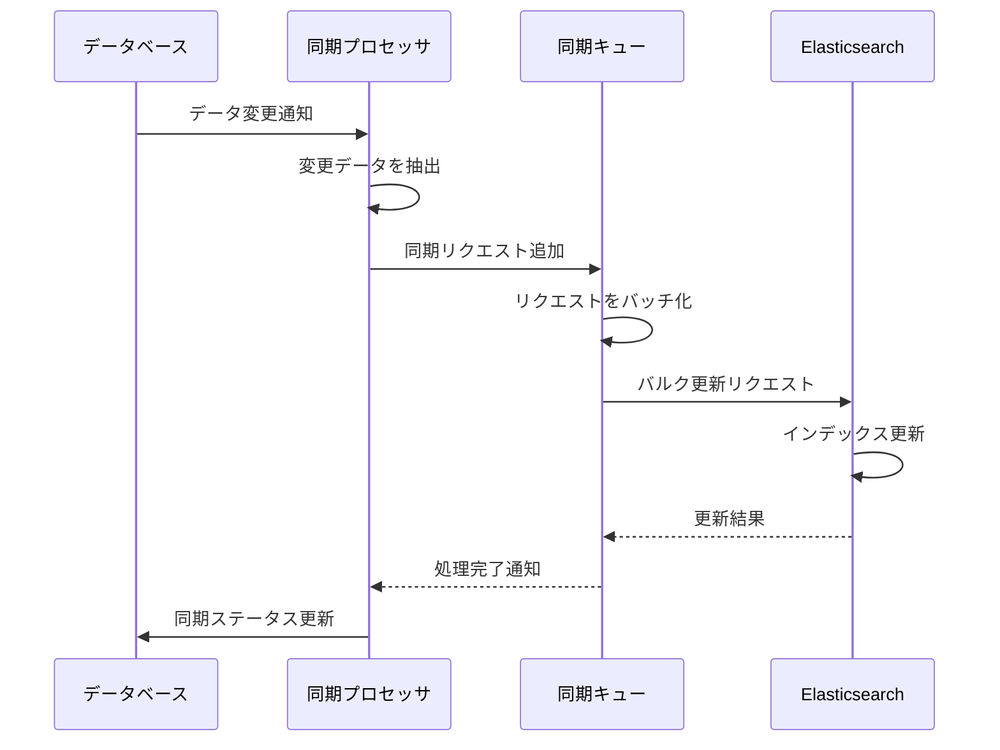
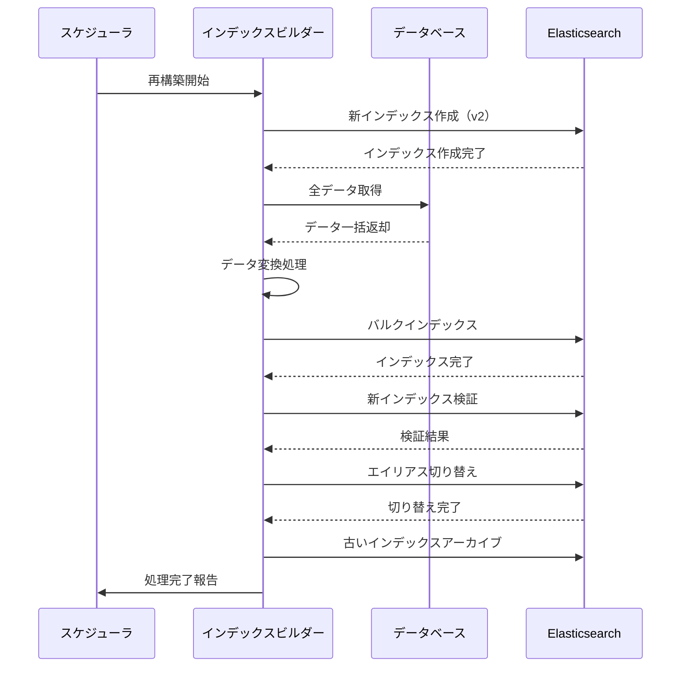

# 検索インデックス管理

## 1. 概要

検索インデックス管理機能は、Elasticsearch などの検索エンジンで使用されるインデックスを効率的に作成、更新、管理するための機能です。SES管理システムの各種エンティティ（技術者、案件、契約など）に対する検索を最適化し、高速かつ正確な検索結果を提供することを目的としています。

### 1.1 主な機能

- 各種リソース（技術者、案件など）の検索インデックス作成
- インデックスの定期的な更新・再構築
- インデックスのバージョン管理とエイリアス切り替え
- インデックステンプレートの管理
- インデックスの状態監視
- 検索用マッピング定義の管理
- 日本語形態素解析の最適化

## 2. システム構成

検索インデックス管理機能のシステム構成は以下の通りです：

```
IndexManagementSystem
├── IndexManager（インデックス管理コアモジュール）
├── IndexSynchronizer（DB-インデックス同期モジュール）
├── IndexHealthMonitor（インデックス状態監視モジュール）
├── IndexTemplateManager（テンプレート管理モジュール）
├── MappingDefinitionManager（マッピング定義管理）
└── IndexingBatchProcessor（バッチ処理モジュール）
```

## 3. インデックス設計

### 3.1 インデックス命名規則

```
{リソース種別}-{環境}-{バージョン}
```

例：
- engineers-prod-v1（技術者インデックス、本番環境、バージョン1）
- projects-dev-v2（案件インデックス、開発環境、バージョン2）

### 3.2 エイリアス設計

各インデックスには以下のエイリアスを設定します：

- **{リソース種別}-current**: 現在アクティブなインデックスを指す
- **{リソース種別}-write**: 書き込み用エイリアス
- **{リソース種別}-read**: 読み取り用エイリアス

インデックス再構築時には、新インデックスの構築完了後にエイリアスを切り替えることで、ダウンタイムゼロでのインデックス更新を実現します。

### 3.3 インデックスライフサイクル

インデックスは以下のライフサイクルで管理されます：

1. **初期化**: インデックステンプレートとマッピング定義を使用してインデックスを作成
2. **データインポート**: 初期データをインデックスにバルクインポート
3. **アクティベーション**: 完成したインデックスにエイリアスを付与して有効化
4. **更新**: 定期的な同期処理またはイベント駆動で差分更新
5. **再構築**: 必要に応じて新バージョンで再構築
6. **アーカイブ**: 不要になったインデックスのアーカイブ
7. **削除**: アーカイブ期間経過後の削除

## 4. リソース別インデックス設計

主要リソースごとに最適化されたインデックス設計を定義します。

### 4.1 技術者（Engineers）インデックス

#### 4.1.1 マッピング定義

```json
{
  "mappings": {
    "properties": {
      "id": { "type": "keyword" },
      "name": { 
        "type": "text",
        "analyzer": "japanese", 
        "fields": {
          "keyword": { "type": "keyword" }
        }
      },
      "kana": { "type": "text", "analyzer": "standard" },
      "skills": {
        "type": "nested",
        "properties": {
          "name": { "type": "keyword" },
          "level": { "type": "integer" },
          "years": { "type": "float" }
        }
      },
      "experience": {
        "type": "nested",
        "properties": {
          "projectName": { "type": "text", "analyzer": "japanese" },
          "role": { "type": "keyword" },
          "description": { "type": "text", "analyzer": "japanese" },
          "period": { "type": "integer" }
        }
      },
      "status": { "type": "keyword" },
      "location": { "type": "keyword" },
      "availableDate": { "type": "date" },
      "lastUpdated": { "type": "date" }
    }
  }
}
```

#### 4.1.2 インデックス設定

```json
{
  "settings": {
    "number_of_shards": 3,
    "number_of_replicas": 1,
    "index": {
      "analysis": {
        "analyzer": {
          "japanese": {
            "type": "custom",
            "tokenizer": "kuromoji_tokenizer",
            "filter": [
              "kuromoji_baseform",
              "kuromoji_part_of_speech",
              "ja_stop",
              "kuromoji_number",
              "kuromoji_stemmer"
            ]
          }
        }
      }
    }
  }
}
```

### 4.2 案件（Projects）インデックス

#### 4.2.1 マッピング定義

```json
{
  "mappings": {
    "properties": {
      "id": { "type": "keyword" },
      "title": { 
        "type": "text", 
        "analyzer": "japanese",
        "fields": {
          "keyword": { "type": "keyword" }
        }
      },
      "description": { "type": "text", "analyzer": "japanese" },
      "requiredSkills": {
        "type": "nested",
        "properties": {
          "name": { "type": "keyword" },
          "level": { "type": "integer" },
          "required": { "type": "boolean" }
        }
      },
      "clientName": { "type": "keyword" },
      "location": { "type": "keyword" },
      "startDate": { "type": "date" },
      "endDate": { "type": "date" },
      "status": { "type": "keyword" },
      "rate": { 
        "type": "integer",
        "fields": {
          "range": { "type": "integer_range" }
        }
      },
      "lastUpdated": { "type": "date" }
    }
  }
}
```

## 5. インデックス同期処理

### 5.1 同期方式

インデックスとデータベースの同期は以下の方式で実施します：

1. **バッチ同期**: 定期的なバッチ処理による全件または差分同期
2. **イベント駆動同期**: データ変更イベントをトリガーにリアルタイム同期
3. **ハイブリッド同期**: イベント駆動と定期バッチのハイブリッド方式

### 5.2 同期処理フロー



### 5.3 差分検出ロジック

差分検出は以下の方法で実施します：

1. **タイムスタンプベース**: 最終同期時刻以降に更新されたレコードを抽出
2. **バージョンベース**: レコードバージョン番号での差分検出
3. **イベントログベース**: DB変更イベントログからの差分抽出

```
// 差分検出SQLの例（タイムスタンプベース）
SELECT * FROM engineers 
WHERE last_updated > :lastSyncTime
ORDER BY last_updated ASC
LIMIT 1000
```

## 6. インデックス再構築処理

### 6.1 再構築フロー



### 6.2 ゼロダウンタイム切り替え

エイリアスを使用したゼロダウンタイム切り替えの手順：

1. 新インデックス（例：engineers-prod-v2）を作成
2. 新インデックスにデータをインポート
3. 新インデックスの検証実施
4. アトミックなエイリアス操作で切り替え：

```
POST /_aliases
{
  "actions": [
    { "remove": { "index": "engineers-prod-v1", "alias": "engineers-current" }},
    { "remove": { "index": "engineers-prod-v1", "alias": "engineers-write" }},
    { "add": { "index": "engineers-prod-v2", "alias": "engineers-current" }},
    { "add": { "index": "engineers-prod-v2", "alias": "engineers-write" }}
  ]
}
```

5. 古いインデックスをアーカイブまたは削除

## 7. インデックス状態監視

### 7.1 監視項目

以下の項目を定期的に監視します：

- インデックスサイズとシャード状態
- インデックス処理パフォーマンス（インデックス作成・検索レスポンス時間）
- インデックスの同期遅延
- シャードの割り当て状態
- ノード状態
- ディスク使用率

### 7.2 アラート設定

| 監視項目 | 閾値 | アラートレベル |
|---------|------|--------------|
| 同期遅延 | 5分以上 | 警告 |
| 同期遅延 | 30分以上 | 重大 |
| インデックスサイズ | 予測の120%以上 | 警告 |
| シャード未割当て | 5分以上 | 重大 |
| ノードダウン | 即時 | 重大 |
| ディスク使用率 | 85%以上 | 警告 |
| ディスク使用率 | 95%以上 | 重大 |

## 8. 日本語形態素解析の最適化

### 8.1 kuromoji設定

日本語検索を最適化するためのkuromojiアナライザー設定：

```json
{
  "settings": {
    "analysis": {
      "analyzer": {
        "japanese_analyzer": {
          "type": "custom",
          "tokenizer": "kuromoji_tokenizer",
          "char_filter": [
            "icu_normalizer",
            "japanese_iteration_mark"
          ],
          "filter": [
            "kuromoji_baseform",
            "kuromoji_part_of_speech",
            "ja_stop",
            "kuromoji_number",
            "kuromoji_stemmer"
          ]
        }
      },
      "char_filter": {
        "japanese_iteration_mark": {
          "type": "mapping",
          "mappings": ["々=>\\u306e"]
        }
      }
    }
  }
}
```

### 8.2 ユーザー辞書管理

専門用語や固有名詞を適切に処理するためのユーザー辞書を管理します：

1. **辞書フォーマット**：
   ```
   専門用語,読み,品詞
   ```

2. **辞書更新プロセス**：
   - 辞書ファイルの更新
   - Elasticsearchへの辞書再読み込み
   - インデックスの再作成

3. **主な登録カテゴリ**：
   - IT技術用語
   - プロジェクト固有名詞
   - 企業名・サービス名
   - 業界固有表現

## 9. インターフェース定義

### 9.1 IndexManager インターフェース

```
public interface IndexManager {
    /**
     * インデックスを作成する
     * @param resourceType リソース種別
     * @param indexVersion バージョン
     * @param settings インデックス設定
     * @param mappings マッピング定義
     * @return 作成されたインデックス名
     */
    String createIndex(String resourceType, String indexVersion, 
                      Map<String, Object> settings, Map<String, Object> mappings);
    
    /**
     * インデックスにエイリアスを設定する
     * @param indexName インデックス名
     * @param aliasName エイリアス名
     * @return 設定成功の場合true
     */
    boolean setAlias(String indexName, String aliasName);
    
    /**
     * アトミックにエイリアスを切り替える
     * @param oldIndex 古いインデックス
     * @param newIndex 新しいインデックス
     * @param aliasName エイリアス名
     * @return 切り替え成功の場合true
     */
    boolean switchAlias(String oldIndex, String newIndex, String aliasName);
    
    /**
     * インデックスの健全性をチェックする
     * @param indexNameOrAlias インデックス名またはエイリアス
     * @return 健全性チェック結果
     */
    IndexHealthStatus checkIndexHealth(String indexNameOrAlias);
    
    /**
     * インデックスを削除する
     * @param indexName インデックス名
     * @return 削除成功の場合true
     */
    boolean deleteIndex(String indexName);
    
    /**
     * インデックスを最適化する
     * @param indexName インデックス名
     * @return 最適化成功の場合true
     */
    boolean optimizeIndex(String indexName);
}
```

### 9.2 IndexSynchronizer インターフェース

```
public interface IndexSynchronizer {
    /**
     * データの同期を開始する
     * @param resourceType リソース種別
     * @param syncMode 同期モード（FULL, INCREMENTAL）
     * @return 同期ジョブID
     */
    String startSync(String resourceType, SyncMode syncMode);
    
    /**
     * 同期ジョブのステータスを取得する
     * @param jobId 同期ジョブID
     * @return 同期ジョブステータス
     */
    SyncJobStatus getSyncStatus(String jobId);
    
    /**
     * 同期ジョブをキャンセルする
     * @param jobId 同期ジョブID
     * @return キャンセル成功の場合true
     */
    boolean cancelSync(String jobId);
    
    /**
     * 最終同期情報を取得する
     * @param resourceType リソース種別
     * @return 最終同期情報
     */
    LastSyncInfo getLastSyncInfo(String resourceType);
}
```

## 10. バッチ処理定義

### 10.1 定期同期バッチ

```
名称: 検索インデックス定期同期バッチ
スケジュール: 15分毎
処理内容:
1. 前回同期時刻以降に更新されたデータを抽出
2. 抽出データをElasticsearchインデックスに反映
3. 同期ステータスの更新
```

### 10.2 インデックス最適化バッチ

```
名称: 検索インデックス最適化バッチ
スケジュール: 毎日 深夜1時
処理内容:
1. インデックスのセグメント統合実行
2. インデックスの統計情報更新
3. 不要インデックスのクリーンアップ
```

### 10.3 インデックス再構築バッチ

```
名称: 検索インデックス再構築バッチ
スケジュール: 毎週 日曜 深夜3時
処理内容:
1. 新バージョンインデックスの作成
2. 全データのインデックス再構築
3. インデックスの検証
4. エイリアスの切り替え
5. 古いインデックスのアーカイブ
```

## 11. 運用管理

### 11.1 インデックス管理画面

インデックス管理者向けの管理画面を提供し、以下の操作を可能にします：

- インデックスの状態確認
- 手動同期の実行
- インデックスの再構築
- 同期ログの確認
- アラート履歴の確認

### 11.2 モニタリングダッシュボード

以下の項目をモニタリングするためのダッシュボードを提供します：

- リソース別インデックスサイズ
- 同期状況とラグ
- インデックス処理のパフォーマンス指標
- エラー発生状況
- ノード/クラスターの状態

## 12. 拡張性設計

### 12.1 新リソース追加対応

新しい検索対象リソースを追加する際のプロセス：

1. リソース用のインデックス設定・マッピング定義作成
2. 同期処理のデータ取得ロジック実装
3. インデックステンプレートの登録
4. 初期インデックス構築と検証
5. 検索API対応の追加

### 12.2 マルチテナント対応

マルチテナント環境での対応方法：

1. **インデックス命名規則**：
   ```
   {テナントID}-{リソース種別}-{環境}-{バージョン}
   ```

2. **テナント間分離**：
   - テナントごとのインデックス分離
   - テナント識別子による検索アクセス制限

## 13. リソース要件

### 13.1 ストレージ要件

| リソース種別 | レコード数想定 | レコードサイズ | インデックスサイズ | 冗長化 | 合計 |
|------------|--------------|--------------|------------------|--------|-----|
| 技術者 | 10,000 | 10 KB | 100 MB | x3 | 300 MB |
| 案件 | 5,000 | 15 KB | 75 MB | x3 | 225 MB |
| 契約 | 20,000 | 8 KB | 160 MB | x3 | 480 MB |
| 合計 | - | - | - | - | 約 1.5 GB |

### 13.2 スケールアウト計画

- **初期構成**: 3ノードクラスター
- **中期構成**: 5ノードクラスター（レプリカシャード増加）
- **長期構成**: データノードと調整ノードの分離、シャード最適化

## 14. パフォーマンスチューニング

### 14.1 インデックス設定最適化

以下の設定パラメータを最適化します：

```json
{
  "index.refresh_interval": "5s",
  "index.number_of_shards": 3,
  "index.number_of_replicas": 1,
  "index.translog.durability": "async",
  "index.translog.sync_interval": "5s",
  "index.translog.flush_threshold_size": "1gb",
  "index.mapping.total_fields.limit": 1000,
  "index.max_result_window": 10000
}
```

### 14.2 バルクインデックス最適化

バルク処理の最適化パラメータ：

- バルクリクエストのサイズ：5-15MB
- バッチサイズ：1,000-5,000ドキュメント
- 同時実行リクエスト数：2-4スレッド

## 15. 障害対策

### 15.1 障害シナリオと対策

| 障害シナリオ | 影響 | 対策 |
|------------|------|------|
| ノード障害 | 一部シャードの一時的な利用不可 | シャードの自動再配置、レプリカからの読み取り |
| クラスター分断 | スプリットブレイン発生リスク | 適切なクォーラム設定、マスターノード専用化 |
| インデックス破損 | 検索結果の不整合 | 定期的なスナップショット取得、復元プロセス |
| 同期遅延 | 検索結果と実データの不一致 | 同期監視、自動リカバリプロセス |

### 15.2 バックアップ・リカバリ

- **スナップショット頻度**: 日次（増分）、週次（フル）
- **保持期間**: 日次14日間、週次8週間
- **リカバリRTO**: 1時間以内
- **リカバリRPO**: 24時間以内