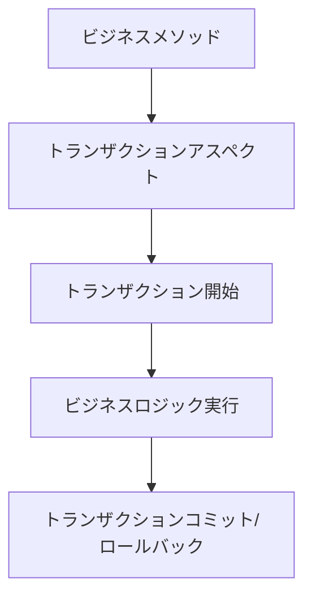
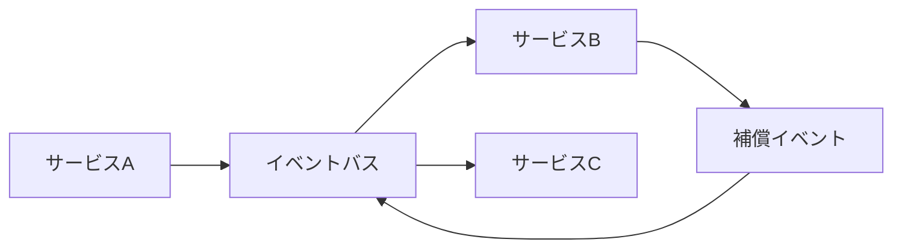
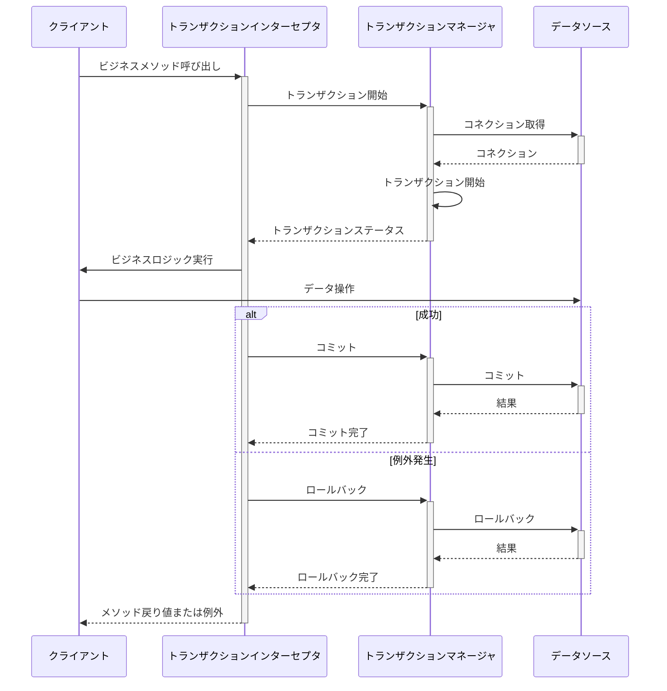

# トランザクション管理機能 概要

## バージョン管理
| バージョン | 日付 | 更新者 | 更新内容 |
|----------|------|-------|---------|
| 0.1 | 2025-05-10 | 設計担当者 | 初版作成 |
| 0.2 | 2025-05-11 | 設計担当者 | 実装コード削除による軽量化 |

## 1. はじめに

本ドキュメントでは、SES管理システムにおけるトランザクション管理機能の概要と設計方針について説明します。トランザクション管理機能は、システム全体でのデータの一貫性と整合性を保証するための共通基盤を提供します。

## 2. 機能の位置づけ

トランザクション管理機能は、SES管理システムの共通機能モジュールとして位置づけられ、以下の特徴を持ちます：

- 業務モジュールに透過的なトランザクション管理機能を提供
- 単一データソース内のローカルトランザクションと複数リソースにまたがる分散トランザクションをサポート
- 異常終了時のデータ整合性を保証するための回復メカニズムを提供
- マイクロサービスアーキテクチャにおけるトランザクション境界の管理を支援

## 3. 主要機能

トランザクション管理機能は以下の主要機能を提供します：

### 3.1 ローカルトランザクション管理

- 宣言的トランザクション制御（アノテーションベース）
- プログラム的トランザクション制御（TransactionTemplate）
- トランザクションの伝播制御
- 分離レベルの管理
- 例外に基づくロールバックルールの設定
- トランザクションタイムアウト管理
- 読み取り専用トランザクションの最適化

### 3.2 分散トランザクション管理

- 2相コミットプロトコル（2PC）の実装
- SAGA パターンによる長時間実行トランザクションの管理
- 補償トランザクションの実装
- イベントドリブントランザクション（イベントソーシングと結果整合性）
- 最終的一貫性の確保メカニズム
- トランザクションログとリカバリポイントの管理

### 3.3 トランザクション監視・管理

- トランザクション実行状況のリアルタイムモニタリング
- トランザクションログの記録と分析
- デッドロック検出と解決
- 長時間実行トランザクションの管理
- トランザクション統計情報の収集と分析

## 4. ユースケース

トランザクション管理機能の主なユースケースは以下の通りです：

### 4.1 契約管理モジュール

- 契約締結時の複数エンティティ（契約、技術者アサイン、料金設定など）の一括更新
- 契約変更における整合性の保証（料金改定と契約情報の同期）
- 契約解除処理の一貫性確保（関連データの整合性維持）

### 4.2 請求支払管理モジュール

- 月次請求処理における複数の関連データ更新の一括処理
- 入金確認と請求ステータス更新の整合性確保
- 支払処理と技術者への支払い情報の一貫性維持

### 4.3 マッチング機能

- 技術者アサイン時の案件情報と技術者情報の同期更新
- 複数候補者のマッチング処理における整合性確保
- マッチングステータス変更時の関連エンティティの一括更新

### 4.4 マイクロサービス間連携

- サービス境界をまたぐビジネスプロセスの一貫性確保
- サービス間でのデータ整合性の維持
- 障害発生時のサービス状態の回復

## 5. アーキテクチャ

トランザクション管理機能は、以下のアーキテクチャパターンを採用しています：

### 5.1 レイヤード構造

```
┌───────────────────────────────────────────────┐
│       Transaction Management API Layer         │
│  (TransactionTemplate, Annotations, etc.)      │
└───────────────────┬───────────────────────────┘
                    │
┌───────────────────┼───────────────────────────┐
│       Transaction Coordination Layer           │
│  (TransactionManager, CoordinationServices)    │
└───────────────────┬───────────────────────────┘
                    │
┌───────────────────┼───────────────────────────┐
│       Resource Adapter Layer                   │
│  (DataSourceAdapter, JMSAdapter, etc.)         │
└───────────────────┬───────────────────────────┘
                    │
┌───────────────────┼───────────────────────────┐
│       Infrastructure Layer                     │
│  (JDBC, JMS, External Services, etc.)          │
└───────────────────────────────────────────────┘
```

### 5.2 アスペクト指向プログラミング

トランザクション境界の定義にアスペクト指向プログラミング（AOP）を活用し、業務ロジックとトランザクション管理の関心事を分離します。



### 5.3 イベントドリブンアーキテクチャ

分散トランザクションの一部としてイベントドリブンアーキテクチャを採用しています。



## 6. システム構成

### 6.1 論理コンポーネント

トランザクション管理機能は以下の論理コンポーネントで構成されます：

- **TransactionManager**: トランザクションの基本操作（開始・コミット・ロールバック）を提供
- **TransactionInterceptor**: 宣言的トランザクション管理のためのAOPインターセプタ
- **TransactionTemplate**: プログラム的トランザクション管理のためのテンプレート
- **TransactionSynchronizationManager**: トランザクション同期の管理
- **DistributedTransactionCoordinator**: 分散トランザクションの調整
- **CompensationManager**: 補償トランザクションの管理
- **TransactionLogManager**: トランザクションログの記録と管理
- **ResourceManager**: トランザクション内のリソース管理
- **TransactionRecoveryManager**: 障害時の回復処理

### 6.2 物理構成

システムの物理構成は以下の要素で構成されます：

#### 開発環境
- **データベース**: 単一のRDBMS（PostgreSQL）
- **トランザクションマネージャ**: アプリケーションサーバー内蔵
- **ログ記録**: ローカルストレージ

#### テスト環境
- **データベース**: レプリケーション構成のRDBMS
- **トランザクションマネージャ**: アプリケーションサーバー内蔵
- **メッセージキュー**: RabbitMQ/Kafka（分散トランザクション用）
- **ログ記録**: 集中ログサーバー

#### 本番環境
- **データベース**: 高可用性構成のRDBMS
- **トランザクションマネージャ**: クラスタ化されたアプリケーションサーバー
- **メッセージキュー**: 冗長化されたKafkaクラスタ
- **ログ記録**: 分散ログ基盤
- **監視システム**: トランザクション状態のリアルタイムモニタリング

## 7. 技術スタック

トランザクション管理機能は以下の技術スタックを採用しています：

| 技術分野 | 採用技術 |
|--------|---------|
| 開発言語 | Java 17 |
| トランザクション管理 | Spring Transaction |
| アスペクト指向プログラミング | Spring AOP |
| ORM | Spring Data JPA |
| メッセージング | Spring AMQP / Spring Kafka |
| 分散トランザクション | Atomikos / 自作SAGA実装 |
| モニタリング | Micrometer + Prometheus |

## 8. 非機能要件

### 8.1 性能要件

- ローカルトランザクション開始オーバーヘッド: 5ms以内
- 分散トランザクションのレイテンシ増加: 標準トランザクションの20%以内
- 同時トランザクション処理能力: 1000TPS以上
- トランザクションタイムアウト: 最大30秒（設定可能）

### 8.2 信頼性要件

- トランザクションの原子性保証: 99.999%
- システム障害時のトランザクション一貫性保証: 100%
- 分散トランザクションの一貫性: 最終的一貫性の保証
- トランザクションログの保持: 30日間

### 8.3 拡張性要件

- 複数のRDBMSサポート（PostgreSQL, MySQL, Oracle, SQL Server）
- NoSQLデータベースとの連携（MongoDB, Redis）
- 各種メッセージブローカーとの連携（RabbitMQ, Kafka, ActiveMQ）
- REST APIなどの外部サービス連携サポート

### 8.4 運用要件

- トランザクション状態のリアルタイムモニタリング
- 異常トランザクションの自動検出と通知
- トランザクションログの監査対応
- 運用中の設定変更サポート（動的パラメータ調整）

## 9. データフロー

### 9.1 ローカルトランザクションフロー



### 9.2 分散トランザクションフロー（2PC）

```mermaid
sequenceDiagram
    participant Client as クライアント
    participant Coordinator as トランザクションコーディネータ
    participant ServiceA as サービスA
    participant ServiceB as サービスB
    
    Client->>+Coordinator: 分散トランザクション開始
    Coordinator->>Coordinator: トランザクションID生成
    Coordinator->>+ServiceA: 準備フェーズ開始
    ServiceA->>ServiceA: リソースロック取得
    ServiceA-->>-Coordinator: 準備完了
    
    Coordinator->>+ServiceB: 準備フェーズ開始
    ServiceB->>ServiceB: リソースロック取得
    ServiceB-->>-Coordinator: 準備完了
    
    alt すべて準備完了
        Coordinator->>+ServiceA: コミットフェーズ開始
        ServiceA->>ServiceA: 変更確定
        ServiceA-->>-Coordinator: コミット完了
        
        Coordinator->>+ServiceB: コミットフェーズ開始
        ServiceB->>ServiceB: 変更確定
        ServiceB-->>-Coordinator: コミット完了
        
        Coordinator-->>-Client: トランザクション完了
    else 準備失敗
        Coordinator->>+ServiceA: ロールバックフェーズ開始
        ServiceA->>ServiceA: 変更取り消し
        ServiceA-->>-Coordinator: ロールバック完了
        
        Coordinator->>+ServiceB: ロールバックフェーズ開始
        ServiceB->>ServiceB: 変更取り消し
        ServiceB-->>-Coordinator: ロールバック完了
        
        Coordinator-->>-Client: トランザクション失敗
    end
```

### 9.3 SAGAパターンによる分散トランザクションフロー

```mermaid
sequenceDiagram
    participant Client as クライアント
    participant Orchestrator as SAGAオーケストレータ
    participant ServiceA as サービスA
    participant ServiceB as サービスB
    
    Client->>+Orchestrator: SAGA開始
    Orchestrator->>Orchestrator: SAGA ID生成
    
    Orchestrator->>+ServiceA: トランザクションA実行
    ServiceA->>ServiceA: ローカルトランザクション実行
    ServiceA-->>-Orchestrator: 成功
    
    Orchestrator->>+ServiceB: トランザクションB実行
    
    alt サービスB成功
        ServiceB->>ServiceB: ローカルトランザクション実行
        ServiceB-->>-Orchestrator: 成功
        Orchestrator-->>-Client: SAGA完了（成功）
    else サービスB失敗
        ServiceB->>ServiceB: ローカルトランザクション失敗
        ServiceB-->>-Orchestrator: 失敗
        
        Orchestrator->>+ServiceA: 補償トランザクションA実行
        ServiceA->>ServiceA: 補償処理実行
        ServiceA-->>-Orchestrator: 補償完了
        
        Orchestrator-->>-Client: SAGA完了（失敗）
    end
```

## 10. 開発ロードマップ

トランザクション管理機能の開発ロードマップは以下の通りです：

### フェーズ1（基盤構築）
- ローカルトランザクション管理機能の実装
- 宣言的トランザクション制御の提供
- トランザクションログ記録の実装

### フェーズ2（拡張機能）
- 分散トランザクション（2PC）の実装
- トランザクション監視機能の追加
- 複数データソース対応

### フェーズ3（高度な分散トランザクション）
- SAGAパターンの実装
- イベントドリブントランザクションの追加
- 複数メッセージングシステム対応

### フェーズ4（運用最適化）
- パフォーマンス最適化
- 障害自動復旧メカニズムの強化
- 運用管理ツールの拡充

## 11. 依存関係

トランザクション管理機能が依存する主なシステムコンポーネントは以下の通りです：

- **データベースアクセス機能**: データベース操作のトランザクション管理
- **メッセージング機能**: イベント処理のトランザクション連携
- **ロギング機能**: トランザクション実行ログの記録
- **監視機能**: トランザクション状態のモニタリング
- **認証・認可機能**: トランザクション操作の権限管理

トランザクション管理機能を利用する主なシステムコンポーネントは以下の通りです：

- **契約管理モジュール**
- **請求・支払管理モジュール**
- **マッチング機能モジュール**
- **技術者管理モジュール**
- **案件管理モジュール**

## 12. リスクと対策

| リスク | 影響 | 対策 |
|-------|-----|------|
| デッドロックの発生 | 処理の停止、システム応答性低下 | デッドロック検出機能、タイムアウト設定、トランザクション設計ガイドライン |
| 分散トランザクションの整合性破綻 | データ不整合、業務エラー | 補償トランザクション、整合性チェック機能、トランザクションログによる追跡 |
| トランザクションオーバーヘッドの増大 | パフォーマンス低下 | 最適なトランザクション境界設計、読み取り専用最適化、適切な分離レベル設定 |
| ネットワーク障害による分散トランザクション失敗 | サービス不可、データ整合性リスク | 耐障害設計、リトライメカニズム、状態回復手順の自動化 |

## 13. 用語定義

| 用語 | 定義 |
|-----|------|
| トランザクション | データベースの一連の操作を不可分の単位としてまとめたもの |
| ACID特性 | 原子性(Atomicity)、一貫性(Consistency)、独立性(Isolation)、永続性(Durability)の頭文字 |
| 2PC | Two-Phase Commit（二相コミット）プロトコル。分散トランザクションの一貫性を保証する手法 |
| SAGA | 長時間実行トランザクションを管理するパターン。補償トランザクションを用いる |
| 伝播属性 | 既存トランザクションが存在する場合の新規トランザクションの動作を定義する属性 |
| 分離レベル | 並行トランザクションの影響をどの程度許容するかを定義するレベル |
| 補償トランザクション | 失敗したトランザクションの効果を打ち消すために実行されるトランザクション |
| イベントソーシング | システムの状態変化をイベントとして記録し、状態を再構築可能にする手法 |