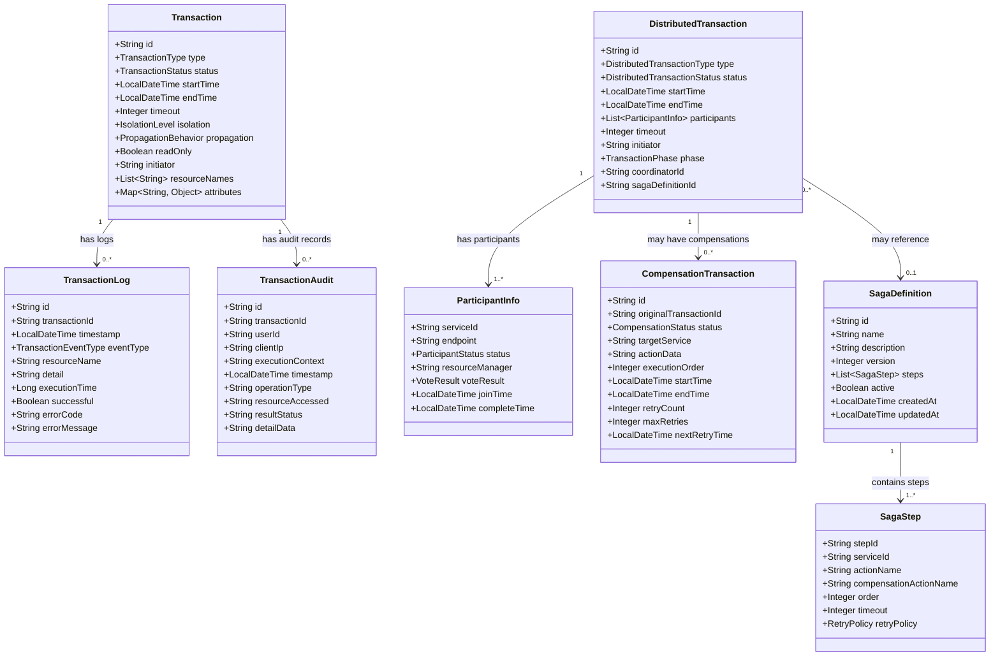

# トランザクション管理機能 ドメインモデル

## バージョン管理
| バージョン | 日付 | 更新者 | 更新内容 |
|----------|------|-------|---------|
| 0.1 | 2025-05-10 | 設計担当者 | 初版作成 |
| 0.2 | 2025-05-11 | 設計担当者 | 実装コード削除による軽量化 |

## 1. 概要

本ドキュメントでは、トランザクション管理機能のドメインモデルを定義します。ドメインモデルは、トランザクション管理に関連する主要な概念とそれらの関係性を表現したものであり、システム設計の基盤となります。

## 2. エンティティ

### 2.1 Transaction（トランザクション）

システム内でのトランザクションを表すエンティティです。

#### 属性

| 属性名 | 型 | 説明 | 制約 |
|--------|------|------|------|
| id | String | トランザクションの一意識別子 | PK, NOT NULL |
| type | TransactionType | トランザクションの種類 | NOT NULL |
| status | TransactionStatus | トランザクションの状態 | NOT NULL |
| startTime | LocalDateTime | 開始時刻 | NOT NULL |
| endTime | LocalDateTime | 終了時刻 | |
| timeout | Integer | タイムアウト時間（秒） | |
| isolation | IsolationLevel | 分離レベル | NOT NULL |
| propagation | PropagationBehavior | 伝播属性 | NOT NULL |
| readOnly | Boolean | 読み取り専用フラグ | NOT NULL, デフォルトfalse |
| initiator | String | 開始者ID（ユーザーまたはシステム） | NOT NULL |
| resourceNames | List<String> | 関連リソース名のリスト | |
| attributes | Map<String, Object> | トランザクション属性 | |

#### ビジネスルール

- トランザクションIDは一意であり、UUIDまたはシーケンス番号で生成
- 開始したトランザクションは必ずコミットかロールバックで終了する
- タイムアウトを超過した場合は自動的にロールバック
- 読み取り専用トランザクションでは更新操作は許可されない

### 2.2 DistributedTransaction（分散トランザクション）

複数のサービスにまたがる分散トランザクションを表すエンティティです。

#### 属性

| 属性名 | 型 | 説明 | 制約 |
|--------|------|------|------|
| id | String | 分散トランザクションの一意識別子 | PK, NOT NULL |
| type | DistributedTransactionType | 分散トランザクションの種類 | NOT NULL |
| status | DistributedTransactionStatus | 分散トランザクションの状態 | NOT NULL |
| startTime | LocalDateTime | 開始時刻 | NOT NULL |
| endTime | LocalDateTime | 終了時刻 | |
| participants | List<ParticipantInfo> | 参加サービス情報のリスト | NOT NULL |
| timeout | Integer | タイムアウト時間（秒） | NOT NULL |
| initiator | String | 開始者ID | NOT NULL |
| phase | TransactionPhase | トランザクションフェーズ | |
| coordinatorId | String | コーディネータID | NOT NULL |
| sagaDefinitionId | String | SAGAプロセス定義ID | |

#### ビジネスルール

- 分散トランザクションは少なくとも2つ以上のパーティシパントを持つ
- すべてのパーティシパントが準備フェーズを完了しない限りコミットフェーズに進まない
- いずれかのパーティシパントが準備フェーズで失敗した場合、全体がロールバックされる
- タイムアウトを超過した場合は自動的にロールバックされる

### 2.3 TransactionLog（トランザクションログ）

トランザクションの実行履歴を記録するエンティティです。

#### 属性

| 属性名 | 型 | 説明 | 制約 |
|--------|------|------|------|
| id | String | ログの一意識別子 | PK, NOT NULL |
| transactionId | String | トランザクションID | NOT NULL |
| timestamp | LocalDateTime | 記録時刻 | NOT NULL |
| eventType | TransactionEventType | イベント種別 | NOT NULL |
| resourceName | String | 関連リソース名 | |
| detail | String | 詳細情報 | |
| executionTime | Long | 実行時間（ミリ秒） | |
| successful | Boolean | 成功フラグ | NOT NULL |
| errorCode | String | エラーコード | |
| errorMessage | String | エラーメッセージ | |

#### ビジネスルール

- トランザクションの開始、終了、例外発生時に自動的にログが記録される
- 分散トランザクションの場合は各参加者の状態変更もログに記録される
- エラー情報はトラブルシューティングに十分な情報を含む

### 2.4 CompensationTransaction（補償トランザクション）

分散トランザクションで失敗した場合に実行される補償トランザクションを表すエンティティです。

#### 属性

| 属性名 | 型 | 説明 | 制約 |
|--------|------|------|------|
| id | String | 補償トランザクションの一意識別子 | PK, NOT NULL |
| originalTransactionId | String | 元のトランザクションID | NOT NULL |
| status | CompensationStatus | 補償処理の状態 | NOT NULL |
| targetService | String | 対象サービス | NOT NULL |
| actionData | String | 補償アクション用データ | |
| executionOrder | Integer | 実行順序 | NOT NULL |
| startTime | LocalDateTime | 開始時刻 | |
| endTime | LocalDateTime | 終了時刻 | |
| retryCount | Integer | リトライ回数 | NOT NULL, デフォルト0 |
| maxRetries | Integer | 最大リトライ回数 | NOT NULL |
| nextRetryTime | LocalDateTime | 次回リトライ時刻 | |

#### ビジネスルール

- 補償トランザクションは元のトランザクションの逆順で実行される
- 補償処理は冪等性（何度実行しても同じ結果になる）を保証する
- 一定回数リトライしても失敗する場合は手動介入が必要

### 2.5 SagaDefinition（SAGAプロセス定義）

SAGAパターンによる分散トランザクションの定義を表すエンティティです。

#### 属性

| 属性名 | 型 | 説明 | 制約 |
|--------|------|------|------|
| id | String | SAGA定義の一意識別子 | PK, NOT NULL |
| name | String | SAGA名 | NOT NULL |
| description | String | 説明 | |
| version | Integer | バージョン | NOT NULL |
| steps | List<SagaStep> | SAGAステップのリスト | NOT NULL |
| active | Boolean | 有効フラグ | NOT NULL, デフォルトtrue |
| createdAt | LocalDateTime | 作成日時 | NOT NULL |
| updatedAt | LocalDateTime | 更新日時 | |

#### ビジネスルール

- SAGAプロセス定義はバージョン管理され、最新バージョンが使用される
- 各ステップには必ず通常アクションと対応する補償アクションが定義される
- アクティブなSAGA定義のみがトランザクション実行時に使用される

### 2.6 TransactionAudit（トランザクション監査）

トランザクション実行の詳細な監査情報を表すエンティティです。

#### 属性

| 属性名 | 型 | 説明 | 制約 |
|--------|------|------|------|
| id | String | 監査の一意識別子 | PK, NOT NULL |
| transactionId | String | トランザクションID | NOT NULL |
| userId | String | ユーザーID | |
| clientIp | String | クライアントIPアドレス | |
| executionContext | String | 実行コンテキスト | |
| timestamp | LocalDateTime | 記録時刻 | NOT NULL |
| operationType | String | 操作種別 | NOT NULL |
| resourceAccessed | String | アクセスしたリソース | |
| resultStatus | String | 結果ステータス | NOT NULL |
| detailData | String | 詳細データ（JSON） | |

#### ビジネスルール

- 監査ログは削除不可
- 機密情報はマスキングまたは暗号化して記録

## 3. 値オブジェクト

### 3.1 TransactionStatus（トランザクションステータス）

トランザクションの状態を表す値オブジェクトです。

#### 値

- `ACTIVE`: トランザクションがアクティブな状態
- `COMMITTED`: 正常にコミットされた状態
- `ROLLED_BACK`: ロールバックされた状態
- `COMMITTING`: コミット処理中の状態
- `ROLLING_BACK`: ロールバック処理中の状態
- `FAILED`: エラーで失敗した状態
- `TIMED_OUT`: タイムアウトで終了した状態
- `UNKNOWN`: 状態が不明な状態

### 3.2 IsolationLevel（分離レベル）

トランザクションの分離レベルを表す値オブジェクトです。

#### 値

- `READ_UNCOMMITTED`: コミットされていないデータの読み取りを許可
- `READ_COMMITTED`: コミットされたデータのみ読み取り可能
- `REPEATABLE_READ`: トランザクション内での再読み取りで同じデータが返却される
- `SERIALIZABLE`: 最も厳格な分離レベル、直列化可能なトランザクション

#### ビジネスルール

- 特に指定がない場合のデフォルトは `READ_COMMITTED`
- 読み取り専用トランザクションでは `READ_COMMITTED` 以上を推奨

### 3.3 PropagationBehavior（伝播属性）

既存のトランザクションが存在する場合のトランザクション境界の動作を定義する値オブジェクトです。

#### 値

- `REQUIRED`: 既存のトランザクションがあれば参加し、なければ新規作成
- `REQUIRES_NEW`: 常に新しいトランザクションを作成
- `SUPPORTS`: 既存のトランザクションがあれば参加し、なければトランザクションなしで実行
- `NOT_SUPPORTED`: トランザクションなしで実行、既存のトランザクションは一時停止
- `MANDATORY`: 既存のトランザクションが必須、なければ例外
- `NEVER`: トランザクションなしで実行、既存のトランザクションがあれば例外
- `NESTED`: 既存のトランザクション内に入れ子のトランザクションを作成

#### ビジネスルール

- 特に指定がない場合のデフォルトは `REQUIRED`
- 分散トランザクションでは `REQUIRES_NEW` が推奨される場合がある

### 3.4 ParticipantInfo（参加者情報）

分散トランザクションの参加者情報を表す値オブジェクトです。

#### 属性

| 属性名 | 型 | 説明 |
|--------|------|------|
| serviceId | String | サービスID |
| endpoint | String | エンドポイントURL |
| status | ParticipantStatus | 参加者の状態 |
| resourceManager | String | リソースマネージャ識別子 |
| voteResult | VoteResult | 投票結果 |
| joinTime | LocalDateTime | 参加時刻 |
| completeTime | LocalDateTime | 完了時刻 |

### 3.5 TransactionPhase（トランザクションフェーズ）

2相コミットプロトコルにおけるフェーズを表す値オブジェクトです。

#### 値

- `PREPARE`: 準備フェーズ
- `COMMIT`: コミットフェーズ
- `ROLLBACK`: ロールバックフェーズ
- `HEURISTIC`: 不確定な状態（手動介入が必要）

### 3.6 TransactionEventType（トランザクションイベント種別）

トランザクションの実行中に発生するイベントの種類を表す値オブジェクトです。

#### 値

- `BEGIN`: トランザクション開始
- `COMMIT`: トランザクションコミット
- `ROLLBACK`: トランザクションロールバック
- `SUSPEND`: トランザクション一時停止
- `RESUME`: トランザクション再開
- `TIMEOUT`: タイムアウト発生
- `ERROR`: エラー発生
- `PARTICIPANT_JOIN`: 参加者が参加
- `PARTICIPANT_VOTE`: 参加者の投票
- `PHASE_CHANGE`: フェーズ変更

### 3.7 SagaStep（SAGAステップ）

SAGAパターンでのトランザクションステップを表す値オブジェクトです。

#### 属性

| 属性名 | 型 | 説明 |
|--------|------|------|
| stepId | String | ステップID |
| serviceId | String | サービスID |
| actionName | String | アクション名 |
| compensationActionName | String | 補償アクション名 |
| order | Integer | 実行順序 |
| timeout | Integer | タイムアウト時間（秒） |
| retryPolicy | RetryPolicy | リトライポリシー |

### 3.8 RetryPolicy（リトライポリシー）

失敗した処理のリトライポリシーを表す値オブジェクトです。

#### 属性

| 属性名 | 型 | 説明 |
|--------|------|------|
| maxRetries | Integer | 最大リトライ回数 |
| initialDelay | Integer | 初期遅延時間（ミリ秒） |
| maxDelay | Integer | 最大遅延時間（ミリ秒） |
| multiplier | Double | 遅延時間の乗数 |
| retryableExceptions | Set<String> | リトライ対象例外クラス名 |

## 4. 集約

### 4.1 Transaction集約

Transaction集約は、Transactionをルートエンティティとし、以下のエンティティや値オブジェクトを含みます：

- Transaction（ルートエンティティ）
- TransactionLog（エンティティ）
- TransactionStatus（値オブジェクト）
- IsolationLevel（値オブジェクト）
- PropagationBehavior（値オブジェクト）
- TransactionEventType（値オブジェクト）

Transaction集約は、単一のトランザクションとその実行ログを管理し、トランザクションの一貫性を保証します。

### 4.2 DistributedTransaction集約

DistributedTransaction集約は、DistributedTransactionをルートエンティティとし、以下のエンティティや値オブジェクトを含みます：

- DistributedTransaction（ルートエンティティ）
- CompensationTransaction（エンティティ）
- ParticipantInfo（値オブジェクト）
- TransactionPhase（値オブジェクト）
- DistributedTransactionStatus（値オブジェクト）

DistributedTransaction集約は、複数のサービスにまたがるトランザクションとその参加者、補償トランザクションを管理します。

### 4.3 SagaProcess集約

SagaProcess集約は、SagaDefinitionをルートエンティティとし、以下のエンティティや値オブジェクトを含みます：

- SagaDefinition（ルートエンティティ）
- SagaStep（値オブジェクト）
- RetryPolicy（値オブジェクト）

SagaProcess集約は、SAGAパターンによる長時間実行トランザクションの定義とその実行ステップを管理します。

## 5. リポジトリ

### 5.1 TransactionRepository

Transaction集約のためのリポジトリインターフェースは以下の操作を提供します：

- findById(String id): Optional<Transaction>
- save(Transaction transaction): Transaction
- findByStatus(TransactionStatus status): List<Transaction>
- findByInitiator(String initiator): List<Transaction>
- findByTimeRange(LocalDateTime start, LocalDateTime end): List<Transaction>
- findTimedOutTransactions(): List<Transaction>
- countByStatusAndTimeRange(TransactionStatus status, LocalDateTime start, LocalDateTime end): Integer

### 5.2 TransactionLogRepository

TransactionLogエンティティのためのリポジトリインターフェースは以下の操作を提供します：

- findByTransactionId(String transactionId): List<TransactionLog>
- save(TransactionLog log): TransactionLog
- findByEventTypeAndTimeRange(TransactionEventType eventType, LocalDateTime start, LocalDateTime end): List<TransactionLog>
- findErrorLogsByTimeRange(LocalDateTime start, LocalDateTime end): List<TransactionLog>
- archiveLogsBefore(LocalDateTime cutoffTime): Integer

### 5.3 DistributedTransactionRepository

DistributedTransaction集約のためのリポジトリインターフェースは以下の操作を提供します：

- findById(String id): Optional<DistributedTransaction>
- save(DistributedTransaction transaction): DistributedTransaction
- findByStatus(DistributedTransactionStatus status): List<DistributedTransaction>
- findByParticipant(String participantId): List<DistributedTransaction>
- findByCoordinatorId(String coordinatorId): List<DistributedTransaction>
- findTimedOutTransactions(): List<DistributedTransaction>
- updateParticipantStatus(String transactionId, String participantId, ParticipantStatus status): Boolean

### 5.4 CompensationTransactionRepository

CompensationTransactionエンティティのためのリポジトリインターフェースは以下の操作を提供します：

- findById(String id): Optional<CompensationTransaction>
- findByOriginalTransactionId(String originalTransactionId): List<CompensationTransaction>
- save(CompensationTransaction compensationTransaction): CompensationTransaction
- findPendingCompensations(): List<CompensationTransaction>
- findRetryableCompensations(): List<CompensationTransaction>
- markAsComplete(String id): Boolean

### 5.5 SagaDefinitionRepository

SagaDefinition集約のためのリポジトリインターフェースは以下の操作を提供します：

- findById(String id): Optional<SagaDefinition>
- findByName(String name): List<SagaDefinition>
- findByNameAndVersion(String name, Integer version): Optional<SagaDefinition>
- findLatestVersionByName(String name): Optional<SagaDefinition>
- findActiveDefinitions(): List<SagaDefinition>
- save(SagaDefinition sagaDefinition): SagaDefinition

## 6. ドメインサービス

### 6.1 TransactionManagementService

トランザクションの基本操作を担当するドメインサービスです。

#### 主要機能

- beginTransaction(TransactionParameters params): TransactionStatus
- commitTransaction(String transactionId): void
- rollbackTransaction(String transactionId): void
- suspendCurrentTransaction(): TransactionStatus
- resumeTransaction(TransactionStatus status): void
- getCurrentTransaction(): Optional<Transaction>
- isTransactionActive(): Boolean

### 6.2 TransactionSynchronizationService

トランザクションのライフサイクルに同期したアクションを登録・実行するためのドメインサービスです。

#### 主要機能

- registerSynchronization(TransactionSynchronization synchronization): void
- triggerBeforeCommit(): void
- triggerAfterCommit(): void
- triggerBeforeRollback(): void
- triggerAfterRollback(): void
- triggerAfterCompletion(TransactionStatus status): void

### 6.3 DistributedTransactionService

分散トランザクションを管理するドメインサービスです。

#### 主要機能

- beginDistributedTransaction(DistributedTransactionParameters params): String
- preparePhase(String transactionId): Boolean
- commitPhase(String transactionId): DistributedTransactionResult
- rollbackPhase(String transactionId): void
- getTransactionStatus(String transactionId): DistributedTransactionStatus
- recoverInDoubtTransactions(): Integer

### 6.4 CompensationService

補償トランザクションを管理するドメインサービスです。

#### 主要機能

- scheduleCompensation(String originalTransactionId, String targetService, String actionData): String
- executeCompensation(String compensationId): CompensationResult
- scheduleRetry(String compensationId, LocalDateTime retryTime): Boolean
- findPendingCompensations(String originalTransactionId): List<CompensationTransaction>
- processCompensationQueue(): Integer

### 6.5 SagaOrchestrationService

SAGAパターンによるトランザクション調整を担当するドメインサービスです。

#### 主要機能

- startSaga(String sagaDefinitionId, Map<String, Object> parameters): String
- executeStep(String sagaInstanceId, String stepId): StepResult
- compensateStep(String sagaInstanceId, String stepId): StepResult
- completeSaga(String sagaInstanceId): Boolean
- abortSaga(String sagaInstanceId): Boolean
- getSagaStatus(String sagaInstanceId): SagaStatus

## 7. ドメインイベント

### 7.1 TransactionStartedEvent

トランザクションが開始された際に発行されるイベントです。

#### 属性

- transactionId: String
- timestamp: LocalDateTime
- initiator: String
- transactionType: TransactionType
- propagation: PropagationBehavior
- isolation: IsolationLevel
- readOnly: Boolean
- resourceNames: List<String>

### 7.2 TransactionCompletedEvent

トランザクションが完了（コミットまたはロールバック）した際に発行されるイベントです。

#### 属性

- transactionId: String
- timestamp: LocalDateTime
- status: TransactionStatus
- executionTime: Long
- successful: Boolean
- errorCode: String
- errorMessage: String

### 7.3 DistributedTransactionPhaseChangedEvent

分散トランザクションのフェーズが変更された際に発行されるイベントです。

#### 属性

- transactionId: String
- timestamp: LocalDateTime
- previousPhase: TransactionPhase
- newPhase: TransactionPhase
- participants: List<ParticipantInfo>

### 7.4 CompensationScheduledEvent

補償トランザクションがスケジュールされた際に発行されるイベントです。

#### 属性

- compensationId: String
- originalTransactionId: String
- targetService: String
- timestamp: LocalDateTime
- executionOrder: Integer
- actionData: String

### 7.5 SagaStepCompletedEvent

SAGAステップが完了した際に発行されるイベントです。

#### 属性

- sagaInstanceId: String
- stepId: String
- timestamp: LocalDateTime
- successful: Boolean
- resultData: String
- nextStepId: String

## 8. ドメインモデル関連図

トランザクション管理機能のドメインモデル要素間の関連を以下の図で表現します：

## 9. 注意事項とガイドライン

### 9.1 トランザクション境界設計

- トランザクション境界はビジネスロジックの一貫性要件に基づいて設計
- 可能な限りトランザクションの範囲を小さくする
- 長時間実行トランザクションは避け、SAGAパターンなどで分解する
- トランザクション内では最小限の処理に留める（特に外部通信や重い処理は避ける）

### 9.2 分離レベル選択

- デフォルトは `READ_COMMITTED` を使用
- データの一貫性要件が高い場合は `REPEATABLE_READ` を検討
- パフォーマンスが最重要の場合は `READ_UNCOMMITTED` も選択肢となるが、ファントムリードなどの問題に注意
- `SERIALIZABLE` は最終手段として使用（パフォーマンスが大幅に低下する可能性）

### 9.3 デッドロック対策

- トランザクション内でのリソースアクセス順序を一貫させる
- 複数リソースを扱う場合は常に同じ順序でロックを取得
- 長時間トランザクションを避ける
- 適切なタイムアウト設定を行う
- 楽観的ロックを積極的に検討

### 9.4 分散トランザクション設計

- 可能な限り分散トランザクションを避ける
- 2PCよりもSAGAパターンやイベントドリブンアプローチを優先
- 補償トランザクションの冪等性を確保
- リトライメカニズムを適切に設計
- 最終的な一貫性を目指す設計を検討