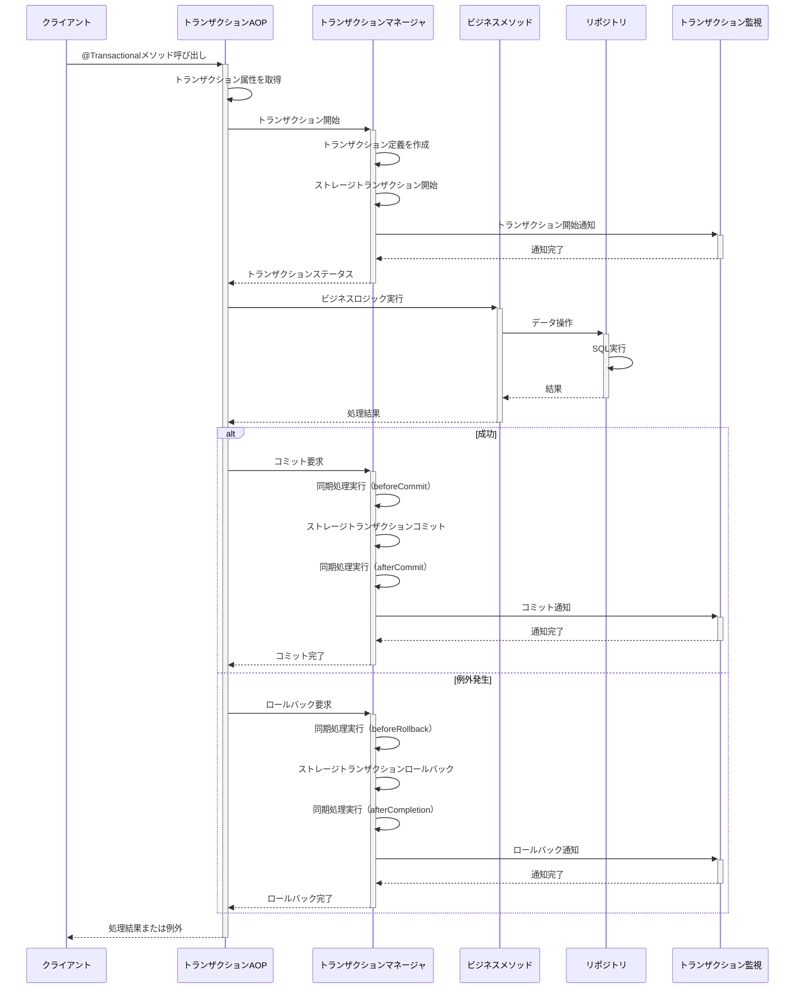
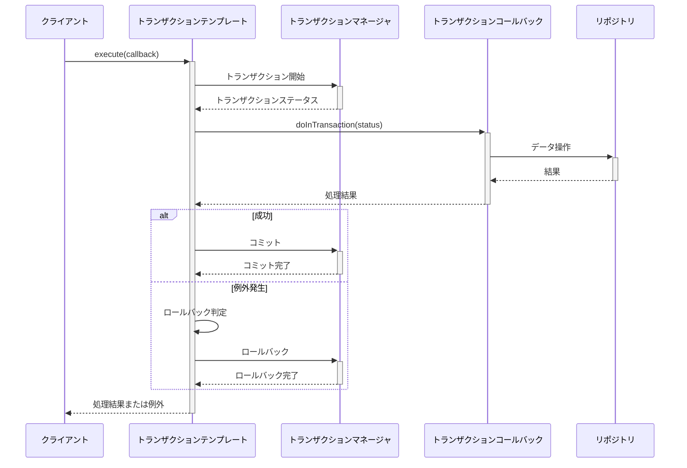

# トランザクション制御

## バージョン管理
| バージョン | 日付 | 更新者 | 更新内容 |
|----------|------|-------|---------|
| 0.1 | 2025-05-10 | 設計担当者 | 初版作成 |
| 0.2 | 2025-05-11 | 設計担当者 | 実装コード削除による軽量化 |

## 1. 概要

本ドキュメントでは、トランザクション管理機能におけるローカルトランザクション制御の詳細設計について説明します。ローカルトランザクション制御は、単一のリソースマネージャ（主にデータベース）内でのトランザクション処理を管理するためのコンポーネントです。

## 2. 責務

トランザクション制御コンポーネントの主な責務は以下の通りです：

- トランザクション境界（開始・コミット・ロールバック）の制御
- トランザクションの伝播動作の管理
- トランザクションの分離レベルの管理
- 読み取り専用トランザクションの最適化
- トランザクションタイムアウトの管理
- 例外に基づくロールバックルールの適用
- トランザクション実行状態の監視とログ記録
- トランザクション同期処理の登録と実行
- スレッドローカルなトランザクションコンテキストの管理

## 3. アーキテクチャ

トランザクション制御機能のアーキテクチャを以下に示します。

```
┌───────────────────────────────────────────────┐
│             アプリケーションコード             │
└───────────────────┬───────────────────────────┘
                    │
┌───────────────────┼───────────────────────────┐
│           宣言的トランザクション               │
│     (@Transactionalアノテーション, AOP)        │
└───────────────────┬───────────────────────────┘
                    │
┌───────────────────┼───────────────────────────┐
│         プログラム的トランザクション           │
│          (TransactionTemplate)                │
└───────────────────┬───────────────────────────┘
                    │
┌───────────────────┼───────────────────────────┐
│           トランザクションマネージャ           │
│      (PlatformTransactionManager実装)         │
└───────────────────┬───────────────────────────┘
                    │
┌───────────────────┼───────────────────────────┐
│        リソースアダプタ・ドライバ              │
│     (JDBC, JPA, Hibernate, MyBatis等)         │
└───────────────────┬───────────────────────────┘
                    │
┌───────────────────┼───────────────────────────┐
│                データベース                    │
└───────────────────────────────────────────────┘
```

## 4. トランザクションマネージャの主要コンポーネント

### 4.1 基本コンポーネント

トランザクションマネージャは以下の主要コンポーネントから構成されます：

- **TransactionManager**: トランザクション管理の主要インターフェース
- **TransactionDefinitionFactory**: トランザクション定義を作成するファクトリ
- **TransactionSynchronizationManager**: トランザクション同期を管理するコンポーネント
- **TransactionStatus**: 現在のトランザクション状態を表すコンポーネント
- **RollbackRulesRegistry**: ロールバックルールを管理するレジストリ

### 4.2 主要機能

トランザクションマネージャの主要機能としては、以下のものがあります：

- トランザクションの開始機能
- トランザクションのコミット機能
- トランザクションのロールバック機能
- トランザクション状態の管理機能
- 例外発生時のロールバック判定機能
- トランザクションのイベント通知機能
- トランザクションコンテキストのスレッドローカル管理機能

### 4.3 トランザクション定義

トランザクション定義には以下の要素が含まれます：

- **伝播方式**: 既存トランザクションへの参加方法
- **分離レベル**: トランザクション間での可視性制御
- **タイムアウト**: トランザクションの最大実行時間
- **読み取り専用フラグ**: 読み取り最適化設定

## 5. トランザクションテンプレート

トランザクションテンプレートはプログラム的なトランザクション管理を簡素化するためのパターンを実装します。

### 5.1 主要機能

- トランザクション境界の自動管理
- コールバックパターンによるトランザクション内処理の実行
- 例外発生時の自動ロールバック処理
- チェーン化された設定インターフェース

### 5.2 特殊なトランザクション実行パターン

- **読み取り専用トランザクション**: パフォーマンス最適化のための特殊モード
- **新規トランザクション実行**: 既存トランザクションとは独立したトランザクション実行

## 6. トランザクション同期メカニズム

トランザクション実行の前後に処理を追加するための同期機能を提供します。

### 6.1 トランザクション同期ポイント

- **beforeCommit**: コミット前に実行される処理
- **afterCommit**: コミット後に実行される処理
- **beforeRollback**: ロールバック前に実行される処理
- **afterCompletion**: トランザクション完了後（成功・失敗問わず）に実行される処理

### 6.2 同期リソースの管理

- トランザクションコンテキストへのリソースバインド
- トランザクション完了時のリソース自動クリーンアップ
- トランザクション境界をまたいだデータ共有のサポート

## 7. 宣言的トランザクション管理

アノテーションベースのトランザクション管理を実現するためのコンポーネントです。

### 7.1 主要コンポーネント

- **TransactionalAspect**: AOPアスペクトによるトランザクション境界制御
- **TransactionAttributeSource**: メソッドのトランザクション属性を解決するコンポーネント
- **AnnotationTransactionAttributeSource**: アノテーションからトランザクション属性を抽出

### 7.2 処理フロー

1. アノテーション付きメソッド呼び出しをインターセプト
2. メソッドからトランザクション属性を取得
3. トランザクション伝播方式に基づいてトランザクション開始判断
4. ビジネスロジック実行
5. 成功時はコミット、例外発生時はロールバック判定と処理

## 8. 処理フロー

### 8.1 宣言的トランザクション実行フロー



### 8.2 プログラム的トランザクション実行フロー



## 9. トランザクション分離レベルの影響

各トランザクション分離レベルが引き起こす可能性のある問題と対策を示します。

| 分離レベル | ダーティリード | ノンリピータブルリード | ファントムリード | パフォーマンス | 推奨ユースケース |
|-----------|-------------|--------------------|---------------|-------------|--------------|
| READ_UNCOMMITTED | 発生する可能性あり | 発生する可能性あり | 発生する可能性あり | 最も高い | 高速な読み取りが必要で、データの一貫性が重要でないケース（統計情報など） |
| READ_COMMITTED | 発生しない | 発生する可能性あり | 発生する可能性あり | 高い | 一般的なトランザクション処理（デフォルト） |
| REPEATABLE_READ | 発生しない | 発生しない | 発生する可能性あり | 中程度 | 同一トランザクション内で複数回読み取る場合 |
| SERIALIZABLE | 発生しない | 発生しない | 発生しない | 最も低い | 高い整合性が要求される金融系処理など |

## 10. トランザクション境界のベストプラクティス

トランザクション境界設計のベストプラクティスを以下に示します。

### 10.1 トランザクション境界の最適化

- トランザクションはできるだけ短く保つ
- I/Oバウンドな処理（ネットワークアクセスなど）はトランザクション外で行う
- 大量のデータ処理はバッチサイズを小さくして分割する
- トランザクションの境界はサービスレイヤに設定する

### 10.2 読み取り専用トランザクションの活用

読み取り専用トランザクションを使用することで、以下の利点があります：

- データベースリソースの最適化（ロックの削減）
- パフォーマンスの向上
- データの一貫性保証

### 10.3 伝播方式の選択

一般的な伝播方式の選択ガイドライン：

- `REQUIRED`: 大部分のケースで適切（デフォルト）
- `REQUIRES_NEW`: 既存トランザクションと独立して実行する必要がある場合
- `SUPPORTS`: 読み取り操作でトランザクションがあってもなくても良い場合
- `NOT_SUPPORTED`: パフォーマンスが重要で、トランザクションが不要な場合
- `MANDATORY`: 必ず呼び出し元でトランザクションが開始されている必要がある場合
- `NEVER`: トランザクションが存在しないことを確認する場合

### 10.4 例外処理の設計

トランザクションにおける例外処理の設計ガイドライン：

- 業務例外（チェック例外）は通常ロールバックすべきでない
- システム例外（非チェック例外）は通常ロールバックすべき
- 例外の種類に応じてロールバック動作をカスタマイズする

## 11. パフォーマンスチューニングアプローチ

### 11.1 読み取り専用トランザクションの最適化

- 読み取り専用フラグによるデータベースリソース最適化
- 短いタイムアウト設定による長時間トランザクション防止
- 参照データのキャッシュ活用

### 11.2 バッチ処理の最適化

大量のデータを処理する場合のトランザクション最適化アプローチ：

- バッチサイズの適切な設定
- 複数の小さなトランザクションへの分割
- 独立したトランザクションでの並列処理
- チェックポイント機能の実装

### 11.3 コネクションプール最適化の考慮点

- 最大コネクション数の適切な設定
- 最小アイドルコネクション数の設定
- コネクション取得タイムアウトの設定
- アイドルタイムアウト・最大ライフタイム設定

## 12. トランザクション監視と管理機能

### 12.1 監視の要件と実装アプローチ

- アクティブなトランザクション数の監視
- トランザクション成功率の追跡
- 長時間実行トランザクションの検出
- トランザクション実行統計の収集

### 12.2 JMX管理インターフェース

- アクティブトランザクション数の取得
- トランザクション統計情報の取得
- デフォルトタイムアウト設定
- 長時間実行トランザクションの一覧取得
- トランザクション強制終了機能

### 12.3 メトリクス収集

- アクティブトランザクション数のゲージメトリクス
- トランザクション総数のカウンターメトリクス
- コミット数・ロールバック数のカウンターメトリクス
- 平均トランザクション実行時間のメトリクス

### 12.4 アラート機能

- トランザクション数過多時のアラート
- ロールバック率過高時のアラート
- 長時間実行トランザクション検出時のアラート
- デッドロック検出時のアラート

## 13. デッドロック対策

### 13.1 デッドロック検出アプローチ

- DBMSのデッドロック検出機能の活用
- 長時間ロック待ちトランザクションの検出
- ロック競合パターンの分析
- デッドロック発生時のアラート通知

### 13.2 デッドロック防止策

デッドロックを防止するためのガイドラインと実装アプローチ：

1. **リソースアクセス順序の一貫性の確保**
   - ID昇順など一貫したロック取得順序の確立
   - グローバルなロック順序ポリシーの遵守

2. **トランザクションタイムアウトの適切な設定**
   - 適切なタイムアウト値の設定による無限待ちの防止
   - タイムアウト発生時の適切なリトライ戦略

3. **楽観的ロックの活用**
   - バージョンカラムによる競合検出
   - 競合時の適切なリトライ戦略
   - バージョン不一致時の合成処理

4. **トランザクション分割によるロックの最小化**
   - 大きなトランザクションの複数の小さなトランザクションへの分割
   - 読み取り処理と更新処理の分離
   - 更新処理の最小化と分割