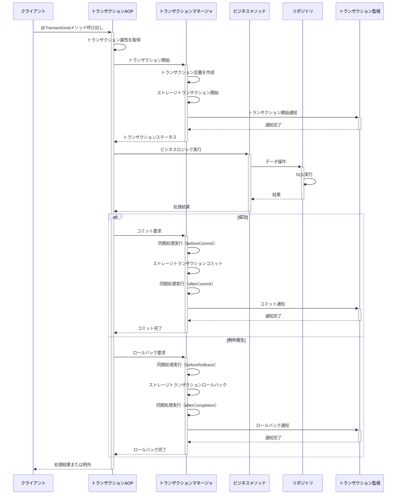
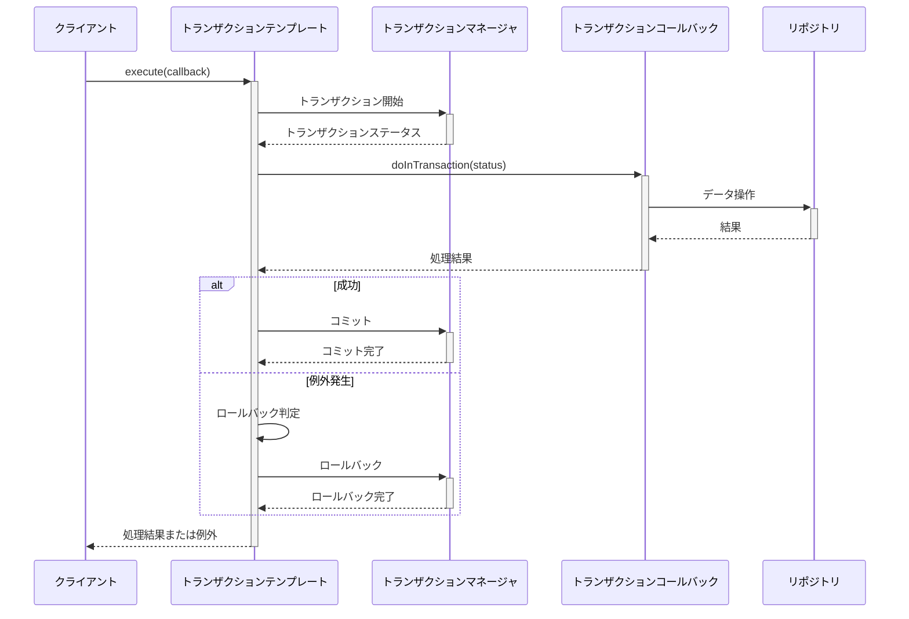

# トランザクション制御

## 1. 概要

本ドキュメントでは、トランザクション管理機能におけるローカルトランザクション制御の詳細設計について説明します。ローカルトランザクション制御は、単一のリソースマネージャ（主にデータベース）内でのトランザクション処理を管理するためのコンポーネントです。

## 2. 責務

トランザクション制御コンポーネントの主な責務は以下の通りです：

- トランザクション境界（開始・コミット・ロールバック）の制御
- トランザクションの伝播動作の管理
- トランザクションの分離レベルの管理
- 読み取り専用トランザクションの最適化
- トランザクションタイムアウトの管理
- 例外に基づくロールバックルールの適用
- トランザクション実行状態の監視とログ記録
- トランザクション同期処理の登録と実行
- スレッドローカルなトランザクションコンテキストの管理

## 3. アーキテクチャ

トランザクション制御機能のアーキテクチャを以下に示します。

```
┌───────────────────────────────────────────────┐
│             アプリケーションコード             │
└───────────────────┬───────────────────────────┘
                    │
┌───────────────────┼───────────────────────────┐
│           宣言的トランザクション               │
│     (@Transactionalアノテーション, AOP)        │
└───────────────────┬───────────────────────────┘
                    │
┌───────────────────┼───────────────────────────┐
│         プログラム的トランザクション           │
│          (TransactionTemplate)                │
└───────────────────┬───────────────────────────┘
                    │
┌───────────────────┼───────────────────────────┐
│           トランザクションマネージャ           │
│      (PlatformTransactionManager実装)         │
└───────────────────┬───────────────────────────┘
                    │
┌───────────────────┼───────────────────────────┐
│        リソースアダプタ・ドライバ              │
│     (JDBC, JPA, Hibernate, MyBatis等)         │
└───────────────────┬───────────────────────────┘
                    │
┌───────────────────┼───────────────────────────┐
│                データベース                    │
└───────────────────────────────────────────────┘
```

## 4. トランザクションマネージャの実装

### 4.1 基本実装

トランザクションマネージャの基本実装は以下の通りです：

```java
public class TransactionManagerImpl implements TransactionManager {
    private final PlatformTransactionManager platformTransactionManager;
    private final TransactionDefinitionFactory transactionDefinitionFactory;
    private final TransactionSynchronizationManager synchronizationManager;
    private final ThreadLocal<TransactionStatus> currentTransactionStatus = new ThreadLocal<>();
    private final Map<Class<? extends Throwable>, Boolean> rollbackRules = new ConcurrentHashMap<>();
    
    // 標準的な例外はデフォルトでロールバック対象に設定
    {
        rollbackRules.put(RuntimeException.class, true);
        rollbackRules.put(Error.class, true);
    }
    
    @Override
    public TransactionStatus begin(PropagationBehavior propagation, 
                                IsolationLevel isolation, 
                                int timeout, 
                                boolean readOnly) {
        // トランザクション定義の生成
        TransactionDefinition definition = transactionDefinitionFactory.create(
            propagation, isolation, timeout, readOnly);
        
        // トランザクションの開始
        org.springframework.transaction.TransactionStatus status = 
            platformTransactionManager.getTransaction(definition);
        
        // トランザクションステータスの変換
        TransactionStatus transactionStatus = convertToCustomStatus(status);
        
        // スレッドローカルに保存
        currentTransactionStatus.set(transactionStatus);
        
        // 監査ログ記録
        logTransactionBegin(transactionStatus);
        
        return transactionStatus;
    }
    
    @Override
    public void commit() throws NoTransactionException, TransactionSystemException {
        TransactionStatus status = getCurrentTransactionStatus();
        
        try {
            // トランザクションの実行時間を計測
            long startTime = System.currentTimeMillis();
            
            // コミット前に同期処理を実行
            synchronizationManager.triggerBeforeCommit();
            
            // トランザクションをコミット
            platformTransactionManager.commit(getSpringTransactionStatus(status));
            
            // コミット後に同期処理を実行
            synchronizationManager.triggerAfterCommit();
            
            // 完了処理
            synchronizationManager.triggerAfterCompletion(TransactionStatus.STATUS_COMMITTED);
            
            // 監査ログ記録
            long executionTime = System.currentTimeMillis() - startTime;
            logTransactionEnd(status, true, executionTime, null);
            
        } catch (Exception e) {
            // 例外発生時の処理
            logTransactionEnd(status, false, 0, e);
            
            // 適切な例外に変換して再スロー
            if (e instanceof org.springframework.transaction.TransactionSystemException) {
                throw new TransactionSystemException("Commit failed", e);
            } else {
                throw new TransactionSystemException("Unexpected error during commit", e);
            }
        } finally {
            // スレッドローカルから削除
            currentTransactionStatus.remove();
        }
    }
    
    @Override
    public void rollback() throws NoTransactionException, TransactionSystemException {
        TransactionStatus status = getCurrentTransactionStatus();
        
        try {
            // トランザクションの実行時間を計測
            long startTime = System.currentTimeMillis();
            
            // ロールバック前に同期処理を実行
            synchronizationManager.triggerBeforeRollback();
            
            // トランザクションをロールバック
            platformTransactionManager.rollback(getSpringTransactionStatus(status));
            
            // 完了処理
            synchronizationManager.triggerAfterCompletion(TransactionStatus.STATUS_ROLLED_BACK);
            
            // 監査ログ記録
            long executionTime = System.currentTimeMillis() - startTime;
            logTransactionEnd(status, false, executionTime, null);
            
        } catch (Exception e) {
            // 例外発生時の処理
            logTransactionEnd(status, false, 0, e);
            
            // 適切な例外に変換して再スロー
            if (e instanceof org.springframework.transaction.TransactionSystemException) {
                throw new TransactionSystemException("Rollback failed", e);
            } else {
                throw new TransactionSystemException("Unexpected error during rollback", e);
            }
        } finally {
            // スレッドローカルから削除
            currentTransactionStatus.remove();
        }
    }
    
    @Override
    public boolean isActive() {
        TransactionStatus status = currentTransactionStatus.get();
        return status != null && !status.isCompleted();
    }
    
    @Override
    public Optional<TransactionStatus> getCurrentTransaction() {
        return Optional.ofNullable(currentTransactionStatus.get());
    }
    
    @Override
    public void setRollbackOnlyForException(Class<? extends Throwable> exceptionClass, 
                                          boolean rollback) {
        rollbackRules.put(exceptionClass, rollback);
    }
    
    // 以下、内部ヘルパーメソッド
    private TransactionStatus getCurrentTransactionStatus() throws NoTransactionException {
        TransactionStatus status = currentTransactionStatus.get();
        if (status == null) {
            throw new NoTransactionException("No active transaction");
        }
        return status;
    }
    
    private org.springframework.transaction.TransactionStatus getSpringTransactionStatus(
            TransactionStatus status) {
        // カスタムステータスからSpringのステータスに変換（実装省略）
        // ...
    }
    
    private void logTransactionBegin(TransactionStatus status) {
        // トランザクション開始ログの記録（実装省略）
        // ...
    }
    
    private void logTransactionEnd(TransactionStatus status, boolean success, 
                                 long executionTime, Exception exception) {
        // トランザクション終了ログの記録（実装省略）
        // ...
    }
}
```

### 4.2 トランザクション定義ファクトリ

トランザクション定義を作成するためのファクトリクラスです。

```java
public class TransactionDefinitionFactory {
    
    /**
     * トランザクション定義を作成する
     */
    public TransactionDefinition create(PropagationBehavior propagation, 
                                      IsolationLevel isolation,
                                      int timeout,
                                      boolean readOnly) {
        DefaultTransactionDefinition def = new DefaultTransactionDefinition();
        
        // 伝播方式を設定
        def.setPropagationBehavior(convertPropagation(propagation));
        
        // 分離レベルを設定
        def.setIsolationLevel(convertIsolation(isolation));
        
        // タイムアウトを設定
        def.setTimeout(timeout);
        
        // 読み取り専用フラグを設定
        def.setReadOnly(readOnly);
        
        return def;
    }
    
    /**
     * カスタム伝播方式をSpringの伝播方式に変換する
     */
    private int convertPropagation(PropagationBehavior propagation) {
        switch (propagation) {
            case REQUIRED:
                return TransactionDefinition.PROPAGATION_REQUIRED;
            case REQUIRES_NEW:
                return TransactionDefinition.PROPAGATION_REQUIRES_NEW;
            case SUPPORTS:
                return TransactionDefinition.PROPAGATION_SUPPORTS;
            case NOT_SUPPORTED:
                return TransactionDefinition.PROPAGATION_NOT_SUPPORTED;
            case MANDATORY:
                return TransactionDefinition.PROPAGATION_MANDATORY;
            case NEVER:
                return TransactionDefinition.PROPAGATION_NEVER;
            case NESTED:
                return TransactionDefinition.PROPAGATION_NESTED;
            default:
                return TransactionDefinition.PROPAGATION_REQUIRED;
        }
    }
    
    /**
     * カスタム分離レベルをSpringの分離レベルに変換する
     */
    private int convertIsolation(IsolationLevel isolation) {
        switch (isolation) {
            case READ_UNCOMMITTED:
                return TransactionDefinition.ISOLATION_READ_UNCOMMITTED;
            case READ_COMMITTED:
                return TransactionDefinition.ISOLATION_READ_COMMITTED;
            case REPEATABLE_READ:
                return TransactionDefinition.ISOLATION_REPEATABLE_READ;
            case SERIALIZABLE:
                return TransactionDefinition.ISOLATION_SERIALIZABLE;
            default:
                return TransactionDefinition.ISOLATION_DEFAULT;
        }
    }
}
```

## 5. トランザクションテンプレート

トランザクションテンプレートはプログラム的なトランザクション管理を簡素化するためのパターンを実装します。

```java
public class TransactionTemplateImpl implements TransactionTemplate {
    private final TransactionManager transactionManager;
    private PropagationBehavior propagationBehavior = PropagationBehavior.REQUIRED;
    private IsolationLevel isolationLevel = IsolationLevel.READ_COMMITTED;
    private int timeout = 60; // 60秒をデフォルトに
    private boolean readOnly = false;
    
    public TransactionTemplateImpl(TransactionManager transactionManager) {
        this.transactionManager = transactionManager;
    }
    
    @Override
    public <T> T execute(TransactionCallback<T> action) throws TransactionException {
        // トランザクション開始
        TransactionStatus status = transactionManager.begin(
            propagationBehavior, isolationLevel, timeout, readOnly);
        
        try {
            // 実際の処理を実行
            T result = action.doInTransaction(status);
            
            // 例外がなければコミット
            transactionManager.commit();
            
            return result;
        } catch (Throwable ex) {
            // 例外に対するロールバックルールを判定
            boolean rollback = determineRollback(ex);
            
            try {
                if (rollback) {
                    transactionManager.rollback();
                } else {
                    transactionManager.commit();
                }
            } catch (TransactionSystemException tse) {
                // ロールバック失敗時はログに記録するが例外は飲み込まない
                // 元の例外をスローする
            }
            
            // 例外を再スロー（実行時例外に変換）
            if (ex instanceof RuntimeException) {
                throw (RuntimeException) ex;
            } else if (ex instanceof Error) {
                throw (Error) ex;
            } else {
                throw new UndeclaredThrowableException(ex);
            }
        }
    }
    
    @Override
    public <T> T executeReadOnly(TransactionCallback<T> action) throws TransactionException {
        boolean originalReadOnly = this.readOnly;
        this.readOnly = true;
        try {
            return execute(action);
        } finally {
            this.readOnly = originalReadOnly;
        }
    }
    
    @Override
    public <T> T executeWithNewTransaction(TransactionCallback<T> action) throws TransactionException {
        PropagationBehavior originalPropagation = this.propagationBehavior;
        this.propagationBehavior = PropagationBehavior.REQUIRES_NEW;
        try {
            return execute(action);
        } finally {
            this.propagationBehavior = originalPropagation;
        }
    }
    
    @Override
    public TransactionTemplate setPropagationBehavior(PropagationBehavior propagationBehavior) {
        this.propagationBehavior = propagationBehavior;
        return this;
    }
    
    @Override
    public TransactionTemplate setIsolationLevel(IsolationLevel isolationLevel) {
        this.isolationLevel = isolationLevel;
        return this;
    }
    
    @Override
    public TransactionTemplate setTimeout(int timeout) {
        this.timeout = timeout;
        return this;
    }
    
    @Override
    public TransactionTemplate setReadOnly(boolean readOnly) {
        this.readOnly = readOnly;
        return this;
    }
    
    // 例外に対するロールバックルールを判定する内部メソッド
    private boolean determineRollback(Throwable ex) {
        // トランザクションマネージャのロールバックルールに基づいて判定
        // ...
        return true; // デフォルトではロールバック
    }
}
```

## 6. トランザクション同期マネージャ

トランザクション実行の前後に処理を追加するための同期マネージャです。

```java
public class TransactionSynchronizationManagerImpl implements TransactionSynchronizationManager {
    private final ThreadLocal<List<TransactionSynchronization>> synchronizations = 
        ThreadLocal.withInitial(ArrayList::new);
    private final ThreadLocal<Map<Object, Object>> resources = 
        ThreadLocal.withInitial(HashMap::new);
    private final ThreadLocal<String> currentTransactionName = new ThreadLocal<>();
    private final ThreadLocal<Boolean> currentTransactionReadOnly = 
        ThreadLocal.withInitial(() -> false);
    private final ThreadLocal<Boolean> synchronizationActive = 
        ThreadLocal.withInitial(() -> false);
    
    @Override
    public void registerSynchronization(TransactionSynchronization synchronization)
            throws IllegalStateException {
        if (!isSynchronizationActive()) {
            throw new IllegalStateException("Transaction synchronization is not active");
        }
        synchronizations.get().add(synchronization);
    }
    
    @Override
    public boolean isSynchronizationActive() {
        return synchronizationActive.get();
    }
    
    @Override
    public boolean isCurrentTransactionReadOnly() {
        return currentTransactionReadOnly.get();
    }
    
    @Override
    public String getCurrentTransactionName() {
        return currentTransactionName.get();
    }
    
    @Override
    public void bindResource(Object key, Object value) {
        resources.get().put(key, value);
    }
    
    @Override
    public Object getResource(Object key) {
        return resources.get().get(key);
    }
    
    @Override
    public Object unbindResource(Object key) {
        return resources.get().remove(key);
    }
    
    /**
     * コミット前に同期処理を実行する
     */
    public void triggerBeforeCommit() {
        for (TransactionSynchronization synchronization : synchronizations.get()) {
            try {
                synchronization.beforeCommit(false);
            } catch (Exception ex) {
                // 例外は記録するが処理は続行
            }
        }
    }
    
    /**
     * コミット後に同期処理を実行する
     */
    public void triggerAfterCommit() {
        for (TransactionSynchronization synchronization : synchronizations.get()) {
            try {
                synchronization.afterCommit();
            } catch (Exception ex) {
                // 例外は記録するが処理は続行
            }
        }
    }
    
    /**
     * ロールバック前に同期処理を実行する
     */
    public void triggerBeforeRollback() {
        for (TransactionSynchronization synchronization : synchronizations.get()) {
            try {
                synchronization.beforeRollback();
            } catch (Exception ex) {
                // 例外は記録するが処理は続行
            }
        }
    }
    
    /**
     * トランザクション完了後に同期処理を実行する
     */
    public void triggerAfterCompletion(int status) {
        for (TransactionSynchronization synchronization : synchronizations.get()) {
            try {
                synchronization.afterCompletion(status);
            } catch (Exception ex) {
                // 例外は記録するが処理は続行
            }
        }
        
        // 完了したらスレッドローカル変数をクリア
        synchronizations.remove();
        resources.remove();
        currentTransactionName.remove();
        currentTransactionReadOnly.remove();
        synchronizationActive.remove();
    }
    
    /**
     * トランザクション同期を開始する
     */
    public void initSynchronization(String transactionName, boolean readOnly) {
        synchronizationActive.set(true);
        currentTransactionName.set(transactionName);
        currentTransactionReadOnly.set(readOnly);
    }
}
```

## 7. トランザクション同期インターフェース

トランザクション実行の前後に処理を追加するためのコールバックインターフェースです。

```java
public interface TransactionSynchronization {
    /**
     * コミット前に呼び出される
     * @param readOnly 読み取り専用トランザクションの場合はtrue
     */
    void beforeCommit(boolean readOnly);
    
    /**
     * コミット後に呼び出される
     */
    void afterCommit();
    
    /**
     * ロールバック前に呼び出される
     */
    void beforeRollback();
    
    /**
     * トランザクション完了後に呼び出される
     * @param status 完了ステータス（コミット/ロールバック）
     */
    void afterCompletion(int status);
}
```

## 8. 宣言的トランザクション管理 (AOP)

アノテーションベースのトランザクション管理を実現するためのAOPインターセプターです。

```java
@Aspect
public class TransactionalAspect {
    private final TransactionManager transactionManager;
    private final TransactionAttributeSource attributeSource;
    
    @Autowired
    public TransactionalAspect(TransactionManager transactionManager,
                              TransactionAttributeSource attributeSource) {
        this.transactionManager = transactionManager;
        this.attributeSource = attributeSource;
    }
    
    @Around("@annotation(com.example.sesmgr.transaction.Transactional)")
    public Object manageTransaction(ProceedingJoinPoint joinPoint) throws Throwable {
        // メソッドと対象オブジェクトを取得
        Method method = ((MethodSignature) joinPoint.getSignature()).getMethod();
        Object target = joinPoint.getTarget();
        
        // トランザクション属性を取得
        TransactionAttribute attr = attributeSource.getTransactionAttribute(
            method, target.getClass());
        
        // 既存のトランザクションがある場合は、その属性を考慮する
        boolean newTransaction = false;
        TransactionStatus status = null;
        
        try {
            // 伝播方式に基づいて、新しいトランザクションを開始するか判断
            if (!transactionManager.isActive() || attr.getPropagationBehavior() == PropagationBehavior.REQUIRES_NEW) {
                // 新しいトランザクションを開始
                status = transactionManager.begin(
                    attr.getPropagationBehavior(),
                    attr.getIsolationLevel(),
                    attr.getTimeout(),
                    attr.isReadOnly()
                );
                newTransaction = true;
            }
            
            // 実際のビジネスロジックを実行
            Object result = joinPoint.proceed();
            
            // 新しいトランザクションを開始した場合は、コミットする
            if (newTransaction) {
                transactionManager.commit();
            }
            
            return result;
        } catch (Throwable ex) {
            // 例外が発生した場合、ロールバックするかどうかを判断
            if (newTransaction && shouldRollback(ex, attr)) {
                transactionManager.rollback();
            }
            
            // 例外を再スロー
            throw ex;
        }
    }
    
    /**
     * 例外発生時にロールバックすべきかどうかを判断する
     */
    private boolean shouldRollback(Throwable ex, TransactionAttribute attr) {
        // rollbackFor属性に指定された例外クラスに合致するか
        for (Class<? extends Throwable> rollbackClass : attr.getRollbackFor()) {
            if (rollbackClass.isInstance(ex)) {
                return true;
            }
        }
        
        // noRollbackFor属性に指定された例外クラスに合致するか
        for (Class<? extends Throwable> noRollbackClass : attr.getNoRollbackFor()) {
            if (noRollbackClass.isInstance(ex)) {
                return false;
            }
        }
        
        // デフォルトでは、RuntimeExceptionとErrorの場合にロールバック
        return (ex instanceof RuntimeException || ex instanceof Error);
    }
}
```

## 9. トランザクション監視

トランザクション実行状況を監視するための機能です。

```java
@Component
public class TransactionMonitor {
    private final AtomicLong activeTransactions = new AtomicLong(0);
    private final AtomicLong totalTransactions = new AtomicLong(0);
    private final AtomicLong committedTransactions = new AtomicLong(0);
    private final AtomicLong rolledBackTransactions = new AtomicLong(0);
    private final Map<String, TransactionMetrics> transactionMetricsMap = new ConcurrentHashMap<>();
    
    /**
     * トランザクション開始時に呼び出される
     */
    public void notifyTransactionStarted(String transactionId) {
        activeTransactions.incrementAndGet();
        totalTransactions.incrementAndGet();
        transactionMetricsMap.put(transactionId, new TransactionMetrics(transactionId));
    }
    
    /**
     * トランザクションコミット時に呼び出される
     */
    public void notifyTransactionCommitted(String transactionId, long executionTime) {
        activeTransactions.decrementAndGet();
        committedTransactions.incrementAndGet();
        TransactionMetrics metrics = transactionMetricsMap.remove(transactionId);
        if (metrics != null) {
            metrics.setEndTime(System.currentTimeMillis());
            metrics.setExecutionTime(executionTime);
            metrics.setStatus("COMMITTED");
            // メトリクス記録（実装省略）
        }
    }
    
    /**
     * トランザクションロールバック時に呼び出される
     */
    public void notifyTransactionRolledBack(String transactionId, long executionTime, String reason) {
        activeTransactions.decrementAndGet();
        rolledBackTransactions.incrementAndGet();
        TransactionMetrics metrics = transactionMetricsMap.remove(transactionId);
        if (metrics != null) {
            metrics.setEndTime(System.currentTimeMillis());
            metrics.setExecutionTime(executionTime);
            metrics.setStatus("ROLLED_BACK");
            metrics.setRollbackReason(reason);
            // メトリクス記録（実装省略）
        }
    }
    
    /**
     * アクティブなトランザクション数を取得する
     */
    public long getActiveTransactionCount() {
        return activeTransactions.get();
    }
    
    /**
     * 総トランザクション数を取得する
     */
    public long getTotalTransactionCount() {
        return totalTransactions.get();
    }
    
    /**
     * コミットされたトランザクション数を取得する
     */
    public long getCommittedTransactionCount() {
        return committedTransactions.get();
    }
    
    /**
     * ロールバックされたトランザクション数を取得する
     */
    public long getRolledBackTransactionCount() {
        return rolledBackTransactions.get();
    }
    
    /**
     * アクティブなトランザクションの情報を取得する
     */
    public List<TransactionMetrics> getActiveTransactionMetrics() {
        return transactionMetricsMap.values().stream()
            .collect(Collectors.toList());
    }
    
    /**
     * トランザクション統計情報を取得する
     */
    public TransactionStatistics getTransactionStatistics() {
        TransactionStatistics stats = new TransactionStatistics();
        stats.setActiveTransactionCount(activeTransactions.get());
        stats.setTotalTransactionCount(totalTransactions.get());
        stats.setCommittedTransactionCount(committedTransactions.get());
        stats.setRolledBackTransactionCount(rolledBackTransactions.get());
        stats.setSuccessRate(calculateSuccessRate());
        // その他の統計情報（実装省略）
        return stats;
    }
    
    private double calculateSuccessRate() {
        long total = committedTransactions.get() + rolledBackTransactions.get();
        if (total == 0) {
            return 0.0;
        }
        return (double) committedTransactions.get() / total;
    }
    
    /**
     * トランザクションメトリクスを表すクラス
     */
    public static class TransactionMetrics {
        private final String transactionId;
        private final long startTime;
        private long endTime;
        private long executionTime;
        private String status;
        private String rollbackReason;
        
        public TransactionMetrics(String transactionId) {
            this.transactionId = transactionId;
            this.startTime = System.currentTimeMillis();
        }
        
        // getters and setters
    }
}
```

## 10. トランザクションログ

トランザクションの実行ログを記録するためのサービスです。

```java
@Service
public class TransactionLogServiceImpl implements TransactionLogService {
    private final TransactionLogRepository logRepository;
    
    @Autowired
    public TransactionLogServiceImpl(TransactionLogRepository logRepository) {
        this.logRepository = logRepository;
    }
    
    @Override
    public String logTransactionEvent(String transactionId, TransactionEventType eventType, 
                                    String detail, boolean successful, 
                                    String errorCode, String errorMessage) {
        TransactionLog log = new TransactionLog();
        log.setId(UUID.randomUUID().toString());
        log.setTransactionId(transactionId);
        log.setTimestamp(LocalDateTime.now());
        log.setEventType(eventType);
        log.setDetail(detail);
        log.setSuccessful(successful);
        log.setErrorCode(errorCode);
        log.setErrorMessage(errorMessage);
        
        TransactionLog savedLog = logRepository.save(log);
        return savedLog.getId();
    }
    
    @Override
    public List<TransactionLog> getTransactionLogs(String transactionId) {
        return logRepository.findByTransactionIdOrderByTimestampAsc(transactionId);
    }
    
    @Override
    public Page<TransactionLog> findErrorLogs(LocalDateTime startTime, 
                                            LocalDateTime endTime, 
                                            Pageable pageable) {
        return logRepository.findBySuccessfulFalseAndTimestampBetween(
            startTime, endTime, pageable);
    }
    
    @Override
    public Page<TransactionLog> searchLogs(TransactionLogSearchCriteria criteria, 
                                         Pageable pageable) {
        // 検索条件に基づいてログを検索（実装省略）
        return null;
    }
    
    @Override
    public int archiveOldLogs(LocalDateTime cutoffTime) {
        // 古いログをアーカイブ（実装省略）
        return 0;
    }
}
```

## 11. トランザクション設定

トランザクション管理の設定を制御するためのクラスです。

```java
@ConfigurationProperties(prefix = "transaction")
public class TransactionProperties {
    private final Local local = new Local();
    private final Logging logging = new Logging();
    
    public static class Local {
        private int defaultTimeout = 60;
        private String defaultIsolation = "READ_COMMITTED";
        private boolean rollbackOnCommitFailure = true;
        
        // getters and setters
    }
    
    public static class Logging {
        private boolean enabled = true;
        private boolean includeDetails = true;
        private int retentionDays = 30;
        
        // getters and setters
    }
    
    // getters
    public Local getLocal() {
        return local;
    }
    
    public Logging getLogging() {
        return logging;
    }
}
```

## 12. 処理フロー

### 12.1 宣言的トランザクション実行フロー



### 12.2 プログラム的トランザクション実行フロー



## 13. トランザクション分離レベルの影響

各トランザクション分離レベルが引き起こす可能性のある問題と対策を示します。

| 分離レベル | ダーティリード | ノンリピータブルリード | ファントムリード | パフォーマンス | 推奨ユースケース |
|-----------|-------------|--------------------|---------------|-------------|--------------|
| READ_UNCOMMITTED | 発生する可能性あり | 発生する可能性あり | 発生する可能性あり | 最も高い | 高速な読み取りが必要で、データの一貫性が重要でないケース（統計情報など） |
| READ_COMMITTED | 発生しない | 発生する可能性あり | 発生する可能性あり | 高い | 一般的なトランザクション処理（デフォルト） |
| REPEATABLE_READ | 発生しない | 発生しない | 発生する可能性あり | 中程度 | 同一トランザクション内で複数回読み取る場合 |
| SERIALIZABLE | 発生しない | 発生しない | 発生しない | 最も低い | 高い整合性が要求される金融系処理など |

## 14. トランザクション境界のベストプラクティス

トランザクション境界設計のベストプラクティスを以下に示します。

### 14.1 トランザクション境界の最適化

- トランザクションはできるだけ短く保つ
- I/Oバウンドな処理（ネットワークアクセスなど）はトランザクション外で行う
- 大量のデータ処理はバッチサイズを小さくして分割する
- トランザクションの境界はサービスレイヤに設定する

### 14.2 読み取り専用トランザクションの活用

読み取り専用トランザクションを使用することで、以下の利点があります：

- データベースリソースの最適化（ロックの削減）
- パフォーマンスの向上
- データの一貫性保証

```java
@Transactional(readOnly = true)
public List<Order> findOrdersByCustomer(String customerId) {
    return orderRepository.findByCustomerId(customerId);
}
```

### 14.3 伝播方式の選択

一般的な伝播方式の選択ガイドライン：

- `REQUIRED`: 大部分のケースで適切（デフォルト）
- `REQUIRES_NEW`: 既存トランザクションと独立して実行する必要がある場合
- `SUPPORTS`: 読み取り操作でトランザクションがあってもなくても良い場合
- `NOT_SUPPORTED`: パフォーマンスが重要で、トランザクションが不要な場合
- `MANDATORY`: 必ず呼び出し元でトランザクションが開始されている必要がある場合
- `NEVER`: トランザクションが存在しないことを確認する場合

### 14.4 例外処理の設計

トランザクションにおける例外処理の設計ガイドライン：

- 業務例外（チェック例外）は通常ロールバックすべきでない
- システム例外（非チェック例外）は通常ロールバックすべき
- 例外の種類に応じてロールバック動作をカスタマイズする

```java
@Transactional(
    rollbackFor = {BusinessException.class},
    noRollbackFor = {ItemNotFoundException.class}
)
public void processOrder(Order order) {
    // ビジネスロジック
}
```

## 15. パフォーマンスチューニング

### 15.1 読み取り専用トランザクションの最適化

```java
@Service
public class ProductSearchService {
    private final ProductRepository productRepository;
    private final TransactionTemplate readOnlyTransactionTemplate;
    
    @Autowired
    public ProductSearchService(ProductRepository productRepository,
                             PlatformTransactionManager transactionManager) {
        this.productRepository = productRepository;
        
        this.readOnlyTransactionTemplate = new TransactionTemplate();
        this.readOnlyTransactionTemplate.setTransactionManager(transactionManager);
        this.readOnlyTransactionTemplate.setReadOnly(true);
        this.readOnlyTransactionTemplate.setTimeout(10); // 短いタイムアウト
    }
    
    public List<Product> searchProducts(ProductSearchCriteria criteria) {
        return readOnlyTransactionTemplate.execute(status -> {
            return productRepository.findByCriteria(criteria);
        });
    }
}
```

### 15.2 バッチ処理の最適化

大量のデータを処理する場合のトランザクション最適化：

```java
@Service
public class BatchProcessingService {
    private final ItemRepository itemRepository;
    private final TransactionTemplate transactionTemplate;
    
    @Autowired
    public BatchProcessingService(ItemRepository itemRepository,
                                PlatformTransactionManager transactionManager) {
        this.itemRepository = itemRepository;
        this.transactionTemplate = new TransactionTemplate();
        this.transactionTemplate.setTransactionManager(transactionManager);
    }
    
    public void processBatch(List<Item> items) {
        // バッチサイズを定義
        int batchSize = 100;
        
        // バッチごとに処理
        for (int i = 0; i < items.size(); i += batchSize) {
            final int start = i;
            final int end = Math.min(i + batchSize, items.size());
            
            // 各バッチで個別のトランザクションを使用
            transactionTemplate.execute(status -> {
                List<Item> batch = items.subList(start, end);
                processBatchItems(batch);
                return null;
            });
        }
    }
    
    private void processBatchItems(List<Item> batch) {
        // バッチ処理ロジック
        itemRepository.saveAll(batch);
    }
}
```

### 15.3 コネクションプールの最適化

```yaml
spring:
  datasource:
    hikari:
      # 最大コネクション数
      maximum-pool-size: 10
      # 最小アイドルコネクション数
      minimum-idle: 5
      # コネクション取得タイムアウト
      connection-timeout: 30000
      # アイドルタイムアウト
      idle-timeout: 600000
      # 最大ライフタイム
      max-lifetime: 1800000
```

## 16. 監視と管理

### 16.1 JMX管理インターフェースの実装

```java
@ManagedResource(objectName = "com.example.sesmgr:type=TransactionManager")
public class TransactionManagerMXBeanImpl implements TransactionManagerMXBean {
    private final TransactionMonitor transactionMonitor;
    private final TransactionManager transactionManager;
    
    @Autowired
    public TransactionManagerMXBeanImpl(TransactionMonitor transactionMonitor,
                                      TransactionManager transactionManager) {
        this.transactionMonitor = transactionMonitor;
        this.transactionManager = transactionManager;
    }
    
    @ManagedAttribute(description = "現在アクティブなトランザクション数")
    @Override
    public int getActiveTransactionCount() {
        return (int) transactionMonitor.getActiveTransactionCount();
    }
    
    @ManagedAttribute(description = "総トランザクション数")
    @Override
    public long getTotalTransactionCount() {
        return transactionMonitor.getTotalTransactionCount();
    }
    
    @ManagedAttribute(description = "コミットされたトランザクション数")
    @Override
    public long getCommittedTransactionCount() {
        return transactionMonitor.getCommittedTransactionCount();
    }
    
    @ManagedAttribute(description = "ロールバックされたトランザクション数")
    @Override
    public long getRolledBackTransactionCount() {
        return transactionMonitor.getRolledBackTransactionCount();
    }
    
    @ManagedAttribute(description = "デフォルトトランザクションタイムアウト（秒）")
    @Override
    public long getTransactionTimeoutSeconds() {
        // 設定からデフォルトタイムアウトを取得
        return 60; // 実際には設定から取得
    }
    
    @ManagedAttribute(description = "平均トランザクション実行時間（ミリ秒）")
    @Override
    public double getAverageTransactionDurationMs() {
        // トランザクションモニターから平均実行時間を取得
        return 100.0; // 実際にはモニターから計算
    }
    
    @ManagedOperation(description = "デフォルトタイムアウトを設定する")
    @Override
    public void setDefaultTimeout(int seconds) {
        // デフォルトタイムアウトを設定
    }
    
    @ManagedOperation(description = "アクティブなトランザクションをリスト表示")
    @Override
    public String[] listActiveTransactions() {
        return transactionMonitor.getActiveTransactionMetrics().stream()
            .map(m -> m.getTransactionId())
            .toArray(String[]::new);
    }
    
    @ManagedOperation(description = "トランザクションを強制終了する")
    @Override
    public boolean forceTerminateTransaction(String transactionId) {
        // 指定されたトランザクションを強制終了
        // 通常は緊急時のみ使用
        return false; // 実際の実装
    }
    
    @ManagedOperation(description = "トランザクション統計情報を取得")
    @Override
    public Map<String, Object> getTransactionStatistics() {
        TransactionStatistics stats = transactionMonitor.getTransactionStatistics();
        Map<String, Object> result = new HashMap<>();
        
        // 各種統計情報をマップに追加
        result.put("activeCount", stats.getActiveTransactionCount());
        result.put("totalCount", stats.getTotalTransactionCount());
        result.put("committedCount", stats.getCommittedTransactionCount());
        result.put("rolledBackCount", stats.getRolledBackTransactionCount());
        result.put("successRate", stats.getSuccessRate());
        
        return result;
    }
}
```

### 16.2 メトリクス収集

```java
@Configuration
public class TransactionMetricsConfig {
    
    @Bean
    public MeterBinder transactionMetrics(TransactionMonitor monitor) {
        return registry -> {
            // アクティブトランザクション数のゲージメトリクス
            Gauge.builder("transaction.active.count", monitor, TransactionMonitor::getActiveTransactionCount)
                .description("現在アクティブなトランザクション数")
                .register(registry);
            
            // トランザクション総数のカウンターメトリクス
            Gauge.builder("transaction.total.count", monitor, TransactionMonitor::getTotalTransactionCount)
                .description("トランザクション総数")
                .register(registry);
            
            // コミット数のカウンターメトリクス
            Gauge.builder("transaction.committed.count", monitor, TransactionMonitor::getCommittedTransactionCount)
                .description("コミットされたトランザクション数")
                .register(registry);
            
            // ロールバック数のカウンターメトリクス
            Gauge.builder("transaction.rolledback.count", monitor, TransactionMonitor::getRolledBackTransactionCount)
                .description("ロールバックされたトランザクション数")
                .register(registry);
        };
    }
}
```

### 16.3 監視アラート設定

```java
@Service
public class TransactionAlertService {
    private final TransactionMonitor monitor;
    private final AlertNotificationService alertService;
    
    @Autowired
    public TransactionAlertService(TransactionMonitor monitor,
                                 AlertNotificationService alertService) {
        this.monitor = monitor;
        this.alertService = alertService;
    }
    
    @Scheduled(fixedRate = 60000) // 1分ごとに実行
    public void checkTransactionAlerts() {
        // アクティブなトランザクション数が多すぎる場合にアラート
        long activeCount = monitor.getActiveTransactionCount();
        if (activeCount > 100) {
            alertService.sendAlert(AlertLevel.WARNING, 
                "トランザクション数過多", 
                "アクティブなトランザクション数が閾値を超えています: " + activeCount);
        }
        
        // ロールバック率が高すぎる場合にアラート
        TransactionStatistics stats = monitor.getTransactionStatistics();
        double rollbackRate = 1.0 - stats.getSuccessRate();
        if (rollbackRate > 0.1 && stats.getTotalTransactionCount() > 100) {
            alertService.sendAlert(AlertLevel.WARNING, 
                "ロールバック率過高", 
                "トランザクションのロールバック率が閾値を超えています: " + 
                String.format("%.2f%%", rollbackRate * 100));
        }
        
        // 長時間実行トランザクションのチェック
        List<TransactionMonitor.TransactionMetrics> longRunning = 
            monitor.getActiveTransactionMetrics().stream()
                .filter(m -> System.currentTimeMillis() - m.getStartTime() > 30000) // 30秒以上
                .collect(Collectors.toList());
                
        if (!longRunning.isEmpty()) {
            alertService.sendAlert(AlertLevel.INFO, 
                "長時間実行トランザクション", 
                "30秒以上実行中のトランザクションが " + longRunning.size() + " 件あります");
        }
    }
}
```

## 17. デッドロック検出と防止

### 17.1 デッドロック検出

```java
@Service
public class DeadlockDetectionService {
    private final DataSource dataSource;
    private final AlertNotificationService alertService;
    
    @Autowired
    public DeadlockDetectionService(DataSource dataSource,
                                  AlertNotificationService alertService) {
        this.dataSource = dataSource;
        this.alertService = alertService;
    }
    
    @Scheduled(fixedRate = 60000) // 1分ごとに実行
    public void detectDeadlocks() {
        try (Connection conn = dataSource.getConnection();
             Statement stmt = conn.createStatement();
             ResultSet rs = stmt.executeQuery(getDeadlockDetectionQuery())) {
            
            List<DeadlockInfo> deadlocks = new ArrayList<>();
            while (rs.next()) {
                DeadlockInfo info = new DeadlockInfo();
                info.setTransactionId(rs.getString("transaction_id"));
                info.setWaitingFor(rs.getString("waiting_for"));
                info.setHoldingLocks(rs.getString("holding_locks"));
                info.setWaitTime(rs.getLong("wait_time"));
                info.setQuery(rs.getString("current_query"));
                deadlocks.add(info);
            }
            
            if (!deadlocks.isEmpty()) {
                // デッドロック検出時のアラート通知
                alertService.sendAlert(AlertLevel.WARNING, 
                    "デッドロック検出", 
                    deadlocks.size() + " 件のデッドロックまたはロック競合を検出しました");
                
                // デッドロック情報のログ記録
                for (DeadlockInfo info : deadlocks) {
                    // ログ記録処理
                }
            }
        } catch (SQLException e) {
            // 例外処理
        }
    }
    
    private String getDeadlockDetectionQuery() {
        // データベース製品に応じたデッドロック検出クエリを返す
        // PostgreSQLの例：
        return "SELECT pid as transaction_id, " +
               "       wait_event_type as waiting_for, " +
               "       pg_blocking_pids(pid) as holding_locks, " +
               "       extract(epoch from now() - query_start) as wait_time, " +
               "       query as current_query " +
               "FROM pg_stat_activity " +
               "WHERE wait_event_type IS NOT NULL";
    }
    
    public static class DeadlockInfo {
        private String transactionId;
        private String waitingFor;
        private String holdingLocks;
        private long waitTime;
        private String query;
        
        // getters and setters
    }
}
```

### 17.2 デッドロック防止策

デッドロックを防止するためのガイドラインと実装例：

1. **リソースアクセス順序の一貫性**

```java
@Service
public class OrderService {
    
    @Transactional
    public void processOrder(Order order, Customer customer) {
        // 常に一貫した順序でエンティティにアクセス
        // 例: ID値が小さい方から大きい方の順にアクセス
        if (customer.getId() < order.getId()) {
            lockCustomer(customer);
            lockOrder(order);
        } else {
            lockOrder(order);
            lockCustomer(customer);
        }
        
        // 処理ロジック
    }
}
```

2. **タイムアウト設定**

```java
@Transactional(timeout = 10) // 10秒でタイムアウト
public void processOrderWithTimeout(Order order) {
    // 長時間の処理...
}
```

3. **楽観的ロック**

```java
@Entity
public class Inventory {
    @Id
    private Long id;
    
    private int quantity;
    
    @Version
    private int version;
    
    // getters and setters
}

@Service
public class InventoryService {
    
    @Transactional
    public void updateInventory(Long inventoryId, int quantityChange) {
        Inventory inventory = inventoryRepository.findById(inventoryId)
            .orElseThrow(() -> new InventoryNotFoundException(inventoryId));
        
        // 楽観的ロックを使用 - バージョン不一致時は例外が発生
        inventory.setQuantity(inventory.getQuantity() + quantityChange);
        
        inventoryRepository.save(inventory);
    }
}
```

4. **トランザクション分割**

```java
@Service
public class ComplexProcessingService {
    
    public void processComplex(ComplexData data) {
        // 大きな処理を複数の小さなトランザクションに分割
        
        // ステップ1: 読み取り専用処理
        processReadOnlyStep(data);
        
        // ステップ2: 最初の更新処理
        processFirstUpdateStep(data);
        
        // ステップ3: 二番目の更新処理
        processSecondUpdateStep(data);
    }
    
    @Transactional(readOnly = true)
    private void processReadOnlyStep(ComplexData data) {
        // 読み取り専用の処理
    }
    
    @Transactional
    private void processFirstUpdateStep(ComplexData data) {
        // 最初の更新処理
    }
    
    @Transactional
    private void processSecondUpdateStep(ComplexData data) {
        // 二番目の更新処理
    }
}
```