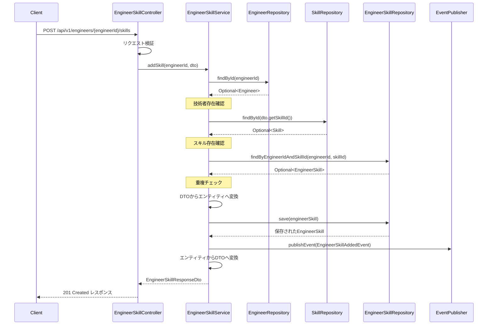
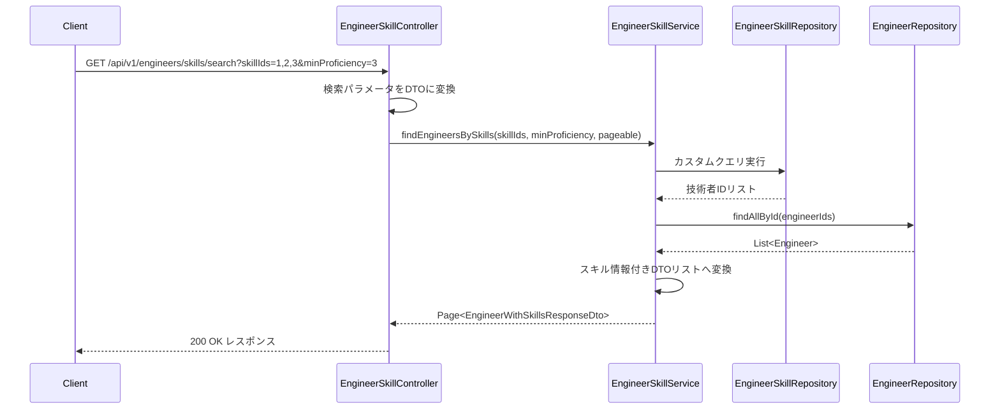
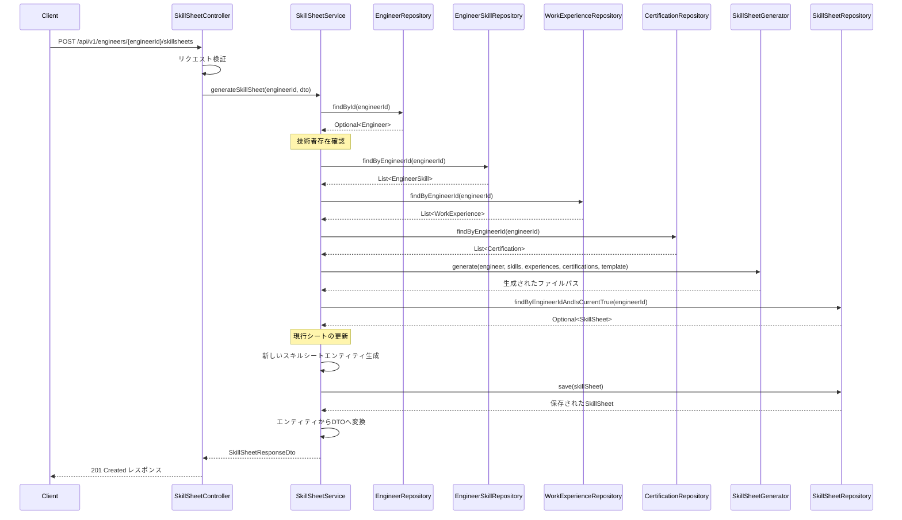

# スキル管理 詳細設計書

## バージョン管理
| バージョン | 日付 | 更新者 | 更新内容 |
|----------|------|-------|---------|
| 0.1 | 2025-05-08 | XXXX | 初版作成 |

## 1. 概要

### 1.1 目的
技術者のスキル情報を管理するための機能を提供する。スキルマスタの管理、技術者ごとのスキル登録・評価、スキル検索などを実現し、効率的なリソースマッチングを可能にする。

### 1.2 機能範囲
- スキルマスタ管理（登録・編集・削除）
- 技術者のスキル登録・評価
- スキルによる技術者検索
- スキル集計・分析
- スキルシート管理

### 1.3 関連モジュール
- 技術者管理モジュール：技術者基本情報との連携
- マッチングモジュール：スキル情報によるマッチング処理
- 案件管理モジュール：案件要件とのスキルマッチング
- レポーティングモジュール：スキル分布の集計分析

## 2. コンポーネント構成

### 2.1 コントローラー
- **SkillController**
  - 責務：スキルマスタ情報のWeb APIエンドポイントを提供
  - エンドポイント：
    - GET /api/v1/skills：スキル一覧取得
    - POST /api/v1/skills：スキル新規登録
    - GET /api/v1/skills/{id}：スキル詳細取得
    - PUT /api/v1/skills/{id}：スキル情報更新
    - DELETE /api/v1/skills/{id}：スキル削除
    - GET /api/v1/skills/categories：スキルカテゴリ一覧取得
    - GET /api/v1/skills/search：スキル検索

- **EngineerSkillController**
  - 責務：技術者スキル情報のWeb APIエンドポイントを提供
  - エンドポイント：
    - GET /api/v1/engineers/{engineerId}/skills：技術者のスキル一覧取得
    - POST /api/v1/engineers/{engineerId}/skills：技術者のスキル追加
    - PUT /api/v1/engineers/{engineerId}/skills/{skillId}：技術者のスキル更新
    - DELETE /api/v1/engineers/{engineerId}/skills/{skillId}：技術者のスキル削除
    - GET /api/v1/engineers/skills/search：スキルに基づく技術者検索

- **SkillSheetController**
  - 責務：スキルシート管理のWeb APIエンドポイントを提供
  - エンドポイント：
    - GET /api/v1/engineers/{engineerId}/skillsheets：スキルシート一覧取得
    - POST /api/v1/engineers/{engineerId}/skillsheets：スキルシート生成
    - GET /api/v1/engineers/{engineerId}/skillsheets/{id}：スキルシート取得
    - PUT /api/v1/engineers/{engineerId}/skillsheets/{id}：スキルシート更新
    - DELETE /api/v1/engineers/{engineerId}/skillsheets/{id}：スキルシート削除
    - GET /api/v1/engineers/{engineerId}/skillsheets/{id}/download：スキルシートダウンロード

### 2.2 サービス
- **SkillService**
  - 責務：スキルマスタ情報に関するビジネスロジックを実装
  - 主要メソッド：
    - findAll(Pageable pageable)：全スキル取得（ページング対応）
    - findById(Long id)：ID指定スキル取得
    - findByCategory(String category, Pageable pageable)：カテゴリ指定スキル取得
    - search(String keyword, List<String> categories, Pageable pageable)：スキル検索
    - create(SkillCreateDto dto)：スキル新規作成
    - update(Long id, SkillUpdateDto dto)：スキル情報更新
    - delete(Long id)：スキル削除
    - getAllCategories()：全カテゴリ取得
  - トランザクション境界：各メソッドレベルでトランザクション設定

- **EngineerSkillService**
  - 責務：技術者スキル情報に関するビジネスロジックを実装
  - 主要メソッド：
    - findByEngineerId(Long engineerId, Pageable pageable)：技術者ID指定スキル取得
    - addSkill(Long engineerId, EngineerSkillAddDto dto)：技術者のスキル追加
    - updateSkill(Long engineerId, Long skillId, EngineerSkillUpdateDto dto)：技術者のスキル更新
    - removeSkill(Long engineerId, Long skillId)：技術者のスキル削除
    - findEngineersBySkills(List<Long> skillIds, Integer minProficiency, Pageable pageable)：スキルによる技術者検索
    - getSkillMatrix(List<Long> engineerIds, List<Long> skillIds)：スキルマトリクス取得
  - トランザクション境界：各メソッドレベルでトランザクション設定

- **SkillSheetService**
  - 責務：スキルシート管理に関するビジネスロジックを実装
  - 主要メソッド：
    - findByEngineerId(Long engineerId, Pageable pageable)：技術者ID指定スキルシート一覧取得
    - findById(Long id)：ID指定スキルシート取得
    - generateSkillSheet(Long engineerId, SkillSheetGenerateDto dto)：スキルシート生成
    - update(Long id, SkillSheetUpdateDto dto)：スキルシート更新
    - delete(Long id)：スキルシート削除
    - downloadSkillSheet(Long id, String format)：スキルシートダウンロード
  - トランザクション境界：各メソッドレベルでトランザクション設定

### 2.3 リポジトリ
- **SkillRepository**
  - 責務：スキルエンティティのデータアクセス
  - 主要メソッド：
    - findAll(Pageable pageable)：ページング対応全件取得
    - findById(Long id)：ID指定検索
    - findBySkillNameContaining(String name, Pageable pageable)：スキル名部分一致検索
    - findBySkillCategory(String category, Pageable pageable)：カテゴリ指定検索
    - findBySkillNameContainingAndSkillCategoryIn(String name, List<String> categories, Pageable pageable)：複合条件検索
    - save(Skill skill)：保存/更新
    - deleteById(Long id)：削除
    - findDistinctSkillCategory()：カテゴリ一覧取得

- **EngineerSkillRepository**
  - 責務：技術者スキルエンティティのデータアクセス
  - 主要メソッド：
    - findByEngineerId(Long engineerId, Pageable pageable)：技術者ID指定検索
    - findByEngineerIdAndSkillId(Long engineerId, Long skillId)：技術者IDとスキルIDの複合条件検索
    - findBySkillIdInAndProficiencyLevelGreaterThanEqual(List<Long> skillIds, Integer minProficiency, Pageable pageable)：スキルIDリストと最小習熟度による検索
    - save(EngineerSkill engineerSkill)：保存/更新
    - deleteByEngineerIdAndSkillId(Long engineerId, Long skillId)：技術者IDとスキルIDによる削除
    - findTopSkillsByEngineerIds(List<Long> engineerIds, int limit)：技術者ごとのトップスキル取得

- **SkillSheetRepository**
  - 責務：スキルシートエンティティのデータアクセス
  - 主要メソッド：
    - findByEngineerId(Long engineerId, Pageable pageable)：技術者ID指定検索
    - findById(Long id)：ID指定検索
    - findByEngineerIdAndIsCurrentTrue(Long engineerId)：技術者ID指定の最新スキルシート検索
    - save(SkillSheet skillSheet)：保存/更新
    - deleteById(Long id)：削除

### 2.4 ドメインモデル/エンティティ
- **Skill**
  - 属性：
    - id：スキルID
    - skillName：スキル名
    - skillCategory：スキルカテゴリ（Enum型）
    - description：説明
    - createdAt：作成日時
    - updatedAt：更新日時
  
  - バリデーションルール：
    - skillName：必須、最大100文字、一意制約
    - skillCategory：必須、SkillCategory enum内の値のみ許可

- **EngineerSkill**
  - 属性：
    - id：技術者スキルID
    - engineer：技術者（Engineer エンティティへの参照）
    - skill：スキル（Skill エンティティへの参照）
    - proficiencyLevel：習熟度レベル（1〜5）
    - yearsOfExperience：経験年数
    - description：説明・実績
    - createdAt：作成日時
    - updatedAt：更新日時
  
  - バリデーションルール：
    - proficiencyLevel：必須、1〜5の整数
    - yearsOfExperience：0以上の数値
    - engineer + skill：一意制約（同一技術者に同一スキルを重複登録不可）

- **SkillSheet**
  - 属性：
    - id：シートID
    - engineer：技術者（Engineer エンティティへの参照）
    - sheetName：スキルシート名
    - version：バージョン
    - filePath：ファイルパス
    - fileFormat：ファイル形式（Enum型）
    - isCurrent：現行バージョンフラグ
    - isPublic：公開フラグ
    - createdAt：作成日時
    - updatedAt：更新日時
  
  - バリデーションルール：
    - sheetName：必須、最大100文字
    - fileFormat：必須、SkillSheetFormat enum内の値のみ許可

- **SkillCategory (Enum)**
  - 言語
  - フレームワーク
  - DB
  - OS
  - ミドルウェア
  - クラウド
  - ツール
  - 資格
  - その他

- **SkillSheetFormat (Enum)**
  - PDF
  - DOCX
  - HTML

### 2.5 DTOとバリデーション
- **SkillResponseDto**
  - スキル情報レスポンス用DTO
  - 属性：
    - id：スキルID
    - skillName：スキル名
    - skillCategory：スキルカテゴリ
    - description：説明
    - createdAt：作成日時
    - updatedAt：更新日時

- **SkillCreateRequestDto**
  - スキル登録リクエスト用DTO
  - バリデーション：
    - skillName：@NotBlank、@Size(max=100)
    - skillCategory：@NotNull、@EnumValidator

- **SkillUpdateRequestDto**
  - スキル更新リクエスト用DTO
  - SkillCreateRequestDtoと同様の属性とバリデーション
  - IDは含まない（パスパラメータで指定）

- **EngineerSkillResponseDto**
  - 技術者スキル情報レスポンス用DTO
  - 属性：
    - id：技術者スキルID
    - engineerId：技術者ID
    - skillId：スキルID
    - skillName：スキル名
    - skillCategory：スキルカテゴリ
    - proficiencyLevel：習熟度レベル
    - yearsOfExperience：経験年数
    - description：説明・実績
    - createdAt：作成日時
    - updatedAt：更新日時

- **EngineerSkillAddRequestDto**
  - 技術者スキル追加リクエスト用DTO
  - 属性：
    - skillId：スキルID
    - proficiencyLevel：習熟度レベル
    - yearsOfExperience：経験年数
    - description：説明・実績
  - バリデーション：
    - skillId：@NotNull
    - proficiencyLevel：@NotNull、@Min(1)、@Max(5)
    - yearsOfExperience：@Min(0)

- **EngineerSkillUpdateRequestDto**
  - 技術者スキル更新リクエスト用DTO
  - EngineerSkillAddRequestDtoと同様の属性とバリデーション（skillIdを除く）
  - skillIdは含まない（パスパラメータで指定）

- **SkillSearchRequestDto**
  - スキル検索条件DTO
  - 属性：
    - keyword：検索キーワード
    - categories：スキルカテゴリ（複数指定可）

- **EngineerBySkillSearchRequestDto**
  - スキルによる技術者検索条件DTO
  - 属性：
    - skillIds：スキルID（複数指定可）
    - minProficiency：最小習熟度
    - requireAllSkills：全スキル必須フラグ

- **SkillSheetResponseDto**
  - スキルシート情報レスポンス用DTO
  - 属性：
    - id：シートID
    - engineerId：技術者ID
    - sheetName：スキルシート名
    - version：バージョン
    - fileFormat：ファイル形式
    - isCurrent：現行バージョンフラグ
    - isPublic：公開フラグ
    - downloadUrl：ダウンロードURL
    - createdAt：作成日時
    - updatedAt：更新日時

- **SkillSheetGenerateRequestDto**
  - スキルシート生成リクエスト用DTO
  - 属性：
    - sheetName：スキルシート名
    - fileFormat：ファイル形式
    - template：テンプレートID
    - isPublic：公開フラグ
    - includedSections：含めるセクション（基本情報、スキル、職務経歴など）
  - バリデーション：
    - sheetName：@NotBlank、@Size(max=100)
    - fileFormat：@NotNull、@EnumValidator

## 3. 主要処理フロー

### 3.1 技術者スキル追加フロー

- 技術者のスキルを追加する処理の流れ
- 技術者IDが存在しない場合は404 Not Foundを返却
- スキルIDが存在しない場合は404 Not Foundを返却
- 既に同じスキルが登録されている場合は409 Conflictを返却
- スキル追加イベントを発行し、関連モジュールに通知
- 登録成功時は201 Createdと共に登録されたスキル情報を返却

### 3.2 スキルによる技術者検索フロー

- 指定されたスキルを持つ技術者を検索
- 複数のスキルを指定可能（AND条件またはOR条件）
- 最小習熟度による絞り込みが可能
- ページネーション対応
- 検索結果には技術者情報と該当スキルの詳細を含む
- 検索結果なしの場合は空リストを返却

### 3.3 スキルシート生成フロー

- 技術者のスキルシートを生成する処理の流れ
- 技術者IDが存在しない場合は404 Not Foundを返却
- 技術者の基本情報、スキル、職務経歴、資格情報を取得
- 指定されたテンプレートとフォーマットでスキルシートを生成
- 既存の現行スキルシートがある場合は非現行に更新
- 生成成功時は201 Createdと共に生成されたスキルシート情報を返却

## 4. 特記事項

### 4.1 実装上の注意点
- スキルマスタは全てのモジュールで参照される共通データ
  - 簡単に削除・変更できないよう制限を設ける
  - スキル統合や名称変更の際は、参照整合性を保つための移行処理が必要
- スキル習熟度の評価基準を明確に定義
  - 1：基礎知識あり
  - 2：実務経験あり（サポート可能）
  - 3：一人で実装可能
  - 4：高度な実装が可能
  - 5：指導・設計が可能
- スキルデータの一貫性維持
  - 重複スキルの防止
  - スキルカテゴリの適切な分類
  - 名称のゆらぎ防止（例：「Java」と「JAVA」の統一）

### 4.2 パフォーマンス考慮点
- スキルマスタのキャッシュ化
  - 読み取り頻度が高く、更新頻度が低いデータ
  - アプリケーションキャッシュとして実装
- スキルによる技術者検索の最適化
  - 複合インデックスの活用
  - クエリチューニング
  - 必要に応じたキャッシュ適用
- スキルシート生成処理の非同期化
  - 大規模なスキルシート生成は時間がかかる可能性
  - 必要に応じて非同期処理化を検討

### 4.3 テストの観点
- スキルマスタ管理機能のテスト
  - 重複チェック
  - カテゴリ制約の検証
- 技術者スキル管理機能のテスト
  - 習熟度の範囲チェック
  - 重複登録の防止
  - 更新・削除の権限チェック
- スキル検索機能のテスト
  - 複合条件での検索精度
  - 大量データ時のパフォーマンス
- スキルシート生成機能のテスト
  - 各フォーマットでの出力検証
  - 生成されたファイルの内容検証
  - エラー発生時の処理検証

## 5. 参照情報
- 基本設計書：[/docs/02_基本設計/UI設計/画面/技術者管理/ENG-004_スキルシート管理画面.html](/docs/02_基本設計/UI設計/画面/技術者管理/ENG-004_スキルシート管理画面.html)
- DB設計：[/docs/02_基本設計/DB設計/テーブル定義/技術者管理_テーブル定義書.html](/docs/02_基本設計/DB設計/テーブル定義/技術者管理_テーブル定義書.html)
- API設計：[/docs/02_基本設計/IF設計/REST_API/技術者管理/03_スキル管理API.html](/docs/02_基本設計/IF設計/REST_API/技術者管理/03_スキル管理API.html)
- 技術者管理モジュール：[/docs/02_詳細設計/02_モジュール/02_技術者管理/技術者基本情報.md](/docs/02_詳細設計/02_モジュール/02_技術者管理/技術者基本情報.md)