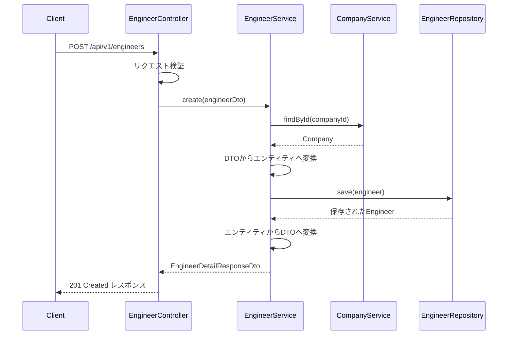
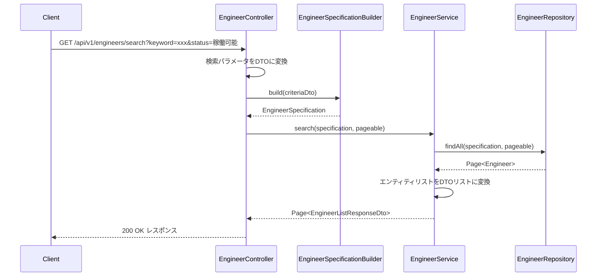
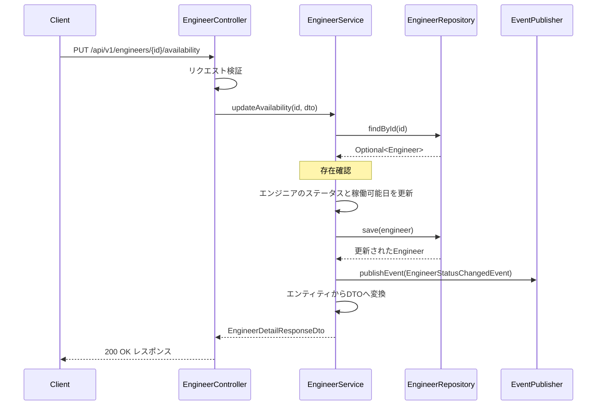

# 技術者基本情報 詳細設計書

## バージョン管理
| バージョン | 日付 | 更新者 | 更新内容 |
|----------|------|-------|---------|
| 0.1 | 2025-05-08 | XXXX | 初版作成 |

## 1. 概要

### 1.1 目的
技術者の基本情報を管理するための機能を提供する。技術者の登録、検索、詳細情報の閲覧、編集、削除などの基本的なCRUD操作を実現する。SES業務の根幹となる技術者情報を一元管理することで、案件マッチングや契約管理、請求管理などの他の業務機能との連携を効率化する。

### 1.2 機能範囲
- 技術者の基本情報登録・編集
- 技術者一覧表示と検索
- 技術者詳細表示
- 稼働状況管理
- 技術者情報のエクスポート/インポート

### 1.3 関連モジュール
- スキル管理モジュール：技術者のスキル情報を管理
- 契約管理モジュール：技術者の契約情報と連携
- マッチングモジュール：技術者情報をマッチングに活用
- 勤怠工数管理モジュール：技術者の勤怠・工数情報と連携
- 請求支払管理モジュール：技術者の請求情報と連携

## 2. コンポーネント構成

### 2.1 コントローラー
- **EngineerController**
  - 責務：技術者情報のWeb APIエンドポイントを提供
  - エンドポイント：
    - GET /api/v1/engineers：技術者一覧取得
    - POST /api/v1/engineers：技術者新規登録
    - GET /api/v1/engineers/{id}：技術者詳細取得
    - PUT /api/v1/engineers/{id}：技術者情報更新
    - DELETE /api/v1/engineers/{id}：技術者削除
    - GET /api/v1/engineers/search：検索条件による技術者検索
    - GET /api/v1/engineers/available：稼働可能技術者検索
    - PUT /api/v1/engineers/{id}/availability：稼働状況更新

- **EngineerViewController**
  - 責務：技術者情報の画面表示用コントローラー
  - エンドポイント：
    - GET /engineers：技術者一覧画面
    - GET /engineers/new：技術者登録画面
    - GET /engineers/{id}：技術者詳細画面
    - GET /engineers/{id}/edit：技術者編集画面
    - GET /engineers/search：技術者検索画面

### 2.2 サービス
- **EngineerService**
  - 責務：技術者情報に関するビジネスロジックを実装
  - 主要メソッド：
    - findAll(Pageable pageable)：全技術者取得（ページング対応）
    - findById(Long id)：ID指定技術者取得
    - search(EngineerSearchCriteria criteria, Pageable pageable)：検索条件に合致する技術者検索
    - findAvailableEngineers(LocalDate date, Pageable pageable)：稼働可能技術者検索
    - create(EngineerCreateDto dto)：技術者新規作成
    - update(Long id, EngineerUpdateDto dto)：技術者情報更新
    - updateAvailability(Long id, AvailabilityUpdateDto dto)：稼働状況更新
    - delete(Long id)：技術者削除
    - exportToCsv(List<Long> ids)：CSVエクスポート
    - importFromCsv(MultipartFile file)：CSVインポート
  - トランザクション境界：各メソッドレベルでトランザクション設定

- **CompanyService**
  - 責務：所属会社情報に関するビジネスロジックを実装
  - 主要メソッド：
    - findAll()：全会社取得
    - findById(Long id)：ID指定会社取得
    - findByName(String name)：会社名での検索
    - findByType(String type)：会社種別での検索
    - create(CompanyCreateDto dto)：会社新規作成
    - update(Long id, CompanyUpdateDto dto)：会社情報更新
    - delete(Long id)：会社削除

### 2.3 リポジトリ
- **EngineerRepository**
  - 責務：技術者エンティティのデータアクセス
  - 主要メソッド：
    - findAll(Pageable pageable)：ページング対応全件取得
    - findById(Long id)：ID指定検索
    - findByNameContaining(String name, Pageable pageable)：名前部分一致検索
    - findByStatus(String status, Pageable pageable)：ステータスによる検索
    - findByAvailabilityDateLessThanEqual(LocalDate date, Pageable pageable)：稼働可能日による検索
    - findByCompanyId(Long companyId, Pageable pageable)：所属会社による検索
    - search(EngineerSpecification spec, Pageable pageable)：複合条件検索
    - save(Engineer engineer)：保存/更新
    - deleteById(Long id)：削除

- **CompanyRepository**
  - 責務：所属会社エンティティのデータアクセス
  - 主要メソッド：
    - findAll()：全件取得
    - findById(Long id)：ID指定検索
    - findByCompanyNameContaining(String name)：会社名部分一致検索
    - findByCompanyType(String type)：会社種別による検索
    - save(Company company)：保存/更新
    - deleteById(Long id)：削除

### 2.4 ドメインモデル/エンティティ
- **Engineer**
  - 属性：
    - id：技術者ID
    - company：所属会社（Company エンティティへの参照）
    - engineerName：技術者名
    - furigana：フリガナ
    - email：メールアドレス
    - phoneNumber：電話番号
    - birthDate：生年月日
    - employmentType：雇用形態（Enum型）
    - joinDate：入社日
    - yearsOfExperience：経験年数
    - preferredWorkLocation：希望勤務地
    - status：ステータス（Enum型）
    - availabilityDate：稼働可能日
    - preferredUnitPrice：希望単価
    - profileText：プロフィール文
    - createdAt：作成日時
    - updatedAt：更新日時
    - skills：スキル情報（EngineerSkill エンティティのコレクション）
    - certifications：資格情報（Certification エンティティのコレクション）
    - workExperiences：職務経歴（WorkExperience エンティティのコレクション）
  
  - バリデーションルール：
    - engineerName：必須、最大100文字
    - email：メール形式、一意制約
    - phoneNumber：電話番号形式
    - birthDate：過去の日付
    - employmentType：EngineerEmploymentType enum内の値のみ許可
    - status：EngineerStatus enum内の値のみ許可

- **Company**
  - 属性：
    - id：会社ID
    - companyName：会社名
    - companyType：会社種別（Enum型）
    - address：住所
    - phoneNumber：電話番号
    - email：メールアドレス
    - website：ウェブサイト
    - contractDate：契約日
    - createdAt：作成日時
    - updatedAt：更新日時
    - engineers：所属技術者（Engineer エンティティのコレクション）
  
  - バリデーションルール：
    - companyName：必須、最大100文字
    - companyType：CompanyType enum内の値のみ許可
    - email：メール形式
    - phoneNumber：電話番号形式
    - website：URL形式

- **EngineerEmploymentType (Enum)**
  - 正社員
  - 契約社員
  - パートナー
  - フリーランス

- **EngineerStatus (Enum)**
  - 稼働可能
  - アサイン中
  - 研修中
  - 休職中
  - 退職

- **CompanyType (Enum)**
  - 自社
  - パートナー企業
  - 顧客

### 2.5 DTOとバリデーション
- **EngineerListResponseDto**
  - 技術者一覧表示用DTO
  - 属性：
    - id：技術者ID
    - engineerName：技術者名
    - furigana：フリガナ
    - companyName：所属会社名
    - status：ステータス
    - availabilityDate：稼働可能日
    - yearsOfExperience：経験年数
    - preferredUnitPrice：希望単価
    - updatedAt：更新日時

- **EngineerDetailResponseDto**
  - 技術者詳細表示用DTO
  - Engineer エンティティの全属性を含む
  - スキル・資格・職務経歴情報を含む

- **EngineerCreateRequestDto**
  - 技術者登録リクエスト用DTO
  - バリデーション：
    - engineerName：@NotBlank、@Size(max=100)
    - email：@Email
    - companyId：@NotNull
    - employmentType：@NotNull、@EnumValidator
    - phoneNumber：@Pattern(電話番号形式)
    - birthDate：@Past

- **EngineerUpdateRequestDto**
  - 技術者情報更新リクエスト用DTO
  - EngineerCreateRequestDtoと同様の属性とバリデーション
  - IDは含まない（パスパラメータで指定）

- **AvailabilityUpdateRequestDto**
  - 稼働状況更新リクエスト用DTO
  - 属性：
    - status：技術者ステータス
    - availabilityDate：稼働可能日
  - バリデーション：
    - status：@NotNull、@EnumValidator

- **EngineerSearchCriteriaDto**
  - 技術者検索条件DTO
  - 属性：
    - keyword：検索キーワード
    - companyIds：所属会社ID（複数指定可）
    - statuses：ステータス（複数指定可）
    - availableFrom：稼働可能開始日
    - availableTo：稼働可能終了日
    - minYearsOfExperience：最小経験年数
    - maxYearsOfExperience：最大経験年数
    - minUnitPrice：最小希望単価
    - maxUnitPrice：最大希望単価
    - skillIds：スキルID（複数指定可）
    - employmentTypes：雇用形態（複数指定可）

- **CompanyResponseDto**
  - 会社情報レスポンス用DTO
  - Company エンティティの主要属性を含む

## 3. 主要処理フロー

### 3.1 技術者登録フロー

- 新規技術者を登録する処理の流れ
- 必須項目のバリデーションを行い、エラーがあれば400 Bad Requestを返却
- 所属会社IDが存在しない場合は404 Not Foundを返却
- メールアドレス重複時は409 Conflictを返却
- 登録成功時は201 Createdと共に登録された技術者情報を返却

### 3.2 技術者検索フロー

- 検索条件に基づいて技術者一覧を取得
- 複数の検索条件を組み合わせて柔軟な検索が可能
- ページネーション対応（デフォルトページ = 0、サイズ = 20）
- レスポンスヘッダーにページネーション情報を含む
- 検索結果なしの場合は空リスト（204ではなく200を返却）

### 3.3 稼働状況更新フロー

- 技術者の稼働状況（ステータスと稼働可能日）を更新
- 技術者IDが存在しない場合は404 Not Foundを返却
- ステータス更新イベントを発行し、関連モジュールに通知（リアクティブ連携）
- 更新成功時は200 OKと共に更新された技術者情報を返却

## 4. 特記事項

### 4.1 実装上の注意点
- 個人情報を扱うため、セキュリティに十分配慮する
  - パーソナルデータのロギング制限
  - 入力値のエスケープ処理と検証
  - Spring Securityによる認可制御
- ドメインイベントを活用した疎結合な連携
  - EngineerCreatedEvent：技術者作成イベント
  - EngineerUpdatedEvent：技術者更新イベント
  - EngineerStatusChangedEvent：技術者ステータス変更イベント
- 大量データ取得時のパフォーマンスに注意
  - ページング処理の徹底
  - 適切なインデックス設計
  - 必要に応じたN+1問題の対応
- スキル情報は関連エンティティとして別途管理

### 4.2 パフォーマンス考慮点
- 技術者一覧取得時はページネーションを適用
- 検索条件が複雑な場合はインデックス最適化
  - ステータス、稼働可能日、希望単価などの高頻度検索項目にはインデックス
- クエリキャッシュを活用した高速化
  - 検索結果のキャッシュ（TTL: 1分）
  - マスタデータのキャッシュ（TTL: 30分）
- 技術者詳細ページではスキル情報の遅延読み込みか一括取得の選択適用

### 4.3 テストの観点
- バリデーションのテストを重点的に実施
  - 必須チェック
  - 形式チェック
  - ビジネスルール検証
- 検索条件の複雑なパターンのテスト
  - 複合条件の組み合わせ
  - エッジケース（該当なし、最大数など）
- 大量データ時のパフォーマンステスト
  - 数千件レベルの登録時の応答性能
  - ページネーション機能の動作確認
- トランザクション制御の正常性テスト
  - エラー発生時のロールバック確認
  - 複数テーブル更新時の整合性確認

## 5. 参照情報
- 基本設計書：[/docs/02_基本設計/UI設計/画面/技術者管理/ENG-001_技術者一覧画面.html](/docs/02_基本設計/UI設計/画面/技術者管理/ENG-001_技術者一覧画面.html)
- DB設計：[/docs/02_基本設計/DB設計/テーブル定義/技術者管理_テーブル定義書.html](/docs/02_基本設計/DB設計/テーブル定義/技術者管理_テーブル定義書.html)
- API設計：[/docs/02_基本設計/IF設計/REST_API/技術者管理API.html](/docs/02_基本設計/IF設計/REST_API/技術者管理API.html)
- アーキテクチャ設計：[/docs/02_詳細設計/01_アーキテクチャ/アーキテクチャ概要.md](/docs/02_詳細設計/01_アーキテクチャ/アーキテクチャ概要.md)