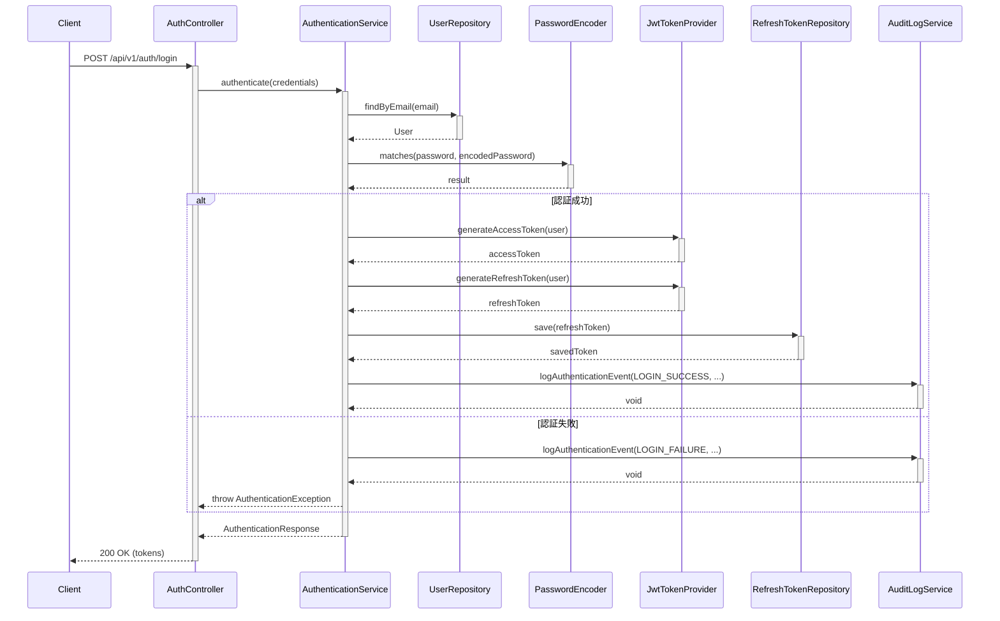

# インターフェース定義

## 1. 提供インターフェース

認証認可機能が外部へ提供するインターフェースを定義します。

### 1.1 AuthenticationService

認証機能を提供するサービスインターフェースです。

```java
public interface AuthenticationService {
    /**
     * ユーザー認証を行い認証情報を返します。
     * @param credentials ユーザー認証情報（メールアドレス、パスワード）
     * @return 認証結果（アクセストークン、リフレッシュトークン）
     * @throws AuthenticationException 認証失敗
     */
    AuthenticationResponse authenticate(Credentials credentials);
    
    /**
     * リフレッシュトークンを使用して新しいアクセストークンを返します。
     * @param refreshToken リフレッシュトークン
     * @return 新しい認証情報
     * @throws AuthenticationException トークンが無効
     */
    AuthenticationResponse refreshToken(String refreshToken);
    
    /**
     * アクセストークンを無効化してログアウトします。
     * @param accessToken アクセストークン
     */
    void logout(String accessToken);
    
    /**
     * パスワードリセット処理を開始します。
     * @param email ユーザーのメールアドレス
     * @return パスワードリセットトークン
     */
    String initiatePasswordReset(String email);
    
    /**
     * パスワードをリセットします。
     * @param token パスワードリセットトークン
     * @param newPassword 新しいパスワード
     * @return 成功
     * @throws InvalidTokenException トークンが無効
     */
    boolean resetPassword(String token, String newPassword);
    
    /**
     * 多要素認証を開始します。
     * @param userId ユーザーID
     * @param method 多要素認証方式
     * @return 多要素認証チャレンジ
     */
    MfaChallenge initiateMfaAuthentication(UUID userId, AuthenticationMethod method);
    
    /**
     * 多要素認証を検証します。
     * @param userId ユーザーID
     * @param code 検証コード
     * @return 検証成功
     */
    boolean verifyMfaCode(UUID userId, String code);
}
```

#### 1.1.1 データモデル

```java
// 認証情報
public class Credentials {
    private String email;
    private String password;
    private boolean rememberMe;
    // getters, setters
}

// 認証結果
public class AuthenticationResponse {
    private String accessToken;
    private String refreshToken;
    private long expiresIn;
    private String tokenType = "Bearer";
    private boolean requiresMfa;
    // getters, setters
}

// 多要素認証チャレンジ
public class MfaChallenge {
    private UUID challengeId;
    private AuthenticationMethod method;
    private int expiresIn;
    // getters, setters
}
```

### 1.2 AuthorizationService

権限確認と認可判定を提供するサービスインターフェースです。

```java
public interface AuthorizationService {
    /**
     * ユーザーが指定されたリソースに対して権限があるか確認します。
     * @param userId ユーザーID
     * @param resourceType リソース種別
     * @param actionType アクション種別
     * @return 権限あり
     */
    boolean hasPermission(UUID userId, ResourceType resourceType, ActionType actionType);
    
    /**
     * ユーザーが指定されたリソースに対して権限があるか確認します（リソースID指定）
     * @param userId ユーザーID
     * @param resourceType リソース種別
     * @param resourceId リソースID
     * @param actionType アクション種別
     * @return 権限あり
     */
    boolean hasPermission(UUID userId, ResourceType resourceType, UUID resourceId, ActionType actionType);
    
    /**
     * ユーザーが権限名に対する権限があるか確認します。
     * @param userId ユーザーID
     * @param permission 権限名例: "user:read"
     * @return 権限あり
     */
    boolean hasPermission(UUID userId, String permission);
    
    /**
     * ユーザーが指定ロールを持つか確認します。
     * @param userId ユーザーID
     * @param roleName ロール名
     * @return ロールあり
     */
    boolean hasRole(UUID userId, String roleName);
    
    /**
     * ユーザーが持つ全ての権限一覧を返します。
     * @param userId ユーザーID
     * @return 権限一覧
     */
    List<String> getUserPermissions(UUID userId);
    
    /**
     * ユーザーが持つ全てのロール一覧を返します。
     * @param userId ユーザーID
     * @return ロール一覧
     */
    List<String> getUserRoles(UUID userId);
}
```

### 1.3 UserService

ユーザー管理を提供するサービスインターフェースです。

```java
public interface UserService {
    /**
     * ユーザーをIDで取得します。
     * @param id ユーザーID
     * @return ユーザー情報
     */
    UserDto findById(UUID id);
    
    /**
     * ユーザーをメールアドレスで取得します。
     * @param email メールアドレス
     * @return ユーザー情報
     */
    UserDto findByEmail(String email);
    
    /**
     * 全ユーザー一覧を取得します。
     * @param pageable ページング情報
     * @return ユーザー一覧
     */
    Page<UserDto> findAll(Pageable pageable);
    
    /**
     * ユーザーを作成します。
     * @param userCreateDto ユーザー作成情報
     * @return 作成済みユーザー
     */
    UserDto createUser(UserCreateDto userCreateDto);
    
    /**
     * ユーザー情報を更新します。
     * @param id ユーザーID
     * @param userUpdateDto 更新情報
     * @return 更新済みユーザー
     */
    UserDto updateUser(UUID id, UserUpdateDto userUpdateDto);
    
    /**
     * ユーザーを削除します。
     * @param id ユーザーID
     */
    void deleteUser(UUID id);
    
    /**
     * ユーザーのパスワードを変更します。
     * @param id ユーザーID
     * @param currentPassword 現在のパスワード
     * @param newPassword 新しいパスワード
     * @return 更新成功
     */
    boolean changePassword(UUID id, String currentPassword, String newPassword);
    
    /**
     * アカウントのロック状態を設定/解除します。
     * @param id ユーザーID
     * @param locked ロック状態
     */
    void setAccountLocked(UUID id, boolean locked);
    
    /**
     * ユーザーの多要素認証を有効化/無効化します。
     * @param id ユーザーID
     * @param enabled 有効状態
     * @param method 認証方式
     * @return 設定済み認証設定情報
     */
    MfaSetupResponse setMfaEnabled(UUID id, boolean enabled, AuthenticationMethod method);
}
```

#### 1.3.1 データモデル

```java
// ユーザーDTO
public class UserDto {
    private UUID id;
    private String email;
    private String name;
    private String department;
    private String position;
    private String phone;
    private List<String> roles;
    private boolean accountLocked;
    private boolean mfaEnabled;
    private LocalDateTime lastLoginAt;
    private LocalDateTime passwordExpiresAt;
    // getters, setters
}

// ユーザー作成DTO
public class UserCreateDto {
    private String email;
    private String password;
    private String name;
    private String department;
    private String position;
    private String phone;
    private UUID roleId;
    // getters, setters
}

// ユーザー更新DTO
public class UserUpdateDto {
    private String name;
    private String department;
    private String position; 
    private String phone;
    // getters, setters
}

// 多要素認証設定情報
public class MfaSetupResponse {
    private String secretKey;
    private String qrCodeUrl;
    // getters, setters
}
```

### 1.4 RoleService

ロールと権限の管理を提供するサービスインターフェースです。

```java
public interface RoleService {
    /**
     * ロールをIDで取得します。
     * @param id ロールID
     * @return ロール情報
     */
    RoleDto findById(UUID id);
    
    /**
     * ロールを名前で取得します。
     * @param name ロール名
     * @return ロール情報
     */
    RoleDto findByName(String name);
    
    /**
     * 全ロール一覧を取得します。
     * @return ロール一覧
     */
    List<RoleDto> findAll();
    
    /**
     * ロールを作成します。
     * @param roleCreateDto ロール作成情報
     * @return 作成済みロール
     */
    RoleDto createRole(RoleCreateDto roleCreateDto);
    
    /**
     * ロール情報を更新します。
     * @param id ロールID
     * @param roleUpdateDto 更新情報
     * @return 更新済みロール
     */
    RoleDto updateRole(UUID id, RoleUpdateDto roleUpdateDto);
    
    /**
     * ロールを削除します。
     * @param id ロールID
     * @throws RoleInUseException ロールが使用中の場合
     */
    void deleteRole(UUID id);
    
    /**
     * ロールに権限を追加します。
     * @param roleId ロールID
     * @param permissionIds 権限ID一覧
     * @return 更新済みロール
     */
    RoleDto addPermissionsToRole(UUID roleId, List<UUID> permissionIds);
    
    /**
     * ロールから権限を削除します。
     * @param roleId ロールID
     * @param permissionIds 権限ID一覧
     * @return 更新済みロール
     */
    RoleDto removePermissionsFromRole(UUID roleId, List<UUID> permissionIds);
    
    /**
     * 全権限一覧を取得します。
     * @return 権限一覧
     */
    List<PermissionDto> findAllPermissions();
}
```

#### 1.4.1 データモデル

```java
// ロールDTO
public class RoleDto {
    private UUID id;
    private String name;
    private String description;
    private List<PermissionDto> permissions;
    // getters, setters
}

// ロール作成DTO
public class RoleCreateDto {
    private String name;
    private String description;
    private List<UUID> permissionIds;
    // getters, setters
}

// ロール更新DTO
public class RoleUpdateDto {
    private String name;
    private String description;
    // getters, setters
}

// 権限DTO
public class PermissionDto {
    private UUID id;
    private String name;
    private String description;
    private ResourceType resourceType;
    private ActionType actionType;
    // getters, setters
}
```

## 2. 要求インターフェース

認証認可機能が外部から利用するインターフェースです。

### 2.1 NotificationService

パスワードリセットや多要素認証時の通知を送信するためのインターフェースです。

```java
public interface NotificationService {
    /**
     * パスワードリセット通知を送信します。
     * @param email 送信メールアドレス
     * @param resetToken リセットトークン
     * @param expirationMinutes 有効期限
     * @return 送信成功
     */
    boolean sendPasswordResetEmail(String email, String resetToken, int expirationMinutes);
    
    /**
     * 多要素認証検証コードを送信します。
     * @param email 送信メールアドレス
     * @param verificationCode 検証コード
     * @param expirationMinutes 有効期限
     * @return 送信成功
     */
    boolean sendMfaVerificationEmail(String email, String verificationCode, int expirationMinutes);
    
    /**
     * アカウントロック通知を送信します。
     * @param email 送信メールアドレス
     * @param reason ロック理由
     * @return 送信成功
     */
    boolean sendAccountLockedNotification(String email, String reason);
}
```

### 2.2 AuditLogService

セキュリティ操作の監査ログを記録するためのインターフェースです。

```java
public interface AuditLogService {
    /**
     * 認証イベントをログ記録します。
     * @param eventType イベント種別
     * @param userId ユーザーID（認証失敗時はnull）
     * @param email メールアドレス
     * @param success 成功
     * @param ipAddress IPアドレス
     * @param userAgent ユーザーエージェント
     * @param details 詳細情報
     */
    void logAuthenticationEvent(AuthEventType eventType, UUID userId, String email, 
                               boolean success, String ipAddress, String userAgent, 
                               Map<String, String> details);
    
    /**
     * 認可イベントをログ記録します。
     * @param userId ユーザーID
     * @param resource リソース種別や名前
     * @param action 実行アクション
     * @param success 成功
     * @param details 詳細情報
     */
    void logAuthorizationEvent(UUID userId, String resource, String action, 
                              boolean success, Map<String, String> details);
    
    /**
     * ユーザー管理イベントをログ記録します。
     * @param adminUserId 管理者ユーザーID
     * @param targetUserId 対象ユーザーID
     * @param action 実行アクション
     * @param details 詳細情報
     */
    void logUserManagementEvent(UUID adminUserId, UUID targetUserId, 
                               String action, Map<String, String> details);
}
```

#### 2.2.1 列挙型

```java
public enum AuthEventType {
    LOGIN_ATTEMPT,
    LOGIN_SUCCESS,
    LOGIN_FAILURE,
    LOGOUT,
    PASSWORD_RESET_REQUEST,
    PASSWORD_RESET_SUCCESS,
    PASSWORD_CHANGE,
    MFA_ENABLED,
    MFA_DISABLED,
    MFA_VERIFICATION_SUCCESS,
    MFA_VERIFICATION_FAILURE,
    ACCOUNT_LOCKED,
    ACCOUNT_UNLOCKED,
    TOKEN_REFRESH
}
```

## 3. REST API インターフェース

認証認可機能が提供するREST APIのエンドポイント一覧です。

### 3.1 認証API

| メソッド | エンドポイント | 機能 | リクエスト | レスポンス |
|---------|--------------|------|-----------|-----------|
| POST | /api/v1/auth/login | ユーザーログイン | Credentials | AuthenticationResponse |
| POST | /api/v1/auth/refresh | トークンリフレッシュ | {refreshToken} | AuthenticationResponse |
| POST | /api/v1/auth/logout | ログアウト | {accessToken} | - |
| POST | /api/v1/auth/password-reset | パスワードリセット要求 | {email} | - |
| POST | /api/v1/auth/password-reset/confirm | パスワードリセット実行 | {token, newPassword} | - |
| POST | /api/v1/auth/mfa/verify | 多要素認証検証 | {userId, code} | AuthenticationResponse |

### 3.2 ユーザーAPI

| メソッド | エンドポイント | 機能 | リクエスト | レスポンス |
|---------|--------------|------|-----------|-----------|
| GET | /api/v1/users | ユーザー一覧取得 | - | Page<UserDto> |
| GET | /api/v1/users/{id} | ユーザー詳細取得 | - | UserDto |
| POST | /api/v1/users | ユーザー作成 | UserCreateDto | UserDto |
| PUT | /api/v1/users/{id} | ユーザー更新 | UserUpdateDto | UserDto |
| DELETE | /api/v1/users/{id} | ユーザー削除 | - | - |
| PUT | /api/v1/users/{id}/password | パスワード変更 | {currentPassword, newPassword} | - |
| PUT | /api/v1/users/{id}/lock | アカウントロック/解除 | {locked} | UserDto |
| PUT | /api/v1/users/{id}/mfa | 多要素認証設定 | {enabled, method} | MfaSetupResponse |

### 3.3 ロール・権限API

| メソッド | エンドポイント | 機能 | リクエスト | レスポンス |
|---------|--------------|------|-----------|-----------|
| GET | /api/v1/roles | ロール一覧取得 | - | List<RoleDto> |
| GET | /api/v1/roles/{id} | ロール詳細取得 | - | RoleDto |
| POST | /api/v1/roles | ロール作成 | RoleCreateDto | RoleDto |
| PUT | /api/v1/roles/{id} | ロール更新 | RoleUpdateDto | RoleDto |
| DELETE | /api/v1/roles/{id} | ロール削除 | - | - |
| POST | /api/v1/roles/{id}/permissions | ロールに権限追加 | {permissionIds} | RoleDto |
| DELETE | /api/v1/roles/{id}/permissions | ロールから権限削除 | {permissionIds} | RoleDto |
| GET | /api/v1/permissions | 権限一覧取得 | - | List<PermissionDto> |

## 4. データインターフェース

データベースアクセス用の内部インターフェースです。

### 4.1 UserRepository

ユーザーエンティティの永続化を提供するリポジトリです。

```java
public interface UserRepository {
    Optional<User> findById(UUID id);
    Optional<User> findByEmail(String email);
    List<User> findAll();
    Page<User> findAll(Pageable pageable);
    User save(User user);
    void delete(User user);
    boolean existsByEmail(String email);
}
```

### 4.2 RoleRepository

ロールエンティティの永続化を提供するリポジトリです。

```java
public interface RoleRepository {
    Optional<Role> findById(UUID id);
    Optional<Role> findByName(String name);
    List<Role> findAll();
    Role save(Role role);
    void delete(Role role);
    boolean existsByName(String name);
}
```

### 4.3 PermissionRepository

権限エンティティの永続化を提供するリポジトリです。

```java
public interface PermissionRepository {
    Optional<Permission> findById(UUID id);
    Optional<Permission> findByName(String name);
    List<Permission> findAll();
    List<Permission> findByIdIn(List<UUID> ids);
    Permission save(Permission permission);
    void delete(Permission permission);
}
```

### 4.4 RefreshTokenRepository

リフレッシュトークンの永続化を提供するリポジトリです。

```java
public interface RefreshTokenRepository {
    Optional<RefreshToken> findById(UUID id);
    Optional<RefreshToken> findByTokenHash(String tokenHash);
    List<RefreshToken> findByUserId(UUID userId);
    RefreshToken save(RefreshToken refreshToken);
    void delete(RefreshToken refreshToken);
    void deleteAllByUserIdAndRevoked(UUID userId, boolean revoked);
}
```

### 4.5 JwtTokenProvider

JWTトークンの生成・検証を提供するサービスです。

```java
public interface JwtTokenProvider {
    String generateAccessToken(User user);
    String generateRefreshToken(User user);
    UUID getUserIdFromToken(String token);
    boolean validateToken(String token);
    Claims getClaimsFromToken(String token);
    long getExpirationTime();
}
```

### 4.6 PasswordEncoder

パスワードのハッシュ化と検証を提供するサービスです。

```java
public interface PasswordEncoder {
    String encode(String rawPassword);
    boolean matches(String rawPassword, String encodedPassword);
}
```

## 5. シーケンス図

### 5.1 ユーザー認証フロー



### 5.2 リソースアクセス認可

```mermaid
sequenceDiagram
    Client->>+ResourceController: GET /api/v1/protected-resource
    ResourceController->>+AuthorizationService: hasPermission(userId, resourceType, action)
    AuthorizationService->>+UserRepository: findById(userId)
    UserRepository-->>-AuthorizationService: User with roles
    AuthorizationService->>+RoleRepository: findByIdIn(roleIds)
    RoleRepository-->>-AuthorizationService: Roles with permissions
    
    alt 権限あり
        AuthorizationService-->>-ResourceController: true
        ResourceController->>ResourceController: リソース取得処理
        ResourceController-->>Client: 200 OK (resource)
    else 権限なし
        AuthorizationService-->>-ResourceController: false
        ResourceController-->>Client: 403 Forbidden
    end
```

## 6. 例外クラス

認証認可機能で使用する主な例外クラスです。

```java
// 認証基底例外
public class AuthenticationException extends RuntimeException {
    public AuthenticationException(String message) {
        super(message);
    }
}

// 認証失敗例外
public class InvalidCredentialsException extends AuthenticationException {
    public InvalidCredentialsException() {
        super("無効な認証情報です。");
    }
}

// アカウントロック例外
public class AccountLockedException extends AuthenticationException {
    public AccountLockedException() {
        super("アカウントがロックされています。");
    }
}

// トークン基底例外
public class TokenException extends RuntimeException {
    public TokenException(String message) {
        super(message);
    }
}

// 無効トークン例外
public class InvalidTokenException extends TokenException {
    public InvalidTokenException() {
        super("無効なトークンです。");
    }
}

// トークン期限切れ例外
public class TokenExpiredException extends TokenException {
    public TokenExpiredException() {
        super("トークンの有効期限が切れています。");
    }
}

// 認可基底例外
public class AuthorizationException extends RuntimeException {
    public AuthorizationException(String message) {
        super(message);
    }
}

// アクセス拒否例外
public class AccessDeniedException extends AuthorizationException {
    public AccessDeniedException() {
        super("このリソースへのアクセス権限がありません");
    }
}

// ロール使用中例外
public class RoleInUseException extends RuntimeException {
    public RoleInUseException(String roleName) {
        super("ロール '" + roleName + "' は使用中のため削除できません。");
    }
}
```

## 7. セキュリティ対策

認証認可機能のインターフェース設計において考慮すべきセキュリティ対策です。

1. **トークンの保護**:
   - アクセストークンは常にHTTPヘッダーで送信し、URLパラメータに含めない
   - 通信はHTTPSでのみ行う設定とする
   - リフレッシュトークンは安全に保存し管理する

2. **パスワードセキュリティ**:
   - パスワードは常にハッシュ化して保存しない
   - パスワードリセットトークンは一度きりの使用に限定する

3. **アカウントロック**:
   - アカウントロックは一定回数の連続失敗だけでなく、不審なアクセスパターンもロジックに加える
   - 特権アカウントの不正使用防止のため特権アカウントは常に多要素認証を必須とする

4. **監査ログ**:
   - 全ての認証・認可操作イベントに関して詳細にログ記録
   - ログには個人情報や機密情報は含めない

5. **認可の多層化**:
   - パスワード変更、ロック解除などの重要な操作は追加の認証確認を要求する

6. **多要素認証**:
   - 管理者アカウントには多要素認証を必須とする
   - 多要素認証の検証コードは短時間で無効化する