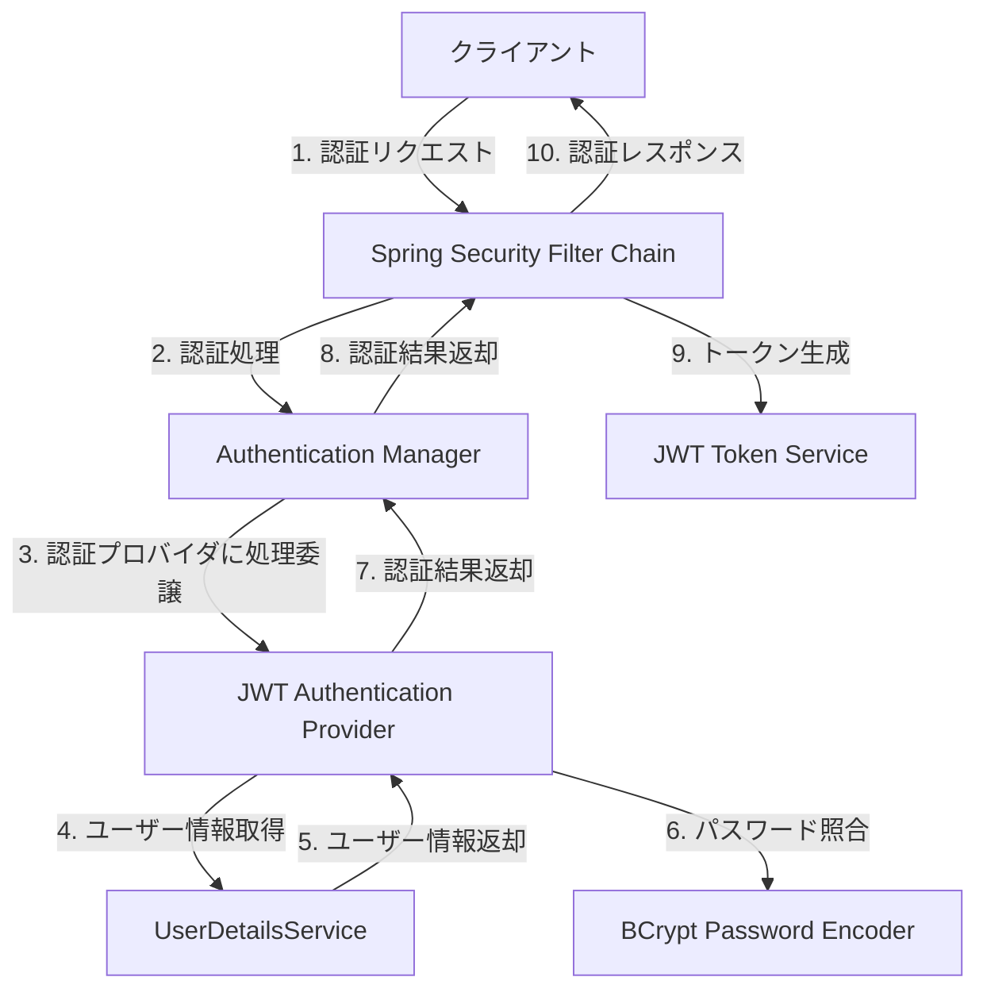

# 認証機能

## 1. 概要

本設計ではSES業務システムにおける認証機能の詳細設計を示します。認証はSpring Securityフレームワークを活用し、JWTトークンベースの認証を実装します。

## 2. 認証機能の基本構造



## 3. Spring Security設定

### 3.1 SecurityConfiguration

```java
@Configuration
@EnableWebSecurity
@EnableMethodSecurity
public class SecurityConfiguration {

    @Autowired
    private JwtAuthenticationFilter jwtAuthenticationFilter;

    @Autowired
    private CustomUserDetailsService userDetailsService;

    @Autowired
    private PasswordEncoder passwordEncoder;

    @Bean
    public SecurityFilterChain securityFilterChain(HttpSecurity http) throws Exception {
        return http
            .csrf(csrf -> csrf.disable())  // RESTful APIのため無効化
            .authorizeHttpRequests(auth -> auth
                .requestMatchers("/api/v1/auth/**").permitAll() // 認証APIは認証不要
                .requestMatchers("/api/v1/public/**").permitAll() // 公開APIは認証不要
                .requestMatchers("/api/v1/admin/**").hasRole("ADMIN") // 管理APIは管理者権限必須
                .anyRequest().authenticated() // その他のAPIは認証必須
            )
            .sessionManagement(session -> session
                .sessionCreationPolicy(SessionCreationPolicy.STATELESS) // セッションレス設定
            )
            .addFilterBefore(jwtAuthenticationFilter, UsernamePasswordAuthenticationFilter.class) // JWTトークン検証
            .exceptionHandling(exceptions -> exceptions
                .authenticationEntryPoint(new JwtAuthenticationEntryPoint()) // 未認証時の処理
                .accessDeniedHandler(new JwtAccessDeniedHandler()) // アクセス拒否時の処理
            )
            .userDetailsService(userDetailsService) // UserDetailsService設定
            .build();
    }

    @Bean
    public AuthenticationManager authenticationManager(AuthenticationConfiguration authenticationConfiguration) throws Exception {
        return authenticationConfiguration.getAuthenticationManager();
    }
}
```

### 3.2 PasswordEncoder設定

```java
@Configuration
public class PasswordEncoderConfig {

    @Bean
    public PasswordEncoder passwordEncoder() {
        return new BCryptPasswordEncoder(12); // BCryptの強度パラメータを12に設定
    }
}
```

## 4. 認証フィルタ

### 4.1 JwtAuthenticationFilter

```java
@Component
public class JwtAuthenticationFilter extends OncePerRequestFilter {

    @Autowired
    private JwtTokenProvider jwtTokenProvider;

    @Autowired
    private CustomUserDetailsService userDetailsService;

    @Override
    protected void doFilterInternal(
            HttpServletRequest request, 
            HttpServletResponse response, 
            FilterChain filterChain) throws ServletException, IOException {
        
        // Authorization ヘッダーからトークン取得
        String token = extractToken(request);
        
        if (token != null && jwtTokenProvider.validateToken(token)) {
            try {
                // トークンからユーザーID取得
                UUID userId = jwtTokenProvider.getUserIdFromToken(token);
                
                // UserDetailsServiceよりユーザー情報取得
                UserDetails userDetails = userDetailsService.loadUserById(userId);
                
                // 認証情報をセキュリティコンテキストに設定
                UsernamePasswordAuthenticationToken authentication = 
                    new UsernamePasswordAuthenticationToken(
                        userDetails, null, userDetails.getAuthorities());
                
                authentication.setDetails(new WebAuthenticationDetailsSource().buildDetails(request));
                SecurityContextHolder.getContext().setAuthentication(authentication);
                
            } catch (Exception e) {
                // エラー時、認証情報をクリア
                SecurityContextHolder.clearContext();
            }
        }
        
        filterChain.doFilter(request, response);
    }

    private String extractToken(HttpServletRequest request) {
        String bearerToken = request.getHeader("Authorization");
        if (StringUtils.hasText(bearerToken) && bearerToken.startsWith("Bearer ")) {
            return bearerToken.substring(7);
        }
        return null;
    }
}
```

## 5. JWT トークン処理

### 5.1 JwtTokenProvider実装

```java
@Component
public class JwtTokenProviderImpl implements JwtTokenProvider {

    @Value("${jwt.secret}")
    private String jwtSecret;

    @Value("${jwt.access-token.expiration}")
    private long accessTokenExpiration;

    @Value("${jwt.refresh-token.expiration}")
    private long refreshTokenExpiration;

    @Autowired
    private UserService userService;

    @Override
    public String generateAccessToken(User user) {
        Date now = new Date();
        Date expiryDate = new Date(now.getTime() + accessTokenExpiration);
        
        // ロールと権限取得
        List<String> roles = userService.getUserRoles(user.getId());
        List<String> permissions = userService.getUserPermissions(user.getId());
        
        return Jwts.builder()
                .setSubject(user.getId().toString())
                .setIssuedAt(now)
                .setExpiration(expiryDate)
                .claim("roles", roles)
                .claim("permissions", permissions)
                .signWith(getSigningKey(), SignatureAlgorithm.HS256)
                .compact();
    }

    @Override
    public String generateRefreshToken(User user) {
        Date now = new Date();
        Date expiryDate = new Date(now.getTime() + refreshTokenExpiration);
        
        return Jwts.builder()
                .setSubject(user.getId().toString())
                .setIssuedAt(now)
                .setExpiration(expiryDate)
                .signWith(getSigningKey(), SignatureAlgorithm.HS256)
                .compact();
    }

    @Override
    public UUID getUserIdFromToken(String token) {
        Claims claims = getClaimsFromToken(token);
        return UUID.fromString(claims.getSubject());
    }

    @Override
    public boolean validateToken(String token) {
        try {
            Jwts.parserBuilder()
                .setSigningKey(getSigningKey())
                .build()
                .parseClaimsJws(token);
            return true;
        } catch (SignatureException | MalformedJwtException | ExpiredJwtException | UnsupportedJwtException | IllegalArgumentException e) {
            return false;
        }
    }

    @Override
    public Claims getClaimsFromToken(String token) {
        return Jwts.parserBuilder()
                .setSigningKey(getSigningKey())
                .build()
                .parseClaimsJws(token)
                .getBody();
    }

    @Override
    public long getExpirationTime() {
        return accessTokenExpiration;
    }

    private Key getSigningKey() {
        byte[] keyBytes = Decoders.BASE64.decode(jwtSecret);
        return Keys.hmacShaKeyFor(keyBytes);
    }
}
```

## 6. UserDetailsService

### 6.1 CustomUserDetailsService

```java
@Service
public class CustomUserDetailsService implements UserDetailsService {

    @Autowired
    private UserRepository userRepository;

    @Override
    public UserDetails loadUserByUsername(String email) throws UsernameNotFoundException {
        User user = userRepository.findByEmail(email)
                .orElseThrow(() -> new UsernameNotFoundException("ユーザーが見つかりません: " + email));
        
        return buildUserDetails(user);
    }

    public UserDetails loadUserById(UUID id) throws UsernameNotFoundException {
        User user = userRepository.findById(id)
                .orElseThrow(() -> new UsernameNotFoundException("ユーザーが見つかりません: " + id));
        
        return buildUserDetails(user);
    }

    private UserDetails buildUserDetails(User user) {
        // アカウント状態の判定
        boolean enabled = !user.isAccountLocked() && 
                (user.getAccountExpiresAt() == null || user.getAccountExpiresAt().isAfter(LocalDateTime.now()));
        
        boolean credentialsNonExpired = user.getPasswordExpiresAt() == null || 
                user.getPasswordExpiresAt().isAfter(LocalDateTime.now());
        
        // ロールと権限設定
        List<GrantedAuthority> authorities = new ArrayList<>();
        
        // ロールはSpring Securityの規約によって'ROLE_'プレフィックスが必要
        user.getRoles().stream()
                .map(role -> new SimpleGrantedAuthority("ROLE_" + role.getName()))
                .forEach(authorities::add);
        
        // 権限設定
        user.getRoles().stream()
                .flatMap(role -> role.getPermissions().stream())
                .map(permission -> new SimpleGrantedAuthority(permission.getName()))
                .forEach(authorities::add);
        
        return new org.springframework.security.core.userdetails.User(
                user.getEmail(),
                user.getPasswordHash(),
                enabled,              // アカウント有効
                true,                 // アカウント有効期限切れでない
                credentialsNonExpired, // 認証情報有効期限切れでない
                !user.isAccountLocked(), // アカウント状態ロックされてない
                authorities          // 権限
        );
    }
}
```

## 7. 認証サービス実装

### 7.1 AuthenticationServiceImpl

```java
@Service
public class AuthenticationServiceImpl implements AuthenticationService {

    @Autowired
    private AuthenticationManager authenticationManager;

    @Autowired
    private JwtTokenProvider jwtTokenProvider;

    @Autowired
    private UserRepository userRepository;

    @Autowired
    private RefreshTokenRepository refreshTokenRepository;

    @Autowired
    private PasswordEncoder passwordEncoder;

    @Autowired
    private AuditLogService auditLogService;

    @Autowired
    private NotificationService notificationService;

    @Override
    public AuthenticationResponse authenticate(Credentials credentials) {
        try {
            // Spring Securityの認証マネージャーで認証
            Authentication authentication = authenticationManager.authenticate(
                new UsernamePasswordAuthenticationToken(
                    credentials.getEmail(),
                    credentials.getPassword()
                )
            );
            
            SecurityContextHolder.getContext().setAuthentication(authentication);
            
            // 認証成功したユーザー情報取得
            User user = userRepository.findByEmail(credentials.getEmail())
                .orElseThrow(() -> new UsernameNotFoundException("ユーザーが見つかりません"));
            
            // 多要素認証必要か確認
            if (user.isMfaEnabled()) {
                return createMfaRequiredResponse(user.getId());
            }
            
            // トークン生成
            String accessToken = jwtTokenProvider.generateAccessToken(user);
            String refreshToken = jwtTokenProvider.generateRefreshToken(user);
            
            // リフレッシュトークンをDBに保存
            saveRefreshToken(user, refreshToken);
            
            // 最終ログイン日時更新
            user.setLastLoginAt(LocalDateTime.now());
            userRepository.save(user);
            
            // 監査ログ
            logSuccessfulAuthentication(user, credentials);
            
            return createAuthenticationResponse(accessToken, refreshToken, false);
            
        } catch (BadCredentialsException e) {
            // 不正認証情報による認証失敗をログ
            logFailedAuthentication(credentials, "不正認証情報");
            throw new InvalidCredentialsException();
        } catch (LockedException e) {
            // アカウントロックによる認証失敗をログ
            logFailedAuthentication(credentials, "アカウントがロックされています");
            throw new AccountLockedException();
        }
    }

    @Override
    public AuthenticationResponse refreshToken(String refreshToken) {
        try {
            // リフレッシュトークンの検証
            if (!jwtTokenProvider.validateToken(refreshToken)) {
                throw new InvalidTokenException();
            }
            
            // トークンからユーザーID取得
            UUID userId = jwtTokenProvider.getUserIdFromToken(refreshToken);
            
            // リフレッシュトークンがDBに存在するか確認
            String tokenHash = hashToken(refreshToken);
            RefreshToken storedToken = refreshTokenRepository.findByTokenHash(tokenHash)
                .orElseThrow(() -> new InvalidTokenException());
            
            // トークンが無効化されていないか確認
            if (storedToken.isRevoked()) {
                throw new InvalidTokenException();
            }
            
            // ユーザー情報取得
            User user = userRepository.findById(userId)
                .orElseThrow(() -> new UsernameNotFoundException("ユーザーが見つかりません"));
            
            // 新規トークン生成
            String newAccessToken = jwtTokenProvider.generateAccessToken(user);
            String newRefreshToken = jwtTokenProvider.generateRefreshToken(user);
            
            // 古いリフレッシュトークン無効化
            storedToken.setRevoked(true);
            storedToken.setRevokedAt(LocalDateTime.now());
            refreshTokenRepository.save(storedToken);
            
            // 新規リフレッシュトークンをDBに保存
            saveRefreshToken(user, newRefreshToken);
            
            // 監査ログ
            auditLogService.logAuthenticationEvent(
                AuthEventType.TOKEN_REFRESH,
                user.getId(),
                user.getEmail(),
                true,
                getCurrentIpAddress(),
                getCurrentUserAgent(),
                Map.of("action", "token_refresh")
            );
            
            return createAuthenticationResponse(newAccessToken, newRefreshToken, false);
            
        } catch (ExpiredJwtException e) {
            throw new TokenExpiredException();
        }
    }

    @Override
    public void logout(String accessToken) {
        if (accessToken != null && jwtTokenProvider.validateToken(accessToken)) {
            try {
                // トークンからユーザーID取得
                UUID userId = jwtTokenProvider.getUserIdFromToken(accessToken);
                
                // ユーザーに関連するすべてのリフレッシュトークン無効化
                List<RefreshToken> userTokens = refreshTokenRepository.findByUserId(userId);
                userTokens.forEach(token -> {
                    token.setRevoked(true);
                    token.setRevokedAt(LocalDateTime.now());
                });
                refreshTokenRepository.saveAll(userTokens);
                
                // 監査ログ
                auditLogService.logAuthenticationEvent(
                    AuthEventType.LOGOUT,
                    userId,
                    null,
                    true,
                    getCurrentIpAddress(),
                    getCurrentUserAgent(),
                    Map.of("action", "logout")
                );
                
            } catch (Exception e) {
                // ログアウト処理でエラーが発生しても操作は継続する
                log.error("ログアウト中にエラーが発生しました", e);
            }
        }
        
        // 認証コンテキストをクリア
        SecurityContextHolder.clearContext();
    }

    @Override
    public String initiatePasswordReset(String email) {
        User user = userRepository.findByEmail(email)
            .orElseThrow(() -> new UsernameNotFoundException("ユーザーが見つかりません"));
        
        // パスワードリセットトークン生成
        String resetToken = generateResetToken();
        
        // トークンの有効期限は30分
        LocalDateTime expiryTime = LocalDateTime.now().plusMinutes(30);
        
        // メール通知でトークン送信
        notificationService.sendPasswordResetEmail(email, resetToken, 30);
        
        // 監査ログ
        auditLogService.logAuthenticationEvent(
            AuthEventType.PASSWORD_RESET_REQUEST,
            user.getId(),
            email,
            true,
            getCurrentIpAddress(),
            getCurrentUserAgent(),
            Map.of("action", "password_reset_request")
        );
        
        return resetToken;
    }

    @Override
    public boolean resetPassword(String token, String newPassword) {
        // 実際の実装ではリセットトークンの検証
        // この部分はリセットトークンの保存と検証ロジック

        // パスワード強度検証
        validatePasswordStrength(newPassword);
        
        // パスワードハッシュ化
        String encodedPassword = passwordEncoder.encode(newPassword);
        
        // ユーザーのパスワード更新
        // パスワード有効期限を設定（90日）
        LocalDateTime passwordExpiry = LocalDateTime.now().plusDays(90);
        
        // 監査ログ
        auditLogService.logAuthenticationEvent(
            AuthEventType.PASSWORD_RESET_SUCCESS,
            null,  // ユーザーIDはトークンから取得すべきだが省略
            null,  // メールアドレスもトークンから取得すべきだが省略
            true,
            getCurrentIpAddress(),
            getCurrentUserAgent(),
            Map.of("action", "password_reset_success")
        );
        
        return true;
    }

    @Override
    public MfaChallenge initiateMfaAuthentication(UUID userId, AuthenticationMethod method) {
        User user = userRepository.findById(userId)
            .orElseThrow(() -> new UsernameNotFoundException("ユーザーが見つかりません"));
        
        if (!user.isMfaEnabled()) {
            throw new IllegalStateException("このユーザーはMFAが有効になっていません");
        }
        
        // MFA認証コード生成
        String verificationCode = generateMfaCode();
        
        // 認証コードの有効期限は10分
        LocalDateTime expiryTime = LocalDateTime.now().plusMinutes(10);
        
        // MFA方式による認証コード送信
        switch (method) {
            case MFA_EMAIL:
                notificationService.sendMfaVerificationEmail(
                    user.getEmail(),
                    verificationCode,
                    10
                );
                break;
            case MFA_SMS:
                // SMS送信処理実装予定
                break;
            case MFA_APP:
                // アプリによる認証は別途シークレットキー処理が必要
                break;
            default:
                throw new IllegalArgumentException("サポートされていないMFA方式です");
        }
        
        // チャレンジID生成
        UUID challengeId = UUID.randomUUID();
        
        // MFA認証情報一時保存（実際の実装ではキャッシュやDBに保存）
        // ...
        
        // 監査ログ
        auditLogService.logAuthenticationEvent(
            AuthEventType.MFA_VERIFICATION_SUCCESS,
            user.getId(),
            user.getEmail(),
            true,
            getCurrentIpAddress(),
            getCurrentUserAgent(),
            Map.of("action", "mfa_initiate", "method", method.name())
        );
        
        // MFAチャレンジ返却
        MfaChallenge challenge = new MfaChallenge();
        challenge.setChallengeId(challengeId);
        challenge.setMethod(method);
        challenge.setExpiresIn(600); // 10分（秒）
        
        return challenge;
    }

    @Override
    public boolean verifyMfaCode(UUID userId, String code) {
        User user = userRepository.findById(userId)
            .orElseThrow(() -> new UsernameNotFoundException("ユーザーが見つかりません"));
        
        // 保存されたMFA認証情報取得（実際の実装ではキャッシュやDBから取得）
        // ...
        
        // コード検証（実際の実装ではTOTPアルゴリズムなどによる厳密な検証）
        boolean isValid = true; // 仮実装
        
        if (isValid) {
            // 監査ログ成功
            auditLogService.logAuthenticationEvent(
                AuthEventType.MFA_VERIFICATION_SUCCESS,
                user.getId(),
                user.getEmail(),
                true,
                getCurrentIpAddress(),
                getCurrentUserAgent(),
                Map.of("action", "mfa_verify")
            );
            
            return true;
        } else {
            // 監査ログ失敗
            auditLogService.logAuthenticationEvent(
                AuthEventType.MFA_VERIFICATION_FAILURE,
                user.getId(),
                user.getEmail(),
                false,
                getCurrentIpAddress(),
                getCurrentUserAgent(),
                Map.of("action", "mfa_verify", "reason", "invalid_code")
            );
            
            return false;
        }
    }

    // 補助メソッド群

    private AuthenticationResponse createAuthenticationResponse(String accessToken, String refreshToken, boolean requiresMfa) {
        AuthenticationResponse response = new AuthenticationResponse();
        response.setAccessToken(accessToken);
        response.setRefreshToken(refreshToken);
        response.setExpiresIn(jwtTokenProvider.getExpirationTime() / 1000); // 秒に変換
        response.setTokenType("Bearer");
        response.setRequiresMfa(requiresMfa);
        return response;
    }

    private AuthenticationResponse createMfaRequiredResponse(UUID userId) {
        AuthenticationResponse response = new AuthenticationResponse();
        response.setRequiresMfa(true);
        response.setUserId(userId); // MFA認証のためにユーザーID設定
        return response;
    }

    private void saveRefreshToken(User user, String token) {
        RefreshToken refreshToken = new RefreshToken();
        refreshToken.setId(UUID.randomUUID());
        refreshToken.setUserId(user.getId());
        refreshToken.setTokenHash(hashToken(token));
        refreshToken.setExpiresAt(LocalDateTime.now().plusDays(14)); // 14日有効
        refreshToken.setCreatedAt(LocalDateTime.now());
        refreshToken.setRevoked(false);
        
        refreshTokenRepository.save(refreshToken);
    }

    private String hashToken(String token) {
        // リフレッシュトークンの安全なハッシュ化処理
        return DigestUtils.sha256Hex(token);
    }

    private String generateResetToken() {
        // 安全なリセットトークンの生成処理
        return UUID.randomUUID().toString();
    }

    private String generateMfaCode() {
        // 6桁の数字生成
        Random random = new SecureRandom();
        int code = 100000 + random.nextInt(900000);
        return String.valueOf(code);
    }

    private void validatePasswordStrength(String password) {
        if (password.length() < 8) {
            throw new IllegalArgumentException("パスワードは8文字以上である必要があります");
        }
        
        // 追加の強度条件（大文字、小文字、数字、特殊文字）
        // ...
    }

    private void logSuccessfulAuthentication(User user, Credentials credentials) {
        auditLogService.logAuthenticationEvent(
            AuthEventType.LOGIN_SUCCESS,
            user.getId(),
            user.getEmail(),
            true,
            getCurrentIpAddress(),
            getCurrentUserAgent(),
            Map.of(
                "action", "login",
                "rememberMe", String.valueOf(credentials.isRememberMe())
            )
        );
    }

    private void logFailedAuthentication(Credentials credentials, String reason) {
        auditLogService.logAuthenticationEvent(
            AuthEventType.LOGIN_FAILURE,
            null, // 認証失敗ではユーザーIDが特定できない場合がある
            credentials.getEmail(),
            false,
            getCurrentIpAddress(),
            getCurrentUserAgent(),
            Map.of(
                "action", "login",
                "reason", reason
            )
        );
    }

    private String getCurrentIpAddress() {
        // 現在のリクエストからIPアドレス取得処理実装
        return "127.0.0.1";
    }

    private String getCurrentUserAgent() {
        // 現在のリクエストからUser-Agent取得処理実装
        return "User-Agent情報";
    }
}
```

## 8. コントローラー

### 8.1 AuthController

```java
@RestController
@RequestMapping("/api/v1/auth")
public class AuthController {

    @Autowired
    private AuthenticationService authenticationService;

    @PostMapping("/login")
    public ResponseEntity<AuthenticationResponse> login(@Valid @RequestBody Credentials credentials) {
        AuthenticationResponse response = authenticationService.authenticate(credentials);
        return ResponseEntity.ok(response);
    }

    @PostMapping("/refresh")
    public ResponseEntity<AuthenticationResponse> refreshToken(@RequestBody Map<String, String> request) {
        String refreshToken = request.get("refreshToken");
        if (refreshToken == null) {
            return ResponseEntity.badRequest().build();
        }
        
        AuthenticationResponse response = authenticationService.refreshToken(refreshToken);
        return ResponseEntity.ok(response);
    }

    @PostMapping("/logout")
    public ResponseEntity<Void> logout(HttpServletRequest request) {
        String token = extractToken(request);
        authenticationService.logout(token);
        return ResponseEntity.ok().build();
    }

    @PostMapping("/password-reset")
    public ResponseEntity<Void> requestPasswordReset(@RequestBody Map<String, String> request) {
        String email = request.get("email");
        if (email == null) {
            return ResponseEntity.badRequest().build();
        }
        
        authenticationService.initiatePasswordReset(email);
        return ResponseEntity.ok().build();
    }

    @PostMapping("/password-reset/confirm")
    public ResponseEntity<Void> resetPassword(@RequestBody Map<String, String> request) {
        String token = request.get("token");
        String newPassword = request.get("newPassword");
        
        if (token == null || newPassword == null) {
            return ResponseEntity.badRequest().build();
        }
        
        boolean result = authenticationService.resetPassword(token, newPassword);
        if (result) {
            return ResponseEntity.ok().build();
        } else {
            return ResponseEntity.badRequest().build();
        }
    }

    @PostMapping("/mfa/verify")
    public ResponseEntity<AuthenticationResponse> verifyMfa(@RequestBody Map<String, String> request) {
        String userId = request.get("userId");
        String code = request.get("code");
        
        if (userId == null || code == null) {
            return ResponseEntity.badRequest().build();
        }
        
        boolean verified = authenticationService.verifyMfaCode(
            UUID.fromString(userId), code);
        
        if (verified) {
            // MFA認証成功後、改めて認証情報生成
            User user = userRepository.findById(UUID.fromString(userId))
                .orElseThrow(() -> new UsernameNotFoundException("ユーザーが見つかりません"));
            
            String accessToken = jwtTokenProvider.generateAccessToken(user);
            String refreshToken = jwtTokenProvider.generateRefreshToken(user);
            
            saveRefreshToken(user, refreshToken);
            
            AuthenticationResponse response = createAuthenticationResponse(
                accessToken, refreshToken, false);
            
            return ResponseEntity.ok(response);
        } else {
            return ResponseEntity.status(HttpStatus.UNAUTHORIZED).build();
        }
    }

    private String extractToken(HttpServletRequest request) {
        String bearerToken = request.getHeader("Authorization");
        if (StringUtils.hasText(bearerToken) && bearerToken.startsWith("Bearer ")) {
            return bearerToken.substring(7);
        }
        return null;
    }
}
```

## 9. 主要設定情報

認証機能の動作のために重要な設定情報です：

```properties
# JWT設定
jwt.secret=Tg6KczskLKsuBOY3JW0uF7ZhyMI9xRbr5HBVCNQdxXQWJlrSEe4PUWsAMuAzPGQc
jwt.access-token.expiration=1800000  # 30分（ミリ秒）
jwt.refresh-token.expiration=1209600000  # 14日間（ミリ秒）

# MFA設定
mfa.email.expiration=600  # 10分（秒）
mfa.token.length=6
```

## 10. テスト方針

認証機能のテストは下記の方針で実施します：

1. **単体テスト**:
   - JwtTokenProviderの機能テスト
   - CustomUserDetailsServiceのテスト
   - AuthenticationServiceImplの主要機能のテスト検証

2. **結合テスト**:
   - Spring Security設定のテスト
   - 認証エンドポイントのE2Eテスト
   - トークン検証フィルタのテスト

3. **セキュリティテスト**:
   - 脆弱性テストXSS、CSRF等
   - トークン管理の検証
   - パスワード強度検証のテスト

## 11. まとめ

本設計ではSpring Securityを活用したJWTベースの認証機能を設計しました。この実装により下記の利点があります：

1. **標準的なセキュリティフレームワークの活用**: Spring Securityの安定性と充実した機能を活用
2. **ステートレス認証**: JWTによるステートレス認証によりスケーラビリティを向上

3. **柔軟性**: 多要素認証やきめ細かなパスワードポリシーにも対応
4. **監査性**: セキュリティ操作のログ記録が充実

以上がSpring Boot Auto-configurationの利点を生かす形で、SES業務システムの要件に合わせた認証機能です。