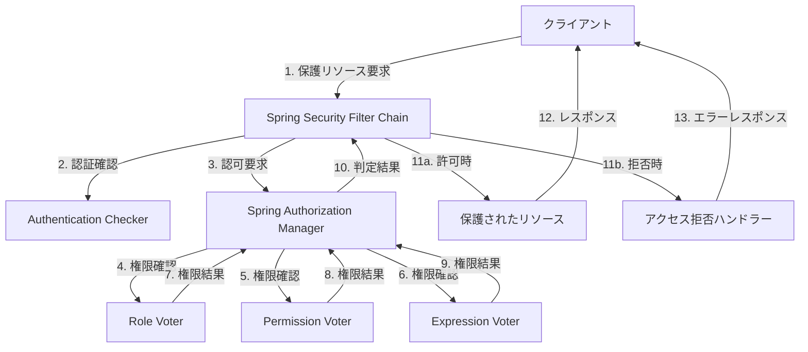

# 認可機能

## 1. 概要

本設計ではSES業務システムにおける認可機能の詳細設計を示します。認可はSpring Securityフレームワークを活用し、ロールベース認可制御（RBAC）と属性ベース認可制御（ABAC）を組み合わせた柔軟な認可機能を提供します。

## 2. 認可機能の基本構造



## 3. Spring Security設定

### 3.1 認可設定

SecurityConfigurationに認証設定と合わせて認可設定を追加します：

```java
@Configuration
@EnableWebSecurity
@EnableMethodSecurity
public class SecurityConfiguration {

    // 認証設定は既に説明した内容
    
    @Bean
    public RoleHierarchy roleHierarchy() {
        RoleHierarchyImpl hierarchy = new RoleHierarchyImpl();
        // 上位ロールは下位ロールの権限を持つという設定
        hierarchy.setHierarchy(
            "ROLE_ADMIN > ROLE_MANAGER\n" +
            "ROLE_MANAGER > ROLE_USER"
        );
        return hierarchy;
    }
    
    @Bean
    public DefaultWebSecurityExpressionHandler webSecurityExpressionHandler() {
        DefaultWebSecurityExpressionHandler expressionHandler = new DefaultWebSecurityExpressionHandler();
        expressionHandler.setRoleHierarchy(roleHierarchy());
        return expressionHandler;
    }
    
    @Bean
    public AuthorizationEventPublisher authorizationEventPublisher(
            ApplicationEventPublisher applicationEventPublisher) {
        return new SpringAuthorizationEventPublisher(applicationEventPublisher);
    }
}
```

### 3.2 メソッドセキュリティ設定

```java
@Configuration
@EnableMethodSecurity(
    prePostEnabled = true,
    securedEnabled = true,
    jsr250Enabled = true)
public class MethodSecurityConfig {

    @Bean
    public MethodSecurityExpressionHandler methodSecurityExpressionHandler(RoleHierarchy roleHierarchy) {
        DefaultMethodSecurityExpressionHandler expressionHandler = new DefaultMethodSecurityExpressionHandler();
        expressionHandler.setRoleHierarchy(roleHierarchy);
        return expressionHandler;
    }
    
    @Bean
    public Advisor methodSecurityAdvisor(MethodSecurityExpressionHandler expressionHandler) {
        // メソッドに対する認可チェックを行うインターセプター
        return new AuthorizationManagerBeforeMethodInterceptor(
            Pointcuts.forAnnotatedMethods(PreAuthorize.class),
            new PreAuthorizeAuthorizationManager(expressionHandler));
    }
}
```

## 4. カスタム実装

### 4.1 カスタムPermissionEvaluator

```java
@Component
public class CustomPermissionEvaluator implements PermissionEvaluator {

    @Autowired
    private AuthorizationService authorizationService;
    
    @Autowired
    private AuditLogService auditLogService;

    @Override
    public boolean hasPermission(Authentication authentication, Object targetDomainObject, Object permission) {
        if (authentication == null || targetDomainObject == null || permission == null) {
            return false;
        }
        
        UserDetails userDetails = (UserDetails) authentication.getPrincipal();
        User user = ((CustomUserDetails) userDetails).getUser();
        
        // リソース固有の権限チェックロジック
        if (targetDomainObject instanceof Engineer) {
            return checkEngineerPermission(user, (Engineer) targetDomainObject, permission.toString());
        } else if (targetDomainObject instanceof Project) {
            return checkProjectPermission(user, (Project) targetDomainObject, permission.toString());
        } else if (targetDomainObject instanceof Contract) {
            return checkContractPermission(user, (Contract) targetDomainObject, permission.toString());
        }
        
        return false;
    }

    @Override
    public boolean hasPermission(Authentication authentication, Serializable targetId, String targetType, Object permission) {
        if (authentication == null || targetId == null || targetType == null || permission == null) {
            return false;
        }
        
        UserDetails userDetails = (UserDetails) authentication.getPrincipal();
        User user = ((CustomUserDetails) userDetails).getUser();
        
        // リソース種別とIDによる権限チェック
        ResourceType resourceType;
        try {
            resourceType = ResourceType.valueOf(targetType.toUpperCase());
        } catch (IllegalArgumentException e) {
            return false;
        }
        
        ActionType actionType;
        try {
            actionType = ActionType.valueOf(permission.toString().toUpperCase());
        } catch (IllegalArgumentException e) {
            return false;
        }
        
        boolean hasPermission = authorizationService.hasPermission(
            user.getId(), resourceType, UUID.fromString(targetId.toString()), actionType);
        
        // 監査ログ
        logAuthorizationCheck(user, targetType, targetId.toString(), permission.toString(), hasPermission);
        
        return hasPermission;
    }
    
    // エンジニア固有の権限チェックロジック
    private boolean checkEngineerPermission(User user, Engineer engineer, String action) {
        // エンジニア固有の権限チェックロジック
        // 例: 所属部門の技術者のみ編集可能など
        
        // 一般権限チェック
        ResourceType resourceType = ResourceType.ENGINEER;
        ActionType actionType = ActionType.valueOf(action.toUpperCase());
        boolean hasPermission = authorizationService.hasPermission(
            user.getId(), resourceType, engineer.getId(), actionType);
        
        // 監査ログ
        logAuthorizationCheck(user, "Engineer", engineer.getId().toString(), action, hasPermission);
        
        return hasPermission;
    }
    
    private boolean checkProjectPermission(User user, Project project, String action) {
        // プロジェクト固有の権限チェックロジック
        
        // 一般権限チェック
        ResourceType resourceType = ResourceType.PROJECT;
        ActionType actionType = ActionType.valueOf(action.toUpperCase());
        boolean hasPermission = authorizationService.hasPermission(
            user.getId(), resourceType, project.getId(), actionType);
        
        // 監査ログ
        logAuthorizationCheck(user, "Project", project.getId().toString(), action, hasPermission);
        
        return hasPermission;
    }
    
    private boolean checkContractPermission(User user, Contract contract, String action) {
        // 契約固有の権限チェックロジック
        
        // 一般権限チェック
        ResourceType resourceType = ResourceType.CONTRACT;
        ActionType actionType = ActionType.valueOf(action.toUpperCase());
        boolean hasPermission = authorizationService.hasPermission(
            user.getId(), resourceType, contract.getId(), actionType);
        
        // 監査ログ
        logAuthorizationCheck(user, "Contract", contract.getId().toString(), action, hasPermission);
        
        return hasPermission;
    }
    
    private void logAuthorizationCheck(User user, String resourceType, String resourceId, String action, boolean success) {
        auditLogService.logAuthorizationEvent(
            user.getId(),
            resourceType,
            action,
            success,
            Map.of(
                "resourceId", resourceId,
                "action", action
            )
        );
    }
}
```

### 4.2 カスタムMethodSecurityExpressionRoot

```java
public class CustomMethodSecurityExpressionRoot extends SecurityExpressionRoot implements MethodSecurityExpressionOperations {

    private Object filterObject;
    private Object returnObject;
    private Object target;
    private AuthorizationService authorizationService;

    public CustomMethodSecurityExpressionRoot(Authentication authentication) {
        super(authentication);
    }
    
    // AuthorizationServiceの設定
    public void setAuthorizationService(AuthorizationService authorizationService) {
        this.authorizationService = authorizationService;
    }
    
    // カスタム権限チェックメソッド
    
    // リソース種別とアクションによる権限チェック
    public boolean hasResourcePermission(String resourceType, String action) {
        User user = getCurrentUser();
        if (user == null) {
            return false;
        }
        
        ResourceType type;
        try {
            type = ResourceType.valueOf(resourceType.toUpperCase());
        } catch (IllegalArgumentException e) {
            return false;
        }
        
        ActionType actionType;
        try {
            actionType = ActionType.valueOf(action.toUpperCase());
        } catch (IllegalArgumentException e) {
            return false;
        }
        
        return authorizationService.hasPermission(user.getId(), type, actionType);
    }
    
    // 権限名による権限チェック
    public boolean hasPermissionName(String permission) {
        User user = getCurrentUser();
        if (user == null) {
            return false;
        }
        
        return authorizationService.hasPermission(user.getId(), permission);
    }
    
    // 自分のリソースかどうかチェック
    public boolean isOwnResource(Object resource, String idField) {
        User user = getCurrentUser();
        if (user == null || resource == null) {
            return false;
        }
        
        try {
            // リフレクションでIDフィールド取得
            Field field = resource.getClass().getDeclaredField(idField);
            field.setAccessible(true);
            Object resourceId = field.get(resource);
            
            // 所有者IDとユーザーIDの比較
            Field ownerField = resource.getClass().getDeclaredField("ownerId");
            ownerField.setAccessible(true);
            Object ownerId = ownerField.get(resource);
            
            return user.getId().equals(ownerId);
        } catch (Exception e) {
            return false;
        }
    }
    
    // 現在の認証ユーザー取得
    private User getCurrentUser() {
        if (authentication == null || !authentication.isAuthenticated()) {
            return null;
        }
        
        Object principal = authentication.getPrincipal();
        if (principal instanceof CustomUserDetails) {
            return ((CustomUserDetails) principal).getUser();
        }
        
        return null;
    }

    @Override
    public void setFilterObject(Object filterObject) {
        this.filterObject = filterObject;
    }

    @Override
    public Object getFilterObject() {
        return this.filterObject;
    }

    @Override
    public void setReturnObject(Object returnObject) {
        this.returnObject = returnObject;
    }

    @Override
    public Object getReturnObject() {
        return this.returnObject;
    }

    @Override
    public Object getThis() {
        return target;
    }
    
    public void setThis(Object target) {
        this.target = target;
    }
}
```

### 4.3 カスタムMethodSecurityExpressionHandler

```java
@Component
public class CustomMethodSecurityExpressionHandler extends DefaultMethodSecurityExpressionHandler {

    @Autowired
    private AuthorizationService authorizationService;
    
    @Autowired
    private RoleHierarchy roleHierarchy;

    @Override
    protected MethodSecurityExpressionOperations createSecurityExpressionRoot(Authentication authentication, MethodInvocation invocation) {
        CustomMethodSecurityExpressionRoot root = new CustomMethodSecurityExpressionRoot(authentication);
        root.setAuthorizationService(authorizationService);
        root.setThis(invocation.getThis());
        root.setPermissionEvaluator(getPermissionEvaluator());
        root.setTrustResolver(new AuthenticationTrustResolverImpl());
        root.setRoleHierarchy(roleHierarchy);
        return root;
    }
}
```

## 5. AuthorizationService実装

```java
@Service
public class AuthorizationServiceImpl implements AuthorizationService {

    @Autowired
    private UserRepository userRepository;
    
    @Autowired
    private RoleRepository roleRepository;
    
    @Autowired
    private PermissionRepository permissionRepository;
    
    @Autowired
    private AuditLogService auditLogService;
    
    @Autowired
    private ApplicationEventPublisher eventPublisher;

    @Override
    public boolean hasPermission(UUID userId, ResourceType resourceType, ActionType actionType) {
        User user = userRepository.findById(userId)
            .orElseThrow(() -> new UsernameNotFoundException("ユーザーが見つかりません"));
        
        // 権限の名前構成：リソース名:アクション名
        String permissionName = resourceType.name().toLowerCase() + ":" + actionType.name().toLowerCase();
        
        // ユーザーのロール取得
        List<Role> roles = getRolesForUser(user);
        
        // ロールに紐づく権限取得
        Set<String> permissions = new HashSet<>();
        roles.forEach(role -> 
            role.getPermissions().forEach(permission -> 
                permissions.add(permission.getName())));
        
        boolean hasPermission = permissions.contains(permissionName);
        
        // 監査ログ
        logAuthorizationCheck(user, resourceType.name(), null, actionType.name(), hasPermission);
        
        // イベント発行
        publishAuthorizationEvent(user, resourceType.name(), null, actionType.name(), hasPermission);
        
        return hasPermission;
    }

    @Override
    public boolean hasPermission(UUID userId, ResourceType resourceType, UUID resourceId, ActionType actionType) {
        User user = userRepository.findById(userId)
            .orElseThrow(() -> new UsernameNotFoundException("ユーザーが見つかりません"));
        
        // 一般権限チェック
        if (!hasPermission(userId, resourceType, actionType)) {
            return false;
        }
        
        // リソース固有の権限チェックロジック（実装予定）
        boolean hasSpecificPermission = checkResourceSpecificPermission(
            user, resourceType, resourceId, actionType);
        
        // 監査ログ
        logAuthorizationCheck(user, resourceType.name(), resourceId.toString(), actionType.name(), hasSpecificPermission);
        
        // イベント発行
        publishAuthorizationEvent(user, resourceType.name(), resourceId.toString(), actionType.name(), hasSpecificPermission);
        
        return hasSpecificPermission;
    }

    @Override
    public boolean hasPermission(UUID userId, String permission) {
        User user = userRepository.findById(userId)
            .orElseThrow(() -> new UsernameNotFoundException("ユーザーが見つかりません"));
        
        // ユーザーのロール取得
        List<Role> roles = getRolesForUser(user);
        
        // ロールに紐づく権限取得
        Set<String> permissions = new HashSet<>();
        roles.forEach(role -> 
            role.getPermissions().forEach(perm -> 
                permissions.add(perm.getName())));
        
        boolean hasPermission = permissions.contains(permission);
        
        // 監査ログ
        String[] parts = permission.split(":");
        String resourceType = parts.length > 0 ? parts[0] : permission;
        String action = parts.length > 1 ? parts[1] : "access";
        
        logAuthorizationCheck(user, resourceType, null, action, hasPermission);
        
        return hasPermission;
    }

    @Override
    public boolean hasRole(UUID userId, String roleName) {
        User user = userRepository.findById(userId)
            .orElseThrow(() -> new UsernameNotFoundException("ユーザーが見つかりません"));
        
        // ユーザーのロール取得
        List<Role> roles = getRolesForUser(user);
        
        // ロールの確認
        boolean hasRole = roles.stream()
            .anyMatch(role -> role.getName().equalsIgnoreCase(roleName));
        
        // 監査ログ
        auditLogService.logAuthorizationEvent(
            userId,
            "ROLE",
            "CHECK",
            hasRole,
            Map.of(
                "roleName", roleName,
                "action", "roleCheck"
            )
        );
        
        return hasRole;
    }

    @Override
    public List<String> getUserPermissions(UUID userId) {
        User user = userRepository.findById(userId)
            .orElseThrow(() -> new UsernameNotFoundException("ユーザーが見つかりません"));
        
        // ユーザーのロール取得
        List<Role> roles = getRolesForUser(user);
        
        // ロールに紐づく権限取得
        Set<String> permissions = new HashSet<>();
        roles.forEach(role -> 
            role.getPermissions().forEach(permission -> 
                permissions.add(permission.getName())));
        
        return new ArrayList<>(permissions);
    }

    @Override
    public List<String> getUserRoles(UUID userId) {
        User user = userRepository.findById(userId)
            .orElseThrow(() -> new UsernameNotFoundException("ユーザーが見つかりません"));
        
        // ユーザーのロール取得
        List<Role> roles = getRolesForUser(user);
        
        return roles.stream()
            .map(Role::getName)
            .collect(Collectors.toList());
    }
    
    // 補助メソッド群
    
    private List<Role> getRolesForUser(User user) {
        // ユーザーに割り当てられたロールを取得
        Role role = roleRepository.findById(user.getRoleId())
            .orElseThrow(() -> new IllegalStateException("ロールが見つかりません"));
        
        return Collections.singletonList(role);
    }
    
    private boolean checkResourceSpecificPermission(User user, ResourceType resourceType, UUID resourceId, ActionType actionType) {
        // リソースタイプ別の権限チェック
        switch (resourceType) {
            case ENGINEER:
                return checkEngineerPermission(user, resourceId, actionType);
            case PROJECT:
                return checkProjectPermission(user, resourceId, actionType);
            case CONTRACT:
                return checkContractPermission(user, resourceId, actionType);
            case INVOICE:
                return checkInvoicePermission(user, resourceId, actionType);
            case TIMESHEET:
                return checkTimesheetPermission(user, resourceId, actionType);
            default:
                // デフォルトは一般権限のみ
                return true;
        }
    }
    
    private boolean checkEngineerPermission(User user, UUID engineerId, ActionType actionType) {
        // エンジニア固有の権限チェック
        // 例: 自分の技術者情報のみ編集可能など
        
        // 実装例：技術者エンティティの取得とビジネスルールのチェック
        // それぞれのリソースに応じたロジックを実装
        
        return true; // 仮実装
    }
    
    private boolean checkProjectPermission(User user, UUID projectId, ActionType actionType) {
        // プロジェクト固有の権限チェック
        // 例: 自分のプロジェクトのみ編集可能など
        
        return true; // 仮実装
    }
    
    private boolean checkContractPermission(User user, UUID contractId, ActionType actionType) {
        // 契約固有の権限チェック
        // 例: 承認権限がある場合のみ承認可能
        
        // ActionTypeが承認の場合、特殊な権限チェック
        if (actionType == ActionType.APPROVE) {
            return hasPermission(user.getId(), "contract:approve");
        }
        
        return true; // 仮実装
    }
    
    private boolean checkInvoicePermission(User user, UUID invoiceId, ActionType actionType) {
        // 請求書固有の権限チェック
        return true; // 仮実装
    }
    
    private boolean checkTimesheetPermission(User user, UUID timesheetId, ActionType actionType) {
        // 勤怠表固有の権限チェック
        return true; // 仮実装
    }
    
    private void logAuthorizationCheck(User user, String resourceType, String resourceId, String action, boolean success) {
        Map<String, String> details = new HashMap<>();
        details.put("action", action);
        if (resourceId != null) {
            details.put("resourceId", resourceId);
        }
        
        auditLogService.logAuthorizationEvent(
            user.getId(),
            resourceType,
            action,
            success,
            details
        );
    }
    
    private void publishAuthorizationEvent(User user, String resourceType, String resourceId, String action, boolean granted) {
        // Spring SecurityのAuthorizationEvent発行
        // これによりSpring Securityの標準ログ機能でも認可が追跡される
        Object object = resourceId != null ? resourceId : resourceType;
        AuthorizationDecision decision = new AuthorizationDecision(granted);
        
        eventPublisher.publishEvent(new AuthorizationGrantedEvent(
            SecurityContextHolder.getContext().getAuthentication(),
            object,
            decision
        ));
    }
}
```

## 6. コントローラーでの認可の使用

### 6.1 アノテーションベースの認可

```java
@RestController
@RequestMapping("/api/v1/engineers")
public class EngineerController {

    @Autowired
    private EngineerService engineerService;

    // ロールベース認可制御
    @GetMapping
    @PreAuthorize("hasRole('ADMIN') or hasRole('MANAGER')")
    public ResponseEntity<Page<EngineerDto>> getAllEngineers(Pageable pageable) {
        return ResponseEntity.ok(engineerService.findAll(pageable));
    }

    // リソースIDベースの権限チェック
    @GetMapping("/{id}")
    @PreAuthorize("hasPermission(#id, 'ENGINEER', 'READ')")
    public ResponseEntity<EngineerDto> getEngineer(@PathVariable UUID id) {
        return ResponseEntity.ok(engineerService.findById(id));
    }

    // リソース種別権限チェック
    @PostMapping
    @PreAuthorize("hasResourcePermission('ENGINEER', 'CREATE')")
    public ResponseEntity<EngineerDto> createEngineer(@Valid @RequestBody EngineerCreateDto dto) {
        return new ResponseEntity<>(engineerService.createEngineer(dto), HttpStatus.CREATED);
    }

    // 複合条件の権限チェック
    @PutMapping("/{id}")
    @PreAuthorize("hasPermission(#id, 'ENGINEER', 'UPDATE') or isOwnResource(#id, 'id')")
    public ResponseEntity<EngineerDto> updateEngineer(
            @PathVariable UUID id, 
            @Valid @RequestBody EngineerUpdateDto dto) {
        return ResponseEntity.ok(engineerService.updateEngineer(id, dto));
    }

    // 複数条件の権限チェック
    @PostMapping("/{id}/approve")
    @PreAuthorize("hasRole('MANAGER') and hasPermission(#id, 'ENGINEER', 'APPROVE')")
    public ResponseEntity<EngineerDto> approveEngineer(@PathVariable UUID id) {
        return ResponseEntity.ok(engineerService.approveEngineer(id));
    }
}
```

### 6.2 プログラム的な権限チェック

```java
@Service
public class ProjectServiceImpl implements ProjectService {

    @Autowired
    private ProjectRepository projectRepository;
    
    @Autowired
    private AuthorizationService authorizationService;
    
    @Override
    public ProjectDto updateProject(UUID id, ProjectUpdateDto dto) {
        // プロジェクト取得
        Project project = projectRepository.findById(id)
            .orElseThrow(() -> new ResourceNotFoundException("プロジェクトが見つかりません"));
        
        // 認証コンテキストからユーザーID取得
        UUID userId = getCurrentUserId();
        
        // 更新権限チェック
        if (!authorizationService.hasPermission(userId, ResourceType.PROJECT, id, ActionType.UPDATE)) {
            throw new AccessDeniedException("プロジェクトの更新権限がありません");
        }
        
        // 予算項目のみはさらに追加の権限チェック
        if (dto.getBudget() != null && !project.getBudget().equals(dto.getBudget())) {
            if (!authorizationService.hasPermission(userId, "project:modify_budget")) {
                throw new AccessDeniedException("予算変更の権限がありません");
            }
        }
        
        // プロジェクト更新処理
        // ...
        
        return mapper.toDto(updatedProject);
    }
    
    private UUID getCurrentUserId() {
        Authentication authentication = SecurityContextHolder.getContext().getAuthentication();
        if (authentication == null || !authentication.isAuthenticated()) {
            throw new AuthenticationCredentialsNotFoundException("認証情報がありません");
        }
        
        Object principal = authentication.getPrincipal();
        if (principal instanceof CustomUserDetails) {
            return ((CustomUserDetails) principal).getUser().getId();
        }
        
        throw new AuthenticationCredentialsNotFoundException("有効な認証情報がありません");
    }
}
```

## 7. データアクセス制御

### 7.1 リポジトリレベルの制御実装

```java
@Repository
public class ProjectRepositoryImpl implements ProjectRepository {

    @Autowired
    private JdbcTemplate jdbcTemplate;
    
    @Override
    public Page<Project> findAllByUser(UUID userId, Pageable pageable) {
        // ユーザーが閲覧できるプロジェクトのみ取得
        
        // STEP 1: 基本的なSQL構築
        StringBuilder sql = new StringBuilder();
        
        sql.append("SELECT p.* FROM projects p ");
        
        // STEP 2: ユーザーロールに応じた条件追加
        User user = getUserById(userId);
        List<String> roles = getRoleNames(user);
        
        // 管理者ならロール制限なし
        if (roles.contains("ADMIN")) {
            // 制限なし - すべてのプロジェクトにアクセス可能
        }
        // マネージャーは自部門のプロジェクトのみアクセス可能
        else if (roles.contains("MANAGER")) {
            sql.append("WHERE p.department_id = :departmentId ");
        }
        // 一般ユーザーは自分のプロジェクトのみアクセス可能
        else {
            sql.append("JOIN project_members pm ON p.id = pm.project_id ")
               .append("WHERE pm.user_id = :userId ");
        }
        
        // STEP 3: ページング処理追加
        // ... ページング処理実装
        
        // パラメータ設定
        MapSqlParameterSource params = new MapSqlParameterSource();
        if (roles.contains("MANAGER")) {
            params.addValue("departmentId", user.getDepartmentId());
        } else if (!roles.contains("ADMIN")) {
            params.addValue("userId", userId);
        }
        
        // 結果取得と変換
        // ... 実装
        
        return new PageImpl<>(projects, pageable, total);
    }
}
```

### 7.2 サービスレベルの制御実装

```java
@Service
public class InvoiceServiceImpl implements InvoiceService {

    @Autowired
    private InvoiceRepository invoiceRepository;
    
    @Autowired
    private AuthorizationService authorizationService;
    
    @Override
    public List<InvoiceDto> findAll() {
        // 全請求書取得
        List<Invoice> allInvoices = invoiceRepository.findAll();
        
        // 現在のユーザーID
        UUID userId = getCurrentUserId();
        
        // ロール取得
        List<String> roles = authorizationService.getUserRoles(userId);
        
        // ユーザーが閲覧可能な請求書フィルタリング
        List<Invoice> accessibleInvoices;
        
        if (roles.contains("ADMIN") || roles.contains("FINANCE_MANAGER")) {
            // 管理者または財務マネージャーは全請求書閲覧可能
            accessibleInvoices = allInvoices;
        } else if (roles.contains("FINANCE_STAFF")) {
            // 財務スタッフは担当部門の請求書のみ閲覧可能
            User user = userRepository.findById(userId).orElseThrow();
            accessibleInvoices = allInvoices.stream()
                .filter(invoice -> invoice.getDepartmentId().equals(user.getDepartmentId()))
                .collect(Collectors.toList());
        } else {
            // その他のユーザーは担当の請求書のみ閲覧可能
            accessibleInvoices = allInvoices.stream()
                .filter(invoice -> invoice.getCreatedBy().equals(userId))
                .collect(Collectors.toList());
        }
        
        // DTOに変換して返却
        return accessibleInvoices.stream()
            .map(mapper::toDto)
            .collect(Collectors.toList());
    }
}
```

## 8. パフォーマンス最適化

権限チェックの高速化のためにキャッシュ機構を導入します：

```java
@Configuration
@EnableCaching
public class CacheConfig {

    @Bean
    public CacheManager cacheManager() {
        CaffeineCacheManager cacheManager = new CaffeineCacheManager();
        cacheManager.setCaffeine(Caffeine.newBuilder()
            .maximumSize(1000)
            .expireAfterWrite(60, TimeUnit.MINUTES));
        return cacheManager;
    }
}

@Service
public class CachedAuthorizationService implements AuthorizationService {

    @Autowired
    private AuthorizationServiceImpl delegate;

    @Override
    @Cacheable(value = "authorizationCache", key = "{#userId, #resourceType, #actionType}")
    public boolean hasPermission(UUID userId, ResourceType resourceType, ActionType actionType) {
        return delegate.hasPermission(userId, resourceType, actionType);
    }

    @Override
    @Cacheable(value = "authorizationCache", key = "{#userId, #permission}")
    public boolean hasPermission(UUID userId, String permission) {
        return delegate.hasPermission(userId, permission);
    }

    @Override
    @Cacheable(value = "authorizationCache", key = "{#userId, #roleName}")
    public boolean hasRole(UUID userId, String roleName) {
        return delegate.hasRole(userId, roleName);
    }

    @Override
    @Cacheable(value = "userPermissionsCache", key = "#userId")
    public List<String> getUserPermissions(UUID userId) {
        return delegate.getUserPermissions(userId);
    }

    @Override
    @Cacheable(value = "userRolesCache", key = "#userId")
    public List<String> getUserRoles(UUID userId) {
        return delegate.getUserRoles(userId);
    }

    // リソース固有の権限チェックはキャッシュしない（リソース固有の状態変化に対応）
    @Override
    public boolean hasPermission(UUID userId, ResourceType resourceType, UUID resourceId, ActionType actionType) {
        return delegate.hasPermission(userId, resourceType, resourceId, actionType);
    }
}
```

## 9. テスト方針

認可機能のテストは下記の方針で実施します：

1. **単体テスト**:
   - AuthorizationServiceImplの機能テスト
   - CustomPermissionEvaluatorのテスト
   - Voterのテスト

2. **結合テスト**:
   - Spring Security設定のテスト
   - @PreAuthorizeアノテーションのテスト
   - 認可機能のテスト

3. **権限検証のテスト**:
   - ロールの権限階層のテスト
   - マルチテナント機能のテスト

## 10. まとめ

本設計ではSpring Securityを活用したRBACとABACの特長を組み合わせた認可機能を設計しました。この実装により下記の利点があります：

1. **宣言的認可制御**: @PreAuthorizeなどのアノテーションによる簡潔な実装
2. **堅牢な権限管理**: URL、メソッド、データレベルでの一貫した認可機能
3. **柔軟性**: カスタム認可ロジックの追加が容易
4. **監査と追跡**: 詳細な認可監査ログ

以上がSpring Securityの認可機能を活用し、SES業務システム向けにカスタマイズした設計となります。これにより各種リソースへの適切なアクセス制御が実現できます。