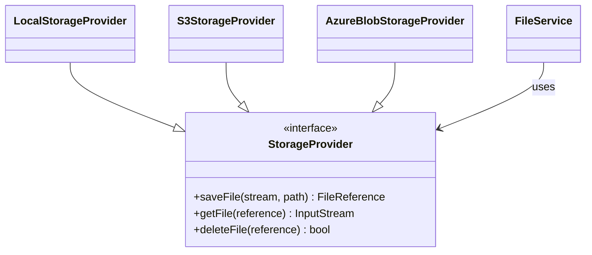
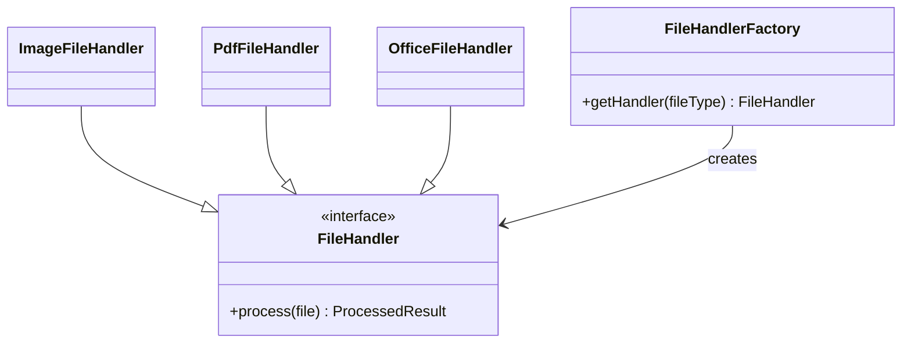
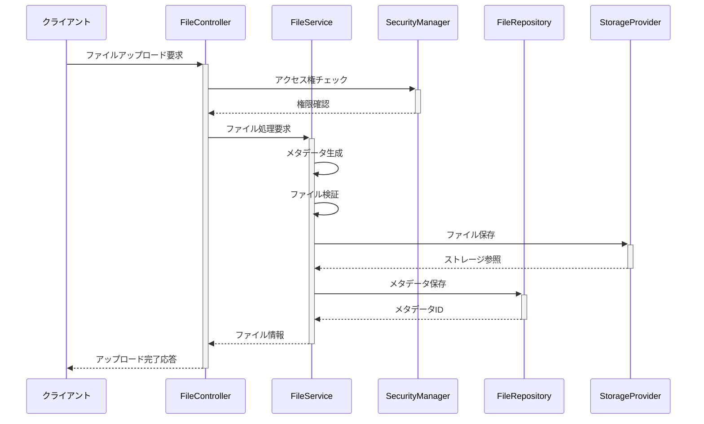
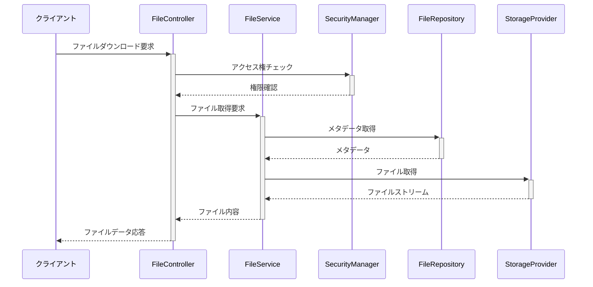

# ファイル管理機能 概要

## 1. はじめに

本ドキュメントでは、SES管理システムにおけるファイル管理機能の概要と設計方針について説明します。ファイル管理機能は、システム全体で使用される様々なファイル（技術者スキルシート、契約書、請求書、提案書など）を統一的に管理するための共通基盤を提供します。

## 2. 機能の位置づけ

ファイル管理機能は、SES管理システムの共通機能モジュールとして位置づけられ、以下の特徴を持ちます：

- 業務モジュールからシンプルなインターフェースでファイルを操作できる
- ストレージの実装詳細を抽象化し、将来的な変更（オンプレミス⇔クラウドなど）に対応
- セキュリティ要件を統一的に実装（アクセス制御、暗号化など）
- 監査要件に準拠したログ記録を提供

## 3. 主要機能

ファイル管理機能は以下の主要機能を提供します：

### 3.1 基本的なファイル操作

- ファイルのアップロード・保存
- ファイルのダウンロード・取得
- ファイルの削除・アーカイブ
- ファイルのメタデータ管理

### 3.2 高度なファイル機能

- アクセス制御（権限に基づくファイルアクセス管理）
- バージョン管理（ファイルの変更履歴管理）
- ファイル検索（メタデータに基づく検索）
- ファイル変換（画像リサイズ、PDF生成など）
- ファイルの有効期限管理
- ファイルの一括操作（複数ファイルのzip圧縮など）

### 3.3 運用管理機能

- ストレージ使用量の監視
- ファイル保存ポリシーの適用
- 不正アクセスの検知と通知
- ファイルの整合性検証

## 4. ユースケース

ファイル管理機能の主なユースケースは以下の通りです：

### 4.1 技術者管理モジュール

- 技術者のスキルシートをアップロード/ダウンロード
- 技術者の職務経歴書を管理
- 技術者関連の資格証明書や証明書類を保管

### 4.2 契約管理モジュール

- 契約書のテンプレート管理
- 電子署名済み契約書の保管
- 契約関連の付属書類の管理
- 契約書の変更履歴管理

### 4.3 請求支払管理モジュール

- 請求書/支払明細書の生成と保管
- 入金/支払証明書類の管理
- 請求書のテンプレート管理

### 4.4 案件管理/マッチングモジュール

- 案件要件書の管理
- 提案書の作成と管理
- 顧客提出用資料の保管

## 5. アーキテクチャ

ファイル管理機能は、以下のアーキテクチャパターンを採用しています：

### 5.1 レイヤードアーキテクチャ

```
┌───────────────────────────────────────────────┐
│           Presentation Layer                   │
│  (FileController, WebSocket, Rest API)         │
└───────────────────┬───────────────────────────┘
                    │
┌───────────────────┼───────────────────────────┐
│           Service Layer                        │
│  (FileService, FileVersionService, etc.)       │
└───────────────────┬───────────────────────────┘
                    │
┌───────────────────┼───────────────────────────┐
│         Repository Layer                       │
│  (FileRepository, StorageProvider, etc.)       │
└───────────────────┬───────────────────────────┘
                    │
┌───────────────────┼───────────────────────────┐
│          Infrastructure Layer                  │
│  (DBAdapter, S3Adapter, LocalFileAdapter, etc.)│
└───────────────────────────────────────────────┘
```

### 5.2 ストラテジーパターン

ストレージプロバイダは戦略パターンを用いて抽象化し、異なるストレージ実装（ローカルファイルシステム、S3、Azure Blob Storageなど）を透過的に切り替え可能にします。



### 5.3 ファクトリーパターン

ファイル処理のためのハンドラはファクトリーパターンを用いて実装し、ファイルタイプに応じた適切な処理を行います。



## 6. システム構成

### 6.1 論理コンポーネント

ファイル管理機能は以下の論理コンポーネントで構成されます：

- **FileController**: REST APIを提供するコントローラ
- **FileService**: ファイル操作の主要ビジネスロジックを提供
- **StorageProvider**: 物理的なファイルストレージ操作を抽象化
- **FileRepository**: ファイルメタデータのデータアクセス
- **FileSecurityManager**: ファイルセキュリティを担当
- **FileEventPublisher**: ファイル操作イベントを発行

### 6.2 物理構成

システムの物理構成は以下の要素で構成されます：

#### 開発環境
- **ストレージ**: ローカルファイルシステム
- **メタデータ**: H2データベース
- **処理サーバー**: 開発用アプリケーションサーバー

#### テスト環境
- **ストレージ**: MinIO (S3互換ストレージ)
- **メタデータ**: PostgreSQLデータベース
- **処理サーバー**: テスト用アプリケーションサーバー

#### 本番環境
- **ストレージ**: Amazon S3
- **メタデータ**: Amazon RDS (PostgreSQL)
- **処理サーバー**: 冗長化されたアプリケーションサーバークラスター

## 7. 技術スタック

ファイル管理機能は以下の技術スタックを採用しています：

| 技術分野 | 採用技術 |
|--------|---------|
| 開発言語 | Java 17 |
| フレームワーク | Spring Boot 3.x |
| データアクセス | Spring Data JPA |
| クラウドストレージ | AWS SDK for Java (S3) |
| セキュリティ | Spring Security、AES暗号化 |
| APIドキュメント | OpenAPI 3.0 (Swagger) |
| ビルドツール | Gradle |
| テスト | JUnit 5、Mockito、Testcontainers |

## 8. 非機能要件

### 8.1 性能要件

- ファイルアップロード: 50 MB未満のファイルを5秒以内に処理
- ファイルダウンロード: 50 MB未満のファイルを3秒以内に開始
- メタデータ検索: 95%のクエリを500ms以内に応答
- 同時アクセス: 100並列アクセスをサポート

### 8.2 信頼性要件

- 可用性: 99.9%以上
- データ整合性: チェックサムによる検証
- リカバリポイント目標（RPO）: 1時間以内
- リカバリ時間目標（RTO）: 4時間以内

### 8.3 セキュリティ要件

- 転送時の保護: TLS 1.3による暗号化
- 保存時の保護: AES-256による暗号化（機密ファイルの場合）
- アクセス制御: RBAC（ロールベースアクセス制御）
- 監査: すべてのファイル操作の監査ログ記録

### 8.4 運用要件

- モニタリング: ストレージ使用量、アクセス頻度、エラー率
- バックアップ: 毎日の増分バックアップ、週次の完全バックアップ
- ストレージ容量計画: 年間成長率30%を想定
- ログ保持: ファイル操作ログを1年間保持

## 9. データフロー

### 9.1 ファイルアップロードフロー



### 9.2 ファイルダウンロードフロー



## 10. 開発ロードマップ

ファイル管理機能の開発ロードマップは以下の通りです：

### フェーズ1（基盤構築）
- 基本的なファイル操作機能の実装
- ローカルファイルシステムでのストレージ対応
- 基本的なメタデータ管理の実装

### フェーズ2（拡張開発）
- S3ストレージプロバイダの追加
- セキュリティ機能の強化（暗号化、詳細なアクセス制御）
- バージョン管理機能の追加

### フェーズ3（高度化）
- ファイル変換機能の実装
- 高度な検索機能の追加
- パフォーマンス最適化（キャッシュ、非同期処理など）

### フェーズ4（運用強化）
- 運用管理機能の拡充
- 詳細な監視・レポート機能の追加
- 自動スケーリング対応

## 11. 依存関係

ファイル管理機能が依存する主なシステムコンポーネントは以下の通りです：

- **認証・認可機能**: ファイルへのアクセス制御
- **監査ログ機能**: ファイル操作の監査記録
- **通知機能**: ファイル操作イベントの通知

ファイル管理機能を利用する主なシステムコンポーネントは以下の通りです：

- **技術者管理モジュール**
- **案件管理モジュール**
- **契約管理モジュール**
- **請求・支払管理モジュール**

## 12. リスクと対策

| リスク | 影響 | 対策 |
|-------|-----|------|
| ストレージコストの増大 | 運用コスト上昇 | ファイル圧縮、重複排除、有効期限管理の実装 |
| ファイルアクセス性能の低下 | ユーザー体感速度悪化 | キャッシュ導入、CDN活用、最適なストレージ選択 |
| セキュリティ侵害 | 情報漏洩、法的リスク | アクセス制御強化、暗号化、監査ログの徹底 |
| ストレージプロバイダの障害 | サービス停止 | フェイルオーバー構成、代替ストレージの用意 |

## 13. 用語定義

| 用語 | 定義 |
|-----|------|
| ファイルメタデータ | ファイルに関する説明的な情報（ファイル名、サイズ、作成日時など） |
| ストレージプロバイダ | 物理的なファイル保存を担当するコンポーネントの抽象化 |
| ファイル参照 | 物理ファイルへの論理的な参照（URI、パスなど） |
| 業務エンティティ | ファイルが関連づけられるビジネスオブジェクト（技術者、案件など） |
| コンテンツタイプ | ファイルのMIMEタイプを表す識別子 |