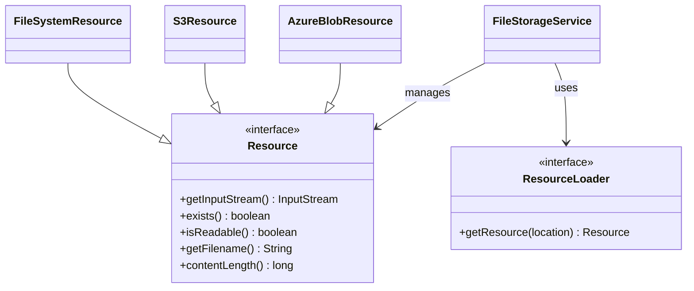
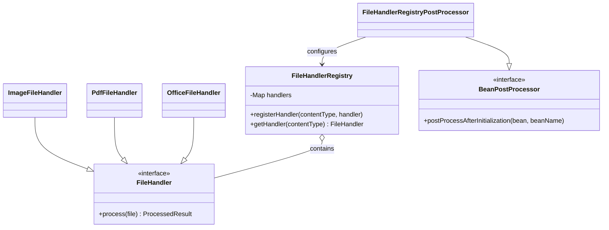
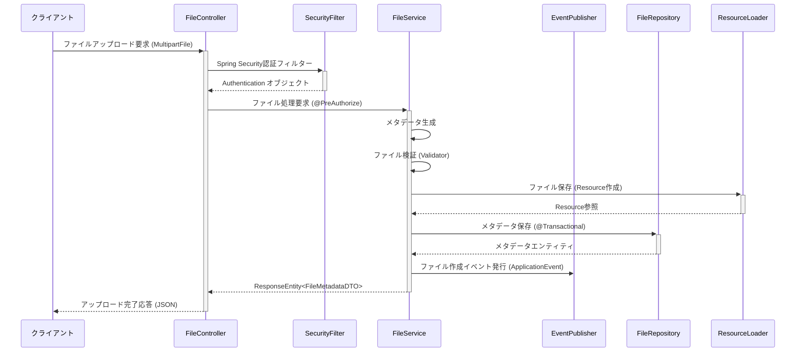
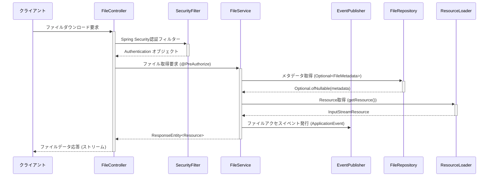

# ファイル管理機能 概要

## 1. はじめに

本ドキュメントでは、SES管理システムにおけるファイル管理機能の概要と設計方針について説明します。ファイル管理機能は、システム全体で使用される様々なファイル（技術者スキルシート、契約書、請求書、提案書など）を統一的に管理するための共通基盤を提供します。Spring Frameworkの標準機能を活用し、拡張性と保守性の高い設計を実現します。

## 2. 機能の位置づけ

ファイル管理機能は、SES管理システムの共通機能モジュールとして位置づけられ、以下の特徴を持ちます：

- Spring Resource抽象化を活用した統一的なファイルアクセス
- Springのストレージ抽象化（Resource, ResourceLoader）により、将来的なストレージ変更（オンプレミス⇔クラウドなど）に柔軟に対応
- Spring Securityを統合したアクセス制御と暗号化
- Spring AOP、Actuator、Eventsを活用した監査ログ記録

## 3. 主要機能

ファイル管理機能は以下の主要機能を提供します：

### 3.1 基本的なファイル操作

- ファイルのアップロード・保存
- ファイルのダウンロード・取得
- ファイルの削除・アーカイブ
- ファイルのメタデータ管理

### 3.2 高度なファイル機能

- アクセス制御（権限に基づくファイルアクセス管理）
- バージョン管理（ファイルの変更履歴管理）
- ファイル検索（メタデータに基づく検索）
- ファイル変換（画像リサイズ、PDF生成など）
- ファイルの有効期限管理
- ファイルの一括操作（複数ファイルのzip圧縮など）

### 3.3 運用管理機能

- ストレージ使用量の監視
- ファイル保存ポリシーの適用
- 不正アクセスの検知と通知
- ファイルの整合性検証

## 4. ユースケース

ファイル管理機能の主なユースケースは以下の通りです：

### 4.1 技術者管理モジュール

- 技術者のスキルシートをアップロード/ダウンロード
- 技術者の職務経歴書を管理
- 技術者関連の資格証明書や証明書類を保管

### 4.2 契約管理モジュール

- 契約書のテンプレート管理
- 電子署名済み契約書の保管
- 契約関連の付属書類の管理
- 契約書の変更履歴管理

### 4.3 請求支払管理モジュール

- 請求書/支払明細書の生成と保管
- 入金/支払証明書類の管理
- 請求書のテンプレート管理

### 4.4 案件管理/マッチングモジュール

- 案件要件書の管理
- 提案書の作成と管理
- 顧客提出用資料の保管

## 5. アーキテクチャ

ファイル管理機能は、以下のSpring Frameworkのアーキテクチャ要素を採用しています：

### 5.1 Springベースのレイヤードアーキテクチャ

```
┌───────────────────────────────────────────────┐
│           Presentation Layer                   │
│  (@RestController, @Controller, ResponseEntity) │
└───────────────────┬───────────────────────────┘
                    │
┌───────────────────┼───────────────────────────┐
│           Service Layer                        │
│  (@Service, @Transactional, ApplicationEvents) │
└───────────────────┬───────────────────────────┘
                    │
┌───────────────────┼───────────────────────────┐
│         Repository Layer                       │
│  (Spring Data JPA, @Repository)                │
└───────────────────┬───────────────────────────┘
                    │
┌───────────────────┼───────────────────────────┐
│          Infrastructure Layer                  │
│  (ResourceLoader, S3Client, AzureClient, etc.) │
└───────────────────────────────────────────────┘
```

### 5.2 Spring Resourceベースのストレージ抽象化

Springの Resource抽象化を利用して、異なるストレージ（ローカルファイルシステム、S3、Azure Blob Storageなど）を透過的に扱います。



### 5.3 Spring BeanのFactory Pattern活用

SpringのApplicationContextとBeanFactoryを活用して、ファイル処理ハンドラを管理します。



## 6. システム構成

### 6.1 論理コンポーネント（Spring標準機能）

ファイル管理機能は以下のSpring標準コンポーネントで構成されます：

- **FileController**: @RestControllerアノテーションを使用したREST APIコントローラ
- **FileService**: @Serviceアノテーション、@Transactionalを活用したサービス
- **ResourceResolver**: Spring ResourceLoaderを拡張したストレージ抽象化
- **FileRepository**: Spring Data JPAを活用したリポジトリ
- **FileSecurityService**: Spring Securityと統合したセキュリティサービス
- **FileEventPublisher**: ApplicationEventPublisherを活用したイベント発行

### 6.2 物理構成

システムの物理構成は以下の要素で構成されます：

#### 開発環境
- **ストレージ**: ローカルファイルシステム
- **メタデータ**: H2データベース
- **処理サーバー**: 開発用アプリケーションサーバー

#### テスト環境
- **ストレージ**: MinIO (S3互換ストレージ)
- **メタデータ**: PostgreSQLデータベース
- **処理サーバー**: テスト用アプリケーションサーバー

#### 本番環境
- **ストレージ**: Amazon S3
- **メタデータ**: Amazon RDS (PostgreSQL)
- **処理サーバー**: 冗長化されたアプリケーションサーバークラスター

## 7. 技術スタック（Spring標準機能）

ファイル管理機能は以下のSpring関連技術スタックを採用しています：

| 技術分野 | 採用技術 |
|--------|----------|
| 開発言語 | Java 17 |
| フレームワーク | Spring Boot 3.x |
| データアクセス | Spring Data JPA、Spring Data JDBC |
| リソース抽象化 | Spring Resource, ResourceLoader |
| ストレージ統合 | Spring Cloud AWS, Spring Azure Storage |
| セキュリティ | Spring Security、Spring Vault (暗号化) |
| イベント処理 | Spring ApplicationEvent |
| キャッシュ | Spring Cache |
| バッチ処理 | Spring Scheduler, @Scheduled |
| メトリクス収集 | Spring Boot Actuator |
| 横断的関心事 | Spring AOP |
| APIドキュメント | SpringDoc OpenAPI |
| ビルドツール | Gradle |
| テスト | Spring Test, JUnit 5、Spring Boot Test、Testcontainers |

## 8. 非機能要件

### 8.1 性能要件

- ファイルアップロード: 50 MB未満のファイルを5秒以内に処理
- ファイルダウンロード: 50 MB未満のファイルを3秒以内に開始
- メタデータ検索: 95%のクエリを500ms以内に応答
- 同時アクセス: 100並列アクセスをサポート

### 8.2 信頼性要件

- 可用性: 99.9%以上
- データ整合性: チェックサムによる検証
- リカバリポイント目標（RPO）: 1時間以内
- リカバリ時間目標（RTO）: 4時間以内

### 8.3 セキュリティ要件

- 転送時の保護: TLS 1.3による暗号化
- 保存時の保護: AES-256による暗号化（機密ファイルの場合）
- アクセス制御: RBAC（ロールベースアクセス制御）
- 監査: すべてのファイル操作の監査ログ記録

### 8.4 運用要件

- モニタリング: ストレージ使用量、アクセス頻度、エラー率
- バックアップ: 毎日の増分バックアップ、週次の完全バックアップ
- ストレージ容量計画: 年間成長率30%を想定
- ログ保持: ファイル操作ログを1年間保持

## 9. データフロー（Spring標準機能の活用）

### 9.1 ファイルアップロードフロー



### 9.2 ファイルダウンロードフロー



## 10. 開発ロードマップ（Spring標準機能の活用）

ファイル管理機能の開発ロードマップは以下の通りです：

### フェーズ1（基盤構築）
- Spring Resourceと ResourceLoaderを活用した基本ファイル操作機能
- FileSystemResourceによるローカルファイルシステム対応
- Spring Data JPAを活用したメタデータ管理実装
- Spring Boot Autoconfigurationによる自動設定

### フェーズ2（拡張開発）
- Spring Cloud AWSによるS3統合（S3Resource実装）
- Spring Securityによるアクセス制御(@PreAuthorize, @PostAuthorize)
- Spring Vaultによる暗号化機能
- 非同期処理のための@Asyncサポート

### フェーズ3（高度化）
- Spring Applicationイベントによるファイル操作イベント処理
- Spring Cacheによるメタデータキャッシュ実装
- Spring AOPによる横断的関心事の分離
- Springの@Conditionalによる環境別実装切り替え

### フェーズ4（運用強化）
- Spring Boot Actuatorによるメトリクス収集と監視
- Spring Schedulerによるバッチ処理自動化
- Spring Webfluxによる非同期APIサポート（大容量ファイル対応）
- Spring Cloud Sleuthによる分散トレーシング

## 11. 依存関係（Spring標準機能の活用）

ファイル管理機能が依存する主なSpringコンポーネントおよびモジュールは以下の通りです：

- **Spring Security**: 認証・認可処理と権限ベースのアクセス制御
- **Spring AOP**: ファイル操作の監査記録（@LogFileAccess等のカスタムアノテーション）
- **Spring ApplicationEventPublisher**: ファイル操作イベントのパブリッシュ
- **Spring ApplicationEventListener**: イベント処理（通知、ログ記録等）

ファイル管理機能を利用する主なシステムコンポーネントは以下の通りです：

- **技術者管理モジュール**: @Resourceによるインジェクション、FileServiceインターフェース利用
- **案件管理モジュール**: @Resourceによるインジェクション、FileServiceインターフェース利用
- **契約管理モジュール**: @Resourceによるインジェクション、FileServiceインターフェース利用
- **請求・支払管理モジュール**: @Resourceによるインジェクション、FileServiceインターフェース利用

## 12. リスクと対策（Spring標準機能による緩和）

| リスク | 影響 | Spring標準機能を活用した対策 |
|-------|-----|------|
| ストレージコストの増大 | 運用コスト上昇 | Spring Cacheによるアクセス頻度削減、Spring Scheduler活用の自動データライフサイクル管理 |
| ファイルアクセス性能の低下 | ユーザー体感速度悪化 | Spring Cacheによるメタデータキャッシュ、Spring WebFluxによる非同期ダウンロード、ResourceHandlerによる静的リソース最適化 |
| セキュリティ侵害 | 情報漏洩、法的リスク | Spring Security（認可フレームワーク）、Spring AOPによる監査ログ、Spring Vaultによる暗号化 |
| ストレージプロバイダの障害 | サービス停止 | Spring Cloud Circuit Breaker、@Retryable、Spring Resourceの抽象化による複数ストレージ対応 |

## 13. 用語定義（Spring標準機能コンテキスト）

| 用語 | 定義（Spring標準機能コンテキスト） |
|-----|------|
| ファイルメタデータ | ファイルに関する説明的な情報（Spring Data JPAによって管理されるエンティティ） |
| Resource | Spring Frameworkが提供するリソース抽象化インターフェース（ファイルシステム、クラスパス、URL、S3等のリソースを統一的に扱う） |
| ResourceLoader | リソースをロードするためのSpring標準インターフェース（ApplicationContext自体もResourceLoader） |
| ApplicationEvent | ファイル操作のイベント通知に使用されるSpringイベントシステム |
| 業務エンティティ | ファイルが関連づけられるビジネスオブジェクト（Spring Data JPAエンティティとして表現） |
| ContentNegotiationStrategy | Spring MVCでコンテンツタイプのネゴシエーションを担当するコンポーネント |