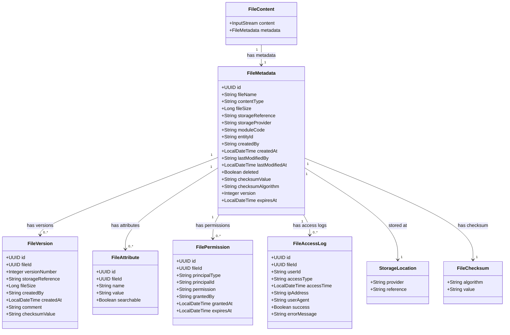

# ファイル管理機能 ドメインモデル

## 1. 概要

本ドキュメントでは、ファイル管理機能のドメインモデルを定義します。ドメインモデルは、ファイル管理に関する主要な概念とそれらの関係を表現したものであり、システム設計の基盤となります。

## 2. エンティティ

### 2.1 FileMetadata（ファイルメタデータ）

ファイルの説明的情報を表すエンティティです。

#### 属性

| 属性名 | 型 | 説明 | 制約 |
|--------|------|------|------|
| id | UUID | ファイルの一意識別子 | PK, NOT NULL |
| fileName | String | 元のファイル名 | NOT NULL, 最大255文字 |
| contentType | String | MIMEタイプ | NOT NULL, 最大100文字 |
| fileSize | Long | ファイルサイズ（バイト） | NOT NULL, ≥ 0 |
| storageReference | String | ストレージ上の参照 | NOT NULL, 最大1000文字 |
| storageProvider | String | 利用ストレージプロバイダ | NOT NULL, 最大50文字 |
| moduleCode | String | 関連業務モジュールコード | NOT NULL, 最大50文字 |
| entityId | String | 関連エンティティID | 最大100文字 |
| createdBy | String | 作成者ID | NOT NULL, 最大50文字 |
| createdAt | LocalDateTime | 作成日時 | NOT NULL |
| lastModifiedBy | String | 最終更新者ID | 最大50文字 |
| lastModifiedAt | LocalDateTime | 最終更新日時 | |
| deleted | Boolean | 削除フラグ | NOT NULL, デフォルトfalse |
| checksumValue | String | チェックサム値 | 最大100文字 |
| checksumAlgorithm | String | チェックサムアルゴリズム | 最大20文字 |
| version | Integer | バージョン番号 | NOT NULL, ≥ 1 |
| expiresAt | LocalDateTime | 有効期限 | |

#### ビジネスルール

- ファイル名は格納時に重複しないように内部的に管理される
- 削除されたファイルは物理的に即時削除されず、論理削除フラグで管理される
- チェックサムはファイルの整合性検証に使用される
- 同一ファイルの更新時はバージョンが自動的にインクリメントされる

### 2.2 FileContent（ファイルコンテンツ）

ファイルの実際の内容を表す値オブジェクトです。

#### 属性

| 属性名 | 型 | 説明 | 制約 |
|--------|------|------|------|
| content | InputStream | ファイルの内容 | NOT NULL |
| metadata | FileMetadata | 関連するメタデータ | NOT NULL |

#### ビジネスルール

- FileContentはイミュータブル（不変）である
- 大きなファイルの場合はストリーミング処理を行う

### 2.3 FileVersion（ファイルバージョン）

ファイルの特定バージョンを表すエンティティです。

#### 属性

| 属性名 | 型 | 説明 | 制約 |
|--------|------|------|------|
| id | UUID | バージョンの一意識別子 | PK, NOT NULL |
| fileId | UUID | 関連ファイルID | FK(FileMetadata), NOT NULL |
| versionNumber | Integer | バージョン番号 | NOT NULL, ≥ 1 |
| storageReference | String | このバージョンのストレージ参照 | NOT NULL, 最大1000文字 |
| fileSize | Long | このバージョンのサイズ | NOT NULL, ≥ 0 |
| createdBy | String | 作成者ID | NOT NULL, 最大50文字 |
| createdAt | LocalDateTime | 作成日時 | NOT NULL |
| comment | String | バージョンコメント | 最大500文字 |
| checksumValue | String | チェックサム値 | 最大100文字 |

#### ビジネスルール

- 同一ファイルの各バージョンは独立して保存される
- 最新バージョンが現在のファイル状態を表す
- バージョン番号は1から始まり、新しいバージョンが作成されるたびに順次インクリメントされる

### 2.4 FileAttribute（ファイル属性）

ファイルの拡張属性を表すエンティティです。

#### 属性

| 属性名 | 型 | 説明 | 制約 |
|--------|------|------|------|
| id | UUID | 属性の一意識別子 | PK, NOT NULL |
| fileId | UUID | 関連ファイルID | FK(FileMetadata), NOT NULL |
| name | String | 属性名 | NOT NULL, 最大100文字 |
| value | String | 属性値 | 最大1000文字 |
| searchable | Boolean | 検索可能フラグ | NOT NULL, デフォルトfalse |

#### ビジネスルール

- ファイルには任意の数のカスタム属性を設定可能
- 検索可能な属性はインデックスが作成され高速検索に利用される
- 属性名はファイル単位で一意である

### 2.5 FilePermission（ファイルパーミッション）

ファイルへのアクセス権限を表すエンティティです。

#### 属性

| 属性名 | 型 | 説明 | 制約 |
|--------|------|------|------|
| id | UUID | パーミッションの一意識別子 | PK, NOT NULL |
| fileId | UUID | 関連ファイルID | FK(FileMetadata), NOT NULL |
| principalType | String | 権限主体タイプ（USER/ROLE/GROUP） | NOT NULL, 最大20文字 |
| principalId | String | 権限主体ID | NOT NULL, 最大100文字 |
| permission | String | 権限種別（READ/WRITE/DELETE） | NOT NULL, 最大20文字 |
| grantedBy | String | 権限付与者ID | NOT NULL, 最大50文字 |
| grantedAt | LocalDateTime | 権限付与日時 | NOT NULL |
| expiresAt | LocalDateTime | 権限有効期限 | |

#### ビジネスルール

- ファイルへのアクセスは明示的に付与された権限に基づいて制御される
- デフォルトではファイル作成者のみがすべての権限を持つ
- 権限は有効期限を設定可能
- システム管理者は常にすべてのファイルへのアクセス権を持つ

### 2.6 FileAccessLog（ファイルアクセスログ）

ファイルへのアクセス履歴を記録するエンティティです。

#### 属性

| 属性名 | 型 | 説明 | 制約 |
|--------|------|------|------|
| id | UUID | ログの一意識別子 | PK, NOT NULL |
| fileId | UUID | 関連ファイルID | FK(FileMetadata), NOT NULL |
| userId | String | アクセスユーザーID | NOT NULL, 最大50文字 |
| accessType | String | アクセス種別（UPLOAD/DOWNLOAD/VIEW/DELETE） | NOT NULL, 最大20文字 |
| accessTime | LocalDateTime | アクセス日時 | NOT NULL |
| ipAddress | String | クライアントIPアドレス | 最大50文字 |
| userAgent | String | ユーザーエージェント | 最大500文字 |
| success | Boolean | 成功フラグ | NOT NULL |
| errorMessage | String | エラーメッセージ | 最大1000文字 |

#### ビジネスルール

- すべてのファイルアクセスは監査目的で記録される
- アクセスログは定期的にアーカイブされる
- アクセスログは改ざん防止のため不変である

## 3. 値オブジェクト

### 3.1 StorageLocation（ストレージロケーション）

ファイルの物理的な保存場所を表す値オブジェクトです。

#### 属性

| 属性名 | 型 | 説明 |
|--------|------|------|
| provider | String | ストレージプロバイダ識別子 |
| reference | String | プロバイダ固有の場所参照 |

#### ビジネスルール

- プロバイダによって参照形式が異なる（例：ローカルファイルシステムはパス、S3はバケット+キー）
- 参照はプロバイダ内で一意である

### 3.2 FileChecksum（ファイルチェックサム）

ファイルの整合性を検証するためのチェックサム情報を表す値オブジェクトです。

#### 属性

| 属性名 | 型 | 説明 |
|--------|------|------|
| algorithm | String | 使用されたハッシュアルゴリズム（MD5、SHA-256など） |
| value | String | 計算されたハッシュ値 |

#### ビジネスルール

- チェックサムはファイル転送や保存の整合性を検証するために使用される
- デフォルトではSHA-256アルゴリズムを使用

### 3.3 FileTypeCategory（ファイルタイプカテゴリ）

ファイルの種類を分類するための値オブジェクトです。

#### 属性

| 属性名 | 型 | 説明 |
|--------|------|------|
| category | String | 分類カテゴリ（DOCUMENT、IMAGE、VIDEO、AUDIOなど） |
| mimeTypes | List<String> | このカテゴリに属するMIMEタイプのリスト |

#### ビジネスルール

- ファイルは複数のカテゴリに属することができる
- MIMEタイプに基づいて自動的にカテゴリが判定される

### 3.4 FileSearchCriteria（ファイル検索条件）

ファイル検索時の条件を表す値オブジェクトです。

#### 属性

| 属性名 | 型 | 説明 |
|--------|------|------|
| moduleCode | String | モジュールコードによるフィルタ |
| entityId | String | エンティティIDによるフィルタ |
| fileNamePattern | String | ファイル名パターンによるフィルタ（ワイルドカード対応） |
| contentTypes | List<String> | コンテンツタイプによるフィルタ |
| minSize | Long | 最小サイズによるフィルタ |
| maxSize | Long | 最大サイズによるフィルタ |
| createdAfter | LocalDateTime | 作成日時（開始）によるフィルタ |
| createdBefore | LocalDateTime | 作成日時（終了）によるフィルタ |
| attributes | Map<String, String> | カスタム属性によるフィルタ |

#### ビジネスルール

- 検索条件はAND条件で組み合わせて評価される
- 指定されていない条件は評価から除外される

## 4. 集約

### 4.1 File集約

File集約は、FileMetadataをルートエンティティとし、以下のエンティティや値オブジェクトを含みます：

- FileMetadata（ルートエンティティ）
- FileVersion（エンティティ）
- FileAttribute（エンティティ）
- FilePermission（エンティティ）
- StorageLocation（値オブジェクト）
- FileChecksum（値オブジェクト）

File集約は、1つのファイルに関するすべての情報を管理し、ファイルのライフサイクル全体を通じて一貫性を保証します。

### 4.2 FileAccess集約

FileAccess集約は、FileAccessLogをルートエンティティとし、ファイルへのアクセス監査を管理します：

- FileAccessLog（ルートエンティティ）

この集約は監査とセキュリティのために設計され、ファイル操作の完全な監査証跡を提供します。

## 5. リポジトリ

### 5.1 FileRepository

File集約のためのリポジトリインターフェースは以下の操作を提供します：

- findById(UUID id): Optional<FileMetadata>
- findByModuleAndEntity(String moduleCode, String entityId): List<FileMetadata>
- findByCriteria(FileSearchCriteria criteria): List<FileMetadata>
- save(FileMetadata file): FileMetadata
- markAsDeleted(UUID id): void
- findVersions(UUID fileId): List<FileVersion>
- saveVersion(FileVersion version): FileVersion

### 5.2 FileAccessLogRepository

FileAccess集約のためのリポジトリインターフェースは以下の操作を提供します：

- save(FileAccessLog log): FileAccessLog
- findByFileId(UUID fileId): List<FileAccessLog>
- findByUserId(String userId): List<FileAccessLog>
- findByPeriod(LocalDateTime start, LocalDateTime end): List<FileAccessLog>

## 6. ドメインサービス

### 6.1 FileStorageService

ファイルの物理的な保存と取得を担当するドメインサービスです。

#### 主要機能

- saveFile(InputStream content, String fileName): StorageLocation
- getFile(StorageLocation location): InputStream
- deleteFile(StorageLocation location): boolean
- moveFile(StorageLocation source, StorageLocation target): StorageLocation

### 6.2 FileChecksumService

ファイルのチェックサム計算と検証を担当するドメインサービスです。

#### 主要機能

- calculateChecksum(InputStream content, String algorithm): FileChecksum
- verifyChecksum(InputStream content, FileChecksum expectedChecksum): boolean

### 6.3 FilePermissionService

ファイルへのアクセス権限を管理するドメインサービスです。

#### 主要機能

- hasPermission(String userId, UUID fileId, String permission): boolean
- grantPermission(UUID fileId, String principalType, String principalId, String permission): FilePermission
- revokePermission(UUID permissionId): void
- getEffectivePermissions(UUID fileId): List<FilePermission>

### 6.4 FileVersioningService

ファイルのバージョン管理を担当するドメインサービスです。

#### 主要機能

- createNewVersion(UUID fileId, InputStream content): FileVersion
- getVersion(UUID fileId, Integer versionNumber): Optional<FileContent>
- revertToVersion(UUID fileId, Integer versionNumber): FileMetadata

## 7. ドメインイベント

### 7.1 FileCreatedEvent

ファイルが新規作成された際に発行されるイベントです。

#### 属性

- fileId: UUID
- fileName: String
- moduleCode: String
- entityId: String
- createdBy: String
- timestamp: LocalDateTime

### 7.2 FileAccessedEvent

ファイルがアクセスされた際に発行されるイベントです。

#### 属性

- fileId: UUID
- userId: String
- accessType: String
- timestamp: LocalDateTime

### 7.3 FileDeletedEvent

ファイルが削除された際に発行されるイベントです。

#### 属性

- fileId: UUID
- deletedBy: String
- timestamp: LocalDateTime

### 7.4 FileVersionCreatedEvent

ファイルの新しいバージョンが作成された際に発行されるイベントです。

#### 属性

- fileId: UUID
- versionNumber: Integer
- createdBy: String
- timestamp: LocalDateTime

## 8. ドメインモデル関連図

ファイル管理機能のドメインモデル要素間の関連を以下の図で表現します：

## 9. 注意事項とガイドライン

### 9.1 ファイル命名規則

- ファイル名は元の名前を保持するが、内部的には一意のIDを使用して管理
- ファイル名に使用できない文字（`/`, `\`, `:`, `*`, `?`, `"`, `<`, `>`, `|`）は自動的に変換

### 9.2 セキュリティ考慮事項

- パーソナルデータを含むファイルは暗号化して保存
- 機密ファイルへのアクセスは常に監査ログに記録
- ファイルアクセス権は最小権限の原則に従って管理

### 9.3 パフォーマンス最適化

- 大きなファイルはチャンク単位で処理
- 頻繁にアクセスされるファイルはキャッシュ層に保持
- メタデータの検索は適切なインデックスを使用して最適化

### 9.4 バージョン管理ポリシー

- デフォルトでは最新5バージョンを保持
- 古いバージョンは設定可能な期間後に自動的にアーカイブまたは削除
- バージョンコメントは変更内容を簡潔に説明することを推奨