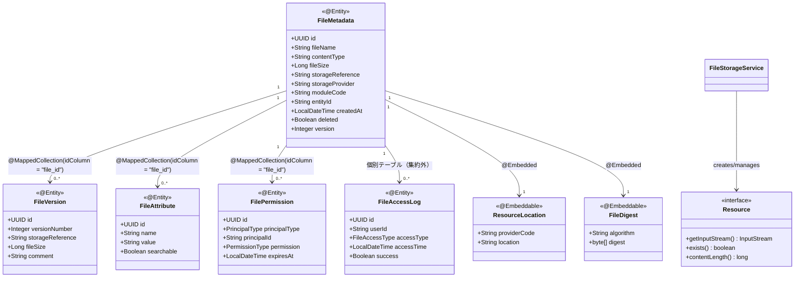

# ファイル管理機能 ドメインモデル

## 1. 概要

本ドキュメントでは、ファイル管理機能のドメインモデルを定義します。ドメインモデルは、ファイル管理に関する主要な概念とそれらの関係を表現したものであり、システム設計の基盤となります。Spring Frameworkの標準機能を活用して効率的なファイル管理を実現します。

## 2. エンティティ（Spring Data JDBC モデル）

### 2.1 FileMetadata（ファイルメタデータ）

Spring Data JDBCによって管理されるファイルの説明的情報を表すエンティティです。

#### 属性

| 属性名 | 型 | 説明 | 制約/アノテーション |
|--------|------|------|------|
| id | UUID | ファイルの一意識別子 | @Id, @GeneratedValue, NOT NULL |
| fileName | String | 元のファイル名 | @Column(nullable = false, length = 255) |
| contentType | String | MIMEタイプ | @Column(nullable = false, length = 100) |
| fileSize | Long | ファイルサイズ（バイト） | @Column(nullable = false) |
| storageReference | String | ストレージ上の参照 | @Column(nullable = false, length = 1000) |
| storageProvider | String | 利用ストレージプロバイダ | @Column(nullable = false, length = 50) |
| moduleCode | String | 関連業務モジュールコード | @Column(nullable = false, length = 50) |
| entityId | String | 関連エンティティID | @Column(length = 100) |
| createdBy | String | 作成者ID | @CreatedBy, @Column(nullable = false, length = 50) |
| createdAt | LocalDateTime | 作成日時 | @CreatedDate, @Column(nullable = false) |
| lastModifiedBy | String | 最終更新者ID | @LastModifiedBy, @Column(length = 50) |
| lastModifiedAt | LocalDateTime | 最終更新日時 | @LastModifiedDate |
| deleted | Boolean | 削除フラグ | @Column(nullable = false, columnDefinition = "boolean default false") |
| checksumValue | String | チェックサム値 | @Column(length = 100) |
| checksumAlgorithm | String | チェックサムアルゴリズム | @Column(length = 20) |
| version | Integer | バージョン番号 | @Version, @Column(nullable = false) |
| expiresAt | LocalDateTime | 有効期限 | @Column |

#### ビジネスルール

- ファイル名は格納時に重複しないように内部的に管理される
- 削除されたファイルは物理的に即時削除されず、deleteフラグによる論理削除を実現
- チェックサムはファイルの整合性検証に使用される
- @Versionによる楽観的ロックが自動的に適用される

### 2.2 FileContent（ファイルコンテンツ）

Spring Resourceを利用したファイルの実際の内容を表す値オブジェクトです。

#### 属性

| 属性名 | 型 | 説明 | 制約 |
|--------|------|------|------|
| resource | Resource | ファイルリソース（Spring抽象化） | NOT NULL |
| metadata | FileMetadata | 関連するメタデータ | NOT NULL |

#### ビジネスルール

- FileContentはイミュータブル（不変）である（Immutableアノテーションを使用）
- 大きなファイルの場合はSpring Resourceの抽象化により効率的なストリーミング処理を行う

### 2.3 FileVersion（ファイルバージョン）

Spring Data JDBCによって管理されるファイルの特定バージョンを表すエンティティです。

#### 属性

| 属性名 | 型 | 説明 | 制約/アノテーション |
|--------|------|------|------|
| id | UUID | バージョンの一意識別子 | @Id, @GeneratedValue, NOT NULL |
| fileId | UUID | 関連ファイルID | 外部キー参照 |
| versionNumber | Integer | バージョン番号 | @Column(nullable = false) |
| storageReference | String | このバージョンのストレージ参照 | @Column(nullable = false, length = 1000) |
| fileSize | Long | このバージョンのサイズ | @Column(nullable = false) |
| createdBy | String | 作成者ID | @CreatedBy, @Column(nullable = false, length = 50) |
| createdAt | LocalDateTime | 作成日時 | @CreatedDate, @Column(nullable = false) |
| comment | String | バージョンコメント | @Column(length = 500) |
| checksumValue | String | チェックサム値 | @Column(length = 100) |

#### ビジネスルール

- 同一ファイルの各バージョンは独立して保存される
- 最新バージョンが現在のファイル状態を表す（@OrderBy("versionNumber DESC")で取得可能）
- バージョン番号は1から始まり、データベースのシーケンスで自動的に管理される

### 2.4 FileAttribute（ファイル属性）

Spring Data JDBCによって管理されるファイルの拡張属性を表すエンティティです。

#### 属性

| 属性名 | 型 | 説明 | 制約/アノテーション |
|--------|------|------|------|
| id | UUID | 属性の一意識別子 | @Id, @GeneratedValue, NOT NULL |
| fileId | UUID | 関連ファイルID | 外部キー参照 |
| name | String | 属性名 | @Column(nullable = false, length = 100) |
| value | String | 属性値 | @Column(length = 1000) |
| searchable | Boolean | 検索可能フラグ | @Column(nullable = false, columnDefinition = "boolean default false") |

#### ビジネスルール

- ファイルには任意の数のカスタム属性を設定可能（@MappedCollection関連付け）
- 検索可能な属性はデータベースのインデックスが作成され高速検索に利用される
- 属性名はファイル単位で一意である（@UniqueConstraint）

### 2.5 FilePermission（ファイルパーミッション）

Spring Data JDBCとSpring Securityを統合したファイルアクセス権限を表すエンティティです。

#### 属性

| 属性名 | 型 | 説明 | 制約/アノテーション |
|--------|------|------|------|
| id | UUID | パーミッションの一意識別子 | @Id, @GeneratedValue, NOT NULL |
| fileId | UUID | 関連ファイルID | 外部キー参照 |
| principalType | String | 権限主体タイプ（USER/ROLE/GROUP） | @Enumerated(EnumType.STRING), @Column(nullable = false, length = 20) |
| principalId | String | 権限主体ID | @Column(nullable = false, length = 100) |
| permission | String | 権限種別（READ/WRITE/DELETE） | @Enumerated(EnumType.STRING), @Column(nullable = false, length = 20) |
| grantedBy | String | 権限付与者ID | @CreatedBy, @Column(nullable = false, length = 50) |
| grantedAt | LocalDateTime | 権限付与日時 | @CreatedDate, @Column(nullable = false) |
| expiresAt | LocalDateTime | 権限有効期限 | @Column |

#### ビジネスルール

- Spring Securityと連携し、@PreAuthorize/@PostAuthorizeでアクセス制御
- デフォルトではファイル作成者のみがすべての権限を持つ（SecurityContextを活用）
- 権限は有効期限を設定可能（@Scheduled処理で期限切れチェック）
- システム管理者は常にすべてのファイルへのアクセス権を持つ（hasRole('ADMIN')と連携）

### 2.6 FileAccessLog（ファイルアクセスログ）

Spring AOPとSpring Data JDBCを連携し、ファイルへのアクセス履歴を記録するエンティティです。

#### 属性

| 属性名 | 型 | 説明 | 制約/アノテーション |
|--------|------|------|------|
| id | UUID | ログの一意識別子 | @Id, @GeneratedValue, NOT NULL |
| fileId | UUID | 関連ファイルID | 外部キー参照 |
| userId | String | アクセスユーザーID | @Column(nullable = false, length = 50) |
| accessType | String | アクセス種別（UPLOAD/DOWNLOAD/VIEW/DELETE） | @Enumerated(EnumType.STRING), @Column(nullable = false, length = 20) |
| accessTime | LocalDateTime | アクセス日時 | @CreatedDate, @Column(nullable = false) |
| ipAddress | String | クライアントIPアドレス | @Column(length = 50) |
| userAgent | String | ユーザーエージェント | @Column(length = 500) |
| success | Boolean | 成功フラグ | @Column(nullable = false) |
| errorMessage | String | エラーメッセージ | @Column(length = 1000) |

#### ビジネスルール

- Spring AOPの@LogFileAccessアノテーションにより、すべてのファイルアクセスは自動的に記録される
- アクセスログは@Scheduled処理により定期的にアーカイブテーブルに移行
- アクセスログは変更不可（イミュータブル）として扱われる

## 3. 値オブジェクト（Spring対応）

### 3.1 ResourceLocation（リソースロケーション）

Spring ResourceLoaderとの連携を考慮したファイルの物理的な保存場所を表す値オブジェクトです。

#### 属性

| 属性名 | 型 | 説明 |
|--------|------|------|
| resourceLoader | ResourceLoader | Springリソースローダー |
| location | String | リソースロケーション文字列 |

#### ビジネスルール

- 異なるストレージプロバイダに対応するためResourceLoaderの抽象化を活用
- Spring Bootの@ConfigurationPropertiesにより、環境ごとの設定が可能
- 同一構文でファイルシステム、S3、Azure Blobなど異なるストレージにアクセス可能

### 3.2 FileDigest（ファイルダイジェスト）

Spring Securityのメッセージダイジェスト機能を活用した整合性検証用の値オブジェクトです。

#### 属性

| 属性名 | 型 | 説明 |
|--------|------|------|
| algorithm | String | 使用されたハッシュアルゴリズム |
| digest | byte[] | 計算されたハッシュ値 |

#### ビジネスルール

- Spring Securityの`MessageDigestUtils`を活用した安全なハッシュ計算
- `MessageDigestPasswordEncoder`の検証機能を応用したダイジェスト検証

### 3.3 FileContentType（ファイルコンテンツタイプ）

Spring MVCのMediaTypeと連携したファイル種別判定のための値オブジェクトです。

#### 属性

| 属性名 | 型 | 説明 |
|--------|------|------|
| mediaType | MediaType | Spring MVCのメディアタイプ |
| category | String | 分類カテゴリ（DOCUMENT、IMAGE、VIDEO、AUDIOなど） |

#### ビジネスルール

- Spring MVCの`MediaType`クラスとの統合
- Springの`ContentNegotiationManager`との連携による適切なコンテンツタイプ判定

### 3.4 FileSearchSpec（ファイル検索仕様）

Spring JDBCTemplateを活用した検索条件を表す値オブジェクトです。

#### 属性

| 属性名 | 型 | 説明 |
|--------|------|------|
| moduleCode | String | モジュールコードによるフィルタ |
| entityId | String | エンティティIDによるフィルタ |
| fileNamePattern | String | ファイル名パターンによるフィルタ |
| contentTypes | List<MediaType> | コンテンツタイプによるフィルタ |
| sizeRange | Range<Long> | サイズ範囲によるフィルタ |
| dateRange | Range<LocalDateTime> | 日時範囲によるフィルタ |
| attributes | Map<String, String> | 属性によるフィルタ |

#### ビジネスルール

- Spring JDBCTemplateのSqlParameterSourceを活用
- SqlParameterSourceUtils、BeanPropertySqlParameterSourceを活用した検索条件構築
- 検索条件はAND条件で組み合わせて評価される

## 4. 集約（Spring Data構成）

### 4.1 File集約

File集約は、Spring Data JDBCのアグリゲートルートパターンを活用し、FileMetadataをルートエンティティとします：

- FileMetadata（アグリゲートルート）
- FileVersion（子エンティティ）
- FileAttribute（子エンティティ）
- FilePermission（子エンティティ）
- ResourceLocation（値オブジェクト）
- FileDigest（値オブジェクト）

Spring Data JDBCの集約ルートパターンを活用して、集約の整合性を維持し、効率的なデータアクセスを実現します。

### 4.2 FileAccess集約

FileAccess集約は、Spring AOPとイベント処理を統合し、FileAccessLogをアグリゲートルートとします：

- FileAccessLog（アグリゲートルート）
- ApplicationEvent派生のFileAccessEvent

この集約は監査とセキュリティのために設計され、Spring AOPによる透過的なログ記録と、Spring Batchを活用したアーカイブ処理を組み込みます。

## 5. リポジトリ（Spring Data JDBC）

### 5.1 FileMetadataRepository

Spring Data JDBCを活用したFile集約のためのリポジトリインターフェースです。

```java
@Repository
public interface FileMetadataRepository extends CrudRepository<FileMetadata, UUID> {
    
    // Spring Data JDBCはJPAのようなJPQL/HQLをサポートしていないため、
    // SQL文を直接指定するか、カスタムクエリメソッドを使用する
    
    @Query("SELECT * FROM file_metadata f WHERE f.module_code = :moduleCode AND f.entity_id = :entityId AND f.deleted = false")
    List<FileMetadata> findByModuleAndEntity(String moduleCode, String entityId);
    
    @Query("SELECT * FROM file_metadata f WHERE f.file_name LIKE CONCAT('%', :pattern, '%') AND f.deleted = false")
    List<FileMetadata> findByFileNameContaining(String pattern);
    
    @Modifying
    @Query("UPDATE file_metadata SET deleted = true, last_modified_by = :userId, last_modified_at = CURRENT_TIMESTAMP WHERE id = :id")
    int markAsDeleted(@Param("id") UUID id, @Param("userId") String userId);
    
    // カスタム実装メソッド（JDBCTemplateを使用して実装する）
    List<FileMetadata> findByModuleCodeAndEntityIdWithAttributes(String moduleCode, String entityId);
}
```

### 5.2 FileAccessLogRepository

Spring Data JDBCを活用したFileAccess集約のためのリポジトリインターフェースです。

```java
@Repository
public interface FileAccessLogRepository extends CrudRepository<FileAccessLog, UUID> {
    
    List<FileAccessLog> findByFileMetadataId(UUID fileId);
    
    List<FileAccessLog> findByUserId(String userId);
    
    // カスタム実装メソッド（JDBCTemplateを使用）
    List<FileAccessLog> findByAccessTimeBetween(LocalDateTime start, LocalDateTime end);
    
    @Modifying
    @Query("INSERT INTO file_access_log_archive SELECT * FROM file_access_log WHERE access_time < :threshold")
    void archiveOldLogs(@Param("threshold") LocalDateTime threshold);
    
    @Modifying
    @Query("DELETE FROM file_access_log WHERE access_time < :threshold")
    void deleteArchivedLogs(@Param("threshold") LocalDateTime threshold);
}
```

## 6. ドメインサービス（Spring標準機能活用）

### 6.1 FileStorageService

Spring Resourceを活用したファイルの物理的な保存と取得を担当するドメインサービスです。

#### 主要機能

```java
@Service
public interface FileStorageService {
    
    Resource storeFile(MultipartFile file, String targetLocation);
    
    Resource getFile(String location);
    
    void deleteFile(String location);
    
    Resource moveFile(String sourceLocation, String targetLocation);
    
    boolean exists(String location);
}
```

### 6.2 FileDigestService

Spring Securityを活用したファイルのダイジェスト計算と検証を担当するドメインサービスです。

#### 主要機能

```java
@Service
public interface FileDigestService {
    
    FileDigest calculateDigest(Resource resource, String algorithm);
    
    boolean verifyDigest(Resource resource, FileDigest expectedDigest);
    
    String getDigestAsHex(Resource resource, String algorithm);
}
```

### 6.3 FileSecurityService

Spring Securityを活用したアクセス権限管理を担当するドメインサービスです。

#### 主要機能

```java
@Service
public interface FileSecurityService {
    
    boolean hasPermission(UUID fileId, String permission);
    
    FilePermission grantPermission(UUID fileId, PrincipalType principalType, String principalId, PermissionType permission);
    
    void revokePermission(UUID permissionId);
    
    List<FilePermission> getEffectivePermissions(UUID fileId);
    
    void checkPermission(UUID fileId, String permission);
}
```

### 6.4 FileVersionService

Spring Data JDBCとSpring Resourceを活用したバージョン管理を担当するドメインサービスです。

#### 主要機能

```java
@Service
public interface FileVersionService {
    
    FileVersion createNewVersion(UUID fileId, MultipartFile file, String comment);
    
    Resource getVersionContent(UUID fileId, Integer versionNumber);
    
    FileMetadata revertToVersion(UUID fileId, Integer versionNumber);
    
    List<FileVersion> getVersionHistory(UUID fileId);
}
```

## 7. ドメインイベント（Spring ApplicationEvent）

### 7.1 FileCreatedEvent

Spring ApplicationEventを拡張したファイル作成イベントです。

```java
public class FileCreatedEvent extends ApplicationEvent {
    
    private final UUID fileId;
    private final String fileName;
    private final String moduleCode;
    private final String entityId;
    private final String createdBy;
    private final LocalDateTime timestamp;
    
    public FileCreatedEvent(Object source, UUID fileId, String fileName, 
                            String moduleCode, String entityId, String createdBy) {
        super(source);
        this.fileId = fileId;
        this.fileName = fileName;
        this.moduleCode = moduleCode;
        this.entityId = entityId;
        this.createdBy = createdBy;
        this.timestamp = LocalDateTime.now();
    }
    
    // Getters...
}
```

### 7.2 FileAccessEvent

Spring ApplicationEventを拡張したファイルアクセスイベントです。

```java
public class FileAccessEvent extends ApplicationEvent {
    
    private final UUID fileId;
    private final String userId;
    private final FileAccessType accessType;
    private final LocalDateTime timestamp;
    
    public FileAccessEvent(Object source, UUID fileId, String userId, FileAccessType accessType) {
        super(source);
        this.fileId = fileId;
        this.userId = userId;
        this.accessType = accessType;
        this.timestamp = LocalDateTime.now();
    }
    
    // Getters...
}
```

### 7.3 FileDeletedEvent

Spring ApplicationEventを拡張したファイル削除イベントです。

```java
public class FileDeletedEvent extends ApplicationEvent {
    
    private final UUID fileId;
    private final String deletedBy;
    private final LocalDateTime timestamp;
    
    public FileDeletedEvent(Object source, UUID fileId, String deletedBy) {
        super(source);
        this.fileId = fileId;
        this.deletedBy = deletedBy;
        this.timestamp = LocalDateTime.now();
    }
    
    // Getters...
}
```

### 7.4 FileVersionCreatedEvent

Spring ApplicationEventを拡張したバージョン作成イベントです。

```java
public class FileVersionCreatedEvent extends ApplicationEvent {
    
    private final UUID fileId;
    private final Integer versionNumber;
    private final String createdBy;
    private final LocalDateTime timestamp;
    
    public FileVersionCreatedEvent(Object source, UUID fileId, 
                                 Integer versionNumber, String createdBy) {
        super(source);
        this.fileId = fileId;
        this.versionNumber = versionNumber;
        this.createdBy = createdBy;
        this.timestamp = LocalDateTime.now();
    }
    
    // Getters...
}
```

## 8. ドメインモデル関連図（Spring統合）

ファイル管理機能のドメインモデル要素間の関連を、Spring Frameworkとの統合を反映して以下の図で表現します。



## 9. Spring Framework機能との連携

### 9.1 Spring Resource抽象化の活用

- Springの`Resource`インターフェースを活用し、異なるストレージ間でのファイルアクセスを統一
- `FileSystemResource`、`UrlResource`、`S3Resource`、`AzureBlobResource`などの実装による透過的なファイルアクセス
- Springの`ResourceLoader`インターフェースを拡張した`StorageResourceLoader`によるロケーション文字列からの柔軟なリソース解決

### 9.2 Spring Data JDBCとの統合

- シンプルな集約ルートパターンによるオブジェクト永続化
- Spring Dataの`CrudRepository`インターフェースによる基本操作のサポート
- JDBCTemplateを活用した柔軟なクエリ実行
- アグリゲートルートベースの明示的なデータアクセスモデル

### 9.3 Spring Securityとの連携

- `@PreAuthorize`, `@PostAuthorize`アノテーションを使用したメソッドレベルのアクセス制御
- `SecurityContextHolder`からの現在のユーザー情報の取得
- カスタム`PermissionEvaluator`の実装によるファイル固有の権限チェック
- Spring Securityによる認証情報の透過的な管理と連携

### 9.4 Spring AOPによる横断的関心事の分離

- `@LogFileAccess`のようなカスタムアノテーションによるアクセスログの透過的な記録
- `@Cacheable`アノテーションによるパフォーマンス最適化
- `@Retryable`を用いたストレージ操作の再試行メカニズム
- 例外変換やセキュリティチェックなどの横断的関心事を分離

## 10. 注意事項とSpring統合ガイドライン

### 10.1 Resourceロケーション設計

- Springのリソース文字列構文を拡張して、統一的なファイル参照を実現
- プロバイダプレフィックスの活用（`file:`, `s3:`, `azure:`, `classpath:`など）
- 適切なリソースリゾルバの登録と設定による透過的なアクセス
- スキーマ登録によるカスタムリソースロケーションのサポート

### 10.2 イベント駆動設計

- Spring ApplicationEventを活用したファイル操作イベントの発行
- `@EventListener`や`ApplicationListener<T>`による非同期イベント処理
- `@TransactionalEventListener`を使用したトランザクション連動イベント処理
- イベントでのデータ共有を最小限に抑え、必要に応じてイベントコンシューマが追加データを取得

### 10.3 キャッシング戦略

- Spring Cacheを活用した効率的なメタデータアクセス
- `@Cacheable`, `@CacheEvict`, `@CachePut`アノテーションの適切な使用
- 環境ごとに適したキャッシュマネージャの設定（開発環境：ConcurrentMapCache、本番環境：Redis/Caffeineなど）
- キャッシュの有効期限と最大サイズの適切な設定