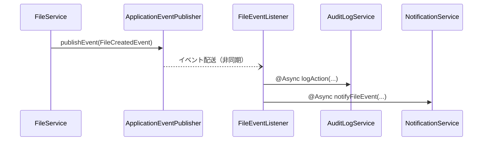

# ファイル管理機能 インターフェース定義

## 1. 概要

本ドキュメントでは、ファイル管理機能が提供するインターフェースと、外部システムからの依存インターフェースを定義します。これらのインターフェースは、ファイル管理機能を他のモジュールと統合するための主要な契約となります。Spring Frameworkの標準機能を活用し、効率的で拡張性の高いインターフェースを提供します。

## 2. 提供インターフェース（Spring標準機能統合）

### 2.1 FileService

Spring Framework標準機能を活用したファイル管理機能の主要なエントリポイントとなるサービスインターフェースです。

```java
@Service
public interface FileService {
    
    /**
     * ファイルをアップロードし、メタデータを返却します
     * 
     * @param file アップロードするファイル（Spring MVCのMultipartFile）
     * @param moduleCode 関連モジュールコード
     * @param entityId 関連エンティティID
     * @param attributes カスタム属性（オプション）
     * @return アップロードされたファイルのメタデータ
     * @throws AccessDeniedException 権限不足時
     * @throws FileValidationException バリデーション失敗時
     * @throws StorageException ストレージ操作エラー時
     */
    @PreAuthorize("hasAuthority('FILE_UPLOAD')")
    @Transactional
    FileMetadataDTO uploadFile(MultipartFile file, String moduleCode, String entityId,
                             Map<String, String> attributes);
    
    /**
     * ファイルをダウンロードします
     * 
     * @param id ファイルID
     * @return Spring Resourceとして表現されたファイルコンテンツ
     * @throws AccessDeniedException 権限不足時
     * @throws FileNotFoundException ファイル未検出時
     * @throws StorageException ストレージ操作エラー時
     */
    @PreAuthorize("hasPermission(#id, 'FILE', 'READ')")
    @Transactional(readOnly = true)
    Resource downloadFile(UUID id);
    
    /**
     * ファイルのメタデータを取得します
     * 
     * @param id ファイルID
     * @return ファイルメタデータ（Optional形式）
     * @throws AccessDeniedException 権限不足時
     */
    @PreAuthorize("hasPermission(#id, 'FILE', 'READ')")
    @Transactional(readOnly = true)
    @Cacheable(value = "fileMetadata", key = "#id")
    Optional<FileMetadataDTO> getFileMetadata(UUID id);
    
    /**
     * エンティティに関連付けられたファイルを検索します
     * 
     * @param moduleCode モジュールコード
     * @param entityId エンティティID
     * @return 関連ファイルのメタデータリスト
     * @throws AccessDeniedException 権限不足時
     */
    @PreAuthorize("hasAuthority('FILE_READ')")
    @Transactional(readOnly = true)
    List<FileMetadataDTO> findFilesByEntityReference(String moduleCode, String entityId);
    
    /**
     * 検索条件に基づいてファイルを検索します
     * 
     * @param criteria 検索条件
     * @param pageable ページネーション情報
     * @return 検索結果（ページング対応）
     * @throws AccessDeniedException 権限不足時
     */
    @PreAuthorize("hasAuthority('FILE_READ')")
    @Transactional(readOnly = true)
    Page<FileMetadataDTO> searchFiles(FileSearchSpecification criteria, Pageable pageable);
    
    /**
     * ファイルを論理削除します
     * 
     * @param id ファイルID
     * @throws AccessDeniedException 権限不足時
     * @throws FileNotFoundException ファイル未検出時
     */
    @PreAuthorize("hasPermission(#id, 'FILE', 'DELETE')")
    @Transactional
    @CacheEvict(value = "fileMetadata", key = "#id")
    void deleteFile(UUID id);
    
    /**
     * ファイルのカスタム属性を更新します
     * 
     * @param id ファイルID
     * @param attributes 更新する属性マップ
     * @return 更新されたファイルメタデータ
     * @throws AccessDeniedException 権限不足時
     * @throws FileNotFoundException ファイル未検出時
     */
    @PreAuthorize("hasPermission(#id, 'FILE', 'WRITE')")
    @Transactional
    @CachePut(value = "fileMetadata", key = "#id")
    FileMetadataDTO updateFileAttributes(UUID id, Map<String, String> attributes);
    
    /**
     * ファイルへのアクセス権限を付与します
     * 
     * @param id ファイルID
     * @param principalType 権限主体タイプ
     * @param principalId 権限主体ID
     * @param permission 権限種別
     * @param expiresAt 有効期限（オプション）
     * @return 付与された権限情報
     * @throws AccessDeniedException 権限不足時
     * @throws FileNotFoundException ファイル未検出時
     */
    @PreAuthorize("hasPermission(#id, 'FILE', 'ADMIN')")
    @Transactional
    FilePermissionDTO grantPermission(UUID id, PrincipalType principalType, 
                                   String principalId, PermissionType permission,
                                   @Nullable LocalDateTime expiresAt);
    
    /**
     * ファイルアクセス権限を削除します
     * 
     * @param permissionId 権限ID
     * @throws AccessDeniedException 権限不足時
     * @throws EntityNotFoundException 権限未検出時
     */
    @PreAuthorize("hasPermission(#permissionId, 'FILE_PERMISSION', 'DELETE')")
    @Transactional
    void revokePermission(UUID permissionId);
}
```

### 2.2 FileVersionService

Spring Frameworkの標準機能を活用したファイルのバージョン管理に関するサービスインターフェースです。

```java
@Service
public interface FileVersionService {
    
    /**
     * 新しいファイルバージョンを作成します
     * 
     * @param fileId ファイルID
     * @param file 新しいファイル内容（MultipartFile）
     * @param comment バージョンコメント（オプション）
     * @return 作成された新バージョンの情報
     * @throws AccessDeniedException 権限不足時
     * @throws FileNotFoundException ファイル未検出時
     * @throws StorageException ストレージ操作エラー時
     */
    @PreAuthorize("hasPermission(#fileId, 'FILE', 'WRITE')")
    @Transactional
    FileVersionDTO createNewVersion(UUID fileId, MultipartFile file, @Nullable String comment);
    
    /**
     * ファイルの特定バージョンを取得します
     * 
     * @param fileId ファイルID
     * @param versionNumber バージョン番号
     * @return 特定バージョンのファイル内容（Spring Resource）
     * @throws AccessDeniedException 権限不足時
     * @throws FileNotFoundException ファイル未検出時
     * @throws VersionNotFoundException バージョン未検出時
     */
    @PreAuthorize("hasPermission(#fileId, 'FILE', 'READ')")
    @Transactional(readOnly = true)
    Resource getVersion(UUID fileId, Integer versionNumber);
    
    /**
     * ファイルの全バージョン履歴を取得します
     * 
     * @param fileId ファイルID
     * @return バージョン履歴リスト
     * @throws AccessDeniedException 権限不足時
     * @throws FileNotFoundException ファイル未検出時
     */
    @PreAuthorize("hasPermission(#fileId, 'FILE', 'READ')")
    @Transactional(readOnly = true)
    @Cacheable(value = "fileVersions", key = "#fileId")
    List<FileVersionDTO> getVersionHistory(UUID fileId);
    
    /**
     * 指定されたバージョンにファイルを戻します
     * 
     * @param fileId ファイルID
     * @param versionNumber バージョン番号
     * @return 更新されたファイルメタデータ
     * @throws AccessDeniedException 権限不足時
     * @throws FileNotFoundException ファイル未検出時
     * @throws VersionNotFoundException バージョン未検出時
     */
    @PreAuthorize("hasPermission(#fileId, 'FILE', 'WRITE')")
    @Transactional
    @CacheEvict(value = {"fileMetadata", "fileVersions"}, key = "#fileId")
    FileMetadataDTO revertToVersion(UUID fileId, Integer versionNumber);
}
```

### 2.3 REST API エンドポイント（Spring MVC）

ファイル管理機能はSpring MVCを使用した以下のREST APIエンドポイントを提供します。

#### 2.3.1 ファイル基本操作API

```java
@RestController
@RequestMapping("/api/files")
@Validated
public class FileController {

    private final FileService fileService;
    
    @PostMapping(consumes = MediaType.MULTIPART_FORM_DATA_VALUE)
    @ResponseStatus(HttpStatus.CREATED)
    public FileMetadataDTO uploadFile(
            @RequestPart("file") MultipartFile file,
            @RequestParam("moduleCode") String moduleCode,
            @RequestParam("entityId") String entityId,
            @RequestParam(value = "attributes", required = false) Map<String, String> attributes) {
        return fileService.uploadFile(file, moduleCode, entityId, attributes);
    }
    
    @GetMapping("/{id}")
    public ResponseEntity<Resource> downloadFile(@PathVariable UUID id) {
        Resource resource = fileService.downloadFile(id);
        FileMetadataDTO metadata = fileService.getFileMetadata(id)
                .orElseThrow(() -> new FileNotFoundException(id));
        
        return ResponseEntity.ok()
                .contentType(MediaType.parseMediaType(metadata.getContentType()))
                .header(HttpHeaders.CONTENT_DISPOSITION, 
                       "attachment; filename=\"" + metadata.getFileName() + "\"")
                .body(resource);
    }
    
    @GetMapping("/{id}/metadata")
    public FileMetadataDTO getFileMetadata(@PathVariable UUID id) {
        return fileService.getFileMetadata(id)
                .orElseThrow(() -> new FileNotFoundException(id));
    }
    
    @PutMapping("/{id}/attributes")
    public FileMetadataDTO updateFileAttributes(
            @PathVariable UUID id,
            @RequestBody Map<String, String> attributes) {
        return fileService.updateFileAttributes(id, attributes);
    }
    
    @DeleteMapping("/{id}")
    @ResponseStatus(HttpStatus.NO_CONTENT)
    public void deleteFile(@PathVariable UUID id) {
        fileService.deleteFile(id);
    }
    
    @GetMapping("/search")
    public Page<FileMetadataDTO> searchFiles(
            @ModelAttribute FileSearchSpecification criteria,
            @PageableDefault(size = 20) Pageable pageable) {
        return fileService.searchFiles(criteria, pageable);
    }
}
```

#### 2.3.2 ファイルバージョン管理API

```java
@RestController
@RequestMapping("/api/files/{fileId}/versions")
@Validated
public class FileVersionController {

    private final FileVersionService fileVersionService;
    
    @PostMapping(consumes = MediaType.MULTIPART_FORM_DATA_VALUE)
    @ResponseStatus(HttpStatus.CREATED)
    public FileVersionDTO createNewVersion(
            @PathVariable UUID fileId,
            @RequestPart("file") MultipartFile file,
            @RequestParam(value = "comment", required = false) String comment) {
        return fileVersionService.createNewVersion(fileId, file, comment);
    }
    
    @GetMapping
    public List<FileVersionDTO> getVersionHistory(@PathVariable UUID fileId) {
        return fileVersionService.getVersionHistory(fileId);
    }
    
    @GetMapping("/{versionNumber}")
    public ResponseEntity<Resource> getVersion(
            @PathVariable UUID fileId,
            @PathVariable Integer versionNumber) {
        Resource resource = fileVersionService.getVersion(fileId, versionNumber);
        FileMetadataDTO metadata = fileVersionService.getVersionHistory(fileId)
                .stream()
                .filter(v -> v.getVersionNumber().equals(versionNumber))
                .findFirst()
                .map(v -> new FileMetadataDTO(/* ... */))
                .orElseThrow(() -> new VersionNotFoundException(fileId, versionNumber));
        
        return ResponseEntity.ok()
                .contentType(MediaType.parseMediaType(metadata.getContentType()))
                .header(HttpHeaders.CONTENT_DISPOSITION, 
                       "attachment; filename=\"" + metadata.getFileName() + "\"")
                .body(resource);
    }
    
    @PostMapping("/{versionNumber}/revert")
    public FileMetadataDTO revertToVersion(
            @PathVariable UUID fileId,
            @PathVariable Integer versionNumber) {
        return fileVersionService.revertToVersion(fileId, versionNumber);
    }
}
```

#### 2.3.3 ファイル権限管理API

```java
@RestController
@RequestMapping("/api/files")
@Validated
public class FilePermissionController {

    private final FileService fileService;
    
    @PostMapping("/{fileId}/permissions")
    @ResponseStatus(HttpStatus.CREATED)
    public FilePermissionDTO grantPermission(
            @PathVariable UUID fileId,
            @Valid @RequestBody FilePermissionRequestDTO request) {
        return fileService.grantPermission(
            fileId, 
            request.getPrincipalType(),
            request.getPrincipalId(),
            request.getPermission(),
            request.getExpiresAt()
        );
    }
    
    @GetMapping("/{fileId}/permissions")
    public List<FilePermissionDTO> getPermissions(@PathVariable UUID fileId) {
        // 権限一覧を取得する実装
        return filePermissionService.getFilePermissions(fileId);
    }
    
    @DeleteMapping("/permissions/{permissionId}")
    @ResponseStatus(HttpStatus.NO_CONTENT)
    public void revokePermission(@PathVariable UUID permissionId) {
        fileService.revokePermission(permissionId);
    }
}
```

## 3. DTOオブジェクト定義（Spring標準機能活用）

### 3.1 FileMetadataDTO

```java
@Data
@Builder
@NoArgsConstructor
@AllArgsConstructor
public class FileMetadataDTO implements Serializable {
    
    private UUID id;
    private String fileName;
    private String contentType;
    private Long fileSize;
    private String moduleCode;
    private String entityId;
    private String createdBy;
    
    @JsonFormat(pattern = "yyyy-MM-dd'T'HH:mm:ss.SSSXXX")
    private LocalDateTime createdAt;
    
    private String lastModifiedBy;
    
    @JsonFormat(pattern = "yyyy-MM-dd'T'HH:mm:ss.SSSXXX")
    private LocalDateTime lastModifiedAt;
    
    private Map<String, String> attributes;
    private Integer version;
    
    @JsonFormat(pattern = "yyyy-MM-dd'T'HH:mm:ss.SSSXXX")
    private LocalDateTime expiresAt;
}
```

### 3.2 FileDownloadDTO

```java
@Data
@Builder
@NoArgsConstructor
@AllArgsConstructor
public class FileDownloadDTO implements Serializable {
    
    private UUID id;
    private String fileName;
    private String contentType;
    private Long fileSize;
    
    @JsonIgnore // リソースはJSONシリアライズ対象外
    private Resource content;
}
```

### 3.3 FileSearchSpecification

```java
@Data
@Builder
@NoArgsConstructor
@AllArgsConstructor
public class FileSearchSpecification implements Specification<FileMetadata> {
    
    private String moduleCode;
    private String entityId;
    private String fileNamePattern;
    private List<String> contentTypes;
    private Long minSize;
    private Long maxSize;
    
    @DateTimeFormat(iso = DateTimeFormat.ISO.DATE_TIME)
    private LocalDateTime createdAfter;
    
    @DateTimeFormat(iso = DateTimeFormat.ISO.DATE_TIME)
    private LocalDateTime createdBefore;
    
    private Map<String, String> attributes;
    
    @Override
    public Predicate toPredicate(Root<FileMetadata> root, CriteriaQuery<?> query, 
                                 CriteriaBuilder criteriaBuilder) {
        List<Predicate> predicates = new ArrayList<>();
        
        // moduleCode条件
        if (StringUtils.hasText(moduleCode)) {
            predicates.add(criteriaBuilder.equal(root.get("moduleCode"), moduleCode));
        }
        
        // その他の条件を追加...
        
        // 論理削除されていないファイルのみ
        predicates.add(criteriaBuilder.equal(root.get("deleted"), false));
        
        return criteriaBuilder.and(predicates.toArray(new Predicate[0]));
    }
}
```

### 3.4 FileVersionDTO

```java
@Data
@Builder
@NoArgsConstructor
@AllArgsConstructor
public class FileVersionDTO implements Serializable {
    
    private UUID id;
    private UUID fileId;
    private Integer versionNumber;
    private Long fileSize;
    private String createdBy;
    
    @JsonFormat(pattern = "yyyy-MM-dd'T'HH:mm:ss.SSSXXX")
    private LocalDateTime createdAt;
    
    private String comment;
}
```

### 3.5 FilePermissionDTO

```java
@Data
@Builder
@NoArgsConstructor
@AllArgsConstructor
public class FilePermissionDTO implements Serializable {
    
    private UUID id;
    private UUID fileId;
    
    @NotNull
    private PrincipalType principalType;
    
    @NotBlank
    private String principalId;
    
    @NotNull
    private PermissionType permission;
    
    private String grantedBy;
    
    @JsonFormat(pattern = "yyyy-MM-dd'T'HH:mm:ss.SSSXXX")
    private LocalDateTime grantedAt;
    
    @JsonFormat(pattern = "yyyy-MM-dd'T'HH:mm:ss.SSSXXX")
    private LocalDateTime expiresAt;
}
```

### 3.6 FilePermissionRequestDTO

```java
@Data
@Builder
@NoArgsConstructor
@AllArgsConstructor
public class FilePermissionRequestDTO implements Serializable {
    
    @NotNull(message = "権限主体タイプは必須です")
    private PrincipalType principalType;
    
    @NotBlank(message = "権限主体IDは必須です")
    private String principalId;
    
    @NotNull(message = "権限種別は必須です")
    private PermissionType permission;
    
    private LocalDateTime expiresAt;
}
```

## 4. 依存インターフェース（Spring標準機能活用）

### 4.1 Spring Security認証・認可

```java
/**
 * Spring Securityを活用したファイルアクセス権限評価クラス
 */
@Component
public class FilePermissionEvaluator implements PermissionEvaluator {
    
    private final FilePermissionRepository permissionRepository;
    
    @Override
    public boolean hasPermission(Authentication authentication, 
                              Object targetDomainObject, 
                              Object permission) {
        // オブジェクトに対する権限チェック実装
        // ...
    }
    
    @Override
    public boolean hasPermission(Authentication authentication, 
                              Serializable targetId, 
                              String targetType, 
                              Object permission) {
        if (!(targetId instanceof UUID)) {
            return false;
        }
        
        UUID fileId = (UUID) targetId;
        String permissionStr = permission.toString();
        
        // 管理者は常に権限あり
        if (authentication.getAuthorities().stream()
                .anyMatch(a -> a.getAuthority().equals("ROLE_ADMIN"))) {
            return true;
        }
        
        // ファイル権限チェック
        if ("FILE".equals(targetType)) {
            UserDetails userDetails = (UserDetails) authentication.getPrincipal();
            String userId = userDetails.getUsername();
            
            return permissionRepository.existsByFileIdAndPrincipalTypeAndPrincipalIdAndPermission(
                fileId, PrincipalType.USER, userId, PermissionType.valueOf(permissionStr));
        }
        
        return false;
    }
}
```

### 4.2 Spring Events監査ログ

```java
/**
 * ファイル操作イベントリスナー
 */
@Component
@RequiredArgsConstructor
public class FileEventListener {

    private final AuditLogService auditLogService;
    
    /**
     * ファイル作成イベントの処理
     */
    @EventListener
    @Async
    public void handleFileCreatedEvent(FileCreatedEvent event) {
        auditLogService.logAction(
            event.getCreatedBy(),
            "FILE_CREATED",
            "FILE",
            event.getFileId().toString(),
            Map.of(
                "fileName", event.getFileName(),
                "moduleCode", event.getModuleCode(),
                "entityId", event.getEntityId()
            )
        );
    }
    
    /**
     * ファイルアクセスイベントの処理
     */
    @EventListener
    @Async
    public void handleFileAccessedEvent(FileAccessEvent event) {
        auditLogService.logAction(
            event.getUserId(),
            "FILE_" + event.getAccessType().name(),
            "FILE",
            event.getFileId().toString(),
            Map.of()
        );
    }
    
    // 他のイベントハンドラ...
}
```

### 4.3 Spring Resource抽象化

```java
/**
 * 拡張ストレージリソースローダー
 */
@Component
public class StorageResourceLoader implements ResourceLoader {

    private final ResourceLoader resourceLoader;
    private final Map<String, StorageProvider> storageProviders;
    
    public StorageResourceLoader(
            ApplicationContext applicationContext,
            Map<String, StorageProvider> storageProviders) {
        this.resourceLoader = applicationContext;
        this.storageProviders = storageProviders;
    }
    
    @Override
    public Resource getResource(String location) {
        if (location.startsWith("s3:")) {
            return storageProviders.get("s3").getResource(
                location.substring("s3:".length()));
        } else if (location.startsWith("azure:")) {
            return storageProviders.get("azure").getResource(
                location.substring("azure:".length()));
        }
        
        // デフォルトはSpringの標準リソースローダーを使用
        return resourceLoader.getResource(location);
    }
    
    @Override
    public ClassLoader getClassLoader() {
        return resourceLoader.getClassLoader();
    }
}
```

### 4.4 Spring ApplicationEventPublisher

```java
/**
 * ファイルイベント発行サービス
 */
@Service
@RequiredArgsConstructor
public class FileEventPublisher {

    private final ApplicationEventPublisher eventPublisher;
    
    /**
     * ファイル作成イベントを発行
     */
    public void publishFileCreatedEvent(FileMetadata metadata) {
        eventPublisher.publishEvent(new FileCreatedEvent(
            this,
            metadata.getId(),
            metadata.getFileName(),
            metadata.getModuleCode(),
            metadata.getEntityId(),
            metadata.getCreatedBy()
        ));
    }
    
    /**
     * ファイルアクセスイベントを発行
     */
    public void publishFileAccessedEvent(UUID fileId, String userId, FileAccessType accessType) {
        eventPublisher.publishEvent(new FileAccessEvent(this, fileId, userId, accessType));
    }
    
    // 他のイベント発行メソッド...
}
```

## 5. 例外定義（Spring標準機能統合）

### 5.1 FileServiceException

```java
/**
 * ファイル管理サービスの基本例外クラス
 */
public class FileServiceException extends RuntimeException {

    public FileServiceException(String message) {
        super(message);
    }
    
    public FileServiceException(String message, Throwable cause) {
        super(message, cause);
    }
}
```

### 5.2 FileNotFoundException

```java
/**
 * 指定されたファイルが見つからない場合に発生する例外
 */
public class FileNotFoundException extends FileServiceException {

    private final UUID fileId;
    
    public FileNotFoundException(UUID fileId) {
        super("ファイルが見つかりません: " + fileId);
        this.fileId = fileId;
    }
    
    public UUID getFileId() {
        return fileId;
    }
}
```

### 5.3 StorageException

```java
/**
 * ストレージ操作中にエラーが発生した場合に発生する例外
 */
public class StorageException extends FileServiceException {

    private final String storageReference;
    
    public StorageException(String message, String storageReference, Throwable cause) {
        super(message, cause);
        this.storageReference = storageReference;
    }
    
    public String getStorageReference() {
        return storageReference;
    }
}
```

### 5.4 Spring ExceptionHandler統合

```java
/**
 * ファイル管理機能の例外ハンドラ
 */
@RestControllerAdvice
public class FileExceptionHandler extends ResponseEntityExceptionHandler {

    /**
     * ファイル未検出例外ハンドラ
     */
    @ExceptionHandler(FileNotFoundException.class)
    public ResponseEntity<Object> handleFileNotFoundException(
            FileNotFoundException ex, WebRequest request) {
        
        ProblemDetail detail = ProblemDetail.forStatusAndDetail(
            HttpStatus.NOT_FOUND, ex.getMessage());
        detail.setType(URI.create("https://api.example.com/errors/file-not-found"));
        detail.setTitle("File Not Found");
        detail.setProperty("fileId", ex.getFileId());
        
        return handleExceptionInternal(ex, detail, new HttpHeaders(), 
                                      HttpStatus.NOT_FOUND, request);
    }
    
    /**
     * ストレージ例外ハンドラ
     */
    @ExceptionHandler(StorageException.class)
    public ResponseEntity<Object> handleStorageException(
            StorageException ex, WebRequest request) {
        
        ProblemDetail detail = ProblemDetail.forStatusAndDetail(
            HttpStatus.INTERNAL_SERVER_ERROR, ex.getMessage());
        detail.setType(URI.create("https://api.example.com/errors/storage-error"));
        detail.setTitle("Storage Operation Failed");
        
        return handleExceptionInternal(ex, detail, new HttpHeaders(), 
                                      HttpStatus.INTERNAL_SERVER_ERROR, request);
    }
    
    /**
     * アクセス拒否例外ハンドラ
     */
    @ExceptionHandler(AccessDeniedException.class)
    public ResponseEntity<Object> handleAccessDeniedException(
            AccessDeniedException ex, WebRequest request) {
        
        ProblemDetail detail = ProblemDetail.forStatusAndDetail(
            HttpStatus.FORBIDDEN, "指定されたリソースにアクセスする権限がありません");
        detail.setType(URI.create("https://api.example.com/errors/access-denied"));
        detail.setTitle("Access Denied");
        
        return handleExceptionInternal(ex, detail, new HttpHeaders(), 
                                      HttpStatus.FORBIDDEN, request);
    }
}
```

## 6. Spring Application Events

### 6.1 イベント一覧

| イベントクラス | 説明 | 主要属性 |
|----------|------|---------|
| FileCreatedEvent | ファイルが新規作成された | fileId, fileName, moduleCode, entityId, createdBy, timestamp |
| FileAccessEvent | ファイルがアクセスされた | fileId, userId, accessType, timestamp |
| FileUpdatedEvent | ファイルが更新された | fileId, userId, updatedFields, timestamp |
| FileDeletedEvent | ファイルが削除された | fileId, deletedBy, timestamp |
| FileVersionCreatedEvent | 新しいバージョンが作成された | fileId, versionNumber, createdBy, timestamp |
| FilePermissionGrantedEvent | ファイルに権限が付与された | fileId, permissionId, principalType, principalId, permission, timestamp |
| FilePermissionRevokedEvent | ファイルの権限が削除された | fileId, permissionId, timestamp |

### 6.2 イベント処理（Spring統合）

ファイル管理機能内のイベントは、以下のSpring Frameworkのイベント機能を使用して処理されます：

1. ApplicationEventPublisherによるイベント発行
2. @EventListenerアノテーションによるイベントハンドリング
3. @TransactionalEventListenerによるトランザクション連動イベント処理
4. @Asyncアノテーションによる非同期イベント処理



## 7. Spring Transaction管理

### 7.1 トランザクション制御

| 操作 | Springトランザクション設定 | 備考 |
|-----|-------------------|---------------|
| ファイルアップロード | @Transactional | メタデータの保存とイベント発行を一貫して処理 |
| ファイルダウンロード | @Transactional(readOnly = true) | 読み取り専用トランザクションで処理 |
| ファイル削除 | @Transactional | メタデータの更新とイベント発行を一貫して処理 |
| 新バージョン作成 | @Transactional | バージョン情報の保存と元ファイルの更新を一貫して処理 |
| 権限管理 | @Transactional | 権限エンティティの作成/削除を一貫して処理 |

### 7.2 分散トランザクション（Spring対応）

ファイル管理機能はSpring Frameworkとストレージの統合パターンを活用して、以下のように複数リソースにまたがる処理を実現します：

#### ファイルアップロード処理（Try-Confirm-Cancel）

```java
/**
 * トランザクション連動イベントとTCCパターンを組み合わせた実装例
 */
@Service
@RequiredArgsConstructor
public class FileStorageServiceImpl implements FileStorageService {

    private final FileMetadataRepository fileRepository;
    private final StorageProvider storageProvider;
    private final ApplicationEventPublisher eventPublisher;
    
    @Override
    @Transactional
    public FileMetadata saveFile(MultipartFile file, String moduleCode, String entityId) {
        // 1. 一時ストレージにファイルを保存（Try）
        StorageReference tempRef = storageProvider.saveTempFile(file);
        
        try {
            // 2. メタデータを作成・保存
            FileMetadata metadata = createMetadata(file, moduleCode, entityId, tempRef);
            FileMetadata savedMetadata = fileRepository.save(metadata);
            
            // 3. トランザクション完了後にストレージ操作を確定（Confirm）
            eventPublisher.publishEvent(new FileStorageConfirmEvent(this, tempRef, savedMetadata));
            
            return savedMetadata;
        } catch (Exception e) {
            // エラー時、一時ファイルを削除（Cancel）
            eventPublisher.publishEvent(new FileStorageCancelEvent(this, tempRef));
            throw e;
        }
    }
    
    /**
     * トランザクション完了後にストレージ操作を確定
     */
    @TransactionalEventListener(phase = TransactionPhase.AFTER_COMMIT)
    @Async
    public void handleStorageConfirm(FileStorageConfirmEvent event) {
        // 一時ファイルを確定（永続化）
        storageProvider.confirmFile(event.getTempRef(), event.getMetadata());
    }
    
    /**
     * トランザクション失敗時に一時ファイルを削除
     */
    @TransactionalEventListener(phase = TransactionPhase.AFTER_ROLLBACK)
    @Async
    public void handleStorageCancel(FileStorageCancelEvent event) {
        // 一時ファイルを削除
        storageProvider.cleanupTempFile(event.getTempRef());
    }
}
```

## 8. Spring Boot統合の非機能要件

### 8.1 性能要件（Spring最適化）

| 操作 | 性能要件 | Spring実装戦略 |
|-----|---------|-----------|
| ファイルアップロード | 50MB未満のファイルを5秒以内に処理 | CommonsMultipartResolver設定、WebClient非同期アップロード |
| ファイルダウンロード | 50MB未満のファイルを3秒以内に開始 | ResourceHttpMessageConverter、HttpRange対応 |
| メタデータ検索 | 95%のクエリを500ms以内に応答 | Spring Data JPA最適化クエリ、@Cacheable |
| 同時アクセス | 100並列アクセスをサポート | Spring WebMVCスレッドプール、コネクションプール設定 |

### 8.2 セキュリティ要件（Spring Security）

| 要件 | Spring Security実装方法 |
|-----|---------|
| アクセス制御 | @PreAuthorize/@PostAuthorize、カスタムPermissionEvaluator、メソッドセキュリティ |
| データ保護 | EncryptionUtils、TLS設定(@ConfigurationProperties)、Content-Security-Policy |
| 監査 | @EventListener + Spring AOP、ApplicationEventPublisher |
| 入力検証 | @Validated、Spring Validator、Bean Validation API |
| マルウェア対策 | カスタムMultipartResolverによる事前バリデーション |

### 8.3 可用性要件（Spring実装）

| 要件 | Spring実装方法 |
|-----|---------|
| 可用性 | SpringのHealth指標、Actuator Endpoints、Micrometer |
| 障害復旧 | Resilience4j（Circuit Breaker）、@Retryable |
| データ冗長性 | Spring Batch処理、@Scheduled、Spring Cloud Stream |
| 縮退運転 | Spring Cloud Circuit Breaker、Fallback Factories |

## 9. Spring Boot Controller Examples

### 9.1 ファイルアップロード例（Spring MVC）

```java
@RestController
@RequestMapping("/api/files")
public class FileController {

    private final FileService fileService;
    
    /**
     * ファイルアップロードのエンドポイント
     */
    @PostMapping(consumes = MediaType.MULTIPART_FORM_DATA_VALUE)
    public ResponseEntity<FileMetadataDTO> uploadFile(
            @RequestPart("file") MultipartFile file,
            @RequestParam("moduleCode") String moduleCode,
            @RequestParam("entityId") String entityId,
            @RequestParam(value = "attributes", required = false) String attributesJson) {
        
        Map<String, String> attributes = Collections.emptyMap();
        if (StringUtils.hasText(attributesJson)) {
            try {
                attributes = new ObjectMapper().readValue(attributesJson, 
                    new TypeReference<Map<String, String>>() {});
            } catch (Exception e) {
                throw new InvalidRequestException("Invalid attributes format", e);
            }
        }
        
        FileMetadataDTO metadata = fileService.uploadFile(file, moduleCode, entityId, attributes);
        
        return ResponseEntity.status(HttpStatus.CREATED)
                 .body(metadata);
    }
}
```

### 9.2 ファイル検索例（Spring Data JPA + Specification）

```java
@RestController
@RequestMapping("/api/files")
public class FileSearchController {

    private final FileService fileService;
    
    /**
     * ファイル検索エンドポイント
     */
    @GetMapping("/search")
    public ResponseEntity<Page<FileMetadataDTO>> searchFiles(
            @RequestParam(required = false) String moduleCode,
            @RequestParam(required = false) String entityId,
            @RequestParam(required = false) String fileNamePattern,
            @RequestParam(required = false) List<String> contentTypes,
            @RequestParam(required = false) Long minSize,
            @RequestParam(required = false) Long maxSize,
            @RequestParam(required = false) 
                @DateTimeFormat(iso = DateTimeFormat.ISO.DATE_TIME) LocalDateTime createdAfter,
            @RequestParam(required = false) 
                @DateTimeFormat(iso = DateTimeFormat.ISO.DATE_TIME) LocalDateTime createdBefore,
            @PageableDefault(size = 20, sort = "createdAt", direction = Sort.Direction.DESC) 
                Pageable pageable) {
        
        FileSearchSpecification criteria = FileSearchSpecification.builder()
            .moduleCode(moduleCode)
            .entityId(entityId)
            .fileNamePattern(fileNamePattern)
            .contentTypes(contentTypes)
            .minSize(minSize)
            .maxSize(maxSize)
            .createdAfter(createdAfter)
            .createdBefore(createdBefore)
            .build();
        
        Page<FileMetadataDTO> results = fileService.searchFiles(criteria, pageable);
        
        return ResponseEntity.ok(results);
    }
}
```

## 10. Spring Boot Integration

### 10.1 Spring Boot自動構成

```java
@Configuration
@EnableJpaRepositories(basePackages = "com.example.sesmgr.filemanagement.repository")
@EnableTransactionManagement
@EnableCaching
@EnableAsync
@EnableScheduling
@PropertySource("classpath:file-management.properties")
public class FileManagementAutoConfiguration {

    /**
     * ファイルストレージ設定プロパティ
     */
    @Bean
    @ConfigurationProperties(prefix = "file-management.storage")
    public FileStorageProperties fileStorageProperties() {
        return new FileStorageProperties();
    }
    
    /**
     * 適切なストレージプロバイダを提供するファクトリー
     */
    @Bean
    @ConditionalOnMissingBean
    public StorageProviderFactory storageProviderFactory(
            FileStorageProperties properties) {
        return new StorageProviderFactoryImpl(properties);
    }
    
    /**
     * キャッシュマネージャー設定
     */
    @Bean
    @ConditionalOnMissingBean
    public CacheManager cacheManager() {
        SimpleCacheManager cacheManager = new SimpleCacheManager();
        List<ConcurrentMapCache> caches = new ArrayList<>();
        caches.add(new ConcurrentMapCache("fileMetadata"));
        caches.add(new ConcurrentMapCache("fileVersions"));
        cacheManager.setCaches(caches);
        return cacheManager;
    }
    
    /**
     * 非同期タスク実行設定
     */
    @Bean
    public Executor fileTaskExecutor() {
        ThreadPoolTaskExecutor executor = new ThreadPoolTaskExecutor();
        executor.setCorePoolSize(5);
        executor.setMaxPoolSize(10);
        executor.setQueueCapacity(25);
        executor.setThreadNamePrefix("FileAsync-");
        executor.initialize();
        return executor;
    }
}
```

### 10.2 Spring Boot Application Properties

```properties
# ファイル管理機能の設定
file-management.storage.type=local
file-management.storage.local.base-directory=/data/files
file-management.storage.local.temp-directory=/data/temp
file-management.storage.max-file-size=50MB
file-management.storage.allowed-types=application/pdf,image/jpeg,image/png,application/msword,application/vnd.openxmlformats-officedocument.wordprocessingml.document

# S3設定（プロファイル: prod）
file-management.storage.type=s3
file-management.storage.s3.bucket=sesmgr-files
file-management.storage.s3.region=ap-northeast-1
file-management.storage.s3.base-prefix=files/
file-management.storage.s3.presigned-url-expiration=15m

# キャッシュ設定
spring.cache.cache-names=fileMetadata,fileVersions
spring.cache.caffeine.spec=maximumSize=500,expireAfterWrite=10m

# 非同期処理設定
spring.task.execution.pool.core-size=5
spring.task.execution.pool.max-size=10
spring.task.execution.pool.queue-capacity=25
spring.task.execution.thread-name-prefix=FileAsync-

# マルチパートファイル設定
spring.servlet.multipart.max-file-size=50MB
spring.servlet.multipart.max-request-size=50MB
spring.servlet.multipart.enabled=true
```

### 10.3 Spring Clientサンプル

```java
/**
 * FileServiceのCLIENT側実装
 */
@Service
@RequiredArgsConstructor
public class FileServiceClient {

    private final RestTemplate restTemplate;
    private final String baseUrl;
    
    /**
     * ファイルをアップロードする
     */
    public FileMetadataDTO uploadFile(
            File file, String moduleCode, String entityId, 
            Map<String, String> attributes) throws IOException {
        
        // リクエスト作成
        MultiValueMap<String, Object> body = new LinkedMultiValueMap<>();
        body.add("file", new FileSystemResource(file));
        body.add("moduleCode", moduleCode);
        body.add("entityId", entityId);
        
        if (attributes != null && !attributes.isEmpty()) {
            body.add("attributes", new ObjectMapper().writeValueAsString(attributes));
        }
        
        HttpHeaders headers = new HttpHeaders();
        headers.setContentType(MediaType.MULTIPART_FORM_DATA);
        
        HttpEntity<MultiValueMap<String, Object>> requestEntity = 
            new HttpEntity<>(body, headers);
        
        // POSTリクエスト実行
        ResponseEntity<FileMetadataDTO> response = restTemplate.exchange(
            baseUrl + "/files",
            HttpMethod.POST,
            requestEntity,
            FileMetadataDTO.class
        );
        
        return response.getBody();
    }
    
    /**
     * ファイルをダウンロードする
     */
    public ResponseEntity<Resource> downloadFile(UUID fileId) {
        return restTemplate.getForEntity(
            baseUrl + "/files/{id}",
            Resource.class,
            fileId
        );
    }
}
```