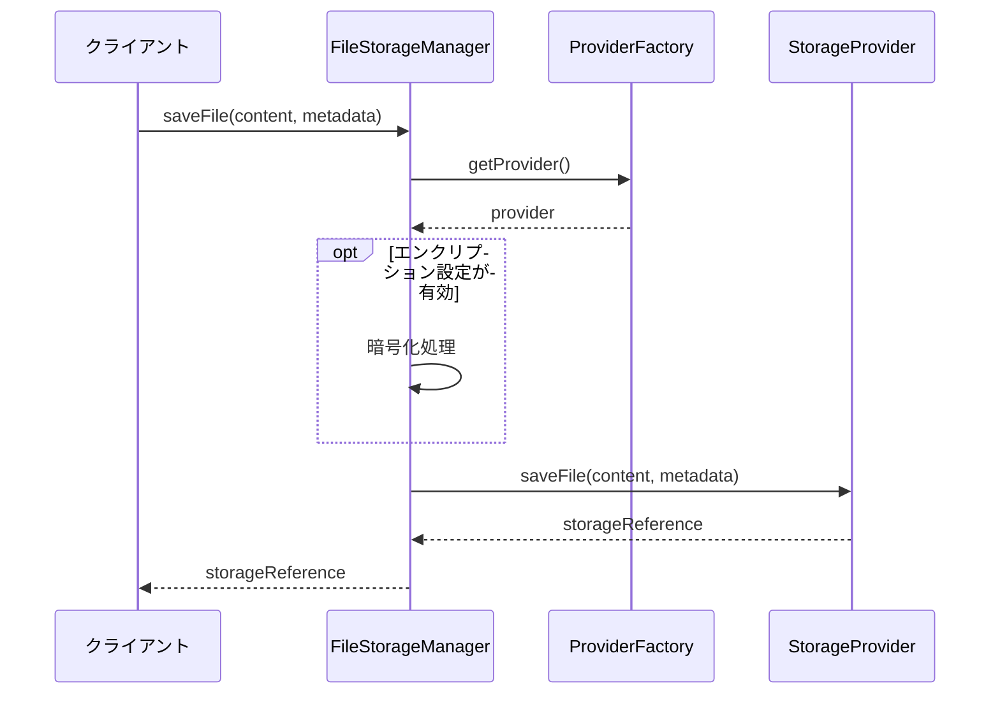
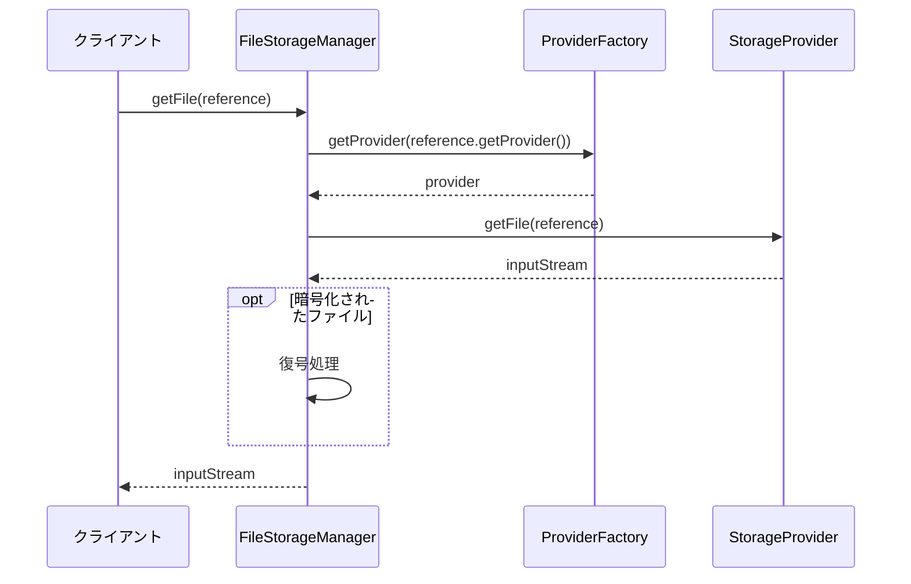
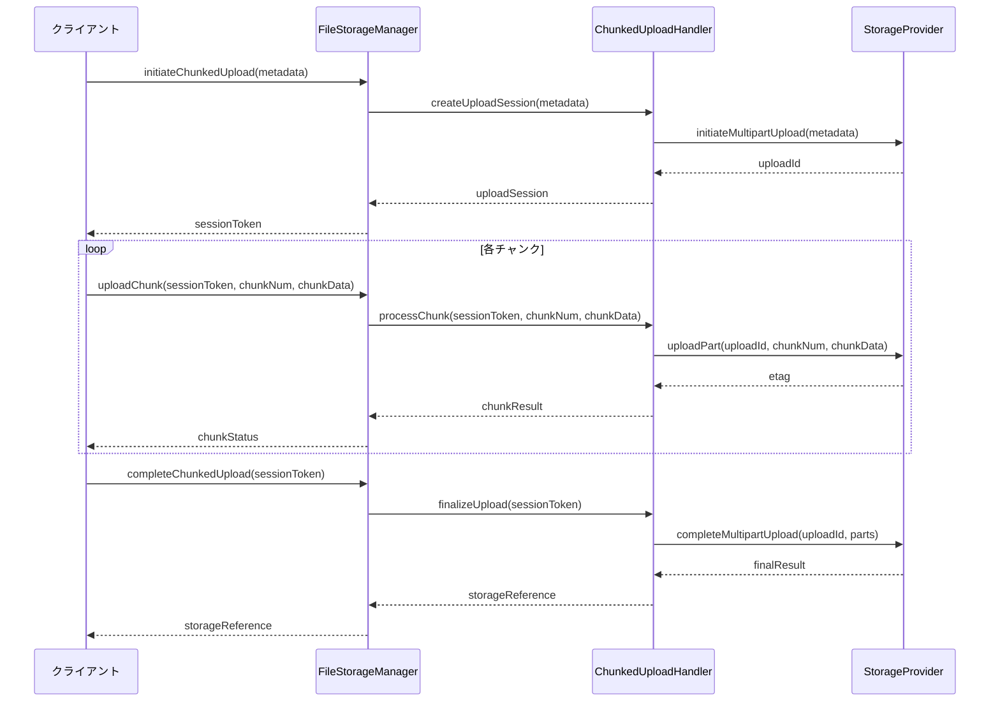
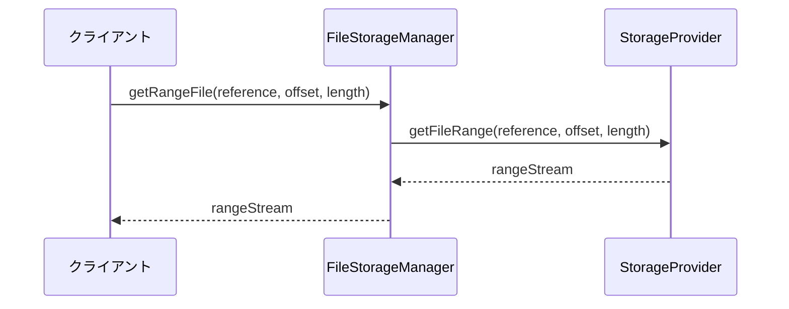

# ファイルストレージ管理

## 1. 概要

ファイルストレージ管理は、物理的なファイルの保存と取得を担当するコンポーネントです。このドキュメントでは、ファイルの物理的な保存、取得、削除などの低レベル操作に関する詳細設計を定義します。

開発環境や本番環境など、異なる環境で異なるストレージ技術を使用できるよう、ストレージプロバイダは抽象化されています。これにより、ローカルファイルシステム、AmazonS3、Azure Blob Storageなど、様々なストレージバックエンドを透過的に切り替えることが可能になります。

## 2. 設計方針

ファイルストレージ管理コンポーネントは、以下の設計方針に基づいています：

1. **ストレージ抽象化**: 具体的なストレージ技術に依存しない抽象インターフェースを提供
2. **透過的な切り替え**: 異なるストレージプロバイダ間の透過的な切り替えをサポート
3. **拡張性**: 新しいストレージプロバイダの追加が容易
4. **セキュリティ**: データの暗号化と安全な転送をサポート
5. **効率性**: 大きなファイルの効率的な処理（ストリーミング、チャンキングなど）
6. **信頼性**: 耐障害性とデータ整合性の保証

## 3. コンポーネント構成

ファイルストレージ管理は、以下のコンポーネントで構成されます：

```
FileStorageManager
├── StorageProviderFactory (ストレージプロバイダファクトリ)
├── StorageProvider (抽象ストレージプロバイダ)
│   ├── LocalStorageProvider (ローカルファイルシステム実装)
│   ├── S3StorageProvider (Amazon S3実装)
│   └── AzureBlobStorageProvider (Azure Blob Storage実装)
├── StorageConfiguration (ストレージ設定)
├── StorageEncryptionService (暗号化サービス)
└── StorageHealthChecker (ストレージ状態確認)
```

## 4. ストレージプロバイダインターフェース

すべてのストレージプロバイダ実装の基礎となる抽象インターフェースです。StorageProviderインターフェースは、ファイルの保存、取得、削除などの基本操作をカプセル化し、異なるストレージ技術への透過的なアクセスを可能にします。具体的な実装では、各ストレージサービス（ローカルファイルシステム、S3、Azure）に対応したコード実装が提供されます。

### 主要メソッド

- **saveFile**: ファイルコンテンツとメタデータを受け取り、ストレージに保存
- **getFile**: ストレージ参照からファイルコンテンツを取得
- **deleteFile**: 指定したファイルをストレージから削除
- **getMetadata**: ファイルのメタデータを取得
- **copyFile**: ファイルをストレージ内でコピー
- **exists**: ファイルの存在確認
- **generateSignedUrl**: 一時的な署名付きURLを生成（対応プロバイダのみ）
- **getType**: プロバイダの種類を取得
- **isHealthy**: プロバイダの状態を確認

## 5. ストレージプロバイダの実装

### 5.1 LocalStorageProvider

ローカルファイルシステムを使用したストレージプロバイダ実装です。主に開発環境やテスト環境で使用されます。

#### 5.1.1 構成

```
LocalStorageProvider
├── baseDirectory: ファイル保存のベースディレクトリ
├── tempDirectory: 一時ファイル用ディレクトリ
└── metadataDirectory: メタデータ保存用ディレクトリ
```

#### 5.1.2 ファイル格納構造

```
{baseDirectory}/
├── {moduleCode}/
│   ├── {yyyy-MM-dd}/
│   │   ├── {fileId1}
│   │   ├── {fileId2}
│   │   └── ...
│   └── ...
└── ...
```

#### 5.1.3 キー実装ポイント

- ファイルパスはUUIDベースで生成し、元のファイル名との関連はメタデータで管理
- モジュールとタイムスタンプに基づくディレクトリ構造で管理し、ファイル検索を容易化
- ローカルでのファイル衝突を防ぐため、一意のIDでファイルを保存
- 大きなファイルはストリーミング処理

### 5.2 S3StorageProvider

Amazon S3を使用したストレージプロバイダ実装です。主に本番環境や大規模環境で使用されます。

#### 5.2.1 構成

```
S3StorageProvider
├── s3Client: AWS S3クライアント
├── bucketName: ストレージに使用するバケット名
├── region: AWSリージョン
└── basePrefix: オブジェクトキーのベースプレフィックス
```

#### 5.2.2 オブジェクトキー構造

```
{basePrefix}/{moduleCode}/{yyyy-MM-dd}/{fileId}
```

#### 5.2.3 キー実装ポイント

- マルチパートアップロードで大きなファイルを効率的に処理
- S3のタグ機能を使用してメタデータを保存
- Transfer Managerを使用して転送効率を最適化
- 署名付きURLを生成して直接アクセスをサポート
- サーバーサイド暗号化を適用してデータを保護

### 5.3 AzureBlobStorageProvider

Microsoft Azure Blob Storageを使用したストレージプロバイダ実装です。

#### 5.3.1 構成

```
AzureBlobStorageProvider
├── blobServiceClient: Azure Blob Serviceクライアント
├── containerName: BLOBコンテナ名
└── basePrefix: BLOBのベースプレフィックス
```

#### 5.3.2 BLOBパス構造

```
{basePrefix}/{moduleCode}/{yyyy-MM-dd}/{fileId}
```

#### 5.3.3 キー実装ポイント

- ブロックBLOBを使用して大きなファイルをアップロード
- Azureのメタデータ機能を使用して付加情報を保存
- SASトークンを生成して直接アクセスをサポート
- Azure Key Vaultと統合して暗号化キーを保護

## 6. ストレージリファレンス

ストレージプロバイダに依存しない形式でファイルの参照情報を表す値オブジェクトです。このクラスはファイルへの抽象的な参照を提供し、物理的な保存場所の詳細を隠蔽します。

### 主要属性

- **provider**: ストレージプロバイダの種類を示す識別子（"local", "s3", "azure"など）
- **location**: プロバイダ固有の場所情報（ローカルパス、S3バケット名、Azureコンテナ名など）
- **identifier**: プロバイダ内でファイルを識別するための一意の値（ファイルパス、オブジェクトキー、BLOBパスなど）

## 7. ストレージメタデータ

ファイルの保存時に使用されるメタデータ情報を表す値オブジェクトです。このクラスはファイルの説明的情報を保持し、ストレージリファレンスと組み合わせて使用されます。

### 主要属性

- **id**: ファイルの一意識別子
- **originalFilename**: 元のファイル名
- **contentType**: コンテンツタイプ（MIMEタイプ）
- **contentLength**: ファイルサイズ（バイト）
- **moduleCode**: 関連モジュールコード
- **createdBy**: 作成者ID
- **attributes**: 追加属性のマップ
- **encrypted**: 暗号化フラグ

## 8. ストレージプロバイダファクトリ

適切なストレージプロバイダを生成し、管理するためのファクトリークラスです。設定に基づいて適切なストレージプロバイダを選択し、提供します。

### 主要機能

- **getProvider**: 指定されたタイプのストレージプロバイダを取得
- **getDefaultProvider**: デフォルトのストレージプロバイダを取得（設定に基づく）

## 9. 処理フロー

### 9.1 ファイルアップロードフロー



### 9.2 ファイルダウンロードフロー



## 10. 暗号化サービス

必要に応じてファイルコンテンツを暗号化/復号するサービスです。このコンポーネントは、機密性の高いファイルデータの保護を担当します。

### 主要機能

- **encrypt**: ファイル内容を暗号化する
- **decrypt**: 暗号化されたファイル内容を復号する
- **shouldEncrypt**: 暗号化が必要かどうかを判断する

### 10.1 暗号化の実装方式

- **対象性暗号**: AES-256-GCMを使用
- **鍵管理**: 環境ごとに適切な鍵管理（開発環境: 設定ファイル、本番環境: AWS KMS / Azure Key Vaultなど）
- **ストリーミング暗号化**: 大きなファイルでもメモリ効率よく処理

### 10.2 暗号化制御方針

以下の条件に基づいて暗号化の必要性を判断します：

1. ファイルの機密度（メタデータの属性に基づく）
2. モジュール固有の要件（特定のモジュールでは常に暗号化など）
3. ファイルタイプ（特定のタイプは常に暗号化など）
4. グローバル設定（すべてのファイルを暗号化するポリシーなど）

## 11. チャンク処理

大きなファイルを効率的に処理するためのチャンク処理の仕組みです。

### 11.1 マルチパートアップロード



### 11.2 レンジダウンロード



## 12. ストレージヘルスチェック

ストレージシステムの状態を監視し、問題を検出するためのヘルスチェック機能です。

### 12.1 ヘルスチェック内容

- **接続確認**: ストレージサービスへの接続状態確認
- **書き込みテスト**: 小さなテストファイルの書き込み/読み取り/削除テスト
- **容量チェック**: 利用可能な容量の確認（該当する場合）
- **パフォーマンスチェック**: 応答時間の測定

### 12.2 ヘルスチェック機能

StorageHealthCheckerコンポーネントは、すべてのストレージプロバイダまたは特定のプロバイダの状態を監視し、問題を早期に検出するための機能を提供します。主な機能には以下が含まれます：

- 全プロバイダのヘルスチェック実行
- 特定プロバイダのヘルスチェック実行
- ヘルスチェック結果のレポート生成

## 13. ファイルパス管理

各ストレージプロバイダで一貫したファイルパス/キー管理を行うためのユーティリティです。

### 13.1 パス生成機能

StoragePathGeneratorコンポーネントは、ファイルID、モジュールコード、作成日時などの情報に基づいて一貫したパス構造を生成します。これにより、異なるストレージプロバイダ間でも同じパス生成ルールを適用できます。主な機能：

- 標準ファイルパスの生成
- バージョン管理されたファイルパスの生成

### 13.2 パス解析機能

StoragePathParserコンポーネントは、ストレージパスを解析して、その構成要素（モジュールコード、日付、ファイルIDなど）を抽出します。これにより、パス文字列からメタデータ情報を再構築できます。

## 14. 設定パラメータ

ファイルストレージ管理の動作を制御する主な設定パラメータです。

### 14.1 共通設定

```yaml
file-storage:
  default-provider: local  # デフォルトプロバイダ (local, s3, azure)
  encryption:
    enabled: true          # 暗号化有効フラグ
    algorithm: AES-256-GCM # 暗号化アルゴリズム
  chunk:
    enabled: true          # チャンク処理有効フラグ
    size: 5242880          # チャンクサイズ (5MB)
  temp-dir: /tmp/file-storage # 一時ディレクトリ
```

### 14.2 ローカルストレージ設定

```yaml
file-storage:
  local:
    base-directory: /data/files    # 基本ディレクトリ
    metadata-directory: /data/metadata # メタデータディレクトリ
```

### 14.3 S3ストレージ設定

```yaml
file-storage:
  s3:
    bucket: sesmgr-files          # S3バケット名
    region: ap-northeast-1        # AWSリージョン
    base-prefix: files/           # キープレフィックス
    server-side-encryption: true  # サーバーサイド暗号化
    presigned-url:
      enabled: true               # 署名付きURL有効フラグ
      expiration-minutes: 15      # 有効期限（分）
```

### 14.4 Azureストレージ設定

```yaml
file-storage:
  azure:
    container: sesmgr-files       # BLOBコンテナ名
    base-prefix: files/           # BLOBプレフィックス
    connection-string: ${AZURE_STORAGE_CONNECTION_STRING} # 接続文字列
```

## 15. エラー処理

### 15.1 例外階層

```
StorageException (基本例外)
├── StorageConnectionException (接続エラー)
├── StorageAuthenticationException (認証エラー)
├── StorageOperationException (操作エラー)
│   ├── StorageReadException (読み取りエラー)
│   ├── StorageWriteException (書き込みエラー)
│   └── StorageDeleteException (削除エラー)
├── StorageQuotaExceededException (容量超過エラー)
└── StorageConfigurationException (設定エラー)
```

### 15.2 リトライ戦略

以下のようなリトライ戦略を実装します：

1. **一時的なエラー**: 指数バックオフ方式でリトライ（最大3回）
2. **接続エラー**: 短いタイムアウトで初回試行、その後2回リトライ
3. **スロットリングエラー**: より長いバックオフ時間でリトライ
4. **回復不能エラー**: リトライせずに即時失敗

## 16. 監視とロギング

### 16.1 監視メトリクス

以下のメトリクスを監視します：

- **処理数**: アップロード/ダウンロード/削除の処理数
- **処理時間**: 各操作の平均処理時間
- **処理サイズ**: 処理されたファイルの合計/平均サイズ
- **エラー率**: 操作失敗率
- **容量使用率**: ストレージ容量使用状況
- **キャッシュヒット率**: キャッシュの効率（該当する場合）

### 16.2 ロギング

以下のイベントをログ記録します：

- **操作ログ**: 各ファイル操作（INFO）
- **エラーログ**: 処理エラー（ERROR/WARN）
- **セキュリティログ**: 暗号化/復号処理（INFO）
- **パフォーマンスログ**: 処理時間（DEBUG）

## 17. パフォーマンス最適化

### 17.1 キャッシュ戦略

StorageCacheコンポーネントは、頻繁にアクセスされるファイルをメモリ内にキャッシュし、ストレージ操作のパフォーマンスを向上させます。主な機能には以下が含まれます：

- ファイルコンテンツのキャッシュへの追加
- キャッシュからのファイル取得
- キャッシュエントリの無効化

### 17.2 スレッドプール管理

StorageThreadPoolManagerコンポーネントは、複数のファイル操作を並行して効率的に処理するためのスレッドプールを管理します。設定可能なパラメータにより、ワークロードに応じたリソース割り当てを最適化できます。

設定例:

```yaml
file-storage:
  thread-pool:
    core-size: 10        # コアスレッド数
    max-size: 50         # 最大スレッド数
    queue-capacity: 100  # キューサイズ
    keep-alive: 60       # アイドルスレッド保持時間（秒）
```

## 18. テスト戦略

### 18.1 単体テスト

各ストレージプロバイダの実装をモックを使用して単体テストします。

### 18.2 統合テスト

テスト用のストレージ環境を使用して統合テストを実施します：

- LocalStorageProvider: テスト用一時ディレクトリ
- S3StorageProvider: MinIO（S3互換サービス）
- AzureBlobStorageProvider: Azurite（Azureエミュレーター）

### 18.3 性能テスト

様々なサイズのファイルでパフォーマンステストを実施し、以下の指標を測定します：

- 処理スループット（ファイル数/秒）
- 転送速度（MB/秒）
- 並列処理能力
- メモリ使用量

## 19. 拡張性と互換性

### 19.1 新ストレージプロバイダの追加

新しいストレージプロバイダを追加するための最小実装手順：

1. StorageProvider インターフェースの実装
2. StorageReference 変換ロジックの実装
3. プロバイダ固有の設定パラメータの定義
4. StorageProviderFactory への登録

### 19.2 バージョン互換性

ストレージリファレンス形式の変更がある場合、下位互換性を保持するための戦略：

- レガシーリファレンス形式の検出と変換機能
- 複数バージョンのリファレンス形式のサポート
- マイグレーションツールの提供

## 20. セキュリティ考慮事項

### 20.1 アクセス制御

- 適切な認証情報管理（環境変数、シークレット管理など）
- 最小権限の原則に基づくアクセス権限設定
- ストレージリソースへの直接アクセスの制限

### 20.2 データ保護

- 転送中の暗号化（TLS）
- 保存時の暗号化（AES-256）
- 機密データのストレージ分離

### 20.3 監査とコンプライアンス

- 重要なファイル操作の監査記録
- 保存ポリシーの強制（保持期間など）
- 規制要件に準拠したデータ処理

## 21. 変更履歴

| バージョン | 日付 | 変更者 | 変更内容 |
|----------|------|-------|----------|
| 0.1 | 2023-08-10 | 開発チーム | 初版作成 |
| 0.2 | 2023-09-15 | 開発チーム | 暗号化機能の追加 |
| 0.3 | 2023-11-20 | 開発チーム | チャンク処理の詳細追加 |
| 0.4 | 2025-05-10 | Claude | 実装コードを削除し、設計情報のみに修正 |