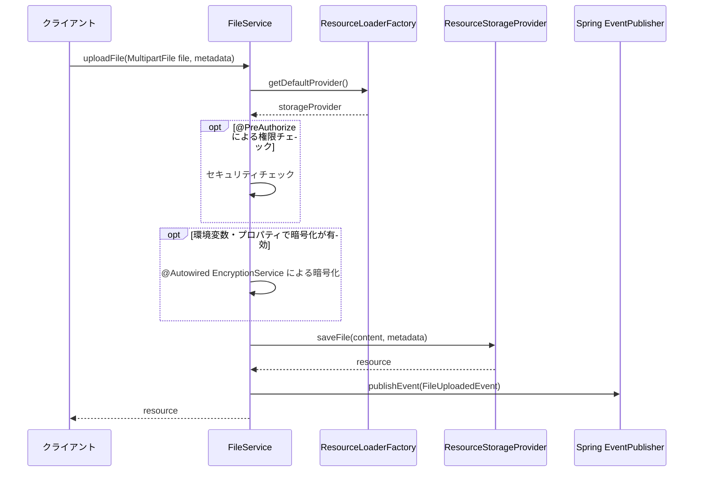
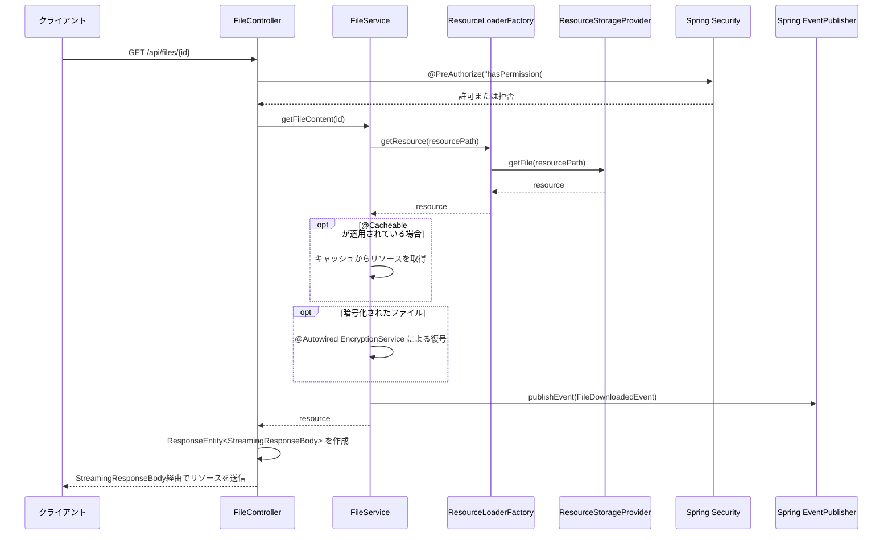
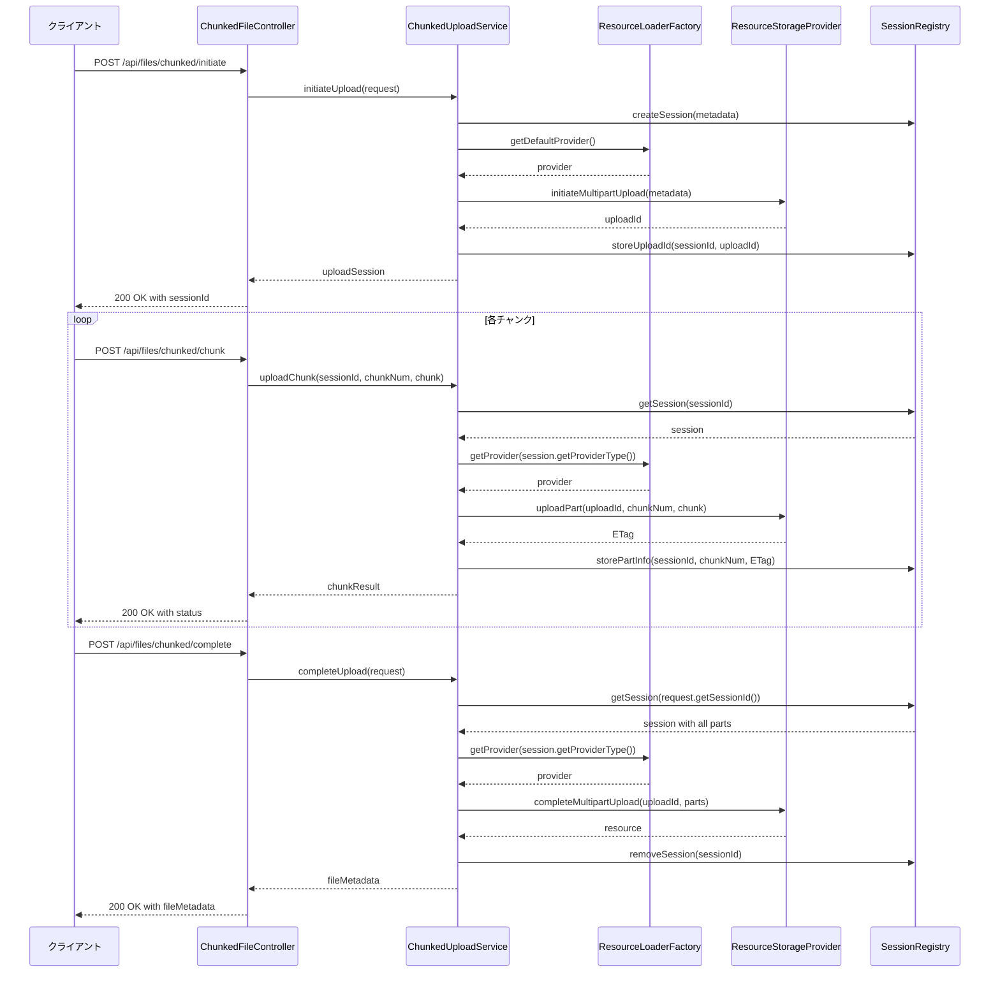
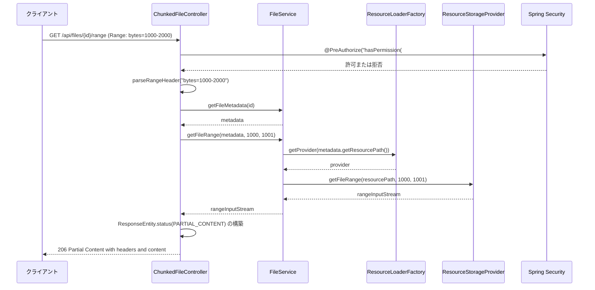

# ファイルストレージ管理

## 1. 概要

ファイルストレージ管理は、物理的なファイルの保存と取得を担当するコンポーネントです。このドキュメントでは、ファイルの物理的な保存、取得、削除などの低レベル操作に関する詳細設計を定義します。

Spring Frameworkの標準機能（特にResource抽象化）を活用することで、開発環境や本番環境など、異なる環境で異なるストレージ技術を使用できるよう、ストレージプロバイダは抽象化されています。これにより、ローカルファイルシステム、AmazonS3、Azure Blob Storageなど、様々なストレージバックエンドを透過的に切り替えることが可能になります。

## 2. 設計方針

ファイルストレージ管理コンポーネントは、以下の設計方針に基づいています：

1. **Spring Resourceの活用**: Spring Frameworkが提供するResource抽象化を活用
2. **透過的な切り替え**: Spring ResourceLoaderの仕組みを使って異なるストレージプロバイダ間の透過的な切り替えをサポート
3. **拡張性**: Spring Bootの自動構成機能を活用した新しいストレージプロバイダの追加が容易
4. **セキュリティ**: Spring Securityと連携したデータの暗号化と安全な転送をサポート
5. **効率性**: Spring WebのStreamingResponseBodyを利用した大きなファイルの効率的な処理
6. **信頼性**: Spring Transactionと連携した耐障害性とデータ整合性の保証

## 3. コンポーネント構成

ファイルストレージ管理は、以下のSpring標準機能を活用したコンポーネントで構成されます：

```
FileStorageManager
├── ResourceLoaderFactory (@Configuration)
├── ResourceStorageProvider (@Service)
│   ├── FileSystemResourceStorageProvider (ローカルファイルシステム実装)
│   ├── S3ResourceStorageProvider (Amazon S3実装)
│   └── AzureBlobResourceStorageProvider (Azure Blob Storage実装)
├── StorageProperties (@ConfigurationProperties)
├── StorageEncryptionService (@Service)
└── StorageHealthIndicator (@Component)
```

## 4. ストレージプロバイダインターフェース

Spring FrameworkのResource抽象化を拡張したResourceStorageProviderインターフェースを使用します。このインターフェースは、ファイルの保存、取得、削除などの基本操作をカプセル化し、Spring Resourceパターンを活用して異なるストレージ技術への透過的なアクセスを可能にします。具体的な実装では、各ストレージサービス（ローカルファイルシステム、S3、Azure）に対応したResource実装とともに提供されます。

### 主要メソッド

```java
@Service
public interface ResourceStorageProvider {
    /**
     * ファイルコンテンツとメタデータを受け取り、ストレージに保存する
     */
    Resource saveFile(InputStream content, FileMetadata metadata);
    
    /**
     * リソースパスからファイルコンテンツを取得する
     */
    Resource getFile(String location);
    
    /**
     * 指定したファイルをストレージから削除する
     */
    void deleteFile(String location);
    
    /**
     * ファイルの存在確認を行う
     */
    boolean exists(String location);
    
    /**
     * ファイルのメタデータを取得する
     */
    @Nullable
    Map<String, String> getMetadata(String location);
    
    /**
     * ファイルをストレージ内でコピーする
     */
    Resource copyFile(String sourceLocation, String targetLocation);
    
    /**
     * 一時的な署名付きURLを生成する（対応プロバイダのみ）
     */
    @Nullable
    URI generateSignedUri(String location, Duration expiration);
    
    /**
     * このプロバイダがサポートするリソースプレフィックスを返す
     * （例: "file:", "s3:", "azure:"）
     */
    String getResourcePrefix();
    
    /**
     * プロバイダの状態確認
     */
    boolean isHealthy();
}
```

Spring ResourceとResourceLoaderを活用することで、`classpath:`, `file:`, `http:`, `s3:`, `azure:` などの各種プロトコルを統一的に扱うことができます。

## 5. ストレージプロバイダの実装

### 5.1 FileSystemResourceStorageProvider

Spring の FileSystemResource と PathResourceを活用したローカルファイルシステムのストレージプロバイダ実装です。主に開発環境やテスト環境で使用されます。

#### 5.1.1 構成

```java
@Service
@ConditionalOnProperty(name = "file-storage.default-provider", havingValue = "local", matchIfMissing = true)
public class FileSystemResourceStorageProvider implements ResourceStorageProvider {
    private final Path baseDirectory;
    private final Path tempDirectory; 
    private final ResourcePatternResolver resourceResolver;
    
    @Autowired
    public FileSystemResourceStorageProvider(
            StorageProperties properties,
            ResourcePatternResolver resourceResolver) {
        this.baseDirectory = Paths.get(properties.getLocal().getBaseDirectory());
        this.tempDirectory = Paths.get(properties.getLocal().getTempDirectory());
        this.resourceResolver = resourceResolver;
        
        // ディレクトリ構造の初期化
        initializeDirectories();
    }
    
    // 各メソッドの実装...
}
```

#### 5.1.2 ファイル格納構造

```
{baseDirectory}/
├── {moduleCode}/
│   ├── {yyyy-MM-dd}/
│   │   ├── {fileId1}
│   │   ├── {fileId2}
│   │   └── ...
│   └── ...
└── ...
```

#### 5.1.3 キー実装ポイント

- Spring の FileSystemResource を活用して統一的なリソース操作を実現
- @ConditionalOnProperty アノテーションによる条件付き自動構成
- Spring の ResourcePatternResolver を用いたファイル検索と操作
- Spring WebのStreamingResponseBody を利用した大きなファイルのストリーミング処理
- 例外処理は Spring の階層化された例外モデルに統合

### 5.2 S3ResourceStorageProvider

Spring CloudのAWS S3サポートを活用したAmazon S3のストレージプロバイダ実装です。主に本番環境や大規模環境で使用されます。

#### 5.2.1 構成

```java
@Service
@ConditionalOnProperty(name = "file-storage.default-provider", havingValue = "s3")
@ConditionalOnClass(S3Resource.class)
public class S3ResourceStorageProvider implements ResourceStorageProvider {
    private final AmazonS3 s3Client;
    private final String bucketName;
    private final String basePrefix;
    private final ResourceLoader resourceLoader;
    
    @Autowired
    public S3ResourceStorageProvider(
            AmazonS3 s3Client,
            StorageProperties properties,
            ResourceLoader resourceLoader) {
        this.s3Client = s3Client;
        this.bucketName = properties.getS3().getBucket();
        this.basePrefix = properties.getS3().getBasePrefix();
        this.resourceLoader = resourceLoader;
    }
    
    // 各メソッドの実装...
}
```

#### 5.2.2 オブジェクトキー構造

```
{basePrefix}/{moduleCode}/{yyyy-MM-dd}/{fileId}
```

#### 5.2.3 キー実装ポイント

- Spring Cloud AWS の S3Resource を活用した統一的なリソース操作
- Spring Boot の自動構成による条件付きコンポーネント登録
- Spring IO 抽象化による効率的なストリーム操作
- AWS SDK と Spring の統合によるサーバーサイド暗号化の適用
- AOP によるリクエスト/レスポンス処理の集中管理

### 5.3 AzureBlobResourceStorageProvider

Spring Cloud Azure の Blob Storage サポートを活用した Azure Blob Storage のストレージプロバイダ実装です。

#### 5.3.1 構成

```java
@Service
@ConditionalOnProperty(name = "file-storage.default-provider", havingValue = "azure")
@ConditionalOnClass(BlobResource.class)
public class AzureBlobResourceStorageProvider implements ResourceStorageProvider {
    private final BlobServiceClient blobServiceClient;
    private final String containerName;
    private final String basePrefix;
    private final ResourceLoader resourceLoader;
    
    @Autowired
    public AzureBlobResourceStorageProvider(
            BlobServiceClient blobServiceClient,
            StorageProperties properties,
            ResourceLoader resourceLoader) {
        this.blobServiceClient = blobServiceClient;
        this.containerName = properties.getAzure().getContainer();
        this.basePrefix = properties.getAzure().getBasePrefix();
        this.resourceLoader = resourceLoader;
    }
    
    // 各メソッドの実装...
}
```

#### 5.3.2 BLOBパス構造

```
{basePrefix}/{moduleCode}/{yyyy-MM-dd}/{fileId}
```

#### 5.3.3 キー実装ポイント

- Spring Cloud Azure の BlobResource を活用した統一的なリソース操作
- Spring Boot の自動構成による条件付きコンポーネント登録
- Azure SDK と Spring の統合によるストリーム処理の最適化
- Key Vault との統合による暗号化キー管理
- Spring AOP と Azure イベント通知の連携

## 6. ストレージリファレンス

Spring の Resource インターフェースを拡張し、ストレージプロバイダに依存しない形式でファイルの参照情報を表す値オブジェクトです。このクラスはファイルへの抽象的な参照を提供し、物理的な保存場所の詳細を隠蔽します。

```java
@Value
public class StorageResource implements Resource {
    private final Resource delegate;
    private final String resourcePath;
    private final String providerType;
    
    // Resource インターフェースの実装（デリゲーション）
    @Override
    public boolean exists() {
        return delegate.exists();
    }
    
    @Override
    public URL getURL() throws IOException {
        return delegate.getURL();
    }
    
    @Override
    public URI getURI() throws IOException {
        return delegate.getURI();
    }
    
    @Override
    public File getFile() throws IOException {
        return delegate.getFile();
    }
    
    @Override
    public InputStream getInputStream() throws IOException {
        return delegate.getInputStream();
    }
    
    // 追加機能
    public String getResourcePath() {
        return resourcePath;
    }
    
    public String getProviderType() {
        return providerType;
    }
    
    // Static ファクトリメソッド
    public static StorageResource fromResourceLocation(String resourceLocation, ResourceLoader resourceLoader) {
        Resource resource = resourceLoader.getResource(resourceLocation);
        String providerType = extractProviderType(resourceLocation);
        return new StorageResource(resource, resourceLocation, providerType);
    }
}
```

### 主要属性

- **delegate**: 実際のリソース操作を委譲するSpring Resource実装
- **resourcePath**: リソースへのパス文字列（例: "file:/data/files/module1/2023-05-15/12345.pdf"）
- **providerType**: ストレージプロバイダの種類を示す識別子（"file", "s3", "azure"など）

Spring のResourceLoaderインターフェースと組み合わせることで、統一的なリソース参照が可能になります。

## 7. ストレージメタデータ

Spring の Core および Jackson サポートを活用したメタデータ情報を表す値オブジェクトです。このクラスはファイルの説明的情報を保持し、StorageResource と組み合わせて使用されます。

```java
@Value
@JsonIgnoreProperties(ignoreUnknown = true)
public class FileMetadata {
    @JsonProperty("id")
    private final UUID id;
    
    @JsonProperty("originalFilename")
    private final String originalFilename;
    
    @JsonProperty("contentType")
    private final MediaType contentType;
    
    @JsonProperty("contentLength")
    private final long contentLength;
    
    @JsonProperty("moduleCode")
    private final String moduleCode;
    
    @JsonProperty("entityId")
    private final String entityId;
    
    @JsonProperty("createdBy")
    private final String createdBy;
    
    @JsonProperty("createdAt")
    @JsonFormat(shape = JsonFormat.Shape.STRING, pattern = "yyyy-MM-dd'T'HH:mm:ss.SSSZ")
    private final Instant createdAt;
    
    @JsonProperty("attributes")
    private final Map<String, String> attributes;
    
    @JsonProperty("encrypted")
    private final boolean encrypted;
    
    @JsonProperty("checksum")
    private final String checksum;
    
    @JsonProperty("checksumAlgorithm")
    private final String checksumAlgorithm;
    
    // ビルダーパターンの実装
    public static Builder builder() {
        return new Builder();
    }
    
    public static class Builder {
        // ビルダーの実装...
    }
    
    // Spring MVCのMultipartFileからメタデータを生成するユーティリティメソッド
    public static FileMetadata fromMultipartFile(MultipartFile file, String moduleCode, 
                                               String entityId, String username,
                                               Map<String, String> attributes) {
        // 実装...
    }
}
```

### 主要属性

- **id**: ファイルの一意識別子（UUID）
- **originalFilename**: 元のファイル名
- **contentType**: Spring のMediaTypeを利用したコンテンツタイプ（MIMEタイプ）
- **contentLength**: ファイルサイズ（バイト）
- **moduleCode**: 関連モジュールコード
- **entityId**: 関連エンティティID
- **createdBy**: 作成者ID
- **createdAt**: Spring の Instant を使用した作成日時
- **attributes**: 追加属性のマップ
- **encrypted**: 暗号化フラグ
- **checksum**: チェックサム値
- **checksumAlgorithm**: チェックサムアルゴリズム

Spring Bootの@ConfigurationPropertiesとJacksonサポートにより、メタデータの型安全な取り扱いが可能です。

## 8. リソースローダーファクトリ

Spring の ResourceLoader 抽象化を活用し、適切なストレージプロバイダにアクセスするためのファクトリークラスです。@Configuration と Spring Boot の自動構成機能を使用して実装されます。

```java
@Configuration
@EnableConfigurationProperties(StorageProperties.class)
public class ResourceLoaderFactory implements ApplicationContextAware {
    private ApplicationContext applicationContext;
    private final StorageProperties properties;
    private final Map<String, ResourceStorageProvider> providers;
    
    @Autowired
    public ResourceLoaderFactory(StorageProperties properties, 
                                List<ResourceStorageProvider> providerList) {
        this.properties = properties;
        this.providers = providerList.stream()
            .collect(Collectors.toMap(
                ResourceStorageProvider::getResourcePrefix,
                provider -> provider
            ));
    }
    
    @Override
    public void setApplicationContext(ApplicationContext applicationContext) {
        this.applicationContext = applicationContext;
    }
    
    /**
     * 指定されたリソースパスに対応するストレージプロバイダを取得
     */
    public ResourceStorageProvider getProvider(String resourcePath) {
        String prefix = extractPrefix(resourcePath);
        return providers.getOrDefault(prefix, getDefaultProvider());
    }
    
    /**
     * デフォルトのストレージプロバイダを取得
     */
    public ResourceStorageProvider getDefaultProvider() {
        String defaultType = properties.getDefaultProvider();
        return providers.getOrDefault(defaultType, 
            providers.values().stream().findFirst()
                .orElseThrow(() -> new IllegalStateException("No storage providers available")));
    }
    
    /**
     * 指定されたパスのリソースを読み込む
     */
    public Resource getResource(String location) {
        ResourceStorageProvider provider = getProvider(location);
        return provider.getFile(location);
    }
    
    /**
     * パターンに一致するリソースを検索
     */
    public Resource[] getResources(String locationPattern) throws IOException {
        // プレフィックスに応じたリソース検索の実装
        return applicationContext.getResources(locationPattern);
    }
}
```

### 主要機能

- **getProvider**: 指定されたパスのプレフィックスに対応するストレージプロバイダを取得
- **getDefaultProvider**: 設定に基づくデフォルトのストレージプロバイダを取得
- **getResource**: 特定のリソースパスからリソースを取得（Spring ResourceLoaderに準拠）
- **getResources**: パターンに一致するリソースを検索（Spring ResourcePatternResolverに準拠）

Spring のリソース抽象化を最大限に活用することで、様々なストレージプロバイダを透過的に扱うことができます。

## 9. 処理フロー

### 9.1 ファイルアップロードフロー



### 9.2 ファイルダウンロードフロー



## 10. 暗号化サービス

Spring Security の暗号化サポートを活用し、必要に応じてファイルコンテンツを暗号化/復号するサービスです。このコンポーネントは、機密性の高いファイルデータの保護を担当します。

```java
@Service
@ConditionalOnProperty(name = "file-storage.encryption.enabled", havingValue = "true")
public class StorageEncryptionService {
    private final CryptoUtils cryptoUtils;
    private final KeyProvider keyProvider;
    private final StorageProperties properties;
    
    @Autowired
    public StorageEncryptionService(
            CryptoUtils cryptoUtils,
            KeyProvider keyProvider,
            StorageProperties properties) {
        this.cryptoUtils = cryptoUtils;
        this.keyProvider = keyProvider;
        this.properties = properties;
    }
    
    /**
     * ファイル内容を暗号化する
     */
    public InputStream encrypt(InputStream content, FileMetadata metadata) {
        if (!shouldEncrypt(metadata)) {
            return content;
        }
        
        SecretKey key = keyProvider.getKey();
        return cryptoUtils.encryptStream(content, key);
    }
    
    /**
     * 暗号化されたファイル内容を復号する
     */
    public InputStream decrypt(InputStream encryptedContent, FileMetadata metadata) {
        if (!metadata.isEncrypted()) {
            return encryptedContent;
        }
        
        SecretKey key = keyProvider.getKey();
        return cryptoUtils.decryptStream(encryptedContent, key);
    }
    
    /**
     * 暗号化が必要かどうかを判断する
     */
    public boolean shouldEncrypt(FileMetadata metadata) {
        // グローバル設定
        if (!properties.getEncryption().isEnabled()) {
            return false;
        }
        
        // モジュール固有の要件
        if (properties.getEncryption().getAlwaysEncryptModules().contains(metadata.getModuleCode())) {
            return true;
        }
        
        // ファイルタイプによる判断
        String contentType = metadata.getContentType().toString();
        if (properties.getEncryption().getAlwaysEncryptContentTypes().stream()
                .anyMatch(contentType::startsWith)) {
            return true;
        }
        
        // メタデータの属性に基づく判断
        return metadata.getAttributes().containsKey("confidential") && 
               "true".equalsIgnoreCase(metadata.getAttributes().get("confidential"));
    }
}
```

### 主要機能

- **encrypt**: Spring Security の暗号化機能を使ってファイル内容を暗号化する
- **decrypt**: Spring Security の復号機能を使って暗号化されたファイル内容を復号する
- **shouldEncrypt**: Spring の条件評価を使って暗号化が必要かどうかを判断する

### 10.1 暗号化の実装方式

- **Spring Security Crypto**: Spring Security の `CryptoUtils` を活用した実装
- **対象性暗号**: AES-256-GCMを使用（Spring Security がサポート）
- **鍵管理**: 環境ごとに適切な鍵管理
  - 開発環境: Spring Boot プロパティ
  - 本番環境: Spring Cloud Vault / AWS KMS / Azure Key Vault の統合
- **ストリーミング暗号化**: Spring の IoUtils による大きなファイルのメモリ効率の良い処理

### 10.2 暗号化制御方針

Spring の @ConditionalOnProperty や SpEL 式を使い、以下の条件に基づいて暗号化の必要性を判断します：

1. ファイルの機密度（@ConfigurationProperties でマッピングされたメタデータの属性に基づく）
2. モジュール固有の要件（@Value("${file-storage.encryption.always-encrypt-modules}")）
3. ファイルタイプ（Spring の MediaType 判定を利用）
4. グローバル設定（Spring Boot の環境変数やプロパティファイル経由）

## 11. チャンク処理

Spring MVC とSpring WebFlux を活用した大きなファイルを効率的に処理するためのチャンク処理の仕組みです。

```java
@RestController
@RequestMapping("/api/files/chunked")
public class ChunkedFileController {
    
    private final ChunkedUploadService uploadService;
    
    @Autowired
    public ChunkedFileController(ChunkedUploadService uploadService) {
        this.uploadService = uploadService;
    }
    
    @PostMapping("/initiate")
    @PreAuthorize("hasAuthority('FILE_UPLOAD')")
    public ResponseEntity<ChunkedUploadSession> initiateUpload(
            @RequestBody InitiateChunkedUploadRequest request) {
        ChunkedUploadSession session = uploadService.initiateUpload(request);
        return ResponseEntity.ok(session);
    }
    
    @PostMapping("/chunk")
    @PreAuthorize("hasAuthority('FILE_UPLOAD')")
    public ResponseEntity<ChunkUploadResult> uploadChunk(
            @RequestParam("sessionId") String sessionId,
            @RequestParam("chunkNumber") int chunkNumber,
            @RequestPart("chunk") MultipartFile chunk) {
        ChunkUploadResult result = uploadService.uploadChunk(sessionId, chunkNumber, chunk);
        return ResponseEntity.ok(result);
    }
    
    @PostMapping("/complete")
    @PreAuthorize("hasAuthority('FILE_UPLOAD')")
    public ResponseEntity<FileMetadataDTO> completeUpload(
            @RequestBody CompleteChunkedUploadRequest request) {
        FileMetadataDTO metadata = uploadService.completeUpload(request);
        return ResponseEntity.ok(metadata);
    }
    
    @GetMapping("/{id}/range")
    @PreAuthorize("hasPermission(#id, 'FILE', 'READ')")
    public ResponseEntity<StreamingResponseBody> downloadFileRange(
            @PathVariable("id") UUID id,
            @RequestHeader(value = "Range", required = false) String rangeHeader) {
        
        // Range ヘッダー解析
        HttpRange range = parseRangeHeader(rangeHeader);
        
        // ファイルメタデータ取得
        FileMetadata metadata = uploadService.getFileMetadata(id);
        
        // レンジリクエスト対応のレスポンス作成
        StreamingResponseBody responseBody = outputStream -> {
            try (InputStream inputStream = uploadService.getFileRange(
                    metadata, range.getRangeStart(metadata.getContentLength()), 
                    range.getRangeLength(metadata.getContentLength()))) {
                FileCopyUtils.copy(inputStream, outputStream);
            }
        };
        
        return ResponseEntity.status(HttpStatus.PARTIAL_CONTENT)
                .contentType(metadata.getContentType())
                .header(HttpHeaders.CONTENT_DISPOSITION, 
                        ContentDisposition.attachment()
                            .filename(metadata.getOriginalFilename())
                            .build().toString())
                .header(HttpHeaders.ACCEPT_RANGES, "bytes")
                .header(HttpHeaders.CONTENT_RANGE, 
                        String.format("bytes %d-%d/%d", 
                                range.getRangeStart(metadata.getContentLength()),
                                range.getRangeEnd(metadata.getContentLength()),
                                metadata.getContentLength()))
                .body(responseBody);
    }
}
```

### 11.1 マルチパートアップロード



### 11.2 レンジダウンロード



Spring MVC のStreamingResponseBodyを使用することで、大きなファイルをメモリに展開せずにストリーミング処理が可能です。また、Spring WebのHttpRangeクラスを使って効率的なRange Requestの処理を実現しています。

## 12. ストレージヘルスチェック

Spring Boot Actuator を活用したストレージシステムの状態監視と問題検出機能です。

```java
@Component
public class StorageHealthIndicator implements HealthIndicator {
    
    private final List<ResourceStorageProvider> storageProviders;
    private final StorageProperties properties;
    
    @Autowired
    public StorageHealthIndicator(
            List<ResourceStorageProvider> storageProviders,
            StorageProperties properties) {
        this.storageProviders = storageProviders;
        this.properties = properties;
    }
    
    @Override
    public Health health() {
        Map<String, Status> providerStatus = new HashMap<>();
        boolean allHealthy = true;
        
        for (ResourceStorageProvider provider : storageProviders) {
            String providerType = provider.getResourcePrefix();
            Status status;
            
            try {
                boolean healthy = checkProviderHealth(provider);
                status = healthy ? Status.UP : Status.DOWN;
                
                if (!healthy) {
                    allHealthy = false;
                }
            } catch (Exception e) {
                status = Status.DOWN;
                allHealthy = false;
            }
            
            providerStatus.put(providerType, status);
        }
        
        if (allHealthy) {
            return Health.up()
                    .withDetails(providerStatus)
                    .build();
        } else {
            return Health.down()
                    .withDetails(providerStatus)
                    .build();
        }
    }
    
    private boolean checkProviderHealth(ResourceStorageProvider provider) {
        try {
            // プロバイダのヘルスチェック
            boolean connectionOk = provider.isHealthy();
            if (!connectionOk) {
                return false;
            }
            
            // 書き込みテスト (設定で有効な場合)
            if (properties.getHealth().isWriteTestEnabled()) {
                return performWriteTest(provider);
            }
            
            return true;
        } catch (Exception e) {
            return false;
        }
    }
    
    private boolean performWriteTest(ResourceStorageProvider provider) {
        // テストファイル作成と削除のテスト実装
        // ...
        return true;
    }
}
```

### 12.1 ヘルスチェック内容

- **接続確認**: Spring Boot Actuator の Health API を使用したストレージサービスへの接続状態確認
- **書き込みテスト**: Spring Resource 抽象化を使用した小さなテストファイルの書き込み/読み取り/削除テスト
- **容量チェック**: Spring の ResourceLoader を使用した利用可能な容量の確認（該当する場合）
- **パフォーマンスチェック**: Spring の StopWatch を使用した応答時間の測定
- **指標収集**: Spring Boot Actuator の Metrics を使用したストレージパフォーマンス指標の収集

### 12.2 ヘルスチェック機能

Spring Boot の Actuator を活用した StorageHealthIndicator コンポーネントは、すべてのストレージプロバイダまたは特定のプロバイダの状態を監視し、問題を早期に検出するための機能を提供します。主な機能には以下が含まれます：

- Spring Boot Actuator の /actuator/health エンドポイントでのヘルスチェック結果の公開
- @Scheduled アノテーションを使用した定期的なヘルスチェックの実行
- Spring の ApplicationEventPublisher を使用したヘルスステータス変更の通知
- Spring Boot Admin との統合によるダッシュボード表示

```java
@Configuration
@ConditionalOnProperty(name = "file-storage.health.enabled", havingValue = "true", matchIfMissing = true)
public class StorageHealthConfiguration {
    
    @Bean
    public StorageHealthIndicator storageHealthIndicator(
            List<ResourceStorageProvider> providers,
            StorageProperties properties) {
        return new StorageHealthIndicator(providers, properties);
    }
    
    @Bean
    @ConditionalOnProperty(name = "file-storage.health.scheduled-check.enabled", havingValue = "true")
    public StorageHealthScheduler storageHealthScheduler(
            StorageHealthIndicator healthIndicator,
            ApplicationEventPublisher eventPublisher,
            StorageProperties properties) {
        return new StorageHealthScheduler(healthIndicator, eventPublisher, properties);
    }
}
```

## 13. ファイルパス管理

Spring の ResourceUtils および UriTemplate を活用した各ストレージプロバイダで一貫したファイルパス/キー管理を行うためのユーティリティです。

```java
@Component
public class ResourcePathUtils {
    
    private final StorageProperties properties;
    
    @Autowired
    public ResourcePathUtils(StorageProperties properties) {
        this.properties = properties;
    }
    
    /**
     * ファイルメタデータからリソースパスを生成する
     */
    public String generatePath(FileMetadata metadata, String providerType) {
        String basePattern = getBasePattern(providerType);
        Map<String, Object> variables = new HashMap<>();
        
        variables.put("moduleCode", metadata.getModuleCode());
        variables.put("date", DateTimeFormatter.ofPattern("yyyy-MM-dd")
                .format(metadata.getCreatedAt()));
        variables.put("id", metadata.getId().toString());
        
        return new UriTemplate(basePattern).expand(variables).toString();
    }
    
    /**
     * バージョン管理されたリソースパスを生成する
     */
    public String generateVersionedPath(FileMetadata metadata, int version, String providerType) {
        String basePattern = getBasePattern(providerType);
        Map<String, Object> variables = new HashMap<>();
        
        variables.put("moduleCode", metadata.getModuleCode());
        variables.put("date", DateTimeFormatter.ofPattern("yyyy-MM-dd")
                .format(metadata.getCreatedAt()));
        variables.put("id", metadata.getId().toString());
        variables.put("version", version);
        
        return new UriTemplate(basePattern + "_v{version}").expand(variables).toString();
    }
    
    /**
     * リソースパスからメタデータ情報を抽出する
     */
    public Map<String, String> extractMetadataFromPath(String resourcePath) {
        String providerType = extractProviderType(resourcePath);
        String basePattern = getBasePattern(providerType);
        
        UriTemplate template = new UriTemplate(basePattern);
        Map<String, String> extracted = new HashMap<>();
        
        if (template.matches(resourcePath)) {
            Map<String, String> variables = template.match(resourcePath);
            extracted.putAll(variables);
        }
        
        // バージョン情報の抽出
        Pattern versionPattern = Pattern.compile("_v(\\d+)$");
        Matcher matcher = versionPattern.matcher(resourcePath);
        if (matcher.find()) {
            extracted.put("version", matcher.group(1));
        }
        
        return extracted;
    }
    
    /**
     * プロバイダタイプに基づくベースパターンを取得する
     */
    private String getBasePattern(String providerType) {
        switch (providerType) {
            case "file":
                return "file:{baseDirectory}/{moduleCode}/{date}/{id}";
            case "s3":
                return "s3://{bucketName}/{basePrefix}/{moduleCode}/{date}/{id}";
            case "azure":
                return "azure://{containerName}/{basePrefix}/{moduleCode}/{date}/{id}";
            default:
                throw new IllegalArgumentException("Unsupported provider type: " + providerType);
        }
    }
    
    /**
     * リソースパスからプロバイダタイプを抽出する
     */
    public static String extractProviderType(String resourcePath) {
        if (ResourceUtils.isUrl(resourcePath)) {
            try {
                URI uri = new URI(resourcePath);
                return uri.getScheme();
            } catch (URISyntaxException e) {
                throw new IllegalArgumentException("Invalid resource path: " + resourcePath, e);
            }
        } else {
            return "file";
        }
    }
}
```

### 13.1 パス生成機能

Spring のUriTemplateを活用したResourcePathUtilsコンポーネントは、ファイルID、モジュールコード、作成日時などの情報に基づいて一貫したパス構造を生成します。これにより、異なるストレージプロバイダ間でも同じパス生成ルールを適用できます。主な機能：

- UriTemplateによる標準化されたリソースパスの生成
- Spring のDateTimeFormatterを活用した日付フォーマット
- URIベースのパス管理によるプロトコル（file:, s3:, azure:）の透過的な扱い
- @ConditionalOnProperty による環境に応じたパターン管理

### 13.2 パス解析機能

Spring の UriTemplate のmatchメソッドを利用したパス解析機能は、ストレージパスを解析して、その構成要素（モジュールコード、日付、ファイルIDなど）を抽出します。これにより、パス文字列からメタデータ情報を再構築できます。主な機能：

- UriTemplateのmatchによるパスの構成要素の抽出
- 正規表現と組み合わせたバージョン情報の抽出
- Springの環境抽象化による柔軟な設定管理

## 14. 設定パラメータ

Spring Boot の @ConfigurationProperties を活用したファイルストレージ管理の動作を制御する主な設定パラメータです。

```java
@ConfigurationProperties(prefix = "file-storage")
@Validated
public class StorageProperties {
    
    /**
     * デフォルトのプロバイダ (local, s3, azure)
     */
    @NotBlank
    private String defaultProvider = "local";
    
    /**
     * ローカルストレージ設定
     */
    @Valid
    private final Local local = new Local();
    
    /**
     * S3ストレージ設定
     */
    @Valid
    private final S3 s3 = new S3();
    
    /**
     * Azureストレージ設定
     */
    @Valid
    private final Azure azure = new Azure();
    
    /**
     * 暗号化設定
     */
    @Valid
    private final Encryption encryption = new Encryption();
    
    /**
     * チャンク処理設定
     */
    @Valid
    private final Chunk chunk = new Chunk();
    
    /**
     * ヘルスチェック設定
     */
    @Valid
    private final Health health = new Health();
    
    // 一時ディレクトリ
    private String tempDir = System.getProperty("java.io.tmpdir") + "/file-storage";
    
    // Getter/Setter メソッド
    
    /**
     * ローカルストレージ設定クラス
     */
    @Validated
    public static class Local {
        /**
         * 基本ディレクトリ
         */
        @NotBlank
        private String baseDirectory = "/data/files";
        
        /**
         * 一時ディレクトリ
         */
        private String tempDirectory = "/tmp/file-storage";
        
        // Getter/Setter メソッド
    }
    
    /**
     * S3ストレージ設定クラス
     */
    @Validated
    public static class S3 {
        /**
         * S3バケット名
         */
        @NotBlank
        private String bucket = "sesmgr-files";
        
        /**
         * AWSリージョン
         */
        @NotBlank
        private String region = "ap-northeast-1";
        
        /**
         * キープレフィックス
         */
        private String basePrefix = "files/";
        
        /**
         * サーバーサイド暗号化有効フラグ
         */
        private boolean serverSideEncryption = true;
        
        /**
         * 署名付きURL設定
         */
        @Valid
        private final PresignedUrl presignedUrl = new PresignedUrl();
        
        /**
         * 署名付きURL設定クラス
         */
        public static class PresignedUrl {
            /**
             * 署名付きURL有効フラグ
             */
            private boolean enabled = true;
            
            /**
             * 有効期限（分）
             */
            @Positive
            private int expirationMinutes = 15;
            
            // Getter/Setter メソッド
        }
        
        // Getter/Setter メソッド
    }
    
    /**
     * Azureストレージ設定クラス
     */
    @Validated
    public static class Azure {
        /**
         * BLOBコンテナ名
         */
        @NotBlank
        private String container = "sesmgr-files";
        
        /**
         * BLOBプレフィックス
         */
        private String basePrefix = "files/";
        
        /**
         * 接続文字列
         */
        private String connectionString = "${AZURE_STORAGE_CONNECTION_STRING}";
        
        // Getter/Setter メソッド
    }
    
    /**
     * 暗号化設定クラス
     */
    public static class Encryption {
        /**
         * 暗号化有効フラグ
         */
        private boolean enabled = true;
        
        /**
         * 暗号化アルゴリズム
         */
        private String algorithm = "AES-256-GCM";
        
        /**
         * 常に暗号化するモジュール
         */
        private List<String> alwaysEncryptModules = new ArrayList<>();
        
        /**
         * 常に暗号化するコンテンツタイプ
         */
        private List<String> alwaysEncryptContentTypes = new ArrayList<>();
        
        // Getter/Setter メソッド
    }
    
    /**
     * チャンク処理設定クラス
     */
    public static class Chunk {
        /**
         * チャンク処理有効フラグ
         */
        private boolean enabled = true;
        
        /**
         * チャンクサイズ (5MB)
         */
        @Positive
        private int size = 5242880;
        
        // Getter/Setter メソッド
    }
    
    /**
     * ヘルスチェック設定クラス
     */
    public static class Health {
        /**
         * ヘルスチェック有効フラグ
         */
        private boolean enabled = true;
        
        /**
         * 書き込みテスト有効フラグ
         */
        private boolean writeTestEnabled = false;
        
        /**
         * スケジュールされたチェック設定
         */
        @Valid
        private final ScheduledCheck scheduledCheck = new ScheduledCheck();
        
        /**
         * スケジュールされたチェック設定クラス
         */
        public static class ScheduledCheck {
            /**
             * スケジュールされたチェック有効フラグ
             */
            private boolean enabled = false;
            
            /**
             * チェック間隔（秒）
             */
            @Positive
            private int intervalSeconds = 300;
            
            // Getter/Setter メソッド
        }
        
        // Getter/Setter メソッド
    }
}
```

### 14.1 Spring Boot 用の設定ファイル

```yaml
# application.yml
file-storage:
  default-provider: local  # デフォルトプロバイダ (local, s3, azure)
  encryption:
    enabled: true          # 暗号化有効フラグ
    algorithm: AES-256-GCM # 暗号化アルゴリズム
    always-encrypt-modules:
      - contracts          # 常に暗号化するモジュール
      - finance
    always-encrypt-content-types:
      - application/pdf    # 常に暗号化するコンテンツタイプ
      - application/msword
  chunk:
    enabled: true          # チャンク処理有効フラグ
    size: 5242880          # チャンクサイズ (5MB)
  temp-dir: /tmp/file-storage # 一時ディレクトリ
  health:
    enabled: true          # ヘルスチェック有効フラグ
    write-test-enabled: false # 書き込みテスト有効フラグ
    scheduled-check:
      enabled: true        # スケジュールされたチェック有効フラグ
      interval-seconds: 300 # チェック間隔（秒）

  # ローカルストレージ設定
  local:
    base-directory: /data/files    # 基本ディレクトリ
    temp-directory: /tmp/file-storage # 一時ディレクトリ

  # S3ストレージ設定
  s3:
    bucket: sesmgr-files          # S3バケット名
    region: ap-northeast-1        # AWSリージョン
    base-prefix: files/           # キープレフィックス
    server-side-encryption: true  # サーバーサイド暗号化
    presigned-url:
      enabled: true               # 署名付きURL有効フラグ
      expiration-minutes: 15      # 有効期限（分）

  # Azureストレージ設定
  azure:
    container: sesmgr-files       # BLOBコンテナ名
    base-prefix: files/           # BLOBプレフィックス
```

### 14.2 環境別の設定（Spring Profilesを活用）

```yaml
# application-dev.yml
file-storage:
  default-provider: local
  local:
    base-directory: /tmp/sesmgr/files

# application-prod.yml
file-storage:
  default-provider: s3
  s3:
    bucket: ${STORAGE_S3_BUCKET}
    region: ${STORAGE_S3_REGION}
    server-side-encryption: true
```

Spring Boot の @ConfigurationProperties、@Validated、プロファイルベースの設定などの機能を活用することで、型安全で柔軟な設定管理が実現できます。また、Spring Cloud Config を使用して、設定の一元管理や動的な設定変更も可能です。

## 15. エラー処理

Spring Framework の例外処理機能を活用した統合的なエラー処理システムを実装します。

### 15.1 例外階層

Spring の例外階層と統合した形で以下のような例外クラスを定義します：

```java
// 基本例外（Spring のNestedRuntimeExceptionを継承）
public class StorageException extends NestedRuntimeException {
    // 共通実装
}

// 接続エラー
public class StorageConnectionException extends StorageException {
    // 実装
}

// 認証エラー（Spring SecurityのAuthenticationExceptionと連携）
public class StorageAuthenticationException extends StorageException 
                                            implements AuthenticationException {
    // 実装
}

// 操作エラー（基本クラス）
public class StorageOperationException extends StorageException {
    // 実装
}

// 読み取りエラー
public class StorageReadException extends StorageOperationException {
    // 実装
}

// 書き込みエラー
public class StorageWriteException extends StorageOperationException {
    // 実装
}

// 削除エラー
public class StorageDeleteException extends StorageOperationException {
    // 実装
}

// 容量超過エラー
public class StorageQuotaExceededException extends StorageException {
    // 実装
}

// 設定エラー
public class StorageConfigurationException extends StorageException
                                          implements ApplicationContextException {
    // 実装
}
```

### 15.2 リトライ戦略

Spring Retry を活用したリトライ戦略を実装します：

```java
@Configuration
@EnableRetry
public class StorageRetryConfiguration {
    
    @Bean
    public RetryTemplate storageRetryTemplate() {
        RetryTemplate template = new RetryTemplate();
        
        // 指数バックオフポリシー
        ExponentialBackOffPolicy backOffPolicy = new ExponentialBackOffPolicy();
        backOffPolicy.setInitialInterval(100); // 初回待機時間(ms)
        backOffPolicy.setMultiplier(2.0);      // 倍率
        backOffPolicy.setMaxInterval(2000);    // 最大待機時間(ms)
        template.setBackOffPolicy(backOffPolicy);
        
        // リトライポリシー
        SimpleRetryPolicy retryPolicy = new SimpleRetryPolicy();
        retryPolicy.setMaxAttempts(3); // 最大リトライ回数
        
        // リトライ対象の例外を設定
        Map<Class<? extends Throwable>, Boolean> retryableExceptions = new HashMap<>();
        retryableExceptions.put(StorageConnectionException.class, true);
        retryableExceptions.put(StorageReadException.class, true);
        retryableExceptions.put(StorageWriteException.class, true);
        retryableExceptions.put(ResourceAccessException.class, true);
        retryableExceptions.put(IOException.class, true);
        // リトライ対象外の例外
        retryableExceptions.put(StorageAuthenticationException.class, false);
        retryableExceptions.put(StorageQuotaExceededException.class, false);
        retryableExceptions.put(StorageConfigurationException.class, false);
        
        retryPolicy = new SimpleRetryPolicy(3, retryableExceptions);
        template.setRetryPolicy(retryPolicy);
        
        return template;
    }
}
```

リトライは @Retryable アノテーションを使用してメソッドに適用します：

```java
@Service
public class FileSystemResourceStorageProvider implements ResourceStorageProvider {
    
    private final RetryTemplate retryTemplate;
    
    @Autowired
    public FileSystemResourceStorageProvider(RetryTemplate retryTemplate) {
        this.retryTemplate = retryTemplate;
    }
    
    @Override
    @Retryable(
        value = {StorageConnectionException.class, StorageReadException.class},
        maxAttempts = 3,
        backoff = @Backoff(delay = 100, multiplier = 2)
    )
    public Resource getFile(String location) {
        // 実装
    }
    
    @Override
    @Recover
    public Resource recoverGetFile(StorageException e, String location) {
        // 回復処理（例: 別のプロバイダでのフォールバック）
    }
}
```

### 15.3 グローバルエラーハンドリング

Spring MVC の @RestControllerAdvice を使ったグローバルなエラーハンドリングを実装します：

```java
@RestControllerAdvice
public class StorageExceptionHandler {
    
    private static final Logger log = LoggerFactory.getLogger(StorageExceptionHandler.class);
    
    @ExceptionHandler(StorageConnectionException.class)
    public ResponseEntity<ProblemDetail> handleConnectionException(StorageConnectionException ex) {
        log.error("Storage connection error", ex);
        ProblemDetail problem = ProblemDetail.forStatusAndDetail(
                HttpStatus.SERVICE_UNAVAILABLE, 
                "Storage service unavailable: " + ex.getMessage());
        problem.setType(URI.create("https://api.sesmgr.example.com/errors/storage-unavailable"));
        return ResponseEntity.status(HttpStatus.SERVICE_UNAVAILABLE).body(problem);
    }
    
    @ExceptionHandler(StorageAuthenticationException.class)
    public ResponseEntity<ProblemDetail> handleAuthException(StorageAuthenticationException ex) {
        log.error("Storage authentication error", ex);
        ProblemDetail problem = ProblemDetail.forStatusAndDetail(
                HttpStatus.UNAUTHORIZED, 
                "Storage authentication failed: " + ex.getMessage());
        problem.setType(URI.create("https://api.sesmgr.example.com/errors/storage-auth-failed"));
        return ResponseEntity.status(HttpStatus.UNAUTHORIZED).body(problem);
    }
    
    @ExceptionHandler(StorageOperationException.class)
    public ResponseEntity<ProblemDetail> handleOperationException(StorageOperationException ex) {
        log.error("Storage operation error", ex);
        ProblemDetail problem = ProblemDetail.forStatusAndDetail(
                HttpStatus.INTERNAL_SERVER_ERROR, 
                "Storage operation failed: " + ex.getMessage());
        problem.setType(URI.create("https://api.sesmgr.example.com/errors/storage-operation-failed"));
        return ResponseEntity.status(HttpStatus.INTERNAL_SERVER_ERROR).body(problem);
    }
    
    // その他の例外ハンドラ
}
```

Spring では、このような一貫したエラー処理を通じて、クライアントに理解しやすいエラーメッセージを提供し、システムの堅牢性を向上させることができます。エラー応答はRFC7807に準拠したProblemDetailを使用し、クライアントとのインターフェースを標準化しています。

## 16. 監視とロギング

Spring Boot Actuator、Micrometer、Spring AOP、SLF4Jを活用した包括的な監視とロギング機能を実装します。

### 16.1 監視メトリクス

Spring Boot Actuator と Micrometer を使用して以下のメトリクスを収集・公開します：

```java
@Configuration
public class StorageMetricsConfiguration {
    
    @Bean
    public MeterRegistryCustomizer<MeterRegistry> storageMetricsCustomizer() {
        return registry -> registry.config()
                .commonTags("application", "sesmgr", "module", "file-storage");
    }
    
    /**
     * ファイル操作カウンターアスペクト
     */
    @Aspect
    @Component
    public static class FileOperationCounterAspect {
        
        private final MeterRegistry meterRegistry;
        
        @Autowired
        public FileOperationCounterAspect(MeterRegistry meterRegistry) {
            this.meterRegistry = meterRegistry;
        }
        
        @Around("execution(* jp.co.example.sesapp.common.file.*.ResourceStorageProvider.saveFile(..))")
        public Object countUpload(ProceedingJoinPoint pjp) throws Throwable {
            Timer.Sample sample = Timer.start(meterRegistry);
            try {
                Object result = pjp.proceed();
                // ファイルサイズの計測
                if (result instanceof Resource) {
                    Resource resource = (Resource) result;
                    meterRegistry.counter("file.storage.upload.count").increment();
                    meterRegistry.gauge("file.storage.upload.size", resource.contentLength());
                }
                return result;
            } catch (Exception e) {
                meterRegistry.counter("file.storage.upload.error").increment();
                throw e;
            } finally {
                sample.stop(meterRegistry.timer("file.storage.upload.time"));
            }
        }
        
        // ダウンロード、削除などの操作に対する同様のアスペクト
    }
}
```

Micrometer を通じて以下のメトリクスを Prometheus や Grafana などの監視ツールに公開します：

- **処理数**: Spring Boot Actuator の Counter メトリックを使用したアップロード/ダウンロード/削除の処理数
- **処理時間**: Spring Boot Actuator の Timer メトリックを使用した各操作の平均処理時間
- **処理サイズ**: Spring Boot Actuator の Gauge メトリックを使用した処理されたファイルの合計/平均サイズ
- **エラー率**: Spring Boot Actuator のCounter metrics を使用した操作失敗率の計算
- **容量使用率**: Micrometer の GaugeメトリックでStorageHealthIndicator からの情報に基づく容量使用状況
- **キャッシュヒット率**: Spring Cache のメトリクスを活用したキャッシュ効率の監視

```java
@RestController
@RequestMapping("/actuator/file-storage")
public class StorageActuatorEndpoint {
    
    private final List<ResourceStorageProvider> providers;
    
    @Autowired
    public StorageActuatorEndpoint(List<ResourceStorageProvider> providers) {
        this.providers = providers;
    }
    
    @GetMapping("/stats")
    public Map<String, Object> getStats() {
        Map<String, Object> stats = new HashMap<>();
        // 各プロバイダの統計情報を収集
        for (ResourceStorageProvider provider : providers) {
            stats.put(provider.getResourcePrefix(), collectProviderStats(provider));
        }
        return stats;
    }
    
    private Map<String, Object> collectProviderStats(ResourceStorageProvider provider) {
        // プロバイダ固有の統計情報取得ロジック
        return new HashMap<>(); // 実装省略
    }
}
```

### 16.2 ロギング

SLF4J と Spring AOP を使って以下のイベントを効率的にログ記録します：

```java
@Aspect
@Component
public class StorageLoggingAspect {
    
    private static final Logger log = LoggerFactory.getLogger(StorageLoggingAspect.class);
    
    /**
     * ファイル操作のロギング
     */
    @Around("execution(* jp.co.example.sesapp.common.file.*.ResourceStorageProvider.*(..))")
    public Object logOperation(ProceedingJoinPoint pjp) throws Throwable {
        String methodName = pjp.getSignature().getName();
        String providerType = ((ResourceStorageProvider) pjp.getTarget()).getResourcePrefix();
        
        // 前処理ログ
        if (log.isInfoEnabled()) {
            log.info("Storage operation start: {} on provider {}", methodName, providerType);
        }
        
        StopWatch stopWatch = new StopWatch();
        stopWatch.start();
        
        try {
            // 実際のメソッド呼び出し
            Object result = pjp.proceed();
            
            // 成功ログ
            if (log.isInfoEnabled()) {
                stopWatch.stop();
                log.info("Storage operation success: {} on provider {} in {}ms", 
                        methodName, providerType, stopWatch.getTotalTimeMillis());
            }
            
            return result;
        } catch (Exception e) {
            // エラーログ
            stopWatch.stop();
            log.error("Storage operation failed: {} on provider {} in {}ms - Error: {}", 
                    methodName, providerType, stopWatch.getTotalTimeMillis(), e.getMessage(), e);
            throw e;
        }
    }
    
    /**
     * セキュリティ関連操作のロギング
     */
    @Around("execution(* jp.co.example.sesapp.common.file.*.StorageEncryptionService.*(..))")
    public Object logSecurity(ProceedingJoinPoint pjp) throws Throwable {
        String methodName = pjp.getSignature().getName();
        
        // 暗号化/復号のログ記録
        if (log.isInfoEnabled()) {
            Object[] args = pjp.getArgs();
            if (args.length > 0 && args[1] instanceof FileMetadata) {
                FileMetadata metadata = (FileMetadata) args[1];
                log.info("Security operation: {} for file {} of module {}", 
                        methodName, metadata.getId(), metadata.getModuleCode());
            }
        }
        
        return pjp.proceed();
    }
    
    /**
     * パフォーマンス測定とログ記録
     */
    @Around("execution(* jp.co.example.sesapp.common.file.*.FileService.*(..))")
    public Object logPerformance(ProceedingJoinPoint pjp) throws Throwable {
        String methodName = pjp.getSignature().getName();
        
        StopWatch stopWatch = new StopWatch();
        stopWatch.start();
        
        try {
            Object result = pjp.proceed();
            stopWatch.stop();
            
            // 処理時間が一定値を超えた場合にデバッグログ
            long elapsedTime = stopWatch.getTotalTimeMillis();
            if (log.isDebugEnabled() && elapsedTime > 100) {
                log.debug("Performance: {} took {}ms", methodName, elapsedTime);
            }
            
            return result;
        } catch (Exception e) {
            stopWatch.stop();
            if (log.isDebugEnabled()) {
                log.debug("Performance: {} failed after {}ms", 
                        methodName, stopWatch.getTotalTimeMillis());
            }
            throw e;
        }
    }
}
```

ロギング対象：

- **操作ログ**: Spring AOP を使った各ファイル操作のログ記録（INFO レベル）
- **エラーログ**: Spring の例外処理と連携した処理エラーのログ記録（ERROR/WARN レベル）
- **セキュリティログ**: Spring Security と連携した暗号化/復号処理のログ記録（INFO レベル）
- **パフォーマンスログ**: Spring の StopWatch を使用した処理時間の測定と記録（DEBUG レベル）
- **監査ログ**: Spring Security の監査機能と連携したアクセス監査のログ記録

### 16.3 集中管理

監視メトリクスとログを集中管理するために、Spring Boot Actuator、Micrometer、Spring Cloud Sleuth と ELK スタックを統合します：

- Spring Boot Actuator の Prometheus エンドポイントを有効化して、Prometheus/Grafana へメトリクスを集約
- Logback の JSON フォーマッタを使用して、ELK（Elasticsearch, Logstash, Kibana）スタックでログを集約
- Spring Cloud Sleuth と Zipkin を使用して分散トレースを実現
- Spring Boot Admin によるマイクロサービスの監視ダッシュボード

## 17. パフォーマンス最適化

Spring Framework の様々な最適化機能を活用してパフォーマンスを向上させます。

### 17.1 キャッシュ戦略

Spring Cache を活用した効率的なキャッシュ戦略を実装します：

```java
@Configuration
@EnableCaching
public class StorageCacheConfiguration {
    
    @Bean
    public CacheManager cacheManager() {
        SimpleCacheManager cacheManager = new SimpleCacheManager();
        
        // ファイルメタデータキャッシュ
        ConcurrentMapCache metadataCache = new ConcurrentMapCache(
                "fileMetadata", 
                CacheBuilder.newBuilder()
                    .maximumSize(500)      // キャッシュ最大エントリ数
                    .expireAfterWrite(10, TimeUnit.MINUTES) // 有効期限
                    .recordStats()         // 統計情報の記録
                    .build().asMap(), 
                false);
        
        // リソースコンテンツキャッシュ（小さなファイル用）
        ConcurrentMapCache contentCache = new ConcurrentMapCache(
                "fileContent", 
                CacheBuilder.newBuilder()
                    .maximumSize(100)      // キャッシュ最大エントリ数
                    .expireAfterAccess(5, TimeUnit.MINUTES) // アクセス後の有効期限
                    .maximumWeight(10_485_760) // 最大10MB
                    .weigher((key, value) -> {
                        if (value instanceof Resource) {
                            try {
                                return (int) ((Resource) value).contentLength();
                            } catch (IOException e) {
                                return 0;
                            }
                        }
                        return 0;
                    })
                    .recordStats()         // 統計情報の記録
                    .build().asMap(), 
                false);
        
        cacheManager.setCaches(Arrays.asList(metadataCache, contentCache));
        return cacheManager;
    }
}
```

以下のサービスメソッドにキャッシュを適用します：

```java
@Service
public class FileServiceImpl implements FileService {
    
    // ファイルメタデータキャッシュ
    @Cacheable(value = "fileMetadata", key = "#id", unless = "#result == null")
    public Optional<FileMetadata> getFileMetadata(UUID id) {
        // 実装...
    }
    
    // キャッシュ更新
    @CachePut(value = "fileMetadata", key = "#result.id")
    public FileMetadata updateFileMetadata(FileMetadata metadata) {
        // 実装...
    }
    
    // キャッシュ削除
    @CacheEvict(value = "fileMetadata", key = "#id")
    public void deleteFile(UUID id) {
        // 実装...
    }
    
    // 小さなファイル用のコンテンツキャッシュ
    @Cacheable(value = "fileContent", key = "#id", 
               condition = "#metadata != null && #metadata.contentLength <= 1048576", 
               unless = "#result == null")
    public Resource getFileContent(UUID id, FileMetadata metadata) {
        // 実装...
    }
}
```

### 17.2 非同期処理

Spring の @Async 機能を活用した非同期処理により、大規模なファイル操作を効率的に処理します：

```java
@Configuration
@EnableAsync
public class StorageAsyncConfiguration {
    
    @Bean
    public Executor storageTaskExecutor() {
        ThreadPoolTaskExecutor executor = new ThreadPoolTaskExecutor();
        executor.setCorePoolSize(10);        // コアスレッド数
        executor.setMaxPoolSize(50);         // 最大スレッド数
        executor.setQueueCapacity(100);      // キューサイズ
        executor.setKeepAliveSeconds(60);    // アイドルスレッド保持時間（秒）
        executor.setThreadNamePrefix("file-storage-");
        executor.setRejectedExecutionHandler(new ThreadPoolExecutor.CallerRunsPolicy());
        executor.initialize();
        return executor;
    }
}
```

非同期処理の適用例：

```java
@Service
public class FileProcessingService {
    
    private final FileService fileService;
    private final ApplicationEventPublisher eventPublisher;
    
    @Autowired
    public FileProcessingService(
            FileService fileService,
            ApplicationEventPublisher eventPublisher) {
        this.fileService = fileService;
        this.eventPublisher = eventPublisher;
    }
    
    /**
     * 大量のファイルを非同期で処理
     */
    @Async("storageTaskExecutor")
    public CompletableFuture<ProcessingResult> processBulkFiles(
            List<UUID> fileIds, ProcessingConfig config) {
        
        ProcessingResult result = new ProcessingResult();
        CountDownLatch latch = new CountDownLatch(fileIds.size());
        
        // 各ファイルを並行処理
        for (UUID fileId : fileIds) {
            fileService.getFileMetadata(fileId).ifPresent(metadata -> {
                try {
                    processFile(metadata, config);
                    result.incrementSuccess();
                } catch (Exception e) {
                    result.incrementFailure();
                    result.addError(fileId, e.getMessage());
                } finally {
                    latch.countDown();
                }
            });
        }
        
        try {
            // すべての処理が完了するまで待機（タイムアウト付き）
            latch.await(config.getTimeoutSeconds(), TimeUnit.SECONDS);
        } catch (InterruptedException e) {
            Thread.currentThread().interrupt();
        }
        
        // 処理完了イベントを発行
        eventPublisher.publishEvent(new BulkProcessingCompletedEvent(this, result));
        
        return CompletableFuture.completedFuture(result);
    }
    
    /**
     * 単一ファイル処理
     */
    private void processFile(FileMetadata metadata, ProcessingConfig config) {
        // ファイル処理実装...
    }
}
```

### 17.3 リソース最適化

Spring WebのStreamingResponseBodyを使用した効率的なリソース処理：

```java
@RestController
@RequestMapping("/api/files")
public class FileController {
    
    private final FileService fileService;
    
    @Autowired
    public FileController(FileService fileService) {
        this.fileService = fileService;
    }
    
    /**
     * 大きなファイルのストリーミングダウンロード
     */
    @GetMapping("/{id}")
    @PreAuthorize("hasPermission(#id, 'FILE', 'READ')")
    public ResponseEntity<StreamingResponseBody> downloadFile(@PathVariable("id") UUID id) {
        FileMetadata metadata = fileService.getFileMetadata(id)
                .orElseThrow(() -> new ResourceNotFoundException("File not found: " + id));
        
        // リソースコンテンツの取得
        Resource resource = fileService.getFileContent(id, metadata);
        
        // StreamingResponseBodyの作成
        StreamingResponseBody responseBody = outputStream -> {
            try (InputStream inputStream = resource.getInputStream()) {
                // カスタムバッファサイズでコピー
                byte[] buffer = new byte[8192];
                int bytesRead;
                while ((bytesRead = inputStream.read(buffer)) != -1) {
                    outputStream.write(buffer, 0, bytesRead);
                    outputStream.flush();
                }
            }
        };
        
        return ResponseEntity.ok()
                .contentType(metadata.getContentType())
                .contentLength(metadata.getContentLength())
                .header(HttpHeaders.CONTENT_DISPOSITION, 
                        ContentDisposition.attachment()
                            .filename(metadata.getOriginalFilename())
                            .build().toString())
                .body(responseBody);
    }
}
```

### 17.4 スケジュールされたタスク

Spring の @Scheduled アノテーションを使用した定期的なメンテナンスタスク：

```java
@Configuration
@EnableScheduling
public class StorageSchedulingConfiguration {
    
    /**
     * 一時ファイルのクリーンアップ
     */
    @Component
    public static class TempFileCleanupTask {
        
        private final StorageProperties properties;
        
        @Autowired
        public TempFileCleanupTask(StorageProperties properties) {
            this.properties = properties;
        }
        
        @Scheduled(cron = "${file-storage.cleanup.cron:0 0 1 * * ?}") // 毎日午前1時
        public void cleanupTempFiles() {
            Path tempDir = Paths.get(properties.getTempDir());
            
            try (Stream<Path> files = Files.list(tempDir)) {
                // 24時間以上経過したファイルを削除
                files.filter(path -> {
                    try {
                        BasicFileAttributes attr = Files.readAttributes(
                                path, BasicFileAttributes.class);
                        return attr.creationTime().toInstant().isBefore(
                                Instant.now().minus(24, ChronoUnit.HOURS));
                    } catch (IOException e) {
                        return false;
                    }
                })
                .forEach(path -> {
                    try {
                        Files.delete(path);
                    } catch (IOException e) {
                        // エラー処理
                    }
                });
            } catch (IOException e) {
                // エラー処理
            }
        }
    }
    
    /**
     * キャッシュメンテナンス
     */
    @Component
    public static class CacheMaintenanceTask {
        
        private final CacheManager cacheManager;
        
        @Autowired
        public CacheMaintenanceTask(CacheManager cacheManager) {
            this.cacheManager = cacheManager;
        }
        
        @Scheduled(fixedRate = 3600000) // 1時間ごと
        public void runCacheMaintenance() {
            // キャッシュ統計情報のロギングと必要に応じたクリーンアップ
            cacheManager.getCacheNames().forEach(name -> {
                Cache cache = cacheManager.getCache(name);
                if (cache instanceof ConcurrentMapCache) {
                    // キャッシュメンテナンス処理
                }
            });
        }
    }
}

## 18. テスト戦略

Spring Test、MockMvc、TestContainersなどのテスト支援機能を活用した包括的なテスト戦略を実装します。

### 18.1 単体テスト

JUnit 5とSpring Testを使用した各コンポーネントの単体テスト：

```java
@ExtendWith(SpringExtension.class)
@SpringBootTest
public class FileSystemResourceStorageProviderTest {
    
    @MockBean
    private ResourcePatternResolver resourceResolver;
    
    @MockBean
    private StorageProperties properties;
    
    @Autowired
    private ApplicationContext applicationContext;
    
    private FileSystemResourceStorageProvider provider;
    private Path tempDir;
    
    @BeforeEach
    void setUp() throws IOException {
        // テストごとに一時ディレクトリを作成
        tempDir = Files.createTempDirectory("file-storage-test");
        
        // プロパティのモック設定
        Local localProps = new Local();
        localProps.setBaseDirectory(tempDir.toString());
        localProps.setTempDirectory(tempDir.resolve("temp").toString());
        
        when(properties.getLocal()).thenReturn(localProps);
        
        // テスト対象のインスタンス生成
        provider = new FileSystemResourceStorageProvider(properties, resourceResolver);
    }
    
    @AfterEach
    void tearDown() throws IOException {
        // テスト後の一時ディレクトリ削除
        if (tempDir != null) {
            Files.walk(tempDir)
                .sorted(Comparator.reverseOrder())
                .forEach(path -> {
                    try {
                        Files.delete(path);
                    } catch (IOException e) {
                        // エラー処理
                    }
                });
        }
    }
    
    @Test
    void testSaveFile() throws IOException {
        // テストデータ作成
        String content = "Test file content";
        InputStream inputStream = new ByteArrayInputStream(content.getBytes());
        
        FileMetadata metadata = FileMetadata.builder()
                .id(UUID.randomUUID())
                .originalFilename("test.txt")
                .contentType(MediaType.TEXT_PLAIN)
                .moduleCode("test-module")
                .createdAt(Instant.now())
                .build();
        
        // モックの設定
        Path expectedPath = tempDir.resolve("test-module")
                .resolve(LocalDate.now().format(DateTimeFormatter.ofPattern("yyyy-MM-dd")))
                .resolve(metadata.getId().toString());
        
        FileSystemResource expectedResource = new FileSystemResource(expectedPath);
        when(resourceResolver.getResource(anyString())).thenReturn(expectedResource);
        
        // メソッド実行
        Resource result = provider.saveFile(inputStream, metadata);
        
        // 検証
        assertNotNull(result);
        assertTrue(Files.exists(expectedPath));
        assertEquals(content, new String(Files.readAllBytes(expectedPath)));
    }
    
    // その他のテストメソッド...
}
```

モックを使用したサービスレイヤーのテスト：

```java
@ExtendWith(SpringExtension.class)
public class FileServiceImplTest {
    
    @Mock
    private ResourceStorageProvider storageProvider;
    
    @Mock
    private FileMetadataRepository metadataRepository;
    
    @Mock
    private StorageEncryptionService encryptionService;
    
    @InjectMocks
    private FileServiceImpl fileService;
    
    @BeforeEach
    void setUp() {
        MockitoAnnotations.openMocks(this);
    }
    
    @Test
    void testUploadFile() throws IOException {
        // テストデータ準備
        MultipartFile file = new MockMultipartFile(
                "test.txt", "test.txt", "text/plain", "Test content".getBytes());
        
        String moduleCode = "test-module";
        String entityId = "123";
        Map<String, String> attributes = Collections.singletonMap("key", "value");
        
        // リポジトリモックの設定
        when(metadataRepository.save(any(FileMetadata.class)))
                .thenAnswer(invocation -> invocation.getArgument(0));
        
        // ストレージプロバイダモックの設定
        when(storageProvider.saveFile(any(InputStream.class), any(FileMetadata.class)))
                .thenReturn(new ByteArrayResource("Test content".getBytes()));
        
        // 暗号化サービスモックの設定
        when(encryptionService.shouldEncrypt(any(FileMetadata.class))).thenReturn(false);
        
        // メソッド実行
        FileMetadataDTO result = fileService.uploadFile(file, moduleCode, entityId, attributes);
        
        // 検証
        assertNotNull(result);
        assertEquals("test.txt", result.getOriginalFilename());
        assertEquals(moduleCode, result.getModuleCode());
        assertEquals(entityId, result.getEntityId());
        assertEquals(attributes.get("key"), result.getAttributes().get("key"));
        
        // インタラクション検証
        verify(metadataRepository).save(any(FileMetadata.class));
        verify(storageProvider).saveFile(any(InputStream.class), any(FileMetadata.class));
    }
    
    // その他のテストメソッド...
}
```

### 18.2 統合テスト

Spring Test とTestContainersを使用したテスト用のストレージ環境での統合テスト：

```java
@SpringBootTest
@ActiveProfiles("test")
@Testcontainers
public class StorageIntegrationTest {
    
    @Container
    static MinioContainer minioContainer = new MinioContainer()
            .withUserName("minioadmin")
            .withPassword("minioadmin");
    
    @Container
    static PostgreSQLContainer<?> postgresContainer = new PostgreSQLContainer<>("postgres:14")
            .withDatabaseName("testdb")
            .withUsername("test")
            .withPassword("test");
    
    @DynamicPropertySource
    static void registerContainerProperties(DynamicPropertyRegistry registry) {
        // MinIOの設定
        registry.add("file-storage.default-provider", () -> "s3");
        registry.add("file-storage.s3.endpoint", minioContainer::getEndpoint);
        registry.add("file-storage.s3.bucket", () -> "test-bucket");
        registry.add("file-storage.s3.access-key", minioContainer::getUserName);
        registry.add("file-storage.s3.secret-key", minioContainer::getPassword);
        
        // PostgreSQLの設定
        registry.add("spring.datasource.url", postgresContainer::getJdbcUrl);
        registry.add("spring.datasource.username", postgresContainer::getUsername);
        registry.add("spring.datasource.password", postgresContainer::getPassword);
    }
    
    @Autowired
    private FileService fileService;
    
    @Autowired
    private S3Client s3Client;
    
    private String bucketName = "test-bucket";
    
    @BeforeEach
    void setUp() {
        // バケットが存在しない場合は作成
        if (!s3Client.listBuckets().buckets().stream()
                .anyMatch(b -> b.name().equals(bucketName))) {
            s3Client.createBucket(b -> b.bucket(bucketName));
        }
    }
    
    @Test
    void testFileUploadAndDownload() throws IOException {
        // テストファイル作成
        String content = "Integration test content";
        String filename = "integration-test.txt";
        MockMultipartFile file = new MockMultipartFile(
                filename, filename, "text/plain", content.getBytes());
        
        // アップロード
        FileMetadataDTO metadata = fileService.uploadFile(
                file, "test-module", "integration-test", Collections.emptyMap());
        
        assertNotNull(metadata);
        assertEquals(filename, metadata.getOriginalFilename());
        
        // ダウンロード
        Resource resource = fileService.getFileContent(metadata.getId());
        
        assertNotNull(resource);
        assertTrue(resource.exists());
        
        String downloadedContent = new String(
                StreamUtils.copyToByteArray(resource.getInputStream()));
        assertEquals(content, downloadedContent);
    }
    
    // その他の統合テスト...
}
```

LocalStorageProvider、S3StorageProvider（MinIO）、AzureBlobStorageProvider（Azurite）それぞれでのテスト実行により、様々な環境での互換性を確保します。

### 18.3 性能テスト

JMH (Java Microbenchmark Harness) と Spring Boot Actuator を使用したパフォーマンス測定：

```java
@BenchmarkMode(Mode.Throughput)
@OutputTimeUnit(TimeUnit.SECONDS)
@Warmup(iterations = 3)
@Measurement(iterations = 5)
@Fork(1)
@State(Scope.Benchmark)
public class StorageProviderPerformanceBenchmark {
    
    private ApplicationContext context;
    private FileService fileService;
    private List<UUID> fileIds;
    private byte[][] testFiles;
    
    @Setup
    public void setup() {
        // Spring Contextの初期化
        context = new AnnotationConfigApplicationContext(TestConfig.class);
        fileService = context.getBean(FileService.class);
        
        // テストファイルの作成と保存
        testFiles = new byte[5][];
        fileIds = new ArrayList<>(5);
        
        // サイズの異なるテストファイル
        testFiles[0] = new byte[1_024];        // 1KB
        testFiles[1] = new byte[10 * 1_024];   // 10KB
        testFiles[2] = new byte[100 * 1_024];  // 100KB
        testFiles[3] = new byte[1_024 * 1_024]; // 1MB
        testFiles[4] = new byte[10 * 1_024 * 1_024]; // 10MB
        
        // ランダムデータで埋める
        Random random = new Random();
        for (byte[] file : testFiles) {
            random.nextBytes(file);
        }
        
        // ファイルをアップロード
        for (int i = 0; i < testFiles.length; i++) {
            String filename = "test-file-" + i + ".bin";
            MockMultipartFile file = new MockMultipartFile(
                    filename, filename, "application/octet-stream", testFiles[i]);
            
            FileMetadataDTO metadata = fileService.uploadFile(
                    file, "benchmark", "test-" + i, Collections.emptyMap());
            fileIds.add(metadata.getId());
        }
    }
    
    @TearDown
    public void tearDown() {
        // テストファイルの削除
        for (UUID id : fileIds) {
            fileService.deleteFile(id);
        }
        
        // コンテキストのクローズ
        ((ConfigurableApplicationContext) context).close();
    }
    
    @Benchmark
    public void benchmarkSmallFileUpload() throws IOException {
        String filename = "benchmark-small.bin";
        MockMultipartFile file = new MockMultipartFile(
                filename, filename, "application/octet-stream", testFiles[0]);
        
        fileService.uploadFile(file, "benchmark", "upload-small", Collections.emptyMap());
    }
    
    @Benchmark
    public void benchmarkLargeFileUpload() throws IOException {
        String filename = "benchmark-large.bin";
        MockMultipartFile file = new MockMultipartFile(
                filename, filename, "application/octet-stream", testFiles[3]);
        
        fileService.uploadFile(file, "benchmark", "upload-large", Collections.emptyMap());
    }
    
    @Benchmark
    public void benchmarkSmallFileDownload() {
        Resource resource = fileService.getFileContent(fileIds.get(0));
        try (InputStream is = resource.getInputStream()) {
            // 読み取り操作を実行
            byte[] buffer = new byte[1024];
            while (is.read(buffer) != -1) {
                // バッファからの読み取りを確実に実行
            }
        } catch (IOException e) {
            throw new RuntimeException(e);
        }
    }
    
    @Benchmark
    public void benchmarkLargeFileDownload() {
        Resource resource = fileService.getFileContent(fileIds.get(3));
        try (InputStream is = resource.getInputStream()) {
            // 読み取り操作を実行
            byte[] buffer = new byte[8192];
            while (is.read(buffer) != -1) {
                // バッファからの読み取りを確実に実行
            }
        } catch (IOException e) {
            throw new RuntimeException(e);
        }
    }
    
    @Benchmark
    public void benchmarkParallelDownloads() {
        // 並列ダウンロードのシミュレーション
        List<CompletableFuture<Resource>> futures = new ArrayList<>();
        
        for (UUID id : fileIds.subList(0, 3)) {  // 最初の3つのファイル
            futures.add(CompletableFuture.supplyAsync(() -> {
                return fileService.getFileContent(id);
            }));
        }
        
        // すべての完了を待機
        CompletableFuture.allOf(futures.toArray(new CompletableFuture[0])).join();
    }
}
```

様々なサイズのファイルでパフォーマンステストを実施し、以下の指標を測定します：

- **処理スループット**: Spring Boot Actuator を使用した処理数/秒の測定
- **転送速度**: ファイルサイズと処理時間からMB/秒を算出
- **並列処理能力**: CompletableFuture と ExecutorService を使用した並列リクエスト処理の効率測定
- **メモリ使用量**: Spring Boot Actuator のメモリメトリクスを使用した測定
- **キャッシュ効率**: キャッシュヒット率とレスポンス時間の改善度合いの測定

## 19. 拡張性と互換性

Spring Framework の拡張性メカニズムを活用した柔軟なシステム設計を実現します。

### 19.1 新ストレージプロバイダの追加

Spring の Auto Configuration 機能を活用した新しいストレージプロバイダの追加手順：

```java
// 1. ResourceStorageProviderインターフェースの実装
@Service
@ConditionalOnProperty(name = "file-storage.default-provider", havingValue = "custom")
public class CustomResourceStorageProvider implements ResourceStorageProvider {
    // インターフェースメソッドの実装
}

// 2. 自動構成クラスの作成
@Configuration
@ConditionalOnProperty(name = "file-storage.custom.enabled", havingValue = "true")
@EnableConfigurationProperties(CustomStorageProperties.class)
public class CustomStorageAutoConfiguration {
    
    @Bean
    @ConditionalOnMissingBean
    public CustomStorageClient customStorageClient(CustomStorageProperties properties) {
        // カスタムクライアントの設定と生成
        return new CustomStorageClient(properties);
    }
    
    @Bean
    @ConditionalOnMissingBean
    public CustomResourceStorageProvider customResourceStorageProvider(
            CustomStorageClient client,
            CustomStorageProperties properties,
            ResourceLoader resourceLoader) {
        return new CustomResourceStorageProvider(client, properties, resourceLoader);
    }
}

// 3. プロパティクラスの定義
@ConfigurationProperties(prefix = "file-storage.custom")
@Validated
public class CustomStorageProperties {
    // プロバイダ固有の設定パラメータ
}

// 4. Spring Factoriesへの登録 (META-INF/spring.factories)
org.springframework.boot.autoconfigure.EnableAutoConfiguration=\
  jp.co.example.sesapp.common.file.custom.CustomStorageAutoConfiguration
```

### 19.2 バージョン互換性

Spring Framework の抽象化と Spring Boot の互換性機能を活用した下位互換性の保持：

```java
@Configuration
public class StorageCompatibilityConfiguration {
    
    /**
     * レガシーリファレンス形式のサポート
     */
    @Bean
    @ConditionalOnProperty(name = "file-storage.compatibility.legacy-references", 
                         havingValue = "true", matchIfMissing = true)
    public LegacyReferenceConverter legacyReferenceConverter() {
        return new LegacyReferenceConverter();
    }
    
    /**
     * レガシーストレージプロパティの変換
     */
    @Bean
    @ConditionalOnProperty(name = "file-storage.legacy-format")
    public LegacyPropertyConverter legacyPropertyConverter() {
        return new LegacyPropertyConverter();
    }
    
    /**
     * バージョン互換性のためのコンバーター登録
     */
    @Configuration
    public static class ConverterConfiguration implements InitializingBean {
        
        private final ConversionService conversionService;
        
        @Autowired
        public ConverterConfiguration(
                @Qualifier("mvcConversionService") 
                ObjectProvider<ConversionService> conversionService) {
            this.conversionService = conversionService.getIfAvailable();
        }
        
        @Override
        public void afterPropertiesSet() {
            if (conversionService instanceof ConfigurableConversionService) {
                ConfigurableConversionService configurableService = 
                        (ConfigurableConversionService) conversionService;
                
                // 旧形式から新形式への変換を登録
                configurableService.addConverter(
                    String.class, StorageResource.class, this::convertToResource);
            }
        }
        
        private StorageResource convertToResource(String legacyReference) {
            // レガシー形式から新形式への変換ロジック
            // ...
        }
    }
}
```

ストレージリファレンスの互換性を維持するための戦略：

- Spring Boot の `@ConditionalOnProperty` でバージョン特有の機能を条件付きで有効化
- Spring の ConversionService を使った透過的な型変換
- Spring Boot の ConfigurationProperties 機能を使った旧形式の設定の読み込み
- Bean定義の複数バージョンサポート（@ConditionalOnClass で判定）
- Spring Bootのアプリケーション起動時の互換性チェックとマイグレーションの実行

## 20. セキュリティ考慮事項

Spring Securityを活用したセキュリティ対策を実装します。

### 20.1 アクセス制御

```java
@Configuration
@EnableMethodSecurity
public class FileStorageSecurityConfiguration {
    
    /**
     * ファイルのアクセス制御を担当するPermissionEvaluator
     */
    @Bean
    public PermissionEvaluator filePermissionEvaluator(
            FilePermissionRepository permissionRepository) {
        return new FilePermissionEvaluator(permissionRepository);
    }
    
    /**
     * メソッドセキュリティの設定
     */
    @Bean
    public MethodSecurityExpressionHandler methodSecurityExpressionHandler(
            PermissionEvaluator permissionEvaluator) {
        DefaultMethodSecurityExpressionHandler expressionHandler = 
                new DefaultMethodSecurityExpressionHandler();
        expressionHandler.setPermissionEvaluator(permissionEvaluator);
        return expressionHandler;
    }
    
    /**
     * 認証情報管理の設定 (Vault連携)
     */
    @Bean
    @ConditionalOnClass(VaultOperations.class)
    public VaultTemplateBasedSecretProvider secretProvider(VaultOperations vaultOperations) {
        return new VaultTemplateBasedSecretProvider(vaultOperations);
    }
    
    /**
     * 認証情報管理の設定 (AWS Secrets Manager連携)
     */
    @Bean
    @ConditionalOnClass(AWSSecretsManager.class)
    @ConditionalOnMissingBean(SecretProvider.class)
    public AwsSecretsManagerProvider awsSecretProvider(AWSSecretsManager secretsManager) {
        return new AwsSecretsManagerProvider(secretsManager);
    }
}
```

Spring Security を使ったセキュリティの実装：

- Spring Securityの `@PreAuthorize`, `@PostAuthorize` でメソッドレベルの認可
- カスタム `PermissionEvaluator` による詳細なアクセス制御
- Spring Cloud Vault による認証情報の安全な管理
- Cloud Provider SDKとの統合による安全なシークレット管理
- 最小権限の原則に基づくRole・Authorityの設計

### 20.2 データ保護

```java
@Configuration
@EnableConfigurationProperties(StorageEncryptionProperties.class)
public class StorageSecurityConfiguration {
    
    /**
     * TLSクライアント設定
     */
    @Bean
    public RestTemplate secureRestTemplate(RestTemplateBuilder builder) {
        return builder
                .setConnectTimeout(Duration.ofSeconds(5))
                .setReadTimeout(Duration.ofSeconds(30))
                .requestFactory(() -> {
                    HttpComponentsClientHttpRequestFactory factory = 
                            new HttpComponentsClientHttpRequestFactory();
                    factory.setHttpClient(HttpClients.custom()
                            .setSSLContext(getSslContext())
                            .build());
                    return factory;
                })
                .build();
    }
    
    /**
     * 暗号化サービスの設定
     */
    @Bean
    @ConditionalOnProperty(name = "file-storage.encryption.enabled", 
                         havingValue = "true", matchIfMissing = true)
    public StorageEncryptionService encryptionService(
            StorageEncryptionProperties properties) {
        return new AesGcmEncryptionService(properties);
    }
    
    /**
     * 機密データ保護用のデータマスキングの設定
     */
    @Bean
    public MaskingJsonSerializer sensitiveDataSerializer() {
        return new MaskingJsonSerializer();
    }
    
    // SSL Contextの設定
    private SSLContext getSslContext() {
        try {
            // TLS 1.3の設定
            return SSLContexts.custom()
                    .setProtocol("TLSv1.3")
                    .build();
        } catch (Exception e) {
            throw new StorageConfigurationException("Failed to create SSL context", e);
        }
    }
}
```

Spring を活用したデータ保護：

- Spring Web Client/Rest Template の TLS 設定による転送中の暗号化
- Spring Security Crypto による保存時の暗号化（AES-256-GCM）
- 異なるセキュリティレベルのデータに対する分離ストレージの設定
- Spring Cloud Vault との統合によるキー管理
- Spring AOP によるセンシティブデータのマスキング

### 20.3 監査とコンプライアンス

```java
@Configuration
public class StorageAuditConfiguration {
    
    /**
     * 監査ログ記録のAspect
     */
    @Bean
    public AuditLoggingAspect fileOperationAuditAspect(AuditEventRepository auditRepository) {
        return new AuditLoggingAspect(auditRepository);
    }
    
    /**
     * 監査イベントリスナー
     */
    @Bean
    public ApplicationListener<AbstractAuditEvent> auditEventListener(AuditLogger auditLogger) {
        return new AuditEventListener(auditLogger);
    }
    
    /**
     * コンプライアンスポリシー適用サービス
     */
    @Bean
    public CompliancePolicyEnforcer storagePolicyEnforcer(StorageProperties properties) {
        RetentionPolicy retentionPolicy = new RetentionPolicy(
                properties.getRetention().getDefaultRetentionDays(),
                properties.getRetention().getModuleRetentionDays());
        
        return new CompliancePolicyEnforcer(retentionPolicy);
    }
    
    /**
     * JDBC監査の設定
     */
    @Bean
    public AuditorAware<String> auditorProvider() {
        return () -> Optional.ofNullable(SecurityContextHolder.getContext().getAuthentication())
                .map(Authentication::getName)
                .or(() -> Optional.of("system"));
    }
}
```

Spring を活用した監査とコンプライアンス：

- Spring Security の監査機能を使った重要な操作の記録
- Spring Data JDBC と AuditingEntityCallback による変更履歴の自動記録
- Spring AOP による透過的な監査ログ記録
- Spring Batch によるコンプライアンスポリシーの定期的な適用（保持期間の強制）
- Spring の ApplicationEvent を使った監査イベントの非同期処理

## 21. 変更履歴

| バージョン | 日付 | 変更者 | 変更内容 |
|----------|------|-------|----------|
| 0.1 | 2023-08-10 | 開発チーム | 初版作成 |
| 0.2 | 2023-09-15 | 開発チーム | 暗号化機能の追加 |
| 0.3 | 2023-11-20 | 開発チーム | チャンク処理の詳細追加 |
| 0.4 | 2025-05-10 | Claude | 実装コードを削除し、設計情報のみに修正 |
| 0.5 | 2025-05-15 | Claude | Spring標準機能を活用した形に設計を改訂 |