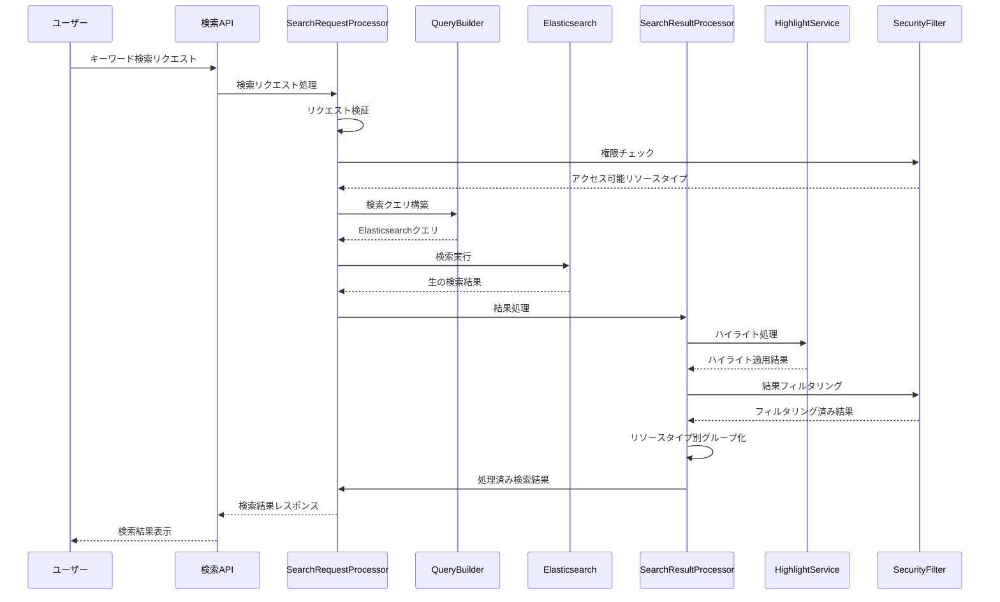

# 全文検索機能

## 1. 概要

全文検索（Global Search）機能は、SES業務システム全体を横断して任意のキーワードに基づいて情報を検索するための機能です。技術者、案件、契約など様々なリソースを統一的なインターフェースから検索できる仕組みを提供し、ユーザーが必要な情報に素早くアクセスできるようにします。

### 1.1 目的

- システム全体の様々なリソースを単一の検索ボックスから横断的に検索可能にする
- 関連度に基づいた検索結果のランキングとグループ化を行い、ユーザーが求める情報に素早くアクセスできるようにする
- 日本語テキストの効率的な検索を可能にし、表記ゆれや同義語に対応する
- 検索結果をユーザーの権限に基づいて適切にフィルタリングする

### 1.2 主要機能

- キーワードベースの全文検索
- 検索結果のリソースタイプ別グループ化
- 関連度スコアリングと検索結果ランキング
- 検索結果のハイライト表示
- 複合検索条件（AND, OR, NOT演算子）
- フレーズ検索とワイルドカード検索
- 検索結果の権限ベースフィルタリング

## 2. アーキテクチャ

### 2.1 コンポーネント構成

全文検索機能は以下のコンポーネントから構成されます：

```
FullTextSearchComponent
├── GlobalSearchService（全文検索サービス）
├── SearchRequestProcessor（検索リクエスト処理）
├── SearchResultProcessor（検索結果処理）
├── SearchQueryBuilder（検索クエリ構築）
├── HighlightService（ハイライト処理）
├── SecurityFilter（セキュリティフィルタ）
└── ResourceTypeRegistry（リソースタイプ登録）
```

### 2.2 処理フロー

全文検索の基本的な処理フローは以下の通りです：



## 3. 詳細設計

### 3.1 GlobalSearchService

全文検索の主要機能を提供するサービスです。

#### 3.1.1 インターフェース

```java
public interface GlobalSearchService {
    /**
     * キーワードによるグローバル検索を実行する
     * @param keyword 検索キーワード
     * @param resourceTypes 検索対象のリソースタイプリスト（nullの場合は全リソースタイプ）
     * @param page ページ番号（0始まり）
     * @param pageSize ページサイズ
     * @param currentUser 現在のユーザー情報
     * @return 検索結果
     */
    SearchResult globalSearch(String keyword, List<String> resourceTypes, 
                             int page, int pageSize, UserContext currentUser);
    
    /**
     * 詳細な検索条件によるグローバル検索を実行する
     * @param query 検索クエリDTO
     * @param currentUser 現在のユーザー情報
     * @return 検索結果
     */
    SearchResult advancedGlobalSearch(SearchQueryDto query, UserContext currentUser);
    
    /**
     * グローバル検索を非同期で実行する
     * @param keyword 検索キーワード
     * @param resourceTypes 検索対象のリソースタイプリスト
     * @param page ページ番号（0始まり）
     * @param pageSize ページサイズ
     * @param currentUser 現在のユーザー情報
     * @return 検索IDを含む非同期検索結果ハンドル
     */
    CompletableFuture<SearchResult> globalSearchAsync(String keyword, 
                                               List<String> resourceTypes, 
                                               int page, int pageSize, 
                                               UserContext currentUser);
    
    /**
     * 検索可能なリソースタイプ一覧を取得する
     * @param currentUser 現在のユーザー情報
     * @return 検索可能なリソースタイプのリスト
     */
    List<ResourceTypeInfo> getSearchableResourceTypes(UserContext currentUser);
}
```

#### 3.1.2 実装クラス

```java
@Service
@Slf4j
public class GlobalSearchServiceImpl implements GlobalSearchService {
    private final SearchRequestProcessor requestProcessor;
    private final SecurityFilter securityFilter;
    private final ResourceTypeRegistry resourceTypeRegistry;
    private final AsyncTaskExecutor taskExecutor;
    
    @Autowired
    public GlobalSearchServiceImpl(SearchRequestProcessor requestProcessor,
                                  SecurityFilter securityFilter,
                                  ResourceTypeRegistry resourceTypeRegistry,
                                  AsyncTaskExecutor taskExecutor) {
        this.requestProcessor = requestProcessor;
        this.securityFilter = securityFilter;
        this.resourceTypeRegistry = resourceTypeRegistry;
        this.taskExecutor = taskExecutor;
    }
    
    @Override
    public SearchResult globalSearch(String keyword, List<String> resourceTypes,
                                   int page, int pageSize, UserContext currentUser) {
        // キーワードのバリデーション
        if (StringUtils.isBlank(keyword)) {
            throw new IllegalArgumentException("検索キーワードは必須です");
        }
        
        // パラメータの正規化
        int normalizedPage = Math.max(0, page);
        int normalizedPageSize = Math.min(Math.max(1, pageSize), 100);
        
        // リソースタイプのフィルタリング
        List<String> accessibleResourceTypes = securityFilter
            .filterAccessibleResourceTypes(resourceTypes, currentUser);
        
        if (accessibleResourceTypes.isEmpty()) {
            log.warn("ユーザー[{}]はリクエストされたリソースタイプにアクセスできません", 
                    currentUser.getUserId());
            return SearchResult.empty();
        }
        
        // 検索クエリDTOの構築
        SearchQueryDto queryDto = SearchQueryDto.builder()
            .keywordQuery(keyword)
            .resourceTypes(accessibleResourceTypes)
            .page(normalizedPage)
            .pageSize(normalizedPageSize)
            .groupByResourceType(true)
            .saveToHistory(true)
            .build();
            
        // 検索実行
        return requestProcessor.processSearchRequest(queryDto, currentUser);
    }
    
    // 他のメソッド実装...
}
```

### 3.2 SearchQueryBuilder

検索クエリを構築するコンポーネントです。

#### 3.2.1 主要メソッド

```java
public class SearchQueryBuilder {
    /**
     * キーワード検索用のElasticsearchクエリを構築する
     * @param keyword 検索キーワード
     * @param resourceType リソースタイプ
     * @return Elasticsearchクエリ
     */
    public SearchSourceBuilder buildKeywordQuery(String keyword, String resourceType) {
        ResourceTypeConfig config = resourceTypeRegistry.getResourceTypeConfig(resourceType);
        
        // ベースクエリの構築
        QueryBuilder baseQuery;
        
        if (keyword.contains("\"")) {
            // フレーズクエリ処理
            baseQuery = handlePhraseQuery(keyword, config.getSearchFields());
        } else if (keyword.contains("*") || keyword.contains("?")) {
            // ワイルドカードクエリ処理
            baseQuery = handleWildcardQuery(keyword, config.getSearchFields());
        } else {
            // 標準のマルチマッチクエリ
            baseQuery = buildStandardQuery(keyword, config.getSearchFields());
        }
        
        // 検索フィールドの重み付け
        Map<String, Float> fieldBoosts = config.getFieldBoosts();
        
        // クエリの構築と返却
        SearchSourceBuilder sourceBuilder = new SearchSourceBuilder();
        sourceBuilder.query(baseQuery);
        sourceBuilder.from(query.getPage() * query.getPageSize());
        sourceBuilder.size(query.getPageSize());
        
        // ハイライト設定
        configureHighlighting(sourceBuilder, config.getHighlightFields());
        
        return sourceBuilder;
    }
    
    /**
     * 標準的な検索クエリを構築する
     */
    private QueryBuilder buildStandardQuery(String keyword, List<String> searchFields) {
        // 複数キーワードの分割
        String[] keywords = keyword.toLowerCase().split("\\s+");
        
        if (keywords.length == 1) {
            // 単一キーワードの場合はシンプルなマルチマッチ
            return QueryBuilders.multiMatchQuery(keyword, searchFields.toArray(new String[0]))
                .type(MultiMatchQueryBuilder.Type.BEST_FIELDS)
                .operator(Operator.AND)
                .fuzziness(Fuzziness.AUTO);
        } else {
            // 複数キーワードの場合は複合クエリを構築
            BoolQueryBuilder boolQuery = QueryBuilders.boolQuery();
            
            for (String kw : keywords) {
                if (kw.startsWith("-")) {
                    // NOT条件
                    String negatedKeyword = kw.substring(1);
                    boolQuery.mustNot(QueryBuilders.multiMatchQuery(negatedKeyword, 
                                   searchFields.toArray(new String[0])));
                } else if (kw.startsWith("+")) {
                    // 必須条件
                    String requiredKeyword = kw.substring(1);
                    boolQuery.must(QueryBuilders.multiMatchQuery(requiredKeyword, 
                                 searchFields.toArray(new String[0])));
                } else {
                    // should条件
                    boolQuery.should(QueryBuilders.multiMatchQuery(kw, 
                                   searchFields.toArray(new String[0])));
                }
            }
            
            return boolQuery;
        }
    }
    
    /**
     * ハイライト設定を行う
     */
    private void configureHighlighting(SearchSourceBuilder sourceBuilder, List<String> highlightFields) {
        HighlightBuilder highlightBuilder = new HighlightBuilder();
        
        // 各フィールドのハイライト設定
        for (String field : highlightFields) {
            highlightBuilder.field(new HighlightBuilder.Field(field)
                .fragmentSize(150)
                .numOfFragments(3)
                .preTags("<em>")
                .postTags("</em>"));
        }
        
        sourceBuilder.highlighter(highlightBuilder);
    }
    
    // 他のメソッド...
}
```

### 3.3 SearchResultProcessor

検索結果を処理して表示用に整形するコンポーネントです。

#### 3.3.1 主要メソッド

```java
public class SearchResultProcessor {
    /**
     * Elasticsearchからの検索結果を処理して表示用に変換する
     * @param searchResponse Elasticsearchレスポンス
     * @param query 検索クエリ
     * @param currentUser 現在のユーザー情報
     * @return 整形された検索結果
     */
    public SearchResultDto processSearchResponse(SearchResponse searchResponse, 
                                              SearchQueryDto query,
                                              UserContext currentUser) {
        // 検索結果の基本情報
        long totalHits = searchResponse.getHits().getTotalHits().value;
        long executionTimeMs = searchResponse.getTook().getMillis();
        
        // 検索結果アイテムの処理
        List<SearchResultItemDto> items = new ArrayList<>();
        Map<String, ResourceTypeResultDto> groupedResults = new HashMap<>();
        
        // 検索結果のヒットを処理
        for (SearchHit hit : searchResponse.getHits().getHits()) {
            // リソースタイプの取得
            String resourceType = hit.getIndex().split("-")[0];
            ResourceTypeConfig typeConfig = resourceTypeRegistry.getResourceTypeConfig(resourceType);
            
            // アクセス権チェック
            if (!securityFilter.canAccessResource(currentUser, resourceType, hit.getId())) {
                continue;  // アクセス権のないリソースはスキップ
            }
            
            // ソースデータの取得
            Map<String, Object> sourceMap = hit.getSourceAsMap();
            
            // リソースタイプごとの結果マッピング処理
            SearchResultItemDto itemDto = mapToResultItem(hit, typeConfig, sourceMap);
            items.add(itemDto);
            
            // リソースタイプごとのグループ化（必要な場合）
            if (query.isGroupByResourceType()) {
                addToGroupedResults(groupedResults, itemDto, resourceType, typeConfig);
            }
        }
        
        // ファセット情報の処理（集約結果がある場合）
        Map<String, List<FacetValueDto>> facets = processFacets(searchResponse);
        
        // 結果の構築
        SearchResultDto result = new SearchResultDto();
        result.setId(UUID.randomUUID().toString());
        result.setQueryId(query.getId());
        result.setTotalHits(totalHits);
        result.setExecutionTimeMs(executionTimeMs);
        result.setItems(items);
        result.setGroupedResults(groupedResults);
        result.setFacets(facets);
        result.setCurrentPage(query.getPage());
        result.setPageSize(query.getPageSize());
        result.setTotalPages((int) Math.ceil((double) totalHits / query.getPageSize()));
        result.setTimestamp(ZonedDateTime.now());
        
        return result;
    }
    
    /**
     * 検索結果を結果アイテムDTOにマッピングする
     */
    private SearchResultItemDto mapToResultItem(SearchHit hit, 
                                              ResourceTypeConfig typeConfig,
                                              Map<String, Object> sourceMap) {
        SearchResultItemDto item = new SearchResultItemDto();
        item.setId(hit.getId());
        item.setResourceType(typeConfig.getResourceType());
        
        // リソースタイプごとの表示フィールド設定に基づいて結果をマッピング
        item.setTitle(extractStringField(sourceMap, typeConfig.getTitleField()));
        item.setSubtitle(extractStringField(sourceMap, typeConfig.getSubtitleField()));
        item.setDescription(extractStringField(sourceMap, typeConfig.getDescriptionField()));
        
        // URLの設定
        item.setUrl(buildResourceUrl(typeConfig.getResourceType(), hit.getId()));
        
        // ハイライト情報の処理
        item.setHighlights(processHighlights(hit));
        
        // スコアの設定
        item.setScore(hit.getScore());
        
        // リソース固有の属性を取得
        item.setAttributes(extractAttributes(sourceMap, typeConfig.getAttributeFields()));
        
        return item;
    }
    
    /**
     * ハイライト情報を処理する
     */
    private Map<String, List<String>> processHighlights(SearchHit hit) {
        Map<String, List<String>> highlights = new HashMap<>();
        
        if (hit.getHighlightFields() != null) {
            hit.getHighlightFields().forEach((fieldName, highlightField) -> {
                List<String> fragments = Arrays.asList(highlightField.getFragments())
                    .stream().map(Text::string).collect(Collectors.toList());
                highlights.put(fieldName, fragments);
            });
        }
        
        return highlights;
    }
    
    // 他のメソッド...
}
```

### 3.4 HighlightService

検索結果のハイライト処理を行うコンポーネントです。

```java
@Service
public class HighlightService {
    /**
     * ハイライト設定を作成する
     * @param resourceType リソースタイプ
     * @return ハイライトビルダー
     */
    public HighlightBuilder createHighlightBuilder(String resourceType) {
        HighlightBuilder highlightBuilder = new HighlightBuilder();
        
        // リソースタイプごとのハイライト対象フィールドを取得
        List<String> highlightFields = getHighlightFields(resourceType);
        
        // ハイライト設定
        for (String field : highlightFields) {
            highlightBuilder.field(new HighlightBuilder.Field(field)
                .fragmentSize(150)     // フラグメントサイズ
                .numOfFragments(3)     // 最大フラグメント数
                .preTags("<em>")       // ハイライト開始タグ
                .postTags("</em>"));   // ハイライト終了タグ
        }
        
        // 共通設定
        highlightBuilder.requireFieldMatch(false);  // フィールド一致を必須としない
        highlightBuilder.encoder("html");           // HTMLエンコーディング
        
        return highlightBuilder;
    }
    
    /**
     * リソースタイプ別のハイライト対象フィールドを取得する
     */
    private List<String> getHighlightFields(String resourceType) {
        switch (resourceType) {
            case "engineers":
                return Arrays.asList("name", "kana", "skills.name", "experience.projectName", 
                                    "experience.description");
            case "projects":
                return Arrays.asList("title", "description", "requiredSkills.name", "clientName");
            case "contracts":
                return Arrays.asList("title", "content", "parties.name");
            default:
                return Collections.emptyList();
        }
    }
    
    /**
     * ハイライト結果からスニペットを抽出する
     * @param highlights ハイライト情報
     * @param maxLength 最大長
     * @return スニペット文字列
     */
    public String createSnippet(Map<String, List<String>> highlights, int maxLength) {
        if (highlights == null || highlights.isEmpty()) {
            return "";
        }
        
        // 優先順位の高いフィールドから順にハイライトを取得
        List<String> priorityFields = Arrays.asList("title", "name", "description", "content");
        
        StringBuilder snippet = new StringBuilder();
        int remainingLength = maxLength;
        
        // 優先フィールドからスニペットを構築
        for (String field : priorityFields) {
            if (highlights.containsKey(field)) {
                List<String> fragments = highlights.get(field);
                for (String fragment : fragments) {
                    if (remainingLength <= 0) break;
                    
                    if (snippet.length() > 0) {
                        snippet.append(" ... ");
                    }
                    
                    if (fragment.length() <= remainingLength) {
                        snippet.append(fragment);
                        remainingLength -= fragment.length();
                    } else {
                        snippet.append(fragment.substring(0, remainingLength));
                        remainingLength = 0;
                    }
                }
            }
        }
        
        // 優先フィールドで十分なスニペットが得られない場合は他のフィールドも使用
        if (remainingLength > 0) {
            for (Map.Entry<String, List<String>> entry : highlights.entrySet()) {
                if (priorityFields.contains(entry.getKey())) {
                    continue;  // 既に処理済みのフィールドはスキップ
                }
                
                for (String fragment : entry.getValue()) {
                    if (remainingLength <= 0) break;
                    
                    if (snippet.length() > 0) {
                        snippet.append(" ... ");
                    }
                    
                    if (fragment.length() <= remainingLength) {
                        snippet.append(fragment);
                        remainingLength -= fragment.length();
                    } else {
                        snippet.append(fragment.substring(0, remainingLength));
                        remainingLength = 0;
                    }
                }
            }
        }
        
        return snippet.toString();
    }
}
```

### 3.5 SecurityFilter

検索結果のセキュリティフィルタリングを行うコンポーネントです。

```java
@Component
public class SecurityFilter {
    private final AuthenticationService authService;
    
    @Autowired
    public SecurityFilter(AuthenticationService authService) {
        this.authService = authService;
    }
    
    /**
     * ユーザーがアクセス可能なリソースタイプをフィルタリングする
     * @param requestedTypes リクエストされたリソースタイプのリスト
     * @param currentUser 現在のユーザー情報
     * @return アクセス可能なリソースタイプのリスト
     */
    public List<String> filterAccessibleResourceTypes(List<String> requestedTypes, 
                                                   UserContext currentUser) {
        if (requestedTypes == null || requestedTypes.isEmpty()) {
            // 全リソースタイプを対象とする場合、アクセス可能なものだけを返す
            return authService.getAccessibleResourceTypes(currentUser.getUserId());
        }
        
        // リクエストされたリソースタイプのうち、アクセス可能なもののみをフィルタリング
        return requestedTypes.stream()
            .filter(type -> authService.canSearchResourceType(currentUser.getUserId(), type))
            .collect(Collectors.toList());
    }
    
    /**
     * 特定のリソースにアクセス可能かどうかをチェックする
     * @param currentUser 現在のユーザー情報
     * @param resourceType リソースタイプ
     * @param resourceId リソースID
     * @return アクセス可能な場合はtrue
     */
    public boolean canAccessResource(UserContext currentUser, String resourceType, String resourceId) {
        return authService.canAccessResource(currentUser.getUserId(), resourceType, resourceId, "read");
    }
    
    /**
     * 検索結果をユーザーの権限に基づいてフィルタリングする
     * @param results 検索結果アイテムのリスト
     * @param currentUser 現在のユーザー情報
     * @return フィルタリング後の検索結果アイテムのリスト
     */
    public List<SearchResultItemDto> filterSearchResults(List<SearchResultItemDto> results, 
                                                      UserContext currentUser) {
        return results.stream()
            .filter(item -> canAccessResource(currentUser, item.getResourceType(), item.getId()))
            .collect(Collectors.toList());
    }
}
```

### 3.6 ResourceTypeRegistry

検索対象のリソースタイプ情報を管理するコンポーネントです。

```java
@Component
public class ResourceTypeRegistry {
    private final Map<String, ResourceTypeConfig> resourceTypes = new HashMap<>();
    
    @PostConstruct
    public void init() {
        // 技術者リソースタイプの設定
        ResourceTypeConfig engineers = new ResourceTypeConfig();
        engineers.setResourceType("engineers");
        engineers.setDisplayName("技術者");
        engineers.setSearchFields(Arrays.asList("name", "kana", "skills.name", 
                                           "experience.projectName", "experience.description"));
        engineers.setTitleField("name");
        engineers.setSubtitleField("skills.name");
        engineers.setDescriptionField("experience.description");
        engineers.setHighlightFields(Arrays.asList("name", "skills.name", "experience.description"));
        engineers.setAttributeFields(Arrays.asList("status", "location", "availableDate"));
        
        Map<String, Float> engineerBoosts = new HashMap<>();
        engineerBoosts.put("name", 3.0f);
        engineerBoosts.put("skills.name", 2.0f);
        engineerBoosts.put("experience.projectName", 1.5f);
        engineerBoosts.put("experience.description", 1.0f);
        engineers.setFieldBoosts(engineerBoosts);
        
        resourceTypes.put("engineers", engineers);
        
        // 案件リソースタイプの設定
        ResourceTypeConfig projects = new ResourceTypeConfig();
        projects.setResourceType("projects");
        projects.setDisplayName("案件");
        projects.setSearchFields(Arrays.asList("title", "description", "requiredSkills.name", 
                                          "clientName"));
        projects.setTitleField("title");
        projects.setSubtitleField("clientName");
        projects.setDescriptionField("description");
        projects.setHighlightFields(Arrays.asList("title", "description", "requiredSkills.name"));
        projects.setAttributeFields(Arrays.asList("status", "location", "startDate", "endDate", "rate"));
        
        Map<String, Float> projectBoosts = new HashMap<>();
        projectBoosts.put("title", 3.0f);
        projectBoosts.put("requiredSkills.name", 2.0f);
        projectBoosts.put("description", 1.5f);
        projectBoosts.put("clientName", 1.0f);
        projects.setFieldBoosts(projectBoosts);
        
        resourceTypes.put("projects", projects);
        
        // 他のリソースタイプも同様に設定...
    }
    
    /**
     * リソースタイプの設定を取得する
     * @param resourceType リソースタイプ
     * @return リソースタイプの設定
     */
    public ResourceTypeConfig getResourceTypeConfig(String resourceType) {
        ResourceTypeConfig config = resourceTypes.get(resourceType);
        if (config == null) {
            throw new IllegalArgumentException("未知のリソースタイプ: " + resourceType);
        }
        return config;
    }
    
    /**
     * 利用可能なすべてのリソースタイプ設定を取得する
     * @return リソースタイプ設定のマップ
     */
    public Map<String, ResourceTypeConfig> getAllResourceTypes() {
        return Collections.unmodifiableMap(resourceTypes);
    }
    
    /**
     * リソースタイプ情報のリストを取得する
     * @return リソースタイプ情報のリスト
     */
    public List<ResourceTypeInfo> getResourceTypeInfoList() {
        return resourceTypes.values().stream()
            .map(config -> new ResourceTypeInfo(config.getResourceType(), config.getDisplayName()))
            .collect(Collectors.toList());
    }
}
```

#### 3.6.1 リソースタイプ設定クラス

```java
public class ResourceTypeConfig {
    private String resourceType;          // リソースタイプID
    private String displayName;           // 表示名
    private List<String> searchFields;    // 検索対象フィールド
    private String titleField;            // タイトルフィールド
    private String subtitleField;         // サブタイトルフィールド
    private String descriptionField;      // 説明フィールド
    private List<String> highlightFields; // ハイライト対象フィールド
    private List<String> attributeFields; // 結果に含める属性フィールド
    private Map<String, Float> fieldBoosts; // フィールドの重み付け
    
    // getters and setters
}
```

## 4. REST API インターフェース

### 4.1 検索API

```
GET /api/v1/search/global?keyword={keyword}&resourceTypes={resourceTypes}&page={page}&size={size}
```

#### リクエストパラメータ

| パラメータ | 型 | 説明 | 必須 | デフォルト値 |
|-----------|----|----- |------|----------|
| keyword | String | 検索キーワード | ○ | - |
| resourceTypes | String | カンマ区切りのリソースタイプリスト | × | すべてのリソースタイプ |
| page | Integer | ページ番号（0始まり） | × | 0 |
| size | Integer | ページサイズ | × | 20 |

#### レスポンス

```json
{
  "id": "550e8400-e29b-41d4-a716-446655440000",
  "queryId": "550e8400-e29b-41d4-a716-446655440001",
  "totalHits": 42,
  "executionTimeMs": 156,
  "groupedResults": {
    "engineers": {
      "resourceType": "engineers",
      "displayName": "技術者",
      "totalHits": 25,
      "items": [
        {
          "id": "e12345",
          "resourceType": "engineers",
          "title": "山田 太郎",
          "subtitle": "Java, Spring, AWS",
          "description": "Javaを中心としたバックエンド開発の経験があります。",
          "url": "/engineers/e12345",
          "highlights": {
            "skills.name": ["<em>Java</em>", "<em>Spring</em>"],
            "experience.description": ["<em>Java</em>を中心としたバックエンド開発"]
          },
          "attributes": {
            "status": "稼働中",
            "location": "東京",
            "availableDate": "2025-08-01"
          },
          "score": 0.85
        }
        // 他の結果...
      ]
    },
    "projects": {
      "resourceType": "projects",
      "displayName": "案件",
      "totalHits": 17,
      "items": [
        {
          "id": "p67890",
          "resourceType": "projects",
          "title": "ECサイト開発プロジェクト",
          "subtitle": "株式会社ABC",
          "description": "JavaとSpringを使ったECサイトのバックエンド開発",
          "url": "/projects/p67890",
          "highlights": {
            "title": ["ECサイト<em>開発</em>プロジェクト"],
            "description": ["<em>Java</em>と<em>Spring</em>を使ったECサイト"]
          },
          "attributes": {
            "status": "募集中",
            "location": "リモート",
            "startDate": "2025-07-01",
            "endDate": "2025-12-31",
            "rate": 800000
          },
          "score": 0.75
        }
        // 他の結果...
      ]
    }
  },
  "items": [
    // グループ化していない場合の全結果一覧
  ],
  "facets": {
    "status": [
      {"value": "稼働中", "displayName": "稼働中", "count": 15, "selected": false},
      {"value": "待機中", "displayName": "待機中", "count": 10, "selected": false}
    ],
    "location": [
      {"value": "東京", "displayName": "東京", "count": 20, "selected": false},
      {"value": "大阪", "displayName": "大阪", "count": 5, "selected": false},
      {"value": "リモート", "displayName": "リモート", "count": 17, "selected": false}
    ]
  },
  "currentPage": 0,
  "pageSize": 20,
  "totalPages": 3,
  "timestamp": "2025-05-14T14:30:45.123+09:00"
}
```

### 4.2 詳細検索API

```
POST /api/v1/search/advanced
```

#### リクエスト本文

```json
{
  "keywordQuery": "Java Spring",
  "resourceTypes": ["engineers", "projects"],
  "filters": {
    "location": "東京",
    "status": ["稼働中", "待機中"],
    "skills.level": {"operator": "GREATER_THAN", "value": 3}
  },
  "sortField": "updatedAt",
  "sortOrder": "DESC",
  "page": 0,
  "pageSize": 20,
  "groupByResourceType": true
}
```

#### レスポンス

基本的には通常の検索APIと同じ形式のレスポンスを返します。

## 5. 検索パフォーマンス最適化

### 5.1 検索クエリ最適化

全文検索のパフォーマンスを最適化するための戦略：

1. **クエリタイプの最適選択**
   - 単一キーワード: MultiMatchQuery
   - フレーズ検索: MatchPhraseQuery
   - ワイルドカード検索: WildcardQuery
   - 複合条件: BoolQuery

2. **検索フィールドの絞り込み**
   - リソースタイプごとに最適な検索対象フィールドを設定
   - 優先度の高いフィールドに重み付け

3. **キャッシュ戦略**
   - 人気の検索クエリ結果をキャッシュ
   - キャッシュ有効期間: 5分（設定可能）
   - キャッシュキー: `${keyword}_${resourceTypes}_${page}_${pageSize}_${userRole}`

### 5.2 レスポンス時間目標

| 操作 | 平均レスポンス時間 | 最大レスポンス時間 |
|-----|-----------------|-----------------|
| 単純キーワード検索 | 500ms以下 | 1秒以下 |
| 複合条件検索 | 1秒以下 | 2秒以下 |
| フレーズ検索 | 700ms以下 | 1.5秒以下 |
| ワイルドカード検索 | 1.5秒以下 | 3秒以下 |

### 5.3 スケーラビリティ対応

- 非同期検索APIの提供
- 重い検索はタスクキューで処理
- 結果の段階的取得（スクロール検索）サポート

## 6. 日本語検索の最適化

### 6.1 形態素解析設定

日本語検索の精度を高めるため、以下の設定を行います：

```json
{
  "settings": {
    "analysis": {
      "analyzer": {
        "japanese_analyzer": {
          "type": "custom",
          "tokenizer": "kuromoji_tokenizer",
          "char_filter": [
            "icu_normalizer",
            "japanese_iteration_mark"
          ],
          "filter": [
            "kuromoji_baseform",
            "kuromoji_part_of_speech",
            "ja_stop",
            "kuromoji_number",
            "kuromoji_stemmer"
          ]
        }
      },
      "char_filter": {
        "japanese_iteration_mark": {
          "type": "mapping",
          "mappings": ["々=>\\u306e"]
        }
      }
    }
  }
}
```

### 6.2 同義語辞書

業界用語や表記ゆれに対応するための同義語辞書を管理します：

```
# IT技術関連
Java, ジャバ, JAVA
JavaScript, JS, ECMAScript
AWS, Amazon Web Services, アマゾンウェブサービス
Azure, アジュール, Microsoft Azure

# 役割・職種
PM, プロジェクトマネージャ, プロジェクトマネージャー
SE, システムエンジニア
PG, プログラマ, プログラマー
インフラ, インフラストラクチャ, インフラエンジニア

# スキルレベル
初級, 入門, ビギナー
中級, ミドル
上級, アドバンスド, エキスパート
```

### 6.3 表記ゆれ対応

表記ゆれに対応するための正規化処理：

1. **文字種の正規化**
   - 全角/半角の統一
   - 大文字/小文字の統一
   - カタカナ/ひらがなの統一（必要に応じて）

2. **N-gram分析の併用**
   - 2-gramインデックスの追加（オプション）
   - 短い用語や固有名詞の検索精度向上

## 7. テスト戦略

### 7.1 単体テスト

各コンポーネントの単体テストを実施：

- **SearchQueryBuilderのテスト**
  - 様々なクエリパターンでの動作検証
  - エッジケース対応の確認

- **SearchResultProcessorのテスト**
  - 結果マッピングの正確性
  - ハイライト処理の検証

- **SecurityFilterのテスト**
  - 権限に基づくフィルタリングの動作検証

### 7.2 統合テスト

検索機能全体の統合テスト：

- 実際のElasticsearchインスタンスを使用したテスト
- テストデータセットによる検索精度の検証
- パフォーマンステスト（スループット、レスポンス時間）

### 7.3 負荷テスト

高負荷時の動作検証：

- 同時100ユーザーによる検索リクエスト
- 大量データ（100万件以上）での検索性能
- 長時間運用時のリソース使用状況

## 8. 運用・監視

### 8.1 ログ出力

適切なログ出力により、検索機能の監視と問題追跡を容易にします：

```java
// 検索実行ログ
log.info("全文検索実行: keyword={}, resourceTypes={}, userId={}, executionTime={}ms, hitCount={}",
        query.getKeywordQuery(), query.getResourceTypes(), currentUser.getUserId(),
        result.getExecutionTimeMs(), result.getTotalHits());

// 検索エラーログ
log.error("検索エラー: query={}, error={}", query, e.getMessage(), e);

// パフォーマンス警告ログ
if (result.getExecutionTimeMs() > 2000) {
    log.warn("検索に時間がかかっています: keyword={}, executionTime={}ms",
            query.getKeywordQuery(), result.getExecutionTimeMs());
}
```

### 8.2 監視指標

以下の指標を監視し、検索機能の健全性を確保します：

- **平均検索時間** (ミリ秒)
- **検索リクエスト数** (リクエスト/分)
- **検索ヒット数** (平均ヒット数/検索)
- **エラー率** (エラー/全リクエスト)
- **キャッシュヒット率** (%)
- **インデックスサイズ** (MB)

### 8.3 アラート設定

| アラート | 閾値 | アクション |
|---------|------|-----------|
| 検索時間超過 | 3秒以上 | 警告通知、検索ログ取得 |
| エラー率上昇 | 5%以上 | 重大アラート、インデックス状態確認 |
| ゼロヒット検索増加 | 30%以上 | 警告通知、インデックス同期状態確認 |
| インデックスサイズ急増 | 前日比50%増 | 警告通知、インデックス内容確認 |

## 9. 拡張性と今後の展望

### 9.1 新規リソースタイプへの対応

新しいリソースタイプを検索対象に追加する手順：

1. ResourceTypeRegistryへの設定追加
2. 検索インデックスの作成と設定
3. 権限設定の追加
4. マッピングロジックの実装

### 9.2 将来の拡張可能性

- **ファセット検索の強化**：複数ファセットの組み合わせ検索
- **類似度検索**：類似リソース検索機能の追加
- **自然言語クエリ**：自然言語による検索条件指定
- **レコメンデーション**：検索履歴に基づく関連コンテンツ推薦
- **意味ベース検索**：ベクトル検索による意味的類似性検索