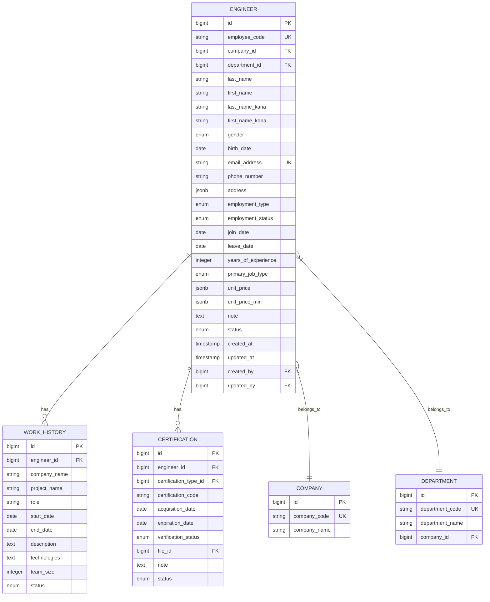

# 技術者管理モジュール - 基本情報テーブル

## 1. 概要

技術者管理モジュールの中核となる技術者の基本情報を管理するテーブル構造について記述します。技術者（エンジニア）の個人情報、連絡先、雇用情報などの基本的な属性を管理し、SES業務システム全体で参照されるマスターデータとなります。

## 2. テーブル関連図



## 3. engineer テーブル

技術者（エンジニア）の基本情報を格納するメインテーブルです。

### 3.1 テーブル定義

| カラム名 | データ型 | NULL | デフォルト | 説明 |
|---------|---------|------|-----------|------|
| id | bigserial | NOT NULL | | 主キー |
| employee_code | varchar(20) | NOT NULL | | 社員コード (一意) |
| company_id | bigint | NOT NULL | | 所属会社ID (外部キー) |
| department_id | bigint | NOT NULL | | 所属部署ID (外部キー) |
| last_name | varchar(100) | NOT NULL | | 姓 |
| first_name | varchar(100) | NOT NULL | | 名 |
| last_name_kana | varchar(100) | NOT NULL | | 姓（カナ） |
| first_name_kana | varchar(100) | NOT NULL | | 名（カナ） |
| gender | engineer_gender | NOT NULL | | 性別 (列挙型) |
| birth_date | date | NOT NULL | | 生年月日 |
| email_address | varchar(255) | NOT NULL | | メールアドレス (一意) |
| phone_number | varchar(20) | NOT NULL | | 電話番号 |
| address | jsonb | NOT NULL | | 住所 (JSON形式) |
| employment_type | employment_type | NOT NULL | | 雇用形態 (列挙型) |
| employment_status | employment_status | NOT NULL | 'ACTIVE' | 雇用状態 (列挙型) |
| join_date | date | NOT NULL | | 入社日 |
| leave_date | date | NULL | | 退職日 |
| years_of_experience | integer | NOT NULL | 0 | 経験年数 |
| primary_job_type | job_type | NOT NULL | | 主な職種 (列挙型) |
| unit_price | jsonb | NOT NULL | | 標準単金 (JSON形式) |
| unit_price_min | jsonb | NULL | | 最低単金 (JSON形式) |
| note | text | NULL | | 備考 |
| status | record_status | NOT NULL | 'ACTIVE' | レコード状態 (列挙型) |
| created_at | timestamp | NOT NULL | CURRENT_TIMESTAMP | 作成日時 |
| updated_at | timestamp | NOT NULL | CURRENT_TIMESTAMP | 更新日時 |
| created_by | bigint | NOT NULL | | 作成者ID (外部キー) |
| updated_by | bigint | NOT NULL | | 更新者ID (外部キー) |

**主キー制約**:
- PRIMARY KEY (id)

**一意制約**:
- UNIQUE (employee_code)
- UNIQUE (email_address)

**外部キー制約**:
- FOREIGN KEY (company_id) REFERENCES company(id)
- FOREIGN KEY (department_id) REFERENCES department(id)
- FOREIGN KEY (created_by) REFERENCES users(id)
- FOREIGN KEY (updated_by) REFERENCES users(id)

**チェック制約**:
- CHECK (years_of_experience >= 0)
- CHECK (leave_date IS NULL OR leave_date > join_date)

### 3.2 インデックス

| インデックス名 | インデックスタイプ | カラム | 説明 |
|--------------|-----------------|-------|------|
| pk_engineer | PRIMARY KEY | id | 主キーインデックス |
| uix_engineer_employee_code | UNIQUE | employee_code | 社員コードの一意性保証 |
| uix_engineer_email_address | UNIQUE | email_address | メールアドレスの一意性保証 |
| ix_engineer_company_id | BTREE | company_id | 所属会社での検索向け |
| ix_engineer_department_id | BTREE | department_id | 所属部署での検索向け |
| ix_engineer_last_name_first_name | BTREE | last_name, first_name | 氏名での検索向け |
| ix_engineer_name_kana | BTREE | last_name_kana, first_name_kana | カナ名での検索向け |
| ix_engineer_employment_status | BTREE | employment_status | 雇用状態での絞り込み |
| ix_engineer_join_date | BTREE | join_date | 入社日による検索・ソート |
| ix_engineer_primary_job_type | BTREE | primary_job_type | 職種による検索 |

### 3.3 列挙型

#### engineer_gender
- `MALE`: 男性
- `FEMALE`: 女性
- `OTHER`: その他
- `UNDISCLOSED`: 未回答

#### employment_type
- `PERMANENT`: 正社員
- `CONTRACT`: 契約社員
- `PART_TIME`: パートタイム
- `TEMPORARY`: 派遣社員
- `FREELANCE`: フリーランス

#### employment_status
- `ACTIVE`: 在籍中
- `PROBATION`: 試用期間中
- `LEAVE_OF_ABSENCE`: 休職中
- `RETIRED`: 退職

#### job_type
- `PROGRAMMER`: プログラマー
- `SYSTEM_ENGINEER`: システムエンジニア
- `PROJECT_MANAGER`: プロジェクトマネージャー
- `INFRASTRUCTURE_ENGINEER`: インフラエンジニア
- `DATABASE_ENGINEER`: データベースエンジニア
- `NETWORK_ENGINEER`: ネットワークエンジニア
- `SECURITY_ENGINEER`: セキュリティエンジニア
- `QA_ENGINEER`: QAエンジニア
- `UI_UX_DESIGNER`: UI/UXデザイナー
- `DATA_SCIENTIST`: データサイエンティスト
- `DEVOPS_ENGINEER`: DevOpsエンジニア
- `FRONTEND_ENGINEER`: フロントエンドエンジニア
- `BACKEND_ENGINEER`: バックエンドエンジニア
- `MOBILE_ENGINEER`: モバイルエンジニア
- `OTHER`: その他

#### record_status
- `ACTIVE`: 有効
- `DELETED`: 削除済
- `TEMPORARY`: 一時的

### 3.4 JSON構造

#### address
```json
{
  "postal_code": "string",   // 郵便番号
  "prefecture": "string",    // 都道府県
  "city": "string",          // 市区町村
  "street": "string",        // 町名・番地
  "building": "string"       // 建物名・部屋番号 (任意)
}
```

#### unit_price, unit_price_min
```json
{
  "amount": "decimal",      // 金額
  "currency": "string"      // 通貨コード (例: "JPY")
}
```

## 4. company テーブル

技術者が所属する会社情報を管理するテーブルです。

### 4.1 テーブル定義

| カラム名 | データ型 | NULL | デフォルト | 説明 |
|---------|---------|------|-----------|------|
| id | bigserial | NOT NULL | | 主キー |
| company_code | varchar(20) | NOT NULL | | 会社コード (一意) |
| company_name | varchar(100) | NOT NULL | | 会社名 |
| address | jsonb | NOT NULL | | 住所 (JSON形式) |
| phone_number | varchar(20) | NOT NULL | | 電話番号 |
| email_domain | varchar(255) | NULL | | メールドメイン |
| is_partner | boolean | NOT NULL | false | 協力会社フラグ |
| contract_date | date | NULL | | 契約日 |
| is_active | boolean | NOT NULL | true | 有効フラグ |
| note | text | NULL | | 備考 |
| status | record_status | NOT NULL | 'ACTIVE' | レコード状態 (列挙型) |
| created_at | timestamp | NOT NULL | CURRENT_TIMESTAMP | 作成日時 |
| updated_at | timestamp | NOT NULL | CURRENT_TIMESTAMP | 更新日時 |
| created_by | bigint | NOT NULL | | 作成者ID (外部キー) |
| updated_by | bigint | NOT NULL | | 更新者ID (外部キー) |

**主キー制約**:
- PRIMARY KEY (id)

**一意制約**:
- UNIQUE (company_code)

**インデックス**:
- ix_company_name (company_name)
- ix_company_is_partner (is_partner)

## 5. department テーブル

技術者が所属する部署情報を管理するテーブルです。

### 5.1 テーブル定義

| カラム名 | データ型 | NULL | デフォルト | 説明 |
|---------|---------|------|-----------|------|
| id | bigserial | NOT NULL | | 主キー |
| department_code | varchar(20) | NOT NULL | | 部署コード (一意) |
| department_name | varchar(100) | NOT NULL | | 部署名 |
| company_id | bigint | NOT NULL | | 所属会社ID (外部キー) |
| parent_department_id | bigint | NULL | | 親部署ID (自己参照) |
| manager_id | bigint | NULL | | 部署長ID (外部キー) |
| is_active | boolean | NOT NULL | true | 有効フラグ |
| note | text | NULL | | 備考 |
| status | record_status | NOT NULL | 'ACTIVE' | レコード状態 (列挙型) |
| created_at | timestamp | NOT NULL | CURRENT_TIMESTAMP | 作成日時 |
| updated_at | timestamp | NOT NULL | CURRENT_TIMESTAMP | 更新日時 |
| created_by | bigint | NOT NULL | | 作成者ID (外部キー) |
| updated_by | bigint | NOT NULL | | 更新者ID (外部キー) |

**主キー制約**:
- PRIMARY KEY (id)

**一意制約**:
- UNIQUE (department_code, company_id)

**外部キー制約**:
- FOREIGN KEY (company_id) REFERENCES company(id)
- FOREIGN KEY (parent_department_id) REFERENCES department(id)
- FOREIGN KEY (manager_id) REFERENCES engineer(id)

**インデックス**:
- ix_department_company_id (company_id)
- ix_department_name (department_name)

## 6. work_history テーブル

技術者の職務経歴を管理するテーブルです。

### 6.1 テーブル定義

| カラム名 | データ型 | NULL | デフォルト | 説明 |
|---------|---------|------|-----------|------|
| id | bigserial | NOT NULL | | 主キー |
| engineer_id | bigint | NOT NULL | | 技術者ID (外部キー) |
| company_name | varchar(100) | NOT NULL | | 会社名 |
| project_name | varchar(100) | NOT NULL | | プロジェクト名 |
| role | varchar(100) | NOT NULL | | 役割 |
| start_date | date | NOT NULL | | 開始日 |
| end_date | date | NULL | | 終了日 |
| description | text | NOT NULL | | 業務内容 |
| technologies | text | NULL | | 使用技術 |
| team_size | integer | NULL | | チーム規模 |
| status | record_status | NOT NULL | 'ACTIVE' | レコード状態 (列挙型) |
| created_at | timestamp | NOT NULL | CURRENT_TIMESTAMP | 作成日時 |
| updated_at | timestamp | NOT NULL | CURRENT_TIMESTAMP | 更新日時 |
| created_by | bigint | NOT NULL | | 作成者ID (外部キー) |
| updated_by | bigint | NOT NULL | | 更新者ID (外部キー) |

**主キー制約**:
- PRIMARY KEY (id)

**外部キー制約**:
- FOREIGN KEY (engineer_id) REFERENCES engineer(id)

**チェック制約**:
- CHECK (end_date IS NULL OR end_date > start_date)

**インデックス**:
- ix_work_history_engineer_id (engineer_id)
- ix_work_history_start_date (start_date)

## 7. 主要クエリパターン

### 7.1 技術者検索クエリ

技術者検索の代表的なクエリパターンです。スキル、稼働状況との結合が頻繁に行われます。

#### 名前・カナによる検索
```
SELECT * FROM engineer
WHERE (last_name LIKE '%検索文字列%' OR first_name LIKE '%検索文字列%')
   OR (last_name_kana LIKE '%検索文字列%' OR first_name_kana LIKE '%検索文字列%')
```

#### 職種・経験年数による検索
```
SELECT * FROM engineer
WHERE primary_job_type = 'SYSTEM_ENGINEER'
  AND years_of_experience >= 5
```

#### 所属による検索
```
SELECT e.* FROM engineer e
JOIN department d ON e.department_id = d.id
JOIN company c ON e.company_id = c.id
WHERE c.company_name LIKE '%会社名%'
  AND d.department_name LIKE '%部署名%'
```

### 7.2 職務経歴検索クエリ

#### 技術者の職務経歴取得
```
SELECT wh.* FROM work_history wh
WHERE wh.engineer_id = :engineerId
ORDER BY wh.start_date DESC
```

#### 特定のプロジェクト経験者検索
```
SELECT DISTINCT e.* FROM engineer e
JOIN work_history wh ON e.id = wh.engineer_id
WHERE wh.project_name LIKE '%プロジェクト名%'
  OR wh.description LIKE '%検索キーワード%'
  OR wh.technologies LIKE '%技術名%'
```

## 8. データメンテナンス

### 8.1 定期メンテナンス処理

#### 経験年数の自動更新
入社日から経過年数を定期的に計算して更新する処理を実装します。

#### 論理削除後のデータクリーンアップ
一定期間（例：5年）経過した論理削除レコードの物理削除を定期バッチで実行します。

### 8.2 データ整合性チェック

#### アドレス情報の検証
JSON形式で格納される住所情報の整合性を検証するクエリです。

```
SELECT id, employee_code, address
FROM engineer
WHERE address->>'postal_code' IS NULL
   OR address->>'prefecture' IS NULL
   OR address->>'city' IS NULL
   OR address->>'street' IS NULL
```

#### 日付整合性チェック
退職日が入社日より前になっていないかなど、日付の整合性を検証します。

```
SELECT id, employee_code, join_date, leave_date
FROM engineer
WHERE leave_date IS NOT NULL
  AND leave_date <= join_date
```

## 9. セキュリティ考慮事項

### 9.1 個人情報保護対策

- メールアドレスや電話番号などの個人情報へのアクセス制限
- 住所情報の暗号化または部分的な表示制限
- 生年月日の表示制限（年齢のみ表示など）

### 9.2 アクセス制御

- 技術者基本情報の参照権限を役割（ロール）ごとに設定
- 所属部署/会社による参照制限の実装
- 機密情報（単金等）へのアクセス制限

### 9.3 監査ログ

- 技術者情報の更新履歴を監査ログテーブルに記録
- 機密情報へのアクセスログを記録

## 10. パフォーマンス最適化

### 10.1 検索最適化

- 頻出検索条件に対するインデックス適用
- 複合インデックスの効果的な利用（last_name, first_name等）
- LIKE検索の最適化（前方一致のみインデックス活用可能）

### 10.2 大量データ対策

- 技術者テーブルが大規模になった場合のパーティショニング検討
  - 在籍状態によるパーティショニング（ACTIVE/RETIRED）
  - 入社年によるパーティショニング

### 10.3 参照効率化

- 頻出参照パターンに対する結合最適化
- 複雑な検索条件に対するマテリアライズドビュー検討

## 11. 運用上の注意点

### 11.1 一括データ操作

- 大量データの一括更新時はバッチサイズを適切に設定（例：1000件単位）
- 一括更新操作はシステム負荷の低い時間帯に実行

### 11.2 外部キー参照の注意点

- company, departmentテーブルからの削除時は、技術者レコードへの影響を確認
- 参照整合性違反を防ぐため、基本的にはマスターデータの論理削除を推奨

### 11.3 データ移行時の注意点

- 社員コードやメールアドレスの一意性を保持
- 列挙型データの整合性確保（旧システムとの値のマッピング）
- JSON形式データの正確な変換