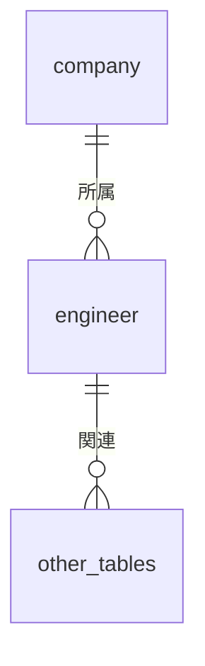

# 技術者管理 - 基本情報テーブル

## 1. テーブル構成概要

技術者管理モジュールの基本情報は、主に技術者（エンジニア）自身の情報と所属する会社の情報から構成されます。これらのデータは技術者管理の根幹となり、他の全ての関連テーブルから参照される基盤データとなります。

### エンティティ関連図

## 2. テーブル定義

### 2.1 engineer テーブル

技術者の基本情報を管理するテーブルです。個人情報、連絡先、雇用形態、稼働状況などの情報を保持します。

#### テーブル定義

| カラム名 | データ型 | NULL | デフォルト | 説明 |
|---------|---------|------|-----------|------|
| id | serial | NOT NULL | | 技術者ID（主キー） |
| company_id | integer | NOT NULL | | 所属会社ID（外部キー） |
| employee_code | varchar(20) | | | 社員番号 |
| last_name | varchar(50) | NOT NULL | | 姓 |
| first_name | varchar(50) | NOT NULL | | 名 |
| last_name_kana | varchar(50) | | | 姓（カナ） |
| first_name_kana | varchar(50) | | | 名（カナ） |
| birth_date | date | | | 生年月日 |
| gender | varchar(10) | | | 性別（male/female/other） |
| email | varchar(100) | NOT NULL | | メールアドレス |
| phone | varchar(20) | | | 電話番号 |
| postal_code | varchar(10) | | | 郵便番号 |
| address | varchar(200) | | | 住所 |
| employment_type | varchar(20) | NOT NULL | 'permanent' | 雇用形態（permanent/contract/freelance） |
| joining_date | date | | | 入社日 |
| leaving_date | date | | | 退職日 |
| status | varchar(20) | NOT NULL | 'active' | ステータス（active/inactive/pending） |
| current_status | varchar(20) | NOT NULL | 'available' | 稼働状況（available/assigned/training/leave） |
| availability_date | date | | | 稼働可能日 |
| preferred_work_type | varchar(50) | | | 希望職種 |
| preferred_work_location | varchar(100) | | | 希望勤務地 |
| preferred_unit_price | numeric(10,2) | | | 希望単価 |
| skill_summary | text | | | スキル概要 |
| note | text | | | 備考 |
| created_by | integer | NOT NULL | | 作成者ID |
| created_at | timestamp | NOT NULL | CURRENT_TIMESTAMP | 作成日時 |
| updated_by | integer | | | 更新者ID |
| updated_at | timestamp | | | 更新日時 |

**制約**:
- PRIMARY KEY (id)
- FOREIGN KEY (company_id) REFERENCES company(id)
- UNIQUE (employee_code, company_id)
- CHECK (employment_type IN ('permanent', 'contract', 'freelance', 'partner'))
- CHECK (status IN ('active', 'inactive', 'pending'))
- CHECK (current_status IN ('available', 'assigned', 'training', 'leave'))
- CHECK (leaving_date IS NULL OR leaving_date > joining_date)

**インデックス**:
- ix_engineer_company_id (company_id)
- ix_engineer_name (last_name, first_name)
- ix_engineer_status (status)
- ix_engineer_current_status (current_status)
- ix_engineer_availability_date (availability_date)
- ix_engineer_preferred_unit_price (preferred_unit_price)

### 2.2 company テーブル

自社および協力会社の情報を管理するテーブルです。

#### テーブル定義

| カラム名 | データ型 | NULL | デフォルト | 説明 |
|---------|---------|------|-----------|------|
| id | serial | NOT NULL | | 会社ID（主キー） |
| company_code | varchar(20) | NOT NULL | | 会社コード |
| name | varchar(100) | NOT NULL | | 会社名 |
| name_kana | varchar(100) | | | 会社名（カナ） |
| type | varchar(20) | NOT NULL | 'own' | 会社種別（own/partner/client） |
| postal_code | varchar(10) | | | 郵便番号 |
| address | varchar(200) | | | 住所 |
| phone | varchar(20) | | | 電話番号 |
| fax | varchar(20) | | | FAX番号 |
| website | varchar(100) | | | Webサイト |
| established_date | date | | | 設立日 |
| capital | numeric(15,2) | | | 資本金 |
| employee_count | integer | | | 従業員数 |
| main_business | text | | | 主要事業 |
| contract_date | date | | | 契約締結日 |
| contract_type | varchar(50) | | | 契約種別 |
| contact_person_name | varchar(50) | | | 担当者名 |
| contact_person_email | varchar(100) | | | 担当者メールアドレス |
| contact_person_phone | varchar(20) | | | 担当者電話番号 |
| commission_rate | numeric(5,2) | | | 紹介手数料率（%） |
| rating | integer | | | 評価（1-5） |
| status | varchar(20) | NOT NULL | 'active' | ステータス（active/inactive/suspended） |
| note | text | | | 備考 |
| created_by | integer | NOT NULL | | 作成者ID |
| created_at | timestamp | NOT NULL | CURRENT_TIMESTAMP | 作成日時 |
| updated_by | integer | | | 更新者ID |
| updated_at | timestamp | | | 更新日時 |

**制約**:
- PRIMARY KEY (id)
- UNIQUE (company_code)
- CHECK (type IN ('own', 'partner', 'client'))
- CHECK (status IN ('active', 'inactive', 'suspended'))
- CHECK (rating IS NULL OR (rating >= 1 AND rating <= 5))
- CHECK (commission_rate IS NULL OR (commission_rate >= 0 AND commission_rate <= 100))

**インデックス**:
- ix_company_name (name)
- ix_company_type (type)
- ix_company_status (status)
- ix_company_contact_person_name (contact_person_name)

## 3. クエリパターンと最適化

### 3.1 代表的なクエリパターン

#### 技術者検索と絞り込み

技術者検索は、案件のアサインやリソース計画において頻繁に行われる重要な操作です。以下のような複合条件での検索が想定されます：

1. **稼働状況による絞り込み**

2. **スキルセットによる検索**（engineer_skillテーブルとの結合が必要）

3. **単価範囲での検索**

4. **勤務地や希望条件での絞り込み**

5. **所属企業タイプでの絞り込み**

#### 会社情報と所属技術者一覧

協力会社ごとの技術者の一覧や稼働状況の確認など、会社単位での集計や一覧表示が頻繁に行われます。

### 3.2 パフォーマンス最適化

#### インデックス戦略

- 技術者テーブルのフィルタ検索で使用頻度が高いカラムには個別にインデックスを設定
- 複合条件での検索が多いカラムの組み合わせには複合インデックスを検討
- 会社タイプと技術者ステータスの組み合わせでの検索が多いため、両方のインデックスを活用

#### 検索結果のキャッシュ

- 頻繁に行われる検索条件のパターンに対して、結果をキャッシュする戦略を検討
- 定期的なレポート生成や統計情報については、マテリアライズドビューの活用を検討

## 4. セキュリティ考慮事項

### 4.1 個人情報保護

技術者テーブルには個人情報が多く含まれるため、以下の対策を実施します：

- 個人情報への参照は適切な権限管理を実施
- 生年月日、住所などのセンシティブな情報には列レベルの権限設定
- 退職者の情報は匿名化ポリシーに従って処理

### 4.2 監査ログ

- 技術者情報の作成・更新・削除操作については監査ログを記録
- 特に重要な情報（単価、ステータス変更など）の変更履歴は詳細に記録

## 5. 運用時の注意点

### 5.1 データメンテナンス

- 退職者の情報は一定期間経過後にアーカイブテーブルへ移動
- 非アクティブ状態の技術者は定期的なステータスレビューを実施
- 協力会社情報は年1回の情報更新を依頼し、最新状態を維持

### 5.2 データ整合性の維持

- 技術者と会社間の整合性は外部キー制約で保証
- 技術者のステータス変更時に関連テーブル（稼働状況など）との整合性を確認
- 所属会社の廃業や契約終了時には、所属技術者のステータス一括更新プロセスを実施