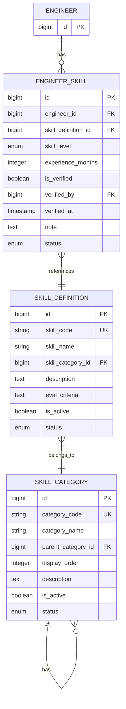

# 技術者管理モジュール - スキル関連テーブル

## 1. 概要

技術者のスキル情報を管理するテーブル群について記述します。技術者が保有するスキルとそのレベル、スキルの分類、スキル定義などを管理し、マッチングエンジンの中核となるデータを提供します。

## 2. テーブル関連図



## 3. engineer_skill テーブル

技術者が保有するスキルとそのレベルを管理するテーブルです。

### 3.1 テーブル定義

| カラム名 | データ型 | NULL | デフォルト | 説明 |
|---------|---------|------|-----------|------|
| id | bigserial | NOT NULL | | 主キー |
| engineer_id | bigint | NOT NULL | | 技術者ID (外部キー) |
| skill_definition_id | bigint | NOT NULL | | スキル定義ID (外部キー) |
| skill_level | skill_level | NOT NULL | | スキルレベル (列挙型:1-5) |
| experience_months | integer | NOT NULL | 0 | 経験月数 |
| is_verified | boolean | NOT NULL | false | 検証済フラグ |
| verified_by | bigint | NULL | | 検証者ID (外部キー) |
| verified_at | timestamp | NULL | | 検証日時 |
| note | text | NULL | | 備考 |
| status | record_status | NOT NULL | 'ACTIVE' | レコード状態 (列挙型) |
| created_at | timestamp | NOT NULL | CURRENT_TIMESTAMP | 作成日時 |
| updated_at | timestamp | NOT NULL | CURRENT_TIMESTAMP | 更新日時 |
| created_by | bigint | NOT NULL | | 作成者ID (外部キー) |
| updated_by | bigint | NOT NULL | | 更新者ID (外部キー) |

**主キー制約**:
- PRIMARY KEY (id)

**一意制約**:
- UNIQUE (engineer_id, skill_definition_id)

**外部キー制約**:
- FOREIGN KEY (engineer_id) REFERENCES engineer(id)
- FOREIGN KEY (skill_definition_id) REFERENCES skill_definition(id)
- FOREIGN KEY (verified_by) REFERENCES users(id)
- FOREIGN KEY (created_by) REFERENCES users(id)
- FOREIGN KEY (updated_by) REFERENCES users(id)

**チェック制約**:
- CHECK (experience_months >= 0)
- CHECK (is_verified = false OR (verified_by IS NOT NULL AND verified_at IS NOT NULL))

### 3.2 インデックス

| インデックス名 | インデックスタイプ | カラム | 説明 |
|--------------|-----------------|-------|------|
| pk_engineer_skill | PRIMARY KEY | id | 主キーインデックス |
| uix_engineer_skill_engineer_skill | UNIQUE | engineer_id, skill_definition_id | 技術者とスキルの組み合わせの一意性保証 |
| ix_engineer_skill_engineer_id | BTREE | engineer_id | 技術者別のスキル検索向け |
| ix_engineer_skill_skill_definition_id | BTREE | skill_definition_id | スキル別の技術者検索向け |
| ix_engineer_skill_skill_level | BTREE | skill_level | スキルレベルでの絞り込み |
| ix_engineer_skill_is_verified | BTREE | is_verified | 検証状態での絞り込み |

### 3.3 列挙型

#### skill_level
- `LEVEL_1`: 基本的な知識がある（1）
- `LEVEL_2`: 基本的な業務経験がある（2）
- `LEVEL_3`: 一人で業務遂行可能（3）
- `LEVEL_4`: 高度な知識と経験あり（4）
- `LEVEL_5`: エキスパート/指導可能（5）

## 4. skill_definition テーブル

システムで管理するスキル項目のマスターデータを格納するテーブルです。

### 4.1 テーブル定義

| カラム名 | データ型 | NULL | デフォルト | 説明 |
|---------|---------|------|-----------|------|
| id | bigserial | NOT NULL | | 主キー |
| skill_code | varchar(50) | NOT NULL | | スキルコード (一意) |
| skill_name | varchar(100) | NOT NULL | | スキル名称 |
| skill_category_id | bigint | NOT NULL | | スキルカテゴリID (外部キー) |
| description | text | NULL | | 説明 |
| eval_criteria | text | NULL | | 評価基準 |
| is_active | boolean | NOT NULL | true | 有効フラグ |
| status | record_status | NOT NULL | 'ACTIVE' | レコード状態 (列挙型) |
| created_at | timestamp | NOT NULL | CURRENT_TIMESTAMP | 作成日時 |
| updated_at | timestamp | NOT NULL | CURRENT_TIMESTAMP | 更新日時 |
| created_by | bigint | NOT NULL | | 作成者ID (外部キー) |
| updated_by | bigint | NOT NULL | | 更新者ID (外部キー) |

**主キー制約**:
- PRIMARY KEY (id)

**一意制約**:
- UNIQUE (skill_code)

**外部キー制約**:
- FOREIGN KEY (skill_category_id) REFERENCES skill_category(id)
- FOREIGN KEY (created_by) REFERENCES users(id)
- FOREIGN KEY (updated_by) REFERENCES users(id)

### 4.2 インデックス

| インデックス名 | インデックスタイプ | カラム | 説明 |
|--------------|-----------------|-------|------|
| pk_skill_definition | PRIMARY KEY | id | 主キーインデックス |
| uix_skill_definition_skill_code | UNIQUE | skill_code | スキルコードの一意性保証 |
| ix_skill_definition_skill_name | BTREE | skill_name | スキル名での検索向け |
| ix_skill_definition_skill_category_id | BTREE | skill_category_id | カテゴリ別のスキル検索向け |
| ix_skill_definition_is_active | BTREE | is_active | 有効なスキルのみの絞り込み |

## 5. skill_category テーブル

スキルのグループ化のためのカテゴリを管理するテーブルです。

### 5.1 テーブル定義

| カラム名 | データ型 | NULL | デフォルト | 説明 |
|---------|---------|------|-----------|------|
| id | bigserial | NOT NULL | | 主キー |
| category_code | varchar(50) | NOT NULL | | カテゴリコード (一意) |
| category_name | varchar(100) | NOT NULL | | カテゴリ名称 |
| parent_category_id | bigint | NULL | | 親カテゴリID (自己参照) |
| display_order | integer | NOT NULL | 0 | 表示順 |
| description | text | NULL | | 説明 |
| is_active | boolean | NOT NULL | true | 有効フラグ |
| status | record_status | NOT NULL | 'ACTIVE' | レコード状態 (列挙型) |
| created_at | timestamp | NOT NULL | CURRENT_TIMESTAMP | 作成日時 |
| updated_at | timestamp | NOT NULL | CURRENT_TIMESTAMP | 更新日時 |
| created_by | bigint | NOT NULL | | 作成者ID (外部キー) |
| updated_by | bigint | NOT NULL | | 更新者ID (外部キー) |

**主キー制約**:
- PRIMARY KEY (id)

**一意制約**:
- UNIQUE (category_code)

**外部キー制約**:
- FOREIGN KEY (parent_category_id) REFERENCES skill_category(id)
- FOREIGN KEY (created_by) REFERENCES users(id)
- FOREIGN KEY (updated_by) REFERENCES users(id)

**チェック制約**:
- CHECK (display_order >= 0)

### 5.2 インデックス

| インデックス名 | インデックスタイプ | カラム | 説明 |
|--------------|-----------------|-------|------|
| pk_skill_category | PRIMARY KEY | id | 主キーインデックス |
| uix_skill_category_category_code | UNIQUE | category_code | カテゴリコードの一意性保証 |
| ix_skill_category_parent_category_id | BTREE | parent_category_id | 親カテゴリでの検索向け |
| ix_skill_category_display_order | BTREE | display_order | 表示順でのソート |
| ix_skill_category_is_active | BTREE | is_active | 有効なカテゴリのみの絞り込み |

## 6. 初期データ

### 6.1 skill_category 初期データ例

以下のようなスキルカテゴリの初期データを設定します。

| category_code | category_name | parent_category_id | display_order |
|--------------|--------------|-------------------|--------------|
| PROG_LANG | プログラミング言語 | NULL | 10 |
| FRAMEWORK | フレームワーク | NULL | 20 |
| DB | データベース | NULL | 30 |
| OS | OS | NULL | 40 |
| MIDDLEWARE | ミドルウェア | NULL | 50 |
| CLOUD | クラウド | NULL | 60 |
| TOOL | 開発ツール | NULL | 70 |
| METHOD | 開発手法 | NULL | 80 |
| BUSINESS | 業務知識 | NULL | 90 |
| JAVA | Java | PROG_LANG | 11 |
| CSHARP | C# | PROG_LANG | 12 |
| PYTHON | Python | PROG_LANG | 13 |
| JAVASCRIPT | JavaScript | PROG_LANG | 14 |
| TYPESCRIPT | TypeScript | PROG_LANG | 15 |
| SPRING | Spring | FRAMEWORK | 21 |
| DOTNET | .NET | FRAMEWORK | 22 |
| DJANGO | Django | FRAMEWORK | 23 |
| REACT | React | FRAMEWORK | 24 |
| ANGULAR | Angular | FRAMEWORK | 25 |

### 6.2 skill_definition 初期データ例

以下のようなスキル定義の初期データを設定します。

| skill_code | skill_name | skill_category_id | description |
|-----------|-----------|-----------------|------------|
| JAVA_CORE | Java基礎 | JAVA | Java言語の基本的な知識と経験 |
| JAVA_ADV | Java応用 | JAVA | Javaの高度な機能の知識と経験 |
| SPRING_BOOT | Spring Boot | SPRING | Spring Bootフレームワークの知識と経験 |
| SPRING_MVC | Spring MVC | SPRING | Spring MVCフレームワークの知識と経験 |
| SPRING_DATA | Spring Data | SPRING | Spring Dataの知識と経験 |
| SPRING_SECURITY | Spring Security | SPRING | Spring Securityの知識と経験 |
| POSTGRES | PostgreSQL | DB | PostgreSQLの知識と経験 |
| ORACLE | Oracle | DB | Oracleデータベースの知識と経験 |
| SQL_SERVER | SQL Server | DB | SQL Serverの知識と経験 |
| MYSQL | MySQL | DB | MySQLの知識と経験 |
| MONGODB | MongoDB | DB | MongoDBの知識と経験 |
| LINUX | Linux | OS | Linuxの知識と経験 |
| WINDOWS | Windows | OS | Windowsの知識と経験 |
| DOCKER | Docker | MIDDLEWARE | Dockerの知識と経験 |
| KUBERNETES | Kubernetes | MIDDLEWARE | Kubernetesの知識と経験 |
| AWS | AWS | CLOUD | Amazon Web Servicesの知識と経験 |
| AZURE | Azure | CLOUD | Microsoft Azureの知識と経験 |
| GCP | GCP | CLOUD | Google Cloud Platformの知識と経験 |

## 7. 主要クエリパターン

### 7.1 技術者のスキル検索

#### スキルレベルと経験月数による技術者検索
```
SELECT e.* FROM engineer e
JOIN engineer_skill es ON e.id = es.engineer_id
JOIN skill_definition sd ON es.skill_definition_id = sd.id
WHERE sd.skill_code = 'JAVA_CORE'
  AND es.skill_level >= 'LEVEL_3'
  AND es.experience_months >= 24
```

#### 複数スキル条件での技術者検索
```
SELECT e.*, COUNT(DISTINCT sd.id) as match_count
FROM engineer e
JOIN engineer_skill es ON e.id = es.engineer_id
JOIN skill_definition sd ON es.skill_definition_id = sd.id
WHERE (sd.skill_code = 'SPRING_BOOT' AND es.skill_level >= 'LEVEL_3')
   OR (sd.skill_code = 'POSTGRES' AND es.skill_level >= 'LEVEL_2')
GROUP BY e.id
ORDER BY match_count DESC
```

### 7.2 カテゴリ別スキル検索

#### カテゴリ階層を考慮したスキル検索
```
WITH RECURSIVE category_tree AS (
  SELECT id, category_code, category_name, parent_category_id
  FROM skill_category
  WHERE category_code = 'SPRING'
  
  UNION ALL
  
  SELECT sc.id, sc.category_code, sc.category_name, sc.parent_category_id
  FROM skill_category sc
  JOIN category_tree ct ON sc.parent_category_id = ct.id
)
SELECT sd.* FROM skill_definition sd
JOIN category_tree ct ON sd.skill_category_id = ct.id
WHERE sd.is_active = true
ORDER BY sd.skill_name
```

### 7.3 技術者のスキルサマリー

#### 技術者のスキルレベル分布集計
```
SELECT 
  e.id as engineer_id,
  e.last_name || ' ' || e.first_name as engineer_name,
  sc.category_name,
  COUNT(es.id) as skill_count,
  SUM(CASE WHEN es.skill_level = 'LEVEL_5' THEN 1 ELSE 0 END) as level5_count,
  SUM(CASE WHEN es.skill_level = 'LEVEL_4' THEN 1 ELSE 0 END) as level4_count,
  SUM(CASE WHEN es.skill_level = 'LEVEL_3' THEN 1 ELSE 0 END) as level3_count,
  SUM(CASE WHEN es.skill_level = 'LEVEL_2' THEN 1 ELSE 0 END) as level2_count,
  SUM(CASE WHEN es.skill_level = 'LEVEL_1' THEN 1 ELSE 0 END) as level1_count
FROM engineer e
JOIN engineer_skill es ON e.id = es.engineer_id
JOIN skill_definition sd ON es.skill_definition_id = sd.id
JOIN skill_category sc ON sd.skill_category_id = sc.id
WHERE e.id = :engineerId
GROUP BY e.id, e.last_name, e.first_name, sc.category_name
```

## 8. データメンテナンス

### 8.1 定期メンテナンス処理

#### スキル情報の鮮度保証
技術者のスキル情報が一定期間（例：1年）更新されていない場合に通知を出す処理を実装します。

```
SELECT e.id, e.last_name, e.first_name, e.email_address,
       MAX(es.updated_at) as last_skill_update
FROM engineer e
JOIN engineer_skill es ON e.id = es.engineer_id
WHERE e.employment_status = 'ACTIVE'
GROUP BY e.id, e.last_name, e.first_name, e.email_address
HAVING MAX(es.updated_at) < CURRENT_TIMESTAMP - INTERVAL '1 year'
```

#### スキル定義の利用状況確認
使用されていないスキル定義を特定するクエリです。

```
SELECT sd.id, sd.skill_code, sd.skill_name
FROM skill_definition sd
LEFT JOIN engineer_skill es ON sd.id = es.skill_definition_id
WHERE es.id IS NULL
  AND sd.is_active = true
```

### 8.2 データ整合性チェック

#### スキルレベルと経験月数の整合性チェック
スキルレベルが高いのに経験月数が短いなど、不整合な可能性があるデータを検出します。

```
SELECT es.id, e.last_name, e.first_name, sd.skill_name,
       es.skill_level, es.experience_months
FROM engineer_skill es
JOIN engineer e ON es.engineer_id = e.id
JOIN skill_definition sd ON es.skill_definition_id = sd.id
WHERE (es.skill_level = 'LEVEL_5' AND es.experience_months < 36)
   OR (es.skill_level = 'LEVEL_4' AND es.experience_months < 18)
```

## 9. セキュリティ考慮事項

### 9.1 アクセス制御

- エンジニア自身のスキル情報の編集権限
- スキル検証者としての権限（HR担当者、技術リーダーなど）
- スキルマスターデータの管理権限

### 9.2 監査ログ

- スキル情報の変更履歴を監査ログテーブルに記録
- スキル検証アクションのログ記録

## 10. パフォーマンス最適化

### 10.1 検索最適化

スキルベースの技術者検索はシステムの中核機能であり、以下の最適化を検討します。

- 頻出する検索条件（スキル、レベル、経験月数）に対するインデックス活用
- 複数スキル条件での検索パフォーマンス向上のための工夫
  - マテリアライズドビューの活用
  - キャッシュの検討

### 10.2 マテリアライズドビュー

スキル集計データなど、頻繁に利用される集計情報に対してマテリアライズドビューの活用を検討します。

```
CREATE MATERIALIZED VIEW mv_engineer_skill_summary AS
SELECT 
  e.id as engineer_id,
  e.last_name || ' ' || e.first_name as engineer_name,
  e.employment_status,
  COUNT(es.id) as total_skills,
  SUM(CASE WHEN es.skill_level = 'LEVEL_5' OR es.skill_level = 'LEVEL_4' THEN 1 ELSE 0 END) as expert_skills,
  ARRAY_AGG(DISTINCT sc.category_code) as skill_categories
FROM engineer e
JOIN engineer_skill es ON e.id = es.engineer_id
JOIN skill_definition sd ON es.skill_definition_id = sd.id
JOIN skill_category sc ON sd.skill_category_id = sc.id
WHERE e.status = 'ACTIVE'
GROUP BY e.id, e.last_name, e.first_name, e.employment_status;

CREATE INDEX ix_mv_engineer_skill_summary_categories ON mv_engineer_skill_summary USING GIN(skill_categories);
```

## 11. 運用上の注意点

### 11.1 スキルマスターのメンテナンス

- 新しい技術の追加：常に最新のスキルを反映するため、定期的なマスター更新が必要
- 旧技術の扱い：使用頻度が低下した技術は非アクティブ化（削除ではなく論理的な無効化）
- カテゴリ構造の変更：カテゴリ階層を変更する場合は影響範囲の確認が必要

### 11.2 スキル評価の一貫性確保

- スキル評価基準の明確な定義
- 評価者間での評価基準の統一
- 定期的な評価基準の見直しと調整

### 11.3 データ移行時の注意点

- スキルコードの一貫性確保
- スキルレベル評価尺度の変換マッピング
- 親子関係を持つカテゴリデータの移行順序に注意