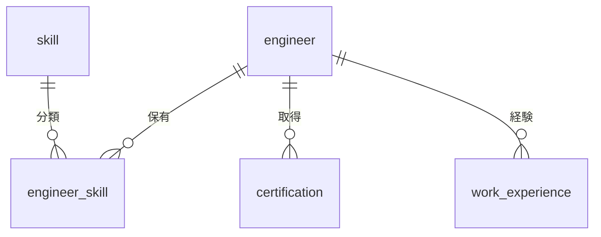

# 技術者管理 - スキル関連テーブル

## 1. テーブル構成概要

技術者管理モジュールのスキル関連情報は、技術者が保有するスキル、資格、経験などの技術力を表すデータを管理します。技術者とスキルの多対多の関係を中心に、スキルのカテゴリや習熟度を含む詳細情報を格納します。

### エンティティ関連図

## 2. テーブル定義

### 2.1 skill テーブル

技術スキル、業務スキル、ソフトスキルなどのスキルマスタデータを管理するテーブルです。

#### テーブル定義

| カラム名 | データ型 | NULL | デフォルト | 説明 |
|---------|---------|------|-----------|------|
| id | serial | NOT NULL | | スキルID（主キー） |
| name | varchar(100) | NOT NULL | | スキル名称 |
| category | varchar(50) | NOT NULL | | カテゴリ（technical/business/soft/other） |
| sub_category | varchar(50) | | | サブカテゴリ |
| description | text | | | 説明 |
| is_searchable | boolean | NOT NULL | true | 検索可能フラグ |
| sort_order | integer | | 0 | 表示順 |
| created_by | integer | NOT NULL | | 作成者ID |
| created_at | timestamp | NOT NULL | CURRENT_TIMESTAMP | 作成日時 |
| updated_by | integer | | | 更新者ID |
| updated_at | timestamp | | | 更新日時 |

**制約**:
- PRIMARY KEY (id)
- UNIQUE (name, category)
- CHECK (category IN ('technical', 'business', 'soft', 'other'))

**インデックス**:
- ix_skill_name (name)
- ix_skill_category (category, sub_category)

### 2.2 engineer_skill テーブル

技術者が保有するスキル情報を管理する中間テーブルです。技術者とスキルの多対多の関連を表現し、習熟度や経験年数などの詳細情報を持ちます。

#### テーブル定義

| カラム名 | データ型 | NULL | デフォルト | 説明 |
|---------|---------|------|-----------|------|
| engineer_id | integer | NOT NULL | | 技術者ID（外部キー） |
| skill_id | integer | NOT NULL | | スキルID（外部キー） |
| proficiency_level | integer | NOT NULL | 1 | 習熟度レベル（1-5） |
| experience_years | numeric(4,1) | | | 経験年数 |
| last_used_date | date | | | 最終使用日 |
| description | text | | | スキル詳細説明 |
| is_public | boolean | NOT NULL | true | 公開フラグ |
| self_rating | integer | | | 自己評価（1-5） |
| manager_rating | integer | | | 管理者評価（1-5） |
| is_featured | boolean | NOT NULL | false | 得意スキルフラグ |
| note | text | | | 備考 |
| created_by | integer | NOT NULL | | 作成者ID |
| created_at | timestamp | NOT NULL | CURRENT_TIMESTAMP | 作成日時 |
| updated_by | integer | | | 更新者ID |
| updated_at | timestamp | | | 更新日時 |

**制約**:
- PRIMARY KEY (engineer_id, skill_id)
- FOREIGN KEY (engineer_id) REFERENCES engineer(id)
- FOREIGN KEY (skill_id) REFERENCES skill(id)
- CHECK (proficiency_level BETWEEN 1 AND 5)
- CHECK (self_rating IS NULL OR (self_rating BETWEEN 1 AND 5))
- CHECK (manager_rating IS NULL OR (manager_rating BETWEEN 1 AND 5))

**インデックス**:
- ix_engineer_skill_engineer_id (engineer_id)
- ix_engineer_skill_skill_id (skill_id)
- ix_engineer_skill_proficiency (proficiency_level)
- ix_engineer_skill_featured (is_featured)

### 2.3 certification テーブル

技術者が保有する資格や認定情報を管理するテーブルです。

#### テーブル定義

| カラム名 | データ型 | NULL | デフォルト | 説明 |
|---------|---------|------|-----------|------|
| id | serial | NOT NULL | | 資格ID（主キー） |
| engineer_id | integer | NOT NULL | | 技術者ID（外部キー） |
| name | varchar(200) | NOT NULL | | 資格名称 |
| certification_id | varchar(50) | | | 資格ID/認定番号 |
| issuing_organization | varchar(100) | | | 発行組織 |
| acquisition_date | date | | | 取得日 |
| expiration_date | date | | | 有効期限 |
| score | varchar(50) | | | スコア/評価 |
| description | text | | | 説明 |
| verification_status | varchar(20) | NOT NULL | 'pending' | 検証状態（verified/pending/rejected） |
| is_public | boolean | NOT NULL | true | 公開フラグ |
| document_path | varchar(255) | | | 証明書ファイルパス |
| note | text | | | 備考 |
| created_by | integer | NOT NULL | | 作成者ID |
| created_at | timestamp | NOT NULL | CURRENT_TIMESTAMP | 作成日時 |
| updated_by | integer | | | 更新者ID |
| updated_at | timestamp | | | 更新日時 |

**制約**:
- PRIMARY KEY (id)
- FOREIGN KEY (engineer_id) REFERENCES engineer(id)
- CHECK (verification_status IN ('verified', 'pending', 'rejected'))
- CHECK (expiration_date IS NULL OR expiration_date > acquisition_date)

**インデックス**:
- ix_certification_engineer_id (engineer_id)
- ix_certification_name (name)
- ix_certification_acquisition_date (acquisition_date)
- ix_certification_expiration_date (expiration_date)

### 2.4 work_experience テーブル

技術者の職務経歴・プロジェクト経験を管理するテーブルです。

#### テーブル定義

| カラム名 | データ型 | NULL | デフォルト | 説明 |
|---------|---------|------|-----------|------|
| id | serial | NOT NULL | | 職務経歴ID（主キー） |
| engineer_id | integer | NOT NULL | | 技術者ID（外部キー） |
| project_name | varchar(200) | NOT NULL | | プロジェクト名 |
| client_name | varchar(100) | | | クライアント名 |
| industry | varchar(50) | | | 業界 |
| role | varchar(100) | | | 役割 |
| start_date | date | NOT NULL | | 開始日 |
| end_date | date | | | 終了日 |
| is_current | boolean | NOT NULL | false | 現在のプロジェクトフラグ |
| description | text | | | 業務内容 |
| team_size | integer | | | チーム規模 |
| responsibilities | text | | | 担当業務 |
| technologies | varchar(500) | | | 使用技術 |
| achievements | text | | | 成果 |
| project_url | varchar(255) | | | プロジェクトURL |
| is_public | boolean | NOT NULL | true | 公開フラグ |
| note | text | | | 備考 |
| created_by | integer | NOT NULL | | 作成者ID |
| created_at | timestamp | NOT NULL | CURRENT_TIMESTAMP | 作成日時 |
| updated_by | integer | | | 更新者ID |
| updated_at | timestamp | | | 更新日時 |

**制約**:
- PRIMARY KEY (id)
- FOREIGN KEY (engineer_id) REFERENCES engineer(id)
- CHECK (end_date IS NULL OR end_date >= start_date)
- CHECK (is_current = false OR end_date IS NULL)

**インデックス**:
- ix_work_experience_engineer_id (engineer_id)
- ix_work_experience_start_date (start_date)
- ix_work_experience_end_date (end_date)
- ix_work_experience_is_current (is_current)
- ix_work_experience_role (role)

## 3. クエリパターンと最適化

### 3.1 代表的なクエリパターン

#### スキルベースの技術者検索

案件とのマッチングやチーム編成において、特定のスキルセットを持つ技術者を検索する操作は最も頻繁に行われます。

1. **特定スキルを持つ技術者の検索**
   - 単一または複数のスキルを指定して技術者を検索
   - 習熟度レベルによるフィルタリング

2. **技術者のスキルプロファイル表示**
   - 技術者ごとのスキル一覧と詳細情報の取得
   - カテゴリ別のスキルグループ化

3. **特定の資格保有者の検索**
   - 指定した資格を持つ技術者の検索
   - 有効期限切れでない資格の確認

4. **プロジェクト経験による検索**
   - 特定の業界や役割での経験を持つ技術者の検索
   - 経験年数や期間によるフィルタリング

### 3.2 パフォーマンス最適化

#### インデックス戦略

- スキル検索の高速化のため、engineer_skillテーブルの技術者IDとスキルIDの両方にインデックスを設定
- 習熟度レベルによる検索のため、proficiency_levelにもインデックスを設定
- 資格の有効期限による検索のため、expiration_dateにインデックスを設定
- プロジェクト経験の期間検索のため、start_dateとend_dateにインデックスを設定

#### 全文検索の活用

- スキル名称や説明、プロジェクト説明などのテキストフィールドには全文検索インデックスの活用を検討
- PostgreSQLのtsvector型とGINインデックスを使用した効率的な検索の実装

#### キャッシュとマテリアライズドビュー

- 頻繁に実行される複雑なスキル検索クエリについては、マテリアライズドビューの作成を検討
- 技術者のスキルサマリー情報など、定期的に更新される集計情報のキャッシュ

## 4. データメンテナンス

### 4.1 スキルマスタの管理

- スキルマスタは定期的にレビューし、新技術の追加や古いスキルの非表示化を実施
- 類似スキルの統合や標準化を定期的に行い、マスタデータの品質を維持
- カテゴリやサブカテゴリの階層構造を適切に管理し、検索性を確保

### 4.2 スキルデータの鮮度維持

- 技術者のスキル情報は半年に1回の更新を促す仕組みを導入
- 長期間更新のないスキルデータには、更新リマインダーを送信
- 最終使用日が古いスキルは自動的に「要確認」フラグを設定

### 4.3 資格情報の管理

- 有効期限付きの資格については、期限切れ前にリマインダーを送信
- 資格の更新状況を定期的に確認し、最新状態を維持
- 証明書ファイルの保存と検証プロセスの管理

## 5. セキュリティ考慮事項

### 5.1 データアクセス制御

- 技術者自身には自分のスキルデータの閲覧・編集権限を付与
- マネージャーには所属チームの技術者スキルデータへのアクセス権を付与
- 人事担当者には全技術者のスキルデータへの読み取り権限を付与
- 営業担当者には技術者の公開スキルデータへのアクセス権を付与

### 5.2 データ公開制御

- スキル情報および職務経歴には公開/非公開フラグを設定し、外部への公開をコントロール
- クライアント情報や機密プロジェクト情報は、公開スキルシートに含めない仕組みを提供
- 技術者の公開範囲設定に基づいたデータフィルタリングを行う

## 6. 運用時の注意点

### 6.1 データ入力ガイドライン

- スキル情報の入力フォーマットの標準化と入力支援機能の提供
- スキルレベルの評価基準の明確化と自己評価/管理者評価の差異の管理
- 職務経歴の詳細度と記述フォーマットの標準化

### 6.2 データ品質の維持

- 入力されたスキル情報の品質チェックと承認プロセスの導入
- スキル評価の客観性を確保するための評価基準とレビュープロセスの確立
- 重複データや不整合データの検出と修正の定期的な実施