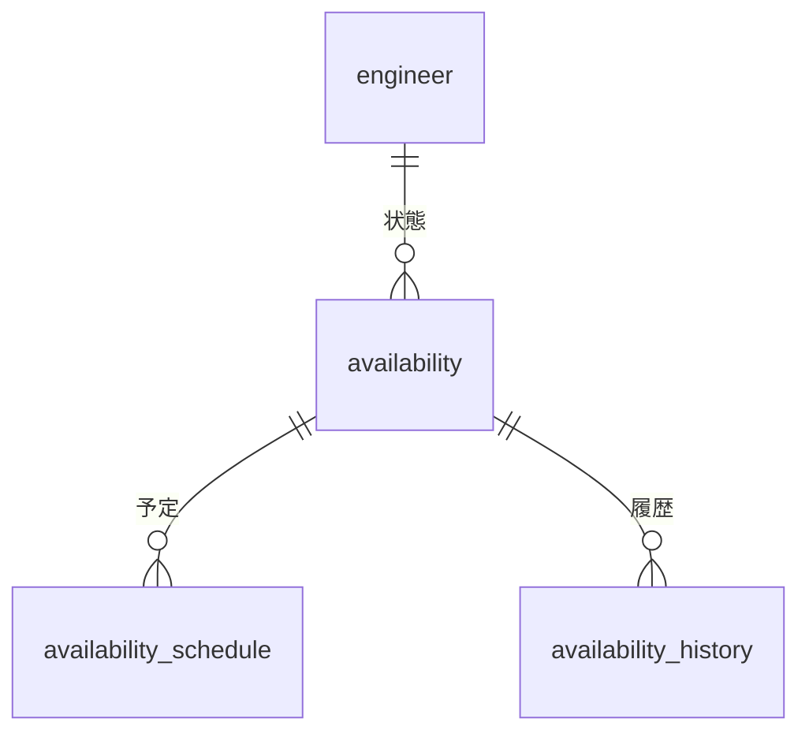

# 技術者管理 - 稼働状況テーブル

## 1. テーブル構成概要

技術者管理モジュールの稼働状況関連テーブルは、技術者の現在および将来の稼働状況を管理します。案件のアサイン状況、稼働率、予定、休暇などの情報を時系列で記録し、リソース計画や稼働率管理の基盤となります。

### エンティティ関連図

## 2. テーブル定義

### 2.1 availability テーブル

技術者の現在の稼働状況を管理するメインテーブルです。

#### テーブル定義

| カラム名 | データ型 | NULL | デフォルト | 説明 |
|---------|---------|------|-----------|------|
| id | serial | NOT NULL | | 稼働状況ID（主キー） |
| engineer_id | integer | NOT NULL | | 技術者ID（外部キー） |
| status | varchar(20) | NOT NULL | 'available' | 稼働状況（available/assigned/training/leave） |
| availability_rate | integer | NOT NULL | 100 | 稼働率（0-100%） |
| start_date | date | NOT NULL | | 状態開始日 |
| end_date | date | | | 状態終了予定日 |
| is_billable | boolean | NOT NULL | true | 請求可能フラグ |
| project_id | integer | | | アサイン案件ID（外部キー） |
| contract_id | integer | | | 契約ID（外部キー） |
| location | varchar(100) | | | 勤務地 |
| work_hours_per_day | numeric(4,2) | | 8.0 | 1日あたり勤務時間 |
| work_days_per_week | numeric(3,1) | | 5.0 | 週あたり勤務日数 |
| remote_work_rate | integer | | 0 | リモート勤務率（0-100%） |
| overtime_availability | boolean | NOT NULL | false | 残業可能フラグ |
| next_availability_date | date | | | 次回稼働可能日 |
| note | text | | | 備考 |
| created_by | integer | NOT NULL | | 作成者ID |
| created_at | timestamp | NOT NULL | CURRENT_TIMESTAMP | 作成日時 |
| updated_by | integer | | | 更新者ID |
| updated_at | timestamp | | | 更新日時 |

**制約**:
- PRIMARY KEY (id)
- FOREIGN KEY (engineer_id) REFERENCES engineer(id)
- FOREIGN KEY (project_id) REFERENCES project(id)
- FOREIGN KEY (contract_id) REFERENCES contract(id)
- CHECK (status IN ('available', 'assigned', 'training', 'leave', 'inactive'))
- CHECK (availability_rate BETWEEN 0 AND 100)
- CHECK (remote_work_rate BETWEEN 0 AND 100)
- CHECK (end_date IS NULL OR end_date >= start_date)
- CHECK (work_hours_per_day BETWEEN 0 AND 24)
- CHECK (work_days_per_week BETWEEN 0 AND 7)

**インデックス**:
- ix_availability_engineer_id (engineer_id)
- ix_availability_status (status)
- ix_availability_project_id (project_id)
- ix_availability_contract_id (contract_id)
- ix_availability_start_date (start_date)
- ix_availability_end_date (end_date)
- ix_availability_next_availability_date (next_availability_date)

### 2.2 availability_schedule テーブル

技術者の将来の稼働予定や計画を管理するテーブルです。

#### テーブル定義

| カラム名 | データ型 | NULL | デフォルト | 説明 |
|---------|---------|------|-----------|------|
| id | serial | NOT NULL | | スケジュールID（主キー） |
| engineer_id | integer | NOT NULL | | 技術者ID（外部キー） |
| schedule_type | varchar(20) | NOT NULL | 'project' | スケジュールタイプ（project/leave/training/other） |
| title | varchar(100) | NOT NULL | | タイトル |
| start_date | date | NOT NULL | | 開始日 |
| end_date | date | | | 終了日 |
| all_day | boolean | NOT NULL | true | 終日フラグ |
| start_time | time | | | 開始時刻（all_day=falseの場合） |
| end_time | time | | | 終了時刻（all_day=falseの場合） |
| recurring_pattern | varchar(50) | | | 繰り返しパターン |
| project_id | integer | | | 案件ID（外部キー） |
| location | varchar(100) | | | 場所 |
| description | text | | | 説明 |
| is_public | boolean | NOT NULL | true | 公開フラグ |
| color | varchar(20) | | | 表示色 |
| status | varchar(20) | NOT NULL | 'confirmed' | ステータス（confirmed/tentative/cancelled） |
| availability_rate | integer | | 100 | 稼働率（0-100%） |
| note | text | | | 備考 |
| created_by | integer | NOT NULL | | 作成者ID |
| created_at | timestamp | NOT NULL | CURRENT_TIMESTAMP | 作成日時 |
| updated_by | integer | | | 更新者ID |
| updated_at | timestamp | | | 更新日時 |

**制約**:
- PRIMARY KEY (id)
- FOREIGN KEY (engineer_id) REFERENCES engineer(id)
- FOREIGN KEY (project_id) REFERENCES project(id)
- CHECK (schedule_type IN ('project', 'leave', 'training', 'meeting', 'other'))
- CHECK (status IN ('confirmed', 'tentative', 'cancelled'))
- CHECK (availability_rate BETWEEN 0 AND 100)
- CHECK (end_date IS NULL OR end_date >= start_date)
- CHECK (all_day = false OR (start_time IS NULL AND end_time IS NULL))
- CHECK (all_day = true OR (start_time IS NOT NULL AND end_time IS NOT NULL))

**インデックス**:
- ix_availability_schedule_engineer_id (engineer_id)
- ix_availability_schedule_project_id (project_id)
- ix_availability_schedule_start_date (start_date)
- ix_availability_schedule_end_date (end_date)
- ix_availability_schedule_type (schedule_type)
- ix_availability_schedule_status (status)

### 2.3 availability_history テーブル

技術者の稼働状況の履歴を記録するテーブルです。稼働状況の変更履歴を時系列で保持します。

#### テーブル定義

| カラム名 | データ型 | NULL | デフォルト | 説明 |
|---------|---------|------|-----------|------|
| id | serial | NOT NULL | | 履歴ID（主キー） |
| engineer_id | integer | NOT NULL | | 技術者ID（外部キー） |
| previous_status | varchar(20) | | | 変更前の稼働状況 |
| new_status | varchar(20) | NOT NULL | | 変更後の稼働状況 |
| previous_project_id | integer | | | 変更前の案件ID |
| new_project_id | integer | | | 変更後の案件ID |
| previous_availability_rate | integer | | | 変更前の稼働率 |
| new_availability_rate | integer | NOT NULL | | 変更後の稼働率 |
| change_date | date | NOT NULL | | 変更日 |
| change_reason | varchar(200) | | | 変更理由 |
| description | text | | | 詳細説明 |
| created_by | integer | NOT NULL | | 作成者ID |
| created_at | timestamp | NOT NULL | CURRENT_TIMESTAMP | 作成日時 |

**制約**:
- PRIMARY KEY (id)
- FOREIGN KEY (engineer_id) REFERENCES engineer(id)
- FOREIGN KEY (previous_project_id) REFERENCES project(id)
- FOREIGN KEY (new_project_id) REFERENCES project(id)
- CHECK (previous_status IN ('available', 'assigned', 'training', 'leave', 'inactive'))
- CHECK (new_status IN ('available', 'assigned', 'training', 'leave', 'inactive'))
- CHECK (previous_availability_rate BETWEEN 0 AND 100)
- CHECK (new_availability_rate BETWEEN 0 AND 100)

**インデックス**:
- ix_availability_history_engineer_id (engineer_id)
- ix_availability_history_change_date (change_date)
- ix_availability_history_previous_project_id (previous_project_id)
- ix_availability_history_new_project_id (new_project_id)

## 3. クエリパターンと最適化

### 3.1 代表的なクエリパターン

#### リソース計画と可用性検索

リソース計画や案件アサインにおいて、稼働可能な技術者を検索する操作は最も頻繁に行われます。

1. **稼働可能な技術者の検索**
   - 指定期間内に稼働可能な技術者を検索
   - 稼働率の条件指定による絞り込み
   - 特定スキルを持つ稼働可能技術者の検索

2. **案件別の稼働状況確認**
   - 案件ごとにアサインされている技術者の一覧
   - 案件の稼働率と人員配置の確認

3. **技術者の稼働状況確認**
   - 技術者ごとの現在・将来の稼働状況の表示
   - 稼働状況の時系列変化の確認

4. **稼働率レポート作成**
   - 部門/チームごとの稼働率集計
   - 期間別の稼働率推移分析

### 3.2 パフォーマンス最適化

#### インデックス戦略

- 稼働状況の期間検索のためstart_dateとend_dateの両方にインデックスを設定
- 技術者IDとステータスの組み合わせ検索が頻繁に行われるため、複合インデックスの検討
- 案件別稼働状況検索のため、project_idにインデックスを設定

#### 時系列データの管理

- 稼働履歴データは時間経過とともに増加するため、パーティショニングの適用を検討
- 古い履歴データは要約テーブルへの移行または圧縮アーカイブを検討

#### ビューとマテリアライズドビュー

- よく使われる稼働状況の一覧表示用にビューを作成
- 稼働率レポートなど、集計情報を保持するマテリアライズドビューの作成

## 4. データメンテナンス

### 4.1 稼働状態の更新管理

- 稼働状況変更時は自動的にavailability_historyテーブルに履歴を記録
- 稼働状況と技術者テーブルの状態整合性を定期的に確認
- スケジュールと実際の稼働状況の差異を検出し、必要に応じて調整

### 4.2 スケジュールデータの管理

- 過去のスケジュールデータは定期的にアーカイブし、アクティブデータを最小限に保持
- 繰り返しパターンのスケジュールは効率的に展開して保持
- キャンセルされたスケジュールの処理とリソース再配置の記録

### 4.3 履歴データの管理

- 履歴データは年次でパーティショニングし、検索効率を維持
- 長期的な傾向分析のための集計テーブルを作成
- 監査要件に基づいた履歴データの保持ポリシーの適用

## 5. セキュリティ考慮事項

### 5.1 データアクセス制御

- 技術者本人には自身の稼働状況の閲覧権限を付与
- プロジェクトマネージャーには担当プロジェクトに関連する技術者の稼働状況への参照権限を付与
- リソース管理者には全技術者の稼働状況の参照・編集権限を付与
- 経営層には稼働状況の集計レポートへのアクセス権を付与

### 5.2 変更履歴の管理

- 稼働状況の変更はすべて履歴として記録し、誰がいつ変更したかを追跡可能に
- 重要な変更（アサイン、解放など）には承認プロセスを設定
- 履歴データの改ざん防止策の実施

## 6. 運用時の注意点

### 6.1 データ整合性の維持

- 技術者の基本情報ステータスと稼働状況テーブルのステータス整合性の確保
- 案件や契約情報との関連整合性の維持
- 稼働率の合計が100%を超えないようなチェック機構の実装

### 6.2 稼働率管理の注意点

- 部分稼働や複数案件兼務の場合の稼働率合計管理
- 休暇や研修などによる部分的な稼働低下の適切な記録
- 稼働率の変更履歴の正確な記録と追跡

### 6.3 スケジュール管理の注意点

- 繰り返しパターンを持つスケジュールの例外処理の適切な管理
- 長期の稼働計画と短期の変更の両立
- スケジュールの競合検出と警告メカニズムの実装