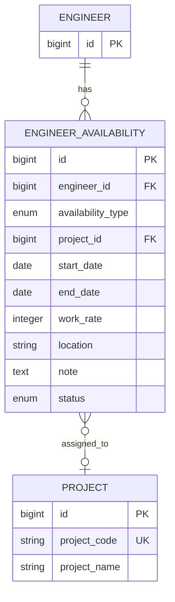

# 技術者管理モジュール - 稼働状況管理テーブル

## 1. 概要

技術者の稼働状況を管理するテーブル構造について記述します。技術者の現在および将来の稼働状況、アサイン状況、稼働率などを管理し、リソース計画やマッチングに必要な情報を提供します。

## 2. テーブル関連図



## 3. engineer_availability テーブル

技術者の稼働状況を管理する主要テーブルです。

### 3.1 テーブル定義

| カラム名 | データ型 | NULL | デフォルト | 説明 |
|---------|---------|------|-----------|------|
| id | bigserial | NOT NULL | | 主キー |
| engineer_id | bigint | NOT NULL | | 技術者ID (外部キー) |
| availability_type | availability_type | NOT NULL | | 稼働状況種別 (列挙型) |
| project_id | bigint | NULL | | 案件ID (外部キー) |
| start_date | date | NOT NULL | | 開始日 |
| end_date | date | NULL | | 終了日 |
| work_rate | integer | NOT NULL | 100 | 稼働率 (0-100) |
| location | varchar(100) | NULL | | 勤務地 |
| note | text | NULL | | 備考 |
| status | record_status | NOT NULL | 'ACTIVE' | レコード状態 (列挙型) |
| created_at | timestamp | NOT NULL | CURRENT_TIMESTAMP | 作成日時 |
| updated_at | timestamp | NOT NULL | CURRENT_TIMESTAMP | 更新日時 |
| created_by | bigint | NOT NULL | | 作成者ID (外部キー) |
| updated_by | bigint | NOT NULL | | 更新者ID (外部キー) |

**主キー制約**:
- PRIMARY KEY (id)

**外部キー制約**:
- FOREIGN KEY (engineer_id) REFERENCES engineer(id)
- FOREIGN KEY (project_id) REFERENCES project(id)
- FOREIGN KEY (created_by) REFERENCES users(id)
- FOREIGN KEY (updated_by) REFERENCES users(id)

**チェック制約**:
- CHECK (work_rate BETWEEN 0 AND 100)
- CHECK (end_date IS NULL OR end_date >= start_date)
- CHECK (availability_type != 'ASSIGNED' OR project_id IS NOT NULL)

### 3.2 インデックス

| インデックス名 | インデックスタイプ | カラム | 説明 |
|--------------|-----------------|-------|------|
| pk_engineer_availability | PRIMARY KEY | id | 主キーインデックス |
| ix_engineer_availability_engineer_id | BTREE | engineer_id | 技術者IDでの検索向け |
| ix_engineer_availability_project_id | BTREE | project_id | 案件IDでの検索向け |
| ix_engineer_availability_type | BTREE | availability_type | 稼働状況種別での絞り込み |
| ix_engineer_availability_date_range | BTREE | start_date, end_date | 期間検索向け |
| ix_engineer_availability_work_rate | BTREE | work_rate | 稼働率での絞り込み |

### 3.3 列挙型

#### availability_type
- `AVAILABLE`: 待機中
- `ASSIGNED`: 稼働中
- `PARTIALLY_AVAILABLE`: 一部稼働可能
- `TRAINING`: 研修中
- `LEAVE`: 休暇中
- `PLANNED_ASSIGNMENT`: アサイン予定

## 4. 主要クエリパターン

### 4.1 技術者の現在の稼働状況確認

```
SELECT e.id, e.last_name, e.first_name, 
       ea.availability_type, ea.project_id, 
       p.project_name, ea.start_date, ea.end_date, ea.work_rate
FROM engineer e
LEFT JOIN (
    SELECT * FROM engineer_availability
    WHERE status = 'ACTIVE'
      AND start_date <= CURRENT_DATE
      AND (end_date IS NULL OR end_date >= CURRENT_DATE)
) ea ON e.id = ea.engineer_id
LEFT JOIN project p ON ea.project_id = p.id
WHERE e.id = :engineerId
```

### 4.2 特定期間に稼働可能な技術者検索

```
SELECT e.id, e.last_name, e.first_name, e.email_address,
       COALESCE(MAX(ea.work_rate), 100) as max_assigned_rate
FROM engineer e
LEFT JOIN engineer_availability ea ON e.id = ea.engineer_id
AND ea.status = 'ACTIVE'
AND ea.start_date <= :endDate
AND (ea.end_date IS NULL OR ea.end_date >= :startDate)
WHERE e.employment_status = 'ACTIVE'
GROUP BY e.id, e.last_name, e.first_name, e.email_address
HAVING COALESCE(SUM(CASE 
    WHEN ea.availability_type IN ('ASSIGNED', 'TRAINING', 'LEAVE', 'PLANNED_ASSIGNMENT') 
    THEN ea.work_rate ELSE 0 END), 0) < 100
```

### 4.3 稼働状況変更履歴の取得

```
SELECT ea.id, ea.availability_type, ea.project_id, p.project_name,
       ea.start_date, ea.end_date, ea.work_rate, ea.created_at,
       u.user_name as created_by_user
FROM engineer_availability ea
JOIN users u ON ea.created_by = u.id
LEFT JOIN project p ON ea.project_id = p.id
WHERE ea.engineer_id = :engineerId
ORDER BY ea.created_at DESC
```

### 4.4 特定期間の稼働率カレンダー生成

```
WITH RECURSIVE dates AS (
    SELECT :startDate::date as date
    UNION ALL
    SELECT date + 1
    FROM dates
    WHERE date < :endDate::date
),
availability AS (
    SELECT d.date, ea.engineer_id, ea.availability_type, ea.work_rate
    FROM dates d
    CROSS JOIN engineer e
    LEFT JOIN engineer_availability ea ON e.id = ea.engineer_id
        AND ea.status = 'ACTIVE'
        AND d.date >= ea.start_date
        AND (ea.end_date IS NULL OR d.date <= ea.end_date)
    WHERE e.id = :engineerId
)
SELECT date, 
       COALESCE(SUM(work_rate), 0) as total_work_rate,
       STRING_AGG(availability_type::text, ', ') as status_list
FROM availability
GROUP BY date
ORDER BY date
```

## 5. データメンテナンス

### 5.1 定期メンテナンス処理

#### 終了日未設定レコードの確認
終了日が設定されていない稼働状況レコードを定期的に確認し、必要に応じて更新します。

```
SELECT ea.id, e.last_name, e.first_name, 
       ea.availability_type, ea.start_date,
       p.project_name, ea.work_rate
FROM engineer_availability ea
JOIN engineer e ON ea.engineer_id = e.id
LEFT JOIN project p ON ea.project_id = p.id
WHERE ea.end_date IS NULL
  AND ea.start_date < CURRENT_DATE - INTERVAL '90 days'
  AND ea.availability_type IN ('ASSIGNED', 'TRAINING', 'LEAVE')
ORDER BY ea.start_date
```

#### 重複・矛盾レコードの検出
同一技術者に対する稼働期間の重複や、稼働率の合計が100%を超える状況を検出します。

```
SELECT e.id, e.last_name, e.first_name, d.date,
       SUM(ea.work_rate) as total_work_rate,
       STRING_AGG(ea.availability_type::text, ', ') as status_list
FROM engineer e
JOIN engineer_availability ea ON e.id = ea.engineer_id
JOIN generate_series(
    GREATEST(ea.start_date, CURRENT_DATE - INTERVAL '30 days')::date,
    COALESCE(ea.end_date, CURRENT_DATE + INTERVAL '90 days')::date,
    '1 day'::interval
) d(date) ON true
WHERE ea.status = 'ACTIVE'
GROUP BY e.id, e.last_name, e.first_name, d.date
HAVING SUM(ea.work_rate) > 100
```

### 5.2 履歴データ管理

稼働状況の変更履歴はシステム内で重要な監査データとなります。以下の方針で管理します。

- 稼働状況の変更は論理削除ではなく、新レコード作成で対応
- 過去データは一定期間（例：3年）経過後にアーカイブ
- 統計分析用にアーカイブ前にサマリーデータを作成

## 6. セキュリティ考慮事項

### 6.1 アクセス制御

- 技術者の稼働状況参照：営業担当者、技術管理者、人事担当者など
- 稼働状況更新：権限を持つ管理者のみ
- プロジェクトへのアサイン：案件管理権限を持つユーザーのみ

### 6.2 監査ログ

- 稼働状況の変更（追加・更新・終了）はすべて監査ログに記録
- 変更者、変更日時、変更内容（前後）を記録
- 特に案件アサイン状態の変更は重点的に監査

## 7. 通知機能との連携

### 7.1 通知トリガーイベント

稼働状況の変更時に以下の通知を発行します。

| イベント | 通知先 | 内容 |
|---------|-------|-----|
| 待機状態への変更 | 営業担当者、技術管理者 | 技術者が稼働可能になった旨の通知 |
| アサイン予定登録 | 技術者本人、技術管理者 | 案件アサイン予定の通知 |
| アサイン状態変更 | 技術者本人、関係者 | アサイン状態変更の通知 |
| 稼働期間終了間近 | 営業担当者、技術管理者 | 稼働終了予定日の事前通知（例：1ヶ月前、1週間前） |

## 8. パフォーマンス最適化

### 8.1 期間検索の最適化

稼働状況は期間（開始日〜終了日）での検索が頻繁に発生するため、以下の最適化を実施します。

- 開始日と終了日の複合インデックス
- よく使われる検索条件に対するマテリアライズドビュー

### 8.2 時系列データの分析向け最適化

期間別の稼働状況分析や稼働率集計などのレポーティング向けに最適化します。

- パーティショニング検討（例：四半期ごと）
- 集計データの事前計算とキャッシュ

### 8.3 稼働率カレンダー表示向け最適化

カレンダー形式での稼働状況表示は、日付範囲展開を含む複雑なクエリになるため最適化します。

- マテリアライズドビューの活用
- キャッシュ戦略の実装

## 9. マテリアライズドビュー例

### 9.1 技術者稼働状況サマリー

技術者ごとの現在の稼働状況を素早く参照するためのマテリアライズドビューです。

```
CREATE MATERIALIZED VIEW mv_current_engineer_availability AS
SELECT 
    e.id as engineer_id,
    e.last_name,
    e.first_name,
    e.primary_job_type,
    COALESCE(ea.availability_type, 'AVAILABLE') as current_status,
    ea.project_id,
    p.project_name,
    ea.start_date,
    ea.end_date,
    ea.work_rate,
    ea.location,
    CASE 
        WHEN ea.end_date IS NOT NULL AND ea.end_date <= CURRENT_DATE + INTERVAL '30 days' 
        THEN true ELSE false 
    END as ending_soon
FROM 
    engineer e
LEFT JOIN (
    SELECT DISTINCT ON (engineer_id) *
    FROM engineer_availability
    WHERE status = 'ACTIVE'
      AND start_date <= CURRENT_DATE
      AND (end_date IS NULL OR end_date >= CURRENT_DATE)
    ORDER BY engineer_id, start_date DESC
) ea ON e.id = ea.engineer_id
LEFT JOIN project p ON ea.project_id = p.id
WHERE 
    e.employment_status = 'ACTIVE'
    AND e.status = 'ACTIVE';

CREATE INDEX ix_mv_current_engineer_availability_status ON mv_current_engineer_availability(current_status);
CREATE INDEX ix_mv_current_engineer_availability_job_type ON mv_current_engineer_availability(primary_job_type);
CREATE INDEX ix_mv_current_engineer_availability_ending_soon ON mv_current_engineer_availability(ending_soon) WHERE ending_soon = true;
```

## 10. 運用上の注意点

### 10.1 稼働状況の整合性確保

- 同一技術者の同一期間における稼働率合計が100%を超えないようにする
- 稼働状況変更時は他の稼働状況レコードへの影響を考慮する
- 稼働中と待機中など、矛盾する状態が同時に存在しないよう注意

### 10.2 稼働状況の変更履歴管理

- 稼働状況の変更はすべて履歴として残す
- 変更理由を備考欄に記録することを推奨
- 過去データの更新は原則として行わず、新規レコード追加または終了日設定で対応

### 10.3 アサイン予定の管理

- アサイン予定は一定期間内に確定または取り消しを行う
- 長期間アサイン予定のままになっているレコードを定期的に確認
- アサイン予定が確定した場合は新規レコード作成ではなく更新で対応