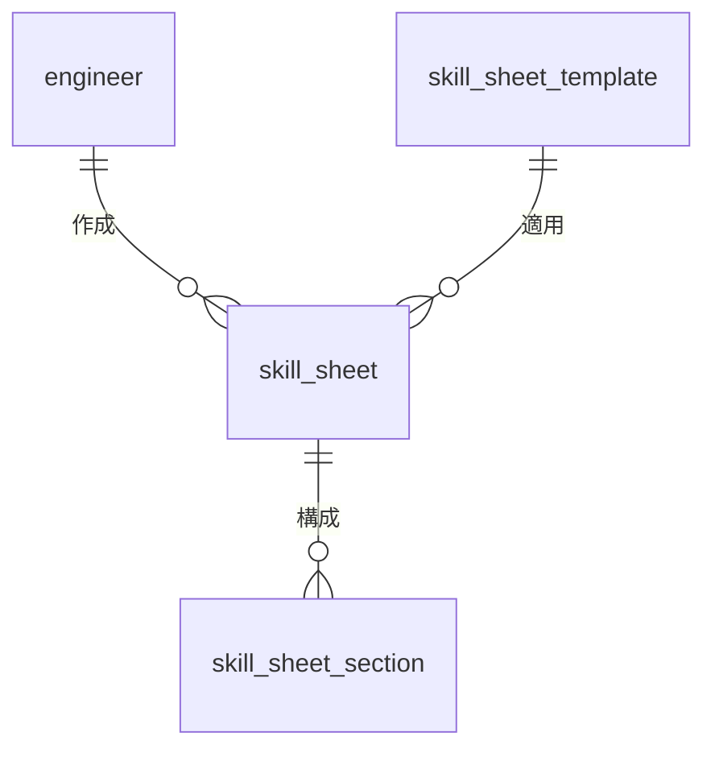

# 技術者管理 - スキルシートテーブル

## 1. テーブル構成概要

技術者管理モジュールのスキルシート関連テーブルは、技術者のスキルシート（経歴書）の作成、管理、バージョン管理を行います。営業提案や顧客提示用のスキルシートを生成し、そのテンプレートや履歴を管理します。

### エンティティ関連図

## 2. テーブル定義

### 2.1 skill_sheet テーブル

技術者のスキルシート（経歴書）を管理するメインテーブルです。

#### テーブル定義

| カラム名 | データ型 | NULL | デフォルト | 説明 |
|---------|---------|------|-----------|------|
| id | serial | NOT NULL | | スキルシートID（主キー） |
| engineer_id | integer | NOT NULL | | 技術者ID（外部キー） |
| template_id | integer | NOT NULL | | テンプレートID（外部キー） |
| title | varchar(100) | NOT NULL | | タイトル |
| version | integer | NOT NULL | 1 | バージョン番号 |
| file_path | varchar(255) | | | 生成されたファイルパス |
| file_type | varchar(20) | NOT NULL | 'pdf' | ファイル形式（pdf/docx/html） |
| is_current | boolean | NOT NULL | true | 現行バージョンフラグ |
| is_public | boolean | NOT NULL | false | 公開フラグ |
| custom_fields | jsonb | | | カスタムフィールド（JSON形式） |
| generation_status | varchar(20) | NOT NULL | 'draft' | 生成状態（draft/generating/completed/failed） |
| last_generated_at | timestamp | | | 最終生成日時 |
| expiration_date | date | | | 有効期限 |
| approval_status | varchar(20) | NOT NULL | 'pending' | 承認状態（pending/approved/rejected） |
| approved_by | integer | | | 承認者ID |
| approved_at | timestamp | | | 承認日時 |
| created_by | integer | NOT NULL | | 作成者ID |
| created_at | timestamp | NOT NULL | CURRENT_TIMESTAMP | 作成日時 |
| updated_by | integer | | | 更新者ID |
| updated_at | timestamp | | | 更新日時 |

**制約**:
- PRIMARY KEY (id)
- FOREIGN KEY (engineer_id) REFERENCES engineer(id)
- FOREIGN KEY (template_id) REFERENCES skill_sheet_template(id)
- FOREIGN KEY (approved_by) REFERENCES user(id)
- UNIQUE (engineer_id, template_id, version)
- CHECK (file_type IN ('pdf', 'docx', 'html', 'text'))
- CHECK (generation_status IN ('draft', 'generating', 'completed', 'failed'))
- CHECK (approval_status IN ('pending', 'approved', 'rejected'))
- CHECK (version > 0)
- CHECK (expiration_date IS NULL OR expiration_date > created_at)

**インデックス**:
- ix_skill_sheet_engineer_id (engineer_id)
- ix_skill_sheet_template_id (template_id)
- ix_skill_sheet_is_current (is_current)
- ix_skill_sheet_is_public (is_public)
- ix_skill_sheet_approval_status (approval_status)
- ix_skill_sheet_generation_status (generation_status)

### 2.2 skill_sheet_template テーブル

スキルシートの生成に使用するテンプレートを管理するテーブルです。

#### テーブル定義

| カラム名 | データ型 | NULL | デフォルト | 説明 |
|---------|---------|------|-----------|------|
| id | serial | NOT NULL | | テンプレートID（主キー） |
| name | varchar(100) | NOT NULL | | テンプレート名 |
| description | text | | | 説明 |
| template_type | varchar(20) | NOT NULL | 'standard' | テンプレートタイプ（standard/client_specific/project_specific） |
| file_path | varchar(255) | NOT NULL | | テンプレートファイルパス |
| file_type | varchar(20) | NOT NULL | 'docx' | テンプレートファイル形式 |
| version | integer | NOT NULL | 1 | バージョン番号 |
| is_active | boolean | NOT NULL | true | 有効フラグ |
| client_id | integer | | | 顧客ID（顧客固有テンプレートの場合） |
| project_id | integer | | | 案件ID（案件固有テンプレートの場合） |
| required_sections | varchar(500) | | | 必須セクション（カンマ区切り） |
| optional_sections | varchar(500) | | | オプションセクション（カンマ区切り） |
| style_settings | jsonb | | | スタイル設定（JSON形式） |
| header_footer_settings | jsonb | | | ヘッダー/フッター設定（JSON形式） |
| default_visibility | jsonb | | | デフォルト公開設定（JSON形式） |
| created_by | integer | NOT NULL | | 作成者ID |
| created_at | timestamp | NOT NULL | CURRENT_TIMESTAMP | 作成日時 |
| updated_by | integer | | | 更新者ID |
| updated_at | timestamp | | | 更新日時 |

**制約**:
- PRIMARY KEY (id)
- FOREIGN KEY (client_id) REFERENCES client(id)
- FOREIGN KEY (project_id) REFERENCES project(id)
- CHECK (template_type IN ('standard', 'client_specific', 'project_specific', 'custom'))
- CHECK (file_type IN ('docx', 'html', 'tex'))
- CHECK (version > 0)
- CHECK ((template_type = 'client_specific' AND client_id IS NOT NULL) OR 
         (template_type = 'project_specific' AND project_id IS NOT NULL) OR 
         (template_type IN ('standard', 'custom')))

**インデックス**:
- ix_skill_sheet_template_name (name)
- ix_skill_sheet_template_type (template_type)
- ix_skill_sheet_template_client_id (client_id)
- ix_skill_sheet_template_project_id (project_id)
- ix_skill_sheet_template_is_active (is_active)

### 2.3 skill_sheet_section テーブル

スキルシート内の各セクション（基本情報、スキル概要、技術スキル、業務経験など）の設定を管理するテーブルです。

#### テーブル定義

| カラム名 | データ型 | NULL | デフォルト | 説明 |
|---------|---------|------|-----------|------|
| id | serial | NOT NULL | | セクションID（主キー） |
| skill_sheet_id | integer | NOT NULL | | スキルシートID（外部キー） |
| section_type | varchar(50) | NOT NULL | | セクションタイプ（basic_info/skill_summary/technical_skills/experience/etc） |
| title | varchar(100) | NOT NULL | | セクションタイトル |
| content | text | | | セクション内容（テンプレート変数を含む） |
| display_order | integer | NOT NULL | 0 | 表示順序 |
| is_visible | boolean | NOT NULL | true | 表示フラグ |
| is_required | boolean | NOT NULL | false | 必須フラグ |
| data_source | varchar(100) | | | データソース（関連テーブル名） |
| filter_condition | jsonb | | | フィルタ条件（JSON形式） |
| style_settings | jsonb | | | スタイル設定（JSON形式） |
| custom_fields | jsonb | | | カスタムフィールド（JSON形式） |
| created_by | integer | NOT NULL | | 作成者ID |
| created_at | timestamp | NOT NULL | CURRENT_TIMESTAMP | 作成日時 |
| updated_by | integer | | | 更新者ID |
| updated_at | timestamp | | | 更新日時 |

**制約**:
- PRIMARY KEY (id)
- FOREIGN KEY (skill_sheet_id) REFERENCES skill_sheet(id)
- CHECK (section_type IN ('basic_info', 'skill_summary', 'technical_skills', 'business_skills',
                          'certifications', 'education', 'work_experience', 'project_experience',
                          'achievements', 'languages', 'self_pr', 'custom'))
- CHECK (display_order >= 0)

**インデックス**:
- ix_skill_sheet_section_skill_sheet_id (skill_sheet_id)
- ix_skill_sheet_section_type (section_type)
- ix_skill_sheet_section_display_order (display_order)
- ix_skill_sheet_section_is_visible (is_visible)

## 3. クエリパターンと最適化

### 3.1 代表的なクエリパターン

#### スキルシート生成と管理

スキルシートの生成、更新、参照は技術者管理モジュールの重要な操作です。

1. **技術者のスキルシート一覧取得**
   - 技術者ごとの作成済みスキルシートの一覧表示
   - テンプレート別、バージョン別の絞り込み

2. **最新のスキルシート取得**
   - 技術者の現行バージョンのスキルシートを取得
   - 特定テンプレートの最新版を取得

3. **スキルシートの内容構築**
   - スキルシート生成のためのデータ集約
   - 各セクションのデータソースからの情報取得

4. **バージョン管理と履歴**
   - スキルシートのバージョン履歴表示
   - バージョン間の差分確認

### 3.2 パフォーマンス最適化

#### インデックス戦略

- 技術者IDとテンプレートIDの組み合わせ検索用の複合インデックス
- 現行バージョンフラグによる検索の高速化
- セクションタイプ別の検索用インデックス

#### JSONBデータの最適化

- カスタムフィールドなどのJSONB型カラムに対するGINインデックスの適用
- よく検索される項目のインデックス式の設定

#### コンテンツキャッシュ

- 生成済みスキルシートのキャッシング
- よく参照されるテンプレート情報のキャッシング

## 4. データメンテナンス

### 4.1 バージョン管理

- 技術者のスキル情報や経歴が更新された場合、スキルシートの新バージョン作成を検討
- バージョン間の重要な変更点を記録
- 古いバージョンの保持ポリシーの設定（保持期間や保持数など）

### 4.2 テンプレート管理

- テンプレートの更新時は影響範囲（使用中のスキルシート）を確認
- テンプレート変更履歴の保持と変更内容の記録
- 使用されなくなった古いテンプレートのアーカイブ

### 4.3 生成ファイルの管理

- 生成されたスキルシートファイルの保存場所と命名規則の標準化
- 長期間参照されていないファイルのアーカイブ処理
- ファイルストレージとデータベースレコードの整合性確認

## 5. セキュリティ考慮事項

### 5.1 アクセス制御

- 技術者には自身のスキルシートへのアクセス権限を付与
- マネージャーには部下のスキルシートへの閲覧・承認権限を付与
- 営業担当者には公開フラグの付いたスキルシートへのアクセス権限を付与
- テンプレート管理者には全テンプレートの管理権限を付与

### 5.2 データ保護

- 個人情報を含むスキルシートのマスキング処理
- 公開用スキルシートと内部用スキルシートの区別
- 外部共有時の有効期限設定と追跡

### 5.3 承認ワークフロー

- スキルシートの公開前の承認プロセスの実装
- 承認ステータスと承認者の記録
- 承認/拒否理由の記録と通知

## 6. 運用時の注意点

### 6.1 テンプレートとデータの整合性

- テンプレート内の変数と実際のデータソースの対応関係の管理
- テンプレート更新時のデータマッピングの見直し
- 変数名の標準化とドキュメント化

### 6.2 生成処理の最適化

- スキルシート生成処理の非同期化
- 生成の進捗状況と結果の通知
- エラーケースの適切な処理とリトライメカニズム

### 6.3 カスタマイズと標準化のバランス

- 顧客/案件固有のカスタマイズ要求への対応方法
- 過度なカスタマイズの抑制と標準テンプレートの活用推進
- カスタマイズ要求のパターン化と再利用可能なコンポーネント化