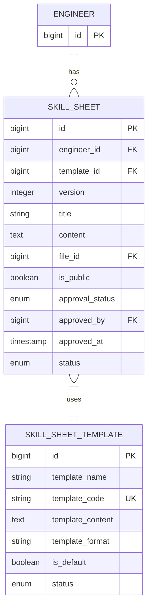

# 技術者管理モジュール - スキルシート関連テーブル

## 1. 概要

技術者のスキルシート（職務経歴書）を管理するテーブル構造について記述します。スキルシートは技術者の経歴、スキル、資格を統合的に表現したドキュメントであり、案件の提案時や顧客へのプレゼンテーションなど、営業活動を支援する重要な資料となります。

## 2. テーブル関連図



## 3. skill_sheet テーブル

技術者のスキルシート情報を管理する主要テーブルです。

### 3.1 テーブル定義

| カラム名 | データ型 | NULL | デフォルト | 説明 |
|---------|---------|------|-----------|------|
| id | bigserial | NOT NULL | | 主キー |
| engineer_id | bigint | NOT NULL | | 技術者ID (外部キー) |
| template_id | bigint | NOT NULL | | テンプレートID (外部キー) |
| version | integer | NOT NULL | 1 | バージョン番号 |
| title | varchar(100) | NOT NULL | | タイトル |
| content | text | NOT NULL | | 内容 |
| file_id | bigint | NULL | | ファイルID (外部キー) |
| is_public | boolean | NOT NULL | false | 公開フラグ |
| approval_status | approval_status | NOT NULL | 'DRAFT' | 承認状態 (列挙型) |
| approved_by | bigint | NULL | | 承認者ID (外部キー) |
| approved_at | timestamp | NULL | | 承認日時 |
| status | record_status | NOT NULL | 'ACTIVE' | レコード状態 (列挙型) |
| created_at | timestamp | NOT NULL | CURRENT_TIMESTAMP | 作成日時 |
| updated_at | timestamp | NOT NULL | CURRENT_TIMESTAMP | 更新日時 |
| created_by | bigint | NOT NULL | | 作成者ID (外部キー) |
| updated_by | bigint | NOT NULL | | 更新者ID (外部キー) |

**主キー制約**:
- PRIMARY KEY (id)

**一意制約**:
- UNIQUE (engineer_id, version)

**外部キー制約**:
- FOREIGN KEY (engineer_id) REFERENCES engineer(id)
- FOREIGN KEY (template_id) REFERENCES skill_sheet_template(id)
- FOREIGN KEY (file_id) REFERENCES files(id)
- FOREIGN KEY (approved_by) REFERENCES users(id)
- FOREIGN KEY (created_by) REFERENCES users(id)
- FOREIGN KEY (updated_by) REFERENCES users(id)

**チェック制約**:
- CHECK (version > 0)
- CHECK (approval_status != 'APPROVED' OR (approved_by IS NOT NULL AND approved_at IS NOT NULL))
- CHECK (is_public = false OR approval_status = 'APPROVED')

### 3.2 インデックス

| インデックス名 | インデックスタイプ | カラム | 説明 |
|--------------|-----------------|-------|------|
| pk_skill_sheet | PRIMARY KEY | id | 主キーインデックス |
| uix_skill_sheet_engineer_version | UNIQUE | engineer_id, version | 技術者とバージョンの一意性保証 |
| ix_skill_sheet_engineer_id | BTREE | engineer_id | 技術者IDでの検索向け |
| ix_skill_sheet_template_id | BTREE | template_id | テンプレートIDでの検索向け |
| ix_skill_sheet_approval_status | BTREE | approval_status | 承認状態での絞り込み |
| ix_skill_sheet_is_public | BTREE | is_public | 公開状態での絞り込み |
| ix_skill_sheet_content | GIN | to_tsvector('japanese', content) | 全文検索用 |

### 3.3 列挙型

#### approval_status
- `DRAFT`: 下書き
- `PENDING`: 承認待ち
- `APPROVED`: 承認済
- `REJECTED`: 却下

## 4. skill_sheet_template テーブル

スキルシートのテンプレートを管理するテーブルです。

### 4.1 テーブル定義

| カラム名 | データ型 | NULL | デフォルト | 説明 |
|---------|---------|------|-----------|------|
| id | bigserial | NOT NULL | | 主キー |
| template_name | varchar(100) | NOT NULL | | テンプレート名 |
| template_code | varchar(50) | NOT NULL | | テンプレートコード (一意) |
| template_content | text | NOT NULL | | テンプレート内容 |
| template_format | varchar(20) | NOT NULL | 'HTML' | テンプレート形式 (HTML/Markdown/Text) |
| is_default | boolean | NOT NULL | false | デフォルトフラグ |
| status | record_status | NOT NULL | 'ACTIVE' | レコード状態 (列挙型) |
| created_at | timestamp | NOT NULL | CURRENT_TIMESTAMP | 作成日時 |
| updated_at | timestamp | NOT NULL | CURRENT_TIMESTAMP | 更新日時 |
| created_by | bigint | NOT NULL | | 作成者ID (外部キー) |
| updated_by | bigint | NOT NULL | | 更新者ID (外部キー) |

**主キー制約**:
- PRIMARY KEY (id)

**一意制約**:
- UNIQUE (template_code)

**外部キー制約**:
- FOREIGN KEY (created_by) REFERENCES users(id)
- FOREIGN KEY (updated_by) REFERENCES users(id)

**チェック制約**:
- CHECK (template_format IN ('HTML', 'MARKDOWN', 'TEXT'))

### 4.2 インデックス

| インデックス名 | インデックスタイプ | カラム | 説明 |
|--------------|-----------------|-------|------|
| pk_skill_sheet_template | PRIMARY KEY | id | 主キーインデックス |
| uix_skill_sheet_template_code | UNIQUE | template_code | テンプレートコードの一意性保証 |
| ix_skill_sheet_template_name | BTREE | template_name | テンプレート名での検索向け |
| ix_skill_sheet_template_is_default | BTREE | is_default | デフォルトテンプレートの検索向け |

## 5. 初期データ

### 5.1 skill_sheet_template 初期データ例

以下のようなスキルシートテンプレートの初期データを設定します。

| template_code | template_name | template_format | is_default |
|--------------|--------------|---------------|-----------|
| DEFAULT | 標準テンプレート | HTML | true |
| SIMPLE | シンプルテンプレート | HTML | false |
| DETAILED | 詳細テンプレート | HTML | false |
| MARKDOWN | Markdownテンプレート | MARKDOWN | false |
| TEXT_ONLY | テキストのみテンプレート | TEXT | false |

## 6. 主要クエリパターン

### 6.1 技術者のスキルシート一覧取得

```
SELECT ss.id, ss.version, ss.title, ss.created_at, ss.updated_at,
       ss.approval_status, u.user_name as approved_by,
       ss.approved_at, ss.is_public
FROM skill_sheet ss
LEFT JOIN users u ON ss.approved_by = u.id
WHERE ss.engineer_id = :engineerId
  AND ss.status = 'ACTIVE'
ORDER BY ss.version DESC
```

### 6.2 最新バージョンのスキルシート取得

```
SELECT ss.* FROM skill_sheet ss
WHERE ss.engineer_id = :engineerId
  AND ss.status = 'ACTIVE'
ORDER BY ss.version DESC
LIMIT 1
```

### 6.3 承認待ちスキルシート一覧

```
SELECT ss.id, e.last_name, e.first_name, ss.title, ss.created_at,
       u.user_name as created_by
FROM skill_sheet ss
JOIN engineer e ON ss.engineer_id = e.id
JOIN users u ON ss.created_by = u.id
WHERE ss.approval_status = 'PENDING'
  AND ss.status = 'ACTIVE'
ORDER BY ss.created_at ASC
```

### 6.4 キーワードによるスキルシート検索

```
SELECT ss.id, e.last_name, e.first_name, ss.title,
       ts_headline('japanese', ss.content, query) as content_snippet
FROM skill_sheet ss
JOIN engineer e ON ss.engineer_id = e.id,
     to_tsquery('japanese', :searchQuery) query
WHERE ss.is_public = true
  AND ss.status = 'ACTIVE'
  AND to_tsvector('japanese', ss.content) @@ query
ORDER BY ts_rank(to_tsvector('japanese', ss.content), query) DESC
```

## 7. データメンテナンス

### 7.1 定期メンテナンス処理

#### 長期未更新スキルシートの特定

一定期間（例：1年）更新されていないスキルシートを特定し、更新を促すためのクエリです。

```
SELECT ss.id, e.last_name, e.first_name, ss.title, ss.updated_at
FROM skill_sheet ss
JOIN engineer e ON ss.engineer_id = e.id
WHERE ss.status = 'ACTIVE'
  AND ss.is_public = true
  AND ss.updated_at < CURRENT_TIMESTAMP - INTERVAL '1 year'
ORDER BY ss.updated_at ASC
```

#### 古いバージョンのアーカイブ

多数のバージョンが存在する場合に、古いバージョンを論理削除（アーカイブ）するクエリです。

```
WITH latest_versions AS (
    SELECT engineer_id, MAX(version) - 5 as archive_below_version
    FROM skill_sheet
    WHERE status = 'ACTIVE'
    GROUP BY engineer_id
    HAVING MAX(version) > 6
)
UPDATE skill_sheet ss
SET status = 'ARCHIVED'
FROM latest_versions lv
WHERE ss.engineer_id = lv.engineer_id
  AND ss.version < lv.archive_below_version
  AND ss.status = 'ACTIVE'
```

### 7.2 バージョン管理

- 新しいバージョンは既存の最大バージョン+1で作成
- 最新バージョンのみを公開設定とし、古いバージョンは非公開に設定
- バージョン間の差分管理は行わず、各バージョンは独立したレコードとして扱う

## 8. セキュリティ考慮事項

### 8.1 アクセス制御

- スキルシート作成：技術者本人、技術管理担当者
- スキルシート承認：承認権限を持つ管理者のみ
- スキルシート閲覧：
  - 公開状態：適切な権限を持つユーザー
  - 非公開状態：技術者本人、技術管理担当者のみ
- テンプレート管理：管理者権限を持つユーザーのみ

### 8.2 監査ログ

- スキルシートの作成・更新・承認・公開時に監査ログを記録
- 特にクライアントへの提出用スキルシートの作成・更新は厳格に監査

## 9. パフォーマンス最適化

### 9.1 全文検索の最適化

スキルシートのコンテンツに対する全文検索を最適化します。

- GINインデックスの活用
- 日本語の形態素解析連携
- パフォーマンス向上のための部分インデックス検討

### 9.2 タグ付け機能の実装

効率的な検索のためにタグ付け機能を検討します。

```
ALTER TABLE skill_sheet ADD COLUMN tags text[] NULL;
CREATE INDEX ix_skill_sheet_tags ON skill_sheet USING GIN(tags);
```

タグベースの検索クエリ:
```
SELECT ss.id, e.last_name, e.first_name, ss.title
FROM skill_sheet ss
JOIN engineer e ON ss.engineer_id = e.id
WHERE ss.is_public = true
  AND ss.status = 'ACTIVE'
  AND ss.tags @> ARRAY[:tag1, :tag2]
```

## 10. テンプレート機能

### 10.1 テンプレート置換変数

テンプレートには以下のような置換変数を定義し、実際のスキルシート生成時に自動置換します。

| 置換変数 | 説明 | データソース |
|---------|------|------------|
| {{ENGINEER_NAME}} | 技術者の氏名 | engineer.last_name + engineer.first_name |
| {{ENGINEER_ID}} | 技術者ID | engineer.id |
| {{EXPERIENCE_YEARS}} | 経験年数 | engineer.years_of_experience |
| {{PRIMARY_SKILL}} | 主要スキル | 技術者のスキルから抽出 |
| {{SKILL_LIST}} | スキル一覧 | engineer_skillテーブルから生成 |
| {{CERTIFICATION_LIST}} | 資格一覧 | certificationテーブルから生成 |
| {{WORK_HISTORY}} | 職務経歴 | work_historyテーブルから生成 |
| {{GENERATION_DATE}} | 生成日 | CURRENT_DATE |

### 10.2 テンプレート処理フロー

スキルシート生成時の処理フローは以下の通りです：

1. テンプレート選択
2. 技術者情報の取得
3. 置換変数のデータ収集
4. テンプレートの置換処理実行
5. 生成コンテンツの保存（スキルシートレコード作成）
6. 必要に応じてファイル生成（PDF/Word）

## 11. ファイル生成機能

### 11.1 ファイル形式

スキルシートは以下の形式でエクスポート可能とします：

- PDF: クライアント提出用標準形式
- Word (DOCX): 編集可能な形式
- HTML: ブラウザ表示用
- Markdown: テキストベースの軽量マークアップ

### 11.2 ファイル保存先

生成されたファイルは以下のルールで保存します：

- ファイル管理モジュールを使用して保存
- ファイル名形式: `engineer_id_YYYYMMDD_version.ext`
- ファイルカテゴリ: `skill_sheet`
- アクセス権限: ファイル管理モジュールの権限設定に従う

## 12. 承認ワークフロー

### 12.1 承認フロー

スキルシートの承認フローは以下のステップで行われます：

1. 作成者がスキルシートを作成（`DRAFT`状態）
2. 作成者が承認依頼を提出（`PENDING`状態に変更）
3. 承認者に通知が送信される
4. 承認者がレビューし、承認または却下
5. 承認の場合は`APPROVED`状態に変更、却下の場合は`REJECTED`状態に変更
6. 結果が作成者に通知される

### 12.2 承認権限管理

承認者には以下のいずれかの権限が必要です：

- 技術管理責任者
- 人事管理責任者
- スキルシート管理者

## 13. 運用上の注意点

### 13.1 テンプレート更新の影響

- テンプレート更新は既存のスキルシートには影響しない
- テンプレート更新後の新規スキルシート作成時のみ新テンプレートが適用される
- テンプレート大幅変更時は既存スキルシートの再生成を検討

### 13.2 スキルシート生成パフォーマンス

- 大量のスキルシート生成は非同期バッチで実行
- 技術者データの変更がスキルシートに自動反映されないことに注意
- スキルシート一括更新機能を提供

### 13.3 ファイルストレージ管理

- 生成されるファイルのストレージ使用量を監視
- 古いバージョンのファイルは定期的にアーカイブを検討
- ファイル生成失敗時のリトライ機構を実装