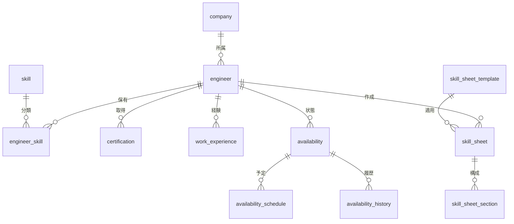

# 技術者管理 テーブル定義補足

## 概要
技術者管理モジュールは、SES事業の中核となる技術者（エンジニア）の情報を管理するためのテーブル群です。技術者の基本情報、保有スキル、資格、稼働状況、職務経歴、スキルシートなどを包括的に管理し、案件とのマッチングや契約管理の基盤となります。

## エンティティ関連図

## テーブル構成

| テーブル名 | 説明 | 主要列 |
|----------|------|-------|
| engineer | 技術者の基本情報を管理 | id, name, email, phone, employment_type, status, availability_date, preferred_unit_price |
| company | 自社および協力会社情報 | id, name, type, address, contact_person |
| skill | スキルマスタデータ | id, name, category, description |
| engineer_skill | 技術者が保有するスキル情報（中間テーブル） | engineer_id, skill_id, proficiency_level, experience_years |
| certification | 技術者の保有資格 | id, engineer_id, name, acquisition_date, expiration_date |
| work_experience | 技術者の職務経歴 | id, engineer_id, project_name, role, start_date, end_date, description |
| skill_sheet | 技術者のスキルシート | id, engineer_id, version, file_path, created_date, is_current, is_public |

## ドキュメント構成

| ドキュメント | 内容 | 最終更新日 |
|------------|------|----------|
| [01_基本情報](./01_基本情報.md) | 技術者と会社の基本情報テーブル | 2023-05-11 |
| [02_スキル](./02_スキル.md) | スキルおよび資格関連テーブル | 2023-05-11 |
| [03_稼働状況](./03_稼働状況.md) | 稼働状況管理テーブル | 2023-05-11 |
| [04_スキルシート](./04_スキルシート.md) | スキルシート管理テーブル | 2023-05-11 |

## インターフェーステーブル

| テーブル名 | 連携モジュール | 概要 |
|----------|--------------|------|
| engineer | 案件管理 | 技術者情報を案件管理モジュールに提供 |
| engineer | マッチング | 技術者とスキル情報をマッチングエンジンに提供 |
| engineer | 契約管理 | 契約の当事者となる技術者情報を提供 |
| engineer | 勤怠工数管理 | 勤怠・工数入力の主体となる技術者情報を提供 |
| skill_sheet | ファイル管理 | スキルシートのファイル実体はファイル管理モジュールで管理 |

## データ量見積もり

| テーブル名 | 想定レコード数 | 増加率 | 備考 |
|----------|--------------|-------|------|
| engineer | 10,000 | 月100件 | 自社および協力会社の技術者 |
| company | 500 | 月5件 | 自社および協力会社 |
| skill | 1,000 | 月10件 | 技術スキル、業務スキル、ソフトスキル等 |
| engineer_skill | 100,000 | 月1,000件 | 技術者1人あたり平均10スキル |
| certification | 15,000 | 月150件 | 技術者1人あたり平均1.5資格 |
| work_experience | 50,000 | 月500件 | 技術者1人あたり平均5プロジェクト |
| skill_sheet | 20,000 | 月200件 | 技術者1人あたり平均2バージョン |