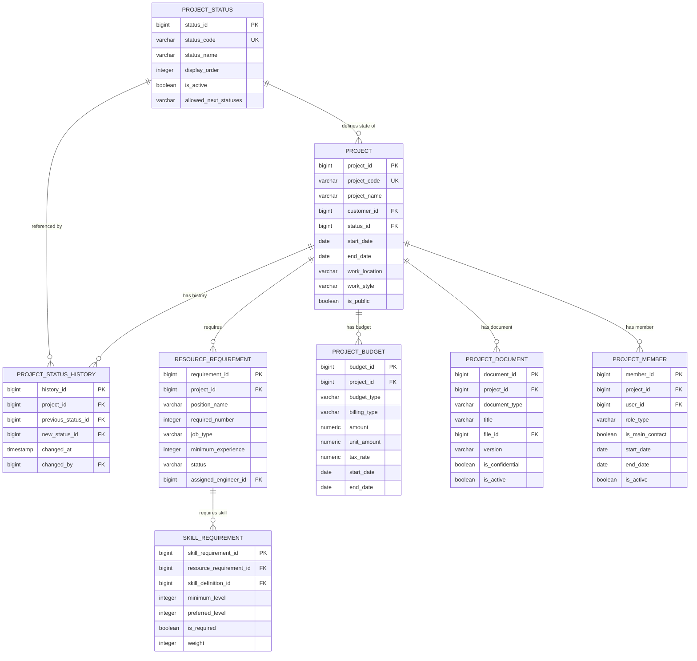

# 案件管理モジュール テーブル定義補足 - 概要

## 1. モジュール概要

案件管理モジュールは、SES事業における案件（プロジェクト）の登録、検索、ステータス管理、要員要件管理など案件のライフサイクル全体を管理するためのテーブル設計を提供します。案件の基本情報、ステータス、要員要件、予算、関連ドキュメントなどの情報を統合的に管理し、技術者マッチングや契約管理、請求支払管理などの他モジュールと連携します。

## 2. テーブル関連図



## 3. スキーマ設計

案件管理モジュールのテーブルは `project` スキーマ内に配置されます。

```
project.project                   # 案件基本情報
project.project_status            # 案件ステータス
project.project_status_history    # 案件ステータス履歴
project.resource_requirement      # 要員要件
project.skill_requirement         # スキル要件
project.project_budget            # 案件予算情報
project.project_document          # 案件ドキュメント
project.project_member            # 案件担当者
```

## 4. 主要テーブルの関連

### 4.1 案件基本情報と関連テーブル

`project` テーブルは案件管理の中心となるテーブルで、以下のテーブルと関連を持ちます：
- `project_status`: 案件の現在のステータスを定義
- `project_status_history`: 案件のステータス変更履歴を記録
- `resource_requirement`: 案件に必要な要員要件を管理
- `project_budget`: 案件の予算情報を管理
- `project_document`: 案件に関連するドキュメントを管理
- `project_member`: 案件の担当者情報を管理

### 4.2 要員要件とスキル要件

`resource_requirement` テーブルは案件に必要な要員の要件を定義し、`skill_requirement` テーブルと1対多の関係を持ちます。この構造により、各要員要件に対して複数のスキル要件を定義できます。

### 4.3 案件ステータス管理

`project_status` テーブルは案件のステータスを定義し、`allowed_next_statuses` 列により次に遷移可能なステータスを管理します。ステータス変更時には、`project_status_history` テーブルに履歴が記録されます。

## 5. 外部モジュールとの連携

### 5.1 技術者管理モジュールとの連携

`resource_requirement` テーブルの `assigned_engineer_id` と `skill_requirement` テーブルを介して、技術者管理モジュールと連携します。要員要件と技術者スキルのマッチングに活用されます。

### 5.2 契約管理モジュールとの連携

案件情報は契約管理モジュールの基盤となり、案件IDを外部キーとして契約テーブルから参照されます。

### 5.3 請求支払管理モジュールとの連携

`project_budget` テーブルの情報は、請求支払管理モジュールで請求書生成や支払い処理の基礎データとして利用されます。

### 5.4 マッチングモジュールとの連携

案件情報と要員要件・スキル要件はマッチングモジュールの検索対象となり、技術者とのマッチング処理に活用されます。

## 6. パフォーマンス考慮事項

1. **検索最適化**: 案件検索の頻度が高いため、project テーブルには複数の検索条件に対応するインデックスを設定
2. **履歴データの管理**: project_status_history テーブルは時系列でのパーティショニングを検討
3. **マッチング検索の効率化**: skill_requirement テーブルには skill_definition_id と minimum_level の複合インデックスを設定
4. **大量データのアーカイブ**: 終了した案件に関するデータの定期的なアーカイブポリシーを設定