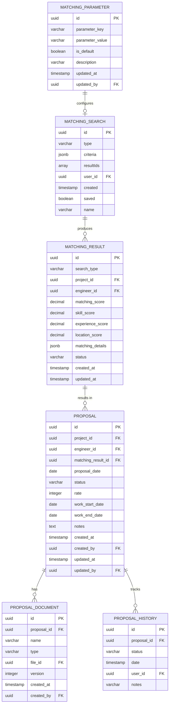

# マッチングモジュール テーブル定義補足 - 概要

## 1. モジュール概要

マッチングモジュールは、SES業務システムの中核として案件と技術者の最適なマッチングを実現するためのテーブル設計を提供します。このモジュールでは、複合条件を用いた多次元マッチングアルゴリズムをサポートし、マッチング結果の管理、提案作成・管理、提案書管理など一連のワークフローに必要なデータ構造を定義しています。

## 2. テーブル関連図



## 3. スキーマ設計

マッチングモジュールのテーブルは `matching` スキーマ内に配置されます。

```
matching.matching_result         # マッチング結果
matching.matching_search         # マッチング検索履歴
matching.matching_parameter      # マッチングパラメータ設定
matching.proposal                # 提案
matching.proposal_document       # 提案書類
matching.proposal_history        # 提案状態履歴
```

## 4. 主要テーブルの関連

### 4.1 マッチング検索と結果

`matching_search` テーブルはユーザーが実行したマッチング検索条件を保存し、`matching_result` テーブルは検索によって生成されたマッチング結果を保存します。一つの検索に対して複数のマッチング結果が生成されます。

### 4.2 マッチング結果と提案

`matching_result` テーブルに保存されたマッチング結果から、営業担当者が提案候補者を選定し、`proposal` テーブルに情報を登録します。一つのマッチング結果から一つの提案が作成されます。

### 4.3 提案と提案書類

`proposal` テーブルに登録された提案に対して、提案書などの書類が `proposal_document` テーブルに登録されます。一つの提案に対して複数の提案書類が登録できます。

### 4.4 提案と提案状態履歴

提案のステータス変更履歴は `proposal_history` テーブルに記録されます。この履歴により、提案の進捗状況を追跡できます。

## 5. 外部モジュールとの連携

### 5.1 案件管理モジュールとの連携

`matching_result` テーブルと `proposal` テーブルの `project_id` 列を通じて、案件管理モジュールの案件情報と連携します。マッチング検索時に案件の要件情報を取得し、マッチングスコアの計算に利用します。

### 5.2 技術者管理モジュールとの連携

`matching_result` テーブルと `proposal` テーブルの `engineer_id` 列を通じて、技術者管理モジュールの技術者情報と連携します。マッチング検索時に技術者のスキル情報や稼働状況を取得し、マッチングスコアの計算に利用します。

### 5.3 契約管理モジュールとの連携

提案が成約になった場合、`proposal` テーブルのデータを基に契約管理モジュールへ情報を連携し、契約情報の作成を行います。提案ステータスが「成約」に変更された際に自動的に連携処理が実行されます。

### 5.4 ファイル管理モジュールとの連携

提案書類の実体は `proposal_document` テーブルの `file_id` 列を通じて、ファイル管理モジュールと連携します。提案書のPDFファイルなどはファイル管理モジュールで管理され、提案書類には参照情報のみを保持します。

## 6. パフォーマンス考慮事項

1. **検索パフォーマンス**: `matching_result` テーブルに対する検索が頻繁に行われるため、`project_id`、`engineer_id`、`status`、`matching_score` 列にインデックスを設定。

2. **マッチング詳細の管理**: マッチング詳細情報は `matching_details` 列でJSONB型として保存し、必要に応じて特定の属性に対するインデックスを作成。

3. **大量データの管理**: マッチング結果は大量に蓄積されるため、古いデータのアーカイブ戦略や、時系列パーティショニングの検討が必要。

4. **提案履歴の効率的な管理**: 提案履歴は増加し続けるため、`proposal_id` と `date` の複合インデックスを設定し、特定の提案の履歴を効率的に取得できるようにする。

5. **マッチングパラメータのキャッシュ**: 頻繁に参照される `matching_parameter` はアプリケーションレベルでキャッシュし、データベースへのアクセスを最小限に抑える。