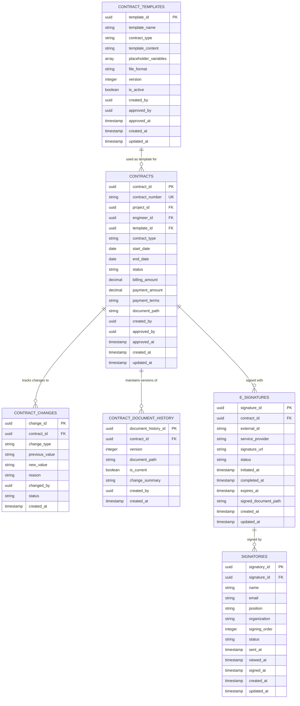

# 契約管理モジュール テーブル定義補足 - 概要

## 1. モジュール概要

契約管理モジュールは、SES業務システムにおける契約書の作成から締結、管理に至るまでの一連のプロセスをサポートするためのテーブル設計を提供します。このモジュールは、案件管理や技術者管理モジュールと連携し、契約情報の登録、契約書の作成、承認ワークフロー、電子署名プロセス、契約の更新・終了管理など、契約ライフサイクル全体を管理します。また、請求支払管理モジュールへの契約情報提供も行います。

## 2. テーブル関連図



## 3. スキーマ設計

契約管理モジュールのテーブルは `contract` スキーマ内に配置されます。

```
contract.contracts                # 契約基本情報
contract.contract_changes         # 契約変更履歴
contract.contract_document_history # 契約書バージョン履歴
contract.e_signatures             # 電子署名情報
contract.signatories              # 署名者情報
contract.contract_templates       # 契約テンプレート
```

## 4. 主要テーブルの関連

### 4.1 契約と契約変更履歴

`contracts` テーブルは契約の基本情報を保持し、`contract_changes` テーブルは契約の変更履歴を記録します。契約の金額、期間、条件などが変更された場合、元の値と新しい値、変更理由などが記録されます。これにより、契約の全ての変更履歴を追跡し、監査証跡として活用できます。

### 4.2 契約と契約書ドキュメント履歴

`contracts` テーブルの契約に対して、`contract_document_history` テーブルが契約書の各バージョンを管理します。契約書の改訂が行われるたびに新しいバージョンが作成され、最新バージョンが `is_current` フラグで示されます。これにより、契約書の全改訂履歴が保持され、いつでも過去のバージョンを参照できます。

### 4.3 契約と電子署名

`contracts` テーブルの契約に対して、`e_signatures` テーブルが電子署名プロセスを管理します。契約ごとに一つの電子署名レコードが作成され、外部電子署名サービス（DocuSignなど）との連携情報や署名の進行状況が記録されます。

### 4.4 電子署名と署名者

`e_signatures` テーブルの電子署名に対して、`signatories` テーブルが署名者の情報と署名状況を管理します。一つの契約には複数の署名者が関与し、各署名者の署名順序や署名状況が記録されます。

### 4.5 契約テンプレートと契約

`contract_templates` テーブルは契約書のテンプレートを管理し、`contracts` テーブルの契約はこれらのテンプレートをベースに作成されます。テンプレートはバージョン管理され、複数のテンプレートが存在し、契約タイプごとにデフォルトテンプレートを設定できます。

## 5. 外部モジュールとの連携

### 5.1 案件管理モジュールとの連携

`contracts` テーブルの `project_id` 列を通じて、案件管理モジュールの案件情報と連携します。契約作成時に案件情報を取得し、契約書の自動生成や契約管理に活用します。

### 5.2 技術者管理モジュールとの連携

`contracts` テーブルの `engineer_id` 列を通じて、技術者管理モジュールの技術者情報と連携します。SES契約や派遣契約では、契約の対象となる技術者情報を契約書に反映するために使用します。

### 5.3 請求支払管理モジュールとの連携

契約が締結されると、`contracts` テーブルの情報を基に請求支払管理モジュールで請求書や支払情報が作成されます。契約の金額や支払条件、期間などが請求・支払処理の基礎となります。

### 5.4 共通機能（ファイル管理）との連携

契約書テンプレートや生成された契約書、署名済み契約書などのファイルは、ファイル管理モジュールで管理されます。`contract_templates`、`contract_document_history`、`e_signatures` テーブルのファイルパス列を通じて、ファイル管理モジュールと連携します。

## 6. パフォーマンス考慮事項

1. **複合検索のパフォーマンス**: 契約の検索は多様な条件（契約種別、ステータス、日付範囲、関連案件・技術者など）で行われるため、`contracts` テーブルには複数の単一列インデックスと複合インデックスを適切に設定。

2. **署名状態の高速取得**: 電子署名の状態確認が頻繁に行われるため、`e_signatures` テーブルと `signatories` テーブルにはステータス関連のインデックスを設定。

3. **履歴テーブルの肥大化対策**: `contract_changes` と `contract_document_history` テーブルは時間とともに成長するため、古いデータのアーカイブ戦略やテーブルパーティショニングを検討。

4. **テンプレート取得の最適化**: 契約作成時にテンプレート選択が行われるため、`contract_templates` テーブルには契約タイプとアクティブ状態のインデックスを設定。

5. **契約ドキュメント管理**: 大量の契約書ファイルを効率的に管理するために、ファイル管理モジュールと連携し、ファイル実体ではなく参照情報のみをデータベースに保存。