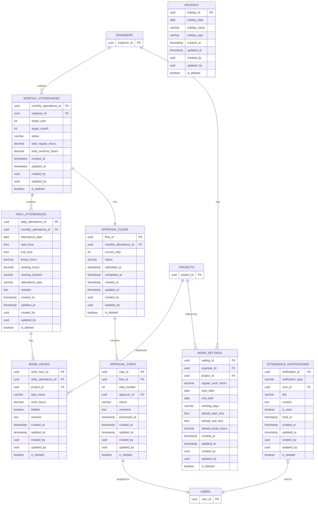

# 勤怠工数管理モジュール概要

## ER図

以下のER図は勤怠工数管理モジュールの主要テーブル間の関連を示しています。

## スキーマ設計概要

勤怠工数管理モジュールは、技術者の勤怠情報および工数実績を管理し、承認ワークフローを通じて請求・支払データの基礎となる情報を提供します。このモジュールは以下のサブドメインで構成されています。

1. **勤怠管理**: 月次勤怠情報と日次勤怠情報を管理
2. **工数管理**: 案件ごとの作業工数情報を管理
3. **承認管理**: 勤怠・工数情報の承認フローを管理
4. **勤務設定**: 技術者ごとの勤務設定と休日情報を管理

### データフロー

1. 技術者が日次の勤怠情報（出退勤時間、休憩時間、勤務場所など）を入力
2. 技術者が案件ごとの工数情報（作業内容、工数、請求可否など）を入力
3. 月末または所定のタイミングで技術者が月次タイムシートを提出
4. 承認フローに従って承認者が承認・却下を行う
5. 最終承認後、承認済み勤怠・工数データが請求支払管理モジュールで利用可能になる

### 主なテーブル間の関連

- `monthly_attendances`テーブルは技術者の月単位の勤怠情報を保持し、`daily_attendances`テーブルと1対多の関係
- `daily_attendances`テーブルは日ごとの勤怠情報を保持し、`work_hours`テーブルと1対多の関係
- `monthly_attendances`テーブルは`approval_flows`テーブルと1対1の関係で、承認フローを管理
- `approval_flows`テーブルは`approval_steps`テーブルと1対多の関係で、承認ステップを管理
- `work_settings`テーブルは技術者と案件の組み合わせごとの勤務設定情報を保持
- `holidays`テーブルは休日カレンダー情報を保持
- `attendance_notifications`テーブルは勤怠関連の通知情報を保持

### データ整合性と制約

- 月次勤怠情報と日次勤怠情報間の整合性（月次合計時間 = 日次時間の合計）
- 日次勤怠情報と工数情報間の整合性（日次合計時間 = 工数の合計）
- 承認ワークフローの状態遷移の整合性（未提出→承認中→承認済み/却下）
- 勤務設定情報と勤怠情報の整合性（設定された勤務時間内での勤怠入力）

### パフォーマンス最適化

- 月次勤怠情報に対する検索・集計クエリの最適化
- 承認フローのステータス検索の最適化
- 日付範囲に基づく勤怠情報検索の最適化
- 請求可能工数の集計処理の最適化

### セキュリティ考慮事項

- 技術者は自身の勤怠・工数データのみアクセス可能
- 承認者は自身が承認対象の勤怠・工数データのみアクセス可能
- 管理者は全ての勤怠・工数データにアクセス可能
- 勤怠・工数データの変更履歴の追跡と監査

## インターフェースポイント

- **技術者管理モジュール**: 技術者情報の参照
- **案件管理モジュール**: 案件情報の参照
- **契約管理モジュール**: 契約条件（稼働時間など）の参照
- **請求支払管理モジュール**: 承認済み勤怠・工数データの提供
- **レポーティングモジュール**: 勤怠・工数データの集計・分析