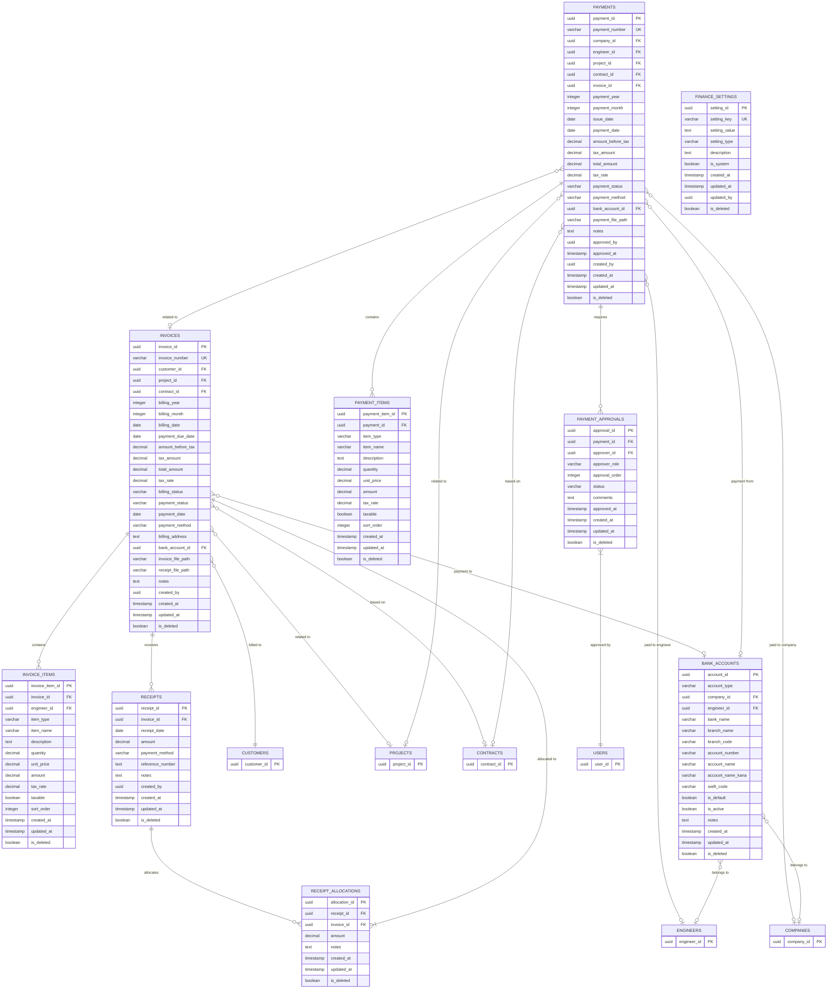

# 請求支払管理モジュール概要

## ER図

以下のER図は請求支払管理モジュールの主要テーブル間の関連を示しています。

## スキーマ設計概要

請求支払管理モジュールは、顧客への請求業務と技術者・協力会社への支払業務を管理するためのデータモデルを提供します。このモジュールは以下のサブドメインで構成されています。

1. **請求管理**: 顧客への請求情報と請求明細情報の管理
2. **支払管理**: 技術者・協力会社への支払情報と支払明細情報の管理
3. **銀行口座管理**: 自社、顧客、技術者、協力会社の銀行口座情報の管理
4. **支払承認管理**: 支払承認ワークフローの管理
5. **入金管理**: 顧客からの入金情報と入金割当の管理
6. **財務設定管理**: 税率や支払条件などの財務設定の管理

### データフロー

1. 勤怠工数管理モジュールから承認された勤怠・工数データを取得
2. 契約管理モジュールから契約条件（単価など）を取得
3. 請求情報を生成（自動または手動）
4. 請求書を生成・発行・送付
5. 入金情報を登録・請求と紐づけ
6. 支払情報を生成（自動または手動）
7. 支払承認ワークフローに沿って承認処理
8. 支払処理の実行・記録

### 主なテーブル間の関連

- `invoices`テーブルは顧客への請求情報を保持し、`invoice_items`テーブルと1対多の関係
- `payments`テーブルは技術者・協力会社への支払情報を保持し、`payment_items`テーブルと1対多の関係
- `invoices`テーブルと`receipts`テーブルは1対多の関係で入金情報を管理
- `receipts`テーブルと`receipt_allocations`テーブルは1対多の関係で入金割当を管理
- `payments`テーブルと`payment_approvals`テーブルは1対多の関係で承認フローを管理
- `bank_accounts`テーブルは技術者または会社に紐づく銀行口座情報を保持

### データ整合性と制約

- 請求書番号・支払書番号の一意性保証
- 請求金額と入金額の整合性（入金割当の合計 = 請求金額）
- 支払承認ステップの順序整合性（順序の重複なし）
- 銀行口座情報の所有者一意性（技術者または会社のいずれか）
- 税率・金額の整合性（税抜金額 + 税額 = 合計金額）

### パフォーマンス最適化

- 請求・支払の年月による検索の最適化
- 請求・支払のステータスによる検索の最適化
- 顧客・案件・技術者・協力会社IDによる検索の最適化
- 期間（日付範囲）による検索の最適化
- 承認ステータスによる検索の最適化

### セキュリティ考慮事項

- 銀行口座情報の保護（暗号化または権限制御）
- 請求・支払金額の改ざん防止
- 承認フローのバイパス防止
- 変更履歴の追跡（監査証跡）
- ロールベースのアクセス制御

## インターフェースポイント

### 内部モジュールとの連携

- **契約管理モジュール**
  - 契約情報の参照（契約条件、単価情報など）
  - 契約に基づく請求・支払条件の取得

- **勤怠工数管理モジュール**
  - 承認済み勤怠・工数データの取得
  - 請求・支払計算の基礎データ利用

- **技術者管理モジュール**
  - 技術者情報の参照
  - 技術者銀行口座情報の参照

- **案件管理モジュール**
  - 案件情報の参照
  - 案件に紐づく契約・請求・支払情報の関連付け

- **共通機能モジュール**
  - ファイル管理（請求書・支払明細書のPDFなど）
  - 通知機能（請求書発行・支払承認通知など）
  - コード値管理（ステータスコードなど）

### 外部システム連携

- **会計システム**
  - 請求・入金・支払データの会計システム連携
  - 仕訳データの生成と連携

- **銀行システム**
  - 振込データ出力（全銀フォーマットなど）
  - 入金データ取込・照合

- **電子請求書ポータル**
  - インボイス制度対応
  - 電子請求書の発行と送信