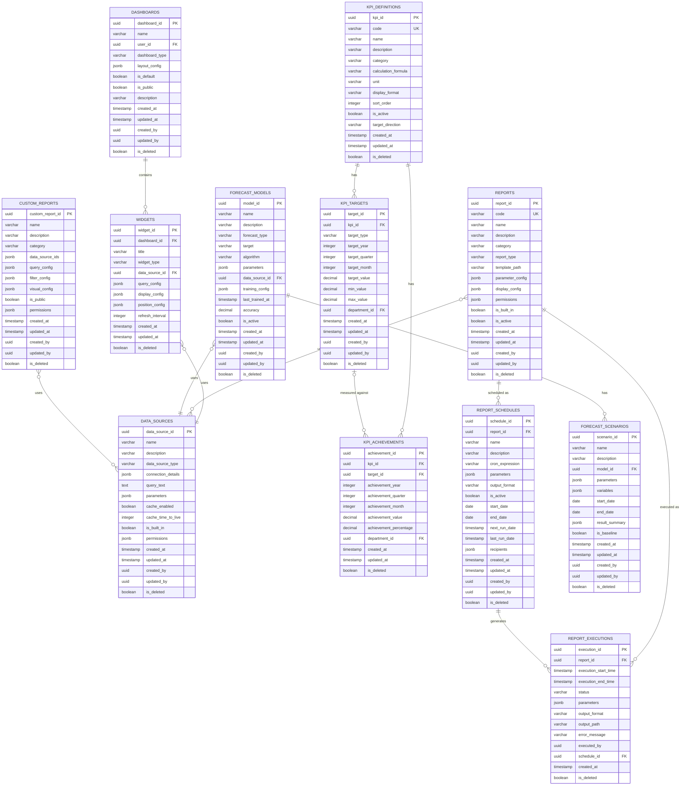

# レポーティングモジュール概要

## ER図

以下のER図はレポーティングモジュールの主要テーブル間の関連を示しています。

## スキーマ設計概要

レポーティングモジュールは、SES業務システム全体から収集したデータを分析・可視化し、経営判断に必要な情報を提供するためのデータモデルを提供します。このモジュールは以下のサブドメインで構成されています。

1. **ダッシュボード管理**: ユーザー別のダッシュボード設定とウィジェット管理
2. **KPI管理**: KPI指標の定義、目標設定、実績管理
3. **レポート管理**: 標準レポートの定義、実行履歴、スケジュール設定
4. **データソース管理**: レポート・ウィジェットのデータソース定義
5. **予測分析**: 予測モデルとシナリオの管理
6. **カスタムレポート**: ユーザー定義のレポート管理

### データフロー

1. 各業務モジュール（案件管理、技術者管理、勤怠工数管理、請求支払管理など）からデータを収集
2. 収集したデータをデータソースとして定義・管理
3. データソースを基にKPI計算、レポート生成、予測分析を実行
4. 分析結果をダッシュボード、レポート、予測シナリオとして提供
5. レポートスケジュールに基づき定期的な自動実行と配信

### 主なテーブル間の関連

- `dashboards`テーブルは、ユーザーごとのダッシュボード設定を保持し、`widgets`テーブルと1対多の関係
- `widgets`テーブルは、ダッシュボード上のウィジェット情報を保持し、`data_sources`テーブルと多対1の関係
- `kpi_definitions`テーブルは、KPI指標の定義を保持し、`kpi_targets`および`kpi_achievements`テーブルと1対多の関係
- `reports`テーブルは、レポート定義を保持し、`report_executions`および`report_schedules`テーブルと1対多の関係
- `data_sources`テーブルは、データソース情報を保持し、複数のウィジェット、レポート、予測モデルから参照される
- `forecast_models`テーブルは、予測モデルの定義を保持し、`forecast_scenarios`テーブルと1対多の関係

### データ整合性と制約

- ダッシュボードとウィジェットの所有権とアクセス制御
- KPI定義のコード体系とカテゴリ分類の整合性
- KPI目標と実績の期間（年次、四半期、月次）の整合性
- レポート実行のステータス遷移の整合性（待機中→実行中→完了/エラー）
- スケジュール設定のクーロン式の妥当性
- データソースの接続情報とクエリの整合性
- 予測モデルのアルゴリズムとパラメータの整合性

### パフォーマンス最適化

- 頻繁にアクセスされるダッシュボードデータのキャッシュ
- KPI実績データの集計テーブル
- レポート実行結果のキャッシュ
- データソースのクエリ結果キャッシュ
- 大規模データセットに対する予測計算の最適化

### セキュリティ考慮事項

- ロールベースのアクセス制御
- データの機密性レベルに基づく参照制限
- 個人情報や機密情報の匿名化・マスキング
- レポート配信と共有の制限
- 監査証跡の記録

## インターフェースポイント

### 内部モジュールとの連携

- **共通機能モジュール**
  - ユーザー情報と権限管理
  - ファイル管理（レポート出力ファイルの保存）
  - 通知管理（レポート配信、アラート通知）
  - コード値管理（KPIコード、レポートコードなど）

- **請求支払管理モジュール**
  - 売上データの取得
  - 粗利データの取得
  - 請求・支払状況の取得

- **勤怠工数管理モジュール**
  - 稼働データの取得
  - 勤怠実績の取得

- **技術者管理モジュール**
  - 技術者情報の取得
  - スキル情報の取得
  - アサイン状況の取得

- **案件管理モジュール**
  - 案件情報の取得
  - 案件状況の取得

### 外部システム連携

- **メール配信システム**
  - レポート自動配信
  - アラート通知

- **BIツール**
  - データエクスポート
  - ダッシュボード連携

- **データウェアハウス**
  - 外部データウェアハウスへのデータ連携
  - 高度な分析のためのデータエクスポート