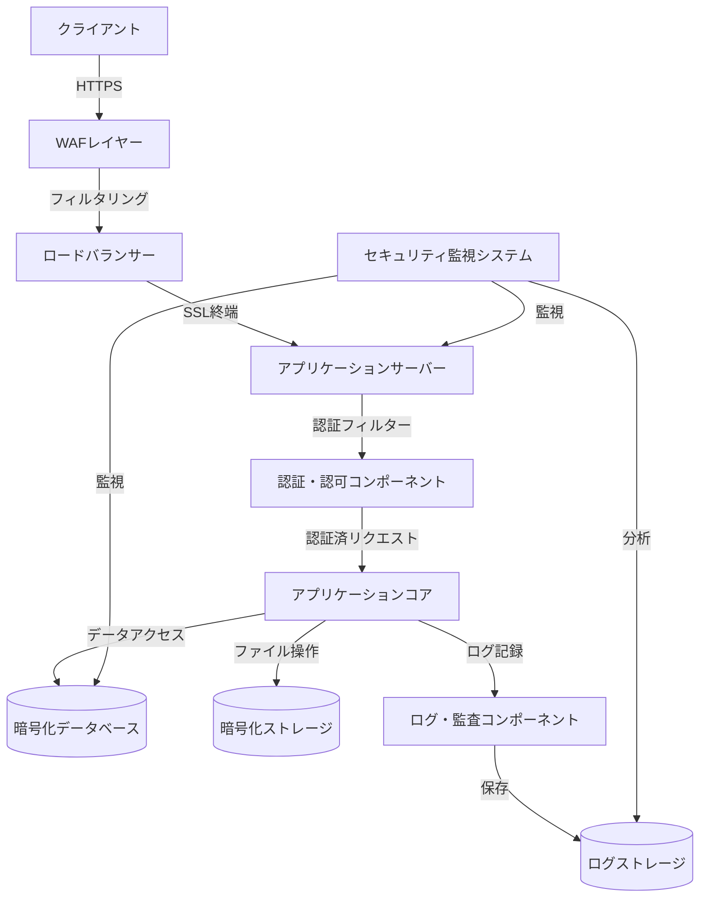

# SES業務システム セキュリティ設計概要

## 1. はじめに

### 1.1 目的

本ドキュメントは、SES業務システムのセキュリティに関する詳細設計の概要を示すものである。本システムが扱う機密性の高い情報（個人情報、契約情報、金銭情報など）を適切に保護し、安全なシステム運用を実現するためのセキュリティ対策を詳細に定義する。

### 1.2 適用範囲

本セキュリティ設計は、SES業務システムの全ての機能モジュールおよびインフラストラクチャに適用される。特に以下の領域を重点的にカバーする：

- 認証・認可機能
- データ保護機能
- 通信セキュリティ
- 監査・ログ機能
- 脆弱性対策
- セキュリティ運用

### 1.3 前提条件と制約

- システムはSpring Boot 3.2.x、Java 21を基盤としたモノリシックアーキテクチャで構築される
- PostgreSQL 17をメインデータベースとして使用
- AWS/Azure/GCPなどのクラウド環境にデプロイされる
- 非機能要件として99.9%/月の可用性（RTO 1時間、RPO 15分）が求められる
- ISMS（情報セキュリティマネジメントシステム）の要件に準拠する必要がある

## 2. セキュリティ設計方針

### 2.1 基本方針

SES業務システムのセキュリティ設計は、以下の原則に基づいて行う：

1. **多層防御（Defense in Depth）**: 単一の防御策に依存せず、複数の防御層を設けることでセキュリティを強化
2. **最小権限の原則**: ユーザーやシステムコンポーネントは、必要最小限の権限のみを持つように設計
3. **完全性検証の原則**: データの検証はクライアント側とサーバー側の両方で行い、信頼できない入力を前提とした実装
4. **安全なデフォルト**: システムの初期設定は、セキュアな状態を維持するよう構成
5. **失敗安全の原則**: セキュリティメカニズムが失敗した場合でも、安全な状態を維持する設計
6. **セキュリティの可視性**: セキュリティ関連活動は監視・記録され、異常を迅速に検出できるようにする

### 2.2 準拠すべき基準

本システムのセキュリティ設計は、以下の標準やベストプラクティスに準拠する：

- OWASP (Open Web Application Security Project) Top 10
- 経済産業省「システム管理基準」
- 個人情報保護法およびその関連ガイドライン
- ISO/IEC 27001（情報セキュリティマネジメントシステム）
- NIST Cybersecurity Framework

## 3. セキュリティ設計概要

SES業務システムのセキュリティ対策は、以下の6つの主要カテゴリに分類して設計する：

### 3.1 認証・認可機能

ユーザー認証と権限管理に関するセキュリティ機能を提供する：

- Spring Security + JWT（JSON Web Token）ベースの認証基盤
- ロールベースアクセス制御（RBAC）と属性ベースアクセス制御（ABAC）の併用
- 多要素認証（MFA）の実装
- パスワードポリシーの適用と管理
- セッション管理（タイムアウト、同時ログイン制限など）

詳細：[02_認証認可設計.md](./02_認証認可設計.md)

### 3.2 データ保護機能

保存データおよび処理中データの保護に関する機能：

- 機密データの暗号化（保存時暗号化）
- 個人情報の仮名化・匿名化
- データマスキング（ログ・画面表示時）
- バックアップデータの保護
- データ破棄ポリシーの実装

詳細：[03_データ保護設計.md](./03_データ保護設計.md)

### 3.3 通信セキュリティ

データ転送時の保護に関する機能：

- 転送時の暗号化（TLS 1.3）
- APIセキュリティ対策
- クロスオリジンリソース共有（CORS）の制限
- WebSocketセキュリティ

詳細：[04_通信セキュリティ設計.md](./04_通信セキュリティ設計.md)

### 3.4 監査・ログ機能

セキュリティイベントの記録と監視に関する機能：

- 監査ログの設計と実装
- ログの保存と保護
- 証跡の完全性確保
- セキュリティイベントモニタリング
- 異常検知の仕組み

詳細：[05_監査ログ設計.md](./05_監査ログ設計.md)

### 3.5 脆弱性対策

一般的な脆弱性への対策：

- 入力検証と出力エンコーディング
- SQLインジェクション対策
- クロスサイトスクリプティング（XSS）対策
- クロスサイトリクエストフォージェリ（CSRF）対策
- ディレクトリトラバーサル対策
- その他のOWASP Top 10脆弱性への対策

詳細：[06_脆弱性対策設計.md](./06_脆弱性対策設計.md)

### 3.6 セキュリティ運用

運用面でのセキュリティ対策：

- セキュリティインシデント対応手順
- 脆弱性管理プロセス
- セキュリティ更新プログラムの適用
- セキュリティテスト（ペネトレーションテスト、脆弱性スキャン）
- セキュリティ監視とアラート

詳細：[07_セキュリティ運用設計.md](./07_セキュリティ運用設計.md)

## 4. セキュリティアーキテクチャ

### 4.1 セキュリティコンポーネント構成

### 4.2 セキュリティデータフロー

システム内の主要なデータフローにおけるセキュリティ対策：

1. **外部からのHTTPリクエスト**
   - WAF/IDS/IPSによるフィルタリング
   - TLS 1.3による暗号化通信
   - リクエスト検証（サイズ、レート制限等）

2. **認証プロセス**
   - 認証情報の安全な処理
   - JWTトークンの生成と検証
   - セッション管理（タイムアウト、無効化）

3. **内部データアクセス**
   - 認可チェック（RBAC/ABAC）
   - 入力検証
   - SQLインジェクション対策
   - データマスキング（必要に応じて）

4. **データ保存**
   - 機密データの暗号化
   - データベース接続の保護
   - バックアップの暗号化

5. **外部システム連携**
   - APIキー管理
   - 相互認証
   - データ検証

## 5. リスク評価と対策

主要なセキュリティリスクとその対策概要：

| リスク区分 | リスク内容 | 影響度 | 対策概要 |
|-----------|-----------|-------|---------|
| 認証・認可 | 不正アクセス | 高 | 多要素認証、アカウントロックアウト、強力なパスワードポリシー |
| 認証・認可 | 権限昇格 | 高 | 最小権限原則の適用、権限の定期レビュー、アクセス制御監査 |
| データ保護 | 機密情報漏洩 | 高 | データの暗号化、アクセス制御、データマスキング |
| 通信 | 通信傍受 | 中 | 全通信のTLS 1.3強制、証明書管理 |
| 脆弱性 | インジェクション攻撃 | 高 | パラメータ化クエリ、入力検証、エスケープ処理 |
| 脆弱性 | XSS攻撃 | 中 | 出力エンコーディング、CSPの実装 |
| 監査 | 不正行為の検知漏れ | 中 | 包括的な監査ログ、異常検知、ログの完全性保証 |
| 運用 | パッチ管理の遅延 | 中 | 自動パッチ適用、脆弱性スキャン、依存関係分析 |

詳細なリスク評価と対策については各セキュリティ設計ドキュメントを参照のこと。

## 6. 参照情報

- [基本設計書：セキュリティ設計](/docs/02_基本設計/システム設計/05_セキュリティ設計.html)
- [OWASP Top 10 - 2021](https://owasp.org/Top10/)
- [Spring Security Reference](https://docs.spring.io/spring-security/reference/index.html)
- [NIST Cybersecurity Framework](https://www.nist.gov/cyberframework)
- [ISO/IEC 27001:2013](https://www.iso.org/standard/54534.html)