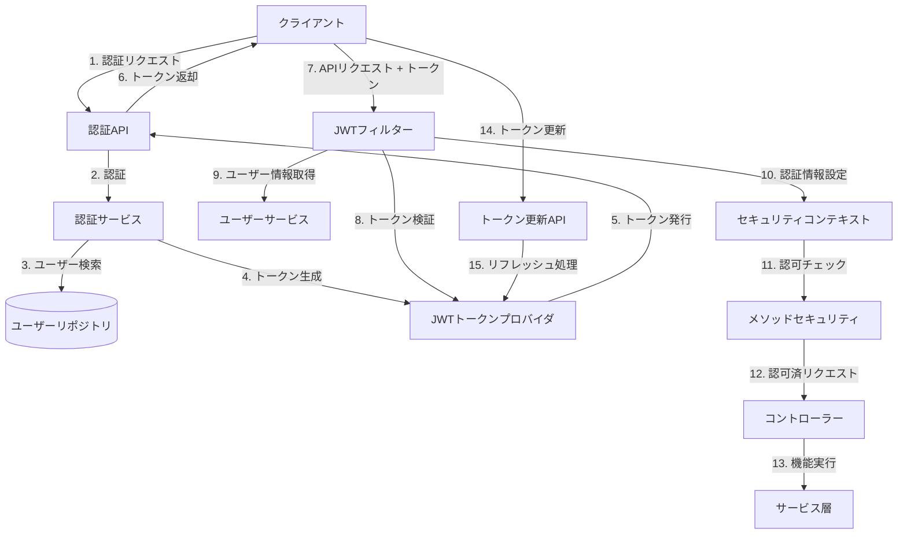

# SES業務システム 認証・認可機能詳細設計

## 1. 概要

### 1.1 目的

本ドキュメントは、SES業務システムにおける認証（Authentication）および認可（Authorization）機能の詳細設計を定義するものである。ユーザー識別・認証と権限管理に関するセキュリティ機能について、詳細な実装指針を提供する。

### 1.2 前提条件

- Spring Boot 3.2.x および Spring Security 6.xを使用
- JWTベースの認証メカニズムを採用（[ADR-003: RESTful APIにおけるJWT認証の採用](/docs/03_詳細設計/08_ADR/adr-003-JWT認証採用.md)）
- モノリシックアーキテクチャでのアプリケーション構成
- レイヤードアーキテクチャに従った実装（[ADR-001: レイヤードアーキテクチャの採用](/docs/03_詳細設計/08_ADR/adr-001-レイヤードアーキテクチャ採用.md)）

## 2. 認証・認可アーキテクチャ

### 2.1 全体アーキテクチャ



### 2.2 コンポーネント一覧

| コンポーネント名 | 種別 | 責務 |
|---------------|------|------|
| SecurityConfig | 設定クラス | Spring Securityの全体設定、セキュリティフィルターチェーンの構成 |
| JwtAuthenticationFilter | フィルター | JWTトークンの検証とセキュリティコンテキスト設定 |
| AuthenticationController | コントローラー | 認証関連API（ログイン、ログアウト、トークン更新）の提供 |
| JwtTokenProvider | コンポーネント | JWTトークンの生成、検証、解析 |
| UserDetailsServiceImpl | サービス | Spring Securityのユーザー詳細情報提供 |
| AuthenticationService | サービス | 認証ロジックを実装 |
| CustomPermissionEvaluator | コンポーネント | カスタム権限評価ロジック |
| SecurityUtils | ユーティリティ | セキュリティ関連ユーティリティメソッド |
| BlacklistedTokenRepository | リポジトリ | 無効化されたトークンの管理 |

## 3. 認証機能詳細設計

### 3.1 認証方式

SES業務システムでは、以下の認証方式を組み合わせて使用する：

1. **ユーザーID/パスワード認証**：基本認証方式
2. **JWT（JSON Web Token）認証**：APIアクセスのための認証方式
3. **多要素認証（MFA）**：セキュリティ強化のためのオプション認証
   - TOTP（Time-based One-Time Password）による二要素認証
   - 特定の役割（システム管理者など）や機密操作に対して必須化

### 3.2 認証フロー

#### 3.2.1 ログイン認証フロー

1. クライアントからログインリクエスト（ユーザーID/パスワード）を受信
2. `AuthenticationProvider`がユーザー情報を検証
3. 認証成功時、アクセストークンとリフレッシュトークンを生成
4. トークンをレスポンスとして返却

```java
@RestController
@RequestMapping("/api/v1/auth")
public class AuthenticationController {
    
    @Autowired
    private AuthenticationManager authenticationManager;
    
    @Autowired
    private JwtTokenProvider tokenProvider;
    
    @PostMapping("/login")
    public ResponseEntity<?> authenticateUser(@Valid @RequestBody LoginRequest loginRequest) {
        // 認証リクエスト作成
        Authentication authentication = authenticationManager.authenticate(
            new UsernamePasswordAuthenticationToken(
                loginRequest.getUsername(),
                loginRequest.getPassword()
            )
        );
        
        // セキュリティコンテキスト設定
        SecurityContextHolder.getContext().setAuthentication(authentication);
        
        // JWTトークン生成
        String accessToken = tokenProvider.generateAccessToken(authentication);
        String refreshToken = tokenProvider.generateRefreshToken(authentication);
        
        // レスポンス返却
        return ResponseEntity.ok(new JwtAuthenticationResponse(accessToken, refreshToken));
    }
}
```

#### 3.2.2 API認証フロー

1. クライアントからAPIリクエスト（Authorizationヘッダーにトークン付き）を受信
2. `JwtAuthenticationFilter`がトークンを抽出・検証
3. トークンからユーザー情報を取得し、`SecurityContextHolder`に設定
4. 後続のフィルターやコントローラーで認証情報を使用

```java
@Component
public class JwtAuthenticationFilter extends OncePerRequestFilter {
    
    @Autowired
    private JwtTokenProvider tokenProvider;
    
    @Autowired
    private CustomUserDetailsService userDetailsService;
    
    @Autowired
    private BlacklistedTokenRepository blacklistedTokenRepository;
    
    @Override
    protected void doFilterInternal(HttpServletRequest request, HttpServletResponse response, 
                                   FilterChain filterChain) throws ServletException, IOException {
        try {
            String jwt = getJwtFromRequest(request);
            
            if (StringUtils.hasText(jwt) && tokenProvider.validateToken(jwt)) {
                // ブラックリストチェック
                if (blacklistedTokenRepository.existsByToken(jwt)) {
                    throw new InvalidTokenException("ログアウト済みのトークンです");
                }
                
                Long userId = tokenProvider.getUserIdFromJWT(jwt);
                
                UserDetails userDetails = userDetailsService.loadUserById(userId);
                UsernamePasswordAuthenticationToken authentication = 
                    new UsernamePasswordAuthenticationToken(userDetails, null, userDetails.getAuthorities());
                authentication.setDetails(new WebAuthenticationDetailsSource().buildDetails(request));
                
                SecurityContextHolder.getContext().setAuthentication(authentication);
            }
        } catch (Exception ex) {
            log.error("認証コンテキストの設定に失敗しました", ex);
            // トークンエラーを監査ログに記録
            auditLogService.logSecurityEvent("TOKEN_VALIDATION_FAILURE", 
                                            request.getRemoteAddr(), 
                                            request.getRequestURI(),
                                            ex.getMessage());
        }
        
        filterChain.doFilter(request, response);
    }
    
    private String getJwtFromRequest(HttpServletRequest request) {
        String bearerToken = request.getHeader("Authorization");
        if (StringUtils.hasText(bearerToken) && bearerToken.startsWith("Bearer ")) {
            return bearerToken.substring(7);
        }
        return null;
    }
}
```

#### 3.2.3 多要素認証（MFA）フロー

1. 基本認証（ユーザーID/パスワード）が成功した後、MFAが必要なユーザーに対して一時トークンを発行
2. クライアントはMFAコード（TOTPなど）と一時トークンを送信
3. サーバーでMFAコードを検証
4. 検証成功時、通常のアクセストークンとリフレッシュトークンを発行

```java
@PostMapping("/verify-mfa")
public ResponseEntity<?> verifyMfaCode(@Valid @RequestBody MfaVerificationRequest request) {
    // 一時トークンの検証
    if (!tokenProvider.validateTempToken(request.getTempToken())) {
        return ResponseEntity.status(HttpStatus.UNAUTHORIZED)
            .body(new ApiResponse(false, "無効な一時トークンです"));
    }
    
    // 一時トークンからユーザー情報を取得
    Long userId = tokenProvider.getUserIdFromTempToken(request.getTempToken());
    UserDetails userDetails = userDetailsService.loadUserById(userId);
    
    // MFAコードの検証
    if (!mfaService.verifyCode(userDetails.getUsername(), request.getMfaCode())) {
        // 失敗回数カウント
        mfaService.incrementFailedAttempts(userDetails.getUsername());
        
        return ResponseEntity.status(HttpStatus.UNAUTHORIZED)
            .body(new ApiResponse(false, "MFAコードが正しくありません"));
    }
    
    // 認証成功、通常のトークンを発行
    Authentication authentication = 
        new UsernamePasswordAuthenticationToken(userDetails, null, userDetails.getAuthorities());
    
    String accessToken = tokenProvider.generateAccessToken(authentication);
    String refreshToken = tokenProvider.generateRefreshToken(authentication);
    
    return ResponseEntity.ok(new JwtAuthenticationResponse(accessToken, refreshToken));
}
```

### 3.3 パスワードポリシー

以下のパスワードポリシーを実装する：

1. **最小長**：10文字以上
2. **複雑性**：以下をすべて含む必要がある
   - 英大文字（A-Z）
   - 英小文字（a-z）
   - 数字（0-9）
   - 特殊文字（!@#$%^&*()_+など）
3. **有効期限**：90日（管理者設定で変更可能）
4. **履歴制限**：過去6回使用したパスワードは再利用不可
5. **アカウントロックアウト**：5回連続失敗で30分間ロック

```java
@Component
public class PasswordPolicyValidator {
    
    @Value("${app.security.password.minLength:10}")
    private int minLength;
    
    @Value("${app.security.password.requireUppercase:true}")
    private boolean requireUppercase;
    
    @Value("${app.security.password.requireLowercase:true}")
    private boolean requireLowercase;
    
    @Value("${app.security.password.requireDigit:true}")
    private boolean requireDigit;
    
    @Value("${app.security.password.requireSpecialChar:true}")
    private boolean requireSpecialChar;
    
    public List<String> validate(String password) {
        List<String> validationErrors = new ArrayList<>();
        
        if (password.length() < minLength) {
            validationErrors.add("パスワードは" + minLength + "文字以上である必要があります");
        }
        
        if (requireUppercase && !password.matches(".*[A-Z].*")) {
            validationErrors.add("パスワードは少なくとも1つの大文字を含む必要があります");
        }
        
        if (requireLowercase && !password.matches(".*[a-z].*")) {
            validationErrors.add("パスワードは少なくとも1つの小文字を含む必要があります");
        }
        
        if (requireDigit && !password.matches(".*\\d.*")) {
            validationErrors.add("パスワードは少なくとも1つの数字を含む必要があります");
        }
        
        if (requireSpecialChar && !password.matches(".*[!@#$%^&*()_+\\-=\\[\\]{};':\"\\\\|,.<>/?].*")) {
            validationErrors.add("パスワードは少なくとも1つの特殊文字を含む必要があります");
        }
        
        return validationErrors;
    }
}
```

### 3.4 トークン管理

#### 3.4.1 トークン種類と仕様

| トークン種類 | 目的 | 有効期限 | 格納情報 |
|------------|------|---------|---------|
| アクセストークン | APIアクセス認証 | 30分 | ユーザーID、権限情報、発行時間、有効期限 |
| リフレッシュトークン | アクセストークン更新 | 2週間 | ユーザーID、発行時間、有効期限 |
| 一時トークン（MFA用） | MFA認証中の一時識別 | 5分 | ユーザーID、発行時間、有効期限 |

#### 3.4.2 トークン更新フロー

1. アクセストークンの期限切れ時、クライアントはリフレッシュトークンを使用して新しいトークンをリクエスト
2. サーバーはリフレッシュトークンを検証し、有効であれば新しいアクセストークンを発行
3. 必要に応じて、新しいリフレッシュトークンも発行（ローテーション）

```java
@PostMapping("/refresh")
public ResponseEntity<?> refreshToken(@Valid @RequestBody TokenRefreshRequest request) {
    // リフレッシュトークンの検証
    if (!tokenProvider.validateToken(request.getRefreshToken())) {
        return ResponseEntity.status(HttpStatus.UNAUTHORIZED)
            .body(new ApiResponse(false, "無効なリフレッシュトークンです"));
    }
    
    // ブラックリストチェック
    if (blacklistedTokenRepository.existsByToken(request.getRefreshToken())) {
        return ResponseEntity.status(HttpStatus.UNAUTHORIZED)
            .body(new ApiResponse(false, "無効化されたトークンです"));
    }
    
    // トークンからユーザー情報を取得
    Long userId = tokenProvider.getUserIdFromJWT(request.getRefreshToken());
    UserDetails userDetails = userDetailsService.loadUserById(userId);
    
    // 新しいトークンを発行
    Authentication authentication = 
        new UsernamePasswordAuthenticationToken(userDetails, null, userDetails.getAuthorities());
    
    String newAccessToken = tokenProvider.generateAccessToken(authentication);
    
    // リフレッシュトークンのローテーション（オプション）
    String newRefreshToken = request.getRefreshToken();
    if (tokenProvider.shouldRotateRefreshToken(request.getRefreshToken())) {
        // 古いリフレッシュトークンをブラックリストに追加
        blacklistedTokenRepository.save(new BlacklistedToken(request.getRefreshToken()));
        
        // 新しいリフレッシュトークンを発行
        newRefreshToken = tokenProvider.generateRefreshToken(authentication);
    }
    
    return ResponseEntity.ok(new JwtAuthenticationResponse(newAccessToken, newRefreshToken));
}
```

#### 3.4.3 トークン無効化（ブラックリスト）

以下のケースでトークンを無効化する：

1. ユーザーのログアウト時
2. パスワード変更時
3. アカウント無効化時
4. セキュリティポリシー違反検出時
5. リフレッシュトークンローテーション時

```java
@Entity
@Table(name = "blacklisted_tokens")
public class BlacklistedToken {
    
    @Id
    @GeneratedValue(strategy = GenerationType.IDENTITY)
    private Long id;
    
    @Column(nullable = false, unique = true)
    private String token;
    
    @Column(nullable = false)
    private Date expiryDate;
    
    // コンストラクタ、getter、setterなど
}

@Repository
public interface BlacklistedTokenRepository extends JpaRepository<BlacklistedToken, Long> {
    
    boolean existsByToken(String token);
    
    List<BlacklistedToken> findByExpiryDateBefore(Date date);
    
    @Modifying
    @Query("DELETE FROM BlacklistedToken b WHERE b.expiryDate < :date")
    void deleteExpiredTokens(@Param("date") Date date);
}
```

### 3.5 セッション管理

モノリシックアプリケーションでのセッション管理方針：

1. **HTTPセッション**：ウェブUIアクセス用のセッションは短時間（30分）で設定
2. **Webブラウザからのサインイン**：
   - セッションベースの認証と、JWTベースのAPI認証の両方をサポート
   - RememberMe機能をオプションで提供（セキュアなトークンベース）
3. **同時ログイン制限**：
   - 同一ユーザーの同時ログイン数を制限（デフォルト：3セッション）
   - 管理者権限を持つユーザーは1セッションのみ許可

```java
@Configuration
public class SessionConfig {
    
    @Value("${app.security.session.maxConcurrentSessions:3}")
    private int maxConcurrentSessions;
    
    @Bean
    public SessionRegistry sessionRegistry() {
        return new SessionRegistryImpl();
    }
    
    @Bean
    public ConcurrentSessionControlAuthenticationStrategy sessionAuthenticationStrategy() {
        ConcurrentSessionControlAuthenticationStrategy strategy = 
            new ConcurrentSessionControlAuthenticationStrategy(sessionRegistry());
        strategy.setMaximumSessions(maxConcurrentSessions);
        // 新しいログインによる古いセッションの無効化
        strategy.setExceptionIfMaximumExceeded(false);
        return strategy;
    }
}
```

## 4. 認可機能詳細設計

### 4.1 認可モデル

SES業務システムでは、以下の認可モデルを組み合わせて使用する：

1. **ロールベースアクセス制御（RBAC）**：基本的な権限管理
2. **属性ベースアクセス制御（ABAC）**：より詳細なアクセス制御
3. **データレベルアクセス制御**：データの所有権や関連性に基づく制御

### 4.2 ロール設計

#### 4.2.1 基本ロール

| ロール名 | 説明 | 継承元 |
|---------|------|-------|
| ROLE_USER | 基本ユーザー（最小権限） | - |
| ROLE_ENGINEER | 技術者（自身の情報管理、勤怠登録等） | ROLE_USER |
| ROLE_SALES | 営業担当者（案件、提案管理等） | ROLE_USER |
| ROLE_HR | 人事担当者（技術者管理等） | ROLE_USER |
| ROLE_PM | プロジェクトマネージャ（チーム管理、承認等） | ROLE_USER |
| ROLE_ACCOUNTING | 経理担当者（請求支払管理等） | ROLE_USER |
| ROLE_MANAGER | 部門管理者（レポート参照、部門データ管理等） | ROLE_USER |
| ROLE_ADMIN | システム管理者（最大権限） | ROLE_MANAGER |

#### 4.2.2 詳細な権限

細かな操作権限は、Spring Securityのprefix + 操作 + 対象 の形式で定義する：

- `ENGINEER_VIEW`：技術者情報の閲覧権限
- `ENGINEER_CREATE`：技術者登録権限
- `ENGINEER_EDIT`：技術者情報編集権限
- `ENGINEER_DELETE`：技術者削除権限
- `PROJECT_VIEW`：案件情報の閲覧権限
- `PROJECT_CREATE`：案件登録権限
- など

```java
public enum Permission {
    // 技術者管理
    ENGINEER_VIEW,
    ENGINEER_CREATE,
    ENGINEER_EDIT,
    ENGINEER_DELETE,
    
    // 案件管理
    PROJECT_VIEW,
    PROJECT_CREATE,
    PROJECT_EDIT,
    PROJECT_DELETE,
    
    // 契約管理
    CONTRACT_VIEW,
    CONTRACT_CREATE,
    CONTRACT_EDIT,
    CONTRACT_APPROVE,
    CONTRACT_CANCEL,
    
    // 勤怠管理
    TIMESHEET_VIEW,
    TIMESHEET_SUBMIT,
    TIMESHEET_APPROVE,
    
    // 請求支払
    BILLING_VIEW,
    BILLING_CREATE,
    BILLING_EDIT,
    BILLING_APPROVE,
    
    // システム管理
    SYSTEM_CONFIG,
    USER_ADMIN,
    ROLE_ADMIN
}
```

### 4.3 認可実装

#### 4.3.1 URL・メソッドレベルの認可

1. URLパスベースの認可ルールをSecurityConfigで定義
2. メソッドレベルでの認可を`@PreAuthorize`アノテーションで実装

```java
@Configuration
@EnableMethodSecurity
public class SecurityConfig {
    
    @Bean
    public SecurityFilterChain filterChain(HttpSecurity http) throws Exception {
        http
            // CSRF設定
            .csrf(csrf -> csrf.disable())  // JWT認証ではCSRF保護は不要
            
            // セッション管理
            .sessionManagement(session -> session
                .sessionCreationPolicy(SessionCreationPolicy.STATELESS))
            
            // 認可ルール
            .authorizeHttpRequests(auth -> auth
                // 公開エンドポイント
                .requestMatchers("/api/v1/auth/**").permitAll()
                .requestMatchers("/api/v1/public/**").permitAll()
                
                // ロールベースのアクセス制御
                .requestMatchers("/api/v1/admin/**").hasRole("ADMIN")
                .requestMatchers("/api/v1/engineers/**").hasAnyRole("ADMIN", "HR", "MANAGER", "SALES")
                .requestMatchers("/api/v1/projects/**").hasAnyRole("ADMIN", "SALES", "MANAGER")
                
                // それ以外は認証済みユーザーのみ
                .anyRequest().authenticated()
            )
            
            // JWT認証フィルターを追加
            .addFilterBefore(jwtAuthenticationFilter, UsernamePasswordAuthenticationFilter.class);
            
        return http.build();
    }
}
```

メソッドレベルでの認可：

```java
@RestController
@RequestMapping("/api/v1/engineers")
public class EngineerController {
    
    @GetMapping
    @PreAuthorize("hasAuthority('ENGINEER_VIEW')")
    public ResponseEntity<Page<EngineerDto>> getAllEngineers(
            @RequestParam(defaultValue = "0") int page,
            @RequestParam(defaultValue = "20") int size) {
        // 技術者一覧取得処理
    }
    
    @PostMapping
    @PreAuthorize("hasAuthority('ENGINEER_CREATE')")
    public ResponseEntity<EngineerDto> createEngineer(@Valid @RequestBody EngineerCreateDto engineerDto) {
        // 技術者登録処理
    }
    
    @GetMapping("/{id}")
    @PreAuthorize("hasAuthority('ENGINEER_VIEW') or @engineerPermissionEvaluator.isSelfProfile(authentication, #id)")
    public ResponseEntity<EngineerDto> getEngineerById(@PathVariable Long id) {
        // 技術者詳細取得処理
    }
    
    @PutMapping("/{id}")
    @PreAuthorize("hasAuthority('ENGINEER_EDIT') or @engineerPermissionEvaluator.isSelfProfile(authentication, #id)")
    public ResponseEntity<EngineerDto> updateEngineer(@PathVariable Long id, 
                                                     @Valid @RequestBody EngineerUpdateDto engineerDto) {
        // 技術者情報更新処理
    }
    
    @DeleteMapping("/{id}")
    @PreAuthorize("hasAuthority('ENGINEER_DELETE')")
    public ResponseEntity<?> deleteEngineer(@PathVariable Long id) {
        // 技術者削除処理
    }
}
```

#### 4.3.2 データレベルのアクセス制御

カスタム権限評価ロジックを実装し、所有権や関連性に基づくデータレベルのアクセス制御を行う：

```java
@Component
public class EngineerPermissionEvaluator {
    
    @Autowired
    private UserRepository userRepository;
    
    @Autowired
    private EngineerRepository engineerRepository;
    
    /**
     * 現在認証されているユーザーが、指定された技術者の本人であるかチェック
     */
    public boolean isSelfProfile(Authentication authentication, Long engineerId) {
        if (authentication == null || !authentication.isAuthenticated()) {
            return false;
        }
        
        UserPrincipal userPrincipal = (UserPrincipal) authentication.getPrincipal();
        User user = userRepository.findById(userPrincipal.getId()).orElse(null);
        
        if (user == null) {
            return false;
        }
        
        // ユーザーに紐づく技術者情報を取得
        Engineer engineer = engineerRepository.findByUserId(user.getId()).orElse(null);
        
        // 技術者IDが一致するか確認
        return engineer != null && engineer.getId().equals(engineerId);
    }
    
    /**
     * 現在認証されているユーザーが、指定された技術者と同じ部門に所属しているかチェック
     */
    public boolean isSameDepartment(Authentication authentication, Long engineerId) {
        if (authentication == null || !authentication.isAuthenticated()) {
            return false;
        }
        
        UserPrincipal userPrincipal = (UserPrincipal) authentication.getPrincipal();
        User user = userRepository.findById(userPrincipal.getId()).orElse(null);
        
        if (user == null) {
            return false;
        }
        
        // ユーザーの部門情報を取得
        Long userDepartmentId = userRepository.findUserDepartmentId(user.getId());
        
        if (userDepartmentId == null) {
            return false;
        }
        
        // 技術者の部門情報を取得
        Long engineerDepartmentId = engineerRepository.findEngineerDepartmentId(engineerId);
        
        // 部門IDが一致するか確認
        return engineerDepartmentId != null && engineerDepartmentId.equals(userDepartmentId);
    }
}
```

### 4.4 ロール・権限の動的管理

ロールと権限を動的に管理するための機能を実装：

1. ロール・権限のマスタデータをデータベースで管理
2. ロール・権限の追加・変更・削除をUI経由で可能に
3. ユーザーへのロール付与・剥奪も動的に管理

```java
@Entity
@Table(name = "roles")
public class Role {
    
    @Id
    @GeneratedValue(strategy = GenerationType.IDENTITY)
    private Long id;
    
    @Column(nullable = false, unique = true)
    private String name;
    
    @Column
    private String description;
    
    @ManyToMany(fetch = FetchType.EAGER)
    @JoinTable(
        name = "role_permissions",
        joinColumns = @JoinColumn(name = "role_id"),
        inverseJoinColumns = @JoinColumn(name = "permission_id")
    )
    private Set<RolePermission> permissions = new HashSet<>();
    
    // コンストラクタ、getter、setterなど
}

@Entity
@Table(name = "role_permissions")
public class RolePermission {
    
    @Id
    @GeneratedValue(strategy = GenerationType.IDENTITY)
    private Long id;
    
    @Column(nullable = false, unique = true)
    @Enumerated(EnumType.STRING)
    private Permission permission;
    
    @Column
    private String description;
    
    // コンストラクタ、getter、setterなど
}

@Entity
@Table(name = "user_roles")
public class UserRole {
    
    @Id
    @GeneratedValue(strategy = GenerationType.IDENTITY)
    private Long id;
    
    @ManyToOne
    @JoinColumn(name = "user_id", nullable = false)
    private User user;
    
    @ManyToOne
    @JoinColumn(name = "role_id", nullable = false)
    private Role role;
    
    @Column(nullable = false)
    private Date assignedDate;
    
    @Column
    private Date expiryDate;
    
    @Column
    private String assignedBy;
    
    // コンストラクタ、getter、setterなど
}
```

## 5. セキュリティ対策

### 5.1 認証セキュリティ対策

#### 5.1.1 ブルートフォース攻撃対策

1. アカウントロックアウト（5回連続失敗で30分ロック）
2. キャプチャ（CAPTCHA）を一定回数のログイン失敗後に表示
3. ログイン試行の遅延（失敗回数に応じて遅延を増加）
4. ログイン失敗の監査ログ記録と異常検知

```java
@Service
public class LoginAttemptService {
    
    private final int MAX_ATTEMPT = 5;
    private final long LOCK_TIME_DURATION = 30; // 分
    
    @Autowired
    private UserRepository userRepository;
    
    @Autowired
    private AuditLogService auditLogService;
    
    public void loginSucceeded(String username) {
        // ログイン成功時の処理
        User user = userRepository.findByUsername(username).orElse(null);
        if (user != null) {
            user.setFailedLoginAttempts(0);
            user.setLastLoginTime(new Date());
            userRepository.save(user);
        }
    }
    
    public void loginFailed(String username, HttpServletRequest request) {
        // ログイン失敗時の処理
        User user = userRepository.findByUsername(username).orElse(null);
        if (user != null) {
            int attempts = user.getFailedLoginAttempts() + 1;
            user.setFailedLoginAttempts(attempts);
            
            if (attempts >= MAX_ATTEMPT) {
                user.setAccountLocked(true);
                user.setLockTime(new Date());
                
                // 監査ログ記録
                auditLogService.logSecurityEvent("ACCOUNT_LOCKED", 
                                               username,
                                               request.getRemoteAddr(),
                                               "連続ログイン失敗によるアカウントロック");
            }
            
            userRepository.save(user);
        }
    }
    
    public boolean isAccountLocked(String username) {
        User user = userRepository.findByUsername(username).orElse(null);
        if (user != null && user.isAccountLocked()) {
            // アカウントロック時間を確認
            Date lockTime = user.getLockTime();
            if (lockTime != null) {
                long lockTimeInMillis = lockTime.getTime();
                long currentTimeInMillis = System.currentTimeMillis();
                
                if (currentTimeInMillis - lockTimeInMillis > TimeUnit.MINUTES.toMillis(LOCK_TIME_DURATION)) {
                    // ロック時間経過なのでロック解除
                    user.setAccountLocked(false);
                    user.setFailedLoginAttempts(0);
                    user.setLockTime(null);
                    userRepository.save(user);
                    return false;
                }
                return true;
            }
        }
        return false;
    }
}
```

#### 5.1.2 IDジャッキング対策

1. ユーザー名の一意性の厳格な検証
2. メールアドレス・電話番号による本人確認
3. パスワードリセット時の厳格な本人確認
4. 類似ユーザー名の登録制限

#### 5.1.3 フィッシング対策

1. カスタムドメイン検証によるドメインスプーフィング防止
2. セキュリティイベント（ログイン、パスワード変更など）の通知メール
3. セキュリティページでのアクティブセッション表示
4. 最終ログイン日時と場所の表示

### 5.2 認可セキュリティ対策

#### 5.2.1 権限昇格対策

1. 重要操作の二段階承認
2. 権限変更の監査ログ記録
3. 管理者の権限変更に関する特別な制約
4. システム管理者操作の複数人レビュー

#### 5.2.2 権限チェック迂回対策

1. デフォルト拒否ポリシー（明示的に許可されなければ拒否）
2. グローバルメソッドセキュリティの適用
3. リソースへの直接アクセス制限
4. すべてのエンドポイントでの認可チェック強制

## 6. 拡張ポイント

### 6.1 SSO（シングルサインオン）統合

将来的に社内システムとのSSO連携を考慮し、以下の拡張ポイントを設計：

1. OpenID Connect / OAuth 2.0への対応
2. SAML 2.0統合のための拡張インターフェース
3. IDP（Identity Provider）との連携ポイント

### 6.2 リスクベース認証

ユーザーの行動パターンやアクセス環境に基づく動的なセキュリティレベル適用のための拡張ポイント：

1. リスクスコア計算のためのインターフェース
2. 新しい認証ファクターの追加メカニズム
3. 行動分析のためのデータ収集ポイント

## 7. 運用とモニタリング

認証・認可機能に関する運用モニタリングの方針：

1. **ログイン・認証イベントの監視**：
   - 異常なログイン試行の検出
   - 不適切な時間帯のアクセス検出
   - アカウントロックの監視

2. **権限変更の監視**：
   - 管理者権限の付与・剥奪のログ収集
   - 権限変更のパターン分析
   - 異常な権限使用の検出

3. **セッション・トークン監視**：
   - アクティブセッション数の監視
   - 同時ログインパターンの分析
   - トークン発行・利用状況の分析

## 8. テスト方針

認証・認可機能の主要テスト観点：

1. **単体テスト**：
   - 各種認証ロジックの検証
   - トークン発行・検証ロジックのテスト
   - パスワードポリシー検証ロジックのテスト

2. **統合テスト**：
   - 認証フロー全体のテスト
   - セッション管理の検証
   - トークン更新・無効化フローのテスト

3. **セキュリティテスト**：
   - ブルートフォース攻撃シミュレーション
   - 権限昇格試行テスト
   - JWT脆弱性テスト

## 9. 参照情報

- [ADR-003: RESTful APIにおけるJWT認証の採用](/docs/03_詳細設計/08_ADR/adr-003-JWT認証採用.md)
- [基本設計書：セキュリティ設計](/docs/02_基本設計/システム設計/05_セキュリティ設計.html)
- [Spring Security Reference](https://docs.spring.io/spring-security/reference/index.html)
- [JSON Web Token (JWT) - RFC 7519](https://tools.ietf.org/html/rfc7519)
- [OWASP Authentication Cheat Sheet](https://cheatsheetseries.owasp.org/cheatsheets/Authentication_Cheat_Sheet.html)
- [OWASP Authorization Cheat Sheet](https://cheatsheetseries.owasp.org/cheatsheets/Authorization_Cheat_Sheet.html)