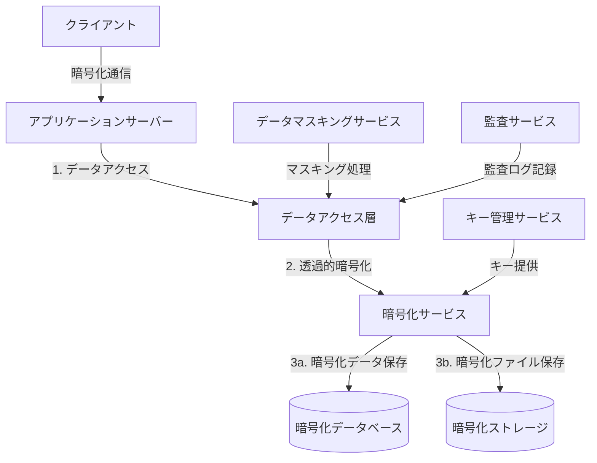

# SES業務システム データ保護機能詳細設計

## 1. 概要

### 1.1 目的

本ドキュメントは、SES業務システムにおけるデータ保護機能の詳細設計を定義するものである。保存データ、処理中データ、および通信中データの機密性と完全性を確保するための具体的な実装方針を提供する。

### 1.2 前提条件

- Spring Boot 3.2.xおよびJava 21を基盤とした実装
- PostgreSQL 17をメインデータベースとして使用
- AWS/Azure/GCPなどのクラウドストレージサービスとの連携
- 個人情報保護法および関連法令への準拠
- ISO/IEC 27001（情報セキュリティマネジメントシステム）の要件への適合

### 1.3 保護すべき重要データの種類

SES業務システムで扱う保護すべき重要データは以下のように分類される：

1. **個人情報**
   - 氏名、住所、生年月日、連絡先等の基本属性
   - マイナンバー（個人番号）、パスポート番号等の公的識別情報
   - 銀行口座情報等の金融情報

2. **契約情報**
   - 契約条件（単価、期間等）
   - 署名データ
   - 契約書PDF

3. **財務情報**
   - 請求情報、支払情報
   - 売上実績、利益率
   - 予算計画

4. **技術者情報**
   - スキルシート
   - 経歴情報
   - 評価情報

5. **認証情報**
   - パスワードハッシュ
   - セキュリティ質問と回答
   - 多要素認証シークレット

## 2. データ保護アーキテクチャ

### 2.1 全体アーキテクチャ



### 2.2 コンポーネント一覧

| コンポーネント名 | 種別 | 責務 |
|---------------|------|------|
| EncryptionConfig | 設定クラス | 暗号化に関する全体設定 |
| DataEncryptionService | サービス | データの暗号化・復号化 |
| KeyManagementService | サービス | 暗号化キーの生成・管理 |
| DataMaskingService | サービス | 機密データのマスキング |
| AnonymizationService | サービス | データの匿名化・仮名化 |
| FileEncryptionService | サービス | ファイルの暗号化・復号化 |
| SecureAuditLogger | ロガー | セキュアな監査ログ記録 |
| SensitiveDataRepository | リポジトリ | 機密データ用リポジトリ |
| PrivacyUtils | ユーティリティ | プライバシー関連ユーティリティ |

## 3. データベース保護機能

### 3.1 列レベル暗号化

個人情報や機密情報を含む列レベルでの暗号化を実装する。

#### 3.1.1 暗号化対象フィールド

| テーブル | カラム | 暗号化方式 | 理由 |
|---------|-------|-----------|------|
| users | password | BCryptハッシュ | パスワード保護（不可逆） |
| engineers | national_id | AES-256-GCM | 国民ID保護（マイナンバー等） |
| engineers | passport_number | AES-256-GCM | パスポート番号保護 |
| engineers | home_address | AES-256-GCM | 住所情報保護 |
| engineers | phone_number | AES-256-GCM | 電話番号保護 |
| bank_accounts | account_number | AES-256-GCM | 銀行口座番号保護 |
| bank_accounts | branch_code | AES-256-GCM | 銀行支店コード保護 |
| contracts | rate_amount | AES-256-GCM | 単価情報保護 |
| billing | amount | AES-256-GCM | 請求金額保護 |
| security_questions | answer | AES-256-GCM | セキュリティ回答保護 |

#### 3.1.2 JPA/Hibernate 統合実装

Hibernateのコンバーターを使用して、エンティティフィールドの透過的な暗号化・復号化を実装する：

```java
@Converter
public class StringEncryptionConverter implements AttributeConverter<String, String> {
    
    @Autowired
    private DataEncryptionService encryptionService;
    
    @Override
    public String convertToDatabaseColumn(String attribute) {
        if (attribute == null) {
            return null;
        }
        return encryptionService.encrypt(attribute);
    }
    
    @Override
    public String convertToEntityAttribute(String dbData) {
        if (dbData == null) {
            return null;
        }
        return encryptionService.decrypt(dbData);
    }
}

@Entity
@Table(name = "engineers")
public class Engineer {
    
    @Id
    @GeneratedValue(strategy = GenerationType.IDENTITY)
    private Long id;
    
    @Column(name = "first_name")
    private String firstName;
    
    @Column(name = "last_name")
    private String lastName;
    
    @Convert(converter = StringEncryptionConverter.class)
    @Column(name = "national_id")
    private String nationalId;
    
    @Convert(converter = StringEncryptionConverter.class)
    @Column(name = "passport_number")
    private String passportNumber;
    
    @Convert(converter = StringEncryptionConverter.class)
    @Column(name = "home_address")
    private String homeAddress;
    
    @Convert(converter = StringEncryptionConverter.class)
    @Column(name = "phone_number")
    private String phoneNumber;
    
    // 他のフィールド、getter、setterなど
}
```

#### 3.1.3 暗号化サービスの実装

JWE (JSON Web Encryption) を利用したデータの暗号化・復号化サービス：

```java
@Service
public class DataEncryptionServiceImpl implements DataEncryptionService {
    
    @Autowired
    private KeyManagementService keyManagementService;
    
    @Value("${app.security.encryption.algorithm:A256GCM}")
    private String encryptionAlgorithm;
    
    /**
     * 文字列データの暗号化
     */
    @Override
    public String encrypt(String plaintext) {
        try {
            // キー管理サービスから鍵を取得
            SecretKey key = keyManagementService.getCurrentKey();
            
            // JWEオブジェクト作成
            JWEHeader header = new JWEHeader.Builder(JWEAlgorithm.DIR, EncryptionMethod.A256GCM)
                .contentType("text/plain")
                .build();
            
            Payload payload = new Payload(plaintext);
            JWEObject jweObject = new JWEObject(header, payload);
            
            // 暗号化
            jweObject.encrypt(new DirectEncrypter(key));
            
            return jweObject.serialize();
            
        } catch (Exception e) {
            throw new EncryptionException("データの暗号化に失敗しました", e);
        }
    }
    
    /**
     * 暗号化された文字列の復号化
     */
    @Override
    public String decrypt(String encryptedText) {
        try {
            // JWEオブジェクトのパース
            JWEObject jweObject = JWEObject.parse(encryptedText);
            
            // キー管理サービスから鍵を取得
            SecretKey key = keyManagementService.getCurrentKey();
            
            // 復号化
            jweObject.decrypt(new DirectDecrypter(key));
            
            return jweObject.getPayload().toString();
            
        } catch (Exception e) {
            throw new EncryptionException("データの復号化に失敗しました", e);
        }
    }
    
    /**
     * バイナリデータの暗号化
     */
    @Override
    public byte[] encrypt(byte[] plainData) {
        // バイナリデータ暗号化の実装
        // ...
    }
    
    /**
     * 暗号化されたバイナリデータの復号化
     */
    @Override
    public byte[] decrypt(byte[] encryptedData) {
        // バイナリデータ復号化の実装
        // ...
    }
}
```

### 3.2 ファイルレベル暗号化

添付ファイルやドキュメントなどのファイルデータを保護するための暗号化機能を実装する。

#### 3.2.1 暗号化対象ファイル

| ファイル種別 | 暗号化方式 | 保存先 |
|------------|-----------|-------|
| 契約書PDF | AES-256-GCM | オブジェクトストレージ |
| スキルシート | AES-256-GCM | オブジェクトストレージ |
| 請求書PDF | AES-256-GCM | オブジェクトストレージ |
| インポート/エクスポートCSV | AES-256-GCM | 一時ストレージ |
| バックアップデータ | AES-256-GCM | バックアップストレージ |

#### 3.2.2 ファイル暗号化サービスの実装

```java
@Service
public class FileEncryptionServiceImpl implements FileEncryptionService {
    
    @Autowired
    private KeyManagementService keyManagementService;
    
    /**
     * ファイルの暗号化
     */
    @Override
    public byte[] encryptFile(byte[] fileData, String fileType) {
        try {
            // キー管理サービスから鍵を取得
            SecretKey key = keyManagementService.getCurrentKey();
            
            // 初期化ベクトル（IV）の生成
            byte[] iv = new byte[12]; // GCMモードでは12バイトIVが推奨
            SecureRandom secureRandom = new SecureRandom();
            secureRandom.nextBytes(iv);
            
            // 暗号化
            Cipher cipher = Cipher.getInstance("AES/GCM/NoPadding");
            GCMParameterSpec parameterSpec = new GCMParameterSpec(128, iv);
            cipher.init(Cipher.ENCRYPT_MODE, key, parameterSpec);
            
            // ファイルタイプを認証データとして追加
            cipher.updateAAD(fileType.getBytes(StandardCharsets.UTF_8));
            
            byte[] encryptedData = cipher.doFinal(fileData);
            
            // IV + 暗号文 の形式で返却
            ByteBuffer byteBuffer = ByteBuffer.allocate(iv.length + encryptedData.length);
            byteBuffer.put(iv);
            byteBuffer.put(encryptedData);
            
            return byteBuffer.array();
            
        } catch (Exception e) {
            throw new EncryptionException("ファイルの暗号化に失敗しました", e);
        }
    }
    
    /**
     * 暗号化されたファイルの復号化
     */
    @Override
    public byte[] decryptFile(byte[] encryptedData, String fileType) {
        try {
            // キー管理サービスから鍵を取得
            SecretKey key = keyManagementService.getCurrentKey();
            
            // IV部分とデータ部分を分離
            ByteBuffer byteBuffer = ByteBuffer.wrap(encryptedData);
            byte[] iv = new byte[12];
            byteBuffer.get(iv);
            
            byte[] cipherText = new byte[byteBuffer.remaining()];
            byteBuffer.get(cipherText);
            
            // 復号化
            Cipher cipher = Cipher.getInstance("AES/GCM/NoPadding");
            GCMParameterSpec parameterSpec = new GCMParameterSpec(128, iv);
            cipher.init(Cipher.DECRYPT_MODE, key, parameterSpec);
            
            // ファイルタイプを認証データとして追加
            cipher.updateAAD(fileType.getBytes(StandardCharsets.UTF_8));
            
            return cipher.doFinal(cipherText);
            
        } catch (Exception e) {
            throw new EncryptionException("ファイルの復号化に失敗しました", e);
        }
    }
    
    /**
     * ストリームベースのファイル暗号化
     */
    @Override
    public OutputStream encryptStream(OutputStream outputStream, String fileType) {
        // ストリームベースの暗号化実装
        // 大きなファイルを効率的に処理するためのラッパーストリームを返す
        // ...
    }
    
    /**
     * ストリームベースのファイル復号化
     */
    @Override
    public InputStream decryptStream(InputStream inputStream, String fileType) {
        // ストリームベースの復号化実装
        // 大きなファイルを効率的に処理するためのラッパーストリームを返す
        // ...
    }
}
```

### 3.3 透過的データ暗号化（TDE）

データベース全体を保護するため、PostgreSQLの透過的データ暗号化（TDE）を利用する。

#### 3.3.1 PostgreSQLでのTDE設定

```sql
-- PostgreSQLのpgcrypto拡張を有効化
CREATE EXTENSION IF NOT EXISTS pgcrypto;

-- 暗号化用テーブル空間の作成
CREATE TABLESPACE encrypted_tablespace LOCATION '/encrypted_data';

-- 暗号化設定
ALTER TABLESPACE encrypted_tablespace SET (encryption_algorithm = 'AES_256_CBC');

-- 機密データを含むテーブルを暗号化テーブル空間に移動
ALTER TABLE users SET TABLESPACE encrypted_tablespace;
ALTER TABLE engineers SET TABLESPACE encrypted_tablespace;
ALTER TABLE contracts SET TABLESPACE encrypted_tablespace;
ALTER TABLE bank_accounts SET TABLESPACE encrypted_tablespace;
```

#### 3.3.2 アプリケーション側での考慮点

- TDEはデータベースレベルで透過的に実装されるため、アプリケーションコードの変更は最小限
- データベース管理者（DBA）と協力して適切な設定と運用を行う
- 暗号化キーの安全な管理とバックアップが必須

## 4. キー管理

### 4.1 暗号化キーの階層

階層的なキー管理構造を実装し、キーローテーションとキーのバックアップを容易にする：

1. **マスターキー（MEK: Master Encryption Key）**
   - すべてのデータ暗号化キーを暗号化するためのキー
   - 安全なキー管理サービス（AWS KMS、HashiCorp Vault等）で外部管理
   - 定期的なローテーション（年1回）

2. **データ暗号化キー（DEK: Data Encryption Key）**
   - 実際のデータを暗号化するためのキー
   - マスターキーで暗号化された状態でDBに保存
   - より頻繁なローテーション（四半期ごと）

### 4.2 キー管理サービスの実装

```java
@Service
public class KeyManagementServiceImpl implements KeyManagementService {
    
    @Autowired
    private KeyRepository keyRepository;
    
    @Autowired
    private ExternalKeyManagementClient externalKeyClient; // AWS KMS/Vault等のクライアント
    
    @Value("${app.security.encryption.master-key-id}")
    private String masterKeyId;
    
    /**
     * 現在のアクティブなデータ暗号化キーを取得
     */
    @Override
    public SecretKey getCurrentKey() {
        EncryptionKey currentKey = keyRepository.findCurrentKey()
            .orElseThrow(() -> new KeyManagementException("アクティブな暗号化キーが見つかりません"));
        
        // 暗号化されたキーを復号化
        byte[] decryptedKeyBytes = decryptKeyWithMasterKey(
            currentKey.getEncryptedKeyValue(), 
            currentKey.getKeyVersion()
        );
        
        return new SecretKeySpec(decryptedKeyBytes, "AES");
    }
    
    /**
     * 新しいデータ暗号化キーを生成
     */
    @Override
    public EncryptionKey generateNewKey() {
        try {
            // セキュアな乱数生成器で新しいキーを生成
            KeyGenerator keyGen = KeyGenerator.getInstance("AES");
            keyGen.init(256, SecureRandom.getInstanceStrong());
            SecretKey newKey = keyGen.generateKey();
            
            // マスターキーでキーを暗号化
            String keyVersion = "v" + System.currentTimeMillis();
            byte[] encryptedKey = encryptKeyWithMasterKey(newKey.getEncoded(), keyVersion);
            
            // キー情報をDBに保存
            EncryptionKey keyEntity = new EncryptionKey();
            keyEntity.setKeyVersion(keyVersion);
            keyEntity.setEncryptedKeyValue(encryptedKey);
            keyEntity.setAlgorithm("AES");
            keyEntity.setKeySize(256);
            keyEntity.setStatus(KeyStatus.ACTIVE);
            keyEntity.setCreatedAt(new Date());
            
            // 既存のアクティブキーを非アクティブ化
            keyRepository.deactivateCurrentKeys();
            
            return keyRepository.save(keyEntity);
            
        } catch (Exception e) {
            throw new KeyManagementException("新しいキーの生成に失敗しました", e);
        }
    }
    
    /**
     * キーのローテーション
     */
    @Override
    @Scheduled(cron = "${app.security.encryption.key-rotation-cron}")
    public void rotateKeys() {
        // 新しいキーを生成
        EncryptionKey newKey = generateNewKey();
        
        // 再暗号化が必要なデータを特定し、新しいキーで再暗号化するジョブを起動
        reencryptionService.scheduleReencryption(newKey.getId());
        
        // 監査ログに記録
        auditLogService.logSecurityEvent("KEY_ROTATION", "SYSTEM", "キーローテーション実行");
    }
    
    /**
     * 特定バージョンのキーを取得
     */
    @Override
    public SecretKey getKeyByVersion(String keyVersion) {
        EncryptionKey key = keyRepository.findByKeyVersion(keyVersion)
            .orElseThrow(() -> new KeyManagementException("指定されたバージョンのキーが見つかりません: " + keyVersion));
        
        // 暗号化されたキーを復号化
        byte[] decryptedKeyBytes = decryptKeyWithMasterKey(
            key.getEncryptedKeyValue(), 
            key.getKeyVersion()
        );
        
        return new SecretKeySpec(decryptedKeyBytes, "AES");
    }
    
    /**
     * マスターキーでデータキーを暗号化
     */
    private byte[] encryptKeyWithMasterKey(byte[] keyData, String keyVersion) {
        // 外部キー管理サービスを使用してマスターキーでデータキーを暗号化
        return externalKeyClient.encrypt(masterKeyId, keyData, Map.of("KeyVersion", keyVersion));
    }
    
    /**
     * マスターキーでデータキーを復号化
     */
    private byte[] decryptKeyWithMasterKey(byte[] encryptedKeyData, String keyVersion) {
        // 外部キー管理サービスを使用してマスターキーでデータキーを復号化
        return externalKeyClient.decrypt(masterKeyId, encryptedKeyData, Map.of("KeyVersion", keyVersion));
    }
}
```

### 4.3 キーローテーションと再暗号化

キーローテーション時のデータ再暗号化を管理するサービス：

```java
@Service
public class ReencryptionServiceImpl implements ReencryptionService {
    
    @Autowired
    private KeyManagementService keyManagementService;
    
    @Autowired
    private JdbcTemplate jdbcTemplate;
    
    @Autowired
    private DataEncryptionService encryptionService;
    
    /**
     * 再暗号化ジョブのスケジューリング
     */
    @Override
    public void scheduleReencryption(Long newKeyId) {
        // 再暗号化が必要なテーブルとカラムの一覧
        List<ReencryptionTarget> targets = getReencryptionTargets();
        
        // 各ターゲットに対して再暗号化ジョブを登録
        for (ReencryptionTarget target : targets) {
            scheduleReencryptionJob(target, newKeyId);
        }
    }
    
    /**
     * 特定のテーブル・カラムの再暗号化を実行
     */
    @Override
    @Transactional
    public void reencryptTableColumn(ReencryptionTarget target, Long newKeyId) {
        try {
            // 現在のキーと新しいキーを取得
            SecretKey currentKey = keyManagementService.getCurrentKey();
            
            // データを取得してバッチ処理（メモリ効率のため）
            int offset = 0;
            int batchSize = 100;
            List<Map<String, Object>> batch;
            
            do {
                // バッチデータの取得
                batch = fetchBatch(target, offset, batchSize);
                
                // 各レコードの再暗号化
                for (Map<String, Object> record : batch) {
                    reencryptRecord(target, record, newKeyId);
                }
                
                offset += batchSize;
            } while (batch.size() == batchSize);
            
            // 再暗号化完了を記録
            markReencryptionComplete(target, newKeyId);
            
        } catch (Exception e) {
            throw new ReencryptionException("データの再暗号化に失敗しました: " + target.getTableName() + "." + target.getColumnName(), e);
        }
    }
    
    /**
     * 特定のレコードを再暗号化
     */
    private void reencryptRecord(ReencryptionTarget target, Map<String, Object> record, Long newKeyId) {
        Long id = (Long) record.get("id");
        String encryptedValue = (String) record.get(target.getColumnName());
        
        if (encryptedValue != null) {
            // 現在のキーで復号化
            String decryptedValue = encryptionService.decrypt(encryptedValue);
            
            // 新しいキーで再暗号化
            String reencryptedValue = encryptionService.encrypt(decryptedValue, newKeyId);
            
            // 更新
            String sql = "UPDATE " + target.getTableName() + 
                         " SET " + target.getColumnName() + " = ? " +
                         " WHERE id = ?";
            
            jdbcTemplate.update(sql, reencryptedValue, id);
        }
    }
    
    // 他のヘルパーメソッド
    // ...
}
```

## 5. データマスキング・匿名化

### 5.1 データマスキング

画面表示やレポート出力時に機密データを自動的にマスキングする機能を実装する。

#### 5.1.1 マスキング方針

| データ種別 | マスキング方式 | 例 |
|----------|--------------|-----|
| 氏名 | 姓のみ表示 | 佐藤 **** |
| メールアドレス | ドメイン前のユーザー名の一部をマスク | s***@example.com |
| 電話番号 | 中間4桁をマスク | 090-****-1234 |
| クレジットカード番号 | 最初の6桁と最後の4桁以外をマスク | 411111******1111 |
| 住所 | 番地以降をマスク | 東京都渋谷区渋谷******* |
| 銀行口座番号 | 先頭と末尾の各2桁以外をマスク | 12******78 |

#### 5.1.2 マスキングサービスの実装

```java
@Service
public class DataMaskingServiceImpl implements DataMaskingService {
    
    /**
     * 氏名のマスキング
     */
    @Override
    public String maskName(String fullName) {
        if (fullName == null || fullName.isEmpty()) {
            return fullName;
        }
        
        // 空白で分割して姓と名を取得
        String[] parts = fullName.split("\\s+", 2);
        if (parts.length == 1) {
            // 姓または名のみの場合、最初の1文字以外をマスク
            return maskString(parts[0], 1, 0);
        } else {
            // 姓名がある場合、姓はそのまま、名はマスク
            return parts[0] + " " + maskAll(parts[1]);
        }
    }
    
    /**
     * メールアドレスのマスキング
     */
    @Override
    public String maskEmail(String email) {
        if (email == null || email.isEmpty()) {
            return email;
        }
        
        int atIndex = email.indexOf('@');
        if (atIndex <= 1) {
            return email; // @がないか、ユーザー名が1文字以下の場合はマスクしない
        }
        
        String username = email.substring(0, atIndex);
        String domain = email.substring(atIndex);
        
        // ユーザー名の最初の文字を残し、残りをマスク
        return maskString(username, 1, 0) + domain;
    }
    
    /**
     * 電話番号のマスキング
     */
    @Override
    public String maskPhoneNumber(String phoneNumber) {
        if (phoneNumber == null || phoneNumber.isEmpty()) {
            return phoneNumber;
        }
        
        // 数字以外の文字を保持するパターンを作成
        StringBuilder pattern = new StringBuilder();
        StringBuilder result = new StringBuilder();
        
        for (int i = 0; i < phoneNumber.length(); i++) {
            char c = phoneNumber.charAt(i);
            if (Character.isDigit(c)) {
                pattern.append('X');
            } else {
                pattern.append(c);
            }
        }
        
        // 数字の桁数に応じたマスキングパターンを適用
        int digitCount = pattern.toString().replaceAll("[^X]", "").length();
        
        if (digitCount <= 4) {
            return phoneNumber; // 4桁以下は全てマスクしない
        } else if (digitCount <= 8) {
            // 中間の桁をマスク
            return applyPhoneNumberMask(phoneNumber, pattern.toString(), 2, 2);
        } else {
            // 電話番号形式: 先頭2-3桁と末尾4桁を表示、それ以外をマスク
            return applyPhoneNumberMask(phoneNumber, pattern.toString(), 3, 4);
        }
    }
    
    /**
     * 住所のマスキング
     */
    @Override
    public String maskAddress(String address) {
        if (address == null || address.isEmpty()) {
            return address;
        }
        
        // 都道府県と市区町村までを表示し、それ以降をマスク
        Matcher matcher = Pattern.compile("^(.+?[都道府県])?(.+?[市区町村])").matcher(address);
        if (matcher.find()) {
            String prefix = matcher.group(0);
            return prefix + maskAll(address.substring(prefix.length()));
        }
        
        // パターンに一致しない場合は、先頭半分を表示
        int visibleLength = Math.max(3, address.length() / 2);
        return maskString(address, visibleLength, 0);
    }
    
    // 他のマスキングメソッド
    // ...
    
    /**
     * 文字列の一部をマスクするヘルパーメソッド
     * @param input マスク対象の文字列
     * @param visiblePrefix 先頭から残す文字数
     * @param visibleSuffix 末尾から残す文字数
     * @return マスクされた文字列
     */
    private String maskString(String input, int visiblePrefix, int visibleSuffix) {
        if (input == null || input.length() <= visiblePrefix + visibleSuffix) {
            return input;
        }
        
        StringBuilder masked = new StringBuilder();
        masked.append(input.substring(0, visiblePrefix));
        
        int maskLength = input.length() - visiblePrefix - visibleSuffix;
        for (int i = 0; i < maskLength; i++) {
            masked.append('*');
        }
        
        if (visibleSuffix > 0) {
            masked.append(input.substring(input.length() - visibleSuffix));
        }
        
        return masked.toString();
    }
    
    /**
     * 全ての文字をマスクするヘルパーメソッド
     */
    private String maskAll(String input) {
        if (input == null || input.isEmpty()) {
            return input;
        }
        
        StringBuilder masked = new StringBuilder();
        for (int i = 0; i < input.length(); i++) {
            if (Character.isWhitespace(input.charAt(i))) {
                masked.append(' ');
            } else {
                masked.append('*');
            }
        }
        
        return masked.toString();
    }
    
    /**
     * 電話番号にマスキングパターンを適用するヘルパーメソッド
     */
    private String applyPhoneNumberMask(String phoneNumber, String pattern, int headDigits, int tailDigits) {
        StringBuilder result = new StringBuilder();
        int digitCount = 0;
        int totalDigits = countDigits(phoneNumber);
        
        for (int i = 0; i < phoneNumber.length(); i++) {
            char c = phoneNumber.charAt(i);
            if (Character.isDigit(c)) {
                digitCount++;
                if (digitCount <= headDigits || digitCount > totalDigits - tailDigits) {
                    result.append(c);
                } else {
                    result.append('*');
                }
            } else {
                result.append(c);
            }
        }
        
        return result.toString();
    }
    
    /**
     * 文字列内の数字の数を数えるヘルパーメソッド
     */
    private int countDigits(String s) {
        int count = 0;
        for (int i = 0; i < s.length(); i++) {
            if (Character.isDigit(s.charAt(i))) {
                count++;
            }
        }
        return count;
    }
}
```

#### 5.1.3 レスポンスDTOへの統合

レスポンスDTOでマスキングを適用するためのアノテーションとアスペクト：

```java
@Target(ElementType.FIELD)
@Retention(RetentionPolicy.RUNTIME)
public @interface MaskData {
    MaskingType type();
    boolean enabled() default true;
}

public enum MaskingType {
    NAME,
    EMAIL,
    PHONE,
    ADDRESS,
    CREDIT_CARD,
    BANK_ACCOUNT,
    CUSTOM
}

@Aspect
@Component
public class MaskingAspect {
    
    @Autowired
    private DataMaskingService maskingService;
    
    @AfterReturning(
        pointcut = "@annotation(jp.co.example.sesapp.common.annotation.ApplyDataMasking)",
        returning = "returnObject"
    )
    public void applyMasking(JoinPoint joinPoint, Object returnObject) {
        if (returnObject == null) {
            return;
        }
        
        // 単一のDTOオブジェクトまたはコレクション内のDTOオブジェクトにマスキングを適用
        if (returnObject instanceof Collection) {
            ((Collection<?>) returnObject).forEach(this::maskObject);
        } else {
            maskObject(returnObject);
        }
    }
    
    private void maskObject(Object obj) {
        if (obj == null) {
            return;
        }
        
        Class<?> clazz = obj.getClass();
        
        // オブジェクトのすべてのフィールドをチェック
        for (Field field : clazz.getDeclaredFields()) {
            MaskData maskData = field.getAnnotation(MaskData.class);
            if (maskData != null && maskData.enabled()) {
                try {
                    field.setAccessible(true);
                    Object value = field.get(obj);
                    
                    if (value instanceof String) {
                        String maskedValue = applyMask((String) value, maskData.type());
                        field.set(obj, maskedValue);
                    }
                } catch (Exception e) {
                    // マスキング適用エラーはログ記録して処理を続行
                    log.error("マスキングの適用中にエラーが発生しました: {}", e.getMessage());
                }
            }
        }
    }
    
    private String applyMask(String value, MaskingType type) {
        if (value == null || value.isEmpty()) {
            return value;
        }
        
        switch (type) {
            case NAME:
                return maskingService.maskName(value);
            case EMAIL:
                return maskingService.maskEmail(value);
            case PHONE:
                return maskingService.maskPhoneNumber(value);
            case ADDRESS:
                return maskingService.maskAddress(value);
            case CREDIT_CARD:
                return maskingService.maskCreditCard(value);
            case BANK_ACCOUNT:
                return maskingService.maskBankAccount(value);
            default:
                return value;
        }
    }
}
```

使用例：

```java
// レスポンスDTO
public class EngineerResponseDto {
    
    private Long id;
    
    @MaskData(type = MaskingType.NAME)
    private String fullName;
    
    @MaskData(type = MaskingType.EMAIL)
    private String email;
    
    @MaskData(type = MaskingType.PHONE)
    private String phoneNumber;
    
    @MaskData(type = MaskingType.ADDRESS)
    private String address;
    
    // Getter、Setterなど
}

// コントローラー
@RestController
@RequestMapping("/api/v1/engineers")
public class EngineerController {
    
    @Autowired
    private EngineerService engineerService;
    
    @GetMapping("/{id}")
    @ApplyDataMasking
    public ResponseEntity<EngineerResponseDto> getEngineerById(@PathVariable Long id) {
        EngineerResponseDto engineer = engineerService.findById(id);
        return ResponseEntity.ok(engineer);
    }
}
```

### 5.2 データ匿名化

統計分析や開発環境などで使用するためのデータ匿名化機能を実装する。

#### 5.2.1 匿名化方針

| データ種別 | 匿名化方式 |
|----------|-----------|
| 氏名 | ランダムな氏名に置換 |
| メールアドレス | ダミードメインに置換 |
| 住所 | 都道府県レベルまで保持し、詳細を匿名化 |
| 生年月日 | 年齢範囲のみ保持（30代、40代など） |
| 電話番号 | 完全にランダム化 |
| 給与・単価情報 | 範囲に丸め（10万円単位など） |

#### 5.2.2 匿名化サービスの実装

```java
@Service
public class AnonymizationServiceImpl implements AnonymizationService {
    
    @Autowired
    private RandomDataGenerator randomDataGenerator;
    
    /**
     * 個人情報の匿名化
     */
    @Override
    public PersonalInfoAnonymized anonymizePersonalInfo(PersonalInfo personalInfo) {
        PersonalInfoAnonymized anonymized = new PersonalInfoAnonymized();
        
        // 氏名を匿名化（ランダムな名前に置換）
        anonymized.setFullName(randomDataGenerator.generateRandomName());
        
        // メールアドレスを匿名化（ユーザー名をランダム化し、ダミードメインに置換）
        anonymized.setEmail(randomDataGenerator.generateRandomEmail());
        
        // 電話番号を匿名化（完全にランダム化）
        anonymized.setPhoneNumber(randomDataGenerator.generateRandomPhoneNumber());
        
        // 住所を匿名化（都道府県レベルまで保持）
        anonymized.setAddress(anonymizeAddress(personalInfo.getAddress()));
        
        // 生年月日を匿名化（年齢範囲のみ保持）
        anonymized.setBirthDateRange(anonymizeBirthDate(personalInfo.getBirthDate()));
        
        // 性別はそのまま保持（統計的有用性のため）
        anonymized.setGender(personalInfo.getGender());
        
        return anonymized;
    }
    
    /**
     * 財務情報の匿名化
     */
    @Override
    public FinancialInfoAnonymized anonymizeFinancialInfo(FinancialInfo financialInfo) {
        FinancialInfoAnonymized anonymized = new FinancialInfoAnonymized();
        
        // 給与情報を匿名化（範囲に丸める）
        anonymized.setSalaryRange(roundToRange(financialInfo.getSalary(), 100000));
        
        // 単価情報を匿名化（範囲に丸める）
        anonymized.setRateRange(roundToRange(financialInfo.getRate(), 10000));
        
        // 銀行口座情報の完全削除（匿名化では不十分）
        anonymized.setBankAccountInfo(null);
        
        return anonymized;
    }
    
    /**
     * 住所の匿名化
     */
    private String anonymizeAddress(String address) {
        if (address == null || address.isEmpty()) {
            return address;
        }
        
        // 都道府県のみ抽出
        Matcher matcher = Pattern.compile("^(.+?[都道府県])").matcher(address);
        if (matcher.find()) {
            return matcher.group(1) + " [匿名化]";
        }
        
        return "[匿名化された住所]";
    }
    
    /**
     * 生年月日の匿名化
     */
    private String anonymizeBirthDate(Date birthDate) {
        if (birthDate == null) {
            return null;
        }
        
        // 年齢を計算
        LocalDate birthLocalDate = birthDate.toInstant()
            .atZone(ZoneId.systemDefault())
            .toLocalDate();
        LocalDate now = LocalDate.now();
        int age = Period.between(birthLocalDate, now).getYears();
        
        // 10歳刻みの年齢帯に変換
        int lowerBound = age / 10 * 10;
        int upperBound = lowerBound + 9;
        
        return lowerBound + "〜" + upperBound + "歳";
    }
    
    /**
     * 数値を指定した範囲に丸める
     */
    private String roundToRange(BigDecimal value, int rangeSize) {
        if (value == null) {
            return null;
        }
        
        BigDecimal rangeSizeBD = new BigDecimal(rangeSize);
        BigDecimal lowerBound = value.divide(rangeSizeBD, 0, RoundingMode.DOWN).multiply(rangeSizeBD);
        BigDecimal upperBound = lowerBound.add(rangeSizeBD);
        
        return lowerBound + "〜" + upperBound;
    }
}
```

## 6. バックアップデータ保護

### 6.1 バックアップ暗号化

バックアップデータの暗号化方針：

1. **データベースバックアップ**
   - PostgreSQLの組み込み暗号化機能による暗号化バックアップ
   - バックアップキーの安全な管理

2. **ファイルバックアップ**
   - AES-256-GCMによる暗号化
   - キーローテーションのタイミングでバックアップキーも更新

3. **アーカイブデータ**
   - 長期保存データに対する強力な暗号化（AES-256-GCM）
   - 分離された鍵管理により復号アクセスを制限

### 6.2 バックアップ暗号化の実装

```java
@Service
public class BackupEncryptionServiceImpl implements BackupEncryptionService {
    
    @Autowired
    private KeyManagementService keyManagementService;
    
    /**
     * データベースバックアップファイルの暗号化
     */
    @Override
    public File encryptDatabaseBackup(File backupFile, BackupMetadata metadata) {
        try {
            // バックアップ専用のキーを取得
            SecretKey backupKey = keyManagementService.getBackupKey();
            
            // 入出力ファイルの準備
            File encryptedFile = new File(backupFile.getParent(), 
                                        backupFile.getName() + ".encrypted");
            
            try (FileInputStream fis = new FileInputStream(backupFile);
                 FileOutputStream fos = new FileOutputStream(encryptedFile)) {
                
                // 初期化ベクトル（IV）の生成
                byte[] iv = new byte[12];
                SecureRandom secureRandom = new SecureRandom();
                secureRandom.nextBytes(iv);
                
                // 暗号化
                Cipher cipher = Cipher.getInstance("AES/GCM/NoPadding");
                GCMParameterSpec parameterSpec = new GCMParameterSpec(128, iv);
                cipher.init(Cipher.ENCRYPT_MODE, backupKey, parameterSpec);
                
                // メタデータを認証付加データとして追加
                String metadataJson = new ObjectMapper().writeValueAsString(metadata);
                cipher.updateAAD(metadataJson.getBytes(StandardCharsets.UTF_8));
                
                // IVの書き込み
                fos.write(iv);
                
                // 暗号化ストリームによるデータ処理
                byte[] buffer = new byte[8192];
                int bytesRead;
                byte[] encryptedBytes;
                
                while ((bytesRead = fis.read(buffer)) != -1) {
                    if (bytesRead == buffer.length) {
                        encryptedBytes = cipher.update(buffer, 0, bytesRead);
                    } else {
                        encryptedBytes = cipher.update(buffer, 0, bytesRead);
                    }
                    
                    if (encryptedBytes != null) {
                        fos.write(encryptedBytes);
                    }
                }
                
                encryptedBytes = cipher.doFinal();
                if (encryptedBytes != null) {
                    fos.write(encryptedBytes);
                }
            }
            
            // メタデータファイルの作成
            File metadataFile = new File(backupFile.getParent(), 
                                        backupFile.getName() + ".meta");
            try (FileWriter writer = new FileWriter(metadataFile)) {
                // 復号に必要なメタデータを保存
                metadata.setEncryptionTimestamp(new Date());
                metadata.setKeyVersion(keyManagementService.getCurrentKeyVersion());
                metadata.setAlgorithm("AES/GCM/NoPadding");
                
                new ObjectMapper().writeValue(writer, metadata);
            }
            
            return encryptedFile;
            
        } catch (Exception e) {
            throw new BackupEncryptionException("バックアップの暗号化に失敗しました", e);
        }
    }
    
    /**
     * データベースバックアップファイルの復号化
     */
    @Override
    public File decryptDatabaseBackup(File encryptedFile, BackupMetadata metadata) {
        try {
            // メタデータからキーバージョンを取得
            String keyVersion = metadata.getKeyVersion();
            
            // 指定バージョンのキーを取得
            SecretKey backupKey = keyManagementService.getKeyByVersion(keyVersion);
            
            // 復号化ファイルの準備
            String decryptedFileName = encryptedFile.getName().replaceAll("\\.encrypted$", "");
            File decryptedFile = new File(encryptedFile.getParent(), decryptedFileName);
            
            try (FileInputStream fis = new FileInputStream(encryptedFile);
                 FileOutputStream fos = new FileOutputStream(decryptedFile)) {
                
                // IVの読み込み
                byte[] iv = new byte[12];
                fis.read(iv);
                
                // 復号化
                Cipher cipher = Cipher.getInstance("AES/GCM/NoPadding");
                GCMParameterSpec parameterSpec = new GCMParameterSpec(128, iv);
                cipher.init(Cipher.DECRYPT_MODE, backupKey, parameterSpec);
                
                // メタデータを認証付加データとして追加
                String metadataJson = new ObjectMapper().writeValueAsString(metadata);
                cipher.updateAAD(metadataJson.getBytes(StandardCharsets.UTF_8));
                
                // 復号化ストリームによるデータ処理
                byte[] buffer = new byte[8192];
                int bytesRead;
                byte[] decryptedBytes;
                
                while ((bytesRead = fis.read(buffer)) != -1) {
                    if (bytesRead == buffer.length) {
                        decryptedBytes = cipher.update(buffer, 0, bytesRead);
                    } else {
                        // 最後のブロックは特別扱い
                        byte[] finalBuffer = new byte[bytesRead];
                        System.arraycopy(buffer, 0, finalBuffer, 0, bytesRead);
                        decryptedBytes = cipher.update(finalBuffer);
                    }
                    
                    if (decryptedBytes != null) {
                        fos.write(decryptedBytes);
                    }
                }
                
                decryptedBytes = cipher.doFinal();
                if (decryptedBytes != null) {
                    fos.write(decryptedBytes);
                }
            }
            
            return decryptedFile;
            
        } catch (Exception e) {
            throw new BackupDecryptionException("バックアップの復号化に失敗しました", e);
        }
    }
}
```

## 7. データ破棄ポリシー

### 7.1 データ保持ポリシー

データ種別ごとの保持期間設定：

| データ種別 | 保持期間 | 破棄方法 |
|----------|---------|---------|
| ユーザーアカウント | 退職/解約後7年 | ソフトデリート後、完全匿名化 |
| 個人情報 | 契約終了後5年 | 完全匿名化 |
| 契約書 | 契約終了後10年 | アーカイブ保管後、暗号化削除 |
| 請求書データ | 法定保存期間（7年） | アーカイブ保管後、暗号化削除 |
| 監査ログ | 3年 | 自動削除 |
| セッションデータ | 30日 | 自動削除 |
| ブラックリストトークン | 有効期限後30日 | 自動削除 |

### 7.2 データ削除サービスの実装

```java
@Service
public class DataDeletionServiceImpl implements DataDeletionService {
    
    @Autowired
    private UserRepository userRepository;
    
    @Autowired
    private EngineerRepository engineerRepository;
    
    @Autowired
    private ContractRepository contractRepository;
    
    @Autowired
    private BillingRepository billingRepository;
    
    @Autowired
    private FileStorageService fileStorageService;
    
    @Autowired
    private AnonymizationService anonymizationService;
    
    /**
     * ユーザーデータの論理削除（ソフトデリート）
     */
    @Override
    @Transactional
    public void softDeleteUser(Long userId, String reason) {
        // ユーザー情報を取得
        User user = userRepository.findById(userId)
            .orElseThrow(() -> new EntityNotFoundException("指定されたユーザーが見つかりません: " + userId));
        
        // ユーザーを非アクティブ化
        user.setActive(false);
        user.setDeactivatedAt(new Date());
        user.setDeactivationReason(reason);
        
        // 関連する技術者情報も非アクティブ化
        Engineer engineer = engineerRepository.findByUserId(userId).orElse(null);
        if (engineer != null) {
            engineer.setActive(false);
            engineer.setDeactivatedAt(new Date());
            engineerRepository.save(engineer);
        }
        
        // 監査ログに記録
        auditLogService.logSecurityEvent("USER_SOFT_DELETE", 
                                        SecurityContextHolder.getContext().getAuthentication().getName(),
                                        user.getUsername(),
                                        "ユーザーの論理削除: " + reason);
        
        userRepository.save(user);
    }
    
    /**
     * 期限切れデータの定期的なクリーンアップ
     */
    @Override
    @Scheduled(cron = "${app.security.data-retention.cleanup-cron}")
    @Transactional
    public void cleanupExpiredData() {
        Date now = new Date();
        
        // 1. 長期間非アクティブなユーザーの完全匿名化
        Calendar cal = Calendar.getInstance();
        cal.add(Calendar.YEAR, -7); // 7年前
        Date userRetentionThreshold = cal.getTime();
        
        List<User> expiredUsers = userRepository.findByActiveAndDeactivatedAtBefore(false, userRetentionThreshold);
        
        for (User user : expiredUsers) {
            anonymizeAndArchiveUserData(user);
        }
        
        // 2. 期限切れの契約データのアーカイブ
        cal.setTime(now);
        cal.add(Calendar.YEAR, -10); // 10年前
        Date contractRetentionThreshold = cal.getTime();
        
        List<Contract> expiredContracts = contractRepository.findByEndDateBefore(contractRetentionThreshold);
        
        for (Contract contract : expiredContracts) {
            archiveContractData(contract);
        }
        
        // 3. 期限切れの請求データのアーカイブ
        cal.setTime(now);
        cal.add(Calendar.YEAR, -7); // 7年前
        Date billingRetentionThreshold = cal.getTime();
        
        List<Billing> expiredBillings = billingRepository.findByBillingDateBefore(billingRetentionThreshold);
        
        for (Billing billing : expiredBillings) {
            archiveBillingData(billing);
        }
        
        // 4. 期限切れセッションデータの削除
        cal.setTime(now);
        cal.add(Calendar.DAY_OF_MONTH, -30); // 30日前
        Date sessionRetentionThreshold = cal.getTime();
        
        // セッション関連データのクリーンアップ
        // ...
        
        // 5. 期限切れブラックリストトークンの削除
        blacklistedTokenRepository.deleteExpiredTokens(now);
        
        // 6. 古い監査ログのクリーンアップ
        cal.setTime(now);
        cal.add(Calendar.YEAR, -3); // 3年前
        Date auditLogRetentionThreshold = cal.getTime();
        
        auditLogRepository.deleteByTimestampBefore(auditLogRetentionThreshold);
        
        // クリーンアップ完了をログに記録
        log.info("期限切れデータのクリーンアップが完了しました - ユーザー: {}, 契約: {}, 請求: {}",
                expiredUsers.size(), expiredContracts.size(), expiredBillings.size());
    }
    
    /**
     * ユーザーデータの匿名化とアーカイブ
     */
    private void anonymizeAndArchiveUserData(User user) {
        try {
            // 1. ユーザーに関連する個人情報を匿名化
            Engineer engineer = engineerRepository.findByUserId(user.getId()).orElse(null);
            if (engineer != null) {
                // 個人情報を匿名化してアーカイブ
                PersonalInfo personalInfo = new PersonalInfo(engineer);
                PersonalInfoAnonymized anonymized = anonymizationService.anonymizePersonalInfo(personalInfo);
                
                // 匿名化データをアーカイブに保存
                String archiveJson = new ObjectMapper().writeValueAsString(anonymized);
                String archivePath = "archives/users/" + user.getId() + "_" + System.currentTimeMillis() + ".json";
                fileStorageService.storePrivateContent(archivePath, archiveJson.getBytes(StandardCharsets.UTF_8));
                
                // エンジニア情報を完全削除
                engineerRepository.delete(engineer);
            }
            
            // 2. 認証情報を削除し、アカウントを匿名化
            user.setUsername("deleted_" + user.getId());
            user.setEmail(null);
            user.setPassword(null);
            user.setPhoneNumber(null);
            user.setPersonalInfo(null);
            userRepository.save(user);
            
            // 3. 監査ログに記録
            auditLogService.logSecurityEvent("USER_ANONYMIZED", 
                                           "SYSTEM",
                                           "deleted_" + user.getId(),
                                           "自動データ保持ポリシーによるユーザーデータの匿名化");
            
        } catch (Exception e) {
            log.error("ユーザーデータの匿名化中にエラーが発生しました: {}", e.getMessage(), e);
            // エラーを記録して続行（他のデータ処理を中断しない）
        }
    }
    
    /**
     * 契約データのアーカイブ
     */
    private void archiveContractData(Contract contract) {
        try {
            // 1. 契約データをアーカイブ形式に変換
            ContractArchive archive = new ContractArchive(contract);
            
            // 2. アーカイブデータを暗号化して保存
            String archiveJson = new ObjectMapper().writeValueAsString(archive);
            String archivePath = "archives/contracts/" + contract.getId() + "_" + System.currentTimeMillis() + ".json";
            fileStorageService.storeEncryptedContent(archivePath, archiveJson.getBytes(StandardCharsets.UTF_8));
            
            // 3. 関連ファイルのアーカイブ
            // 契約書PDFなどの添付ファイルをアーカイブストレージに移動
            List<ContractDocument> documents = contractDocumentRepository.findByContractId(contract.getId());
            for (ContractDocument document : documents) {
                String sourcePath = document.getFilePath();
                String destPath = "archives/documents/" + document.getId() + "_" + document.getFileName();
                
                byte[] fileContent = fileStorageService.getFileContent(sourcePath);
                fileStorageService.storeEncryptedContent(destPath, fileContent);
                
                // 元のファイルを削除
                fileStorageService.deleteFile(sourcePath);
            }
            
            // 4. 契約データをデータベースから削除
            contractRepository.delete(contract);
            
            // 5. 監査ログに記録
            auditLogService.logSecurityEvent("CONTRACT_ARCHIVED", 
                                           "SYSTEM",
                                           "CONTRACT_" + contract.getId(),
                                           "自動データ保持ポリシーによる契約データのアーカイブ");
            
        } catch (Exception e) {
            log.error("契約データのアーカイブ中にエラーが発生しました: {}", e.getMessage(), e);
            // エラーを記録して続行
        }
    }
    
    // 他のヘルパーメソッド
    // ...
}
```

## 8. セキュリティテスト

データ保護機能の検証のためのテスト戦略：

### 8.1 単体テスト

```java
@SpringBootTest
public class DataEncryptionServiceTest {
    
    @Autowired
    private DataEncryptionService encryptionService;
    
    @Test
    public void testStringEncryptionAndDecryption() {
        // 暗号化テスト
        String plainText = "これは機密データです";
        String encryptedText = encryptionService.encrypt(plainText);
        
        // 暗号化されたテキストは元のテキストと異なるはず
        assertNotEquals(plainText, encryptedText);
        
        // 復号化テスト
        String decryptedText = encryptionService.decrypt(encryptedText);
        
        // 復号化されたテキストは元のテキストと一致するはず
        assertEquals(plainText, decryptedText);
    }
    
    @Test
    public void testEncryptionWithNullInput() {
        // null入力のテスト
        assertNull(encryptionService.encrypt(null));
        assertNull(encryptionService.decrypt(null));
    }
    
    @Test
    public void testEncryptionWithEmptyString() {
        // 空文字列のテスト
        String encryptedEmpty = encryptionService.encrypt("");
        assertNotEquals("", encryptedEmpty);
        
        String decryptedEmpty = encryptionService.decrypt(encryptedEmpty);
        assertEquals("", decryptedEmpty);
    }
    
    @Test
    public void testDecryptionWithInvalidInput() {
        // 不正な暗号文のテスト
        Exception exception = assertThrows(EncryptionException.class, () -> {
            encryptionService.decrypt("これは不正な暗号文です");
        });
        
        assertTrue(exception.getMessage().contains("復号化に失敗"));
    }
}

@SpringBootTest
public class DataMaskingServiceTest {
    
    @Autowired
    private DataMaskingService maskingService;
    
    @Test
    public void testEmailMasking() {
        // 通常のメールアドレスのマスキング
        assertEquals("t***@example.com", maskingService.maskEmail("test@example.com"));
        
        // 短いユーザー名のメールアドレスのマスキング
        assertEquals("t@example.com", maskingService.maskEmail("t@example.com"));
        
        // null入力のテスト
        assertNull(maskingService.maskEmail(null));
    }
    
    @Test
    public void testPhoneNumberMasking() {
        // 通常の電話番号のマスキング
        assertEquals("090-****-1234", maskingService.maskPhoneNumber("090-1234-1234"));
        
        // ハイフンなしの電話番号のマスキング
        assertEquals("090****1234", maskingService.maskPhoneNumber("09012341234"));
        
        // 短い電話番号のマスキング
        assertEquals("1234", maskingService.maskPhoneNumber("1234"));
        
        // null入力のテスト
        assertNull(maskingService.maskPhoneNumber(null));
    }
    
    // 他のマスキングメソッドのテスト
    // ...
}
```

### 8.2 統合テスト

```java
@SpringBootTest
public class DataProtectionIntegrationTest {
    
    @Autowired
    private EngineerRepository engineerRepository;
    
    @Autowired
    private EngineerController engineerController;
    
    @Autowired
    private JdbcTemplate jdbcTemplate;
    
    @Autowired
    private DataEncryptionService encryptionService;
    
    @Test
    @WithMockUser(roles = {"ADMIN"})
    public void testEncryptedDataPersistenceAndRetrieval() {
        // 1. 暗号化されるデータを含むエンジニア情報の登録
        EngineerCreateDto createDto = new EngineerCreateDto();
        createDto.setFirstName("山田");
        createDto.setLastName("太郎");
        createDto.setEmail("yamada@example.com");
        createDto.setPhoneNumber("090-1234-5678");
        createDto.setNationalId("123456789012");
        createDto.setHomeAddress("東京都千代田区丸の内1-1-1");
        
        ResponseEntity<EngineerResponseDto> response = engineerController.createEngineer(createDto);
        assertEquals(HttpStatus.CREATED, response.getStatusCode());
        
        Long engineerId = response.getBody().getId();
        
        // 2. データベースから直接値を取得して暗号化を確認
        Map<String, Object> dbRow = jdbcTemplate.queryForMap(
            "SELECT national_id, home_address, phone_number FROM engineers WHERE id = ?", 
            engineerId
        );
        
        String encryptedNationalId = (String) dbRow.get("national_id");
        String encryptedHomeAddress = (String) dbRow.get("home_address");
        String encryptedPhoneNumber = (String) dbRow.get("phone_number");
        
        // 暗号化された値は元の値と異なるはず
        assertNotEquals("123456789012", encryptedNationalId);
        assertNotEquals("東京都千代田区丸の内1-1-1", encryptedHomeAddress);
        assertNotEquals("090-1234-5678", encryptedPhoneNumber);
        
        // 暗号化された値をエンティティ取得時に自動的に復号化することを確認
        Engineer engineer = engineerRepository.findById(engineerId).orElseThrow();
        assertEquals("123456789012", engineer.getNationalId());
        assertEquals("東京都千代田区丸の内1-1-1", engineer.getHomeAddress());
        assertEquals("090-1234-5678", engineer.getPhoneNumber());
        
        // 3. APIレスポンスでマスキングが適用されていることを確認
        ResponseEntity<EngineerResponseDto> getResponse = engineerController.getEngineerById(engineerId);
        assertEquals(HttpStatus.OK, getResponse.getStatusCode());
        
        EngineerResponseDto dto = getResponse.getBody();
        assertEquals("山田 ****", dto.getFullName());
        assertEquals("y***@example.com", dto.getEmail());
        assertEquals("090-****-5678", dto.getPhoneNumber());
        assertEquals("東京都千代田区 [匿名化]", dto.getAddress());
    }
}
```

## 9. 参照情報

- [基本設計書：セキュリティ設計](/docs/02_基本設計/システム設計/05_セキュリティ設計.html)
- [OWASP Cryptographic Storage Cheat Sheet](https://cheatsheetseries.owasp.org/cheatsheets/Cryptographic_Storage_Cheat_Sheet.html)
- [NIST Special Publication 800-38D](https://nvlpubs.nist.gov/nistpubs/Legacy/SP/nistspecialpublication800-38d.pdf)
- [Hibernate Annotations for Data Encryption](https://docs.jboss.org/hibernate/stable/annotations/reference/en/html_single/)
- [Spring Boot Data Encryption Guide](https://springframework.guru/using-jasypt-to-encrypt-property-values-in-spring-boot/)
- [Key Management Best Practices](https://www.owasp.org/index.php/Key_Management_Cheat_Sheet)