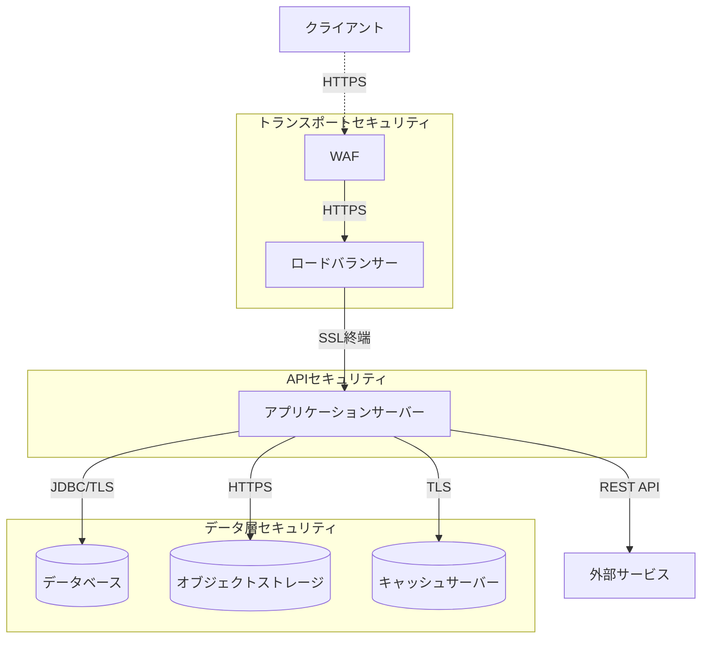

# SES業務システム 通信セキュリティ詳細設計

## 1. 概要

### 1.1 目的

本ドキュメントは、SES業務システムにおける通信セキュリティの詳細設計を定義するものである。クライアント-サーバー間およびサーバー-サーバー間の通信を保護し、データの機密性、完全性および可用性を確保するための技術的施策について記述する。

### 1.2 前提条件

- Spring Boot 3.2.xをベースとしたアプリケーション
- モノリシックアーキテクチャ内部の通信および外部との通信セキュリティを対象
- クラウド環境（AWS/Azure/GCP）へのデプロイを想定
- IP制限などのネットワークレベルの制御は対象外（インフラストラクチャ設計で定義）

### 1.3 関連ドキュメント

- [基本設計書：セキュリティ設計](/docs/02_基本設計/システム設計/05_セキュリティ設計.html)
- [詳細設計：認証・認可機能](/docs/03_詳細設計/05_セキュリティ/02_認証認可設計.md)
- [詳細設計：データ保護機能](/docs/03_詳細設計/05_セキュリティ/03_データ保護設計.md)

## 2. 通信セキュリティアーキテクチャ

### 2.1 通信セキュリティ概要図



### 2.2 通信セキュリティ階層

SES業務システムの通信セキュリティは、以下の階層で構成される：

1. **ネットワークレイヤーセキュリティ**
   - IP制限、仮想ネットワーク分離（VPC/VNET等）
   - ファイアウォール、WAF（Web Application Firewall）
   - DDoS対策

2. **トランスポートレイヤーセキュリティ**
   - TLS 1.3によるデータ保護
   - 安全な暗号スイートの設定
   - 証明書管理

3. **アプリケーションレイヤーセキュリティ**
   - APIセキュリティ
   - コンテンツセキュリティポリシー（CSP）
   - クロスサイトリクエストフォージェリ（CSRF）対策
   - WebSocket保護

4. **データレイヤーセキュリティ**
   - 転送中のデータの検証
   - メッセージレベルの暗号化
   - API入出力フィルタリング

## 3. TLSの実装

### 3.1 TLS設定

SES業務システムでは、すべての通信に対してTLS 1.3を使用する。以下に、そのための実装方針を示す：

#### 3.1.1 Spring Bootでの実装

Spring Boot構成ファイル（application.yml）での設定：

```yaml
server:
  port: 8443
  ssl:
    enabled: true
    key-store: classpath:keystore/server.p12
    key-store-password: ${KEY_STORE_PASSWORD}
    key-store-type: PKCS12
    key-alias: sesapp
    ciphers: TLS_AES_256_GCM_SHA384,TLS_AES_128_GCM_SHA256,TLS_CHACHA20_POLY1305_SHA256
    enabled-protocols: TLSv1.3
    client-auth: none
```

Java設定クラスでの実装：

```java
@Configuration
public class TlsConfig {
    
    @Bean
    public WebServerFactoryCustomizer<TomcatServletWebServerFactory> tlsCustomizer() {
        return (factory) -> {
            factory.addConnectorCustomizers(connector -> {
                Connector.setAttribute("sslImplementationName", "org.apache.tomcat.util.net.openssl.OpenSSLImplementation");
                connector.setAttribute("sslEnabledProtocols", "TLSv1.3");
                connector.setAttribute("sslHonorCipherOrder", "true");
                
                // HTTPSを強制するためのリダイレクト設定
                connector.setAttribute("redirectPort", "8443");
            });
        };
    }
    
    @Bean
    public FilterRegistrationBean<HttpsEnforcer> httpsEnforcer() {
        FilterRegistrationBean<HttpsEnforcer> registrationBean = new FilterRegistrationBean<>();
        registrationBean.setFilter(new HttpsEnforcer());
        registrationBean.addUrlPatterns("/*");
        registrationBean.setOrder(Ordered.HIGHEST_PRECEDENCE);
        return registrationBean;
    }
}
```

#### 3.1.2 HTTPSリダイレクト実装

セキュアでない接続（HTTP）を自動的にHTTPSにリダイレクトするフィルター：

```java
public class HttpsEnforcer implements Filter {
    
    @Value("${app.security.https.enabled:true}")
    private boolean httpsEnabled;
    
    @Override
    public void doFilter(ServletRequest request, ServletResponse response, FilterChain chain)
            throws IOException, ServletException {
        
        if (httpsEnabled && request instanceof HttpServletRequest) {
            HttpServletRequest httpRequest = (HttpServletRequest) request;
            HttpServletResponse httpResponse = (HttpServletResponse) response;
            
            // HTTPS接続でない場合、かつ開発環境でない場合
            if (!httpRequest.isSecure() && !isDevEnvironment()) {
                String httpsUrl = "https://" + httpRequest.getServerName() + 
                                 (httpRequest.getServerPort() != 80 ? ":" + httpRequest.getServerPort() : "") +
                                 httpRequest.getRequestURI() +
                                 (httpRequest.getQueryString() != null ? "?" + httpRequest.getQueryString() : "");
                
                httpResponse.sendRedirect(httpsUrl);
                return;
            }
        }
        
        chain.doFilter(request, response);
    }
    
    private boolean isDevEnvironment() {
        return Arrays.asList(environment.getActiveProfiles()).contains("dev");
    }
    
    // init()およびdestroy()メソッドの実装省略
}
```

#### 3.1.3 証明書管理

本番環境では、信頼された認証局（CA）の証明書を使用する。開発およびテスト環境では、自己署名証明書を使用する。

証明書生成スクリプト（開発環境用）：

```bash
#!/bin/bash
# 開発環境用の自己署名証明書生成スクリプト

KEYSTORE_FILE="keystore/server.p12"
KEYSTORE_PASSWORD="changeit"
KEYSTORE_ALIAS="sesapp"
VALIDITY_DAYS=365

# キーストレージディレクトリの作成
mkdir -p keystore

# RSA鍵ペアと自己署名証明書の生成
keytool -genkeypair \
  -alias $KEYSTORE_ALIAS \
  -keyalg RSA \
  -keysize 2048 \
  -sigalg SHA256withRSA \
  -dname "CN=localhost, OU=Development, O=SES App, L=Tokyo, ST=Tokyo, C=JP" \
  -validity $VALIDITY_DAYS \
  -keystore $KEYSTORE_FILE \
  -storepass $KEYSTORE_PASSWORD \
  -keypass $KEYSTORE_PASSWORD \
  -deststoretype PKCS12

echo "キーストア $KEYSTORE_FILE が作成されました"
```

### 3.2 APIクライアントでのTLS実装

バックエンドAPIを呼び出すRESTテンプレートの設定：

```java
@Configuration
public class RestTemplateConfig {
    
    @Value("${app.security.trust-store:classpath:keystore/truststore.jks}")
    private Resource trustStore;
    
    @Value("${app.security.trust-store-password:changeit}")
    private String trustStorePassword;
    
    @Bean
    public RestTemplate restTemplate() throws Exception {
        SSLContext sslContext = SSLContextBuilder.create()
            .loadTrustMaterial(trustStore.getURL(), trustStorePassword.toCharArray())
            .build();
        
        SSLConnectionSocketFactory socketFactory = new SSLConnectionSocketFactory(
            sslContext,
            new String[] { "TLSv1.3" },
            null,
            NoopHostnameVerifier.INSTANCE);
        
        HttpClient httpClient = HttpClients.custom()
            .setSSLSocketFactory(socketFactory)
            .setMaxConnTotal(100)
            .setMaxConnPerRoute(20)
            .build();
        
        HttpComponentsClientHttpRequestFactory factory = new HttpComponentsClientHttpRequestFactory(httpClient);
        factory.setConnectTimeout(5000);
        factory.setReadTimeout(10000);
        
        return new RestTemplate(factory);
    }
    
    @Bean
    public WebClient webClient() throws Exception {
        HttpClient httpClient = HttpClient.create()
            .secure(sslContextSpec -> sslContextSpec
                .sslContext(SslContextBuilder
                    .forClient()
                    .trustManager(InsecureTrustManagerFactory.INSTANCE)
                    .protocols("TLSv1.3")
                    .build())
            )
            .option(ChannelOption.CONNECT_TIMEOUT_MILLIS, 5000)
            .responseTimeout(Duration.ofMillis(10000));
        
        return WebClient.builder()
            .clientConnector(new ReactorClientHttpConnector(httpClient))
            .codecs(configurer -> configurer
                .defaultCodecs()
                .maxInMemorySize(2 * 1024 * 1024)) // 2MB
            .build();
    }
}
```

### 3.3 データベース接続のTLS保護

PostgreSQLへの接続にTLSを適用：

```yaml
spring:
  datasource:
    url: jdbc:postgresql://db.example.com:5432/sesapp?ssl=true&sslmode=verify-full&sslrootcert=${DB_ROOT_CERT_PATH}
    username: ${DB_USERNAME}
    password: ${DB_PASSWORD}
```

### 3.4 HSTS(HTTP Strict Transport Security)の実装

WebセキュリティコンフィギュレーションでのHSTS設定：

```java
@Configuration
@EnableWebSecurity
public class WebSecurityConfig {
    
    @Bean
    public SecurityFilterChain filterChain(HttpSecurity http) throws Exception {
        http
            // 他のセキュリティ設定...
            
            // HSTS設定
            .headers(headers -> headers
                .httpStrictTransportSecurity(hsts -> hsts
                    .includeSubDomains(true)
                    .maxAgeInSeconds(31536000) // 1年
                    .preload(true)
                )
            );
        
        return http.build();
    }
}
```

## 4. APIセキュリティ

### 4.1 コンテンツセキュリティポリシー（CSP）

#### 4.1.1 CSP設定

CSPヘッダーを設定して、XSSやデータインジェクション攻撃のリスクを低減：

```java
@Configuration
public class ContentSecurityPolicyConfig {
    
    @Bean
    public FilterRegistrationBean<ContentSecurityPolicyFilter> cspFilter() {
        FilterRegistrationBean<ContentSecurityPolicyFilter> registrationBean = new FilterRegistrationBean<>();
        
        ContentSecurityPolicyFilter cspFilter = new ContentSecurityPolicyFilter();
        registrationBean.setFilter(cspFilter);
        registrationBean.addUrlPatterns("/*");
        registrationBean.setOrder(Ordered.HIGHEST_PRECEDENCE + 10);
        
        return registrationBean;
    }
}

public class ContentSecurityPolicyFilter implements Filter {
    
    @Value("${app.security.csp.enabled:true}")
    private boolean cspEnabled;
    
    @Override
    public void doFilter(ServletRequest request, ServletResponse response, FilterChain chain)
            throws IOException, ServletException {
        
        if (cspEnabled && response instanceof HttpServletResponse) {
            HttpServletResponse httpResponse = (HttpServletResponse) response;
            
            StringBuilder cspBuilder = new StringBuilder();
            cspBuilder.append("default-src 'self'; ");
            cspBuilder.append("script-src 'self' 'unsafe-inline' https://cdn.jsdelivr.net; ");
            cspBuilder.append("style-src 'self' 'unsafe-inline' https://cdn.jsdelivr.net; ");
            cspBuilder.append("img-src 'self' data: https://cdn.jsdelivr.net; ");
            cspBuilder.append("font-src 'self' https://cdn.jsdelivr.net; ");
            cspBuilder.append("connect-src 'self'; ");
            cspBuilder.append("frame-ancestors 'none'; ");
            cspBuilder.append("form-action 'self'; ");
            cspBuilder.append("base-uri 'self'; ");
            cspBuilder.append("object-src 'none'");
            
            httpResponse.setHeader("Content-Security-Policy", cspBuilder.toString());
        }
        
        chain.doFilter(request, response);
    }
    
    // init()およびdestroy()メソッドの実装省略
}
```

### 4.2 クロスオリジンリソース共有（CORS）

#### 4.2.1 CORS設定

Spring SecurityでのCORS設定：

```java
@Configuration
public class CorsConfig {
    
    @Value("${app.security.cors.allowed-origins}")
    private String[] allowedOrigins;
    
    @Value("${app.security.cors.allowed-methods:GET,POST,PUT,DELETE,OPTIONS}")
    private String[] allowedMethods;
    
    @Value("${app.security.cors.allowed-headers:Authorization,Content-Type}")
    private String[] allowedHeaders;
    
    @Value("${app.security.cors.exposed-headers:Authorization}")
    private String[] exposedHeaders;
    
    @Value("${app.security.cors.allow-credentials:true}")
    private boolean allowCredentials;
    
    @Value("${app.security.cors.max-age:3600}")
    private long maxAge;
    
    @Bean
    public CorsConfigurationSource corsConfigurationSource() {
        CorsConfiguration configuration = new CorsConfiguration();
        configuration.setAllowedOrigins(Arrays.asList(allowedOrigins));
        configuration.setAllowedMethods(Arrays.asList(allowedMethods));
        configuration.setAllowedHeaders(Arrays.asList(allowedHeaders));
        configuration.setExposedHeaders(Arrays.asList(exposedHeaders));
        configuration.setAllowCredentials(allowCredentials);
        configuration.setMaxAge(maxAge);
        
        UrlBasedCorsConfigurationSource source = new UrlBasedCorsConfigurationSource();
        source.registerCorsConfiguration("/**", configuration);
        
        return source;
    }
}
```

Spring Securityとの統合：

```java
@Configuration
@EnableWebSecurity
public class WebSecurityConfig {
    
    @Autowired
    private CorsConfigurationSource corsConfigurationSource;
    
    @Bean
    public SecurityFilterChain filterChain(HttpSecurity http) throws Exception {
        http
            // CSRFと他のセキュリティ設定...
            
            // CORS設定の適用
            .cors(cors -> cors.configurationSource(corsConfigurationSource));
        
        return http.build();
    }
}
```

### 4.3 クロスサイトリクエストフォージェリ（CSRF）対策

#### 4.3.1 CSRF保護の実装

REST APIでのCSRF保護メカニズムの実装：

```java
@Configuration
@EnableWebSecurity
public class WebSecurityConfig {
    
    @Bean
    public SecurityFilterChain filterChain(HttpSecurity http) throws Exception {
        http
            // RESTful APIではCSRF保護を無効化
            // JWT認証を使用する場合はCSRF保護が不要（ステートレス認証のため）
            .csrf(csrf -> csrf.disable());
        
        // または必要に応じてCSRF保護を有効化：
        /*
        http
            .csrf(csrf -> csrf
                .csrfTokenRepository(CookieCsrfTokenRepository.withHttpOnlyFalse())
                .ignoringRequestMatchers("/api/v1/auth/**") // 認証APIはCSRF保護から除外
            );
        */
        
        return http.build();
    }
}
```

フォームベースの認証を使用する管理画面向けのCSRF保護：

```java
@Configuration
@EnableWebSecurity
public class AdminWebSecurityConfig {
    
    @Bean
    public SecurityFilterChain adminFilterChain(HttpSecurity http) throws Exception {
        http
            .securityMatcher("/admin/**")
            // 管理画面ではCSRF保護を有効化
            .csrf(csrf -> csrf
                .csrfTokenRepository(CookieCsrfTokenRepository.withHttpOnlyFalse())
            );
        
        return http.build();
    }
}
```

### 4.4 WebSocket通信のセキュリティ

#### 4.4.1 WebSocket設定

Spring WebSocketのセキュリティ設定：

```java
@Configuration
@EnableWebSocketMessageBroker
public class WebSocketConfig implements WebSocketMessageBrokerConfigurer {
    
    @Override
    public void configureMessageBroker(MessageBrokerRegistry config) {
        config.enableSimpleBroker("/topic");
        config.setApplicationDestinationPrefixes("/app");
    }
    
    @Override
    public void registerStompEndpoints(StompEndpointRegistry registry) {
        registry.addEndpoint("/ws")
            .setAllowedOrigins("https://example.com") // 本番環境のオリジンを指定
            .withSockJS();
    }
    
    @Override
    public void configureClientInboundChannel(ChannelRegistration registration) {
        registration.interceptors(new ChannelInterceptor() {
            @Override
            public Message<?> preSend(Message<?> message, MessageChannel channel) {
                StompHeaderAccessor accessor = MessageHeaderAccessor.getAccessor(message, StompHeaderAccessor.class);
                
                if (StompCommand.CONNECT.equals(accessor.getCommand())) {
                    // JWT認証トークンの検証
                    String token = accessor.getFirstNativeHeader("Authorization");
                    if (token != null && token.startsWith("Bearer ")) {
                        token = token.substring(7);
                        
                        try {
                            // トークンの検証
                            Authentication auth = jwtTokenProvider.getAuthentication(token);
                            SecurityContextHolder.getContext().setAuthentication(auth);
                            accessor.setUser(auth);
                        } catch (Exception e) {
                            // 認証失敗
                            throw new MessageDeliveryException("認証エラー: " + e.getMessage());
                        }
                    } else {
                        throw new MessageDeliveryException("認証トークンがありません");
                    }
                }
                
                return message;
            }
        });
    }
}
```

#### 4.4.2 WebSocketメッセージセキュリティ

WebSocketメッセージの認可設定：

```java
@Configuration
public class WebSocketSecurityConfig {
    
    @Bean
    public ChannelSecurityInterceptor inboundChannelSecurity() {
        ChannelSecurityInterceptor interceptor = new ChannelSecurityInterceptor();
        interceptor.setSecurityMetadataSource(webSocketMessageSecurityMetadataSource());
        return interceptor;
    }
    
    @Bean
    public WebSocketMessageSecurityMetadataSource webSocketMessageSecurityMetadataSource() {
        Map<MessageMatcher<?>, Collection<ConfigAttribute>> mappings = new LinkedHashMap<>();
        
        // 'ADMIN'ロールのみが管理関連メッセージを送信可能
        mappings.put(SimpDestinationMessageMatcher.createDestinationMatcherForSendTo("/topic/admin.*"), 
                    SecurityConfig.createList("ROLE_ADMIN"));
        
        // 'USER'ロールがあれば一般メッセージを送信可能
        mappings.put(SimpDestinationMessageMatcher.createDestinationMatcherForSendTo("/topic/public.*"), 
                    SecurityConfig.createList("ROLE_USER"));
        
        return new DefaultWebSocketMessageSecurityMetadataSource(mappings);
    }
}
```

## 5. APIリクエスト/レスポンスの保護

### 5.1 リクエスト検証

#### 5.1.1 入力検証フィルター

すべてのAPIリクエストに対する入力検証フィルター：

```java
@Component
@Order(Ordered.HIGHEST_PRECEDENCE + 20)
public class RequestValidationFilter extends OncePerRequestFilter {
    
    @Override
    protected void doFilterInternal(HttpServletRequest request, HttpServletResponse response, FilterChain filterChain)
            throws ServletException, IOException {
        
        // API パスのみ処理（静的コンテンツは除外）
        if (request.getRequestURI().startsWith("/api/")) {
            // 1. リクエストサイズの制限チェック
            if (request.getContentLength() > getMaxRequestSize()) {
                response.sendError(HttpStatus.PAYLOAD_TOO_LARGE.value(), "リクエストサイズが上限を超えています");
                return;
            }
            
            // 2. Content-Typeの検証（APIリクエストはJSONのみ許可）
            if (request.getMethod().equals("POST") || request.getMethod().equals("PUT")) {
                String contentType = request.getContentType();
                if (contentType == null || !contentType.contains("application/json")) {
                    response.sendError(HttpStatus.UNSUPPORTED_MEDIA_TYPE.value(), "Content-Typeはapplication/jsonである必要があります");
                    return;
                }
            }
            
            // 3. その他のリクエストヘッダー検証
            // ...
        }
        
        filterChain.doFilter(request, response);
    }
    
    // 環境ごとに設定可能な最大リクエストサイズ
    private int getMaxRequestSize() {
        // 設定から値を取得または既定値を使用
        return 10 * 1024 * 1024; // 10MB
    }
    
    @Override
    protected boolean shouldNotFilter(HttpServletRequest request) {
        // 静的リソースなど、フィルタを適用しないパスを指定
        String path = request.getRequestURI();
        return path.startsWith("/static/") || 
               path.startsWith("/assets/") || 
               path.startsWith("/favicon.ico");
    }
}
```

#### 5.1.2 リクエストレート制限

API呼び出しの頻度を制限するレート制限の実装：

```java
@Component
@Order(Ordered.HIGHEST_PRECEDENCE + 15)
public class RateLimitingFilter extends OncePerRequestFilter {
    
    private final RateLimiter rateLimiter;
    
    public RateLimitingFilter(RedisTemplate<String, Object> redisTemplate) {
        this.rateLimiter = new RateLimiter(redisTemplate);
    }
    
    @Override
    protected void doFilterInternal(HttpServletRequest request, HttpServletResponse response, FilterChain filterChain)
            throws ServletException, IOException {
        
        // API パスのみ処理
        if (request.getRequestURI().startsWith("/api/")) {
            // クライアント識別子を取得（IPアドレスまたはユーザーID）
            String clientId = getClientIdentifier(request);
            
            // レート制限をチェック
            RateLimitResult result = rateLimiter.checkRateLimit(clientId, getApiPath(request));
            
            if (!result.isAllowed()) {
                // レート制限超過時のレスポンスヘッダー設定
                response.setHeader("X-RateLimit-Limit", String.valueOf(result.getLimit()));
                response.setHeader("X-RateLimit-Remaining", "0");
                response.setHeader("X-RateLimit-Reset", String.valueOf(result.getResetTime()));
                
                response.sendError(HttpStatus.TOO_MANY_REQUESTS.value(), 
                                "レート制限を超過しました。" + result.getResetTime() + "秒後に再試行してください。");
                return;
            }
            
            // 残りのレート情報をレスポンスヘッダーに設定
            response.setHeader("X-RateLimit-Limit", String.valueOf(result.getLimit()));
            response.setHeader("X-RateLimit-Remaining", String.valueOf(result.getRemaining()));
        }
        
        filterChain.doFilter(request, response);
    }
    
    private String getClientIdentifier(HttpServletRequest request) {
        // 認証済みユーザーの場合はユーザーID、未認証の場合はIPアドレスを使用
        Authentication auth = SecurityContextHolder.getContext().getAuthentication();
        if (auth != null && auth.isAuthenticated() && !(auth instanceof AnonymousAuthenticationToken)) {
            return "user_" + auth.getName();
        } else {
            return "ip_" + request.getRemoteAddr();
        }
    }
    
    private String getApiPath(HttpServletRequest request) {
        String uri = request.getRequestURI();
        // IDなどの可変部分を汎用パターンに置き換え
        return uri.replaceAll("/\\d+", "/{id}");
    }
    
    @Override
    protected boolean shouldNotFilter(HttpServletRequest request) {
        // 静的リソースなど、フィルタを適用しないパスを指定
        String path = request.getRequestURI();
        return path.startsWith("/static/") || 
               path.startsWith("/assets/") || 
               path.startsWith("/favicon.ico");
    }
}

@Component
public class RateLimiter {
    
    private final RedisTemplate<String, Object> redisTemplate;
    
    // APIパスごとのレート制限設定
    private final Map<String, RateLimitConfig> rateLimitConfigs;
    
    public RateLimiter(RedisTemplate<String, Object> redisTemplate) {
        this.redisTemplate = redisTemplate;
        
        // APIパスごとのレート制限を設定
        this.rateLimitConfigs = new HashMap<>();
        
        // デフォルト設定
        RateLimitConfig defaultConfig = new RateLimitConfig(100, 60); // 1分間に100リクエスト
        this.rateLimitConfigs.put("default", defaultConfig);
        
        // ログインAPIは頻度を制限
        this.rateLimitConfigs.put("/api/v1/auth/login", new RateLimitConfig(5, 60)); // 1分間に5リクエスト
        
        // パスワードリセットAPIも頻度を制限
        this.rateLimitConfigs.put("/api/v1/auth/password-reset", new RateLimitConfig(3, 300)); // 5分間に3リクエスト
    }
    
    public RateLimitResult checkRateLimit(String clientId, String apiPath) {
        // APIパスに対応するレート制限設定を取得（なければデフォルト設定を使用）
        RateLimitConfig config = rateLimitConfigs.getOrDefault(apiPath, rateLimitConfigs.get("default"));
        
        // Redis用のキーを生成（クライアントID + APIパス + 時間枠）
        String redisKey = "rate_limit:" + clientId + ":" + apiPath + ":" + (System.currentTimeMillis() / (config.getTimeWindow() * 1000));
        
        // 現在のカウントをインクリメント
        Long currentCount = redisTemplate.opsForValue().increment(redisKey, 1);
        
        // キーの有効期限を設定（設定された時間枠＋1秒）
        if (currentCount != null && currentCount == 1) {
            redisTemplate.expire(redisKey, config.getTimeWindow() + 1, TimeUnit.SECONDS);
        }
        
        // 結果を返却
        boolean allowed = currentCount != null && currentCount <= config.getRequestLimit();
        long remaining = currentCount != null ? Math.max(0, config.getRequestLimit() - currentCount) : 0;
        
        return new RateLimitResult(allowed, config.getRequestLimit(), remaining, config.getTimeWindow());
    }
    
    // 内部クラス: レート制限設定
    @Data
    @AllArgsConstructor
    public static class RateLimitConfig {
        private int requestLimit;    // 時間枠内の最大リクエスト数
        private int timeWindow;      // 時間枠（秒）
    }
    
    // 内部クラス: レート制限チェック結果
    @Data
    @AllArgsConstructor
    public static class RateLimitResult {
        private boolean allowed;     // リクエスト許可フラグ
        private int limit;           // 制限値
        private long remaining;      // 残りリクエスト数
        private long resetTime;      // リセットまでの時間（秒）
    }
}
```

### 5.2 レスポンス保護

#### 5.2.1 レスポンスヘッダー設定

セキュリティ関連のレスポンスヘッダーを設定するフィルター：

```java
@Component
@Order(Ordered.HIGHEST_PRECEDENCE + 25)
public class SecurityHeadersFilter extends OncePerRequestFilter {
    
    @Override
    protected void doFilterInternal(HttpServletRequest request, HttpServletResponse response, FilterChain filterChain)
            throws ServletException, IOException {
        
        // 1. X-Content-Type-Options: "nosniff"
        // ブラウザによるMIMEタイプのスニッフィングを防止
        response.setHeader("X-Content-Type-Options", "nosniff");
        
        // 2. X-Frame-Options: "DENY"
        // クリックジャッキング対策：フレーム内での表示を禁止
        response.setHeader("X-Frame-Options", "DENY");
        
        // 3. X-XSS-Protection: "1; mode=block"
        // ブラウザ組み込みのXSS保護を有効化（レガシーブラウザー向け）
        response.setHeader("X-XSS-Protection", "1; mode=block");
        
        // 4. Cache-Control
        // 認証情報を含むページのキャッシュを防止
        if (request.getRequestURI().startsWith("/api/")) {
            response.setHeader("Cache-Control", "no-store, max-age=0, must-revalidate");
            response.setHeader("Pragma", "no-cache");
            response.setHeader("Expires", "0");
        }
        
        // 5. Referrer-Policy
        // リファラー情報の制御
        response.setHeader("Referrer-Policy", "strict-origin-when-cross-origin");
        
        // 6. Feature-Policy/Permissions-Policy
        // 特定のブラウザ機能の使用を制限
        response.setHeader("Permissions-Policy", "camera=(), microphone=(), geolocation=()");
        
        filterChain.doFilter(request, response);
    }
}
```

## 6. APIエンドポイントセキュリティ

### 6.1 エンドポイント別セキュリティポリシー

API設計におけるセキュリティポリシーの定義：

| エンドポイント | HTTP メソッド | 認証要件 | 認可要件 | レート制限 | その他の制約 |
|--------------|-------------|---------|---------|----------|-----------|
| /api/v1/auth/login | POST | 不要 | 不要 | 60秒で5回 | IPベースの制限 |
| /api/v1/auth/refresh | POST | リフレッシュトークン | 不要 | 60秒で10回 | - |
| /api/v1/engineers | GET | 必須 | ENGINEER_VIEW | 60秒で50回 | ページネーション必須 |
| /api/v1/engineers/{id} | GET | 必須 | ENGINEER_VIEW または 自身のプロフィール | 60秒で100回 | - |
| /api/v1/engineers | POST | 必須 | ENGINEER_CREATE | 60秒で20回 | 入力検証必須 |
| /api/v1/engineers/{id} | PUT | 必須 | ENGINEER_EDIT または 自身のプロフィール | 60秒で20回 | 入力検証必須 |
| /api/v1/admin/* | 全て | 必須 | ROLE_ADMIN | 60秒で30回 | 監査ログ記録 |

### 6.2 APIデータフィルタリング

センシティブデータを自動的にフィルタリングするResponseBodyAdvice実装：

```java
@ControllerAdvice
public class SensitiveDataFilterAdvice implements ResponseBodyAdvice<Object> {
    
    @Autowired
    private ObjectMapper objectMapper;
    
    @Override
    public boolean supports(MethodParameter returnType, Class<? extends HttpMessageConverter<?>> converterType) {
        // DTOクラスの応答のみを処理
        return returnType.getParameterType().getName().endsWith("Dto") || 
               returnType.getParameterType().getName().endsWith("Response");
    }
    
    @Override
    public Object beforeBodyWrite(Object body, MethodParameter returnType, MediaType selectedContentType,
                                 Class<? extends HttpMessageConverter<?>> selectedConverterType, 
                                 ServerHttpRequest request, ServerHttpResponse response) {
        
        if (body == null) {
            return null;
        }
        
        // ユーザーロールに基づいて表示可能なフィールドを制御
        Authentication auth = SecurityContextHolder.getContext().getAuthentication();
        Set<String> authorities = auth.getAuthorities().stream()
            .map(GrantedAuthority::getAuthority)
            .collect(Collectors.toSet());
        
        // 管理者以外の場合、機密データをフィルタリング
        if (!authorities.contains("ROLE_ADMIN")) {
            // 単一オブジェクトの場合
            if (body instanceof List) {
                List<?> list = (List<?>) body;
                return list.stream()
                    .map(item -> filterSensitiveData(item, authorities))
                    .collect(Collectors.toList());
            } else {
                return filterSensitiveData(body, authorities);
            }
        }
        
        return body;
    }
    
    private Object filterSensitiveData(Object obj, Set<String> authorities) {
        // Deep copy to avoid modifying the original object
        try {
            // オブジェクトをJSONに変換後、再びオブジェクトに変換して深いコピーを作成
            String json = objectMapper.writeValueAsString(obj);
            Object copy = objectMapper.readValue(json, obj.getClass());
            
            // アノテーションを使用して機密フィールドを特定し、権限に基づいてフィルタリング
            for (Field field : obj.getClass().getDeclaredFields()) {
                SensitiveData annotation = field.getAnnotation(SensitiveData.class);
                if (annotation != null) {
                    // 必要な権限がない場合、フィールドをマスク/削除
                    if (!Collections.disjoint(Arrays.asList(annotation.requiredAuthorities()), authorities)) {
                        field.setAccessible(true);
                        
                        if (annotation.maskPolicy() == MaskPolicy.FULL_MASK) {
                            // 完全マスク
                            if (field.getType() == String.class) {
                                field.set(copy, "*****");
                            } else if (field.getType() == Integer.class || field.getType() == Long.class) {
                                field.set(copy, 0);
                            } else {
                                field.set(copy, null);
                            }
                        } else if (annotation.maskPolicy() == MaskPolicy.PARTIAL_MASK) {
                            // 部分マスク（文字列のみ対応）
                            if (field.getType() == String.class) {
                                String value = (String) field.get(obj);
                                if (value != null && !value.isEmpty()) {
                                    int visibleChars = Math.min(2, value.length());
                                    String maskedValue = value.substring(0, visibleChars) + 
                                                        "*".repeat(Math.max(0, value.length() - visibleChars));
                                    field.set(copy, maskedValue);
                                }
                            }
                        }
                    }
                }
            }
            
            return copy;
            
        } catch (Exception e) {
            // エラーが発生した場合は元のオブジェクトを返す
            return obj;
        }
    }
}

@Retention(RetentionPolicy.RUNTIME)
@Target(ElementType.FIELD)
public @interface SensitiveData {
    String[] requiredAuthorities() default {"ROLE_ADMIN"};
    MaskPolicy maskPolicy() default MaskPolicy.FULL_MASK;
}

public enum MaskPolicy {
    FULL_MASK,      // 完全にマスクまたはnull化
    PARTIAL_MASK    // 一部を表示して残りをマスク
}
```

使用例：

```java
public class EngineerResponseDto {
    
    private Long id;
    private String fullName;
    private String email;
    
    @SensitiveData(requiredAuthorities = {"ROLE_HR", "ROLE_ADMIN"})
    private String phoneNumber;
    
    @SensitiveData(requiredAuthorities = {"ROLE_HR", "ROLE_ADMIN"}, maskPolicy = MaskPolicy.PARTIAL_MASK)
    private String nationalId;
    
    @SensitiveData(requiredAuthorities = {"ROLE_ADMIN"})
    private String homeAddress;
    
    // その他のフィールド...
}
```

## 7. 監視と検知

### 7.1 通信セキュリティの監視

#### 7.1.1 TLS設定の定期監視

TLS設定を定期的に検証するスケジュールドタスク：

```java
@Component
public class TlsConfigChecker {
    
    private static final Logger log = LoggerFactory.getLogger(TlsConfigChecker.class);
    
    @Value("${server.ssl.enabled:false}")
    private boolean sslEnabled;
    
    @Value("${server.ssl.enabled-protocols:}")
    private String enabledProtocols;
    
    @Value("${server.ssl.ciphers:}")
    private String ciphers;
    
    @Autowired
    private AuditLogService auditLogService;
    
    @Scheduled(cron = "${app.security.tls-check-cron:0 0 1 * * ?}") // デフォルト: 毎日午前1時
    public void checkTlsConfiguration() {
        if (!sslEnabled) {
            log.warn("SSL/TLS is not enabled for the application!");
            auditLogService.logSecurityEvent("TLS_CHECK_FAILURE", "SYSTEM", "SERVER", "SSL/TLSが有効になっていません");
            return;
        }
        
        // プロトコルバージョンの検証
        List<String> protocols = Arrays.asList(enabledProtocols.split(","));
        if (!protocols.contains("TLSv1.3")) {
            log.warn("TLS 1.3 is not enabled. Current protocols: {}", enabledProtocols);
            auditLogService.logSecurityEvent("TLS_CHECK_WARNING", "SYSTEM", "SERVER", 
                                           "TLS 1.3が有効になっていません。現在のプロトコル: " + enabledProtocols);
        }
        
        // 安全でない暗号スイートの検出
        List<String> cipherList = Arrays.asList(ciphers.split(","));
        List<String> weakCiphers = cipherList.stream()
            .filter(cipher -> cipher.contains("NULL") || cipher.contains("RC4") || cipher.contains("DES"))
            .collect(Collectors.toList());
        
        if (!weakCiphers.isEmpty()) {
            log.warn("Weak ciphers detected: {}", weakCiphers);
            auditLogService.logSecurityEvent("TLS_CHECK_WARNING", "SYSTEM", "SERVER", 
                                           "脆弱な暗号スイートが検出されました: " + String.join(", ", weakCiphers));
        }
        
        log.info("TLS configuration check completed. Protocols: {}, Ciphers: {}", enabledProtocols, ciphers);
    }
}
```

### 7.2 異常通信の検知

#### 7.2.1 異常パターン検知

通信の異常パターンを検知する仕組み：

```java
@Component
@Order(Ordered.HIGHEST_PRECEDENCE + 30)
public class AnomalyCommunicationDetector extends OncePerRequestFilter {
    
    private static final Logger log = LoggerFactory.getLogger(AnomalyCommunicationDetector.class);
    
    @Autowired
    private AuditLogService auditLogService;
    
    @Autowired
    private SecurityAlertService securityAlertService;
    
    // 簡易的な検知パターン（実際にはもっと複雑になる）
    private static final Pattern SQL_INJECTION_PATTERN = 
        Pattern.compile("'\\s*or\\s*'1'='1|union\\s+select|exec\\s+xp_|--\\s*$", Pattern.CASE_INSENSITIVE);
    private static final Pattern XSS_PATTERN = 
        Pattern.compile("<script[^>]*>|javascript:", Pattern.CASE_INSENSITIVE);
    private static final Pattern PATH_TRAVERSAL_PATTERN = 
        Pattern.compile("\\.\\.\\/|\\.\\.\\\\" , Pattern.CASE_INSENSITIVE);
    
    @Override
    protected void doFilterInternal(HttpServletRequest request, HttpServletResponse response, FilterChain filterChain)
            throws ServletException, IOException {
        
        // リクエストURIとパラメータを検査
        String uri = request.getRequestURI();
        String queryString = request.getQueryString();
        String clientIp = request.getRemoteAddr();
        
        boolean anomalyDetected = false;
        String anomalyType = null;
        String anomalyDetail = null;
        
        // パス侵入検知
        if (PATH_TRAVERSAL_PATTERN.matcher(uri).find()) {
            anomalyDetected = true;
            anomalyType = "PATH_TRAVERSAL";
            anomalyDetail = "ディレクトリトラバーサル攻撃の疑い: " + uri;
        }
        
        // クエリパラメータのチェック
        if (queryString != null) {
            if (SQL_INJECTION_PATTERN.matcher(queryString).find()) {
                anomalyDetected = true;
                anomalyType = "SQL_INJECTION";
                anomalyDetail = "SQLインジェクション攻撃の疑い: " + queryString;
            } else if (XSS_PATTERN.matcher(queryString).find()) {
                anomalyDetected = true;
                anomalyType = "XSS";
                anomalyDetail = "クロスサイトスクリプティング攻撃の疑い: " + queryString;
            }
        }
        
        // POSTデータのチェック
        if ("POST".equals(request.getMethod()) || "PUT".equals(request.getMethod())) {
            if (request.getContentType() != null && request.getContentType().contains("application/json")) {
                try {
                    // リクエストボディの読み取り（一度だけ）
                    String body = streamToString(request.getInputStream());
                    
                    // 再度読み取り可能なリクエストでラップ
                    request = new RequestWrapper(request, body);
                    
                    // JSONデータの検査
                    if (SQL_INJECTION_PATTERN.matcher(body).find()) {
                        anomalyDetected = true;
                        anomalyType = "SQL_INJECTION";
                        anomalyDetail = "SQLインジェクション攻撃の疑い（リクエストボディ）";
                    } else if (XSS_PATTERN.matcher(body).find()) {
                        anomalyDetected = true;
                        anomalyType = "XSS";
                        anomalyDetail = "クロスサイトスクリプティング攻撃の疑い（リクエストボディ）";
                    }
                } catch (Exception e) {
                    log.warn("リクエストボディの検査中にエラーが発生しました", e);
                }
            }
        }
        
        // 異常が検出された場合
        if (anomalyDetected) {
            // 監査ログに記録
            auditLogService.logSecurityEvent(anomalyType, "ANONYMOUS", clientIp, anomalyDetail);
            
            // セキュリティアラートを発生
            securityAlertService.raiseAlert(anomalyType, clientIp, anomalyDetail);
            
            // 応答処理（403を返すか、通常処理を続けるかはポリシーによる）
            response.sendError(HttpStatus.FORBIDDEN.value(), "不正なリクエストが検出されました");
            return;
        }
        
        filterChain.doFilter(request, response);
    }
    
    private String streamToString(InputStream inputStream) throws IOException {
        try (BufferedReader br = new BufferedReader(new InputStreamReader(inputStream, StandardCharsets.UTF_8))) {
            return br.lines().collect(Collectors.joining(System.lineSeparator()));
        }
    }
    
    // リクエストボディを再読み取り可能にするラッパークラス
    private static class RequestWrapper extends HttpServletRequestWrapper {
        private final String body;
        
        public RequestWrapper(HttpServletRequest request, String body) {
            super(request);
            this.body = body;
        }
        
        @Override
        public ServletInputStream getInputStream() throws IOException {
            final ByteArrayInputStream byteArrayInputStream = new ByteArrayInputStream(body.getBytes(StandardCharsets.UTF_8));
            
            return new ServletInputStream() {
                @Override
                public boolean isFinished() {
                    return byteArrayInputStream.available() == 0;
                }
                
                @Override
                public boolean isReady() {
                    return true;
                }
                
                @Override
                public void setReadListener(ReadListener readListener) {
                    throw new UnsupportedOperationException();
                }
                
                @Override
                public int read() throws IOException {
                    return byteArrayInputStream.read();
                }
            };
        }
        
        @Override
        public BufferedReader getReader() throws IOException {
            return new BufferedReader(new InputStreamReader(getInputStream(), StandardCharsets.UTF_8));
        }
    }
}
```

## 8. テスト方針

### 8.1 通信セキュリティのテスト手法

#### 8.1.1 TLS構成テスト

TLS設定のテストコード：

```java
@RunWith(SpringRunner.class)
@SpringBootTest(webEnvironment = SpringBootTest.WebEnvironment.RANDOM_PORT)
public class TlsConfigurationTest {
    
    @LocalServerPort
    private int port;
    
    @Test
    public void testTlsVersion() throws Exception {
        URL url = new URL("https://localhost:" + port + "/actuator/health");
        HttpsURLConnection connection = (HttpsURLConnection) url.openConnection();
        
        // SSL設定を無効化（テスト用）
        connection.setSSLSocketFactory(createTrustAllSSLSocketFactory());
        connection.setHostnameVerifier((hostname, session) -> true);
        
        connection.connect();
        
        // プロトコルバージョンを確認
        String protocol = connection.getCipherSuite();
        assertTrue("TLS 1.3が使用されていません: " + protocol, protocol.contains("TLSv1.3"));
        
        connection.disconnect();
    }
    
    @Test
    public void testWeakCiphersRejected() throws Exception {
        // 脆弱な暗号スイートのみを許可するSSLコンテキスト
        SSLContext sslContext = SSLContext.getInstance("TLS");
        sslContext.init(null, createTrustAllTrustManager(), new SecureRandom());
        
        SSLSocketFactory weakSocketFactory = new WeakCipherSocketFactory(sslContext.getSocketFactory());
        
        URL url = new URL("https://localhost:" + port + "/actuator/health");
        HttpsURLConnection connection = (HttpsURLConnection) url.openConnection();
        connection.setSSLSocketFactory(weakSocketFactory);
        connection.setHostnameVerifier((hostname, session) -> true);
        
        try {
            connection.connect();
            fail("脆弱な暗号スイートが許可されています");
        } catch (SSLHandshakeException e) {
            // 期待通りの例外
            assertTrue(e.getMessage().contains("no cipher suites in common"));
        } finally {
            connection.disconnect();
        }
    }
    
    // 信頼マネージャの実装（全ての証明書を信頼）
    private TrustManager[] createTrustAllTrustManager() {
        return new TrustManager[]{
            new X509TrustManager() {
                public X509Certificate[] getAcceptedIssuers() {
                    return new X509Certificate[0];
                }
                
                public void checkClientTrusted(X509Certificate[] certs, String authType) {
                }
                
                public void checkServerTrusted(X509Certificate[] certs, String authType) {
                }
            }
        };
    }
    
    // 全ての証明書を信頼するSSLソケットファクトリの作成
    private SSLSocketFactory createTrustAllSSLSocketFactory() throws Exception {
        SSLContext sslContext = SSLContext.getInstance("TLS");
        sslContext.init(null, createTrustAllTrustManager(), new SecureRandom());
        return sslContext.getSocketFactory();
    }
    
    // 脆弱な暗号スイートのみを許可するソケットファクトリ
    private static class WeakCipherSocketFactory extends SSLSocketFactory {
        private final SSLSocketFactory delegate;
        
        public WeakCipherSocketFactory(SSLSocketFactory delegate) {
            this.delegate = delegate;
        }
        
        @Override
        public String[] getDefaultCipherSuites() {
            return new String[]{"TLS_RSA_WITH_AES_128_CBC_SHA"};
        }
        
        @Override
        public String[] getSupportedCipherSuites() {
            return new String[]{"TLS_RSA_WITH_AES_128_CBC_SHA"};
        }
        
        @Override
        public Socket createSocket(Socket s, String host, int port, boolean autoClose) throws IOException {
            SSLSocket socket = (SSLSocket) delegate.createSocket(s, host, port, autoClose);
            socket.setEnabledCipherSuites(getDefaultCipherSuites());
            return socket;
        }
        
        // その他のメソッドの実装（省略）
        // ...
    }
}
```

#### 8.1.2 API通信セキュリティテスト

API通信のセキュリティテスト：

```java
@RunWith(SpringRunner.class)
@SpringBootTest(webEnvironment = SpringBootTest.WebEnvironment.RANDOM_PORT)
public class ApiSecurityTest {
    
    @LocalServerPort
    private int port;
    
    @Autowired
    private TestRestTemplate restTemplate;
    
    @Autowired
    private JwtTokenProvider jwtTokenProvider;
    
    private String baseUrl;
    
    @Before
    public void setUp() {
        baseUrl = "https://localhost:" + port;
        
        // 証明書検証を無効化（テスト用）
        restTemplate.getRestTemplate().setRequestFactory(new HttpComponentsClientHttpRequestFactory(
            HttpClients.custom()
                .setSSLHostnameVerifier(NoopHostnameVerifier.INSTANCE)
                .build()));
    }
    
    @Test
    public void testSecurityHeaders() {
        ResponseEntity<String> response = restTemplate.getForEntity(baseUrl + "/api/v1/public/health", String.class);
        
        // レスポンスヘッダーの検証
        HttpHeaders headers = response.getHeaders();
        
        assertEquals("nosniff", headers.getFirst("X-Content-Type-Options"));
        assertEquals("DENY", headers.getFirst("X-Frame-Options"));
        assertEquals("1; mode=block", headers.getFirst("X-XSS-Protection"));
        
        // HSTS
        String hstsHeader = headers.getFirst("Strict-Transport-Security");
        assertNotNull("HSTSヘッダーがありません", hstsHeader);
        assertTrue("HSTSの最大有効期間が不適切です", hstsHeader.contains("max-age=31536000"));
        
        // CSP
        String cspHeader = headers.getFirst("Content-Security-Policy");
        assertNotNull("CSPヘッダーがありません", cspHeader);
        assertTrue("CSPにdefault-srcの定義がありません", cspHeader.contains("default-src"));
    }
    
    @Test
    public void testCorsPolicy() {
        // CORSプリフライトリクエストのシミュレーション
        HttpHeaders headers = new HttpHeaders();
        headers.add("Origin", "https://example.com");
        headers.add("Access-Control-Request-Method", "GET");
        headers.add("Access-Control-Request-Headers", "Authorization");
        
        ResponseEntity<String> response = restTemplate.exchange(
            baseUrl + "/api/v1/engineers",
            HttpMethod.OPTIONS,
            new HttpEntity<>(headers),
            String.class);
        
        // CORSレスポンスヘッダーの検証
        HttpHeaders responseHeaders = response.getHeaders();
        
        // 許可オリジンの検証（実際の環境設定によって異なる）
        assertNotNull("Access-Control-Allow-Originヘッダーがありません", 
                    responseHeaders.getAccessControlAllowOrigin());
        
        // 許可メソッドの検証
        String allowMethods = responseHeaders.getFirst("Access-Control-Allow-Methods");
        assertNotNull("Access-Control-Allow-Methodsヘッダーがありません", allowMethods);
        assertTrue("GETメソッドが許可されていません", allowMethods.contains("GET"));
        
        // 許可ヘッダーの検証
        String allowHeaders = responseHeaders.getFirst("Access-Control-Allow-Headers");
        assertNotNull("Access-Control-Allow-Headersヘッダーがありません", allowHeaders);
        assertTrue("Authorizationヘッダーが許可されていません", allowHeaders.contains("Authorization"));
    }
    
    @Test
    public void testAuthenticatedApiAccess() {
        // 認証なしでの保護されたAPIへのアクセス
        ResponseEntity<String> unauthenticatedResponse = restTemplate.getForEntity(
            baseUrl + "/api/v1/engineers",
            String.class);
        
        assertEquals(HttpStatus.UNAUTHORIZED, unauthenticatedResponse.getStatusCode());
        
        // 有効なJWTトークンを使用したアクセス
        String validToken = generateValidToken();
        HttpHeaders headers = new HttpHeaders();
        headers.add("Authorization", "Bearer " + validToken);
        
        ResponseEntity<String> authenticatedResponse = restTemplate.exchange(
            baseUrl + "/api/v1/engineers",
            HttpMethod.GET,
            new HttpEntity<>(headers),
            String.class);
        
        assertEquals(HttpStatus.OK, authenticatedResponse.getStatusCode());
    }
    
    // テスト用の有効なJWTトークンを生成
    private String generateValidToken() {
        // テスト用のユーザー認証オブジェクトを作成
        UserPrincipal userPrincipal = new UserPrincipal(
            1L,
            "testuser",
            "password",
            Arrays.asList(new SimpleGrantedAuthority("ROLE_USER"))
        );
        
        Authentication authentication = new UsernamePasswordAuthenticationToken(
            userPrincipal,
            null,
            userPrincipal.getAuthorities()
        );
        
        return jwtTokenProvider.generateAccessToken(authentication);
    }
}
```

## 9. 参照情報

- [基本設計書：セキュリティ設計](/docs/02_基本設計/システム設計/05_セキュリティ設計.html)
- [詳細設計：認証・認可機能](/docs/03_詳細設計/05_セキュリティ/02_認証認可設計.md)
- [Spring Security SSL/TLS設定ガイド](https://docs.spring.io/spring-boot/docs/current/reference/htmlsingle/#howto.webserver.configure-ssl)
- [OWASP Transport Layer Protection Cheat Sheet](https://cheatsheetseries.owasp.org/cheatsheets/Transport_Layer_Protection_Cheat_Sheet.html)
- [OWASP REST Security Cheat Sheet](https://cheatsheetseries.owasp.org/cheatsheets/REST_Security_Cheat_Sheet.html)
- [OWASP Web Security Testing Guide](https://owasp.org/www-project-web-security-testing-guide/)
- [Content Security Policy (CSP) 実装ガイド](https://developer.mozilla.org/en-US/docs/Web/HTTP/CSP)
- [春のフレームワークWebSocketセキュリティ](https://docs.spring.io/spring-framework/docs/current/reference/html/web.html#websocket-security)