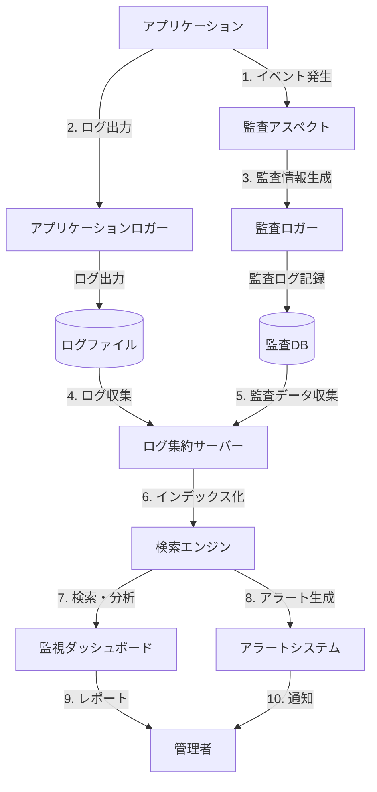

# SES業務システム 監査ログ機能詳細設計：概要

## 1. はじめに

### 1.1 目的

本ドキュメントは、SES業務システムにおける監査ログ機能の詳細設計を定義するものである。システム内の重要なイベントや操作を記録し、セキュリティ監視、コンプライアンス対応、トラブルシューティングを可能にする仕組みについて詳細に記述する。

### 1.2 対象範囲

本設計では、以下の監査・ログ機能を対象とする：

1. **セキュリティ監査ログ**：認証・認可、機密データアクセス等のセキュリティ関連イベント
2. **業務監査ログ**：業務データの作成・変更・削除等の業務処理イベント
3. **システム監査ログ**：システム起動・停止、バッチ処理等のシステムイベント
4. **アプリケーションログ**：アプリケーションの動作状況、エラー、パフォーマンス情報等
5. **ログの収集・保存・検索・モニタリング**：ログの集中管理と活用の仕組み

### 1.3 関連ドキュメント

- [基本設計書：セキュリティ設計](/docs/02_基本設計/システム設計/05_セキュリティ設計.html)
- [基本設計書：ログ設計](/docs/02_基本設計/システム設計/12_ログ設計.html)
- [詳細設計：認証・認可機能](/docs/03_詳細設計/05_セキュリティ/02_認証認可設計.md)
- [詳細設計：データ保護機能](/docs/03_詳細設計/05_セキュリティ/03_データ保護設計.md)

## 2. 監査・ログ機能の全体アーキテクチャ

### 2.1 アーキテクチャ概要図



### 2.2 コンポーネント構成

| コンポーネント名 | 種別 | 責務 |
|---------------|------|------|
| AuditLoggerService | サービス | 監査イベントのログ記録 |
| AuditAspect | AOP | メソッド呼び出しの自動監査 |
| ApplicationLogger | ユーティリティ | アプリケーションログの記録 |
| AuditEventRepository | リポジトリ | 監査イベントのDB保存 |
| AuditEventEntity | エンティティ | 監査イベントのデータモデル |
| LogbackConfiguration | 設定 | ログバック設定 |
| ElasticsearchClient | クライアント | Elasticsearchとの連携 |
| AuditEventController | コントローラー | 監査イベント検索API |
| AuditEventSearchService | サービス | 監査イベント検索 |
| LogAnalysisService | サービス | ログ分析・アラート |

### 2.3 ログ分類体系

| ログ分類 | 概要 | 記録媒体 | 保存期間 |
|---------|------|---------|---------|
| セキュリティ監査ログ | 認証・認可、機密データアクセス等 | DB + ファイル | 3年 |
| 業務監査ログ | 業務データの作成・変更・削除等 | DB + ファイル | 2年 |
| システム監査ログ | システム起動・停止、バッチ処理等 | ファイル | 1年 |
| アプリケーションログ | 動作状況、エラー、パフォーマンス | ファイル | 3ヶ月 |
| アクセスログ | HTTPアクセス履歴 | ファイル | 6ヶ月 |

## 3. 監査・ログ要件

### 3.1 法的・規制要件

以下の法的・規制要件に対応した監査ログ機能を実装する：

1. **個人情報保護法**
   - 個人データへのアクセス記録
   - 個人データの変更履歴

2. **電子帳簿保存法**
   - 取引データの変更履歴
   - データの完全性確保（改ざん防止）

3. **J-SOX**（日本版SOX法）
   - 財務情報の操作記録
   - アクセス制御の有効性確認

4. **ISMS認証（ISO/IEC 27001）**
   - セキュリティインシデントの記録
   - システム利用の監視

### 3.2 セキュリティ要件

以下のセキュリティ要件に準拠した監査ログを実装する：

1. **ログの完全性**
   - ログの改ざん防止
   - ログの欠落防止

2. **ログの機密性**
   - 機密情報のマスキング
   - ログへのアクセス制御

3. **ログの可用性**
   - リアルタイム性確保
   - 長期保存と検索性

4. **識別と関連付け**
   - ユーザーとの関連付け
   - セッションとの関連付け
   - トランザクションとの関連付け

### 3.3 監査対象イベント

以下のイベントを監査の対象とする：

#### 3.3.1 セキュリティイベント

| イベント種別 | 詳細 | 重要度 |
|------------|------|-------|
| 認証 | ログイン成功・失敗、ログアウト、パスワード変更 | 高 |
| 認可 | 権限変更、アクセス拒否、特権操作 | 高 |
| データアクセス | 機密データの閲覧、ダウンロード、エクスポート | 高 |
| セキュリティ設定 | セキュリティ設定の変更 | 最高 |

#### 3.3.2 業務イベント

| イベント種別 | 詳細 | 重要度 |
|------------|------|-------|
| マスタデータ | マスタデータの登録・変更・削除 | 中 |
| 技術者情報 | 技術者情報の登録・変更・削除 | 中 |
| 契約情報 | 契約の登録・変更・承認・キャンセル | 高 |
| 請求情報 | 請求書の作成・変更・承認・送信 | 高 |
| 支払情報 | 支払の登録・変更・承認・実行 | 高 |

#### 3.3.3 システムイベント

| イベント種別 | 詳細 | 重要度 |
|------------|------|-------|
| システム状態 | 起動・停止、設定変更 | 中 |
| バッチ処理 | 開始・終了、エラー | 中 |
| バックアップ | 開始・終了、成功・失敗 | 中 |
| エラー | 重大なシステムエラー | 高 |
| パフォーマンス | 重要な性能指標の閾値超過 | 中 |

## 4. 監査ログの内容

### 4.1 共通項目

すべての監査ログに含める共通項目：

| 項目名 | 説明 | 例 |
|-------|------|-----|
| eventId | イベント識別子（UUID） | `550e8400-e29b-41d4-a716-446655440000` |
| timestamp | イベント発生日時（ISO 8601形式） | `2025-06-01T13:45:30.123+09:00` |
| eventType | イベント種別 | `AUTH_LOGIN`, `DATA_ACCESS` |
| severity | 重要度 | `INFO`, `WARNING`, `ERROR`, `CRITICAL` |
| subjectType | 主体種別 | `USER`, `SYSTEM`, `BATCH` |
| subjectId | 主体識別子 | ユーザーID、システム名、バッチID等 |
| action | 実行された操作 | `CREATE`, `READ`, `UPDATE`, `DELETE` |
| resourceType | 対象リソース種別 | `USER`, `ENGINEER`, `CONTRACT` |
| resourceId | 対象リソース識別子 | リソースのID |
| outcome | 処理結果 | `SUCCESS`, `FAILURE` |
| clientIp | クライアントIPアドレス | `192.168.1.100` |
| userAgent | ユーザーエージェント | `Mozilla/5.0 (Windows NT 10.0; ...)` |
| sessionId | セッション識別子 | `ses_12345abcdef` |
| requestId | リクエスト識別子 | `req_6789ghijkl` |

### 4.2 イベント固有項目

イベント種別ごとの固有項目（JSONフォーマット）：

#### 4.2.1 認証イベント

```json
{
  "auth": {
    "method": "PASSWORD",  // 認証方式（PASSWORD, MFA, SSO等）
    "failureReason": "INVALID_CREDENTIALS",  // 失敗理由（失敗時のみ）
    "newCredential": false,  // 新しい認証情報が作成されたか
    "mfaUsed": false  // 多要素認証が使用されたか
  }
}
```

#### 4.2.2 データアクセスイベント

```json
{
  "dataAccess": {
    "operation": "EXPORT",  // 操作種別（VIEW, EXPORT, BULK_ACCESS等）
    "fields": ["personalInfo", "contractDetails"],  // アクセスされたフィールド
    "filters": {"departmentId": 123},  // 適用されたフィルタ
    "recordCount": 15,  // アクセスされたレコード数
    "dataClassification": "CONFIDENTIAL"  // データ分類
  }
}
```

#### 4.2.3 データ変更イベント

```json
{
  "dataChange": {
    "changeType": "UPDATE",  // 変更種別（CREATE, UPDATE, DELETE等）
    "changedFields": ["address", "phoneNumber"],  // 変更されたフィールド
    "oldValues": {"address": "旧住所", "phoneNumber": "旧電話番号"},  // 変更前の値
    "newValues": {"address": "新住所", "phoneNumber": "新電話番号"},  // 変更後の値
    "changeReason": "USER_REQUEST"  // 変更理由
  }
}
```

### 4.3 ログ形式

システムでは以下のログ形式を採用する：

#### 4.3.1 監査ログ（JSON形式）

```json
{
  "eventId": "550e8400-e29b-41d4-a716-446655440000",
  "timestamp": "2025-06-01T13:45:30.123+09:00",
  "eventType": "DATA_ACCESS",
  "severity": "INFO",
  "subjectType": "USER",
  "subjectId": "user123",
  "action": "READ",
  "resourceType": "CONTRACT",
  "resourceId": "contract456",
  "outcome": "SUCCESS",
  "clientIp": "192.168.1.100",
  "userAgent": "Mozilla/5.0 (Windows NT 10.0; ...)",
  "sessionId": "ses_12345abcdef",
  "requestId": "req_6789ghijkl",
  "details": {
    "dataAccess": {
      "operation": "VIEW",
      "fields": ["contractNumber", "amount", "startDate", "endDate"],
      "dataClassification": "CONFIDENTIAL"
    }
  }
}
```

#### 4.3.2 アプリケーションログ（構造化ログ形式）

```
2025-06-01 13:45:30.123 [INFO] [requestId=req_6789ghijkl] [user=user123] [thread=http-nio-8080-exec-1] jp.co.example.controller.ContractController: Contract retrieved successfully. contractId=contract456
```

## 5. ファイル構成と詳細設計

監査・ログ機能の詳細設計は以下のファイルに分けて記述する：

1. [監査ログ設計_01_概要.md](/docs/03_詳細設計/05_セキュリティ/05_監査ログ設計_01_概要.md) - 本ファイル
2. [監査ログ設計_02_収集.md](/docs/03_詳細設計/05_セキュリティ/05_監査ログ設計_02_収集.md) - 監査ログ収集の仕組み
3. [監査ログ設計_03_保存.md](/docs/03_詳細設計/05_セキュリティ/05_監査ログ設計_03_保存.md) - 監査ログ保存の仕組み
4. [監査ログ設計_04_検索.md](/docs/03_詳細設計/05_セキュリティ/05_監査ログ設計_04_検索.md) - 監査ログ検索の仕組み
5. [監査ログ設計_05_分析.md](/docs/03_詳細設計/05_セキュリティ/05_監査ログ設計_05_分析.md) - 監査ログ分析・アラートの仕組み

## 6. 参照情報

- [NIST SP 800-92: セキュリティログ管理ガイド](https://csrc.nist.gov/publications/detail/sp/800-92/final)
- [OWASP Logging Cheat Sheet](https://cheatsheetseries.owasp.org/cheatsheets/Logging_Cheat_Sheet.html)
- [Spring Boot Logging Documentation](https://docs.spring.io/spring-boot/docs/current/reference/html/features.html#features.logging)
- [Elastic Stack Documentation](https://www.elastic.co/guide/index.html)